# Part 054 — Lambda Concurrency and Throttling

Lambda scaling is powerful because it is fast.

Lambda scaling is dangerous because it is fast.

Most Lambda incidents are not caused by the function being unable to run. They are caused by the function running too much, too quickly, against a downstream system that cannot absorb the burst.

A production engineer does not ask only:

> “Can Lambda scale?”

They ask:

> “What should Lambda be allowed to scale into?”

Concurrency is the answer.

---

## 1. Concurrency Mental Model

Lambda concurrency is the number of execution environments processing invocations at the same time.

```txt
concurrency = request_rate_per_second × average_duration_seconds
```

Example:

```txt
100 requests/second × 0.2 seconds = 20 concurrent executions
```

If the downstream database slows down and duration becomes 2 seconds:

```txt
100 requests/second × 2 seconds = 200 concurrent executions
```

Same traffic. Ten times the concurrency.

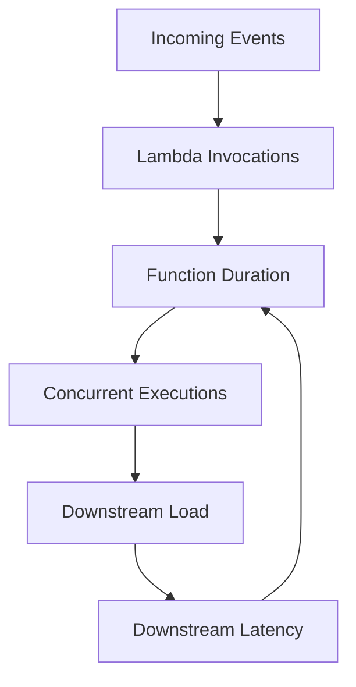

This feedback loop is the core Lambda scaling risk.

When downstream gets slower, Lambda concurrency can rise, creating more downstream pressure, making downstream slower again.

---

## 2. Concurrency Is Not Throughput

Concurrency and throughput are related but different.

```txt
throughput = concurrency / duration
```

If concurrency is 100:

| Duration | Approx Throughput |
|---:|---:|
| 100 ms | 1000 req/s |
| 500 ms | 200 req/s |
| 1 s | 100 req/s |
| 5 s | 20 req/s |

Lower duration increases throughput with the same concurrency.

This means performance optimization is also capacity optimization.

A function that gets twice as fast can often handle twice the traffic with the same concurrency limit.

---

## 3. Account Concurrency

Lambda has a regional account concurrency pool.

All functions in the Region share this pool unless concurrency is reserved per function.

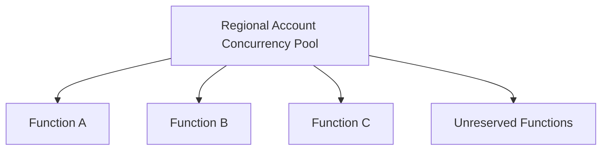

Without guardrails, one noisy function can consume the pool and throttle unrelated functions.

### Noisy Neighbor Example

```txt
regional concurrency limit = 1000

analytics-replay-function spikes to 1000
payment-api-function needs 50
payment-api-function is throttled
```

The payment API did nothing wrong. It was starved by a neighbor.

Reserved concurrency prevents this.

---

## 4. Reserved Concurrency

Reserved concurrency has two effects:

1. It reserves concurrency for a function.
2. It caps the function at that same number.

```txt
reserved concurrency = guaranteed slice + maximum cap
```

If a function has reserved concurrency 100:

- no other function can use that 100;
- the function cannot exceed 100 concurrent executions.

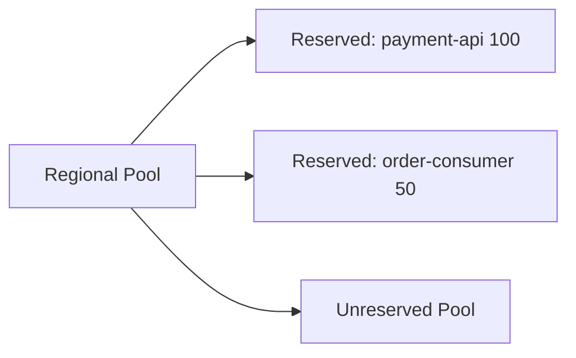

### Use Reserved Concurrency For

- protecting critical functions;
- isolating noisy functions;
- capping queue consumers;
- protecting databases;
- creating tenant/function bulkheads;
- emergency stop by setting concurrency to zero;
- keeping account-level concurrency available for other workloads.

### Reserved Concurrency Is a Bulkhead

For a queue consumer:

```txt
reserved concurrency = maximum downstream parallelism
```

If the database can safely handle 40 concurrent writes:

```txt
reserved concurrency <= 40
```

Do not set reserved concurrency based only on desired Lambda throughput. Set it based on downstream safety.

---

## 5. Reserved Concurrency as Emergency Brake

Setting reserved concurrency to `0` intentionally throttles the function.

Use cases:

- stop poison message processing;
- stop duplicate side effects;
- stop downstream overload;
- pause a broken async consumer;
- prevent further damage during incident.

Emergency command:

```bash
aws lambda put-function-concurrency \
  --function-name payment-consumer \
  --reserved-concurrent-executions 0
```

Restore:

```bash
aws lambda delete-function-concurrency \
  --function-name payment-consumer
```

Or set a safe number:

```bash
aws lambda put-function-concurrency \
  --function-name payment-consumer \
  --reserved-concurrent-executions 10
```

This is not a long-term fix. It is a circuit breaker for humans.

---

## 6. Provisioned Concurrency

Provisioned concurrency pre-initializes execution environments for a function version or alias.

It is used for latency, not downstream protection.

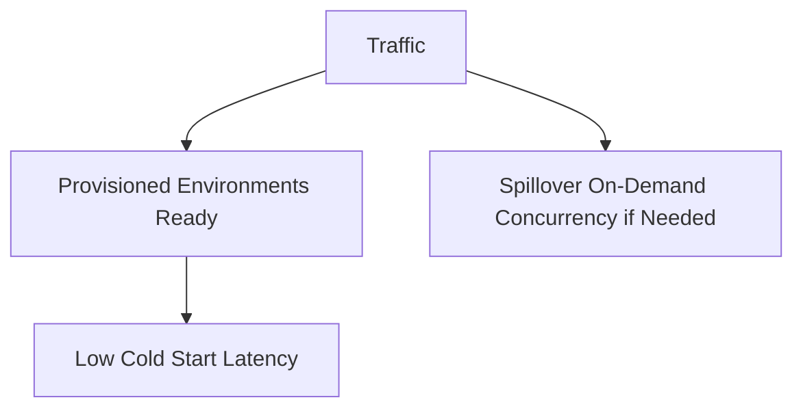

### Use Provisioned Concurrency For

- latency-sensitive APIs;
- Java/.NET cold-start-sensitive functions;
- predictable traffic windows;
- known launch events;
- scheduled business peaks;
- functions where SnapStart is unavailable/insufficient.

### Do Not Use It For

- hiding slow downstream;
- fixing idempotency;
- protecting database capacity;
- making async workloads correct;
- avoiding proper timeout design.

Provisioned concurrency is paid readiness.

Reserved concurrency is capacity control.

---

## 7. Reserved vs Provisioned Concurrency

| Question | Reserved Concurrency | Provisioned Concurrency |
|---|---|---|
| Caps max concurrency? | yes | no, not by itself |
| Reserves account concurrency? | yes | yes for allocated environments |
| Reduces cold start? | no | yes |
| Protects downstream? | yes if cap is set correctly | no |
| Used on alias/version? | function-level | alias/version-level |
| Emergency brake? | yes, set to 0 | no |
| Main purpose | isolation/bulkhead | latency |

### Combined Pattern

For latency-sensitive API:

```txt
reserved concurrency = 200
provisioned concurrency on prod alias = 50
```

Meaning:

- first 50 concurrent requests get pre-initialized environments if available;
- function can scale above 50 up to 200;
- function cannot exceed 200;
- downstream can be sized for max 200.

---

## 8. Throttling

Throttling happens when Lambda cannot accept more concurrent invocations for a function or account.

Common reasons:

- account concurrency limit reached;
- function reserved concurrency reached;
- event source maximum concurrency reached;
- scaling rate limit reached;
- provisioned concurrency exhausted and on-demand path limited/throttled;
- downstream integration throttles before Lambda.

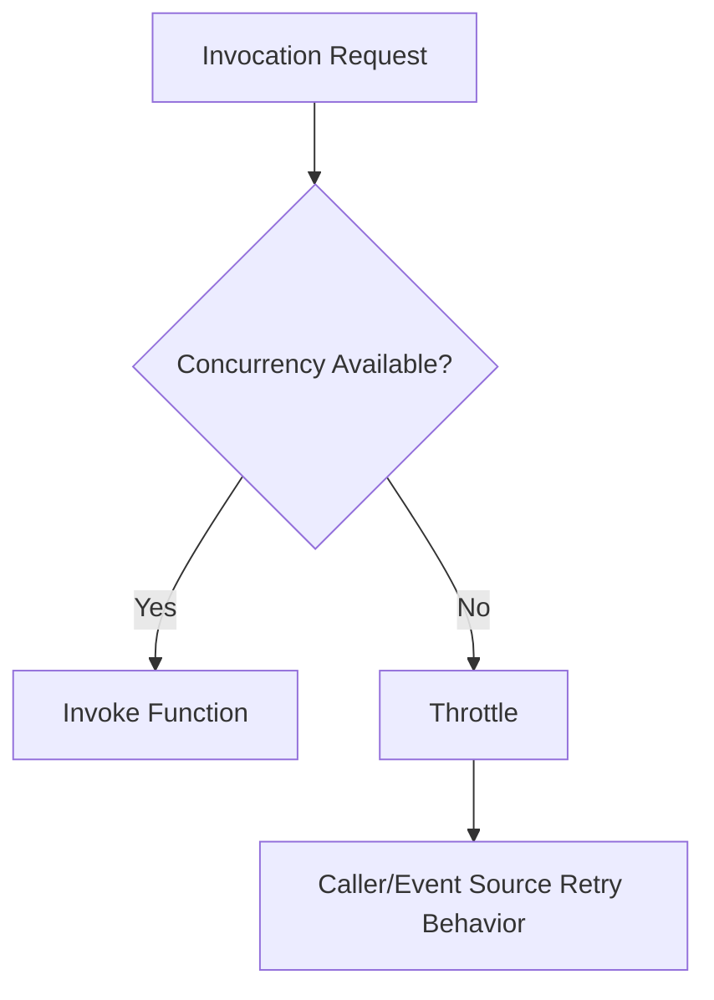

Throttling behavior depends on invocation mode.

---

## 9. Throttling by Invocation Mode

### 9.1 Synchronous Invocation

Example:

```txt
API Gateway -> Lambda
```

If Lambda throttles, the caller path receives an error.

Possible symptoms:

- HTTP 429/5xx depending integration mapping;
- API Gateway integration error;
- client retry storm;
- elevated latency;
- user-visible failure.

Mitigation:

- reserved concurrency sized correctly;
- API Gateway throttling below Lambda capacity;
- client retry with jitter;
- queue boundary for non-immediate work;
- provisioned concurrency if cold-start latency is issue;
- better duration/performance.

### 9.2 Asynchronous Invocation

Example:

```txt
EventBridge/SNS/S3 -> Lambda async
```

If function is throttled, Lambda async retry behavior applies.

Symptoms:

- async event age increases;
- retries occur later;
- DLQ/destination may receive failed events;
- producer may already think event was accepted;
- failure is not directly visible to original producer.

Mitigation:

- monitor async event age;
- configure destination/DLQ;
- reserved concurrency for critical consumers;
- route through SQS if backpressure/isolation needed;
- avoid unbounded fanout.

### 9.3 Poll-Based Event Source Mapping

Example:

```txt
SQS -> Lambda
Kinesis -> Lambda
DynamoDB Streams -> Lambda
```

If function cannot consume fast enough:

- queue backlog grows;
- age of oldest message rises;
- iterator age rises;
- stream shard progress slows;
- DLQ may eventually receive failed records;
- poison messages can block progress depending source.

Mitigation:

- tune batch size/window;
- partial batch response;
- maximum concurrency;
- reserved concurrency;
- shard/partition design;
- DLQ/redrive;
- downstream bulkhead.

---

## 10. SQS Event Source Scaling

SQS + Lambda is a core pattern, but it needs capacity control.

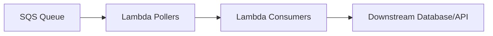

Scaling signals:

- queue depth;
- message age;
- function duration;
- batch size;
- concurrency;
- failure rate;
- downstream latency.

### Maximum Concurrency for SQS Mapping

SQS event source mapping can limit how many concurrent Lambda invocations it creates for a specific mapping.

This is useful when:

- one function has multiple queues;
- each queue needs separate bulkhead;
- reserved concurrency would be too coarse;
- downstream per-queue capacity differs.

Example conceptual policy:

```txt
high-priority queue maximum concurrency = 50
low-priority queue maximum concurrency = 10
function reserved concurrency = 80
```

The function cap protects the total. Mapping caps protect individual sources.

### Visibility Timeout Rule

```txt
visibility timeout > function timeout + retry/cleanup buffer
```

If not, the same message may become visible and be processed concurrently while the first attempt is still running.

---

## 11. Streams and Concurrency

Kinesis and DynamoDB Streams are shard-based.

Concurrency is constrained by shard/partition behavior.

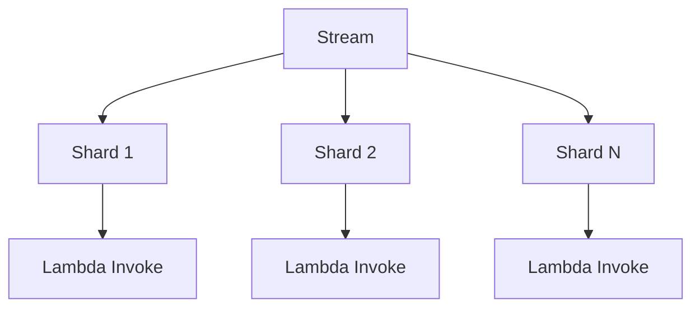

Important metrics:

- iterator age;
- batch size;
- batch window;
- function duration;
- errors;
- bisected batches;
- partial batch failures;
- throttles;
- shard count.

### Stream Failure Problem

If one poison record repeatedly fails, progress in that shard can stall.

Controls:

- partial batch response where supported;
- bisect batch on error;
- maximum retry attempts;
- maximum record age;
- failure destination;
- idempotency;
- poison record quarantine.

Concurrency alone does not solve stream failure. Stream ordering semantics matter.

---

## 12. API Gateway and Lambda Concurrency Mismatch

API Gateway and Lambda have separate quotas/throttles.

A common mistake:

```txt
API can admit more requests than Lambda can process
```

Then Lambda throttles and clients see failures.

Better:

```txt
API Gateway throttle <= safe Lambda throughput
Lambda reserved concurrency <= downstream capacity
client retries have jitter
non-critical work goes async
```

### Capacity Formula

For synchronous API:

```txt
safe_rps = reserved_concurrency / p95_duration_seconds
```

Example:

```txt
reserved concurrency = 100
p95 duration = 250 ms = 0.25 s

safe_rps ≈ 100 / 0.25 = 400 rps
```

But do not set API throttle exactly at theoretical max. Leave headroom.

```txt
api_throttle = 60-80% of safe_rps
```

---

## 13. Downstream Protection

Lambda can scale faster than most downstream systems.

Protect:

- relational database;
- third-party API;
- internal HTTP service;
- legacy SOAP endpoint;
- payment provider;
- search cluster;
- cache cluster;
- rate-limited SaaS API;
- Step Functions start execution quotas;
- EventBridge put events quotas.

### Bulkhead Pattern

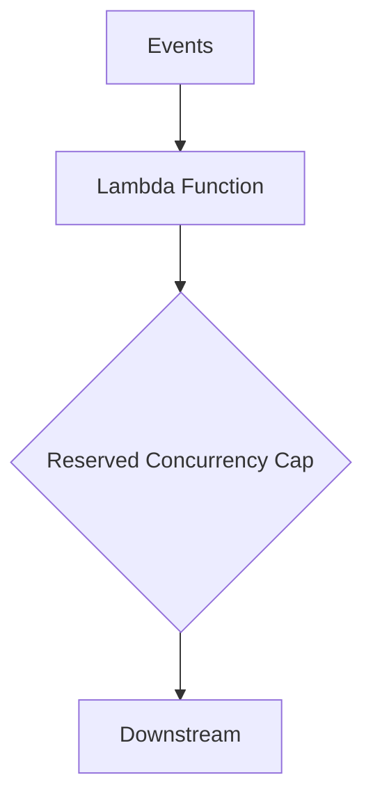

### Queue Buffer Pattern

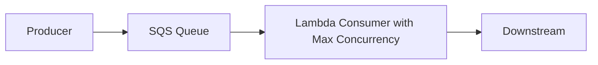

### Token Bucket Pattern

Use when:

- external API has strict rate limit;
- concurrency alone is insufficient;
- request rate must be shaped.

Can be implemented with:

- DynamoDB token bucket;
- reserved concurrency + per-invocation rate limiting;
- Step Functions distributed map controls;
- ECS worker for more stable long-running rate control.

### Circuit Breaker Pattern

When downstream is unhealthy:

- stop new work;
- fail fast;
- leave messages in queue;
- reduce concurrency;
- route to DLQ/quarantine if poison;
- alarm operator.

Reserved concurrency set to 0 is the manual circuit breaker.

---

## 14. Database Capacity Model

For Lambda functions writing to RDS:

```txt
max_db_connections =
  lambda_concurrency × pool_size_per_environment
```

Example:

```txt
reserved concurrency = 50
pool size = 2
max DB connections = 100
```

If no reserved concurrency:

```txt
potential DB connections = account concurrency × pool size
```

This is dangerous.

### DB-Safe Design

```txt
reserved concurrency <= safe DB writer parallelism
pool size small
query timeout short
transaction duration short
RDS Proxy if appropriate
queue buffer for spikes
idempotency for retries
```

### If DB Slows Down

What happens?

```txt
DB latency increases
Lambda duration increases
concurrency increases
DB connections increase
DB latency increases more
```

Break the loop with:

- reserved concurrency;
- SQS buffering;
- query timeouts;
- circuit breaker;
- RDS Proxy;
- load shedding;
- backpressure to API.

---

## 15. Async Retry Storms

Async Lambda failure can create retry storms when:

- function fails quickly;
- event source retries many events;
- downstream is unavailable;
- no concurrency cap exists;
- DLQ/destination not configured;
- error classification is weak.

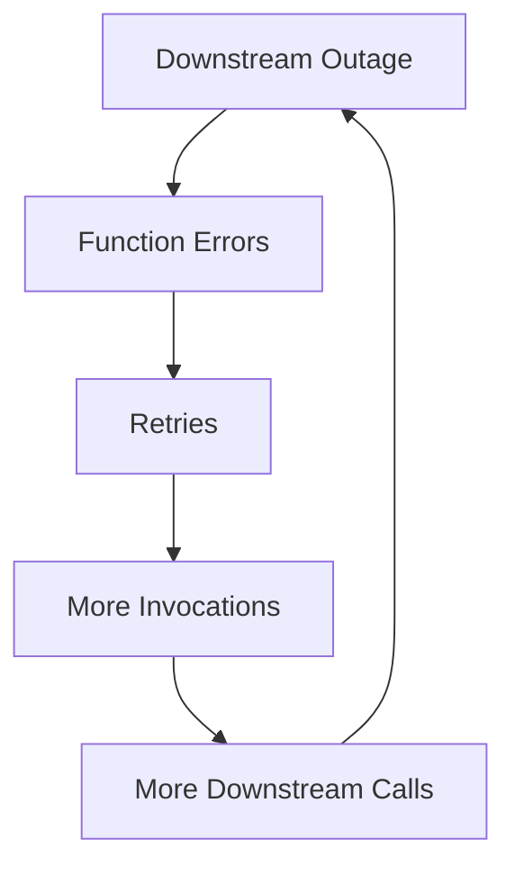

Mitigation:

- classify permanent vs retryable;
- cap concurrency;
- use queue buffer;
- circuit breaker;
- exponential backoff where source supports it;
- DLQ/destination;
- event age alarms;
- operator stop procedure.

Do not let retries become a distributed denial-of-service against your own dependency.

---

## 16. Concurrency and Cost

Concurrency is not directly billed.

Duration and memory are billed.

But concurrency drives:

- downstream cost;
- logging volume;
- trace volume;
- retry cost;
- queue backlog cost;
- provisioned concurrency cost;
- database scaling cost;
- incident cost.

Cost math:

```txt
total_compute_cost ∝ invocations × duration × memory
```

Capacity math:

```txt
required_concurrency = traffic × duration
```

Optimization that reduces duration can reduce both concurrency pressure and compute cost.

But optimization that increases memory may still be cheaper if duration drops enough.

Measure.

---

## 17. Concurrency Observability

Minimum CloudWatch metrics:

| Metric | Why |
|---|---|
| `ConcurrentExecutions` | active concurrency |
| `UnreservedConcurrentExecutions` | account pool pressure |
| `Throttles` | function throttling |
| `Duration` | capacity multiplier |
| `Errors` | retry pressure |
| `Invocations` | traffic |
| `IteratorAge` | stream lag |
| `AsyncEventAge` | async backlog |
| `DeadLetterErrors` | DLQ path failure |
| `ProvisionedConcurrentExecutions` | PC usage |
| `ProvisionedConcurrencyUtilization` | PC saturation |
| `ProvisionedConcurrencySpilloverInvocations` | traffic above PC |
| `ClaimedAccountConcurrency` | account-level concurrency pressure |

For SQS:

- queue depth;
- age of oldest message;
- messages visible/not visible;
- DLQ depth;
- Lambda batch failure count;
- consumer duration.

For DB:

- active connections;
- CPU;
- lock waits;
- deadlocks;
- query latency;
- connection acquisition time;
- max connections.

A Lambda dashboard without downstream metrics is incomplete.

---

## 18. Concurrency Alarms

### Critical API Function

Alarm on:

```txt
Throttles > 0
p95 Duration > budget
Errors > threshold
ProvisionedConcurrencySpillover > 0 if PC should cover expected traffic
ConcurrentExecutions near reserved concurrency
```

### Queue Consumer

Alarm on:

```txt
AgeOfOldestMessage rising
DLQ messages > 0
Lambda errors > threshold
ConcurrentExecutions at cap for sustained period
Duration rising
Downstream latency rising
```

### Stream Consumer

Alarm on:

```txt
IteratorAge rising
Errors > threshold
Throttles > 0
Batch failures
Record age near max
```

### Account-Level

Alarm on:

```txt
UnreservedConcurrentExecutions near zero
ClaimedAccountConcurrency near limit
Unexpected concurrency spike by function
```

---

## 19. Throttling Runbook

### Symptom

- Lambda `Throttles` metric > 0;
- API returns 429/5xx;
- async event age rises;
- SQS backlog grows;
- stream iterator age rises;
- downstream error increases.

### First Questions

1. Which function is throttled?
2. Is throttle account-level or function-level?
3. Is reserved concurrency configured?
4. Is event source maximum concurrency configured?
5. Is provisioned concurrency exhausted?
6. Did duration increase?
7. Did traffic increase?
8. Did downstream slow down?
9. Was there a deployment/config change?
10. Is throttling intentional as protection?

### Evidence Commands

```bash
aws lambda get-function-concurrency \
  --function-name payment-consumer

aws lambda get-account-settings

aws cloudwatch get-metric-statistics \
  --namespace AWS/Lambda \
  --metric-name Throttles \
  --dimensions Name=FunctionName,Value=payment-consumer \
  --statistics Sum \
  --period 60 \
  --start-time "$START" \
  --end-time "$END"
```

For SQS:

```bash
aws lambda list-event-source-mappings \
  --function-name payment-consumer

aws sqs get-queue-attributes \
  --queue-url "$QUEUE_URL" \
  --attribute-names ApproximateNumberOfMessages ApproximateAgeOfOldestMessage ApproximateNumberOfMessagesNotVisible
```

### Diagnosis

| Finding | Meaning |
|---|---|
| function at reserved concurrency | function cap reached |
| account unreserved near zero | account pool exhausted |
| duration spike before throttles | downstream slowdown or code regression |
| invocation spike before throttles | traffic burst |
| SQS backlog but no throttles | consumer too slow or mapping limit low |
| provisioned spillover | PC under-sized for traffic |
| throttles after deployment | performance regression or new concurrency cap |
| DB latency spike with concurrency spike | downstream feedback loop |

### Mitigation

| Cause | Mitigation |
|---|---|
| noisy non-critical function | set/rescale reserved concurrency |
| critical API throttled | raise reserved/account limit if downstream safe, reduce duration, throttle API |
| downstream overloaded | reduce reserved concurrency, buffer with queue, circuit break |
| SQS backlog | increase concurrency only if downstream safe |
| poison messages | partial batch response/quarantine/DLQ |
| slow code regression | rollback |
| PC spillover | increase PC or schedule PC for peak |
| account limit too low | request quota increase after proving safe downstream design |

Never raise concurrency blindly.

Increasing Lambda concurrency during downstream distress may make the incident worse.

---

## 20. Capacity Planning Worksheet

For each function:

```txt
function name:
invocation mode:
event source:
p50 duration:
p95 duration:
p99 duration:
peak rps/events per second:
required concurrency at p95:
downstream dependency:
safe downstream concurrency:
reserved concurrency:
provisioned concurrency:
event source max concurrency:
DLQ/destination:
timeout:
retry policy:
owner:
```

Example:

```txt
function: payment-api
mode: synchronous
source: API Gateway
p95 duration: 250 ms
peak rps: 300
required concurrency p95: 75
downstream: payment DB + fraud API
safe downstream concurrency: 120
reserved concurrency: 100
provisioned concurrency: 30 during business hours
API throttle: 250 rps steady, burst 400
timeout: 3s
```

For SQS:

```txt
function: invoice-worker
source: SQS
average duration per message: 200 ms
batch size: 10
duration per batch: 2s
safe DB writer concurrency: 20
event source max concurrency: 20
reserved concurrency: 25
visibility timeout: 60s
DLQ max receive count: 5
```

---

## 21. Multi-Tenant Concurrency

If one Lambda function serves many tenants, concurrency becomes tenant isolation problem.

Risks:

- one tenant consumes all concurrency;
- one tenant causes downstream pressure;
- noisy tenant increases latency for others;
- tenant-specific poison messages block shared queue;
- shared function cache leaks tenant assumptions.

Patterns:

### Function Per Tenant Class

```txt
premium-tenant-function reserved concurrency = 100
standard-tenant-function reserved concurrency = 300
```

### Queue Per Tenant or Tenant Class

```txt
tenant-a-queue -> mapping max concurrency 20
tenant-b-queue -> mapping max concurrency 5
```

### Tenant-Aware Rate Limit

Use token bucket keyed by tenant.

### Lambda Tenant Isolation Mode

For strict execution environment isolation by tenant, evaluate Lambda tenant isolation features where applicable and supported for your workload. This is a specialized design choice, not the default for ordinary multi-tenant functions.

### Rule

```txt
Shared Lambda function means shared concurrency unless you deliberately partition it.
```

---

## 22. Concurrency with Step Functions

Step Functions can control concurrency at workflow level.

Use it when:

- many parallel tasks must be bounded;
- external API rate limits matter;
- workflow-level visibility is needed;
- each unit can be retried independently;
- long-running orchestration is required.

Example:

```txt
Distributed Map max concurrency = 50
Lambda reserved concurrency = 60
downstream API rate limit = 50 parallel-safe calls
```

Do not let Step Functions start more Lambda work than the function/downstream can handle.

Concurrency limits must align across orchestration and function layers.

---

## 23. Concurrency with EventBridge

EventBridge fanout can multiply load.

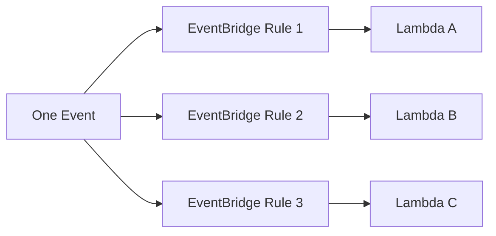

One producer event can become many Lambda invocations.

Risk:

- fanout explosion;
- all consumers retry simultaneously;
- shared downstream overload;
- hard-to-see event age;
- duplicate side effects.

Mitigation:

- route heavy consumers through SQS;
- use reserved concurrency per consumer;
- isolate critical consumers;
- monitor async event age and DLQs;
- design event schemas and filters carefully;
- avoid catch-all rules unless intended.

---

## 24. Concurrency Anti-Patterns

### Anti-Pattern 1 — No Reserved Concurrency Anywhere

All functions share regional pool. One spike can starve critical workloads.

### Anti-Pattern 2 — Reserved Concurrency Based Only on Traffic

You set concurrency to desired throughput but ignore database capacity.

### Anti-Pattern 3 — Provisioned Concurrency Used as Correctness Fix

PC reduces cold starts. It does not fix duplicate delivery, retries, or downstream overload.

### Anti-Pattern 4 — Raising Concurrency During DB Incident

More workers make a sick database sicker.

### Anti-Pattern 5 — Queue Consumer Without Backlog Alarms

Backpressure exists but nobody sees it.

### Anti-Pattern 6 — API Gateway Allows More Than Lambda Can Handle

Clients get throttles and retry storms.

### Anti-Pattern 7 — Function-Level Cap But Multiple Event Sources Compete

One queue starves another queue unless event source maximum concurrency or separate functions are used.

### Anti-Pattern 8 — Stream Consumer Ignores Iterator Age

Function appears healthy, but stream is hours behind.

### Anti-Pattern 9 — Long Duration Accepted as Normal

Duration is a concurrency multiplier. Slow functions consume more capacity.

---

## 25. Concurrency Design Review Checklist

### Function

- [ ] Invocation mode identified.
- [ ] p95/p99 duration measured.
- [ ] Peak traffic estimated.
- [ ] Required concurrency calculated.
- [ ] Timeout aligned with source/caller.
- [ ] Error/retry behavior known.

### Account

- [ ] Regional concurrency limit known.
- [ ] Critical functions have reserved concurrency.
- [ ] Noisy functions capped.
- [ ] Unreserved pool protected.
- [ ] Account concurrency alarms exist.

### Downstream

- [ ] Downstream safe parallelism known.
- [ ] DB connection math done.
- [ ] Third-party rate limits respected.
- [ ] Queue/stream backpressure visible.
- [ ] Circuit breaker procedure exists.

### Event Source

- [ ] SQS visibility timeout aligned.
- [ ] SQS maximum concurrency used where needed.
- [ ] Stream iterator age alarm exists.
- [ ] Async event age alarm exists.
- [ ] DLQ/destination configured.

### Latency

- [ ] Provisioned concurrency evaluated for strict latency.
- [ ] SnapStart evaluated for Java cold start where applicable.
- [ ] Spillover monitored.
- [ ] Cold/warm latency separated.

### Operations

- [ ] Throttling runbook exists.
- [ ] Emergency reserved concurrency to 0 procedure known.
- [ ] Dashboard includes Lambda and downstream.
- [ ] Load test includes downstream.
- [ ] Failure drill validates throttle behavior.

---

## 26. Final Mental Model

Lambda concurrency is not just a service limit.

It is the control surface for:

- latency;
- throughput;
- cost;
- downstream protection;
- tenant isolation;
- blast-radius control;
- retry amplification;
- incident containment.

The formula is simple:

```txt
concurrency = traffic × duration
```

The consequences are not simple.

A top-tier Lambda engineer treats concurrency as a system-level safety budget.

Not:

> “How high can Lambda scale?”

But:

> “How high should this function be allowed to scale before it harms the rest of the system?”

That question separates serverless usage from serverless engineering.

---

## References

- AWS Lambda Developer Guide: understanding Lambda function scaling
- AWS Lambda Developer Guide: configuring reserved concurrency
- AWS Lambda Developer Guide: configuring provisioned concurrency
- AWS Lambda Developer Guide: monitoring concurrency
- AWS Lambda Developer Guide: Lambda quotas
- AWS Lambda Developer Guide: configuring scaling behavior for SQS event source mappings
- AWS Lambda Developer Guide: event source mappings
