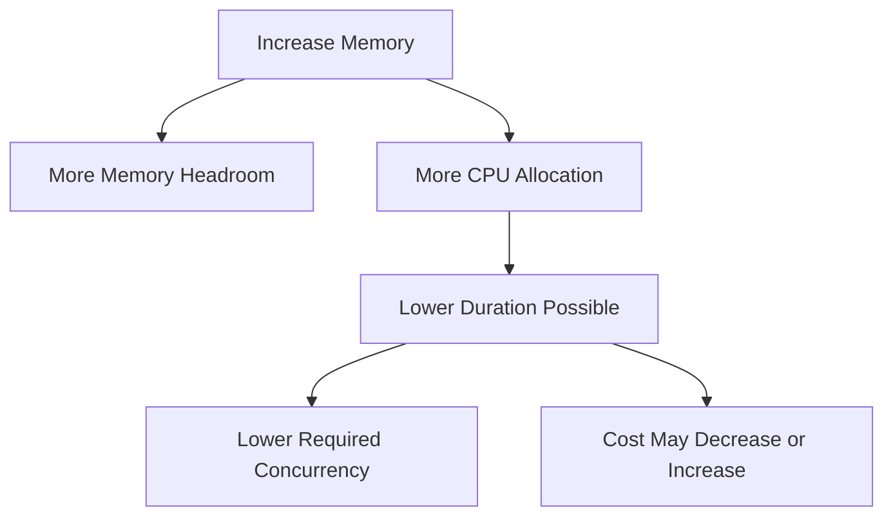

# Part 055 — Lambda Performance Tuning

Lambda performance tuning is not “increase memory until it feels fast.”

It is the discipline of shaping:

```txt
latency
throughput
cost
cold start
downstream pressure
retry behavior
operational visibility
```

A production Lambda function is a small distributed system participant. Tuning it means improving the entire invocation path, not only the handler code.

The core equation is:

```txt
required concurrency = traffic × duration
```

So any duration reduction affects:

- latency;
- concurrency pressure;
- downstream load;
- throttling risk;
- cost;
- queue backlog;
- user experience.

Performance tuning is capacity engineering.

---

## 1. Performance Model

A Lambda invocation has multiple time zones.


For synchronous APIs, user latency includes most of these.

For asynchronous workloads, user latency may not include handler time, but system lag does.

For queue/stream consumers, performance shows up as:

- message age;
- iterator age;
- backlog depth;
- processing throughput;
- retry amplification.

Do not tune only p50.

Tune the percentile that matters to the business:

| Workload | Key Percentile |
|---|---|
| user-facing API | p95/p99 latency |
| internal command API | p95 latency + timeout rate |
| queue consumer | age of oldest message + throughput |
| stream processor | iterator age |
| workflow step | state duration + retry count |
| batch job | total completion time |
| scheduled task | completion before deadline |

---

## 2. Memory Is Also CPU

Lambda memory configuration is not only memory. Lambda allocates CPU power proportionally with configured memory.

That means memory tuning affects:

- CPU-bound execution;
- JVM startup;
- JSON serialization;
- compression/decompression;
- encryption;
- image processing;
- dependency initialization;
- network client overhead;
- parallelism where runtime uses it;
- cost per millisecond.

Configured memory can be between 128 MB and 10,240 MB, and CPU increases proportionally. AWS documents that at 1,769 MB a function has the equivalent of one vCPU.



### Important Consequence

A function at 512 MB may be slower and more expensive than the same function at 1,024 MB if the duration drops enough.

Cost is not simply “more memory = more expensive.”

Cost is:

```txt
invocations × duration × configured memory price unit
```

If duration falls more than memory rises, total compute cost can fall.

---

## 3. The Tuning Surface

Performance tuning has multiple layers.

| Layer | Examples |
|---|---|
| runtime config | memory, timeout, architecture, ephemeral storage |
| packaging | ZIP/image size, dependencies, layers |
| initialization | static init, framework startup, SDK clients |
| handler code | algorithms, parsing, batching, idempotency |
| network | VPC path, NAT, endpoints, DNS, connection reuse |
| downstream | database/API latency, throttling, pooling |
| event source | batch size, batch window, concurrency |
| cold start mitigation | SnapStart, provisioned concurrency, dependency trimming |
| observability | measurement, traces, profiling, logs |
| cost | memory-duration curve, retries, logs, NAT, provisioned capacity |

Do not tune layer 1 while layer 6 is broken.

If downstream latency dominates, increasing Lambda memory may only amplify downstream pressure.

---

## 4. Measure Before Tuning

Start with a baseline.

Minimum baseline:

```txt
p50 duration
p95 duration
p99 duration
init duration
cold start rate
max memory used
configured memory
timeout
error rate
throttle count
concurrency
downstream latency
retry count
cost per 1M invocations
```

### CloudWatch Signals

| Metric | Why |
|---|---|
| `Duration` | primary latency/cost driver |
| `Init Duration` in logs | cold-start cost |
| `Max Memory Used` in REPORT log | memory headroom |
| `Errors` | retry/correctness pressure |
| `Throttles` | concurrency shortage |
| `ConcurrentExecutions` | scaling pressure |
| `IteratorAge` | stream lag |
| `AsyncEventAge` | async lag |
| SQS age/depth | backlog |
| downstream latency | root cause of many duration spikes |

### Structured Log Fields

```json
{
  "service": "invoice-worker",
  "cold_start": false,
  "batch_size": 10,
  "duration_ms": 832,
  "remaining_ms": 29100,
  "downstream_db_ms": 412,
  "serialization_ms": 25,
  "idempotency_ms": 18,
  "outcome": "SUCCESS"
}
```

Logs should separate:

- handler duration;
- downstream duration;
- serialization time;
- idempotency store time;
- batch size;
- cold/warm marker.

Otherwise, tuning becomes guessing.

---

## 5. Memory Tuning Method

Run tests across memory points with representative traffic.

Example points:

```txt
512 MB
1024 MB
1536 MB
1769 MB
2048 MB
3008 MB
4096 MB
```

For each point, record:

```txt
cold p95
warm p95
p99
cost per 1M
max memory used
init duration
downstream latency
error/throttle
```

### Example Result

| Memory | p95 Duration | Cost Relative | Notes |
|---:|---:|---:|---|
| 512 MB | 900 ms | 1.00x | CPU constrained |
| 1024 MB | 430 ms | 0.96x | better |
| 1769 MB | 240 ms | 0.92x | 1 vCPU equivalent |
| 2048 MB | 220 ms | 0.98x | slight improvement |
| 3008 MB | 210 ms | 1.35x | not worth it |

Best point may be 1,769 MB even though memory is higher.

### CPU-Bound vs IO-Bound

| Workload Type | Memory Increase Effect |
|---|---|
| CPU-bound JSON/compression/crypto | strong improvement |
| JVM cold start | often improves |
| network-bound downstream call | limited unless client overhead matters |
| database lock wait | no meaningful improvement |
| external API rate limit | no improvement |
| batch deserialization | may improve if CPU/memory constrained |
| huge file processing | may require memory and `/tmp` tuning |

If duration is dominated by a 2-second downstream API, memory tuning alone cannot fix it.

---

## 6. Timeout Tuning

Timeout is not a performance optimization knob. It is a safety boundary.

Bad:

```txt
Lambda timeout = 15 minutes
Downstream HTTP timeout = default/infinite
No remaining-time checks
```

Better:

```txt
Lambda timeout = business operation budget
Downstream timeouts < Lambda timeout
Remaining time checked before side effects
```

### Timeout Budget Example

For API:

```txt
client timeout: 10s
API integration budget: 8s
Lambda timeout: 9s
DB query timeout: 2s
HTTP downstream timeout: 2s
remaining-time safe cutoff: 3s
```

For SQS worker:

```txt
Lambda timeout: 60s
SQS visibility timeout: 180s
per-message operation timeout: 5s
batch size: 10
partial batch response: enabled
```

### Near-Timeout Alarm

Alarm when:

```txt
p95 duration > 70% of timeout
p99 duration > 85% of timeout
timeout count > 0
```

Timeouts create ambiguous side effects. Avoid getting close.

---

## 7. Cold Start Tuning

Cold start has multiple components.


### Cold Start Levers

| Lever | Effect |
|---|---|
| reduce dependencies | less load/init |
| reduce package/image size | less artifact overhead |
| static init discipline | less startup work |
| memory increase | more CPU for init |
| SnapStart | Java restore from initialized snapshot |
| provisioned concurrency | pre-initialized capacity |
| lazy init | avoid init work not needed for every invoke |
| extension trimming | reduce init/tail latency |
| framework tuning | reduce scanning/bootstrap |
| architecture choice | cost/perf differences |

### Cold Start Anti-Patterns

- giant framework for tiny function;
- network calls during static init;
- loading all tenant rules at startup;
- multiple observability extensions;
- huge image with build tools;
- many Lambda layers;
- no cold/warm metric separation;
- fake “warmer” as primary strategy.

### Better Cold Start Strategy

```txt
1. measure Init Duration
2. identify init components
3. trim dependencies
4. move unsafe work out of init
5. increase memory if CPU-bound
6. use SnapStart for Java where compatible
7. use provisioned concurrency for strict predictable latency
8. keep artifact governance
```

---

## 8. Java Performance Tuning

Java Lambda performance comes from controlling:

- classpath size;
- static initialization;
- framework bootstrap;
- JVM memory;
- SDK clients;
- HTTP clients;
- connection pools;
- serialization;
- batch memory;
- SnapStart safety.

### Java Startup Checklist

- measure classpath/framework init time;
- remove unused dependencies;
- initialize SDK clients statically;
- avoid per-invoke object mapper creation;
- configure heap headroom;
- evaluate SnapStart for synchronous Java functions;
- avoid database calls during init;
- avoid background schedulers;
- avoid request state in static fields.

### Java Handler Hot Path

Bad:

```java
public Result handle(Event event, Context context) {
    ObjectMapper mapper = new ObjectMapper();
    DynamoDbClient ddb = DynamoDbClient.builder().build();
    return process(mapper, ddb, event);
}
```

Better:

```java
private static final ObjectMapper MAPPER = new ObjectMapper();
private static final DynamoDbClient DDB = DynamoDbClient.builder().build();

public Result handle(Event event, Context context) {
    return process(MAPPER, DDB, event, context);
}
```

### Serialization

For high-throughput handlers:

- avoid unnecessary conversion `JSON -> Map -> JSON -> object`;
- validate event shape once;
- stream large payloads where possible;
- avoid huge object graphs for batch messages;
- reuse serializers;
- measure payload parsing time.

---

## 9. Dependency and Package Tuning

Package size is not the only issue. Dependency initialization matters.

### ZIP

- remove unused dependencies;
- avoid shipping test dependencies;
- check shaded JAR contents;
- avoid giant shared internal libraries;
- minimize layer count;
- keep layer versions governed.

### Container Image

- use multi-stage build;
- remove build tools;
- pin base image;
- keep runtime image minimal;
- avoid package manager caches;
- avoid copying source/test files;
- scan and measure image size;
- deploy by digest.

### Layer Risk

Layers can add cold-start and governance complexity.

Use layers for stable platform utilities, not rapidly changing business logic.

---

## 10. Ephemeral Storage Tuning

Lambda provides `/tmp` ephemeral storage unique to each execution environment. AWS documents configurable `/tmp` storage between 512 MB and 10,240 MB, in 1-MB increments, and it is encrypted at rest.

Use `/tmp` for:

- decompression;
- temporary file processing;
- local model/cache files;
- intermediate artifacts;
- sorting/merging data;
- image/PDF/video transformations;
- libraries that expect file paths.

Do not use `/tmp` for:

- durable state;
- idempotency records;
- cross-invocation correctness;
- transaction logs;
- tenant-sensitive cache without isolation;
- unlimited cache.

### Safe `/tmp` Pattern

```txt
versioned filename
checksum validation
bounded cache size
atomic write
cleanup strategy
fallback if missing/corrupt
no correctness dependency
```

Example:

```java
Path cache = Path.of("/tmp/schema-v4.json");

if (!Files.exists(cache) || !checksumValid(cache)) {
    Path tmp = Path.of("/tmp/schema-v4.json.tmp");
    downloadSchema(tmp);
    verifyChecksum(tmp);
    Files.move(tmp, cache, StandardCopyOption.ATOMIC_MOVE, StandardCopyOption.REPLACE_EXISTING);
}
```

### `/tmp` Performance Caveat

More ephemeral storage does not automatically make code faster. It only gives more space.

If you increase `/tmp`, measure:

- init duration;
- read/write time;
- memory usage;
- cost impact if applicable;
- SnapStart compatibility if relevant;
- cleanup behavior.

---

## 11. Payload Tuning

Payload size affects:

- network transfer;
- parsing time;
- memory usage;
- logs if accidentally logged;
- retries;
- event source cost;
- downstream latency.

Rules:

- pass references for large objects, not large payloads;
- store large documents in S3;
- pass object key/version/checksum;
- keep event envelope small;
- avoid logging full payload;
- compress only if CPU/cost trade-off is justified;
- validate payload size at producer boundary.

Example:

Bad:

```json
{
  "documentBase64": "..."
}
```

Better:

```json
{
  "documentRef": {
    "bucket": "case-documents",
    "key": "tenant-1/case-123/evidence.pdf",
    "versionId": "abc",
    "sha256": "..."
  }
}
```

A Lambda event should usually describe work, not carry the entire world.

---

## 12. Batch Tuning

For SQS/Kinesis/DynamoDB Streams, batch tuning controls throughput and failure blast radius.

| Parameter | Effect |
|---|---|
| batch size | records per invoke |
| batch window | latency vs batching efficiency |
| parallelization factor | stream shard parallelism |
| max concurrency | SQS consumer cap |
| partial batch response | retry only failed records |
| bisect batch on error | isolate poison records |
| max retry/record age | prevent infinite retry |

### Batch Size Trade-Off

Larger batch:

- higher throughput;
- fewer invocations;
- more memory;
- longer duration;
- larger retry unit;
- more partial failure complexity.

Smaller batch:

- lower memory;
- lower latency per record;
- more invokes;
- less efficient;
- easier failure isolation.

### SQS Formula

```txt
records_per_second ≈ concurrency × batch_size / duration_seconds
```

Example:

```txt
concurrency = 20
batch size = 10
duration = 2s

throughput ≈ 20 × 10 / 2 = 100 messages/s
```

If downstream can handle only 60 writes/s, this is too high even if Lambda can handle it.

---

## 13. Network Tuning

Lambda network performance is affected by:

- VPC attachment;
- NAT gateway path;
- VPC endpoints;
- DNS;
- security group rules;
- connection reuse;
- TLS handshake;
- downstream latency;
- client timeout;
- payload size.

### Connection Reuse

Reuse clients outside handler.

Bad:

```java
HttpClient.newHttpClient()
```

inside every invocation.

Better:

```java
private static final HttpClient HTTP = HttpClient.newBuilder()
        .connectTimeout(Duration.ofMillis(500))
        .build();
```

### Timeouts

Every network call needs explicit timeout.

```java
HttpRequest request = HttpRequest.newBuilder(uri)
        .timeout(Duration.ofSeconds(2))
        .build();
```

### DNS

Avoid per-request client creation that forces repeated DNS/TLS setup.

High DNS volume can create latency and shared infrastructure pressure.

---

## 14. Downstream Tuning

Many Lambda performance problems are downstream problems.

### Diagnose Duration

Break duration into:

```txt
handler parsing
idempotency store
database
external HTTP
event publish
serialization
telemetry
```

If database is 80% of duration, tune database path first.

### Common Downstream Fixes

| Problem | Fix |
|---|---|
| DB connection acquisition slow | reduce pool, RDS Proxy, reserved concurrency |
| DB query slow | index/query/transaction tuning |
| downstream HTTP slow | timeout, retry budget, circuit breaker |
| third-party rate limit | queue + token bucket |
| event publish throttled | batch, backoff, quota, decouple |
| S3 large object slow | range/read strategy, avoid unnecessary transfer |
| DynamoDB throttling | key design, capacity, retry budget |

Lambda memory does not fix bad database indexes.

---

## 15. Architecture Tuning

Sometimes the function is not the problem. The architecture is.

### Use Lambda Directly When

- work is short;
- side effect is bounded;
- event source retry semantics fit;
- concurrency is safe;
- latency is acceptable.

### Add SQS When

- producer burst exceeds consumer capacity;
- downstream needs backpressure;
- retry should be durable;
- failure isolation matters.

### Add Step Functions When

- operation is multi-step;
- compensation is needed;
- human/manual wait exists;
- timeout spans multiple tasks;
- audit trail matters.

### Use ECS/EKS/App Runner When

- workload is long-running;
- connection-heavy;
- low-latency always-on;
- sustained CPU-heavy;
- custom runtime/host control needed;
- process-level debugging matters.

Performance tuning can reveal that Lambda is the wrong contract.

That is a valid engineering outcome.

---

## 16. Cost-Aware Performance Tuning

Cost and performance must be tuned together.

### Cost Drivers

- invocation count;
- duration;
- memory;
- provisioned concurrency;
- logs;
- traces;
- NAT gateway/data processing;
- retries;
- queue/stream/event bus;
- downstream reads/writes;
- DLQ/redrive;
- storage and ephemeral processing.

### Example Cost Trap

A function logs full payload for every invocation.

```txt
duration tuning saves $50/month
log volume costs $900/month
```

Optimize the whole system.

### Memory Cost Curve

For each memory point:

```txt
cost_per_invocation = duration_ms × memory_gb × price
```

Choose the point that meets latency SLO at acceptable cost.

Not always the cheapest.

Not always the fastest.

The right point is often:

```txt
lowest cost while meeting p95/p99 latency and downstream safety
```

---

## 17. Load Testing Lambda

Load testing must include:

- realistic event shape;
- realistic payload size;
- cold and warm behavior;
- downstream dependencies;
- retries;
- throttling;
- concurrency cap;
- queue backlog;
- failure modes;
- observability cost.

### API Load Test

Measure:

- p50/p95/p99 latency;
- cold start rate;
- integration errors;
- Lambda throttles;
- downstream latency;
- DB connections;
- provisioned concurrency spillover.

### Queue Consumer Load Test

Measure:

- messages/sec processed;
- age of oldest message;
- Lambda concurrency;
- errors;
- partial batch failures;
- DLQ;
- downstream latency;
- recovery time after backlog.

### Stream Load Test

Measure:

- iterator age;
- shard throughput;
- poison record behavior;
- checkpoint progress;
- batch duration.

Do not test Lambda alone with downstream mocked if the production risk is downstream pressure.

---

## 18. Profiling and Diagnostics

For deeper tuning:

- use tracing to find slow downstream calls;
- use structured timers for handler phases;
- use Java Flight Recorder or profiling tools carefully in test environments;
- compare cold/warm logs;
- track dependency initialization time;
- inspect GC only when memory/latency suggests it;
- inspect package contents;
- run dependency tree analysis;
- measure client construction overhead.

### Phase Timer Pattern

```java
Timer timer = Timer.start();

ParsedEvent event = timer.measure("parse", () -> parse(input));
Config config = timer.measure("config", () -> ConfigProvider.get());
Result result = timer.measure("business", () -> service.handle(event, config));
timer.measure("publish", () -> eventPublisher.publish(result));

log.info("phase_timings={}", timer.summary());
```

Do not overdo instrumentation. But for performance tuning, phase timing is often the shortest path to truth.

---

## 19. Performance Runbook

### Symptom: Latency Increased

Questions:

1. Cold or warm latency?
2. Did duration increase after deployment?
3. Did init duration increase?
4. Did downstream latency increase?
5. Did memory usage increase?
6. Did batch size or event size change?
7. Did concurrency increase?
8. Did throttling occur?
9. Did retries increase?
10. Did logs/tracing extension change?

Evidence:

```bash
aws cloudwatch get-metric-statistics \
  --namespace AWS/Lambda \
  --metric-name Duration \
  --dimensions Name=FunctionName,Value=my-function \
  --statistics Average Maximum \
  --period 60 \
  --start-time "$START" \
  --end-time "$END"
```

Check logs for:

```txt
Init Duration
Max Memory Used
cold_start=true
downstream duration
error code
timeout budget
```

Diagnosis:

| Finding | Likely Cause |
|---|---|
| init duration spike | dependency/package/framework change |
| warm duration spike | code/downstream/data change |
| memory near limit | GC/memory pressure |
| concurrency spike | traffic or duration increase |
| throttles | concurrency cap/account limit |
| downstream latency spike | dependency issue |
| errors then retries | retry amplification |
| logs cost spike | verbose logging/payload logging |

Mitigation:

- rollback recent release;
- increase memory if CPU-bound and safe;
- reduce batch size if memory pressure;
- cap concurrency if downstream overloaded;
- increase provisioned concurrency if cold-start latency and traffic predictable;
- enable SnapStart if Java and compatible;
- route through queue if API is doing long work;
- fix downstream query/API bottleneck.

---

## 20. Performance Design Checklist

### Baseline

- [ ] p50/p95/p99 duration measured.
- [ ] cold/warm latency separated.
- [ ] init duration measured.
- [ ] max memory used known.
- [ ] timeout margin known.
- [ ] downstream phase timings captured.
- [ ] concurrency calculated.

### Runtime

- [ ] memory tuned across multiple points.
- [ ] architecture tested.
- [ ] timeout aligned.
- [ ] ephemeral storage sized deliberately.
- [ ] SnapStart/provisioned concurrency evaluated where relevant.

### Code

- [ ] SDK/HTTP clients reused.
- [ ] dependency graph reviewed.
- [ ] no network side effects during init.
- [ ] payload parsing efficient.
- [ ] batch size memory-safe.
- [ ] timeouts on all downstream calls.
- [ ] remaining-time guard before risky side effects.

### Event Source

- [ ] batch size/window tuned.
- [ ] SQS visibility timeout aligned.
- [ ] partial batch response enabled where appropriate.
- [ ] stream iterator age monitored.
- [ ] async event age monitored.
- [ ] DLQ/destination configured.

### Cost

- [ ] memory-duration cost curve measured.
- [ ] log volume controlled.
- [ ] trace sampling deliberate.
- [ ] NAT/VPC endpoint cost understood.
- [ ] retry cost visible.
- [ ] provisioned concurrency schedule/cost reviewed.

### Operations

- [ ] dashboard includes Lambda and downstream.
- [ ] performance regression alarms exist.
- [ ] load test exists.
- [ ] rollback path tested.
- [ ] runbook exists.

---

## 21. Final Mental Model

Lambda performance is not a single knob.

It is a system equation:

```txt
latency = init + handler + downstream + serialization + telemetry
capacity = traffic × duration
cost = invocations × duration × configured resources + surrounding services
risk = retries × side effects × concurrency
```

Tuning means improving this system without breaking correctness.

A top-tier engineer does not say:

> “Set memory to 1024 MB, done.”

They say:

> “Here is the measured memory-duration-cost curve, here is the cold/warm split, here is the downstream bottleneck, here is the concurrency impact, and here is the safe operating point.”

That is Lambda performance engineering.

---

## References

- AWS Lambda Developer Guide: configure function memory
- AWS Lambda Developer Guide: configure ephemeral storage
- AWS Lambda Developer Guide: execution environment lifecycle
- AWS Lambda Developer Guide: SnapStart
- AWS Lambda Developer Guide: monitoring Lambda functions
- AWS Lambda Developer Guide: event source mappings and scaling behavior
