# Part 056 — Lambda VPC Networking

Lambda functions do not always need a VPC.

By default, Lambda can access public AWS service endpoints and the public internet. When you attach a function to a VPC, outbound traffic goes through the VPC path, and the function can access resources reachable from that VPC.

That trade-off matters.

A VPC-attached Lambda is not “more secure” automatically.

It is a function whose network path is now part of your architecture.

You add VPC attachment when the function must reach private resources:

- RDS in private subnets;
- ElastiCache;
- private OpenSearch;
- internal ALB/NLB;
- private service endpoints;
- self-managed Kafka/MSK private connectivity;
- on-prem resources through VPN/Direct Connect;
- private APIs;
- VPC-only regulated data plane.

Do not attach every function to a VPC by default unless your organization has a clear network/security policy and understands the cost, routing, DNS, and operational implications.

---

## 1. The Core Mental Model

Without VPC attachment:

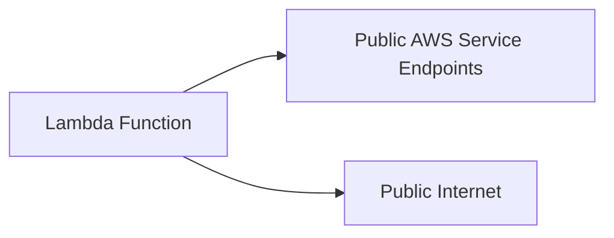

With VPC attachment:

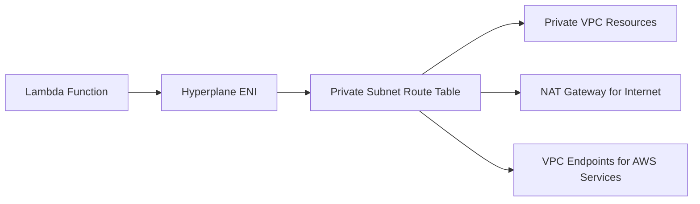

VPC attachment changes egress.

If your function is attached to a VPC and needs internet access, placing it in a public subnet is not enough. The function should use private subnets with a route to a NAT gateway or appropriate endpoints.

---

## 2. When to Attach Lambda to a VPC

### Attach to VPC When

| Need | Example |
|---|---|
| private database | RDS/Aurora in private subnet |
| private cache | ElastiCache/Redis |
| internal service | private ALB/NLB |
| private Kafka/MSK | event source/private brokers |
| on-prem access | Direct Connect/VPN routes |
| VPC-only endpoint | PrivateLink service |
| policy requires private network path | regulated workload |

### Avoid VPC Attachment When

| Case | Reason |
|---|---|
| function only calls DynamoDB/S3/EventBridge/SQS via public endpoints | VPC may add routing/cost complexity |
| simple webhook caller to public SaaS | NAT cost and network complexity |
| no private resources | unnecessary blast surface |
| function is latency-sensitive and VPC path not needed | avoid extra network dependencies |
| team lacks VPC runbook | operational risk |

### Middle Ground

Use VPC endpoints for AWS services when you want private connectivity from VPC-attached functions to supported AWS APIs without NAT.

Use SQS/EventBridge to decouple a non-VPC API handler from a VPC-attached worker.

Example:

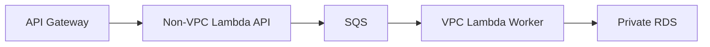

This avoids putting user-facing API latency directly on private database path when async boundary is acceptable.

---

## 3. Hyperplane ENI Model

Modern Lambda VPC networking uses Hyperplane ENIs.

A Hyperplane ENI is a managed network interface Lambda creates and manages to connect your function to VPC resources.

Key properties documented by AWS:

- Hyperplane ENIs are associated with a subnet/security group combination.
- Lambda can reuse the same ENI for functions using the same subnet and security group combination.
- Each Hyperplane ENI supports many connections/ports.
- Lambda can scale ENIs based on network traffic and concurrency.
- When first creating network resources for a combination, function state may remain Pending until ENI is ready.
- Lambda may reclaim unused Hyperplane ENIs after long idleness and recreate them later.
- Your design should not rely on ENI persistence.

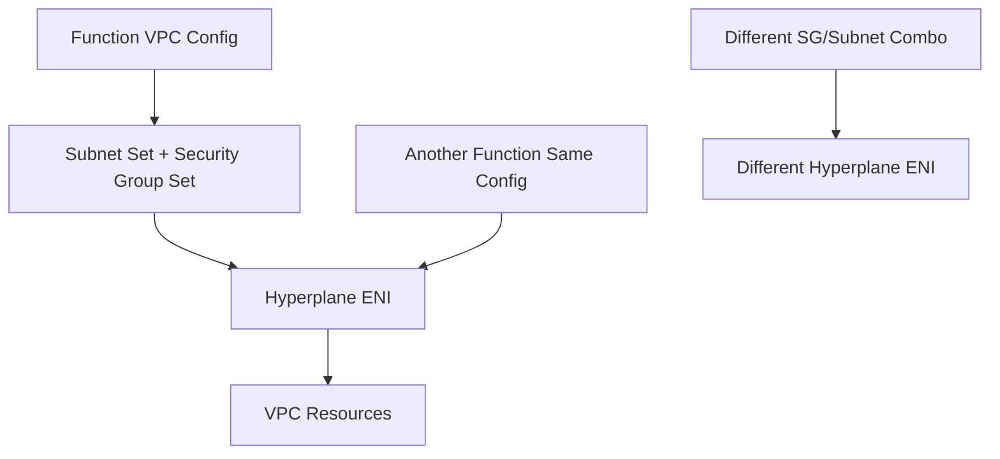

### Design Implication

Avoid unnecessary unique security group/subnet combinations for every function.

If every function has a unique combination, Lambda may need more separate Hyperplane ENI resources.

That does not mean all functions should share one security group. It means group functions by legitimate network access boundary.

---

## 4. Subnet Selection

Lambda VPC config requires subnets and security groups.

### Use Private Subnets

For most VPC-attached Lambda functions:

```txt
select private subnets across multiple AZs
```

Why:

- private resources are usually in private subnets;
- outbound internet path goes via NAT if needed;
- public subnet alone does not give Lambda internet access;
- multi-AZ subnets improve availability.

### Multi-AZ Selection

Select subnets in multiple AZs when downstream resources and routes support it.

Benefits:

- AZ fault tolerance;
- more IP/network distribution;
- reduced single-AZ dependency.

But do not blindly select all subnets if:

- some route tables are wrong;
- some subnets lack required endpoints/NAT route;
- downstream security group allows only certain CIDRs/security groups;
- private resource is single-AZ and latency/path matters.

Consistency matters.

### Subnet Checklist

- [ ] private route table correct;
- [ ] NAT route exists if internet needed;
- [ ] VPC endpoints exist if using private AWS API path;
- [ ] DNS support/hostnames enabled;
- [ ] subnet has enough IP capacity;
- [ ] security group path to downstream works;
- [ ] NACL does not block ephemeral ports;
- [ ] selected subnets match downstream AZ design.

---

## 5. Security Group Design

Security groups define network access.

For Lambda, the security group attached to function controls outbound traffic and is also used by downstream resources to allow inbound traffic from the function.

Pattern:

```txt
lambda-payment-worker-sg
  outbound:
    RDS SG port 5432
    Secrets Manager VPC endpoint SG port 443
    CloudWatch Logs endpoint SG port 443
    EventBridge/SQS endpoint SG port 443 if needed
```

For RDS:

```txt
rds-payment-sg inbound:
  allow 5432 from lambda-payment-worker-sg
```

Security group reference is better than broad CIDR where possible.

### Avoid

- `0.0.0.0/0` outbound by default without reason;
- one giant Lambda SG for all functions;
- per-function unique SG when access boundary is same;
- allowing DB from entire VPC CIDR;
- mixing dev/prod SGs;
- stale SG references after deleting functions;
- relying only on NACLs for app segmentation.

### Boundary Model

Use security groups to encode service-to-resource relationships:

```txt
payment-worker -> payment-db
case-indexer -> opensearch
notification-sender -> NAT or provider endpoint
```

Not:

```txt
all-lambdas -> all-databases
```

---

## 6. NAT Gateway vs VPC Endpoints

VPC-attached Lambda that needs AWS service APIs or internet egress needs a route.

### NAT Gateway

Use NAT when:

- calling public internet/SaaS APIs;
- calling AWS services without endpoints configured;
- dependencies require public endpoints;
- simplicity is more important than private endpoint specificity.

Cost concerns:

- hourly NAT gateway cost;
- data processing cost;
- cross-AZ data path if misconfigured;
- hidden cost from high-volume Lambda egress.

### VPC Endpoints

Use endpoints when:

- function calls AWS services frequently;
- private connectivity is required;
- reducing NAT dependency/cost is useful;
- security wants endpoint policies;
- service supports PrivateLink or gateway endpoint.

Types:

| Endpoint Type | Examples |
|---|---|
| gateway endpoint | S3, DynamoDB |
| interface endpoint | Secrets Manager, SQS, SNS, EventBridge, STS, ECR API, CloudWatch Logs, Lambda API, many others |

Gateway endpoints for S3 and DynamoDB provide connectivity without NAT/IGW. Interface endpoints use PrivateLink and have ENIs in subnets.

### Decision

```txt
public SaaS needed -> NAT
S3/DynamoDB high volume -> gateway endpoint
AWS APIs from private Lambda -> interface endpoint
mixed -> NAT + endpoints for high-volume/private-critical services
```

---

## 7. Common Endpoint Needs

For a private Lambda workload, consider endpoints for services it calls.

| Use | Possible Endpoint |
|---|---|
| read secrets | Secrets Manager / SSM |
| call SQS | SQS interface endpoint |
| publish SNS | SNS interface endpoint |
| put EventBridge events | EventBridge interface endpoint |
| write logs from VPC resources | CloudWatch Logs endpoint |
| call STS | STS endpoint |
| read/write S3 | S3 gateway endpoint |
| read/write DynamoDB | DynamoDB gateway endpoint |
| pull ECR image from private VPC resources | ECR API/DKR + S3 path for ECS/EKS; Lambda image pull is Lambda-service-managed but other compute differs |
| invoke Lambda API from inside VPC | Lambda interface endpoint |

Do not create endpoints blindly. Each interface endpoint has cost and security group management.

Endpoint selection is workload-specific.

---

## 8. Lambda to RDS

Lambda + RDS is common and risky.

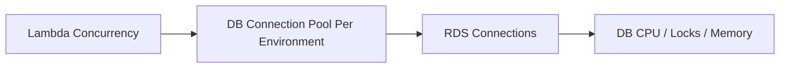

### Risks

- connection storm;
- pool multiplication;
- slow connection acquisition;
- transaction lock contention;
- failover storms;
- retry amplification;
- NAT/endpoint confusion for secrets/config;
- DNS cache behavior during failover;
- Lambda duration increase causing concurrency spiral.

### Guardrails

- reserved concurrency;
- small pool size;
- RDS Proxy where appropriate;
- short connection timeout;
- query timeout;
- transaction timeout;
- idempotent writes;
- SQS buffer for bursts;
- backpressure alarms;
- database connection metrics.

### Connection Math

```txt
max_connections_from_lambda =
  reserved_concurrency × max_pool_size_per_environment
```

If reserved concurrency is not set, the upper bound is unsafe.

### RDS Proxy Pattern

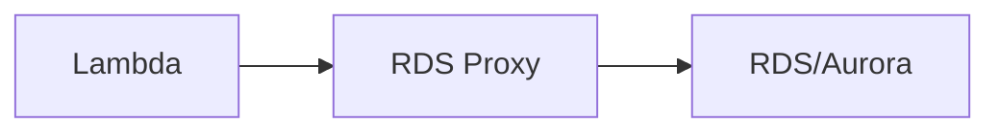

RDS Proxy can help pool/reuse DB connections, but it does not fix:

- bad queries;
- long transactions;
- missing idempotency;
- unbounded Lambda concurrency;
- lock contention;
- incorrect transaction isolation.

---

## 9. Lambda to ElastiCache / Redis

Redis from Lambda has similar risks:

- connection storms;
- too many clients;
- hot keys;
- command latency;
- reconnect storms;
- TLS overhead;
- cluster topology changes;
- reserved concurrency missing.

Patterns:

- reuse client outside handler;
- keep pool/client bounded;
- use short timeouts;
- monitor connection count;
- avoid per-invocation client creation;
- apply concurrency caps;
- avoid using Redis as only idempotency store unless persistence/eviction semantics are safe for business need.

---

## 10. Lambda to Internal HTTP Services

For internal ALB/NLB/private service:

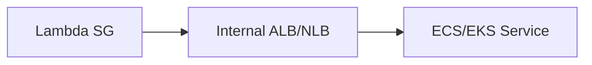

Check:

- Lambda subnets can route to load balancer;
- security group allows Lambda SG;
- NLB target/security model correct;
- DNS resolves inside VPC;
- client timeout shorter than Lambda timeout;
- retry budget bounded;
- service can handle Lambda concurrency;
- circuit breaker exists;
- ALB/NLB health is monitored.

Avoid direct Lambda burst into a small internal service without concurrency cap.

---

## 11. DNS Considerations

Lambda uses VPC DNS when attached to VPC.

DNS failures can appear as:

```txt
UnknownHostException
Temporary failure in name resolution
i/o timeout
```

Common causes:

- VPC DNS support disabled;
- wrong private hosted zone association;
- endpoint private DNS disabled;
- Route 53 resolver rules missing;
- on-prem DNS path failure;
- client creates new connections too often;
- DNS caching too aggressive or not enough;
- security group/NACL blocking resolver path;
- overloaded downstream DNS.

### Java DNS Notes

JVM DNS caching can affect failover behavior.

Review:

- TTL settings;
- SDK/client behavior;
- RDS/Aurora failover DNS behavior;
- service discovery TTL;
- retry strategy.

Do not set infinite DNS cache for infrastructure that fails over through DNS.

---

## 12. IPv6 and Dual-Stack

Lambda VPC networking can involve IPv4 and IPv6 depending subnet configuration and Lambda settings.

Use IPv6 deliberately when:

- VPC/subnets are dual-stack;
- downstream supports IPv6;
- egress strategy uses egress-only internet gateway;
- organization wants IPv6 address scaling;
- endpoint/service compatibility is verified.

Do not assume enabling IPv6 fixes IPv4 design mistakes.

You still need:

- route tables;
- security groups;
- DNS;
- downstream support;
- monitoring;
- failure tests.

---

## 13. IAM Permissions for VPC Attachment

To attach a Lambda function to a VPC, Lambda needs EC2 network interface permissions through the function execution role. AWS commonly provides `AWSLambdaVPCAccessExecutionRole`, or you can define a custom policy with required EC2 actions.

This creates a subtle risk:

The function code may also inherit permissions that allow EC2 network-interface operations unless you restrict access appropriately.

### Guardrail

Use IAM condition keys and policy design to restrict:

- which VPCs functions can attach to;
- which subnets;
- which security groups;
- who can create/update VPC configuration;
- what function code can do with EC2 permissions.

VPC attachment is both network and IAM design.

---

## 14. VPC Config as Deployment Boundary

Changing VPC config can affect function lifecycle and availability.

Examples:

- new subnet/security group combination may require Hyperplane ENI creation;
- function may enter Pending during network resource creation;
- removing VPC config may take time to clean up ENIs;
- wrong route table can break downstream;
- wrong SG can cause timeouts;
- wrong subnet selection can create single-AZ path;
- missing endpoint can force NAT path or fail.

Treat VPC config updates like deployment changes.

Use:

- infrastructure review;
- pre-prod validation;
- canary/alias deployment;
- smoke tests;
- rollback plan;
- dashboards.

---

## 15. Cost Traps

VPC-attached Lambda can create hidden costs.

### NAT Cost

High-volume Lambda egress through NAT can be expensive.

Examples:

- reading large S3 objects through NAT instead of S3 gateway endpoint;
- calling DynamoDB through NAT instead of gateway endpoint;
- frequent AWS API calls through NAT instead of interface endpoints;
- cross-AZ NAT path.

### Interface Endpoint Cost

Interface endpoints also cost money.

Too many endpoints across many AZs can be expensive and operationally noisy.

### Log/Trace Cost

Network timeout incidents often create huge retry/log volume.

### Downstream Cost

Lambda burst can scale writes/calls into downstream paid services.

### Rule

```txt
VPC networking cost = NAT/endpoints/data + retries + downstream amplification
```

Design with traffic volume, not only connectivity.

---

## 16. Observability for VPC Lambda

Minimum signals:

| Signal | Why |
|---|---|
| Lambda duration | network latency shows here |
| Lambda errors/timeouts | connectivity failures |
| init duration | VPC config/lifecycle signal if new env |
| concurrency | network connection pressure |
| downstream latency | root cause |
| DB connections | capacity protection |
| NAT gateway bytes/packets | cost and egress |
| VPC endpoint metrics/logs where available | endpoint health/cost |
| Route 53 Resolver query logs if needed | DNS debugging |
| VPC Flow Logs | path/security diagnosis |
| RDS/ElastiCache metrics | downstream health |
| Hyperplane ENI lifecycle symptoms | Pending/Inactive behavior |

### Log Classification

Classify network errors:

```txt
DNS_RESOLUTION_FAILED
CONNECT_TIMEOUT
READ_TIMEOUT
TLS_HANDSHAKE_FAILED
CONNECTION_REFUSED
CONNECTION_RESET
AUTH_FAILED
DB_POOL_TIMEOUT
SECURITY_GROUP_BLOCKED_SUSPECTED
NAT_OR_ENDPOINT_PATH_SUSPECTED
```

Raw `SocketTimeoutException` is not enough.

---

## 17. VPC Lambda Runbook

### Symptom: Function Times Out After VPC Attachment

First questions:

1. What did the function call?
2. Was it public internet, AWS API, or private resource?
3. Which subnets/security groups are selected?
4. Does route table allow the path?
5. Is NAT required?
6. Is VPC endpoint required?
7. Does downstream SG allow Lambda SG?
8. Does DNS resolve?
9. Is there NACL blocking ephemeral ports?
10. Did deployment use a new subnet/SG combination?

### Evidence

```bash
aws lambda get-function-configuration \
  --function-name my-function \
  --query 'VpcConfig'

aws ec2 describe-subnets --subnet-ids subnet-...
aws ec2 describe-route-tables --filters "Name=association.subnet-id,Values=subnet-..."
aws ec2 describe-security-groups --group-ids sg-...
```

Test from a diagnostic resource in same subnet/SG class when possible.

### Diagnosis Matrix

| Symptom | Likely Cause |
|---|---|
| public API timeout | no NAT route or endpoint |
| S3/DynamoDB timeout | missing gateway endpoint/NAT path |
| Secrets Manager timeout | missing NAT/interface endpoint |
| RDS connection timeout | SG/route/NACL/wrong endpoint |
| DNS failure | VPC DNS/private hosted zone/resolver issue |
| connection refused | target reachable but service not listening |
| function Pending after VPC update | Hyperplane ENI creation |
| works in one subnet not another | route/endpoint/NACL/AZ mismatch |
| high NAT cost | AWS service traffic routed through NAT |
| DB connections spike | concurrency/pool problem |

### Mitigation

- fix route table;
- add NAT if internet/SaaS required;
- add VPC endpoint for AWS API path;
- fix SG references;
- remove bad subnet from config;
- reduce concurrency to protect downstream;
- rollback VPC config;
- decouple with queue;
- use RDS Proxy;
- add alarms for recurrence.

---

## 18. Network Design Patterns

### Pattern A — Non-VPC API + VPC Worker

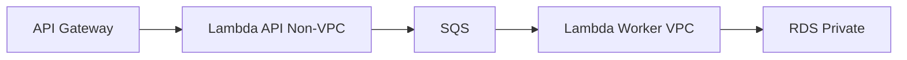

Good when API can be async.

Benefits:

- API avoids private network dependency;
- worker has backpressure;
- DB protected by consumer concurrency;
- failure visible as backlog.

### Pattern B — VPC Lambda Direct DB Command

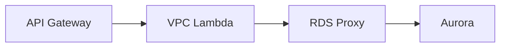

Good when synchronous DB operation is required.

Guardrails:

- reserved concurrency;
- RDS Proxy;
- short transaction;
- idempotency key;
- timeout budget;
- DB alarms.

### Pattern C — AWS API Private Path

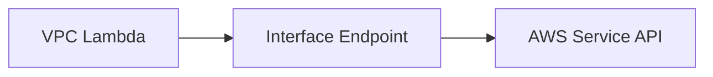

Good for private AWS API calls from VPC-attached function.

Guardrails:

- endpoint SG;
- endpoint policy;
- private DNS;
- per-AZ cost;
- quota and logs.

### Pattern D — Public SaaS Egress

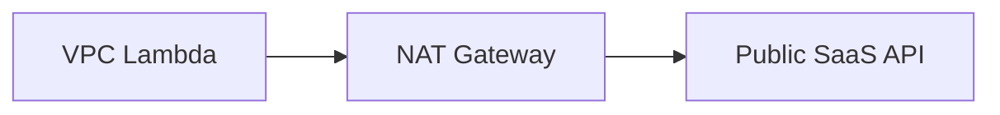

Guardrails:

- NAT per AZ where needed;
- egress cost monitoring;
- SaaS rate limit;
- timeout/retry;
- circuit breaker;
- static egress IP if allowlisted.

---

## 19. Security Review Checklist

- [ ] Does the function truly need VPC access?
- [ ] Are selected subnets private and multi-AZ?
- [ ] Is outbound access restricted?
- [ ] Does downstream SG allow Lambda SG specifically?
- [ ] Are broad CIDR rules avoided?
- [ ] Are VPC endpoints using endpoint policies where appropriate?
- [ ] Is NAT egress reviewed?
- [ ] Are IAM permissions for VPC attachment restricted?
- [ ] Are `lambda:VpcIds`, `lambda:SubnetIds`, `lambda:SecurityGroupIds` condition keys considered?
- [ ] Are secrets/config fetched privately where required?
- [ ] Are VPC Flow Logs enabled where useful?
- [ ] Is DNS/private hosted zone access intentional?
- [ ] Is cross-account/private endpoint access reviewed?

---

## 20. Production Readiness Checklist

### Connectivity

- [ ] Function reaches private resource in all selected subnets.
- [ ] Function reaches required AWS services.
- [ ] Function reaches internet/SaaS only if intended.
- [ ] DNS resolution works.
- [ ] TLS certificates validate.
- [ ] Smoke test covers real network path.

### Capacity

- [ ] Reserved concurrency protects downstream.
- [ ] DB pool size is bounded.
- [ ] NAT capacity/cost understood.
- [ ] Endpoint capacity/cost understood.
- [ ] Subnet IP capacity monitored.
- [ ] Downstream connection count monitored.

### Operations

- [ ] Runbook for timeout/network failure exists.
- [ ] VPC config changes go through review.
- [ ] Alarms include duration, timeout, DB connections, NAT/endpoint cost.
- [ ] Rollback of VPC config tested.
- [ ] Function Pending/Inactive behavior understood.
- [ ] No dependency on ENI persistence.

### Cost

- [ ] S3/DynamoDB use gateway endpoint if high-volume from VPC.
- [ ] High-volume AWS API calls evaluated for interface endpoint.
- [ ] NAT data processing monitored.
- [ ] Cross-AZ NAT path avoided where possible.
- [ ] Retry storms alarmed.

---

## 21. Common Anti-Patterns

### Anti-Pattern 1 — Attach Every Function to VPC

Adds routing/cost/failure complexity without private-resource need.

### Anti-Pattern 2 — Public Subnet for Internet Access

A VPC-attached Lambda does not get internet access merely by selecting a public subnet.

### Anti-Pattern 3 — One Giant Lambda Security Group

All functions can reach all resources. No meaningful blast-radius boundary.

### Anti-Pattern 4 — Unique SG/Subnet Combo for Every Function Without Reason

Increases network resource fragmentation and operational complexity.

### Anti-Pattern 5 — NAT for High-Volume S3/DynamoDB

Often better served by gateway endpoints.

### Anti-Pattern 6 — No Reserved Concurrency for DB Lambda

Database connection storm waiting to happen.

### Anti-Pattern 7 — No DNS Runbook

Network errors become superstition.

### Anti-Pattern 8 — VPC Attachment as Security Theater

If IAM is broad, SGs are broad, NAT egress is unrestricted, and logs are missing, VPC attachment did not make the function meaningfully safer.

---

## 22. Final Mental Model

Lambda VPC networking is not a checkbox.

It is a network contract:

```txt
function -> Hyperplane ENI -> subnet route table -> security group/NACL
-> NAT or endpoint or private resource -> downstream capacity
```

Attach Lambda to a VPC when the workload needs private network access.

Then design:

- subnet placement;
- security group boundaries;
- NAT/endpoints;
- DNS;
- IAM restrictions;
- concurrency;
- downstream capacity;
- observability;
- cost.

A top-tier engineer does not ask:

> “Should Lambda be inside a VPC?”

They ask:

> “What network path does this function need, what can fail on that path, and what guardrails prevent that failure from becoming a production incident?”

That is Lambda VPC networking.

---

## References

- AWS Lambda Developer Guide: configuring Lambda functions to access resources in a VPC
- AWS Lambda Developer Guide: Hyperplane ENIs
- AWS Lambda Developer Guide: enabling internet access for VPC-connected Lambda functions
- AWS Lambda Developer Guide: troubleshooting networking issues
- Amazon VPC documentation: NAT gateways
- Amazon VPC documentation: gateway endpoints and interface endpoints
- AWS Lambda Developer Guide: IAM condition keys for VPC settings
