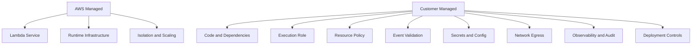
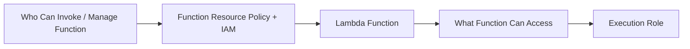
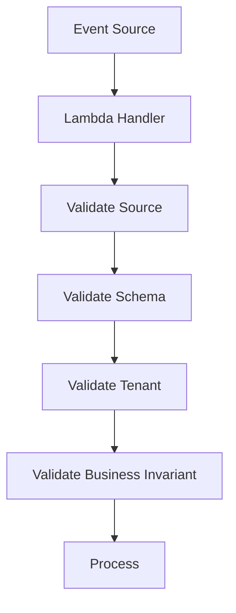
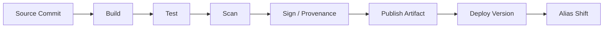

# Part 057 — Lambda Security Model

Lambda security is often oversimplified.

People say:

> “AWS manages the servers, so Lambda is secure.”

That is incomplete.

A better statement:

> Lambda removes host management, but it concentrates security design into identity, invocation permission, event source trust, dependency integrity, configuration, secrets, network access, and side-effect boundaries.

Lambda is secure when the function is small, permissioned narrowly, invoked by trusted sources, configured safely, observed well, and deployed through controlled artifacts.

Lambda is dangerous when it becomes:

- a role with `*:*`;
- a public invoke endpoint;
- a function that trusts arbitrary event payloads;
- a package full of unscanned dependencies;
- a secret dump in environment variables;
- an async handler with no DLQ;
- a VPC-attached function with broad egress;
- a multi-tenant handler with weak tenant validation;
- a workflow step that writes side effects without idempotency;
- a production artifact deployed by mutable tag or manual upload.

The security model is not one control.

It is a chain.

---

## 1. Lambda Security Responsibility Boundary

AWS manages:

- underlying physical infrastructure;
- Lambda service control plane;
- managed runtime infrastructure;
- execution environment isolation;
- scaling infrastructure;
- integration with IAM, CloudWatch, X-Ray, KMS, VPC, and other AWS services.

You still manage:

- function code;
- dependencies;
- execution role permissions;
- resource-based policies;
- event source permissions;
- input validation;
- secrets handling;
- environment variables;
- VPC/security group egress;
- logging without data leakage;
- deployment integrity;
- runtime configuration;
- idempotency and side-effect safety;
- tenant isolation;
- incident evidence.



Serverless does not remove security work. It changes where the work lives.

---

## 2. The Two IAM Sides of Lambda

Lambda has two major permission surfaces.



### 2.1 Invocation / Management Permissions

These answer:

```txt
Who can call this function?
Who can update it?
Who can change environment variables?
Who can attach VPC config?
Who can publish versions?
Who can move aliases?
Who can add event sources?
```

Controls:

- IAM policies for humans/CI;
- Lambda resource-based policies;
- API Gateway/ALB auth;
- EventBridge/S3/SNS permissions;
- organization SCPs;
- code signing config;
- deployment pipeline approvals.

### 2.2 Execution Role

This answers:

```txt
What can the function do while running?
```

Examples:

- read a specific secret;
- write to one DynamoDB table;
- publish to one EventBridge bus;
- read one S3 prefix;
- call one KMS key;
- send messages to one SQS queue;
- connect to VPC resources;
- write logs.

AWS documents Lambda execution role as the IAM role that grants the function permission to access AWS services and resources.

The execution role is usually the highest-risk part of Lambda.

---

## 3. Execution Role Design

Bad role:

```json
{
  "Effect": "Allow",
  "Action": "*",
  "Resource": "*"
}
```

Better role:

```json
{
  "Effect": "Allow",
  "Action": [
    "dynamodb:PutItem",
    "dynamodb:UpdateItem",
    "dynamodb:GetItem"
  ],
  "Resource": "arn:aws:dynamodb:ap-southeast-1:123456789012:table/payment-idempotency"
}
```

### Role Design Principles

1. One role per function or function family.
2. Permissions follow side-effect boundary.
3. Read/write permissions are separated where useful.
4. Resource ARNs are scoped.
5. Conditions are used for tenant/prefix/context boundaries where possible.
6. No shared “lambda-execution-role” for everything.
7. No permission because “maybe later.”
8. CI detects privilege drift.
9. CloudTrail Access Analyzer/last-used data informs tightening.
10. Break-glass changes are reviewed and reverted.

### Execution Role Shape

```txt
function: capture-payment
role:
  logs: write own log group
  secrets: read payment provider secret
  dynamodb: conditional write idempotency table
  events: put events to payment event bus
  kms: decrypt specific key
  xray: put trace segments
  ec2: only if VPC attachment required
```

If a function only writes to SQS, it should not be able to read all S3 buckets.

---

## 4. Resource-Based Policies

A Lambda function can have a resource-based policy that allows other AWS accounts or services to invoke it.

Examples:

- S3 bucket notification invokes function;
- EventBridge rule invokes function;
- SNS topic invokes function;
- API Gateway invokes function;
- cross-account invocation.

The function resource policy answers:

```txt
Who is allowed to invoke this function?
Under what source ARN/account conditions?
```

### Resource Policy Risk

Bad:

```txt
allow principal: *
action: lambda:InvokeFunction
resource: function
```

Better:

```txt
allow service: events.amazonaws.com
sourceArn: arn:aws:events:region:account:rule/specific-rule
sourceAccount: expected-account
```

### Checklist

- [ ] Every invoke permission has expected principal.
- [ ] Service principal permissions include `SourceArn` and `SourceAccount` where supported.
- [ ] Cross-account invoke is explicit and reviewed.
- [ ] Old event source permissions removed.
- [ ] Public function URLs/API paths have auth where required.
- [ ] Function aliases are permissioned deliberately.

Resource policies are often forgotten because they are not inside the execution role.

They are equally important.

---

## 5. Event Source Trust Boundary

Every event is untrusted until validated.

Even if it comes from AWS.

Why?

- producer bug;
- schema drift;
- replay of old event;
- compromised upstream;
- cross-account event injection;
- test event accidentally sent to prod;
- S3 object key crafted maliciously;
- API caller sends malformed body;
- queue redrive replays stale payload;
- EventBridge rule matches too broadly.



### Validate

- `source`;
- `detail-type`;
- event version;
- required business IDs;
- tenant/account ID;
- region/account where relevant;
- S3 bucket/key prefix;
- SNS topic ARN;
- EventBridge bus/rule intent;
- API auth claims;
- Step Functions input contract;
- payload hash/signature if external.

### EventBridge Rule Risk

Catch-all rule:

```json
{
  "source": [{ "prefix": "" }]
}
```

This is usually bad. It can route too much into a function.

Use specific event patterns.

### API Input Risk

A Lambda behind API Gateway is an internet-exposed parser unless protected.

Validate:

- method/path;
- auth claims;
- content type;
- body size;
- schema;
- tenant authorization;
- idempotency key;
- rate limits;
- WAF where applicable.

---

## 6. Secrets and Environment Variables

Environment variables are useful for operational configuration.

They are not a complete secrets-management strategy.

AWS Lambda encrypts environment variables at rest, and you can configure customer-managed KMS keys. But environment variables are still visible to identities that can read function configuration.

Use environment variables for:

- table names;
- queue URLs;
- bus names;
- feature flags with low sensitivity;
- static operational config.

Use Secrets Manager or SSM Parameter Store for:

- database credentials;
- API keys;
- signing keys;
- provider tokens;
- sensitive config;
- rotated credentials.

### Secret Access Pattern

```txt
env var: SECRET_ARN
function execution role: secretsmanager:GetSecretValue on that ARN
code: fetch secret with timeout and cache TTL
KMS key: decrypt allowed only for function role
rotation: tested
```

### Java Secret Cache

```java
public final class SecretProvider {
    private static volatile Secret cached;
    private static volatile Instant expiresAt = Instant.EPOCH;

    public static Secret get() {
        Instant now = Instant.now();
        if (cached == null || now.isAfter(expiresAt)) {
            synchronized (SecretProvider.class) {
                if (cached == null || now.isAfter(expiresAt)) {
                    cached = loadWithTimeout();
                    expiresAt = now.plusSeconds(300);
                }
            }
        }
        return cached;
    }
}
```

Do not fetch secrets on every invocation unless required. Do not cache forever.

### Secret Logging Rule

Never log:

- secret values;
- bearer tokens;
- full connection strings;
- API keys;
- signed URLs;
- raw authorization headers;
- KMS plaintext;
- decrypted payloads.

Use explicit redaction.

---

## 7. KMS Design

KMS appears in Lambda security through:

- environment variable encryption;
- Secrets Manager encryption;
- SSM parameter encryption;
- application-level encryption/decryption;
- encrypted S3/DynamoDB/SQS resources;
- code signing workflows indirectly through signing infrastructure.

### KMS Permission Rule

The function should only decrypt with keys it needs.

Bad:

```json
{
  "Action": "kms:Decrypt",
  "Resource": "*"
}
```

Better:

```json
{
  "Action": "kms:Decrypt",
  "Resource": "arn:aws:kms:ap-southeast-1:123456789012:key/..."
}
```

Use key policies and IAM together. Restrict decrypt context when possible.

### KMS Failure Modes

| Symptom | Cause |
|---|---|
| AccessDenied on secret read | role lacks KMS decrypt or secret permission |
| function config update fails | KMS key policy denies Lambda/service/principal |
| cold start delay | secret fetch/KMS call during init |
| throttling | excessive KMS calls from per-invoke decrypt |
| stale secret after rotation | cache TTL too long or no refresh |

Do not make KMS a per-request hot path unless necessary.

---

## 8. Code Signing

Lambda code signing helps ensure only trusted signed ZIP packages are deployed to functions configured with code signing.

AWS documents that code signing uses AWS Signer and validation happens at deployment time, with no runtime execution impact.

Code signing is useful when:

- regulated workloads require artifact integrity control;
- deployment must reject unsigned artifacts;
- organization has trusted publisher model;
- CI/CD pipeline signs packages;
- manual upload must be constrained.

Code signing does not:

- scan dependencies;
- prove code is bug-free;
- secure runtime permissions;
- validate event input;
- protect container image deployments in the same way as ZIP code signing;
- replace CI/CD governance.

For container images, artifact integrity usually involves:

- ECR scanning;
- tag immutability;
- digest pinning;
- image signing/provenance tooling;
- base image governance;
- deployment policy.

### Deployment Integrity Chain



Code signing is one link, not the whole chain.

---

## 9. Dependency and Supply Chain Risk

Lambda functions often depend on many packages.

Risks:

- vulnerable dependency;
- malicious package;
- dependency confusion;
- transitive CVE;
- outdated layer;
- unpatched container base image;
- artifact built outside controlled pipeline;
- mutable image tag;
- local manual deployment;
- poisoned build secrets.

### Controls

- lock dependency versions;
- use private artifact repositories where appropriate;
- scan dependencies;
- produce SBOM;
- sign/prove artifact;
- restrict who can update function code;
- use immutable versions/aliases;
- use ECR scanning for container images;
- lifecycle old artifacts;
- monitor runtime deprecation;
- patch/redeploy regularly.

### Layer Drift

Layers are a common supply-chain blind spot.

Track:

```txt
layer version -> functions using it -> CVE status -> deprecation date
```

A patched layer does not help a function still attached to an old version.

---

## 10. Network Security

Lambda network controls depend on whether the function is VPC-attached.

### Non-VPC Function

Controls:

- IAM execution role;
- service APIs/resource policies;
- outbound internet client behavior;
- destination API auth;
- WAF/API Gateway if inbound;
- VPC endpoints not applicable to function egress unless function is in VPC.

### VPC-Attached Function

Controls:

- selected subnets;
- security groups;
- route tables;
- NAT gateway;
- VPC endpoints;
- NACLs;
- DNS/private hosted zones;
- VPC Flow Logs;
- downstream SG references.

### Security Group Pattern

```txt
lambda-case-worker-sg
  outbound 5432 -> case-db-sg
  outbound 443 -> secretsmanager endpoint sg
  outbound 443 -> events endpoint sg
```

Avoid:

```txt
all-lambda-sg outbound 0.0.0.0/0
rds-sg inbound from VPC CIDR
```

### Egress Control

For sensitive functions, explicitly design egress:

- only required AWS endpoints;
- no NAT unless needed;
- endpoint policies;
- security group egress restrictions;
- DNS monitoring;
- VPC Flow Logs;
- deny unexpected outbound traffic through policy/network where feasible.

---

## 11. Function URLs, API Gateway, and Public Entry Points

Lambda can be exposed through:

- API Gateway;
- ALB;
- Lambda function URLs;
- direct invoke API;
- EventBridge/SNS/S3;
- cross-account triggers.

Public entry points need explicit controls:

| Entry | Controls |
|---|---|
| API Gateway | auth, authorizer, throttling, WAF, schema validation |
| ALB | listener auth/WAF/SG/TLS, target policy |
| Function URL | auth type, CORS, resource policy |
| direct invoke | IAM, resource policy |
| EventBridge | event pattern, bus policy, source account |
| S3/SNS | source ARN/account, bucket/topic policy |

### Public Function URL Warning

Function URLs are convenient. Convenience is risk.

Review:

- auth type;
- CORS;
- resource-based policy;
- throttling strategy;
- payload validation;
- logging;
- WAF not directly attached like API Gateway/ALB patterns;
- whether API Gateway is a better control plane.

---

## 12. Multi-Tenant Security

A multi-tenant Lambda function needs explicit tenant isolation.

Tenant context must be derived from a trusted source, not from arbitrary request body fields.

Trusted sources:

- authenticated token claims;
- API Gateway authorizer context;
- IAM principal/account;
- signed event envelope;
- upstream service contract;
- dedicated queue/bus per tenant;
- tenant-bound resource ARN/prefix.

Untrusted:

- `tenantId` in JSON body without auth check;
- S3 key prefix without bucket policy/source validation;
- EventBridge detail field without source/account validation;
- queue message from broad producer set.

### Tenant Isolation Controls

- tenant-aware idempotency key;
- tenant-aware IAM condition/resource prefix;
- tenant-specific encryption context where applicable;
- tenant validation before side effects;
- no tenant context in static mutable global state;
- no shared cache without tenant key;
- logs include tenant ID but not sensitive data;
- per-tenant concurrency/rate limit for noisy tenants.

### Bad

```java
String tenantId = event.getTenantId();
db.write(tenantId, event.payload());
```

### Better

```java
String tenantId = trustedAuthorizerTenant(context);
if (!tenantId.equals(event.claimedTenantId())) {
    throw new SecurityException("tenant mismatch");
}
```

---

## 13. Runtime Data Leakage

Lambda execution environments can be reused.

That means:

- `/tmp` persists across warm invocations in the same environment;
- static/global memory persists;
- clients/caches persist;
- logs persist externally.

Do not store request-sensitive data in global state.

### Risky

```java
private static UserContext currentUser;
private static byte[] lastDocument;
private static Map<String, Permissions> permissions = new HashMap<>();
```

### Safer

- request context passed as method parameter;
- caches keyed by tenant/user/policy version and TTL;
- `/tmp` files include tenant boundary and are cleaned/validated;
- sensitive temporary files encrypted or avoided;
- no raw sensitive payload logging;
- memory cache contains only non-sensitive or carefully scoped data.

Warm reuse is a performance feature, not a data isolation model.

---

## 14. Logging Without Leaking

Lambda logs often become a security risk.

Never log:

- passwords;
- API keys;
- JWTs;
- auth headers;
- full request bodies with PII;
- full environment variables;
- database URLs with credentials;
- signed URLs;
- KMS plaintext;
- payment card data;
- secrets returned from Secrets Manager;
- raw event payloads from untrusted users.

### Safe Logging Fields

- correlation ID;
- event ID;
- tenant ID if allowed;
- operation;
- resource ID if non-sensitive;
- outcome;
- error code;
- duration;
- idempotency status;
- downstream service name;
- retry classification.

### Redaction Utility

```java
public final class SafeLog {
    public static String redact(String value) {
        if (value == null) return null;
        if (value.length() <= 8) return "***";
        return value.substring(0, 4) + "***" + value.substring(value.length() - 4);
    }
}
```

Better still: do not pass secrets into logging methods.

---

## 15. Authorization Inside Lambda

Do not confuse authentication with authorization.

API Gateway may authenticate the caller, but your function may still need to authorize the business action.

Example:

```txt
caller is authenticated
but can this caller transition this case?
can this tenant access this document?
can this role approve enforcement escalation?
is this state transition legal?
```

Authorization should consider:

- caller identity;
- tenant;
- resource ownership;
- current resource state;
- requested action;
- role/permission;
- delegation;
- policy version;
- audit evidence.

### State-Based Authorization

For regulatory/case workflows:

```txt
action: APPROVE_ENFORCEMENT
allowed if:
  case.state == REVIEW_READY
  user.role includes ENFORCEMENT_SUPERVISOR
  user.region == case.region
  conflict_of_interest == false
  deadline_not_expired or override_permission exists
```

This is business authorization, not IAM.

IAM protects AWS resources. Your code protects domain actions.

---

## 16. Async Failure Security

Security is not only confidentiality. It is also integrity and accountability.

Async Lambda without failure handling can silently drop important work.

Controls:

- DLQ or destination;
- failure alarms;
- replay procedure;
- idempotency;
- poison event quarantine;
- audit trail;
- event age monitoring;
- correlation IDs.

### Security Risk Example

A function processes `CaseEscalated` events and writes audit records.

If it fails asynchronously with no DLQ/destination, the business action may occur without audit evidence.

That is a security/compliance failure.

---

## 17. Deployment Permissions

Protect who can:

- update function code;
- update environment variables;
- update execution role;
- update VPC config;
- publish versions;
- update aliases;
- add layers;
- change resource-based policies;
- create function URLs;
- add event source mappings;
- change concurrency;
- delete functions;
- read logs.

Deployment pipeline should have narrowly scoped permissions.

Humans should not casually update production Lambda code from local machines.

### CI Role Shape

```txt
can deploy only specific functions
can publish versions
can move specific aliases
cannot attach arbitrary execution role
cannot add public function URL
cannot broaden resource policy
cannot read all secrets
```

Use IAM conditions and separate roles for build, deploy, and runtime where possible.

---

## 18. Auditability

A production Lambda security model must answer:

- Who deployed this version?
- What source commit produced it?
- What artifact hash/digest was deployed?
- Who changed the alias?
- Who changed environment variables?
- Who changed execution role permissions?
- Who added invoke permissions?
- Which event invoked this function?
- What side effect did it perform?
- Was the event duplicate?
- Which tenant/resource was affected?
- Was the operation authorized?
- Where is failure evidence?

Sources:

- CloudTrail;
- Lambda logs;
- deployment pipeline logs;
- artifact registry metadata;
- EventBridge/SQS/SNS records;
- application audit logs;
- X-Ray/traces;
- IAM Access Analyzer findings;
- AWS Config if enabled.

Auditability must be designed before incident/regulatory review.

---

## 19. Security Runbook

### Symptom: Function Has Too Much Permission

Evidence:

```bash
aws lambda get-function-configuration --function-name my-function
aws iam get-role --role-name my-role
aws iam list-attached-role-policies --role-name my-role
aws iam list-role-policies --role-name my-role
```

Actions:

1. Identify actual side effects.
2. Identify permissions used in recent period.
3. Remove wildcard permissions.
4. Scope resources.
5. Add conditions where possible.
6. Deploy through pipeline.
7. Monitor denied calls.
8. Add CI policy check.

### Symptom: Unexpected Invocations

Evidence:

```bash
aws lambda get-policy --function-name my-function
aws cloudtrail lookup-events --lookup-attributes AttributeKey=EventName,AttributeValue=Invoke
```

Actions:

1. Inspect resource-based policy.
2. Check event source mappings.
3. Check EventBridge/SNS/S3 triggers.
4. Validate source ARNs/accounts.
5. Remove stale invoke permissions.
6. Add event validation.
7. Add alarm on unexpected source/event type.

### Symptom: Secret Exposure Suspected

Actions:

1. Disable/rotate exposed secret.
2. Check logs for leakage.
3. Check environment variables.
4. Check deployment artifact.
5. Check code path that logged secret.
6. Check IAM principals with config/log access.
7. Rotate downstream credentials.
8. Add redaction tests and logging guardrails.

### Symptom: Compromised Dependency

Actions:

1. Identify functions using artifact/layer/image.
2. Block new deploys with vulnerable version.
3. Patch/rebuild artifact.
4. Publish new versions.
5. Shift aliases.
6. Verify no old vulnerable layer versions remain.
7. Review CloudTrail/logs for exploitation indicators.
8. Add dependency policy.

---

## 20. Security Design Checklist

### Identity

- [ ] Function has dedicated execution role.
- [ ] Role scoped to required resources.
- [ ] No wildcard actions/resources unless justified.
- [ ] KMS permissions scoped.
- [ ] VPC attachment permissions restricted.
- [ ] CI deployment role scoped.
- [ ] Human production update access minimized.

### Invocation

- [ ] Resource-based policy reviewed.
- [ ] SourceArn/SourceAccount used where supported.
- [ ] Event source mappings intentional.
- [ ] Function URL/API public access reviewed.
- [ ] Cross-account invoke reviewed.
- [ ] Event schema/source validation implemented.

### Secrets

- [ ] Secrets stored in Secrets Manager/SSM, not plaintext env.
- [ ] Env vars used for non-sensitive config or secret references.
- [ ] KMS key policy reviewed.
- [ ] Secret cache TTL defined.
- [ ] Rotation tested.
- [ ] Logs redact sensitive data.

### Code and Artifact

- [ ] Dependencies locked/scanned.
- [ ] SBOM produced.
- [ ] ZIP code signing or image signing/provenance considered.
- [ ] ECR image digest used.
- [ ] Layers governed.
- [ ] Runtime deprecation tracked.
- [ ] No secrets in package/image.

### Runtime

- [ ] Input validation implemented.
- [ ] Idempotency implemented for side effects.
- [ ] Authorization enforced for business actions.
- [ ] Tenant context trusted.
- [ ] No request-sensitive global state.
- [ ] `/tmp` usage safe.
- [ ] Outbound network path reviewed.

### Operations

- [ ] CloudTrail/audit evidence available.
- [ ] Failure destination/DLQ configured where needed.
- [ ] Alarms for security-relevant failures.
- [ ] Runbooks exist.
- [ ] Incident drills include secret rotation and permission rollback.

---

## 21. Common Anti-Patterns

### Anti-Pattern 1 — One Shared Execution Role

Every function can access every resource.

### Anti-Pattern 2 — Trusting Event Payload Tenant ID

Tenant ID from body/message is accepted without checking trusted identity.

### Anti-Pattern 3 — Secrets in Environment Variables With Broad Config Read Access

Encrypted at rest does not mean only runtime can see them.

### Anti-Pattern 4 — No Resource-Based Policy Review

Old S3/SNS/EventBridge invoke permissions remain after architecture changes.

### Anti-Pattern 5 — Public Function URL Without Strong Auth

Convenient endpoint becomes production attack surface.

### Anti-Pattern 6 — Logging Full Events

Raw event includes PII/secrets/tokens and goes to long-lived logs.

### Anti-Pattern 7 — Unscanned Layers

Shared layer becomes vulnerability distribution mechanism.

### Anti-Pattern 8 — VPC as Security Theater

Broad IAM and broad egress remain; VPC attachment only adds complexity.

### Anti-Pattern 9 — No Async Failure Destination

Important compliance/audit work can fail invisibly.

---

## 22. Final Mental Model

Lambda security is the intersection of:

```txt
identity
invocation
input
secrets
artifact
network
runtime state
side effects
observability
audit
```

A secure Lambda is not just a function with a role.

It is a controlled unit of execution with:

- narrow permissions;
- trusted invocation path;
- validated events;
- protected secrets;
- governed artifact;
- safe network egress;
- tenant-aware logic;
- idempotent side effects;
- auditable outcomes;
- observable failures.

The top-tier question is not:

> “Does this Lambda have IAM permissions?”

It is:

> “What can invoke this function, what can it do, what can it leak, what side effects can it create, and what evidence proves that all of this stayed inside the intended boundary?”

That is the Lambda security model.

---

## References

- AWS Lambda Developer Guide: execution roles
- AWS Lambda Developer Guide: resource-based policies
- AWS Lambda Developer Guide: securing environment variables
- AWS Lambda Developer Guide: code signing
- AWS Lambda Developer Guide: best practices
- AWS IAM documentation: security best practices
- AWS Lambda Developer Guide: VPC configuration and IAM condition keys
