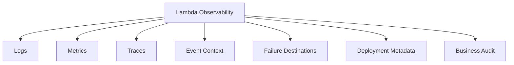
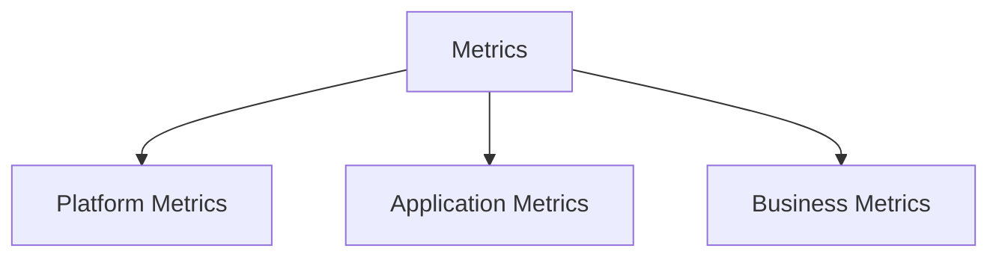
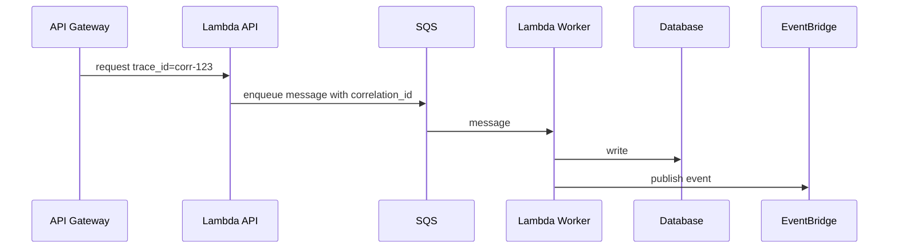
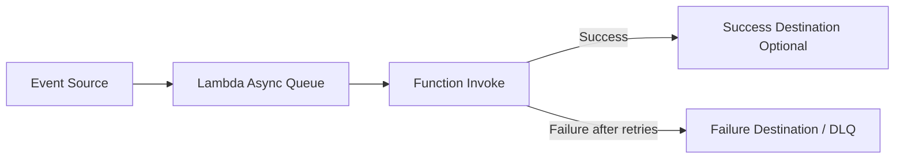

# Part 058 — Lambda Observability

A Lambda function is easy to deploy and hard to understand if you do not design observability up front.

The worst serverless incident is not when a function fails.

The worst incident is when the producer succeeded, the function failed asynchronously, retries happened somewhere invisible, a DLQ filled quietly, an operator redrove duplicates, and nobody can reconstruct which business side effects happened.

Lambda observability must answer:

```txt
what happened?
why did it happen?
which event caused it?
which retry attempt was this?
which side effects occurred?
which downstream dependency was slow?
was this cold start?
was this duplicate?
did the event go to DLQ?
can we replay safely?
```

Observability is not “logs exist.”

Observability is the ability to reconstruct system behavior under failure.

---

## 1. The Three Pillars Are Not Enough

People often say observability is:

- logs;
- metrics;
- traces.

That is useful, but incomplete for Lambda.

For Lambda, you also need:

- event source context;
- invocation mode;
- retry semantics;
- idempotency status;
- async destination/DLQ visibility;
- correlation ID propagation;
- cold start marker;
- batch item outcomes;
- tenant/resource context;
- deployment version/alias;
- concurrency and throttling signals;
- downstream dependency timing.



Logs tell stories.

Metrics detect patterns.

Traces show paths.

Audit proves business outcomes.

You need all four.

---

## 2. Observability Starts at the Event Boundary

Every invocation should log or emit the identity of the work unit.

Depending on source:

| Source | Work Unit ID |
|---|---|
| API Gateway | request ID, correlation ID, idempotency key |
| EventBridge | event ID, source, detail-type |
| SQS | message ID, business event ID, receive count |
| SNS | message ID, topic ARN |
| Kinesis | shard ID, sequence number, event ID |
| DynamoDB Streams | event ID, keys, sequence number |
| Step Functions | execution ARN/name, state name |
| S3 | bucket, key, version ID, event name |
| ALB | request ID/correlation header |

Never rely only on Lambda request ID. It identifies the invocation attempt, not the business operation.

### Correlation ID Rule

```txt
business operation ID travels across the system
Lambda request ID stays as execution evidence
```

Both are useful.

---

## 3. Structured Logging

Logs should be structured JSON.

Bad:

```txt
failed to process
```

Good:

```json
{
  "level": "ERROR",
  "service": "payment-consumer",
  "operation": "CapturePayment",
  "event_id": "evt-123",
  "lambda_request_id": "req-abc",
  "correlation_id": "corr-789",
  "idempotency_key": "tenant-1:CapturePayment:pay-123:v1",
  "idempotency_status": "CLAIMED",
  "error_code": "PAYMENT_PROVIDER_TIMEOUT",
  "retryable": true,
  "duration_ms": 2840,
  "remaining_ms": 12160,
  "cold_start": false
}
```

### Minimum Log Fields

| Field | Why |
|---|---|
| `service` | owner/debug |
| `environment` | prod/staging/dev |
| `function_name` | Lambda identity |
| `function_version` | release identity |
| `alias` | deployment context |
| `lambda_request_id` | invocation attempt |
| `correlation_id` | end-to-end tracing |
| `event_id` | business/event identity |
| `tenant_id` | multi-tenant debugging if allowed |
| `operation` | what the handler is doing |
| `outcome` | success/failure/duplicate |
| `error_code` | alarm/routing |
| `duration_ms` | performance |
| `cold_start` | lifecycle |
| `idempotency_status` | duplicate/retry correctness |

### Log Levels

| Level | Use |
|---|---|
| DEBUG | local/non-prod detail, disabled or sampled in prod |
| INFO | business outcome and key lifecycle signals |
| WARN | unusual but handled condition |
| ERROR | failed invocation or failed side effect |
| FATAL | rarely needed; runtime-level unrecoverable |

Do not log full event payloads in production by default.

---

## 4. Cold Start Observability

Cold starts must be measurable separately from warm invokes.

Java example:

```java
public final class ColdStart {
    private static final AtomicBoolean COLD = new AtomicBoolean(true);

    public static boolean mark() {
        return COLD.getAndSet(false);
    }
}
```

Use:

```java
boolean coldStart = ColdStart.mark();

log.info("lambda_invocation_start cold_start={} request_id={}",
        coldStart,
        context.getAwsRequestId());
```

Track:

- cold start count;
- init duration;
- cold p95/p99 latency;
- warm p95/p99 latency;
- SnapStart restore duration if relevant;
- provisioned concurrency spillover;
- deployment correlation.

A latency dashboard without cold/warm split hides the actual problem.

---

## 5. Metrics

Metrics should exist at three levels.



### 5.1 Platform Metrics

From Lambda/CloudWatch:

- invocations;
- duration;
- errors;
- throttles;
- concurrent executions;
- async event age;
- iterator age;
- dead letter errors;
- provisioned concurrency utilization;
- provisioned concurrency spillover;
- memory usage from logs;
- init duration from logs.

### 5.2 Application Metrics

From handler code:

- validation failures;
- idempotency claimed/completed/duplicate/conflict;
- retryable errors;
- permanent errors;
- downstream latency;
- batch item failures;
- poison messages;
- config refresh failures;
- timeout-budget rejections;
- external API throttles.

### 5.3 Business Metrics

Domain-specific:

- orders processed;
- payments captured;
- cases escalated;
- documents indexed;
- notifications sent;
- workflows started/completed;
- audit records written;
- SLA deadlines missed.

Business metrics tell whether the system is doing useful work.

---

## 6. Metric Design

Metrics need dimensions, but dimensions can explode.

Good dimensions:

```txt
service
environment
operation
outcome
error_code
event_source
```

Dangerous dimensions:

```txt
request_id
event_id
user_id
order_id
case_id
raw tenant_id for high-cardinality systems
```

High-cardinality metrics can become expensive and hard to query.

### Good Metric

```txt
Metric: PaymentCaptureOutcome
Dimensions:
  environment=prod
  outcome=success|duplicate|retryable_error|permanent_error
  provider=providerA
```

### Bad Metric

```txt
Metric: PaymentCaptureOutcome
Dimensions:
  orderId=ord-123
  customerId=cust-456
  requestId=req-789
```

Use logs for high-cardinality identifiers. Use metrics for aggregation.

---

## 7. Embedded Metric Format

CloudWatch Embedded Metric Format lets structured logs produce metrics.

Conceptual log:

```json
{
  "_aws": {
    "Timestamp": 1783332000000,
    "CloudWatchMetrics": [
      {
        "Namespace": "Payments",
        "Dimensions": [["service", "environment", "outcome"]],
        "Metrics": [
          { "Name": "PaymentCaptureCount", "Unit": "Count" },
          { "Name": "DownstreamLatencyMs", "Unit": "Milliseconds" }
        ]
      }
    ]
  },
  "service": "payment-consumer",
  "environment": "prod",
  "outcome": "success",
  "PaymentCaptureCount": 1,
  "DownstreamLatencyMs": 184
}
```

You can use Powertools Metrics utility to avoid hand-writing this format.

AWS Lambda Powertools provides utilities for structured logging, tracing, custom metrics, parameter/secrets retrieval, idempotency, event parsing, validation, and batch processing.

---

## 8. Tracing

Tracing answers:

```txt
Where did time go?
Which service called which dependency?
Which downstream failed?
How does one request move across API, Lambda, queue, workflow, and database?
```

Lambda tracing can use:

- AWS X-Ray;
- AWS Distro for OpenTelemetry;
- vendor collectors/extensions;
- Powertools tracing utilities;
- manual trace propagation through logs/events.



### Trace Propagation Rule

When crossing async boundaries, explicitly copy correlation context into the message/event.

HTTP tracing headers may not magically survive SQS/EventBridge/Step Functions unless you propagate them.

Event envelope should include:

```json
{
  "correlationId": "corr-123",
  "causationId": "cmd-456",
  "eventId": "evt-789"
}
```

Definitions:

| Field | Meaning |
|---|---|
| correlation ID | entire business flow |
| causation ID | event/command that caused this event |
| event ID | this event |
| Lambda request ID | this invocation attempt |

These are not interchangeable.

---

## 9. Observability for Async Invocation

Async Lambda failures are easy to miss.

For asynchronous sources, monitor:

- `AsyncEventAge`;
- function errors;
- retry count if emitted;
- DLQ messages;
- destination failures;
- event age until success/failure;
- dead-letter delivery failures;
- source-specific failure metrics.



### Required Alarms

- async event age rising;
- DLQ depth > 0;
- destination delivery errors;
- function errors > threshold;
- throttles > 0;
- concurrency at cap for sustained period.

### Operational Rule

If a function processes business-critical async events and has no failure destination or DLQ, it is not production-ready.

---

## 10. Observability for SQS Consumers

SQS consumer dashboard:

| Signal | Meaning |
|---|---|
| queue visible messages | backlog |
| age of oldest message | processing delay |
| not visible messages | in-flight work |
| Lambda concurrency | active consumers |
| Lambda duration | processing time |
| errors | retry pressure |
| partial batch failure count | per-record issues |
| DLQ messages | terminal failures |
| receive count distribution | retry pattern |
| downstream latency | bottleneck |

### Handler Logs Per Record

For batch processing, log at batch and record level carefully.

Batch log:

```json
{
  "operation": "process_sqs_batch",
  "batch_size": 10,
  "success_count": 9,
  "retryable_failure_count": 1,
  "permanent_failure_count": 0,
  "duration_ms": 1830
}
```

Record log for failures only:

```json
{
  "operation": "process_message",
  "message_id": "msg-123",
  "event_id": "evt-789",
  "error_code": "DEPENDENCY_TIMEOUT",
  "retryable": true
}
```

Do not log every successful record at high volume unless sampled or required.

---

## 11. Observability for Streams

Kinesis/DynamoDB Streams require lag visibility.

Monitor:

- iterator age;
- shard-level error;
- batch failures;
- bisected batches;
- partial failures;
- records processed;
- poison records;
- max record age drops;
- throttles;
- checkpoint progress.

A stream consumer can have low error rate and still be hours behind.

Iterator age is a first-class SLO for stream processing.

---

## 12. Observability for Step Functions + Lambda

When Lambda is used inside Step Functions, visibility spans both services.

Track:

- execution ARN/name;
- state name;
- task input/output size;
- task duration;
- retry count;
- catch path;
- failure name/cause;
- Lambda request ID;
- business ID.

Log example:

```json
{
  "workflow_execution": "arn:aws:states:...",
  "state_name": "CapturePayment",
  "lambda_request_id": "req-123",
  "payment_id": "pay-456",
  "attempt": 2,
  "outcome": "RETRYABLE_ERROR",
  "error_code": "PAYMENT_PROVIDER_TIMEOUT"
}
```

The Step Functions execution is often the best audit timeline for multi-step serverless workflows.

---

## 13. Observability for Idempotency

Idempotency should be visible.

Metrics:

- claimed;
- completed;
- duplicate completed;
- in-progress duplicate;
- expired takeover;
- payload conflict;
- store error;
- idempotency latency.

Logs should include:

```txt
idempotency_key
idempotency_status
request_hash_match
side_effect_ref
```

But do not log sensitive payload hashes if they expose secrets through deterministic low-entropy values.

### Why It Matters

During replay/redrive, duplicates are expected.

Without idempotency metrics, duplicate processing looks like either:

- success spike;
- error spike;
- nothing at all.

You need to know whether duplicates were safely absorbed.

---

## 14. Observability for Secrets and Config

Track:

- config version;
- secret version if safe;
- config refresh success/failure;
- cache hit/miss;
- stale config fallback;
- AppConfig/Secrets Manager latency;
- KMS errors;
- permission denied.

Do not log secret values.

Log:

```json
{
  "operation": "config_refresh",
  "config_name": "payment-runtime",
  "version": "42",
  "outcome": "SUCCESS",
  "duration_ms": 57
}
```

When config changes cause incidents, version visibility drastically reduces diagnosis time.

---

## 15. Dashboards

### Lambda Function Dashboard

Minimum panels:

```txt
Invocations
Errors
Throttles
Duration p50/p95/p99
ConcurrentExecutions
Cold start count
Init duration
Max memory used
Timeout count
DLQ/destination failures
Log error codes
```

### Event Source Dashboard

For SQS:

```txt
queue depth
age of oldest message
messages not visible
DLQ depth
consumer concurrency
consumer errors
```

For streams:

```txt
iterator age
records processed
batch failures
throttles
shard count
```

For API:

```txt
API latency
integration latency
4xx/5xx
Lambda duration
Lambda throttles
authorizer errors
WAF blocks if used
```

### Downstream Dashboard

Always include:

```txt
database latency/connections
external API latency/error
DynamoDB throttles
S3 errors/latency
EventBridge PutEvents failures
Step Functions failures
```

A Lambda-only dashboard is a partial truth.

---

## 16. Alarms

### Critical API Lambda

Alarm on:

- p95/p99 duration above SLO;
- errors above threshold;
- throttles > 0;
- timeout > 0;
- provisioned concurrency spillover;
- cold start spike if latency-sensitive;
- downstream latency/error;
- auth/validation anomaly.

### Queue Consumer

Alarm on:

- age of oldest message;
- DLQ depth > 0;
- function errors;
- throttles;
- duration near timeout;
- concurrency at cap;
- downstream latency;
- poison message count.

### Async Event Handler

Alarm on:

- async event age rising;
- errors;
- DLQ/destination messages;
- destination delivery failures;
- throttles;
- duplicate/payload conflict spike.

### Stream Consumer

Alarm on:

- iterator age;
- errors;
- batch failures;
- throttles;
- max record age approaching;
- poison record quarantine.

### Security/Compliance

Alarm on:

- IAM denied for function role;
- secret read failures;
- KMS decrypt failures;
- unexpected event source;
- resource policy changes;
- function code/config update outside pipeline;
- public URL creation;
- DLQ contains compliance-critical event.

---

## 17. CloudWatch Logs Insights Queries

### Errors by Code

```sql
fields @timestamp, service, operation, error_code, lambda_request_id, correlation_id
| filter level = "ERROR"
| stats count() by error_code, bin(5m)
| sort @timestamp desc
```

### Slow Invocations

```sql
fields @timestamp, service, operation, duration_ms, downstream_db_ms, cold_start, correlation_id
| filter duration_ms > 1000
| sort duration_ms desc
| limit 100
```

### Cold Start Count

```sql
fields @timestamp, service, cold_start
| filter cold_start = true
| stats count() by bin(5m), service
```

### Idempotency Status

```sql
fields @timestamp, operation, idempotency_status, idempotency_key
| filter ispresent(idempotency_status)
| stats count() by idempotency_status, bin(5m)
```

### Lambda REPORT Analysis

```sql
filter @type = "REPORT"
| stats
    avg(@duration),
    pct(@duration, 95),
    max(@duration),
    avg(@maxMemoryUsed),
    max(@maxMemoryUsed)
  by bin(5m)
```

CloudWatch Logs Insights is powerful only if logs are structured and fields are consistent.

---

## 18. Powertools for AWS Lambda

Powertools is a toolkit for implementing serverless best practices. AWS documents Powertools features such as structured logging, tracing, custom metrics, secrets/parameter utilities, idempotency, event parsing, validation, and batch processing.

Use Powertools to standardize:

- structured logger;
- metrics;
- tracing;
- correlation IDs;
- cold start marker;
- idempotency;
- batch utility;
- parameter/secret retrieval;
- event validation.

### Why It Helps

Without a standard library, every team invents:

- different log field names;
- different correlation handling;
- different metric namespaces;
- different error codes;
- different idempotency behavior.

That makes platform-wide observability weak.

### Caution

Powertools is a toolkit, not a design substitute.

You still must define:

- log schema;
- metric dimensions;
- trace propagation;
- idempotency key;
- error taxonomy;
- alarm thresholds;
- retention policy;
- PII redaction.

---

## 19. OpenTelemetry and X-Ray

AWS X-Ray provides managed tracing integration with Lambda and many AWS services.

OpenTelemetry provides vendor-neutral instrumentation and export options. AWS Distro for OpenTelemetry can be used for collecting traces/metrics/logs depending architecture.

Decision model:

| Need | Option |
|---|---|
| AWS-native tracing | X-Ray |
| vendor-neutral telemetry | OpenTelemetry |
| multi-cloud/vendor backend | OpenTelemetry collector/exporter |
| minimal serverless instrumentation | Powertools + X-Ray |
| advanced platform telemetry | ADOT / collector / vendor extension |

### Extension Cost

Observability extensions can add:

- init latency;
- memory usage;
- invoke tail latency;
- network calls;
- failure behavior;
- cost.

Measure extension overhead.

Do not install five telemetry agents into one latency-sensitive function without evidence.

---

## 20. Sampling

Trace/log sampling must preserve incident evidence.

### Good Sampling

- sample high-volume success logs;
- always log errors;
- always log security events;
- always log state transitions;
- always log DLQ/quarantine;
- keep metrics unsampled;
- use trace sampling deliberately;
- increase sampling during incident if safe.

### Bad Sampling

- errors sampled out;
- only p50 traces kept;
- no visibility into rare timeout;
- business-critical audit logs sampled;
- per-tenant issue invisible because aggregate sample hides it.

Metrics should show the anomaly even if logs/traces are sampled.

---

## 21. Observability Cost Control

Serverless observability can become expensive.

Cost drivers:

- high-volume logs;
- full payload logging;
- high-cardinality metrics;
- excessive custom metrics;
- verbose DEBUG logs in prod;
- traces for every invocation at high traffic;
- multiple extensions;
- long log retention;
- duplicated telemetry to multiple vendors;
- retry storms generating logs.

### Controls

- structured concise logs;
- INFO outcome logs only where useful;
- ERROR always logged;
- sampling for high-volume success;
- metric dimension governance;
- log retention policy;
- payload redaction;
- trace sampling;
- dashboard for observability cost;
- alarms on log ingestion spike.

Observability that bankrupts the team will be turned off. Design it sustainably.

---

## 22. Debugging Runbook

### Symptom: Function Errors Increased

Questions:

1. Which error codes?
2. Which source/event type?
3. Which version/alias?
4. Cold or warm?
5. One tenant or all?
6. Retryable or permanent?
7. Downstream latency/error?
8. Recent deployment/config change?
9. DLQ/destination messages?
10. Idempotency conflicts?

Logs Insights:

```sql
fields @timestamp, service, function_version, operation, error_code, event_source, tenant_id
| filter level = "ERROR"
| stats count() by error_code, function_version, event_source, bin(5m)
```

### Symptom: Queue Backlog Rising

Check:

- SQS age of oldest message;
- Lambda concurrency;
- throttles;
- errors;
- duration;
- downstream latency;
- DLQ;
- max concurrency/reserved concurrency;
- recent deployment.

Decision:

| Finding | Action |
|---|---|
| errors high | fix/rollback, inspect DLQ |
| throttled | check concurrency cap/account |
| duration high | downstream or code bottleneck |
| concurrency at cap | increase only if downstream safe |
| DLQ filling | inspect poison/permanent failures |
| no errors but slow | batch/concurrency/downstream capacity |

### Symptom: Latency Increased

Separate:

- API Gateway latency;
- Lambda duration;
- init duration;
- downstream latency;
- cold start rate;
- provisioned spillover;
- memory pressure.

Never diagnose latency from one graph.

### Symptom: Missing Business Outcome

Trace:

```txt
producer log -> event bus/queue -> Lambda invocation -> idempotency record
-> side effect -> emitted event/audit -> DLQ/destination
```

If any link lacks ID/correlation, your observability model has a gap.

---

## 23. Observability Contract for Every Function

Every production function should declare:

```yaml
observability:
  owner: payments-platform
  service: payment-consumer
  environment: prod
  correlation_id: required
  event_id: required
  logs:
    format: json
    retention_days: 30
    pii_policy: redacted
  metrics:
    namespace: Payments
    dimensions:
      - service
      - environment
      - operation
      - outcome
      - error_code
  traces:
    enabled: true
    propagation: correlationId
  alarms:
    - errors
    - throttles
    - duration
    - dlq
    - async_event_age
  dashboards:
    - lambda-function
    - event-source
    - downstream
```

This contract should be part of the service template.

---

## 24. Anti-Patterns

### Anti-Pattern 1 — Raw Print Logs

No structure, no queryability, no correlation.

### Anti-Pattern 2 — Lambda Request ID as Business ID

Request ID changes on retry and does not identify operation.

### Anti-Pattern 3 — No DLQ Alarm

Failures go somewhere, but nobody sees them.

### Anti-Pattern 4 — Full Payload Logging

Leaks PII/secrets and increases cost.

### Anti-Pattern 5 — Metrics With Request ID Dimension

High-cardinality metric explosion.

### Anti-Pattern 6 — Tracing Without Async Propagation

Trace stops at queue/event bus and loses the business flow.

### Anti-Pattern 7 — Observability Only at Lambda Layer

Downstream bottleneck invisible.

### Anti-Pattern 8 — No Version/Alias in Logs

Cannot correlate errors with deployment.

### Anti-Pattern 9 — Success Logs at Massive Volume Without Sampling

Cost grows while signal remains low.

### Anti-Pattern 10 — No Business Metrics

System appears healthy but does no useful work.

---

## 25. Production Observability Checklist

### Logs

- [ ] JSON structured logs.
- [ ] Standard field names.
- [ ] Correlation ID included.
- [ ] Lambda request ID included.
- [ ] Event ID included.
- [ ] Function version/alias included.
- [ ] Error code included.
- [ ] PII/secrets redacted.
- [ ] Log retention configured.
- [ ] DEBUG disabled/sampled in prod.

### Metrics

- [ ] Platform metrics dashboard.
- [ ] Custom application metrics.
- [ ] Business metrics.
- [ ] Low-cardinality dimensions.
- [ ] Error taxonomy metrics.
- [ ] Idempotency metrics.
- [ ] Downstream latency metrics.
- [ ] Cost/log volume monitored.

### Traces

- [ ] X-Ray/OTel strategy chosen.
- [ ] Correlation propagated across async boundaries.
- [ ] Downstream calls instrumented.
- [ ] Sampling policy defined.
- [ ] Extension overhead measured.

### Failure Visibility

- [ ] DLQ/destination configured where needed.
- [ ] DLQ alarms exist.
- [ ] Async event age alarm exists.
- [ ] SQS age/iterator age alarms exist.
- [ ] Redrive/replay runbook exists.
- [ ] Poison event quarantine visible.

### Operations

- [ ] Function dashboard exists.
- [ ] Event source dashboard exists.
- [ ] Downstream dashboard exists.
- [ ] Runbook links to queries.
- [ ] Deployment metadata visible.
- [ ] On-call can answer “what happened?” within minutes.

---

## 26. Final Mental Model

Lambda observability is not about seeing function logs.

It is about reconstructing the lifecycle of a business event through retries, duplicates, async boundaries, side effects, and failures.

The core observability chain is:

```txt
event identity
-> invocation attempt
-> handler decision
-> side effect
-> retry/failure destination
-> business outcome
```

A top-tier serverless engineer does not ask:

> “Did CloudWatch receive logs?”

They ask:

> “Can I prove what happened to this event, why, under which version, with which side effects, and whether it is safe to replay?”

That is Lambda observability.

---

## References

- AWS Lambda Developer Guide: monitoring and troubleshooting Lambda applications
- AWS Lambda Developer Guide: function metrics
- AWS Lambda Developer Guide: X-Ray tracing for Lambda
- AWS Lambda Developer Guide: asynchronous invocation and destinations
- AWS Lambda Developer Guide: event source mapping metrics
- AWS Lambda Powertools documentation
- AWS Distro for OpenTelemetry documentation
