# Part 059 — Lambda Async Invocation Patterns

Asynchronous Lambda is powerful because it separates the producer from the handler execution.

It is dangerous because the producer can succeed while the business processing later fails.

That one sentence explains most async Lambda incidents.

When a Lambda function is invoked asynchronously, Lambda accepts the event, queues it internally, returns success to the caller/source, and processes the event later. The producer does not receive the handler result.

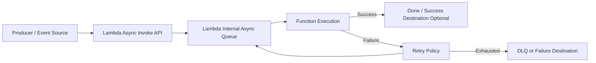

Async invocation is not “fire and forget.”

It is “fire and observe somewhere else.”

If you do not design failure handling, the failure still exists. You just moved it away from the producer’s request path.

---

## 1. Async Invocation Mental Model

Synchronous invocation:

```txt
caller waits for handler result
```

Asynchronous invocation:

```txt
caller waits only until Lambda accepts the event
handler result is handled later
```

Poll-based event source mapping:

```txt
Lambda poller reads records from a queue/stream and invokes the handler
```

These are three different contracts.

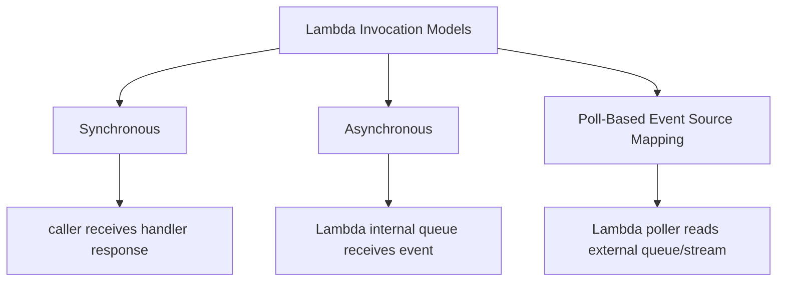

Part 059 covers **asynchronous invocation**.

Part 060 covers **event source mappings**.

Do not mix them mentally.

---

## 2. What Happens During Async Invocation

Async invocation path:

```txt
1. Producer submits event to Lambda.
2. Lambda validates and accepts event.
3. Lambda stores event in internal queue.
4. Lambda later invokes function.
5. If handler succeeds, processing ends.
6. If handler fails, Lambda retries according to async config.
7. If retries/event age are exhausted, event goes to destination/DLQ if configured.
```

Key properties:

- producer success does not mean handler success;
- handler failure is not directly returned to producer;
- retry is controlled by Lambda async settings;
- duplicate processing is possible;
- event age matters;
- capacity throttling can delay events;
- failure destination/DLQ is required for production-critical events;
- observability must include async event age and destination failures.

---

## 3. Async Invocation Sources

Common sources that invoke Lambda asynchronously:

| Source | Notes |
|---|---|
| EventBridge rule | event routing/fanout, archive/replay possible at bus level |
| SNS topic | pub/sub fanout, message attributes/filtering |
| S3 event notification | object event trigger, duplicate/out-of-order considerations |
| Lambda `Invoke` API with `Event` type | explicit async invoke |
| CloudWatch Logs subscription | log processing pipeline |
| AWS Config / CloudFormation custom integrations | service-specific async patterns |
| Some AWS service notifications | service-dependent retry/source behavior |

Not all “Lambda triggers” are async invokes. SQS/Kinesis/DynamoDB Streams use event source mappings, not the same async invocation model.

---

## 4. Retry Behavior

For asynchronous invocation, Lambda retries function errors. AWS documents that Lambda retries async function errors twice by default. If the function does not have enough capacity, events may wait in the queue for hours before being sent to the function.

That means two retry dimensions exist:

```txt
function error retries
capacity/throttle delay
```

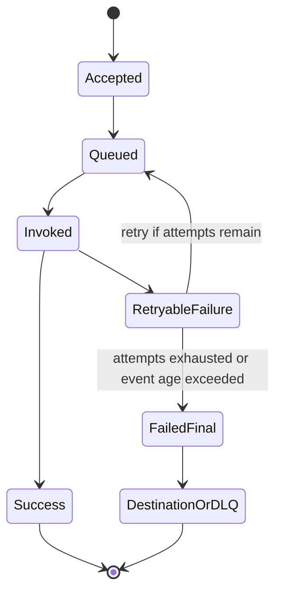

### Configurable Async Controls

Async invocation supports controls such as:

- maximum retry attempts;
- maximum event age;
- dead-letter queue;
- on-success destination;
- on-failure destination.

### Engineering Meaning

| Setting | What It Controls |
|---|---|
| max retry attempts | how many extra handler attempts after failure |
| max event age | how stale an event may become before discard/failure path |
| DLQ | where failed original events are captured |
| destination | where invocation records are sent after success/failure |
| reserved concurrency | how much processing capacity function may consume |
| function timeout | maximum handler duration per attempt |

Retries are not a substitute for correctness. They are a way to recover from transient failure.

---

## 5. Event Age

Event age is one of the most important async metrics.

An async event can sit in Lambda’s internal queue before execution when:

- function is throttled;
- reserved concurrency is too low;
- account concurrency is exhausted;
- function errors and retries later;
- downstream dependency slows duration and reduces throughput;
- traffic spike exceeds processing capacity.

If maximum event age is exceeded, the event can be discarded or sent to failure destination/DLQ depending configuration.

### Event Age Design

Ask:

```txt
How old can this event be and still be valid?
```

Examples:

| Event | Max Useful Age |
|---|---|
| send welcome email | hours may be acceptable |
| invalidate auth token | seconds/minutes |
| create audit record | long, but must not be lost |
| update search index | minutes maybe okay |
| payment captured event | must process/reconcile, age should alarm |
| deadline escalation | strict domain deadline |
| cache refresh | stale event may be dropped |

Different event types deserve different age policies.

---

## 6. DLQ vs Destination

Lambda async failure handling can use dead-letter queues and destinations.

They are related but not identical.

### DLQ

A dead-letter queue captures failed events after retries are exhausted.

Usually target:

- SQS queue;
- SNS topic.

DLQ is useful for:

- preserving failed original event;
- operator inspection;
- redrive workflow;
- poison event analysis;
- durable failure buffer.

### Destinations

Destinations can receive invocation records for success or failure.

An invocation record may include:

- request context;
- response context;
- function error;
- original event;
- metadata.

Destinations can target services such as:

- SQS;
- SNS;
- EventBridge;
- Lambda.

### Decision

| Need | Prefer |
|---|---|
| capture failed original events for later redrive | DLQ or failure destination to SQS |
| route success/failure outcome to workflow | destination |
| trigger compensating function | failure destination |
| send failure to event bus for platform handling | EventBridge destination |
| manual replay by operators | SQS DLQ/failure queue |
| audit success of async invoke | success destination |

For production, pick one deliberate failure-capture mechanism and make it observable.

Do not configure both casually without understanding duplicate operational paths.

---

## 7. Success Destinations

Success destinations are useful when downstream systems need to know that processing completed.

Example:

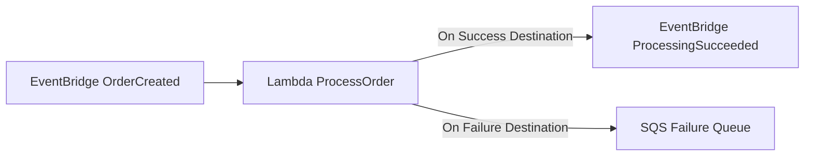

Use success destinations for:

- audit/event chaining;
- notifying workflow orchestrator;
- decoupled continuation;
- platform-level processing records.

Be careful:

- success destination does not make side effects transactional;
- destination delivery can fail;
- success records can become a second event stream to govern;
- you still need idempotency.

If the continuation is business-critical and multi-step, Step Functions may be clearer than chained async destinations.

---

## 8. Duplicate Delivery

Async invocation can result in duplicate handler execution.

Causes:

- function timeout after side effect;
- retry after transient error;
- producer retry after invoke accept uncertainty;
- destination/redrive replay;
- EventBridge archive replay;
- manual operator replay;
- Lambda service behavior under distributed failure;
- upstream duplicate event.

Therefore:

```txt
async Lambda with side effects must be idempotent
```

### Duplicate-Safe Handler

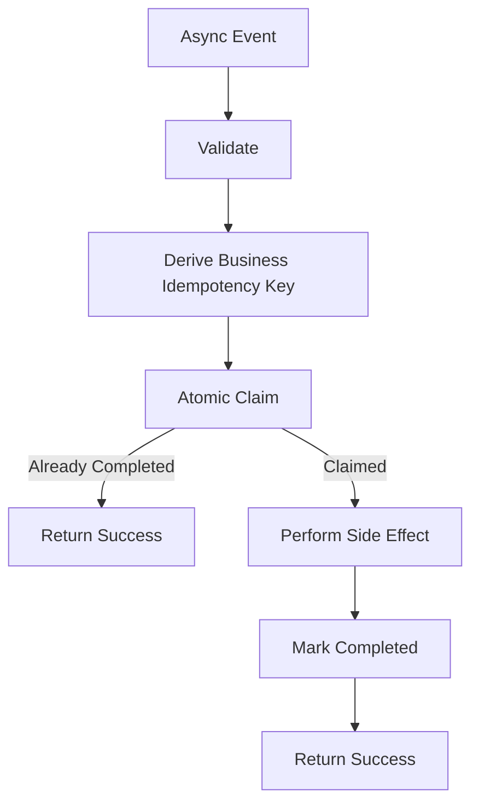

Do not use Lambda request ID as idempotency key. It changes per attempt.

Use a business key.

---

## 9. Poison Events

A poison event is an event that will never succeed without code/config/data correction.

Examples:

- malformed payload;
- unsupported schema version;
- invalid tenant;
- missing required business resource;
- invalid enum;
- impossible state transition;
- event too old to apply;
- corrupted data reference.

Retrying poison events wastes capacity and delays valid events.

### Poison Event Strategy

1. Validate early.
2. Classify permanent vs retryable.
3. For permanent poison:
   - write quarantine record;
   - emit metric;
   - return success if you have safely captured/quarantined it, or fail into DLQ depending policy.
4. For retryable:
   - throw/return error to let Lambda retry.
5. Alert when poison rate exceeds baseline.

### Important Trade-Off

If you return success after quarantining poison event, Lambda will not retry it.

That is correct only if quarantine is durable and monitored.

If quarantine write fails, fail the invocation.

---

## 10. Async Fanout

EventBridge/SNS fanout can turn one event into many Lambda invocations.

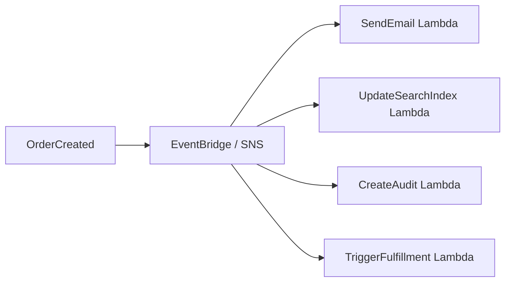

Benefits:

- decoupled consumers;
- independent deployability;
- each consumer has own failure handling;
- easier extension.

Risks:

- fanout explosion;
- every consumer retries during outage;
- duplicated downstream calls;
- event schema drift;
- observability fragmented;
- no global transaction;
- one bad event creates many failures.

### Fanout Design Rules

- every consumer owns idempotency;
- every consumer has failure destination/DLQ;
- event schema is versioned;
- correlation ID is propagated;
- consumer-specific retry policy exists;
- heavy consumers should use SQS buffer;
- critical workflow coordination should use Step Functions when ordering/compensation matters.

---

## 11. EventBridge to Lambda

EventBridge is a common async Lambda source.

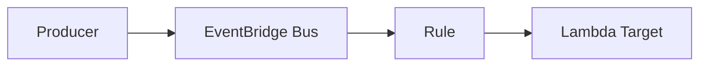

Use it when:

- producer and consumer should be decoupled;
- event pattern routing is needed;
- multiple consumers may exist;
- cross-account integration is needed;
- archive/replay is valuable;
- event contracts can be governed.

### Event Pattern Precision

Bad broad pattern:

```json
{
  "source": [{ "prefix": "" }]
}
```

Better:

```json
{
  "source": ["com.example.orders"],
  "detail-type": ["OrderCreated"],
  "detail": {
    "schemaVersion": ["1.0", "1.1"]
  }
}
```

Broad rules create accidental consumers.

### EventBridge Failure Concern

EventBridge successfully delivering to Lambda does not guarantee handler success.

Lambda async failure handling still matters.

### Pattern: EventBridge → SQS → Lambda

For heavy or critical consumers, prefer:

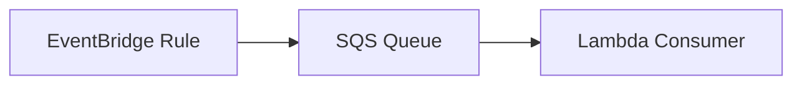

Benefits:

- consumer-specific buffer;
- visible backlog;
- redrive control;
- maximum concurrency;
- DLQ;
- easier backpressure.

Direct EventBridge → Lambda is fine for lightweight, bounded, idempotent handlers.

---

## 12. SNS to Lambda

SNS invokes Lambda asynchronously for subscribed functions.

Use SNS when:

- simple pub/sub fanout;
- message attributes/filtering;
- existing SNS ecosystem;
- multiple protocols/subscribers;
- low operational overhead.

Risks:

- duplicate messages;
- fanout retry behavior;
- message filtering mistakes;
- no consumer-specific backlog unless combined with SQS;
- failure visibility requires DLQ/destination/metrics.

For production fanout to critical consumers, consider:

```txt
SNS -> SQS per consumer -> Lambda
```

This gives each consumer its own durable buffer and DLQ.

---

## 13. S3 Event Notification to Lambda

S3 can invoke Lambda asynchronously for object events.

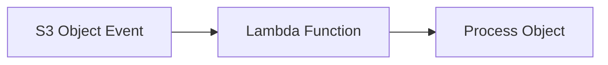

Use cases:

- image processing;
- document ingestion;
- metadata extraction;
- ETL trigger;
- virus scanning pipeline;
- index update.

Risks:

- duplicate events;
- object overwritten/deleted before processing;
- large object processing timeout;
- recursive trigger if function writes back to same prefix;
- out-of-order object events;
- missing version validation;
- permission mistakes;
- no durable queue visibility unless S3 -> SQS/EventBridge is used.

### S3 Handler Rules

- use bucket + key + version ID where available;
- URL-decode key correctly;
- validate prefix/suffix;
- avoid writing processed output to trigger prefix;
- use object ETag/checksum/version for idempotency;
- handle missing object;
- handle object too large;
- do not log full object content;
- consider S3 -> SQS -> Lambda for buffering.

### Recursive Trigger Anti-Pattern

```txt
S3 prefix input/
Lambda processes object
Lambda writes output to input/
S3 triggers Lambda again
```

Use separate prefixes/buckets:

```txt
input/
processed/
failed/
```

---

## 14. Async Invocation vs SQS Buffer

Direct async Lambda has an internal queue, but it is not the same as SQS.

| Feature | Lambda Async Queue | SQS |
|---|---|---|
| visible backlog | limited via metrics | explicit queue depth |
| consumer max concurrency | function reserved concurrency | mapping max concurrency + reserved concurrency |
| manual redrive | via DLQ/destination if configured | first-class redrive |
| message retention | Lambda async event age config | queue retention |
| multi-consumer isolation | per function | per queue |
| operator inspection | less direct | direct |
| backpressure model | implicit | explicit |
| delay/dead-letter controls | limited | strong |
| FIFO ordering | no | SQS FIFO |
| replay workflow | less direct | operationally clear |

Use direct async Lambda for simple bounded tasks.

Use SQS when you need explicit buffering, backpressure, redrive, or consumer isolation.

---

## 15. Backpressure in Async Systems

Async systems do not remove overload. They move overload into queues and retry paths.

Backpressure means the system can slow down consumption safely when downstream cannot keep up.

Direct async Lambda has limited backpressure controls:

- reserved concurrency;
- event age;
- retries;
- destination/DLQ.

SQS gives stronger controls:

- queue depth visibility;
- consumer max concurrency;
- DLQ/redrive;
- retention;
- delay;
- FIFO group controls.

### Decision

```txt
If downstream capacity is finite and events are important:
    use explicit queue buffer
```

Example:

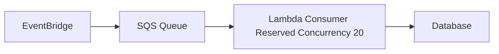

This is safer than:

```txt
EventBridge -> Lambda -> Database
```

when event volume is bursty.

---

## 16. Async Error Taxonomy

Async functions need clear error behavior.

| Error Type | Handler Behavior |
|---|---|
| validation/poison | quarantine or fail to DLQ deliberately |
| duplicate completed | return success |
| idempotency in progress | throw retryable or return controlled result depending source |
| transient downstream | throw retryable |
| dependency throttling | throw retryable, maybe circuit break |
| config missing | fail fast and alarm |
| authorization/source mismatch | quarantine/security alert |
| timeout budget low | throw retryable before side effect |
| ambiguous commit | reconcile using external idempotency/lookup |

### Throw or Return?

For async invocation:

- returning success tells Lambda processing is complete;
- throwing causes retry/failure path.

Therefore:

```txt
return success only when the event is safely completed, duplicate-completed, or durably quarantined
throw when retry is required
```

Do not swallow errors to keep dashboards green.

---

## 17. Async Observability

Minimum metrics/logs:

| Signal | Why |
|---|---|
| invocations | event volume |
| errors | failed attempts |
| throttles | capacity issue |
| async event age | backlog/staleness |
| DLQ depth | terminal failures |
| destination failures | failure path broken |
| duplicate completed | replay/duplication visibility |
| poison events | producer/schema issue |
| retryable errors | downstream instability |
| function duration | throughput capacity |
| concurrency | processing pressure |
| idempotency conflicts | bad producer/key reuse |
| event age in payload | business staleness |

### Log Event Context

```json
{
  "service": "order-indexer",
  "event_source": "eventbridge",
  "event_type": "OrderCreated",
  "event_id": "evt-123",
  "correlation_id": "corr-456",
  "idempotency_key": "tenant-1:OrderCreated:ord-789:v1",
  "attempt_outcome": "RETRYABLE_ERROR",
  "error_code": "OPENSEARCH_TIMEOUT",
  "retryable": true
}
```

### Alarm Set

- function errors > baseline;
- async event age rising;
- throttles > 0;
- DLQ/failure destination messages > 0;
- destination delivery failure;
- poison event spike;
- duplicate spike after redrive/replay;
- duration p95 near timeout;
- reserved concurrency saturated.

---

## 18. Redrive and Replay

Redrive is not “click retry.”

It is a controlled production operation.

Before redrive:

1. Identify root cause.
2. Confirm code/config fix deployed.
3. Confirm idempotency works.
4. Estimate volume.
5. Estimate downstream capacity.
6. Set safe concurrency.
7. Preserve sample failed events.
8. Communicate expected duplicates.
9. Monitor backlog, errors, downstream.
10. Stop if poison pattern repeats.

### Redrive Flow

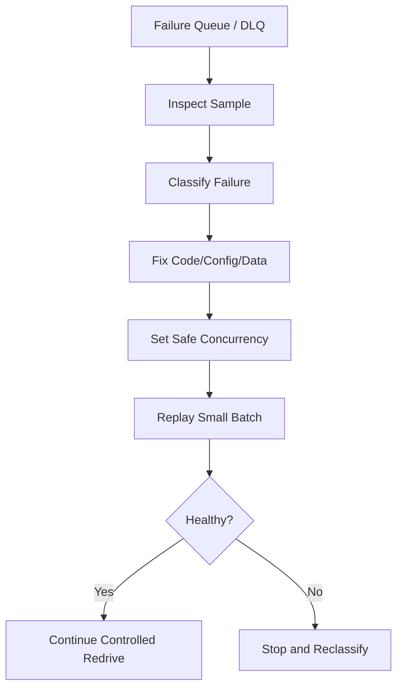

### Redrive Safety

If idempotency is weak, redrive can duplicate side effects.

Never redrive payment, notification, case-decision, or audit events without idempotency proof.

---

## 19. Async Pattern Catalog

### Pattern A — Lightweight Event Handler

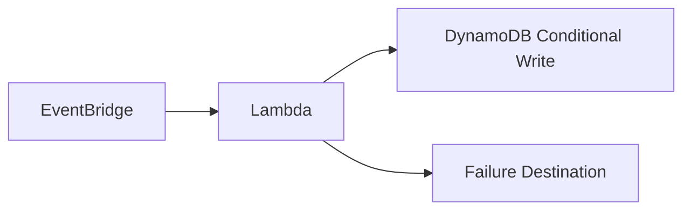

Use when:

- handler is short;
- idempotent;
- downstream can absorb volume;
- failure destination exists.

### Pattern B — Buffered Consumer

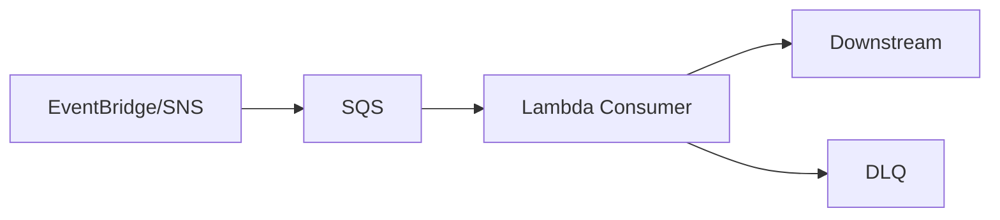

Use when:

- downstream needs protection;
- backlog must be visible;
- redrive matters;
- event volume is bursty.

### Pattern C — Audit-Critical Async Handler

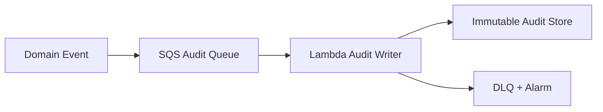

Use when:

- audit evidence must not silently disappear;
- DLQ alarm is mandatory;
- idempotent audit event ID exists.

### Pattern D — Async to Workflow

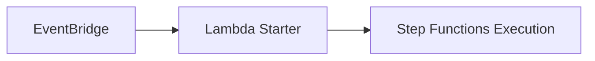

Use when:

- event starts multi-step process;
- execution name can be deterministic;
- workflow has retries/compensation.

Often you can remove the starter Lambda and use EventBridge → Step Functions directly if no custom logic is needed.

### Pattern E — S3 Ingestion

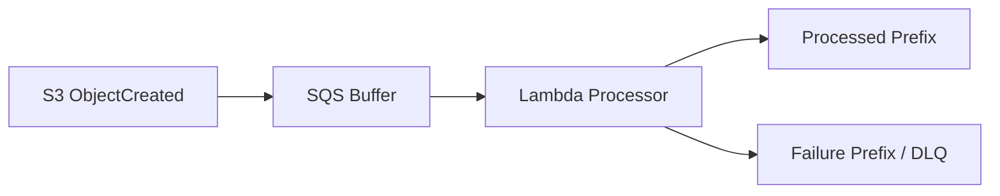

Use when:

- files can be large;
- retries/redrive matter;
- object versioning/idempotency matters;
- recursive triggers must be avoided.

---

## 20. Async Configuration Example

Conceptual SAM-style config:

```yaml
PaymentEventHandler:
  Type: AWS::Serverless::Function
  Properties:
    Handler: com.example.PaymentHandler::handleRequest
    Runtime: java21
    Timeout: 30
    MemorySize: 1024
    ReservedConcurrentExecutions: 50
    EventInvokeConfig:
      MaximumRetryAttempts: 2
      MaximumEventAgeInSeconds: 3600
      DestinationConfig:
        OnFailure:
          Type: SQS
          Destination: !GetAtt PaymentFailureQueue.Arn
```

Important:

- `ReservedConcurrentExecutions` protects downstream;
- `MaximumRetryAttempts` bounds retry amplification;
- `MaximumEventAgeInSeconds` bounds stale work;
- failure destination preserves failed events;
- alarms must be configured separately.

Configuration without alarms is incomplete.

---

## 21. Async Runbook

### Symptom: DLQ / Failure Destination Has Messages

Questions:

1. Which function?
2. Which event source?
3. Which event type/schema version?
4. Error code?
5. Retryable or permanent?
6. Recent deployment/config change?
7. One tenant or all?
8. Downstream failure?
9. Are duplicates safe?
10. Can the event still be valid given age?

Actions:

```txt
capture sample
classify failure
pause/cap function if needed
fix root cause
test with sample event in non-prod
redrive small batch
monitor
continue controlled redrive
```

### Symptom: Async Event Age Rising

Likely causes:

- function throttled;
- reserved concurrency too low;
- account concurrency exhausted;
- handler duration increased;
- downstream slow;
- errors/retries consuming capacity;
- traffic spike.

Actions:

- check throttles/concurrency;
- check duration;
- check downstream latency;
- check errors;
- increase concurrency only if downstream safe;
- otherwise reduce work, fix downstream, or buffer differently.

### Symptom: Producer Succeeded But Business Outcome Missing

Trace:

```txt
producer log
event accepted
Lambda invocation log
idempotency record
side effect record
destination/DLQ
business audit
```

If no event identity/correlation exists, observability design is broken.

---

## 22. Async Design Checklist

### Invocation

- [ ] Source identified.
- [ ] Event schema and version defined.
- [ ] Event pattern/filter precise.
- [ ] Producer success semantics understood.
- [ ] Business max event age defined.

### Retry and Failure

- [ ] Maximum retry attempts configured.
- [ ] Maximum event age configured.
- [ ] DLQ or failure destination configured.
- [ ] Failure destination alarmed.
- [ ] Destination delivery failure monitored.
- [ ] Poison event strategy defined.
- [ ] Redrive process tested.

### Correctness

- [ ] Idempotency key defined.
- [ ] Side effects idempotent.
- [ ] Duplicate completed returns success.
- [ ] Ambiguous commit handled.
- [ ] Permanent vs retryable errors classified.
- [ ] Timeout budget protects side effects.

### Capacity

- [ ] Reserved concurrency set where needed.
- [ ] Downstream capacity known.
- [ ] Async event age alarm exists.
- [ ] Backpressure evaluated.
- [ ] SQS buffer used for heavy/critical consumers.

### Observability

- [ ] Correlation ID propagated.
- [ ] Event ID logged.
- [ ] Error codes emitted.
- [ ] Idempotency status emitted.
- [ ] Function version/alias logged.
- [ ] Dashboard includes source, Lambda, destination, downstream.

---

## 23. Common Anti-Patterns

### Anti-Pattern 1 — “Fire and Forget”

Async without DLQ/destination/alarm is not reliable.

### Anti-Pattern 2 — Direct EventBridge to Heavy Lambda to Database

No explicit buffer, weak backpressure, database overload risk.

### Anti-Pattern 3 — No Idempotency

Retries and redrive duplicate side effects.

### Anti-Pattern 4 — Catch All and Return Success

Events disappear even though side effects failed.

### Anti-Pattern 5 — Throw Permanent Poison Forever

Invalid event burns retries, fills DLQ, hides producer contract issue.

### Anti-Pattern 6 — No Event Age Policy

Stale business events apply after they no longer make sense.

### Anti-Pattern 7 — No Correlation ID Across Async Boundary

Producer and consumer timelines cannot be connected.

### Anti-Pattern 8 — Redrive Without Fix

Replays the incident.

---

## 24. Final Mental Model

Asynchronous Lambda is not a background thread.

It is a managed event queue plus retry system with producer/consumer decoupling.

The design question is:

```txt
What happens after the producer is told success but the handler fails?
```

A production async Lambda must define:

- event identity;
- retry policy;
- event age;
- idempotency;
- failure destination;
- redrive process;
- backpressure;
- observability;
- downstream protection;
- business validity window.

A top-tier engineer does not say:

> “This is async, so the user does not wait.”

They say:

> “This is async, so failure must be visible somewhere else, duplicates must be safe, and replay must be controlled.”

That is async Lambda engineering.

---

## References

- AWS Lambda Developer Guide: invoking Lambda functions asynchronously
- AWS Lambda Developer Guide: understanding retry behavior in Lambda
- AWS Lambda Developer Guide: capturing records of asynchronous invocations with destinations and dead-letter queues
- AWS Lambda Developer Guide: monitoring Lambda functions
- Amazon EventBridge documentation
- Amazon SNS documentation
- Amazon S3 event notification documentation
