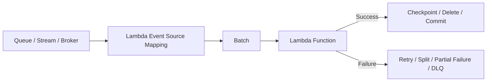
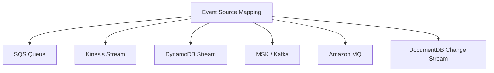
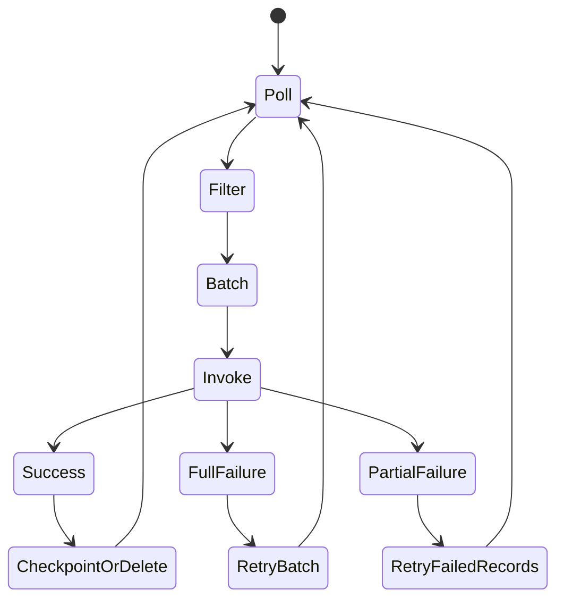
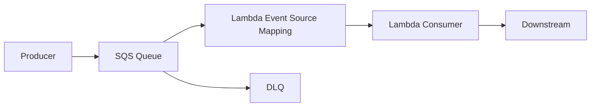
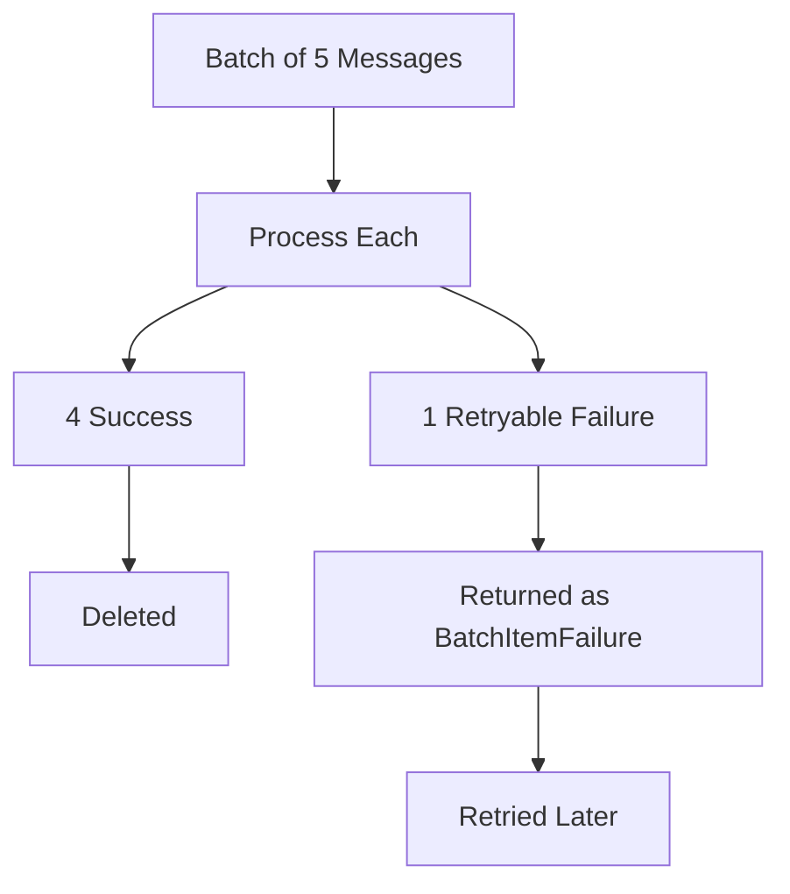
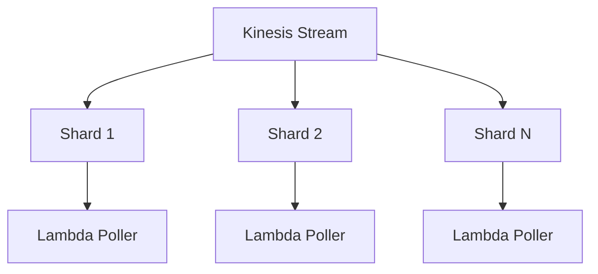
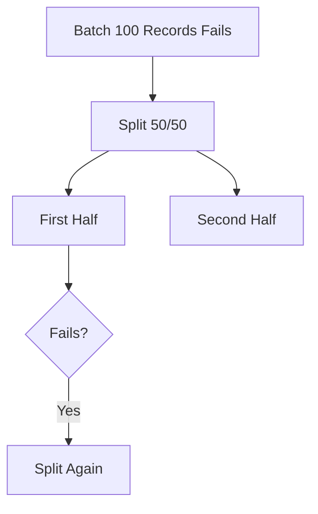
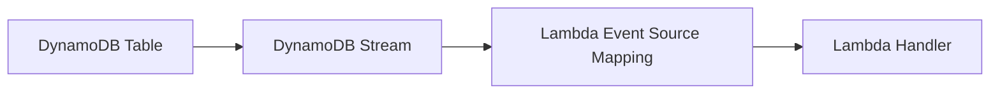
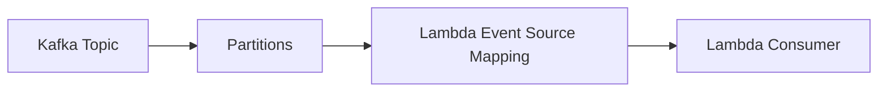
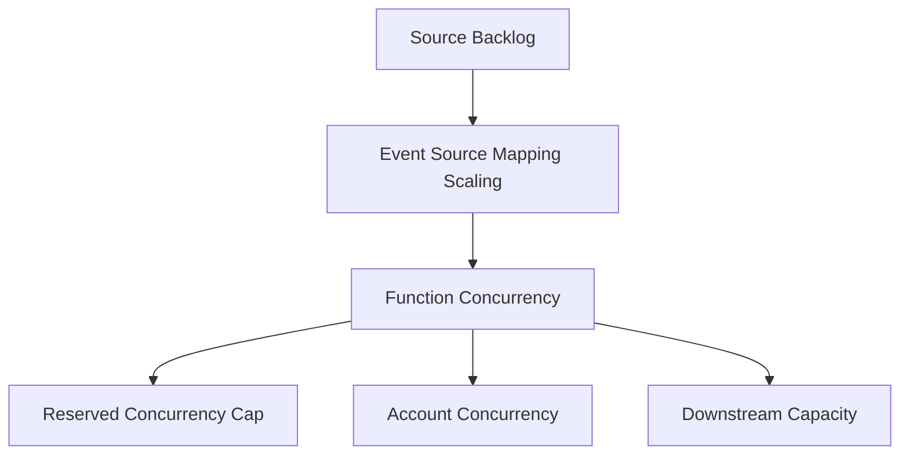

# Part 060 — Lambda Event Source Mapping

An event source mapping is not just a trigger.

It is a managed poller and invocation adapter.

For queues and streams, Lambda does not wait for the source to call it. Lambda reads records from the source, batches them, invokes your function, and advances or retries according to source-specific semantics.



This is a different contract from asynchronous invocation.

Async invocation:

```txt
producer -> Lambda internal queue -> function
```

Event source mapping:

```txt
external queue/stream -> Lambda poller -> function
```

The poller is part of your architecture.

---

## 1. Supported Event Source Mapping Sources

Event source mappings are used with sources such as:

- Amazon SQS;
- Kinesis Data Streams;
- DynamoDB Streams;
- Amazon MSK;
- self-managed Kafka;
- Amazon MQ for ActiveMQ/RabbitMQ;
- Amazon DocumentDB change streams.

Different sources have different semantics.



The source determines:

- ordering;
- batching;
- concurrency;
- checkpoint behavior;
- retry behavior;
- failure isolation;
- offset/sequence progression;
- DLQ/destination options;
- filtering support;
- scaling model.

Do not design one generic “Lambda trigger” pattern for all sources.

---

## 2. Event Source Mapping Lifecycle

Conceptual lifecycle:

```txt
1. Lambda poller reads records from source.
2. Poller applies optional filter criteria.
3. Poller batches records.
4. Lambda invokes function with batch.
5. Function returns success, error, or partial batch failure response.
6. Mapping deletes/checkpoints/commits successful records.
7. Failed records are retried according to source/config.
8. Records may eventually go to failure destination/DLQ depending source and config.
```



The handler does not own polling. It owns batch processing correctness.

---

## 3. Queue vs Stream Semantics

### Queue Semantics

SQS:

- messages are independent;
- ordering optional for FIFO;
- successful messages are deleted;
- failed messages become visible after visibility timeout;
- DLQ is source-level;
- concurrency can scale with backlog;
- duplicate messages are possible.

### Stream Semantics

Kinesis/DynamoDB Streams:

- ordered records per shard;
- checkpoint advances through sequence numbers;
- failed batch can block progress;
- iterator age measures lag;
- poison record can stall shard;
- concurrency tied to shard and parallelization settings;
- retry/record age settings matter.

### Broker Semantics

Kafka/MSK/MQ:

- offset/ack semantics;
- partitions/consumer groups;
- broker connectivity/auth;
- batch processing;
- poison message and offset progression must be understood.

Each model needs different failure handling.

---

## 4. SQS Event Source Mapping

SQS + Lambda is one of the most important serverless integration patterns.



Use SQS when:

- producers burst;
- consumers need backpressure;
- downstream capacity is finite;
- failures need DLQ/redrive;
- producer and consumer should be decoupled;
- message processing can be idempotent.

### SQS Mapping Controls

| Control | Purpose |
|---|---|
| batch size | messages per invocation |
| maximum batching window | wait time to build batch |
| visibility timeout | message hidden while being processed |
| maximum concurrency | cap concurrent invokes for this mapping |
| function reserved concurrency | cap total function concurrency |
| partial batch response | retry only failed messages |
| filter criteria | drop irrelevant messages before invoke |
| DLQ/redrive policy | terminal failure path |

### SQS Scaling

AWS documents that, by default, Lambda can scale to invoke up to 1,250 concurrent function instances for an SQS event source mapping. This can be different from your account concurrency and should be designed deliberately.

That number should scare you if the consumer writes to a database.

### SQS Capacity Formula

```txt
messages_per_second ≈ concurrency × batch_size / batch_duration_seconds
```

Example:

```txt
concurrency = 50
batch size = 10
batch duration = 2 seconds

throughput ≈ 250 messages/second
```

If downstream can handle 100 messages/second, this mapping is too aggressive.

---

## 5. SQS Visibility Timeout

Visibility timeout is the time a message remains hidden from other consumers after being received.

Rule:

```txt
visibility_timeout > lambda_timeout + retry/cleanup_buffer
```

If visibility timeout is too short:

```txt
same message can be processed concurrently by another invocation
```

Example:

```txt
Lambda timeout = 60s
visibility timeout = 30s
```

Bad. A long-running invocation can still be processing when the message becomes visible again.

Safer:

```txt
Lambda timeout = 60s
visibility timeout = 180s
```

Also consider:

- batch duration;
- downstream timeout;
- retry behavior;
- max receive count;
- DLQ policy;
- idempotency.

Visibility timeout is a correctness setting, not only queue plumbing.

---

## 6. SQS Partial Batch Response

Without partial batch response:

```txt
one failed message -> entire batch retried
```

That repeats successful messages.

With partial batch response:

```txt
handler returns IDs of failed messages
Lambda deletes successful messages
only failed messages are retried
```



### Handler Pattern

```java
public SQSBatchResponse handleRequest(SQSEvent event, Context context) {
    List<SQSBatchResponse.BatchItemFailure> failures = new ArrayList<>();

    for (SQSEvent.SQSMessage message : event.getRecords()) {
        try {
            processOne(message, context);
        } catch (PermanentMessageException e) {
            quarantine(message, e);
            // treat as success after durable quarantine
        } catch (RetryableException e) {
            failures.add(new SQSBatchResponse.BatchItemFailure(message.getMessageId()));
        }
    }

    return new SQSBatchResponse(failures);
}
```

### Best Practices

- process each record independently;
- make side effects idempotent;
- return only retryable failed message IDs;
- quarantine permanent poison records;
- do not throw after building partial failure list unless entire batch is unsafe;
- emit metrics for successes/failures/poison;
- keep batch size compatible with memory and timeout.

---

## 7. SQS FIFO

SQS FIFO adds ordering by message group.

Important properties:

- messages in same message group are ordered;
- different groups can process in parallel;
- poison message can block its group;
- concurrency depends on active message groups;
- deduplication window does not replace business idempotency.

### Design

```txt
message_group_id = ordering boundary
```

Examples:

| Workload | Message Group |
|---|---|
| account ledger | account ID |
| case lifecycle | case ID |
| order updates | order ID |
| tenant-global sequence | tenant ID |

Do not use one global message group unless you want single-threaded processing.

### FIFO Poison Message

If one message in a group fails forever, later messages in that group are blocked.

You need:

- DLQ;
- poison classification;
- redrive policy;
- manual/automated repair;
- idempotency;
- business decision for skipping invalid transition.

---

## 8. Kinesis Event Source Mapping

Kinesis streams are shard-based.



AWS documents that Lambda polls each Kinesis shard at a base rate of once per second using standard iterators and continues processing batches until caught up when more records are available.

### Kinesis Controls

| Control | Purpose |
|---|---|
| batch size | records per invoke |
| maximum batching window | latency vs efficiency |
| starting position | where to begin |
| parallelization factor | concurrent batches per shard |
| bisect batch on error | split failed batch |
| maximum retry attempts | bound retries |
| maximum record age | drop/fail stale records |
| destination on failure | preserve failed records |
| partial batch response | checkpoint partial successes |
| filter criteria | reduce invoke volume |

### Iterator Age

Iterator age means how far behind the consumer is.

If iterator age rises:

- consumer is slower than producer;
- function errors/retries block progress;
- batch size too small/large;
- downstream slow;
- concurrency/parallelization insufficient;
- poison record is blocking shard;
- throttling occurs.

Iterator age is the stream equivalent of backlog age.

---

## 9. Kinesis Failure Handling

By default, if a batch fails, Lambda retries the batch. This can block checkpoint progress.

Controls:

### Bisect Batch on Error

Split failed batch into halves and retry, helping isolate poison records.



### Maximum Record Age

Prevents extremely old records from being retried indefinitely.

### Maximum Retry Attempts

Bounds retry count.

### On-Failure Destination

Preserves metadata for records that cannot be processed after retry policy.

### Partial Batch Response

When enabled, the function can report failed sequence numbers so Lambda can checkpoint successful earlier records and retry from the failed item.

Use it carefully and test ordering semantics.

---

## 10. DynamoDB Streams Event Source Mapping

DynamoDB Streams are often used to react to table changes.



Use cases:

- materialized views;
- search index updates;
- audit/event propagation;
- denormalization;
- cache invalidation;
- outbox-like propagation;
- integration events.

### Record Semantics

Records may include:

- event name: `INSERT`, `MODIFY`, `REMOVE`;
- keys;
- old image;
- new image;
- sequence number;
- approximate creation time.

### Design Rules

- handle all expected event names;
- ignore irrelevant changes with filter criteria if possible;
- use sequence/order per shard carefully;
- make downstream writes idempotent;
- guard against recursive writes;
- use partial batch response/bisect/retry controls;
- monitor iterator age;
- do not put heavy side effects directly on table hot path without capacity planning.

### Recursive Update Risk

Bad:

```txt
DynamoDB update -> stream -> Lambda -> update same item -> stream -> Lambda -> ...
```

Mitigate with:

- marker attributes;
- condition checks;
- separate tables;
- event type filters;
- idempotent state transitions;
- no-op detection.

---

## 11. Kafka / MSK Event Source Mapping

Lambda can consume from Amazon MSK and self-managed Kafka.

Kafka brings broker-specific concerns:

- topics;
- partitions;
- consumer groups;
- offsets;
- authentication;
- networking;
- batch size/window;
- poison messages;
- partition lag;
- broker availability;
- schema registry;
- ordering per partition.



Use Lambda with Kafka when:

- processing per batch is short;
- consumer can tolerate Lambda lifecycle;
- scaling and partition count fit;
- network/auth is well understood;
- poison-message strategy exists;
- handler is idempotent.

Be cautious when:

- consumer needs long-lived state;
- offset control must be highly customized;
- processing is long-running;
- low-latency high-throughput streaming requires specialized consumer;
- payloads are large;
- ordering/transactions are complex.

ECS/EKS consumer service may be better for highly stateful, always-on Kafka consumers.

---

## 12. Event Filtering

Event source mappings can filter events before invoking the function for supported sources.

Benefits:

- fewer invocations;
- lower cost;
- less handler branching;
- lower noise;
- less downstream pressure.

Example use cases:

- only DynamoDB `INSERT`;
- only SQS messages of type `InvoiceRequested`;
- only stream records where status changed to `READY`;
- only tenant class or event category.

### Filtering Warning

Filtering drops non-matching events from the Lambda invocation path.

Make sure this is intended.

Do not use filter criteria as the only business authorization mechanism. It is routing optimization, not full validation.

Handler should still validate event type/schema.

---

## 13. Batch Size and Batch Window

Batching trades latency for efficiency.

### Larger Batch

Pros:

- fewer invocations;
- better throughput;
- amortizes init/connection overhead;
- lower per-record cost.

Cons:

- more memory;
- longer duration;
- higher retry blast radius;
- more complex partial failure;
- timeout risk;
- larger payload to handler.

### Smaller Batch

Pros:

- lower latency;
- easier failure isolation;
- lower memory;
- shorter invocations.

Cons:

- more invocations;
- higher overhead;
- lower throughput if concurrency unchanged.

### Batch Window

Batch window lets Lambda wait to collect more records before invoking.

Use it when:

- throughput efficiency matters;
- small latency delay is acceptable;
- batch processing downstream is efficient.

Avoid it for latency-sensitive workflows.

---

## 14. Concurrency Controls

Event source mappings interact with Lambda concurrency.

Controls include:

- function reserved concurrency;
- event source mapping maximum concurrency for SQS;
- stream shard count;
- stream parallelization factor;
- Kafka partitions;
- batch duration;
- account concurrency limit.



### Rule

```txt
source scaling must be lower than or equal to downstream safe capacity
```

Do not let SQS mapping scale to 1,250 consumers against a database that can handle 50 writers.

---

## 15. Function Errors vs Mapping Errors

Different failures appear in different places.

### Function Errors

- handler throws;
- timeout;
- runtime crash;
- memory failure;
- partial batch response with failures;
- validation failure not quarantined.

### Mapping Errors

- source permission issue;
- poller cannot read source;
- broker auth failure;
- VPC/network failure to Kafka/MQ;
- filter criteria invalid;
- destination misconfigured;
- function throttled;
- batch too large;
- payload malformed.

Observability must include both Lambda metrics and source/mapping metrics.

---

## 16. Handler Contract

For event source mapping, handler should:

1. Accept a batch.
2. Process records independently where source allows.
3. Validate each record.
4. Derive idempotency key per business operation.
5. Apply side effects idempotently.
6. Classify permanent vs retryable errors.
7. Return partial batch failure response where supported and appropriate.
8. Avoid throwing after successful records unless the entire batch is unsafe.
9. Emit batch metrics.
10. Respect remaining time.

### Generic Batch Handler Shape

```java
public BatchResult handle(BatchEvent event, Context context) {
    List<RecordFailure> failures = new ArrayList<>();

    for (Record record : event.records()) {
        if (context.getRemainingTimeInMillis() < SAFE_REMAINING_MS) {
            failures.add(record.retryableFailure("TIMEOUT_BUDGET_LOW"));
            continue;
        }

        try {
            processRecord(record);
        } catch (PermanentRecordException e) {
            quarantine(record, e);
        } catch (RetryableRecordException e) {
            failures.add(record.retryableFailure(e.code()));
        }
    }

    return BatchResult.of(failures);
}
```

---

## 17. Poison Record Strategy

A poison record in event source mapping can damage throughput.

### SQS Poison

Eventually reaches DLQ after max receive count.

### FIFO Poison

Blocks message group.

### Kinesis/DynamoDB Poison

Can block shard/checkpoint until retry policy/failure handling advances.

### Kafka Poison

Can block partition/offset progression depending mapping behavior and error handling.

### Strategy

```txt
detect -> classify -> quarantine -> checkpoint/delete/skip if safe -> alert -> repair/redrive
```

Quarantine record should include:

- source;
- event ID/message ID/sequence number;
- payload reference or redacted payload;
- error code;
- raw schema version;
- tenant/resource;
- timestamp;
- handler version;
- correlation ID.

Do not simply drop poison records without evidence.

---

## 18. DLQ and Failure Destinations

For SQS, DLQ is usually configured on the source queue redrive policy.

For stream sources, Lambda event source mapping supports failure destination for records that cannot be processed after configured retry/age controls.

Design questions:

- Where do terminal failures go?
- Is the failed payload preserved?
- Is there enough metadata to replay?
- Who owns redrive?
- How are poison records distinguished from transient failures?
- Is DLQ alarmed?
- How long are DLQ messages retained?
- Are messages encrypted?
- Are PII/secrets protected?

A DLQ without an alarm is a trash can.

A DLQ with a runbook is an operational control.

---

## 19. Event Source Mapping Observability

### Universal Metrics

- invocations;
- errors;
- duration;
- throttles;
- concurrency;
- batch size;
- partial failures;
- retry count;
- DLQ/failure destination count;
- downstream latency;
- idempotency status.

### SQS

- visible messages;
- not visible messages;
- age of oldest message;
- DLQ depth;
- receive count;
- Lambda max concurrency utilization;
- batch item failure count.

### Kinesis/DynamoDB Streams

- iterator age;
- records processed;
- batch failures;
- retry attempts;
- bisected batches;
- failure destination records;
- shard/partition lag;
- throttles.

### Kafka/MSK

- consumer lag;
- offset progression;
- broker connectivity;
- auth errors;
- partition error;
- batch duration;
- poison record count.

### Mapping State

Track whether the mapping is:

- enabled;
- disabled;
- failing;
- reading from expected source ARN;
- configured with expected batch settings;
- configured with correct function alias/version if applicable.

---

## 20. Event Source Mapping Runbooks

### Runbook: SQS Backlog Rising

Questions:

1. Is Lambda being invoked?
2. Is function throttled?
3. Is duration increasing?
4. Are errors increasing?
5. Is downstream slow?
6. Is maximum concurrency too low?
7. Is reserved concurrency reached?
8. Are messages poison?
9. Is DLQ filling?
10. Did producer volume increase?

Actions:

- inspect queue age/depth;
- inspect Lambda errors/duration/throttles;
- inspect downstream latency;
- inspect sample messages;
- cap or raise concurrency based on downstream safety;
- fix poison messages;
- redrive after fix.

### Runbook: Iterator Age Rising

Questions:

1. Which stream/shard?
2. Are function errors occurring?
3. Is a poison record blocking progress?
4. Is batch size/window appropriate?
5. Is downstream slow?
6. Is parallelization factor too low?
7. Is function throttled?
8. Are retry attempts/record age settings too permissive?
9. Is failure destination configured?

Actions:

- inspect errors;
- enable/validate partial batch response or bisect where appropriate;
- check failed sequence numbers;
- lower batch size if isolation needed;
- increase parallelization only if ordering/downstream safe;
- repair/quarantine poison record.

### Runbook: Mapping Not Invoking Function

Questions:

1. Is mapping enabled?
2. Is source ARN correct?
3. Does Lambda have permission to read source?
4. Are filter criteria excluding all records?
5. Is starting position correct?
6. Is source receiving records/messages?
7. Is function reserved concurrency set to zero?
8. Are network/auth settings correct for Kafka/MQ?
9. Are messages already consumed/deleted by another consumer?

Commands:

```bash
aws lambda list-event-source-mappings --function-name my-function
aws lambda get-event-source-mapping --uuid <uuid>
```

### Runbook: DLQ Filling

Actions:

1. Pause/cap consumer if side effects risky.
2. Sample messages.
3. Classify errors.
4. Fix producer/consumer/config.
5. Verify idempotency.
6. Redrive small batch.
7. Monitor recurrence.
8. Update schema/tests/policies.

---

## 21. Configuration Example: SQS Mapping

Conceptual SAM-style:

```yaml
InvoiceWorker:
  Type: AWS::Serverless::Function
  Properties:
    Handler: com.example.InvoiceWorker::handleRequest
    Runtime: java21
    Timeout: 60
    MemorySize: 1024
    ReservedConcurrentExecutions: 30
    Events:
      InvoiceQueue:
        Type: SQS
        Properties:
          Queue: !GetAtt InvoiceQueue.Arn
          BatchSize: 10
          MaximumBatchingWindowInSeconds: 5
          FunctionResponseTypes:
            - ReportBatchItemFailures
          ScalingConfig:
            MaximumConcurrency: 20
```

Design meaning:

- function can use max 30 concurrency overall;
- this queue can use max 20;
- batch size 10;
- partial batch response enabled;
- downstream must be safe for 20 concurrent batch processors;
- visibility timeout must exceed Lambda timeout with buffer;
- DLQ/redrive belongs on SQS queue.

---

## 22. Configuration Example: Kinesis Mapping

Conceptual config:

```yaml
StreamConsumer:
  Type: AWS::Lambda::EventSourceMapping
  Properties:
    FunctionName: !Ref StreamProcessor
    EventSourceArn: !GetAtt OrdersStream.Arn
    StartingPosition: LATEST
    BatchSize: 100
    MaximumBatchingWindowInSeconds: 1
    BisectBatchOnFunctionError: true
    MaximumRetryAttempts: 5
    MaximumRecordAgeInSeconds: 3600
    FunctionResponseTypes:
      - ReportBatchItemFailures
    DestinationConfig:
      OnFailure:
        Destination: !GetAtt StreamFailureQueue.Arn
```

Design meaning:

- batch is bounded;
- poison records can be isolated;
- retries are bounded;
- stale records are not retried forever;
- failure destination preserves failed records;
- handler must implement partial batch failure response correctly.

---

## 23. Redrive and Replay

Event source mapping redrive depends on source.

### SQS

Redrive from DLQ back to source queue or another queue.

Need:

- idempotency;
- safe concurrency;
- cause fixed;
- small-batch replay first;
- monitor age/errors/downstream.

### Streams

Replay may require:

- changing starting position;
- new consumer/mapping;
- reprocessing from trim horizon or timestamp if available;
- using archived event store if stream retention expired;
- custom repair process.

### Kafka

Replay through offsets/consumer groups depending broker and mapping setup.

### DynamoDB Streams

Stream retention is limited. If you need long replay windows, do not rely only on DynamoDB Streams. Use durable event log/outbox/archive.

---

## 24. Choosing Event Source Mapping vs Async Invoke

| Need | Prefer |
|---|---|
| durable explicit backlog | SQS mapping |
| ordered shard processing | Kinesis/DynamoDB Streams mapping |
| Kafka topic consumption | MSK/Kafka mapping |
| simple event notification | async invoke direct |
| consumer-specific backpressure | SQS mapping |
| fanout with routing | EventBridge/SNS, often to SQS |
| replay from stream | Kinesis/DynamoDB/Kafka depending retention |
| multi-step workflow | Step Functions |
| high-control long-running consumer | ECS/EKS service |

Rule:

```txt
If you need visible backlog and consumer-controlled pace, use an external queue/stream with event source mapping.
```

---

## 25. Common Anti-Patterns

### Anti-Pattern 1 — Treating SQS Trigger Like Async Lambda

SQS is not Lambda async queue. It has visibility timeout, DLQ, redrive, max concurrency, and message retention.

### Anti-Pattern 2 — Batch Size Too Large Without Partial Failure

One poison record repeats huge batch.

### Anti-Pattern 3 — Visibility Timeout Shorter Than Lambda Timeout

Concurrent duplicate processing becomes likely.

### Anti-Pattern 4 — No Reserved/Maximum Concurrency

Queue burst overwhelms database.

### Anti-Pattern 5 — No Iterator Age Alarm

Stream consumer silently falls hours behind.

### Anti-Pattern 6 — No Poison Record Strategy

Shard/group/partition blocks indefinitely.

### Anti-Pattern 7 — Filtering as Authorization

Filter criteria reduce events; handler still must validate trust and schema.

### Anti-Pattern 8 — No Idempotency

Duplicate delivery and redrive duplicate side effects.

### Anti-Pattern 9 — DLQ Without Owner

Messages accumulate with no operational process.

---

## 26. Production Checklist

### Source

- [ ] Source type and semantics understood.
- [ ] Ordering requirement documented.
- [ ] Retention window known.
- [ ] DLQ/failure destination configured.
- [ ] Encryption/access policy reviewed.

### Mapping

- [ ] Batch size/window tuned.
- [ ] Filtering deliberate.
- [ ] Partial batch response enabled where appropriate.
- [ ] Bisect/retry/record age configured for streams.
- [ ] Maximum concurrency configured for SQS where needed.
- [ ] Reserved concurrency aligned.
- [ ] Mapping targets alias/version deliberately if required.

### Handler

- [ ] Per-record idempotency.
- [ ] Permanent vs retryable classification.
- [ ] Poison quarantine.
- [ ] Remaining-time budget.
- [ ] Structured logs.
- [ ] Batch metrics.
- [ ] Downstream timeouts.

### Operations

- [ ] Queue depth/age alarms.
- [ ] Iterator age alarms.
- [ ] DLQ alarms.
- [ ] Function throttles/errors/duration alarms.
- [ ] Downstream dashboard.
- [ ] Redrive runbook.
- [ ] Load test includes source and downstream.
- [ ] Failure drill covers poison record.

---

## 27. Final Mental Model

Event source mapping is a managed adapter between an external event store and Lambda execution.

It owns:

```txt
polling
batching
filtering
invoking
checkpoint/delete/offset behavior
retry/failure routing
scaling interaction
```

Your function owns:

```txt
validation
idempotency
side effects
error classification
partial failure response
observability
business correctness
```

The key question is not:

> “What triggers this Lambda?”

The key question is:

> “What source semantics does this mapping translate into handler invocations, and what happens to each record when the handler partially fails?”

That is event source mapping engineering.

---

## References

- AWS Lambda Developer Guide: how Lambda processes records from stream and queue-based event sources
- AWS Lambda API Reference: CreateEventSourceMapping
- AWS Lambda Developer Guide: configuring scaling behavior for SQS event source mappings
- AWS Lambda Developer Guide: configuring partial batch responses for SQS, Kinesis, and DynamoDB Streams
- AWS Lambda Developer Guide: using Lambda with Kinesis
- AWS Lambda Developer Guide: using Lambda with DynamoDB Streams
- AWS Lambda Developer Guide: event filtering for event source mappings
