# Part 061 — Lambda API Patterns

A Lambda API is not just:

```txt
API Gateway -> Lambda
```

That is a diagram, not an architecture.

A production Lambda API must define:

- front door;
- authentication;
- authorization;
- request shape;
- response contract;
- timeout budget;
- payload strategy;
- idempotency;
- throttling;
- error mapping;
- deployment version;
- observability;
- async handoff boundary;
- rollback;
- security posture.

The API surface is where serverless systems meet users, clients, partners, browsers, mobile apps, internal services, and attackers.

If this boundary is weak, the rest of the architecture pays for it.

---

## 1. Lambda API Mental Model

A synchronous Lambda API path is a request/response chain:

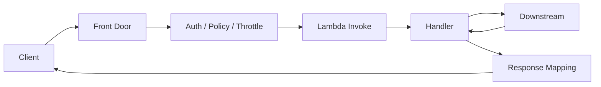

The front door may be:

- API Gateway HTTP API;
- API Gateway REST API;
- Lambda Function URL;
- Application Load Balancer Lambda target;
- direct Lambda Invoke API from trusted backend.

The choice changes:

- authentication options;
- timeout and payload constraints;
- WAF support;
- request/response mapping;
- cost;
- latency;
- custom domain model;
- CORS behavior;
- throttling;
- observability;
- operational control.

Do not choose by habit.

---

## 2. Front Door Selection

| Front Door | Good For | Watch Out |
|---|---|---|
| API Gateway HTTP API | low-cost HTTP APIs, JWT authorizers, simple routing | fewer advanced REST API features |
| API Gateway REST API | mature API management, request validation, usage plans, API keys, mapping templates | more complex/costly, 29s-style integration budget constraints |
| Lambda Function URL | simple direct HTTPS endpoint for one function | fewer API management controls, auth/CORS/resource policy must be reviewed |
| ALB Lambda Target | existing ALB, path/host routing, WAF/SG model, HTTP workloads | different event shape, target health/timeout model, not full API Gateway |
| Direct Invoke API | trusted service-to-service AWS call | IAM auth only, not a public HTTP API |
| API Gateway -> Step Functions | start workflow without Lambda glue | response/timeout pattern must be designed |
| API Gateway -> SQS/EventBridge | async command intake | caller does not get final processing result |

### Default Guidance

Use API Gateway HTTP API when:

- you need normal HTTP API;
- JWT/OIDC auth is enough;
- simple routing;
- lower cost/latency matter.

Use API Gateway REST API when:

- you need usage plans/API keys;
- request validation/mapping features;
- mature API management;
- complex legacy API gateway features.

Use Function URL when:

- you need a simple function endpoint;
- auth story is clear;
- API management requirements are minimal;
- internal/simple integration.

Use ALB when:

- you already use ALB as service front door;
- WAF/host/path routing integration matters;
- Lambda is one target type among others.

Use async ingestion when:

- work exceeds synchronous budget;
- producer only needs acceptance;
- downstream needs buffering;
- operation can be completed later.

---

## 3. Synchronous API Time Budget

Lambda can run much longer than an HTTP client should usually wait.

The API path has multiple timeouts:

```txt
client timeout
front door integration timeout
Lambda timeout
downstream timeout
database/query timeout
```

A safe synchronous API aligns them.

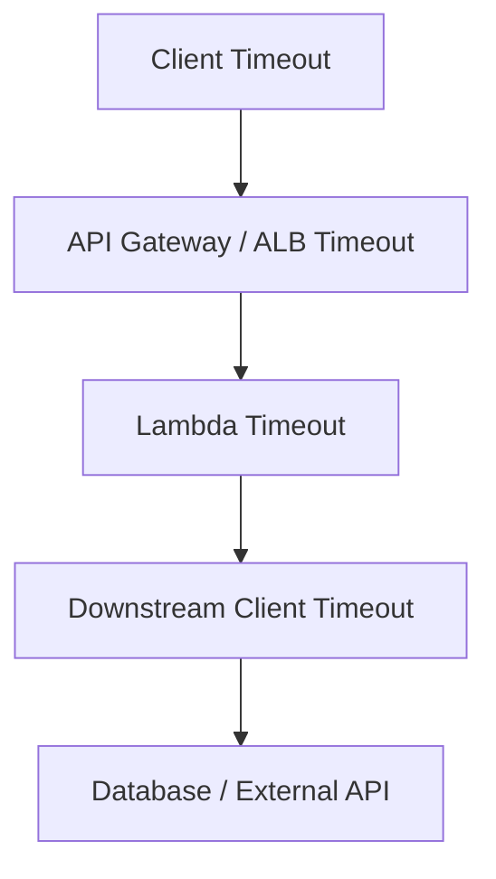

Bad:

```txt
client timeout: 10s
API integration timeout: 29s
Lambda timeout: 15m
HTTP client timeout: infinite
DB query timeout: none
```

This creates ghost work. The client may be gone while Lambda continues side effects.

Better:

```txt
client timeout: 10s
API response budget: 8s
Lambda timeout: 9s
downstream HTTP timeout: 1-2s
DB query timeout: 1-2s
remaining-time cutoff: 3s
```

### Rule

```txt
Do not start non-idempotent side effects when remaining time is too low to record the outcome.
```

### When Work Is Too Long

If operation may take longer than the HTTP budget:

```txt
POST /jobs -> returns 202 Accepted + jobId
worker processes async
GET /jobs/{jobId} -> status/result
```

or:

```txt
API Gateway -> Step Functions
```

or:

```txt
API Gateway -> SQS/EventBridge -> worker
```

Long work should be modeled as workflow or async job, not hidden inside a synchronous Lambda.

---

## 4. API Gateway HTTP API vs REST API

Both can invoke Lambda, but they are not the same product shape.

### HTTP API

Good for:

- simple HTTP APIs;
- JWT authorizers;
- Lambda proxy integration;
- lower cost and lower latency in many cases;
- modern simple routes;
- internal services.

### REST API

Good for:

- mature API management features;
- usage plans and API keys;
- request validation;
- mapping templates;
- fine-grained method settings;
- legacy integrations;
- more advanced gateway behavior.

### Design Rule

Do not pick REST API because it sounds more “enterprise.”

Do not pick HTTP API because it sounds newer.

Pick based on actual required controls.

---

## 5. Lambda Proxy Integration

Lambda proxy integration passes a structured event to your function and expects a structured response.

Conceptual input:

```json
{
  "requestContext": {
    "requestId": "...",
    "http": {
      "method": "POST",
      "path": "/payments"
    },
    "authorizer": {}
  },
  "headers": {},
  "queryStringParameters": {},
  "body": "...",
  "isBase64Encoded": false
}
```

Conceptual output:

```json
{
  "statusCode": 201,
  "headers": {
    "content-type": "application/json"
  },
  "body": "{\"paymentId\":\"pay_123\"}",
  "isBase64Encoded": false
}
```

Different integrations and payload format versions produce different event shapes.

Do not write code that assumes every API Gateway event looks the same.

### API Handler Boundary

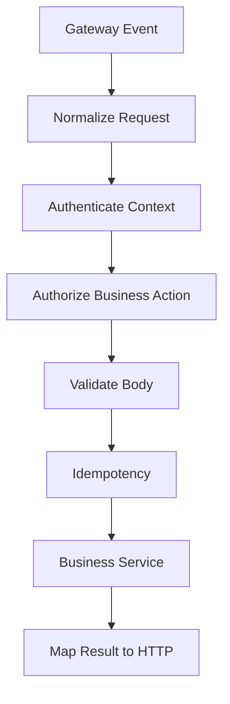

Separate gateway normalization from business logic.

---

## 6. Function URL Pattern

Lambda Function URLs provide a direct HTTPS endpoint for a Lambda function.

Good for:

- simple webhook endpoint;
- internal tooling;
- lightweight public endpoint with IAM or deliberate auth;
- quick service endpoint;
- response streaming use cases where compatible.

Watch out:

- fewer API management controls;
- auth type must be explicit;
- CORS must be reviewed;
- resource policy must be reviewed;
- WAF/API key/usage-plan model is not the same as API Gateway;
- one function URL maps to one function/alias.

### Function URL Decision

Use Function URL when the endpoint is simple and the missing API Gateway features are not needed.

Do not use Function URL to avoid learning API Gateway if you actually need API management.

---

## 7. ALB Lambda Target Pattern

Application Load Balancer can route to Lambda as a target.

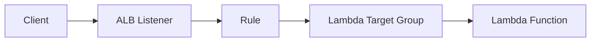

Good for:

- existing ALB front door;
- host/path routing;
- WAF on ALB;
- mixing Lambda and container/EC2 targets;
- internal ALB patterns;
- service migration.

Watch out:

- event/response shape differs from API Gateway;
- ALB health and timeout semantics matter;
- payload and header behavior differ;
- multi-value headers configuration;
- target group permissions;
- Lambda concurrency still applies;
- not a full API management product.

### Use Case

You have an ECS service behind ALB and want to move one route to Lambda:

```txt
/api/reports/* -> Lambda
/api/orders/* -> ECS service
```

This can be a migration strategy.

---

## 8. Authentication

Common auth patterns:

| Pattern | Front Door |
|---|---|
| JWT/OIDC authorizer | API Gateway HTTP API/REST API |
| Cognito authorizer | API Gateway |
| Lambda authorizer | API Gateway |
| IAM auth | API Gateway, Function URL, direct invoke |
| ALB OIDC authentication | ALB |
| mTLS/custom domain | API Gateway/ALB depending setup |
| API key/usage plan | API Gateway REST API |
| custom HMAC signature | handler or authorizer |

### Authentication vs Authorization

Authentication answers:

```txt
Who is calling?
```

Authorization answers:

```txt
Can this caller perform this action on this resource?
```

Do not stop at authentication.

Example:

```txt
JWT is valid
but can user approve this case?
can this tenant access this invoice?
can this partner call this route?
```

Business authorization usually lives in the application/domain layer.

---

## 9. CORS

CORS is browser security configuration, not backend authorization.

Bad thinking:

```txt
CORS allowed origin means request is authorized
```

No.

CORS controls which browser origins may read responses. It does not protect the API from non-browser clients.

### CORS Checklist

- allowed origins explicit;
- credentials allowed only when required;
- allowed headers include needed auth/idempotency headers;
- allowed methods minimal;
- preflight behavior tested;
- error responses include necessary CORS headers;
- no wildcard origin with credentials.

CORS failures often look like frontend bugs but are API contract bugs.

---

## 10. WAF and Edge Controls

For internet-facing APIs, consider:

- AWS WAF;
- rate-based rules;
- IP allow/block lists;
- bot control if justified;
- managed rule groups;
- request size restrictions;
- header/body inspection;
- geo restrictions if appropriate;
- CloudFront in front where needed;
- Shield for DDoS posture.

WAF does not replace:

- authentication;
- authorization;
- schema validation;
- idempotency;
- throttling;
- secure coding.

WAF is perimeter pressure reduction, not business security.

---

## 11. Request Validation

Validate before business logic.

Check:

- method/path;
- content type;
- body size;
- JSON syntax;
- schema version;
- required fields;
- enum values;
- tenant/resource relationship;
- idempotency key;
- authentication claims;
- pagination/sort/filter bounds;
- file reference checksum/version.

### Error Mapping

| Error | HTTP |
|---|---|
| malformed JSON | 400 |
| schema validation | 400 |
| unauthenticated | 401 |
| forbidden | 403 |
| resource not found | 404 |
| conflict/state mismatch | 409 |
| semantic validation | 422 |
| rate limited | 429 |
| dependency unavailable | 503 |
| timeout | 504 |
| unknown | 500 |

Do not return `200` with `{ "error": ... }` for command failures.

---

## 12. Idempotent API Commands

For mutating API operations, use idempotency keys.

Example:

```http
POST /payments
Idempotency-Key: tenant-1:payment-request-123
```

Handler flow:

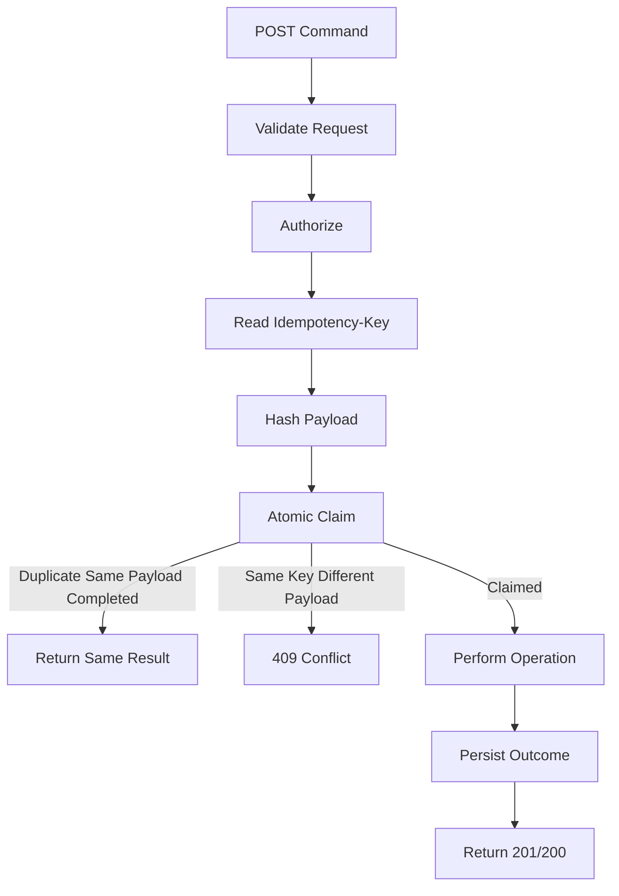

### Idempotency Response Rules

| Case | Response |
|---|---|
| first successful create | 201 Created |
| duplicate same completed command | same response or 200/201 depending contract |
| key reused with different payload | 409 Conflict |
| in-progress duplicate | 409/425/503 depending API contract |
| expired key | deliberate policy |
| idempotency store unavailable | 503, do not execute side effect unsafely |

For payment/order/case-transition APIs, idempotency is not optional.

---

## 13. Large Uploads and Downloads

Do not push large files through Lambda/API Gateway by default.

Better pattern:

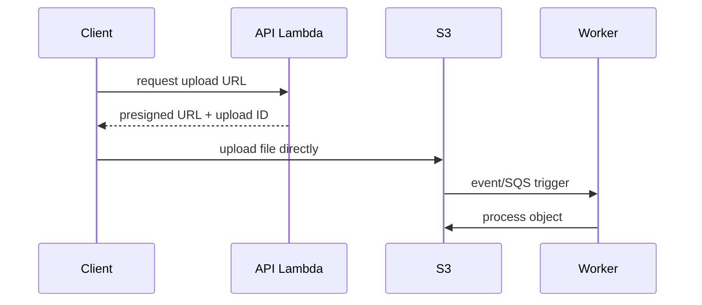

Benefits:

- avoids API payload limits;
- avoids Lambda memory pressure;
- avoids base64 overhead;
- better retry/resume options;
- S3 handles object transfer;
- worker can process asynchronously.

### File API Rules

- upload directly to S3 using presigned URL;
- validate size/type/checksum;
- store object key/version;
- scan/process asynchronously;
- do not trust filename/content type alone;
- separate upload prefix from processed prefix;
- avoid recursive triggers.

For downloads:

- return presigned URL;
- use CloudFront/S3 for large static content;
- use Lambda only for authorization/control plane where possible.

---

## 14. Response Streaming

Lambda response streaming can reduce time-to-first-byte and support larger streamed responses in supported invocation paths.

Use it for:

- progressive response;
- generated content;
- large response where supported;
- lower perceived latency.

Watch out:

- front door support differs;
- VPC compatibility limitations exist for Function URLs;
- client disconnect behavior matters;
- streaming does not make long business workflows safe;
- timeout still applies;
- partial response failures need UX design;
- observability must capture stream outcome.

Streaming is useful for output delivery.

It is not a substitute for job/workflow modeling.

---

## 15. Throttling and Rate Limits

APIs need layered throttling.

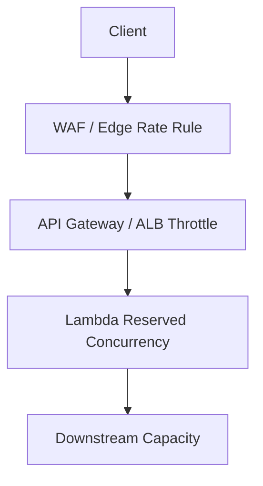

Controls:

- WAF rate-based rules;
- API Gateway throttling;
- usage plans/API keys where applicable;
- Lambda reserved concurrency;
- application-level tenant quotas;
- downstream circuit breaker.

### Safe Throughput Formula

```txt
safe_rps ≈ reserved_concurrency / p95_duration_seconds
```

Example:

```txt
reserved concurrency = 100
p95 duration = 250ms = 0.25s
safe_rps ≈ 400 rps
```

Set front-door throttles below theoretical maximum with headroom.

Do not let API Gateway accept more traffic than Lambda/downstream can safely process.

---

## 16. Error Response Design

A production API should have a stable error envelope.

Example:

```json
{
  "error": {
    "code": "PAYMENT_PROVIDER_UNAVAILABLE",
    "message": "Payment provider is temporarily unavailable.",
    "requestId": "req-123",
    "correlationId": "corr-456"
  }
}
```

Do not expose:

- stack traces;
- class names;
- SQL errors;
- secrets;
- internal hostnames;
- raw dependency responses;
- IAM details.

### Error Envelope Fields

| Field | Purpose |
|---|---|
| code | machine-readable |
| message | safe human-readable |
| requestId | support/debug |
| correlationId | end-to-end tracing |
| details | validation errors only if safe |
| retryAfter | optional retry hint |

Error responses are part of public contract. Version them carefully.

---

## 17. Java API Handler Architecture

Keep the gateway adapter thin.

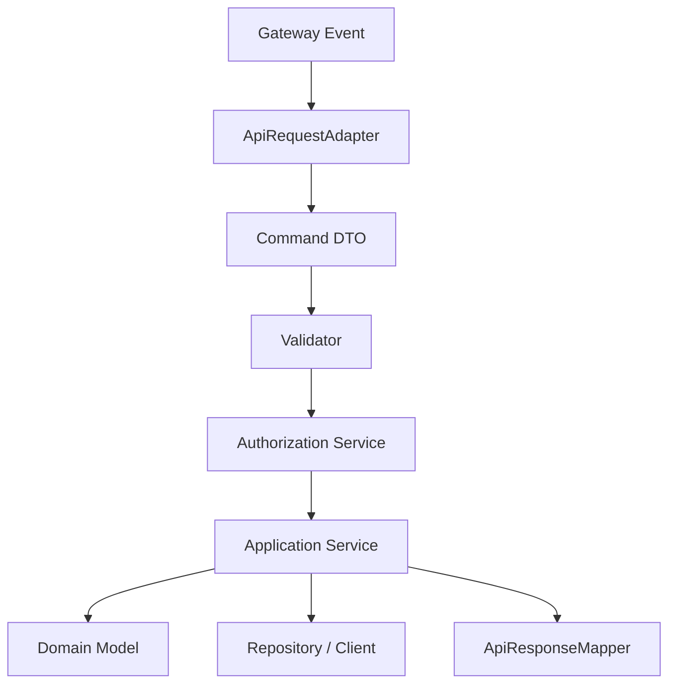

### Package Shape

```txt
com.example.payment.api
  ApiGatewayHandler
  ApiRequestAdapter
  ApiResponseMapper
  ErrorMapper

com.example.payment.application
  CapturePaymentUseCase
  IdempotencyService

com.example.payment.domain
  Payment
  PaymentState
  PaymentPolicy

com.example.payment.infrastructure
  DynamoPaymentRepository
  ProviderClient
```

The handler should not contain domain logic.

### Handler Skeleton

```java
public final class PaymentApiHandler implements RequestHandler<ApiGatewayEvent, ApiGatewayResponse> {

    private static final ApiRequestAdapter adapter = new ApiRequestAdapter();
    private static final ApiResponseMapper mapper = new ApiResponseMapper();
    private static final CapturePaymentUseCase useCase = Bootstrap.capturePaymentUseCase();

    @Override
    public ApiGatewayResponse handleRequest(ApiGatewayEvent event, Context context) {
        RequestContext requestContext = RequestContext.from(event, context);

        try {
            CapturePaymentCommand command = adapter.toCapturePayment(event);
            CapturePaymentResult result = useCase.execute(command, requestContext);
            return mapper.created(result, requestContext);
        } catch (ApiException e) {
            return mapper.error(e, requestContext);
        } catch (Exception e) {
            return mapper.error(ApiErrors.internal(), requestContext);
        }
    }
}
```

The boundary does four things:

- adapt;
- validate;
- execute;
- map response.

---

## 18. API Observability

Minimum API logs:

```json
{
  "service": "payment-api",
  "route": "POST /payments",
  "method": "POST",
  "status": 201,
  "latency_ms": 184,
  "lambda_request_id": "req-123",
  "correlation_id": "corr-456",
  "tenant_id": "tenant-1",
  "caller_type": "partner",
  "idempotency_status": "CLAIMED",
  "error_code": null
}
```

Metrics:

- request count by route/status;
- p50/p95/p99 latency by route;
- 4xx/5xx count;
- auth failures;
- validation failures;
- idempotency duplicates/conflicts;
- throttles;
- Lambda duration;
- integration latency;
- downstream latency;
- cold starts;
- timeout count;
- WAF blocks if used.

Traces:

- front door segment;
- Lambda handler segment;
- downstream calls;
- database calls;
- async handoff if any.

---

## 19. API Deployment and Rollback

Production API deployment should use:

- Lambda versions;
- aliases;
- weighted traffic shifting where appropriate;
- API stage/environment separation;
- canary/smoke tests;
- rollback alarms;
- schema compatibility checks;
- client compatibility tests.

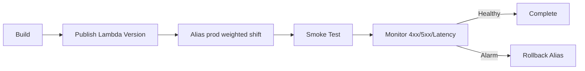

### API Compatibility Rule

Avoid breaking changes:

- removing response fields used by clients;
- changing error codes;
- changing enum values;
- changing auth claims;
- changing idempotency behavior;
- changing pagination format;
- changing CORS behavior;
- changing timeout behavior.

Version API contract deliberately.

---

## 20. API Runbooks

### Symptom: API Returns 502/500

Check:

- Lambda error logs;
- API integration mapping;
- malformed Lambda proxy response;
- unhandled exception;
- timeout;
- dependency failure;
- deployment version;
- handler package issue.

For Lambda proxy integration, malformed output can cause gateway errors.

### Symptom: API Returns 504

Check:

- integration timeout;
- Lambda duration;
- downstream timeout;
- Lambda timeout;
- client disconnect;
- database lock;
- external API slowness.

If API Gateway times out but Lambda timeout is much longer, Lambda may continue running. Validate side-effect safety.

### Symptom: CORS Error

Check:

- preflight route;
- allowed origin;
- allowed headers;
- allowed methods;
- credentials;
- error responses include CORS headers;
- browser vs non-browser behavior.

### Symptom: Increased 4xx

Check:

- auth changes;
- schema validation changes;
- client release;
- WAF rule;
- CORS/preflight;
- rate limits;
- idempotency conflicts.

### Symptom: Increased Latency

Check:

- cold starts;
- provisioned concurrency spillover;
- Lambda duration;
- downstream latency;
- memory/CPU;
- API integration latency;
- VPC/network path;
- recent deployment.

---

## 21. API Pattern Catalog

### Pattern A — Simple Synchronous Command API

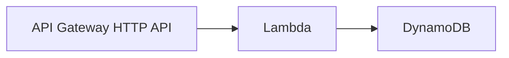

Use for:

- short command;
- idempotent write;
- low downstream latency;
- bounded response.

Guardrails:

- idempotency key;
- reserved concurrency;
- timeout alignment;
- auth/authorization.

### Pattern B — Accepted Async Job API

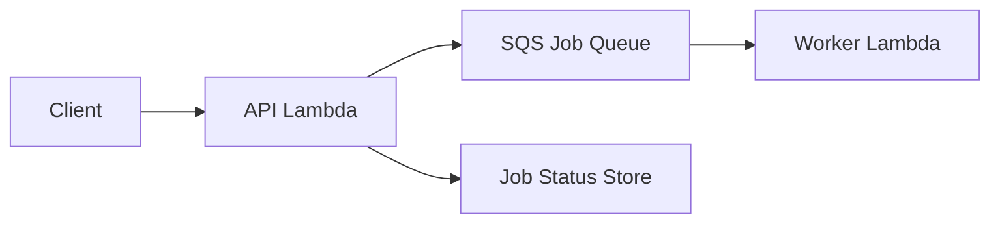

Use for:

- long processing;
- file ingestion;
- report generation;
- external API delays;
- high variability.

Response:

```http
202 Accepted
Location: /jobs/job-123
```

### Pattern C — Direct Presigned Upload

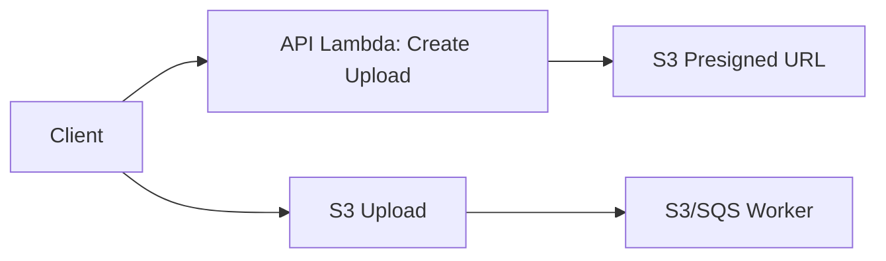

Use for:

- large files;
- user uploads;
- document pipelines.

### Pattern D — API Starts Workflow

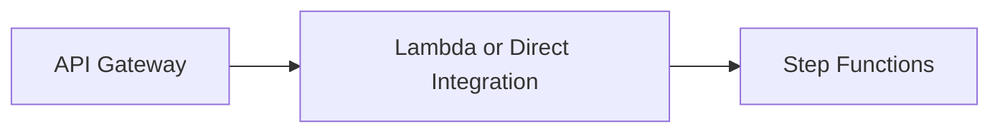

Use for:

- multi-step command;
- compensation;
- human approval;
- long-running state.

### Pattern E — ALB Hybrid Migration

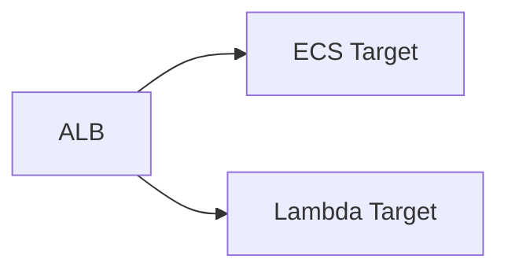

Use for:

- route-by-route migration;
- mixed compute model;
- internal service front door.

---

## 22. API Security Checklist

- [ ] Authentication configured.
- [ ] Business authorization implemented.
- [ ] WAF/rate limiting evaluated.
- [ ] CORS explicit.
- [ ] Request schema validated.
- [ ] Response error envelope safe.
- [ ] Function resource policy reviewed.
- [ ] Execution role least privilege.
- [ ] Secrets not in logs.
- [ ] Idempotency for mutating commands.
- [ ] Tenant derived from trusted context.
- [ ] Payload size limits enforced.
- [ ] Large uploads use S3 direct pattern.
- [ ] API throttles aligned with Lambda/downstream capacity.
- [ ] Audit logs include caller/resource/action/outcome.

---

## 23. API Production Checklist

### Contract

- [ ] Routes documented.
- [ ] Request/response schemas versioned.
- [ ] Error codes documented.
- [ ] Idempotency semantics documented.
- [ ] Timeout behavior documented.
- [ ] Pagination/filter/sort bounded.
- [ ] Correlation ID supported.

### Runtime

- [ ] Lambda timeout aligned.
- [ ] Downstream timeouts configured.
- [ ] Reserved concurrency configured if needed.
- [ ] Provisioned concurrency/SnapStart evaluated for latency-sensitive Java.
- [ ] Payload size safe.
- [ ] Memory tuned.

### Operations

- [ ] Dashboard per route.
- [ ] 4xx/5xx alarms.
- [ ] p95/p99 latency alarms.
- [ ] Throttle alarms.
- [ ] Auth failure alarms.
- [ ] Deployment rollback.
- [ ] Runbook links to queries.
- [ ] Synthetic checks/smoke tests.

---

## 24. Common Anti-Patterns

### Anti-Pattern 1 — Long Work Hidden Behind HTTP

Client waits, gateway times out, Lambda continues side effects.

### Anti-Pattern 2 — No Idempotency on POST

Client retry creates duplicate order/payment/case.

### Anti-Pattern 3 — Lambda Handler Contains Routing, Auth, Domain, DB, and Mapping

Everything becomes untestable.

### Anti-Pattern 4 — Large File Through Lambda

Memory/cost/timeout/payload limit problem.

### Anti-Pattern 5 — Public Function URL Without Governance

Convenience endpoint becomes unmanaged public API.

### Anti-Pattern 6 — API Throttle Above Downstream Capacity

Gateway admits traffic that Lambda/database cannot handle.

### Anti-Pattern 7 — Raw Exceptions to Client

Leaks internals and creates unstable API contract.

### Anti-Pattern 8 — CORS Treated as Security

CORS is not authorization.

### Anti-Pattern 9 — No Version/Alias Discipline

Rollback and deployment evidence become unclear.

---

## 25. Final Mental Model

A Lambda API is a contract boundary.

The right design is not:

```txt
expose function over HTTPS
```

The right design is:

```txt
front door + auth + validation + idempotency + timeout budget
+ side-effect safety + throttling + observability + rollback
```

A top-tier engineer does not ask:

> “Can API Gateway invoke Lambda?”

They ask:

> “Should this request be synchronous, what is the maximum safe duration, what happens on retry, how do we protect downstream, and can we prove the API outcome under failure?”

That is Lambda API engineering.

---

## References

- Amazon API Gateway documentation: HTTP APIs and REST APIs
- Amazon API Gateway documentation: quotas and integration timeouts
- AWS Lambda Developer Guide: Lambda proxy integrations
- AWS Lambda Developer Guide: Lambda Function URLs
- AWS Lambda Developer Guide: response streaming
- Elastic Load Balancing documentation: Lambda functions as ALB targets
- AWS Lambda Developer Guide: versions, aliases, and traffic shifting
