# Part 062 — Step Functions Orchestration Patterns

A Lambda function should not become a workflow engine.

When a handler starts to contain:

- multiple steps;
- retries;
- waits;
- compensation;
- branching;
- parallel work;
- human approval;
- long-running status;
- cross-service orchestration;
- partial failure recovery;
- audit timeline;

you should strongly consider Step Functions.

Step Functions is not “Lambda but with boxes.”

It is a managed state machine service for durable workflow orchestration.

The key shift is:

```txt
Lambda executes units of work.
Step Functions coordinates units of work.
```

---

## 1. Why Orchestration Belongs Outside the Handler

Bad Lambda workflow:

```java
public Result handle(Event event) {
    validate(event);
    chargePayment(event);
    reserveInventory(event);
    createShipment(event);
    waitForProvider();
    sendEmail(event);
    compensateIfNeeded();
    return result;
}
```

Problems:

- handler timeout bounds entire workflow;
- retry logic hidden in code;
- partial failure hard to inspect;
- no durable state between steps;
- compensation is fragile;
- audit trail is log-only;
- long waits waste compute;
- deployment changes affect in-flight behavior unpredictably;
- operator cannot see current workflow state easily.

Better:

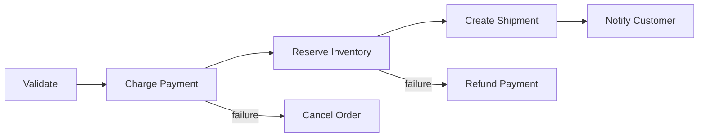

Step Functions makes the workflow explicit.

---

## 2. Step Functions Mental Model

A state machine is a durable execution graph.

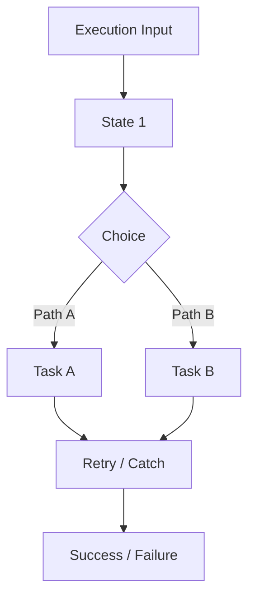

Core concepts:

| Concept | Meaning |
|---|---|
| state machine | workflow definition |
| execution | one running workflow instance |
| state | one step in the workflow |
| task | unit of work, often Lambda or service integration |
| choice | branch |
| wait | pause |
| parallel | run branches concurrently |
| map | iterate over items |
| retry | automatic retry policy |
| catch | error handling path |
| input/output path | data shaping |
| version/alias | deployment identity |
| redrive | restart failed Standard executions within supported window |

A state machine is durable process state.

A Lambda function is compute.

---

## 3. Standard vs Express Workflows

Step Functions has two main workflow types.

### Standard Workflows

Use for:

- durable long-running workflows;
- exactly-once-ish workflow execution semantics at orchestration level;
- audit history;
- human approval;
- callback token;
- `.sync` job integration;
- business processes;
- lower execution rate but stronger durability/visibility.

### Express Workflows

Use for:

- high-volume short-duration workflows;
- event processing;
- request/response micro-orchestration;
- high-throughput serverless workflows;
- lower-cost high-rate execution where detailed long history is not required in the same way.

AWS documentation notes that Express Workflows do not support Job-run `.sync` or Callback `.waitForTaskToken` service integration patterns. Distributed Map is supported by Standard, not Express.

### Decision

| Need | Prefer |
|---|---|
| long-running order/case/payment workflow | Standard |
| human approval/callback token | Standard |
| `.sync` wait for job completion | Standard |
| audit trail of business process | Standard |
| high-volume short event transformation | Express |
| sync API micro-orchestration | Express or Standard depending durability/latency/cost |
| distributed high-scale batch processing | Standard with Distributed Map |

Do not choose Express only because it is cheaper. Choose based on semantics.

---

## 4. Lambda Task Integration

A Step Functions `Task` can invoke Lambda.

Conceptually:

```json
{
  "Type": "Task",
  "Resource": "arn:aws:states:::lambda:invoke",
  "Parameters": {
    "FunctionName": "arn:aws:lambda:ap-southeast-1:123456789012:function:ChargePayment:prod",
    "Payload.$": "$"
  },
  "End": true
}
```

Optimized Lambda integration gives Step Functions native awareness of Lambda invocation output/error behavior.

### Task Boundary

A Lambda task should:

- do one bounded operation;
- validate its input;
- perform idempotent side effect;
- return a compact result;
- throw classified errors;
- avoid orchestrating other workflow steps internally.

Good task:

```txt
ChargePayment
ReserveInventory
CreateShipment
WriteAuditRecord
SendNotification
```

Bad task:

```txt
DoEverythingForOrder
```

### Payload Rule

Do not pass huge payloads through state transitions.

Pass references:

```json
{
  "document": {
    "bucket": "case-documents",
    "key": "tenant-1/case-123/file.pdf",
    "versionId": "..."
  }
}
```

State payload size and history growth matter.

---

## 5. Service Integration Patterns

Step Functions supports several integration patterns.

### Request Response

Call a service and continue after HTTP/API response.

```txt
Task -> service responds -> next state
```

Good for:

- Lambda task;
- DynamoDB write/read;
- EventBridge PutEvents;
- SQS SendMessage;
- short service call.

### Run a Job `.sync`

Start a job and wait for it to complete.

Good for:

- ECS task;
- Batch job;
- Glue job;
- some long-running AWS jobs.

### Callback with Task Token `.waitForTaskToken`

Pause workflow until external actor calls back with token.

Good for:

- human approval;
- third-party callback;
- legacy async system;
- manual review;
- external workflow completion.

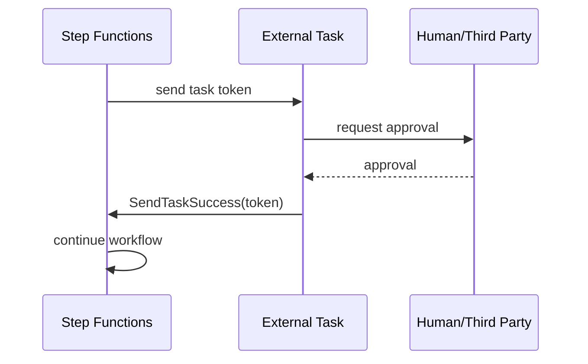

Do not poll inside Lambda for human approval. Use callback.

---

## 6. Retry and Catch

Step Functions makes retries visible and declarative.

Example:

```json
"Retry": [
  {
    "ErrorEquals": ["Provider.Throttled", "Provider.Timeout"],
    "IntervalSeconds": 2,
    "BackoffRate": 2.0,
    "MaxAttempts": 3
  }
],
"Catch": [
  {
    "ErrorEquals": ["Payment.Declined"],
    "Next": "MarkPaymentDeclined"
  },
  {
    "ErrorEquals": ["States.ALL"],
    "Next": "Compensate"
  }
]
```

### Retry Design

Retry only transient failures.

Do not retry:

- validation errors;
- business rule violations;
- unauthorized action;
- duplicate completed events;
- impossible state transitions;
- permanent provider rejection.

### Error Names

Lambda tasks should throw or map errors into stable names.

Bad:

```txt
java.lang.RuntimeException
```

Better:

```txt
Payment.ProviderTimeout
Payment.Declined
Inventory.InsufficientStock
Case.InvalidTransition
```

Error names are workflow contract.

---

## 7. Saga and Compensation

A saga coordinates a sequence of local transactions with compensating actions.

Example order workflow:

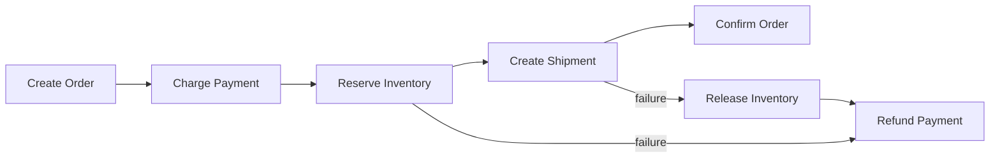

Compensation is not rollback.

A refund is not “uncharge.” It is a new business action.

### Compensation Rules

- every side-effecting step has a compensation decision;
- compensation is idempotent;
- compensation can fail and needs retry/catch;
- compensation is audited;
- some actions are not compensatable;
- business must define terminal states.

### Example

```txt
Payment captured -> can refund
Email sent -> cannot unsend, can send correction
Shipment created -> can cancel only before carrier cutoff
Case decision issued -> may require formal reversal action
```

Workflow design is business design.

---

## 8. Idempotency in Step Functions

Step Functions coordinates retries, but task idempotency is still required.

Why?

- task may be retried;
- workflow may be redriven;
- execution may be started twice;
- external provider may time out after side effect;
- callback may be delivered twice;
- Lambda may fail after committing side effect.

### Workflow Idempotency

Use deterministic execution names for command workflows.

```txt
executionName = workflowType + "-" + tenantId + "-" + businessCommandId
```

Example:

```txt
capture-payment-tenant-1-command-456
```

### Task Idempotency

Each side-effecting task still needs its own idempotency key.

```txt
CapturePayment:tenant-1:payment-123:v1
ReserveInventory:tenant-1:order-123:v1
CreateShipment:tenant-1:order-123:v1
```

Workflow-level idempotency prevents duplicate workflows. Task-level idempotency protects side effects inside/retried workflows.

You usually need both.

---

## 9. Standard Workflow as Business Audit

Step Functions execution history can serve as an operational timeline.

It shows:

- state entered/exited;
- retry attempts;
- errors;
- catches;
- wait times;
- branch outcomes;
- task input/output unless filtered;
- execution start/end;
- version/alias association when invoked that way.

This is valuable for:

- incident debugging;
- customer support;
- compliance evidence;
- business process monitoring;
- replay/redrive decision.

But do not put sensitive payloads in state history casually.

Use input/output filtering and references.

---

## 10. Data Shaping: InputPath, Parameters, ResultPath, OutputPath

State machines can accidentally accumulate too much data.

Use data shaping deliberately.

| Field | Purpose |
|---|---|
| `InputPath` | select what part of input enters state |
| `Parameters` | construct input to task |
| `ResultPath` | where task result is inserted |
| `OutputPath` | what leaves state |

Bad:

```txt
each task appends full response to state
state grows until limit/history becomes noisy
```

Better:

```txt
keep only business IDs, status, refs, small result summary
large data stays in S3/database
```

### Example Mental Model

```txt
Workflow state:
  orderId
  paymentId
  inventoryReservationId
  shipmentId
  status
  correlationId
```

Not:

```txt
full order document
full payment provider response
full shipment label PDF
full audit log
```

State should coordinate, not store bulk data.

---

## 11. Direct AWS Service Integrations

Step Functions can call many AWS services directly without Lambda.

Examples:

- DynamoDB PutItem/UpdateItem/GetItem;
- SQS SendMessage;
- SNS Publish;
- EventBridge PutEvents;
- ECS RunTask;
- Batch SubmitJob;
- Glue StartJobRun;
- API Gateway call;
- Lambda invoke;
- AWS SDK integrations.

### Rule

If a Lambda only translates JSON into one AWS API call, remove it.

Bad:

```txt
Step Functions -> Lambda -> SQS SendMessage
```

Better:

```txt
Step Functions -> SQS SendMessage service integration
```

Benefits:

- less code;
- less cold start;
- fewer IAM/runtime dependencies;
- simpler observability;
- lower failure surface.

Use Lambda when you need custom logic, validation, transformation, or domain operation.

---

## 12. Parallel State

Parallel state runs branches concurrently.

Use for independent work:

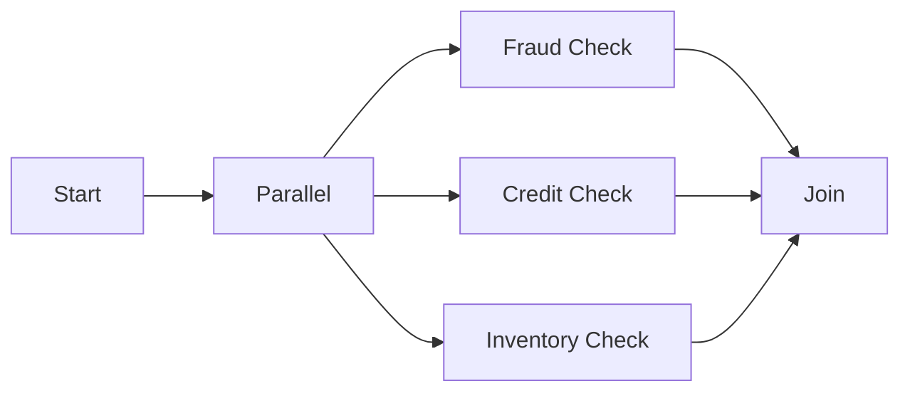

Rules:

- branches should be independent;
- each branch has own retry/catch;
- join behavior must handle partial failure;
- downstream capacity must be safe;
- parallelism can amplify load.

Parallel is not free. It creates concurrent work.

---

## 13. Map and Distributed Map

Map state iterates over a collection.

Use Inline Map for smaller/constrained iteration.

Use Distributed Map for large-scale parallel processing where supported.

AWS documentation notes Distributed Map can run iterations as child workflow executions and supports high concurrency up to 10,000 parallel child workflow executions.

This is powerful and dangerous.

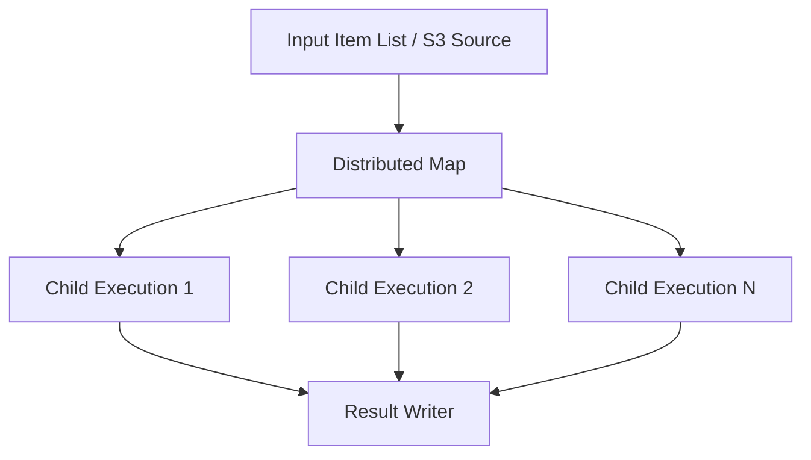

### Use Distributed Map For

- large S3 object lists;
- batch file processing;
- parallel ETL;
- image/document processing;
- data backfill;
- high-scale independent tasks.

### Guardrails

- set max concurrency;
- protect downstream;
- use item-level idempotency;
- write results durably;
- handle partial failures;
- monitor Map Run;
- design redrive;
- avoid giant state payloads;
- test with small sample first.

High concurrency can melt downstream systems if not capped.

---

## 14. Callback Pattern

Callback with task token is ideal when workflow must wait for an external actor.

Examples:

- human approval;
- external provider asynchronous completion;
- manual compliance review;
- partner callback;
- on-prem batch process;
- device response.

Pattern:

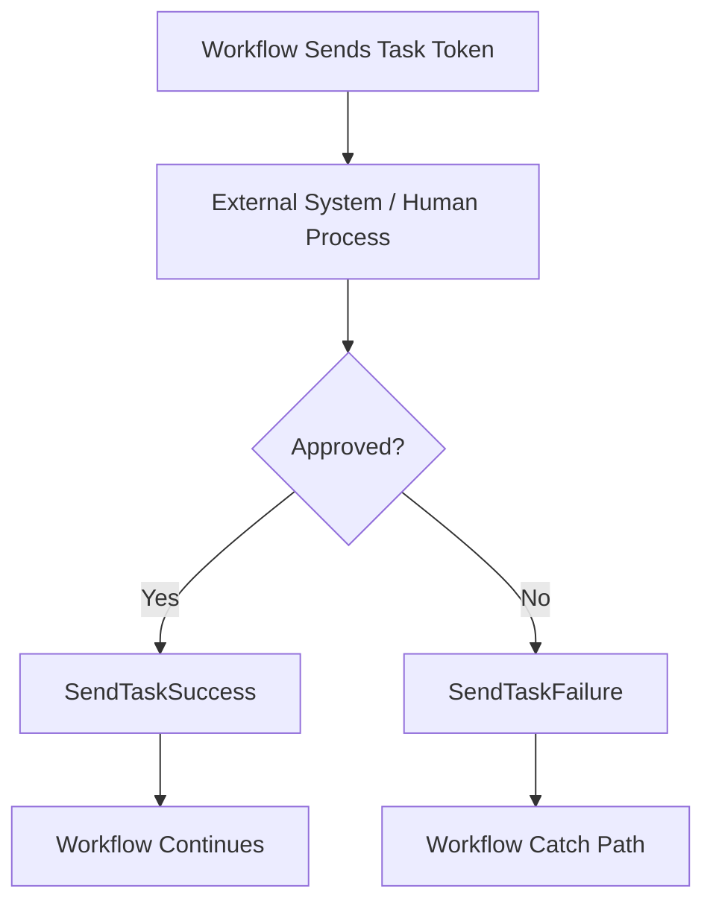

### Token Safety

Task token is a credential-like value.

Protect it:

- do not log openly;
- store securely if needed;
- expire through workflow timeout;
- bind to business context;
- validate callback actor;
- handle duplicate callback;
- handle late callback.

Do not expose task token to untrusted clients without a secure mediation layer.

---

## 15. Human Approval Pattern

Example:

```txt
Case requires supervisor approval.
Workflow creates approval record with task token reference.
Supervisor approves in internal app.
Backend validates supervisor authorization.
Backend calls SendTaskSuccess.
Workflow continues.
```

Do not send raw task token in email.

Better:

```txt
email link -> approval app -> auth -> lookup token securely -> callback Step Functions
```

Human approval is an authorization problem, not only workflow pause.

---

## 16. Workflow Versions and Aliases

Step Functions supports versions and aliases for state machines. A version is an immutable snapshot, and an alias can point to up to two versions for routing.

Use versions/aliases for:

- production release identity;
- safe rollout;
- rollback;
- controlled traffic shift;
- audit of which workflow definition ran;
- avoiding accidental execution of latest unqualified definition.

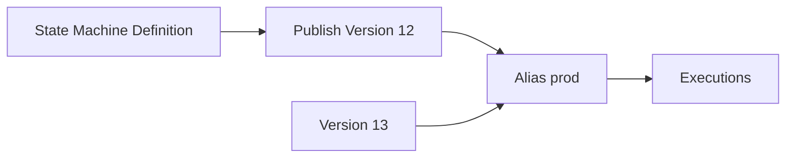

### Deployment Rule

Start production executions via alias or version ARN, not unqualified mutable state machine when release identity matters.

---

## 17. Redrive

Step Functions redrive lets you restart failed, aborted, or timed-out Standard Workflow executions within the supported redrive window.

Redrive is operationally powerful.

It is also dangerous if tasks are not idempotent.

Before redrive:

- root cause fixed;
- workflow definition/version understood;
- task idempotency verified;
- compensation state understood;
- downstream capacity safe;
- sample execution reviewed;
- redrive volume controlled;
- operator aware of duplicates.

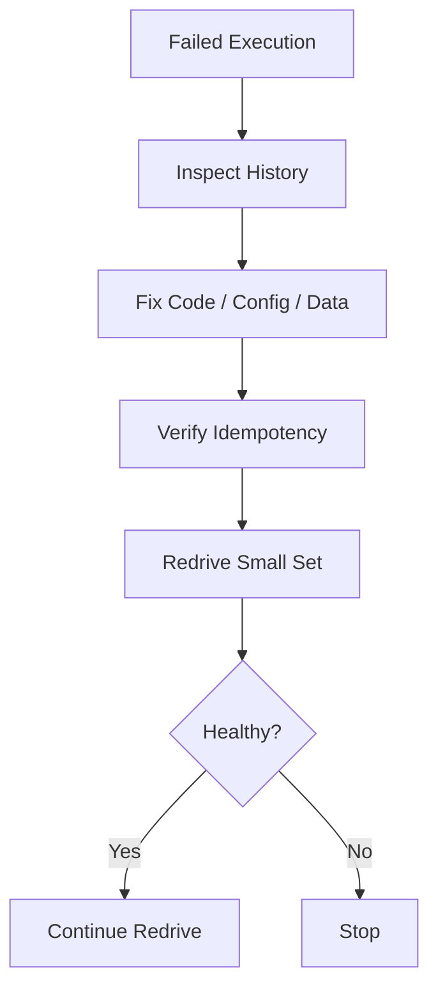

Redrive without idempotency is a duplicate side-effect generator.

---

## 18. Nested Workflows

A state machine can start another state machine.

Use nested workflows when:

- reusable sub-process;
- separate ownership;
- separate audit boundary;
- complex workflow decomposition;
- child process has its own versioning;
- high-scale Distributed Map child executions.

Risks:

- harder traceability if correlation not passed;
- recursive complexity;
- cost surprises;
- version compatibility;
- error propagation complexity.

Pass:

- correlation ID;
- parent execution ARN;
- business IDs;
- idempotency key;
- version/contract info.

---

## 19. Workflow Observability

A Step Functions dashboard should include:

- executions started/succeeded/failed/timed out/aborted;
- execution duration p50/p95/p99;
- state failure counts;
- retry counts;
- catch path counts;
- throttles;
- task duration;
- Lambda task errors;
- service integration errors;
- Map Run status;
- redrive count;
- business status counts.

Logs/traces should include:

- execution ARN/name;
- state name;
- correlation ID;
- business ID;
- Lambda request ID for tasks;
- error name;
- retry attempt;
- compensation status.

### Correlation

Every Lambda task in a workflow should log:

```json
{
  "workflow_execution": "arn:aws:states:...",
  "state_name": "CapturePayment",
  "correlation_id": "corr-123",
  "order_id": "ord-456",
  "lambda_request_id": "req-789",
  "outcome": "SUCCESS"
}
```

Step Functions history plus Lambda logs should form one timeline.

---

## 20. Workflow Cost Model

Step Functions cost depends on workflow type and usage pattern.

Cost drivers include:

- state transitions for Standard workflows;
- request/duration/memory model for Express workflows;
- retries;
- Map/Distributed Map scale;
- child executions;
- Lambda invocations;
- service integration calls;
- logs;
- X-Ray/tracing;
- downstream cost;
- redrive/replay.

Optimization:

- remove unnecessary Lambda glue;
- avoid overly chatty state machines;
- batch where appropriate;
- use Express for high-volume short workflows where semantics fit;
- use Standard for durable audited workflows;
- control Distributed Map concurrency;
- avoid storing huge payloads in state;
- tune retry policies;
- use direct service integrations.

Do not optimize cost by hiding a workflow inside Lambda if it destroys reliability and auditability.

---

## 21. Workflow Pattern Catalog

### Pattern A — Command Workflow

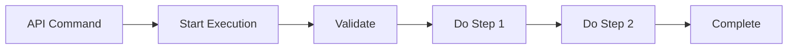

Use for:

- multi-step business command;
- user needs job status;
- audit matters.

### Pattern B — Saga

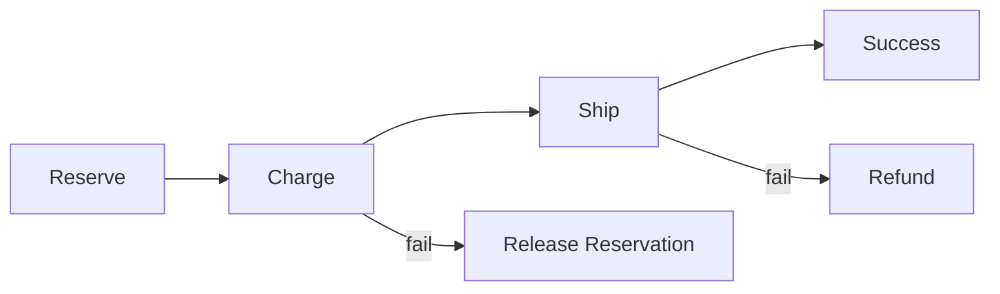

Use for:

- distributed transaction alternative;
- compensatable side effects.

### Pattern C — Callback Approval

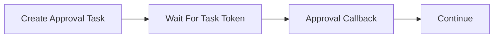

Use for:

- human approval;
- partner callback;
- long external process.

### Pattern D — Distributed File Processing

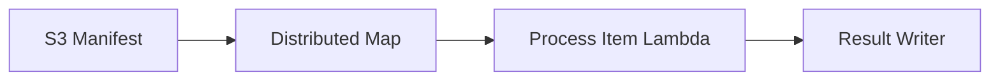

Use for:

- large-scale parallel work;
- backfills;
- document processing.

### Pattern E — Direct Service Integration

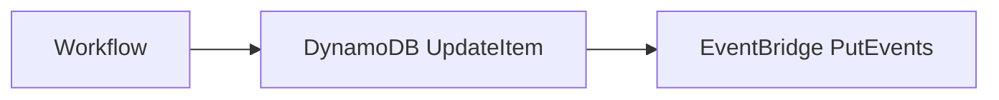

Use when no custom compute is needed.

---

## 22. Workflow Runbooks

### Symptom: Execution Failed

Questions:

1. Which state failed?
2. What error name?
3. Was it retried?
4. Did catch path execute?
5. Which Lambda request ID?
6. Was side effect committed?
7. Is compensation required?
8. Is execution version/alias known?
9. Can it be redriven safely?
10. Is failure systemic or isolated?

Actions:

- inspect execution history;
- inspect task logs;
- identify side effects;
- fix code/config/data;
- redrive only if safe;
- otherwise start compensation/manual repair workflow.

### Symptom: Execution Stuck

Check:

- waiting state;
- callback token task;
- external process;
- timeout;
- human approval queue;
- integration `.sync` job;
- child workflow status;
- Map Run pending due concurrency.

### Symptom: Workflow Cost Spike

Check:

- execution volume;
- retries;
- loop/Map explosion;
- high-cardinality workflows;
- Express duration;
- unnecessary Lambda glue;
- log level;
- Distributed Map concurrency.

### Symptom: Redrive Fails

Check:

- redrive window;
- execution type support;
- state machine changes;
- task idempotency;
- downstream still failing;
- Map Run concurrency;
- permissions.

---

## 23. Design Review Checklist

### Workflow Fit

- [ ] Handler is not secretly orchestrating long workflow.
- [ ] Workflow type Standard/Express justified.
- [ ] Synchronous vs async start defined.
- [ ] Business timeout defined.
- [ ] State payload size controlled.
- [ ] Sensitive data excluded from history.

### Task Design

- [ ] Each Lambda task is bounded.
- [ ] Task errors are classified.
- [ ] Task side effects are idempotent.
- [ ] Task timeout less than state/workflow budget.
- [ ] Direct service integration used when Lambda is unnecessary.
- [ ] IAM least privilege per task/service integration.

### Reliability

- [ ] Retry policies match error types.
- [ ] Catch paths explicit.
- [ ] Compensation defined for side effects.
- [ ] Callback tokens protected.
- [ ] Redrive safety reviewed.
- [ ] Distributed Map concurrency capped.

### Deployment

- [ ] State machine version published.
- [ ] Production uses alias/version.
- [ ] Rollback plan exists.
- [ ] In-flight execution behavior understood.
- [ ] Contract tests exist.

### Observability

- [ ] Execution name includes business identifier where safe.
- [ ] Correlation ID propagated to every task.
- [ ] Lambda logs include execution ARN/state name.
- [ ] Dashboards include state failures/retries/duration.
- [ ] Alerts on failure/timeout/stuck workflow.
- [ ] Runbook links to execution history and logs.

---

## 24. Common Anti-Patterns

### Anti-Pattern 1 — Workflow Hidden Inside Lambda

No durable state, poor audit, timeout risk.

### Anti-Pattern 2 — Retry Everything

Business errors are retried and create chaos.

### Anti-Pattern 3 — No Compensation

Partial success becomes manual data repair.

### Anti-Pattern 4 — Huge State Payload

Execution history becomes bloated and sensitive.

### Anti-Pattern 5 — Lambda Glue for Every AWS API Call

Unnecessary code, cold starts, permissions, cost.

### Anti-Pattern 6 — Distributed Map Without Downstream Cap

High concurrency melts database/API.

### Anti-Pattern 7 — Callback Token Sent Raw to User

Token becomes credential leakage.

### Anti-Pattern 8 — Redrive Without Idempotency

Duplicate side effects.

### Anti-Pattern 9 — Production Uses Mutable Latest State Machine

Cannot prove what definition ran.

### Anti-Pattern 10 — Error Names Are Runtime Exceptions

Workflow cannot make stable business decisions.

---

## 25. Final Mental Model

Step Functions is the durable coordinator.

Lambda is the worker.

A good serverless system makes this separation clear:

```txt
Step Functions:
  sequence
  branching
  retry
  wait
  callback
  compensation
  audit
  redrive
  parallelism control

Lambda:
  validate task input
  perform bounded operation
  make idempotent side effect
  return compact result
  throw classified error
```

The advanced question is not:

> “Can I call many Lambdas?”

The advanced question is:

> “Where should durable process state live, how do failures transition the workflow, and which side effects are safe to retry, compensate, or redrive?”

That is Step Functions orchestration engineering.

---

## References

- AWS Step Functions Developer Guide: workflow types Standard and Express
- AWS Step Functions Developer Guide: service integration patterns
- AWS Step Functions Developer Guide: Lambda optimized integration
- AWS Step Functions Developer Guide: error handling with Retry and Catch
- AWS Step Functions Developer Guide: Callback with task token
- AWS Step Functions Developer Guide: Map and Distributed Map states
- AWS Step Functions Developer Guide: versions and aliases
- AWS Step Functions Developer Guide: redrive executions
