# Part 063 — EventBridge Mental Model

EventBridge is often introduced as:

> “A serverless event bus.”

That is true, but not enough.

A production-grade mental model is:

> EventBridge is a managed event routing plane that decouples producers from consumers through explicit event contracts, pattern-based routing, target delivery, optional transformation, and operational controls such as archive/replay, failure handling, cross-account routing, Pipes, and Scheduler.

The important word is **routing**.

EventBridge does not make your architecture event-driven automatically.

It gives you an event routing substrate. You still must design:

- event names;
- event schemas;
- event ownership;
- event versioning;
- producer guarantees;
- consumer idempotency;
- replay safety;
- routing boundaries;
- failure destinations;
- archive policy;
- observability;
- governance.

Without those, EventBridge becomes event spaghetti.

---

## 1. Why EventBridge Exists

In a service-oriented system, many teams need to react to changes.

Example:

```txt
OrderCreated
PaymentCaptured
ShipmentCreated
CaseEscalated
DocumentUploaded
InvoiceGenerated
UserRegistered
AccountClosed
```

Without an event bus, producers call consumers directly.

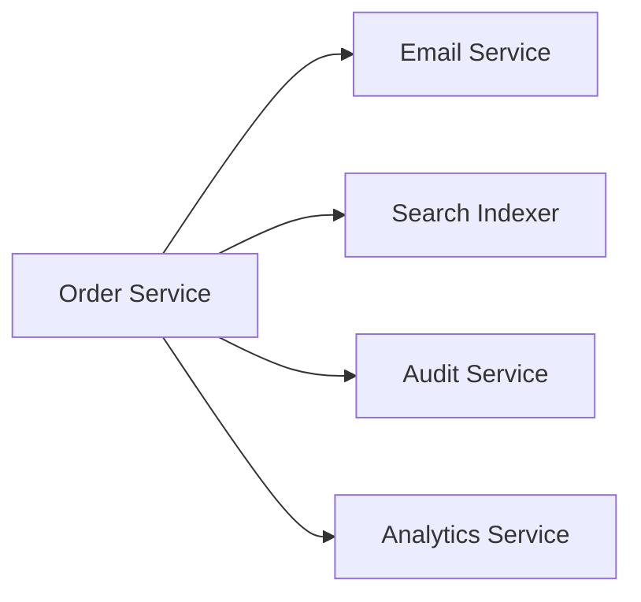

This creates coupling:

- producer knows all consumers;
- adding a consumer requires producer change;
- producer latency depends on consumer health;
- retry semantics are mixed;
- failures are hard to isolate;
- fanout logic lives in application code.

With EventBridge:

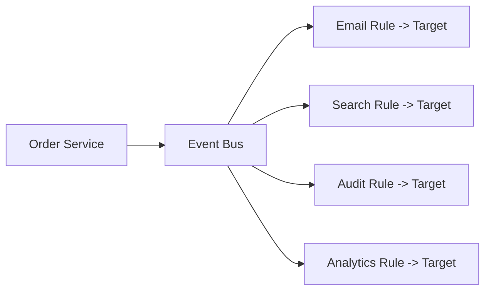

The producer emits a fact.

The bus routes the fact.

Consumers decide what to do.

This is the core decoupling.

---

## 2. EventBridge Core Objects

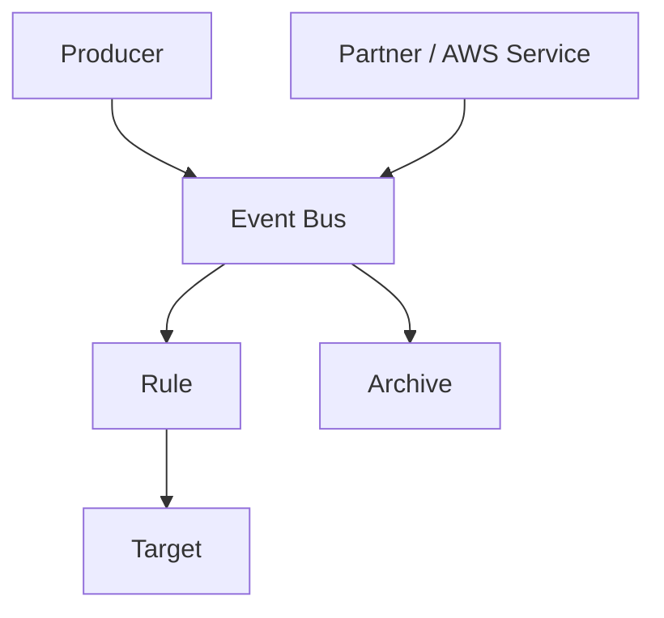

| Object | Meaning |
|---|---|
| event | JSON fact that something happened |
| event bus | router that receives events and routes to targets |
| rule | event pattern plus target list |
| event pattern | JSON matching expression |
| target | destination invoked when rule matches |
| archive | retained events for replay |
| replay | re-inject archived events to source bus/rules |
| schema | event structure contract |
| API destination | HTTPS target managed through EventBridge |
| Pipe | point-to-point source/filter/enrichment/target integration |
| Scheduler | managed one-time/recurring schedule invocation |

EventBridge is not only a bus. It is an integration family.

---

## 3. Event as a Fact

A production event should usually represent something that already happened.

Good event names:

```txt
OrderCreated
PaymentCaptured
CaseAssigned
DocumentUploaded
InvoiceGenerated
ShipmentDispatched
UserEmailVerified
```

Bad event names:

```txt
CreateOrder
CapturePayment
AssignCaseNow
CallFraudService
SendEmailPlease
```

Commands ask someone to do something.

Events state that something happened.

### Event vs Command

| Concept | Meaning | Example |
|---|---|---|
| command | request to perform action | `CreateOrder` |
| event | fact that action happened | `OrderCreated` |
| query | request for information | `GetOrderStatus` |

EventBridge can technically route any JSON, including command-like messages. But architecture gets clearer when you distinguish intent from fact.

### Why This Matters

If an event is a fact, multiple consumers can react independently.

If an event is a command, there is usually an intended handler and success/failure expectation.

For commands that need guaranteed single processing and backpressure, SQS or Step Functions may be better.

---

## 4. Event Envelope

EventBridge events have an envelope.

Conceptual custom event:

```json
{
  "Source": "com.example.orders",
  "DetailType": "OrderCreated",
  "Detail": "{\"schemaVersion\":\"1.0\",\"orderId\":\"ord-123\"}",
  "EventBusName": "domain-prod"
}
```

In rules/consumers, the event appears with metadata such as:

```json
{
  "version": "0",
  "id": "evt-...",
  "detail-type": "OrderCreated",
  "source": "com.example.orders",
  "account": "123456789012",
  "time": "2026-07-06T10:15:30Z",
  "region": "ap-southeast-1",
  "resources": [],
  "detail": {
    "schemaVersion": "1.0",
    "orderId": "ord-123"
  }
}
```

### Envelope Fields

| Field | Design Meaning |
|---|---|
| `source` | producer namespace |
| `detail-type` | event type |
| `detail` | event payload |
| `id` | EventBridge event ID |
| `time` | event timestamp |
| `account` | AWS account |
| `region` | AWS region |
| `resources` | related AWS resources if applicable |

### Business Event Metadata

Inside `detail`, include:

```json
{
  "schemaVersion": "1.0",
  "eventId": "order-evt-123",
  "correlationId": "corr-456",
  "causationId": "cmd-789",
  "tenantId": "tenant-1",
  "orderId": "ord-123",
  "occurredAt": "2026-07-06T10:15:29Z"
}
```

Do not rely only on EventBridge `id` as business idempotency key. It identifies the bus event, not necessarily the business operation across retries/replays/producers.

---

## 5. Event Bus Types

EventBridge has different bus usage patterns.

### Default Event Bus

Receives events from AWS services and can also receive custom events if you choose.

Good for:

- AWS service events;
- simple account-local integrations;
- centralized AWS operational reactions.

Risk:

- too many unrelated domain events mixed together;
- weak ownership boundary;
- broad rules;
- difficult governance.

### Custom Event Bus

Created by you for application/domain events.

Good for:

- domain event boundaries;
- team/platform ownership;
- cross-account routing;
- environment separation;
- policy control;
- archive policy;
- schema governance.

Example:

```txt
orders-prod
payments-prod
case-management-prod
platform-events-prod
```

### Partner Event Bus

Receives events from supported SaaS/partner integrations.

Good for:

- SaaS integration;
- decoupling external events from internal processing;
- routing partner events into internal workflows.

### Bus Design Rule

```txt
Use event buses as ownership and routing boundaries, not as random buckets.
```

A single global bus for all domains can work at small scale but becomes difficult to govern.

---

## 6. Rules and Event Patterns

A rule matches events using an event pattern.

Example:

```json
{
  "source": ["com.example.orders"],
  "detail-type": ["OrderCreated"],
  "detail": {
    "schemaVersion": ["1.0"],
    "priority": ["HIGH"]
  }
}
```

If an event matches, EventBridge sends it to the rule’s targets.

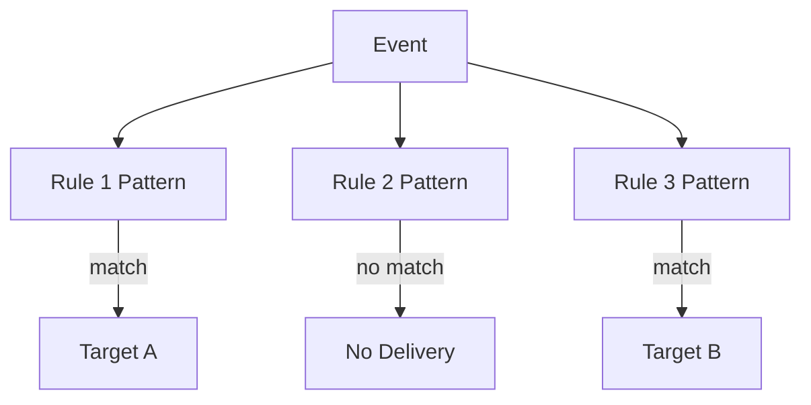

### Rule Design

Good rule:

```txt
source = com.example.orders
detail-type = OrderCreated
detail.schemaVersion in supported versions
detail.tenantClass = enterprise
```

Bad rule:

```txt
match all events from source prefix
route to generic Lambda
handler decides everything
```

Broad rules move routing complexity from EventBridge into code.

Use EventBridge filtering to reduce noise, but still validate in the consumer.

Filtering is routing optimization, not authorization.

---

## 7. Targets

EventBridge can route matched events to targets such as:

- Lambda;
- Step Functions;
- SQS;
- SNS;
- EventBridge bus;
- API Gateway;
- API destinations;
- ECS task;
- Kinesis;
- Firehose;
- Systems Manager;
- many AWS service targets.

Target choice determines failure behavior.

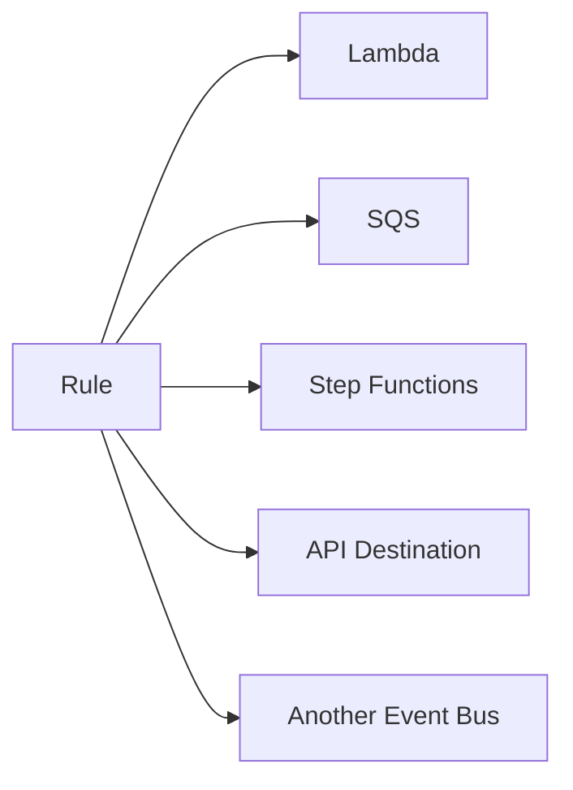

### Target Selection

| Need | Target |
|---|---|
| lightweight idempotent reaction | Lambda |
| consumer-specific buffer/backpressure | SQS |
| durable multi-step workflow | Step Functions |
| fanout to topic subscribers | SNS |
| cross-account/domain routing | another event bus |
| external HTTPS/SaaS integration | API destination |
| long containerized processing | ECS task or SQS -> worker |

Direct EventBridge → Lambda is not always best.

For important/high-volume consumers, EventBridge → SQS → Lambda often gives stronger control.

---

## 8. Producer Contract

A producer owns event quality.

The producer must define:

- event source name;
- detail type;
- schema;
- versioning policy;
- event ID;
- correlation/causation IDs;
- tenant/resource identity;
- ordering expectation;
- delivery expectation;
- deduplication strategy;
- archive/replay expectation;
- retention/audit needs.

### Producer Must Not

- emit ambiguous event names;
- omit schema version;
- put secrets in events;
- rely on consumers to infer missing data;
- use random event types per release;
- break schema without versioning;
- emit event before transaction commits;
- emit duplicate facts without stable business ID;
- emit command disguised as event when result is expected.

### Producer Side Outbox

If event emission must be atomic with database state change, use outbox.

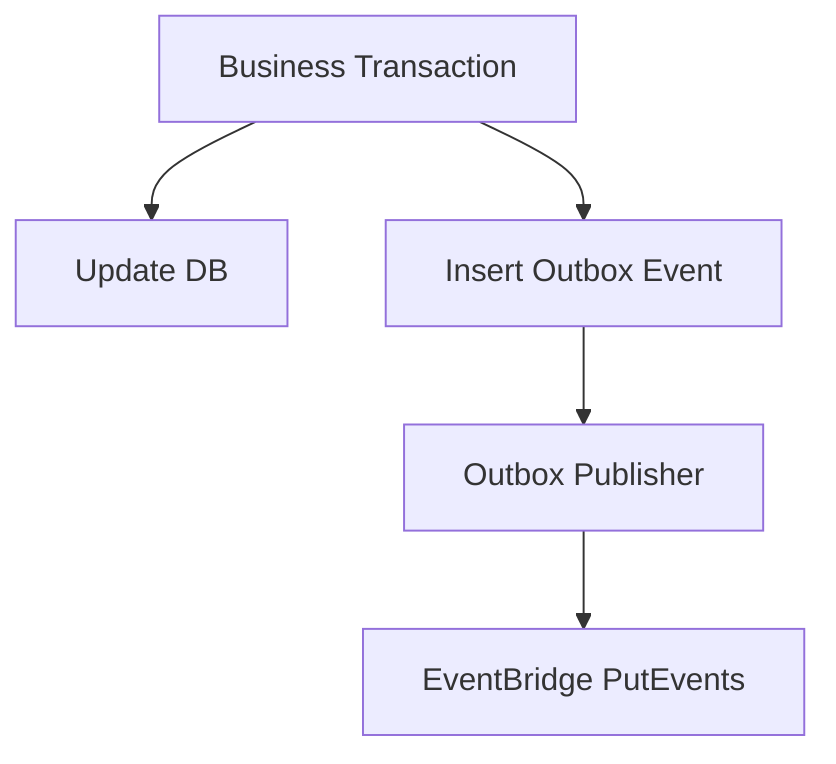

Without outbox:

```txt
DB commit succeeds
PutEvents fails
business state changed but event missing
```

Or:

```txt
PutEvents succeeds
DB commit fails
event says something happened that did not happen
```

Outbox solves the commit/publish gap.

---

## 9. Consumer Contract

A consumer owns processing safety.

The consumer must define:

- supported event types and versions;
- idempotency key;
- failure policy;
- retry behavior;
- target-specific DLQ/failure destination;
- side-effect boundary;
- schema validation;
- observability;
- replay safety;
- owner/on-call;
- downstream capacity.

### Consumer Must Assume

- duplicate events;
- replayed events;
- out-of-order events unless explicitly designed otherwise;
- missing optional fields;
- older schema versions;
- late events;
- producer bugs;
- failure destination messages;
- partial downstream failure.

The bus decouples services. It does not remove distributed systems problems.

---

## 10. EventBridge Delivery and Failure Boundaries

EventBridge delivery to targets is not a global transaction.

If one rule has three targets:

```txt
target A succeeds
target B fails and retries
target C succeeds
```

There is no all-or-nothing across targets.

Each target path needs its own failure handling.

### Target Failure Controls

Depending target, EventBridge rules support:

- retry policy;
- dead-letter queue;
- target-specific permissions;
- input transformation;
- delivery metrics.

Design per target.

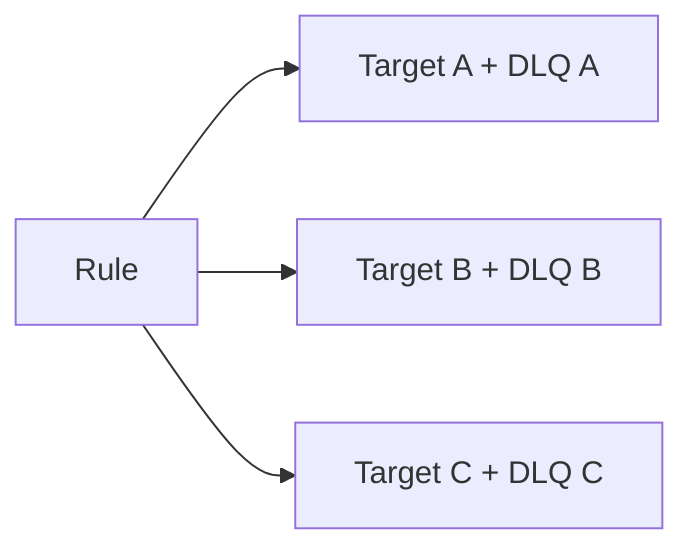

A shared DLQ can be useful for platform handling, but it must preserve target/rule metadata.

---

## 11. Archive and Replay

EventBridge archives can store events from a bus based on an event pattern. Replays re-send archived events to the source event bus and can target all or selected rules.

Use archive/replay for:

- recovering from consumer outage;
- rebuilding projections;
- testing new consumers in pre-prod-like flow;
- reprocessing after bug fix;
- forensic analysis;
- event-driven backfill.

### Replay Is Dangerous Without Idempotency

Replay means the same business events can be delivered again.

Consumers must be replay-safe.

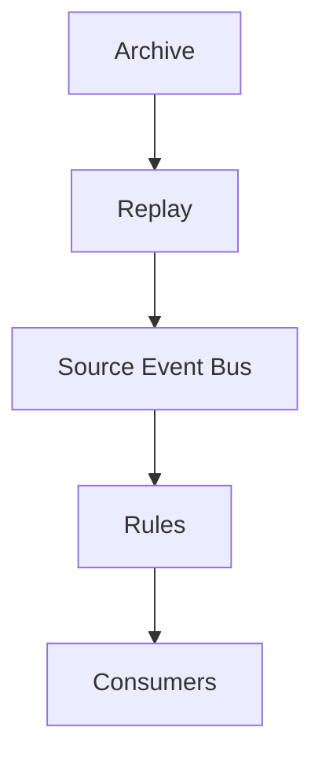

### Replay Checklist

Before replay:

- identify event pattern and time window;
- identify target rules;
- verify consumer idempotency;
- cap downstream concurrency;
- communicate duplicate expectation;
- replay small sample first;
- monitor DLQ/errors/downstream;
- preserve original failed evidence;
- confirm events are still business-valid.

### Important Boundary

Archive/replay is not a database backup.

It stores events on the bus, not arbitrary application state.

If event payloads are incomplete references and referenced objects were deleted, replay may not be sufficient.

---

## 12. Schema Registry and Discovery

EventBridge schema registry can help discover and manage event schemas.

But schema registry is not governance by itself.

You still need:

- schema ownership;
- compatibility rules;
- versioning;
- deprecation;
- consumer contract tests;
- examples;
- documentation;
- review process;
- generated code strategy;
- schema evolution policy.

### Compatibility

Prefer additive changes:

```txt
add optional field
add enum value only if consumers tolerate unknown
add new detail-type/version for breaking change
```

Breaking changes require:

- new version;
- consumer migration;
- old version retention;
- deprecation timeline;
- monitoring consumers;
- replay strategy.

---

## 13. Cross-Account Event Routing

EventBridge is often used for multi-account architectures.

Example:

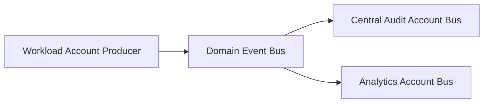

Use cross-account routing for:

- centralized audit;
- security event aggregation;
- multi-account domain events;
- platform event hub;
- environment isolation;
- data boundary enforcement.

Design concerns:

- event bus resource policy;
- allowed source accounts;
- event source names;
- target account permissions;
- encryption/KMS if applicable;
- observability across accounts;
- replay ownership;
- schema governance;
- least privilege.

### Cross-Account Rule

Always know:

```txt
who can put events to this bus?
who can create rules?
who can add targets?
who owns failure DLQ?
who can replay archive?
```

Cross-account eventing without policy governance becomes cross-account confusion.

---

## 14. API Destinations

API destinations let EventBridge invoke HTTPS endpoints as targets.

Use for:

- SaaS integration;
- external webhooks;
- partner APIs;
- internal public/private HTTPS endpoints;
- low-code-ish integration path.

Design concerns:

- authentication;
- rate limits;
- retry behavior;
- DLQ;
- payload transformation;
- secret storage;
- endpoint availability;
- idempotency;
- data leakage;
- timeout;
- vendor error taxonomy.

### API Destination Rule

Do not send sensitive event payloads to external APIs by default.

Transform/minimize payload:

```txt
event -> minimal outbound request
```

For high-value external calls, consider SQS buffer or Step Functions for stronger control.

---

## 15. EventBridge Pipes

EventBridge Pipes is for point-to-point integration from a source to a target with optional filtering, enrichment, and transformation.

Conceptually:

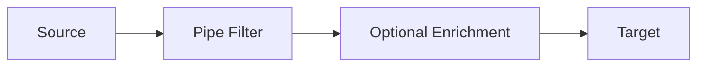

Use Pipes when:

- you need source-to-target integration;
- you want filtering before target;
- you want optional enrichment;
- you want less custom glue code;
- the flow is point-to-point, not many-source-many-target bus routing.

Sources can include queues/streams depending support; targets can include AWS services and API destinations depending support.

### Pipes vs Event Bus

| Need | Prefer |
|---|---|
| many producers to many consumers | event bus |
| point-to-point source to target | pipe |
| routing by event pattern to multiple targets | event bus rule |
| stream/queue enrichment before target | pipe |
| publish domain facts | event bus |
| integration plumbing | pipe |

Pipes and buses can be combined.

Example:

```txt
DynamoDB Stream -> Pipe -> Event Bus -> Rules -> Consumers
```

Use Pipes to convert source changes into clean domain events before bus routing.

---

## 16. EventBridge Scheduler

EventBridge Scheduler is the preferred scheduling service for many scheduled target invocations.

Use Scheduler for:

- one-time schedules;
- recurring schedules;
- high-scale scheduling;
- flexible time windows;
- target invocation with retry/DLQ;
- per-schedule payloads;
- replacing many scheduled-rule patterns.

Scheduled EventBridge rules still exist, but AWS documentation recommends Scheduler for scheduled invocations because it offers improved scalability and wider target support.

### Scheduler Pattern

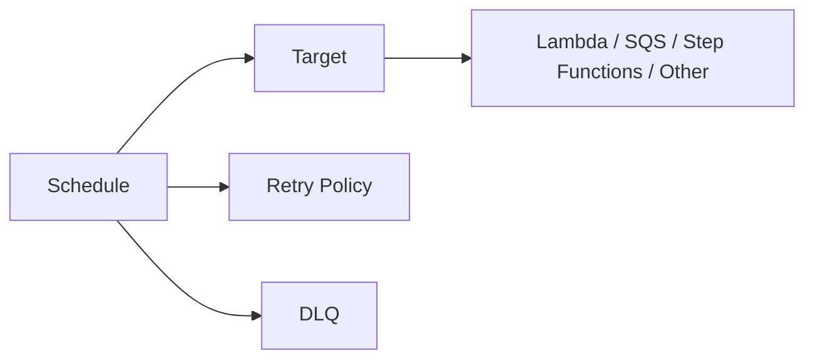

### Scheduler Use Cases

- send reminder at exact business time;
- start daily settlement workflow;
- run periodic reconciliation;
- expire case deadline;
- trigger delayed retry;
- execute one-time future task;
- fan out scheduled maintenance.

### Scheduler Design

- schedule name includes business ID where safe;
- target is often SQS or Step Functions, not direct heavy Lambda;
- DLQ configured for critical tasks;
- retry policy set;
- time zone explicit if user-facing;
- flexible time window used where exact timing not required;
- schedule lifecycle cleanup exists.

---

## 17. EventBridge vs SNS vs SQS vs Step Functions

Do not use EventBridge for everything.

| Need | Good Fit |
|---|---|
| many-source-many-target event routing | EventBridge event bus |
| simple pub/sub fanout | SNS |
| durable queue/backpressure | SQS |
| ordered group queue | SQS FIFO |
| stream with ordered shards | Kinesis/DynamoDB Streams |
| durable workflow orchestration | Step Functions |
| point-to-point integration/filter/enrich | EventBridge Pipes |
| scheduled invocation | EventBridge Scheduler |

### Common Combination

```txt
Domain service -> EventBridge bus
EventBridge rule -> SQS queue per consumer
SQS -> Lambda consumer
```

This combines routing and backpressure.

### Another Combination

```txt
API command -> Step Functions
Step Functions -> EventBridge PutEvents after state transition
EventBridge -> downstream projections
```

This combines workflow state and event distribution.

---

## 18. Event Ordering

EventBridge does not give you a general global ordering guarantee for domain events.

Design consumers to handle:

- duplicate events;
- late events;
- out-of-order events;
- replayed events;
- missing previous projection state.

If ordering matters:

- use aggregate version;
- use SQS FIFO per aggregate;
- use Kinesis partition key per aggregate;
- use database optimistic concurrency;
- use state machine;
- use consumer-side sequence checks.

### Event Detail Example

```json
{
  "schemaVersion": "1.0",
  "eventId": "evt-123",
  "aggregateType": "Case",
  "aggregateId": "case-456",
  "aggregateVersion": 17,
  "eventType": "CaseEscalated",
  "occurredAt": "2026-07-06T10:15:29Z"
}
```

Consumer can reject or buffer if version is unexpected.

Do not assume “events arrived in the order I emitted them” unless you have an explicit ordering mechanism.

---

## 19. Idempotency and Deduplication

Consumers must be idempotent.

Idempotency key:

```txt
source + detail-type + business event id
```

Example:

```txt
com.example.cases:CaseEscalated:evt-123
```

For state projection:

```txt
aggregate_id + aggregate_version
```

Example:

```txt
case-456:17
```

### Consumer Logic

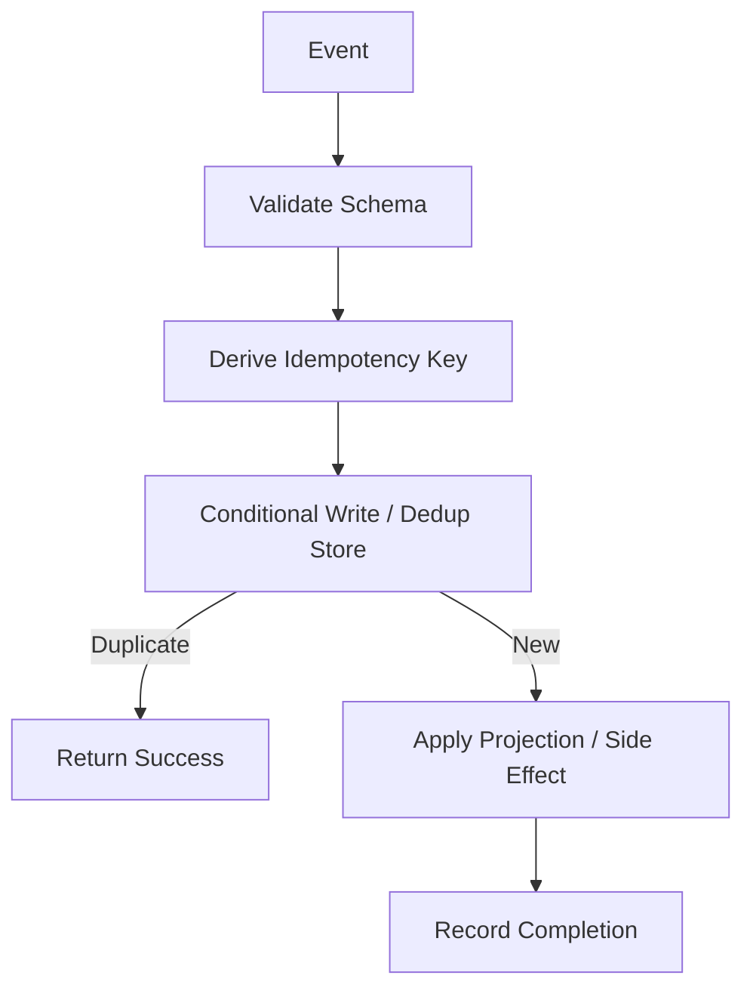

Idempotency must be durable.

In-memory sets do not survive concurrency, cold starts, replay, or deployment.

---

## 20. EventBridge Observability

Minimum observability:

### Producer

- PutEvents success/failure;
- failed entry count;
- event type count;
- event size;
- schema version emitted;
- outbox lag;
- publish latency;
- DLQ for publisher if used.

### Bus/Rules

- matched events;
- triggered rules;
- failed invocations;
- throttled rules/targets;
- dead-letter messages;
- archive event count/size;
- replay status.

### Consumer

- event received;
- event type/version;
- idempotency status;
- processing outcome;
- downstream latency;
- retry/failure;
- DLQ depth;
- replay marker if available.

### Correlation

Every event should carry:

```txt
correlationId
causationId
eventId
```

This lets you reconstruct:

```txt
command -> emitted event -> consumer side effects -> downstream events
```

---

## 21. EventBridge Cost Surface

Cost can come from:

- custom events published;
- matched events/rules;
- archive storage;
- replay;
- Pipes;
- API destinations;
- Scheduler invocations;
- target service invocations;
- Lambda/SQS/Step Functions downstream cost;
- logs/traces;
- retries;
- DLQ storage/redrive.

Cost anti-pattern:

```txt
one high-volume event matches 30 broad rules
each rule invokes Lambda
each Lambda logs full payload
```

Event routing cost is not only EventBridge price. It is downstream amplification.

### Cost Controls

- precise event patterns;
- avoid catch-all rules;
- filter before heavy targets;
- SQS buffer for expensive consumers;
- archive only needed events;
- transform/minimize payload;
- avoid logging full events;
- monitor matched events per rule;
- delete unused rules/targets.

---

## 22. EventBridge Failure Modes

| Failure | Common Cause |
|---|---|
| producer PutEvents partially fails | invalid entry, throttling, permission |
| event not routed | pattern mismatch |
| wrong target invoked | broad pattern |
| consumer receives unexpected event | schema drift or broad rule |
| DLQ fills | target delivery failure |
| replay duplicates side effects | consumer not idempotent |
| archive missing event | archive pattern wrong or retention expired |
| cross-account put denied | bus policy/IAM |
| API destination fails | auth/rate limit/endpoint error |
| Scheduler missed target | target permission/retry exhausted/DLQ |
| event loop | consumer emits event that re-triggers itself |
| cost spike | broad fanout or replay |

---

## 23. Event Loop Anti-Pattern

Event loop example:

```txt
Rule matches CaseUpdated
Consumer updates case projection
Projection update emits CaseUpdated
Rule matches again
```

Prevent with:

- clear event type taxonomy;
- source separation;
- metadata marker;
- rule patterns excluding derived events;
- idempotency;
- max loop detection;
- separate buses for domain vs projection events where useful.

Event loops are easy to create and hard to notice until cost/latency spikes.

---

## 24. EventBridge Design Checklist

### Bus

- [ ] Bus ownership defined.
- [ ] Default/custom/partner bus decision justified.
- [ ] Cross-account policy reviewed.
- [ ] Archive policy defined.
- [ ] Replay owner/runbook defined.
- [ ] Environment separation clear.

### Producer

- [ ] Source namespace defined.
- [ ] Detail type defined.
- [ ] Schema version included.
- [ ] Business event ID included.
- [ ] Correlation/causation IDs included.
- [ ] Outbox used if publish must be atomic with DB transaction.
- [ ] PutEvents failure handling implemented.
- [ ] No secrets in event payload.

### Routing

- [ ] Rules are precise.
- [ ] Catch-all rules reviewed.
- [ ] Targets have DLQ/retry where needed.
- [ ] Input transformation reviewed.
- [ ] Cross-account targets authorized.
- [ ] Event loops prevented.

### Consumer

- [ ] Event validation implemented.
- [ ] Unsupported versions handled.
- [ ] Idempotency durable.
- [ ] Replay-safe.
- [ ] Failure destination/DLQ monitored.
- [ ] Downstream capacity protected.
- [ ] Observability includes event/correlation IDs.

### Operations

- [ ] Dashboards for PutEvents/rules/targets/DLQs.
- [ ] Archive/replay drill completed.
- [ ] DLQ redrive process.
- [ ] Schema compatibility tests.
- [ ] Cost/matched-events monitoring.
- [ ] Runbook for missing event and replay.

---

## 25. Common Anti-Patterns

### Anti-Pattern 1 — Event Bus as Dumping Ground

Every service emits everything to one bus with no ownership or taxonomy.

### Anti-Pattern 2 — Command Disguised as Event

`SendEmailNow` is routed as if it were a fact.

### Anti-Pattern 3 — No Schema Version

Consumers break silently when payload changes.

### Anti-Pattern 4 — No Business Event ID

Consumers cannot dedupe/replay safely.

### Anti-Pattern 5 — Catch-All Rules

Unexpected events invoke expensive or unsafe consumers.

### Anti-Pattern 6 — Direct EventBridge to Heavy DB Lambda

No explicit backpressure.

### Anti-Pattern 7 — Replay Without Idempotency

Duplicate side effects.

### Anti-Pattern 8 — Archive Pattern Too Narrow

The event you need during recovery was never archived.

### Anti-Pattern 9 — Event Payload Contains Secrets

Events are replicated to logs, archives, targets, and external integrations.

### Anti-Pattern 10 — No Producer Failure Handling

`PutEvents` partial failures ignored.

---

## 26. Final Mental Model

EventBridge is a routing plane, not a correctness engine.

It lets you express:

```txt
when event matching this pattern appears on this bus,
send it to these targets
```

Everything else is your architecture:

- event contracts;
- schema governance;
- producer atomicity;
- consumer idempotency;
- replay safety;
- failure handling;
- routing boundaries;
- observability;
- cost control.

A top-tier engineer does not ask:

> “Can I publish this event?”

They ask:

> “Who owns this event contract, who is allowed to consume it, what happens if it is replayed, and how do we prove each consumer processed it safely?”

That is EventBridge engineering.

---

## References

- Amazon EventBridge User Guide: event buses
- Amazon EventBridge User Guide: rules and event patterns
- Amazon EventBridge User Guide: targets
- Amazon EventBridge User Guide: archives and replays
- Amazon EventBridge User Guide: API destinations
- Amazon EventBridge Pipes documentation
- Amazon EventBridge Scheduler documentation
