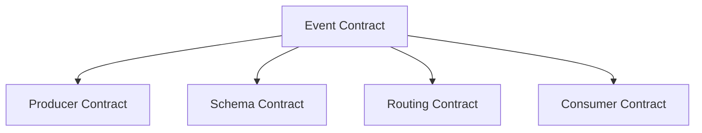
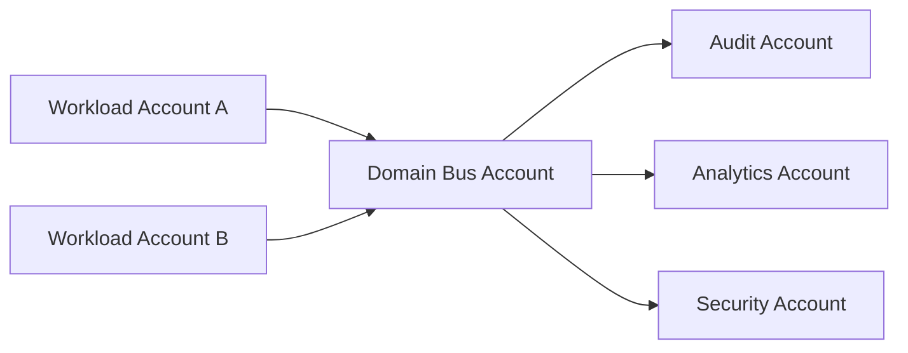

# Part 064 — EventBridge Routing, Schema, and Governance

EventBridge starts simple.

One producer:

```txt
PutEvents(OrderCreated)
```

One consumer:

```txt
Rule -> Lambda
```

Then a few months pass.

Now there are:

- dozens of event types;
- many teams producing events;
- consumers no producer knows about;
- replay requests;
- schema changes;
- cross-account routing;
- multiple environments;
- DLQs;
- archive costs;
- broad rules;
- duplicated side effects;
- “who owns this event?” questions.

This is where EventBridge needs governance.

Governance does not mean bureaucracy.

Governance means the event system remains understandable as it grows.

---

## 1. Event Governance Mental Model

A mature event-driven platform needs four contracts.



| Contract | Questions |
|---|---|
| producer contract | who emits, when, with what guarantees |
| schema contract | what fields mean, compatibility rules |
| routing contract | where events go and why |
| consumer contract | what consumers do and how they fail safely |

EventBridge provides routing mechanics.

Governance defines the rules of use.

---

## 2. Event Taxonomy

A taxonomy is a naming system.

Without taxonomy, event systems become semantic chaos.

### Source Naming

Use reverse-DNS or organization/domain style.

Good:

```txt
com.company.orders
com.company.payments
com.company.case-management
com.company.identity
com.company.audit
```

Bad:

```txt
orders
service1
backend
lambda
misc
```

The `source` should identify the producer domain/application, not the AWS service used to emit it.

### Detail Type Naming

Use past-tense domain facts.

Good:

```txt
OrderCreated
PaymentCaptured
CaseEscalated
DocumentUploaded
InvoiceGenerated
AccountClosed
```

Bad:

```txt
CreateOrder
DoPayment
UpdateThing
SendEmail
CaseEvent
```

### Event Type Formula

```txt
source + detail-type + schemaVersion
```

Example:

```txt
source: com.company.case-management
detail-type: CaseEscalated
detail.schemaVersion: 1.0
```

This is the stable event identity.

---

## 3. Event Categories

Not all events are the same.

| Category | Example | Governance Need |
|---|---|---|
| domain event | `OrderCreated` | schema, compatibility, replay |
| integration event | `InvoiceReadyForExport` | partner contract |
| audit event | `CaseDecisionIssued` | immutability, retention |
| operational event | `ServiceQuotaExceeded` | routing to ops |
| security event | `UnauthorizedAccessDetected` | restricted payload/routing |
| projection event | `SearchIndexUpdated` | avoid loops |
| command-like event | `StartReportGeneration` | maybe use SQS/Step Functions instead |

Classify events because each category has different retention, routing, and replay rules.

---

## 4. Event Envelope Standard

Define a standard `detail` envelope for custom domain events.

Example:

```json
{
  "schemaVersion": "1.0",
  "eventId": "evt-01J2ABC...",
  "eventType": "CaseEscalated",
  "producer": "case-management-service",
  "occurredAt": "2026-07-06T10:15:30Z",
  "correlationId": "corr-123",
  "causationId": "cmd-456",
  "tenantId": "tenant-1",
  "aggregate": {
    "type": "Case",
    "id": "case-789",
    "version": 17
  },
  "data": {
    "fromState": "REVIEW_READY",
    "toState": "ESCALATED",
    "reasonCode": "DEADLINE_RISK"
  }
}
```

### Required Fields

| Field | Why |
|---|---|
| `schemaVersion` | compatibility |
| `eventId` | business dedup/replay |
| `eventType` | local detail identity |
| `producer` | ownership |
| `occurredAt` | domain time |
| `correlationId` | trace business flow |
| `causationId` | causal chain |
| `tenantId` | multi-tenant boundary |
| `aggregate.id` | state ownership |
| `aggregate.version` | ordering/projection safety |
| `data` | event-specific payload |

Do not over-standardize every payload, but standardize the metadata.

---

## 5. Event ID Strategy

EventBridge gives each event an `id`.

You still need a business event ID.

Why?

- producer retry may publish same business event twice with different EventBridge IDs;
- outbox may retry;
- archive replay reuses event content but delivery context differs;
- consumers need stable deduplication;
- audits need domain identifier.

### Event ID Generation

Good:

```txt
outbox_event_id
domain_event_id
aggregate_id + aggregate_version
command_id + event_type
```

Bad:

```txt
random ID generated separately on every publish retry
Lambda request ID
EventBridge id as only domain id
timestamp
```

### Idempotency Key

Consumer key:

```txt
source + ":" + detail-type + ":" + detail.eventId
```

Or for projections:

```txt
aggregate.type + ":" + aggregate.id + ":" + aggregate.version
```

---

## 6. Schema Evolution

Event schemas change.

A governance model must define how.

### Compatible Changes

Usually safe:

- add optional field;
- add nullable field;
- add new event type;
- add new schema version while old remains;
- add enum value only if consumers tolerate unknown values.

### Breaking Changes

Risky:

- remove field;
- rename field;
- change type;
- change meaning;
- make optional field required;
- change enum semantics;
- change idempotency key field;
- change tenant/resource meaning;
- change event timing meaning.

### Versioning Strategy

Options:

#### Minor Additive Version

```json
"schemaVersion": "1.1"
```

Consumers supporting `1.x` tolerate additive fields.

#### New Major Version

```json
"schemaVersion": "2.0"
```

Used for breaking change.

#### New Detail Type

```txt
CaseEscalatedV2
```

Sometimes clearer for major semantic change, but can pollute taxonomy if overused.

### Rule

```txt
An event contract is consumed by unknown future consumers.
Change it more carefully than an internal DTO.
```

---

## 7. Consumer Compatibility Testing

Producer tests are not enough.

Use consumer contract tests.

Pattern:

```txt
producer publishes sample event schemas/examples
consumer validates it can parse/process supported versions
CI fails on incompatible change
```

Repository shape:

```txt
event-contracts/
├── com.company.orders/
│   ├── OrderCreated/
│   │   ├── v1.0.schema.json
│   │   ├── v1.0.example.json
│   │   ├── v1.1.schema.json
│   │   └── changelog.md
└── com.company.payments/
```

Consumers import or test against examples.

### Compatibility Matrix

| Consumer | Event | Supported Versions |
|---|---|---|
| search-indexer | OrderCreated | 1.0, 1.1 |
| email-service | OrderCreated | 1.0 |
| audit-service | PaymentCaptured | 1.0, 2.0 |
| analytics | all domain events | schema-dependent |

This matrix prevents accidental producer breakage.

---

## 8. Event Pattern Design

EventBridge event patterns should be precise.

Good:

```json
{
  "source": ["com.company.case-management"],
  "detail-type": ["CaseEscalated"],
  "detail": {
    "schemaVersion": ["1.0", "1.1"],
    "data": {
      "reasonCode": ["DEADLINE_RISK", "HIGH_SEVERITY"]
    }
  }
}
```

Bad:

```json
{
  "source": [{ "prefix": "com.company" }]
}
```

### Pattern Review Questions

- Does this rule match only intended event types?
- Does it include schema versions?
- Does it accidentally match replay/test events?
- Does it route high-volume events to expensive targets?
- Does it include tenant/environment constraints where needed?
- Does handler still validate source/schema?
- Is the pattern documented?
- Who owns it?

A broad pattern is a production footgun.

---

## 9. Rule Ownership

Every EventBridge rule needs an owner.

Rule metadata should include:

```txt
owner team
purpose
source event
target
failure destination
criticality
environment
created by
runbook
cost center
```

If using IaC, encode tags/metadata.

Example:

```yaml
Tags:
  Owner: payments-platform
  Purpose: payment-captured-to-audit
  Criticality: high
  Runbook: runbooks/eventbridge/payment-captured-audit.md
```

Rules without owners become ghost integrations.

---

## 10. Target Governance

A rule target can be:

- Lambda;
- SQS;
- Step Functions;
- SNS;
- another event bus;
- API destination;
- ECS task;
- many AWS service targets.

Governance requires:

- least-privilege target permissions;
- retry policy;
- DLQ where appropriate;
- input transformation review;
- owner;
- downstream capacity analysis;
- idempotency;
- observability.

### Target Risk Matrix

| Target | Main Risk |
|---|---|
| Lambda | duplicate side effects, throttling, no DLQ |
| SQS | backlog/DLQ owner missing |
| Step Functions | execution duplication, cost, workflow errors |
| API destination | external auth/rate limit/data leakage |
| another bus | cross-account routing confusion |
| ECS task | burst task launch/cost |
| SNS | fanout explosion |

Do not add targets casually.

Every target is an integration contract.

---

## 11. Input Transformation

EventBridge can transform event input before sending to target.

Use it for:

- minimizing payload;
- adapting to target shape;
- removing sensitive fields;
- passing only required fields;
- adding constant metadata;
- shaping API destination request.

Be careful:

- transformation can hide original context;
- target may need full event for idempotency;
- transform errors can cause delivery failure;
- transformed payload is a contract;
- schema version still matters.

### Pattern

Keep full event for domain consumers.

Use transformed minimal payload for external API destinations or simple operational targets.

---

## 12. Cross-Account Governance

Cross-account event routing is powerful and needs strict policy.

### Bus Policy Questions

- Which accounts can put events?
- Which sources/detail-types are allowed?
- Which principals can create rules?
- Which targets can rules invoke?
- Can accounts route events onward?
- Who can archive/replay?
- Who owns DLQs?
- How is schema governed across accounts?

### Account Topology Example



### Guardrails

- explicit bus resource policies;
- AWS Organizations condition where useful;
- source account validation;
- event source naming standard;
- separate audit/security buses;
- cross-account DLQ ownership;
- CloudTrail monitoring;
- IaC-only rule creation in prod.

---

## 13. Archive Governance

Archives are not free and not automatic recovery.

Define:

- which buses are archived;
- which event patterns are archived;
- retention period;
- who can replay;
- replay approval process;
- replay destination scope;
- replay observability;
- data classification;
- PII/security constraints;
- cost owner.

### Archive Pattern

Archive all high-value domain events, not every noisy operational event.

Example archive pattern:

```json
{
  "source": [
    "com.company.orders",
    "com.company.payments",
    "com.company.case-management"
  ]
}
```

Avoid archiving secrets or highly sensitive payloads unnecessarily.

### Replay Governance

Replay requires approval for production.

Checklist:

- event time window;
- event pattern;
- target rules;
- consumer idempotency proof;
- downstream capacity;
- small sample replay;
- rollback/stop plan;
- monitoring.

Replay is a production change.

---

## 14. Replay Safety

A replay-safe consumer has:

- durable idempotency;
- event version handling;
- side-effect deduplication;
- timestamp/business validity check;
- downstream capacity controls;
- replay marker logging;
- duplicate metrics;
- redrive/replay runbook.

### Replay Hazard Examples

| Consumer | Hazard |
|---|---|
| email sender | duplicate emails |
| payment handler | duplicate charges |
| audit writer | duplicate audit rows if no unique event id |
| search indexer | usually safe if idempotent upsert |
| notification sender | user-visible duplication |
| workflow starter | duplicate workflows unless deterministic name |

Replay safety is consumer-specific.

---

## 15. Scheduler Governance

EventBridge Scheduler can create many one-time or recurring schedules.

Without governance, schedules become invisible cron debt.

Schedule metadata should include:

- owner;
- purpose;
- target;
- business ID;
- timezone;
- flexible time window;
- retry policy;
- DLQ;
- end date/deletion policy;
- criticality;
- runbook.

### One-Time Schedule Pattern

Use for:

- delayed task;
- deadline reminder;
- future state transition;
- retry after business delay;
- scheduled callback.

Example:

```txt
case-deadline-case-123-2026-07-10T09:00Z
```

Target often should be:

```txt
SQS message or Step Functions execution
```

not a heavy direct Lambda if backpressure/audit matters.

### Recurring Schedule Pattern

Use for:

- daily reconciliation;
- hourly sync;
- periodic cleanup;
- report generation.

Recurring schedules need:

- idempotent run ID;
- overlap prevention;
- missed-run policy;
- DLQ;
- alert on failure;
- owner.

---

## 16. Pipes Governance

Pipes can reduce glue code, but each Pipe is still an integration.

For every Pipe define:

- source;
- filter criteria;
- enrichment;
- target;
- failure behavior;
- IAM role;
- owner;
- schema transformation;
- observability;
- replay/redrive story.

### Pipe Design Questions

- Is this truly point-to-point?
- Should this instead publish to an event bus?
- Is enrichment idempotent?
- What happens if enrichment fails?
- Is target idempotent?
- Does source have DLQ/retry?
- Are filtered-out events intentionally discarded?
- Is payload transformation documented?

Pipes are integration infrastructure, not invisible magic.

---

## 17. API Destination Governance

API destinations are external integration boundaries.

Controls:

- connection auth secret ownership;
- rate limit;
- retry policy;
- DLQ;
- payload minimization;
- data classification;
- vendor SLA;
- timeout;
- idempotency key sent to external API if supported;
- response/error mapping;
- circuit breaker strategy if needed.

### External Data Rule

Before sending event to external API:

1. classify data;
2. remove unnecessary fields;
3. ensure consent/legal basis if required;
4. sign/authenticate request;
5. include idempotency key;
6. monitor failures;
7. define replay behavior.

---

## 18. Environment Strategy

Use separate environments deliberately.

Options:

```txt
dev bus
staging bus
prod bus
```

or separate AWS accounts per environment.

Rules:

- prod events never route to dev targets;
- dev consumers cannot subscribe to prod bus without explicit approval;
- test events are clearly marked or use test bus;
- archive/replay in prod is controlled;
- schemas can be tested before prod;
- event source names do not accidentally collide.

### Event Environment Field

Avoid relying only on payload environment if account/bus already provides boundary. But include environment in logs and metadata for observability.

---

## 19. Event Catalog

Create an event catalog.

For each event:

```yaml
source: com.company.orders
detailType: OrderCreated
schemaVersion: "1.1"
owner: orders-team
description: Emitted after an order is durably created.
businessMeaning: The order exists and can be referenced by orderId.
idempotencyKey: detail.eventId
aggregate:
  type: Order
  idField: detail.aggregate.id
  versionField: detail.aggregate.version
schema: schemas/orders/OrderCreated/1.1.json
examples:
  - examples/orders/OrderCreated/1.1/basic.json
retention: 90d archive
pii: contains customerId only, no email/address
consumers:
  - search-indexer
  - notification-service
  - audit-service
compatibility: additive minor, breaking major
deprecation: none
```

This catalog can be a docs site, repository, schema registry integration, or internal portal.

The format matters less than adoption.

---

## 20. Event Ownership Model

Each event has:

- producer owner;
- schema owner;
- bus/platform owner;
- consumer owners.

Example:

| Responsibility | Owner |
|---|---|
| event meaning | producer team |
| event schema | producer team with platform review |
| bus policy | platform team |
| rule to consumer | consumer team |
| DLQ for consumer target | consumer team |
| archive policy | platform + domain owner |
| replay approval | platform + affected consumers |
| schema catalog | platform tooling |

Producer does not own consumer side effects.

Consumer does not own producer schema unilaterally.

Platform owns the guardrails.

---

## 21. Event Contract Review

Before introducing a new event:

1. Is this an event or command?
2. What business fact happened?
3. When is it emitted relative to transaction commit?
4. What is the stable event ID?
5. What is the aggregate and version?
6. What fields are required?
7. Does it contain PII/secrets?
8. Who consumes it now?
9. Who may consume it later?
10. Is ordering required?
11. Is replay expected?
12. What retention is needed?
13. What schema compatibility policy?
14. What is failure impact if consumers miss it?
15. Is EventBridge the right transport?

This is not bureaucracy. It prevents distributed ambiguity.

---

## 22. Platform Guardrails

Automate checks.

### IaC Policy Checks

- no catch-all prod rule without waiver;
- every target has owner tag;
- critical target has DLQ;
- archive retention set for domain bus;
- cross-account bus policy restricted;
- no external API destination without data classification;
- Scheduler schedule has DLQ for critical target;
- event source names match namespace standard;
- prod rule creation only through pipeline.

### CI Checks

- event schema validates;
- examples validate;
- backward compatibility check;
- consumer contract tests pass;
- event catalog updated;
- no secrets in examples;
- generated code compiles.

### Runtime Checks

- unknown schema version metric;
- unexpected source metric;
- duplicate event metric;
- replay detection metric;
- DLQ alarms;
- rule failure alarms;
- PutEvents partial failure alarms.

Guardrails convert governance from meetings into engineering.

---

## 23. EventBridge Runbooks

### Runbook: Event Not Received by Consumer

Questions:

1. Did producer call `PutEvents` successfully?
2. Were there partial failures?
3. Was event sent to expected bus?
4. Does rule pattern match event?
5. Is rule enabled?
6. Is target configured?
7. Does target permission allow invocation?
8. Did target fail and go to DLQ?
9. Was event filtered by Pipe/rule?
10. Is consumer looking at wrong environment/account?

Evidence:

```bash
aws events list-rules --event-bus-name domain-prod
aws events describe-rule --name rule-name --event-bus-name domain-prod
aws events list-targets-by-rule --rule rule-name --event-bus-name domain-prod
```

### Runbook: DLQ Filling

Questions:

1. Which rule/target?
2. Which event type/schema?
3. Is failure due to target permission, throttling, timeout, or validation?
4. Is event poison?
5. Was there a recent deploy?
6. Are events replayed?
7. Is downstream overloaded?

Actions:

- sample DLQ message;
- classify failure;
- pause/disable rule only if necessary;
- fix target/code/permission;
- redrive safely;
- update rule/schema/tests.

### Runbook: Unexpected Consumer Invoked

Questions:

1. Which rule matched?
2. Is pattern too broad?
3. Did source/detail-type change?
4. Is event test/replay?
5. Is rule from old integration?
6. Was target added manually?

Actions:

- inspect pattern;
- narrow rule;
- add owner metadata;
- remove stale target;
- add policy check to prevent recurrence.

### Runbook: Replay Incident

Questions:

1. Who started replay?
2. What archive/time window?
3. Which rules targeted?
4. Which consumers processed duplicates?
5. Were idempotency metrics healthy?
6. Any downstream overload?
7. Any user-visible duplicate side effects?

Actions:

- stop replay if still running and harmful;
- cap consumers;
- inspect duplicate metrics;
- reconcile side effects;
- add replay approval guardrail.

---

## 24. Metrics and Dashboards

### Producer Dashboard

- events published by type/version;
- PutEvents failures;
- PutEvents partial failures;
- outbox backlog;
- publish latency;
- event size distribution.

### Bus Dashboard

- matched events per rule;
- target invocation failures;
- throttles;
- DLQ messages;
- archive count/size;
- replay status;
- rule count;
- target count.

### Consumer Dashboard

- events received by type/version;
- duplicate count;
- unsupported version count;
- processing success/error;
- downstream latency;
- DLQ depth;
- replay marker count.

### Governance Dashboard

- events without owner;
- rules without owner;
- targets without DLQ for critical events;
- broad rules;
- schemas without examples;
- old schema versions still emitted;
- archives near retention/cost threshold;
- schedules without DLQ;
- API destinations without owner.

Governance must be visible.

---

## 25. Security and Compliance

Events can carry sensitive data.

Rules:

- no secrets in events;
- minimize PII;
- classify event payloads;
- encrypt target resources;
- restrict bus policies;
- restrict archive/replay access;
- restrict API destinations;
- log redacted payloads only;
- define retention;
- ensure cross-account routing meets data boundary requirements;
- include audit events for high-value actions;
- validate tenant identity in consumers;
- avoid broad external integrations.

### Sensitive Event Example

Bad:

```json
{
  "apiKey": "...",
  "fullCardNumber": "...",
  "passwordResetToken": "..."
}
```

Better:

```json
{
  "credentialRef": "secret-id-or-token-id",
  "cardToken": "tok_...",
  "resetRequestId": "..."
}
```

Events are copied to targets, logs, archives, DLQs, and sometimes external systems. Treat them as replicated data.

---

## 26. Common Anti-Patterns

### Anti-Pattern 1 — Schema Registry Without Compatibility Tests

Schemas exist but producers still break consumers.

### Anti-Pattern 2 — Every Consumer Adds Its Own Broad Rule

Bus becomes expensive and unpredictable.

### Anti-Pattern 3 — No Event Catalog

Nobody knows what events mean or who owns them.

### Anti-Pattern 4 — Archive Everything Forever

Cost/compliance risk without recovery design.

### Anti-Pattern 5 — Replay as Debug Button

Duplicate side effects and downstream overload.

### Anti-Pattern 6 — Scheduler Without Owner

Future tasks run forever or fail silently.

### Anti-Pattern 7 — Pipes as Invisible Glue

Critical integration exists outside architecture diagrams.

### Anti-Pattern 8 — External API Destination With Full Domain Event

Data leakage and vendor coupling.

### Anti-Pattern 9 — Event Type Named `Updated`

Consumers cannot reason about semantic change.

### Anti-Pattern 10 — Producer Emits Before Commit

Consumers observe facts that did not become durable.

---

## 27. Production EventBridge Checklist

### Event Contract

- [ ] Source namespace standard.
- [ ] Detail type past-tense fact.
- [ ] Schema version.
- [ ] Business event ID.
- [ ] Correlation/causation ID.
- [ ] Aggregate ID/version if relevant.
- [ ] No secrets.
- [ ] Data classification.
- [ ] Examples and schema published.

### Routing

- [ ] Rule pattern precise.
- [ ] Rule owner tagged.
- [ ] Target owner tagged.
- [ ] DLQ/retry configured for critical targets.
- [ ] Input transform documented.
- [ ] Cross-account policy reviewed.
- [ ] Event loop prevented.

### Reliability

- [ ] Producer handles PutEvents partial failure.
- [ ] Outbox used when needed.
- [ ] Consumer idempotency implemented.
- [ ] Replay safety tested.
- [ ] Archive pattern/retention defined.
- [ ] Redrive/replay runbook exists.

### Governance

- [ ] Event catalog updated.
- [ ] Compatibility tests.
- [ ] Schema deprecation process.
- [ ] Broad rule policy check.
- [ ] API destination data review.
- [ ] Scheduler owner/DLQ.
- [ ] Pipes documented.
- [ ] Dashboard and alarms.

---

## 28. Final Mental Model

Event-driven systems scale socially before they scale technically.

The hard part is not publishing JSON.

The hard part is preserving meaning across teams, accounts, services, consumers, schemas, replays, failures, and years of evolution.

EventBridge gives you the routing plane.

Governance gives you the operating model.

A top-tier engineer asks:

> “Will a team that joins six months from now understand this event, consume it safely, replay it safely, and know who owns it?”

If the answer is yes, you are building an event-driven platform.

If the answer is no, you are building distributed ambiguity.

---

## References

- Amazon EventBridge User Guide: event buses
- Amazon EventBridge User Guide: event patterns
- Amazon EventBridge User Guide: targets and API destinations
- Amazon EventBridge User Guide: archive and replay
- Amazon EventBridge Pipes documentation
- Amazon EventBridge Scheduler documentation
- AWS Prescriptive Guidance and Well-Architected Serverless Lens for event-driven architecture principles
