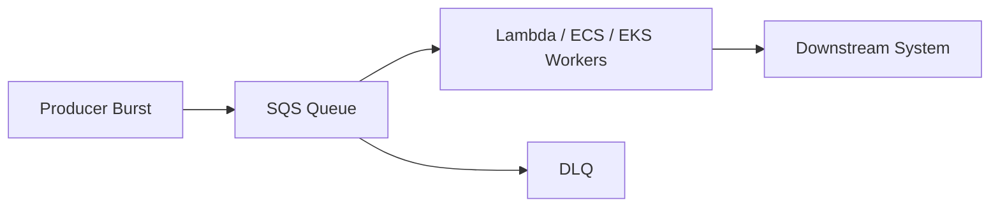
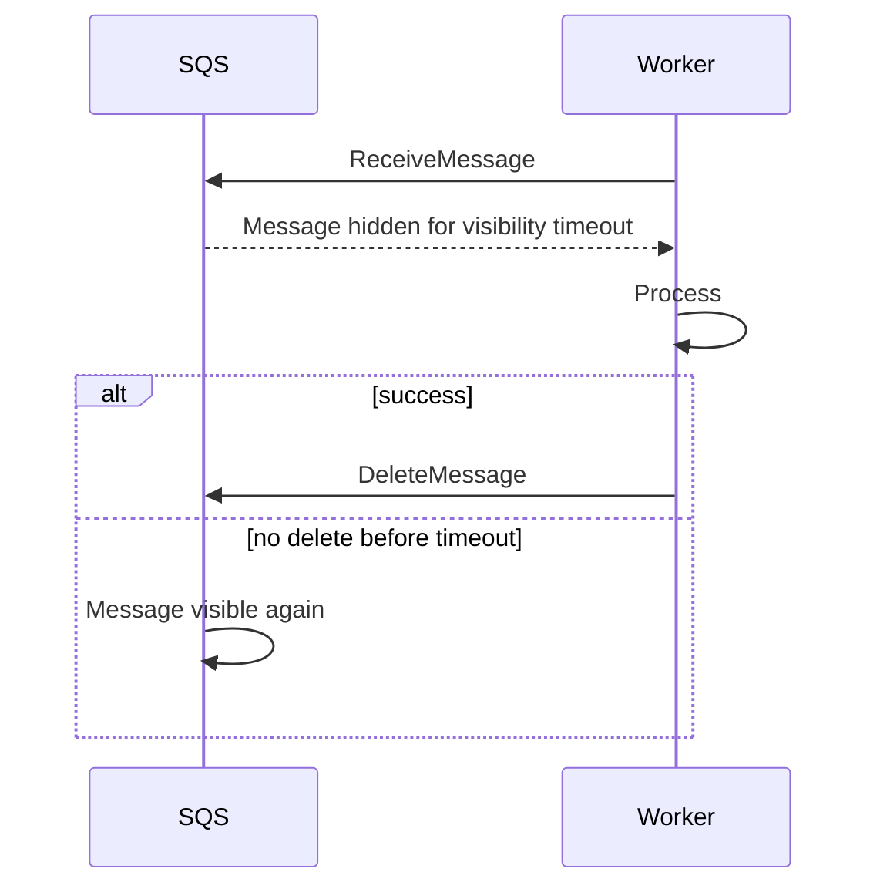
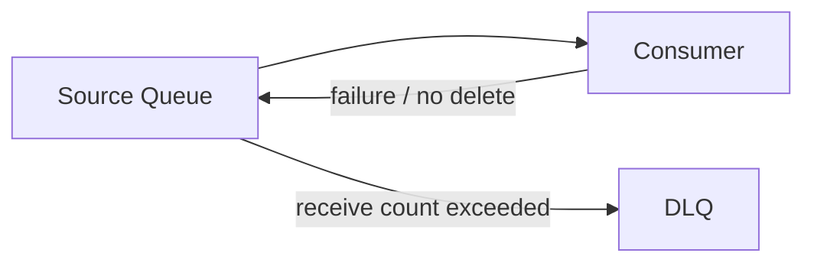
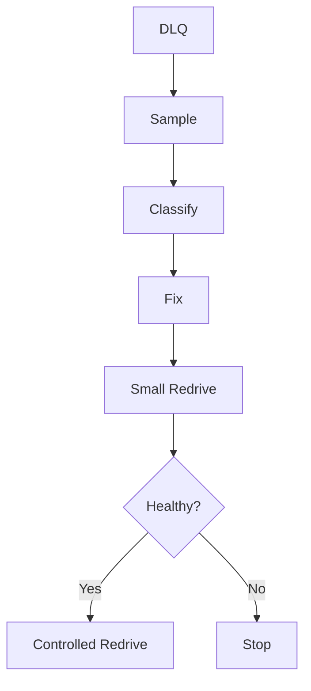
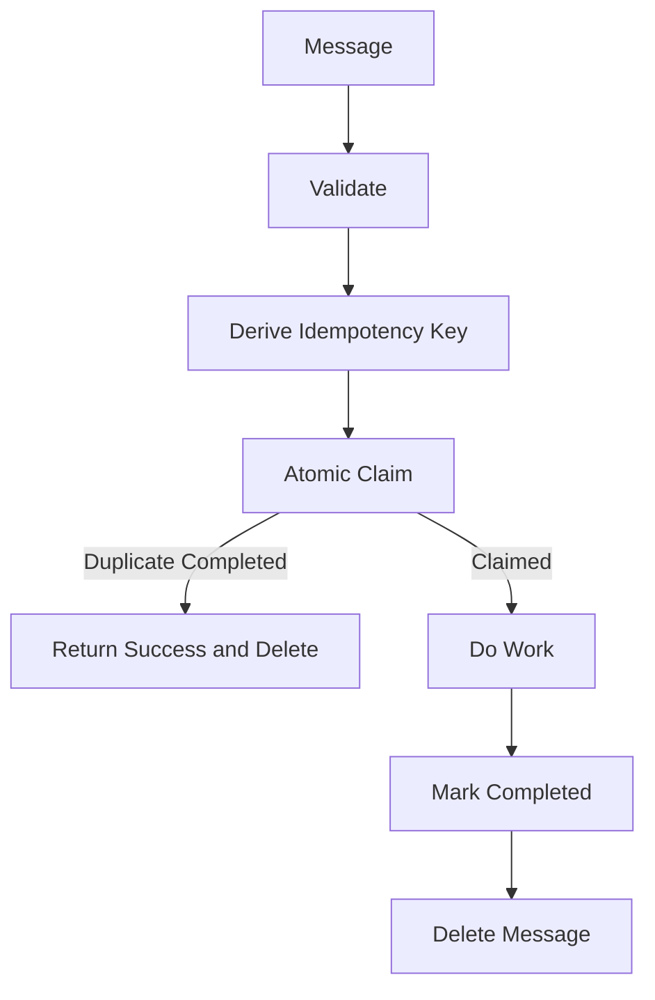
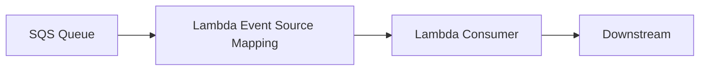
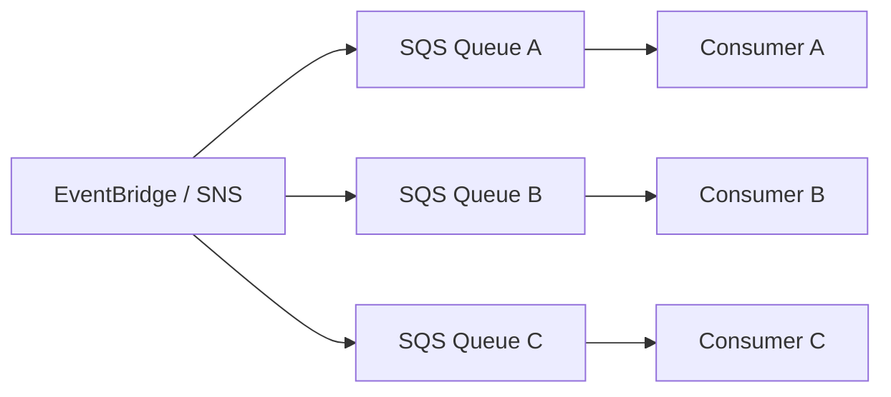

# Part 065 — SQS Backpressure and Worker Patterns

Amazon SQS is not just “a queue.”

In production serverless systems, SQS is a **backpressure boundary**.

It separates:

```txt
producer speed
from
consumer capacity
```

That one separation is why SQS is so important.

Without a queue:

```txt
producer burst -> Lambda burst -> database/API overload
```

With a queue:

```txt
producer burst -> SQS backlog -> controlled consumers -> protected downstream
```



SQS converts overload into backlog.

Backlog is good only if it is visible, bounded, recoverable, and processed by idempotent workers.

---

## 1. SQS Mental Model

SQS is a durable message queue.

It provides:

- decoupling;
- buffering;
- retry via visibility timeout;
- dead-letter queues;
- delayed delivery;
- long polling;
- standard and FIFO modes;
- integration with Lambda event source mapping;
- IAM/resource policy controls;
- server-side encryption;
- per-consumer processing model.

SQS does **not** provide:

- exactly-once business processing;
- automatic idempotency;
- infinite retention;
- global ordering in standard queues;
- automatic poison message understanding;
- downstream capacity awareness;
- business replay correctness;
- schema governance.

You still design the worker.

---

## 2. Standard Queue vs FIFO Queue

SQS has two main queue types.

| Type | Use When | Watch Out |
|---|---|---|
| Standard | high throughput, best-effort ordering, duplicate-tolerant consumers | duplicates and out-of-order delivery possible |
| FIFO | ordering per message group and deduplication window matter | throughput/group design, poison message can block group |

### Standard Queue

Use for:

- independent tasks;
- async jobs;
- fanout consumers;
- email/notification work;
- indexing;
- background processing;
- ingestion buffering;
- high-throughput workloads where order is not a correctness requirement.

Consumer must tolerate:

- duplicate messages;
- out-of-order messages;
- retry after visibility timeout;
- redrive.

### FIFO Queue

Use for:

- per-account ledger;
- per-case state transition;
- per-order lifecycle;
- ordered command stream;
- operations where sequence per aggregate matters.

FIFO uses:

- `MessageGroupId` for ordering boundary;
- `MessageDeduplicationId` for deduplication within the supported deduplication interval.

Do not use one global message group unless you want one-at-a-time processing.

---

## 3. Queue as Contract

A queue has a contract between producer and consumer.

```txt
message schema
message identity
idempotency key
visibility timeout
retention
DLQ policy
max receive count
consumer concurrency
ordering expectation
owner
runbook
```

If these are not explicit, the queue is just a storage bucket for future incidents.

### Queue Contract Example

```yaml
queue: invoice-generation-prod
owner: billing-platform
messageType: InvoiceRequested
schemaVersion: 1.0
idempotencyKey: tenantId + invoiceRequestId
ordering: none
visibilityTimeout: 180s
retention: 4d
dlq: invoice-generation-prod-dlq
maxReceiveCount: 5
consumer: invoice-worker Lambda
consumerMaxConcurrency: 20
downstream: billing-db, pdf-renderer
redriveRunbook: runbooks/invoice-redrive.md
```

---

## 4. Message Design

A good SQS message is a durable work request.

It should contain enough information to process or retrieve the work.

Example:

```json
{
  "schemaVersion": "1.0",
  "messageId": "msg-business-123",
  "correlationId": "corr-456",
  "causationId": "evt-789",
  "tenantId": "tenant-1",
  "operation": "GenerateInvoice",
  "invoiceRequestId": "invreq-123",
  "orderId": "ord-456",
  "requestedAt": "2026-07-06T10:15:30Z"
}
```

### For Large Payloads

Do not put large documents in SQS.

Use references:

```json
{
  "document": {
    "bucket": "case-documents-prod",
    "key": "tenant-1/case-123/evidence.pdf",
    "versionId": "abc",
    "sha256": "..."
  }
}
```

SQS message should describe work, not carry large binary state.

### Do Not Include

- secrets;
- raw credentials;
- full PII-heavy objects unless required and protected;
- giant payloads;
- mutable references without version/checksum;
- random IDs that break idempotency;
- ambiguous `type: update`.

---

## 5. Visibility Timeout

Visibility timeout is the time after a message is received during which it is hidden from other consumers.

If the consumer deletes the message before timeout, processing is complete.

If not, the message becomes visible again and may be processed again.



AWS documents the default queue visibility timeout as 30 seconds and says it should match the time the application needs to process and delete a message.

### Lambda Rule

```txt
SQS visibility timeout > Lambda timeout + cleanup/retry buffer
```

Example:

```txt
Lambda timeout: 60s
Visibility timeout: 180s
```

If visibility timeout is shorter than Lambda timeout, duplicate concurrent processing becomes likely.

### Long Work

If work can legitimately exceed the visibility timeout:

- increase visibility timeout;
- split work into smaller messages;
- use Step Functions;
- use ECS/EKS worker;
- extend visibility timeout deliberately with heartbeat logic if using custom worker;
- avoid single Lambda invocation that hides long workflow.

---

## 6. Message Retention

SQS retains messages for a configured retention period. AWS documents a default retention of 4 days and a configurable range from 60 seconds to 14 days.

Retention is a business decision.

Ask:

```txt
How long can work wait and still be valid?
How long do we need to recover from consumer outage?
How long before backlog becomes harmful?
```

Examples:

| Work | Retention |
|---|---|
| send marketing email | hours/days |
| payment audit write | maximum useful recovery window |
| cache refresh | short |
| case deadline escalation | tied to domain deadline |
| report generation | days maybe acceptable |
| fraud signal | may become stale quickly |

Retention without age alarms is dangerous.

A message can be retained but already useless.

---

## 7. Long Polling

Long polling reduces empty receives by waiting for messages to become available.

For custom consumers, use long polling.

AWS documents the maximum long polling wait time as 20 seconds.

Benefits:

- fewer empty responses;
- lower API cost;
- lower CPU churn for custom pollers;
- more efficient consumers.

For Lambda event source mapping, AWS manages polling. You still tune batch size/window/concurrency rather than manually polling.

---

## 8. Delay Queues and Message Timers

SQS can delay message delivery.

Use delay for:

- retry after a business delay;
- defer work briefly;
- simple cooldown;
- wait for eventual consistency;
- scheduled-ish short delay.

Do not use SQS delay as a full scheduler for arbitrary future tasks with rich scheduling needs. Use EventBridge Scheduler for one-time/recurring schedules when appropriate.

### Delay vs Visibility

| Feature | Meaning |
|---|---|
| delay | message not available after send |
| visibility timeout | received message hidden while being processed |

They solve different problems.

---

## 9. Dead-Letter Queue

An SQS DLQ receives messages that fail processing too many times.

Source queue redrive policy defines:

```txt
maxReceiveCount
deadLetterTargetArn
```

AWS describes DLQs as useful for isolating unconsumed messages and debugging why processing did not succeed.



### DLQ Is Not a Trash Can

A production DLQ needs:

- alarm;
- owner;
- retention;
- encryption;
- sample inspection workflow;
- redrive runbook;
- quarantine classification;
- dashboard;
- access controls.

A DLQ with no alarm is silent data loss with extra steps.

### Max Receive Count

Choose based on failure type.

| Workload | Max Receive Count |
|---|---|
| transient external API | maybe 5–10 |
| validation-heavy poison risk | low |
| expensive side effects | low + strong idempotency |
| eventual consistency delay | enough for expected delay |
| FIFO state transition | careful because poison blocks group |

Too high means poison messages waste time.

Too low means transient failures go to DLQ too early.

---

## 10. Redrive

Redrive moves DLQ messages back for processing.

Redrive is production change.

Before redrive:

1. inspect sample messages;
2. identify failure root cause;
3. deploy fix;
4. verify idempotency;
5. estimate volume;
6. set safe consumer concurrency;
7. redrive small batch;
8. monitor errors/downstream;
9. continue gradually.



Never redrive blindly.

If idempotency is weak, redrive duplicates side effects.

---

## 11. Idempotency

SQS Standard can deliver duplicates. FIFO deduplication is limited to its deduplication window and does not replace business idempotency.

Every side-effecting consumer must be idempotent.

### Idempotency Key

Use business identity:

```txt
operation + tenantId + businessId + version
```

Example:

```txt
GenerateInvoice:tenant-1:invreq-123:v1
```

### Consumer Flow



For Lambda event source mapping, returning success lets Lambda delete the message.

Do not perform side effect before atomic claim.

---

## 12. Poison Message Strategy

A poison message will never succeed without correction.

Examples:

- invalid schema;
- missing business resource;
- unsupported version;
- impossible state transition;
- invalid tenant;
- corrupted S3 reference;
- payload too large;
- data violates invariant.

### Strategy

| Error Type | Action |
|---|---|
| permanent poison | quarantine or let DLQ after low receive count |
| retryable dependency | fail and retry |
| duplicate completed | success/delete |
| idempotency in progress | retry later |
| ambiguous commit | reconcile external side effect |
| unsupported schema | quarantine + producer alert |

Permanent poison should not be retried 100 times.

### Quarantine

For high-volume systems, create a separate poison/quarantine store with:

- original message or reference;
- error code;
- schema version;
- source;
- tenant/resource;
- receive count;
- first/last seen;
- handler version;
- remediation status.

---

## 13. Lambda Consumer Pattern

SQS → Lambda is common.



Key settings:

- batch size;
- batch window;
- function timeout;
- queue visibility timeout;
- reserved concurrency;
- event source maximum concurrency;
- partial batch response;
- DLQ redrive policy.

### Partial Batch Response

Without it:

```txt
one failed record -> whole batch retried
```

With it:

```txt
only failed messages return to queue
```

Use `ReportBatchItemFailures` where appropriate.

### Java Handler Shape

```java
public SQSBatchResponse handleRequest(SQSEvent event, Context context) {
    List<SQSBatchResponse.BatchItemFailure> failures = new ArrayList<>();

    for (SQSEvent.SQSMessage message : event.getRecords()) {
        try {
            processOne(message, context);
        } catch (PermanentMessageException e) {
            quarantine(message, e);
            // durable quarantine means message can be treated as handled
        } catch (RetryableException e) {
            failures.add(new SQSBatchResponse.BatchItemFailure(message.getMessageId()));
        }
    }

    return new SQSBatchResponse(failures);
}
```

---

## 14. Worker Capacity Model

Throughput formula:

```txt
messages_per_second ≈ concurrency × batch_size / batch_duration_seconds
```

Example:

```txt
concurrency = 20
batch size = 10
batch duration = 2s
throughput = 100 msg/s
```

But downstream must be safe for that.

### Downstream Bound

If DB can safely process 50 writes/sec:

```txt
worker throughput <= 50 writes/sec
```

Controls:

- event source maximum concurrency;
- reserved concurrency;
- batch size;
- worker duration;
- rate limit inside handler;
- queue partitioning;
- Step Functions/ECS worker for strict rate control.

### Concurrency as Safety

```txt
maximum consumer concurrency = downstream safe parallelism
```

Do not let the queue drain faster than the downstream can handle.

---

## 15. FIFO Message Group Design

FIFO concurrency depends on active message groups.

### Good Message Group IDs

| Workload | MessageGroupId |
|---|---|
| order lifecycle | orderId |
| account ledger | accountId |
| case workflow | caseId |
| tenant serial operation | tenantId |
| inventory item | sku/warehouse |

### Bad

```txt
MessageGroupId = "global"
```

This serializes the entire queue.

### Group Poison Risk

If one message fails repeatedly, later messages in the same group wait.

Mitigation:

- DLQ;
- lower max receive count for poison-prone transitions;
- idempotent state transition;
- repair workflow;
- careful redrive order.

FIFO gives ordering. It does not give automatic business recovery.

---

## 16. Fanout with SNS or EventBridge to SQS

A strong production pattern:



Benefits:

- each consumer has independent backlog;
- each consumer has own DLQ;
- each consumer controls concurrency;
- one slow consumer does not block others;
- redrive is consumer-specific;
- downstream capacity is protected.

Direct fanout to Lambda is simpler but weaker for heavy/critical consumers.

---

## 17. Queue-per-Consumer Pattern

For event-driven consumers, prefer one queue per consumer or per consumer group.

Bad:

```txt
one shared queue consumed by multiple unrelated services
```

Problems:

- competing consumers steal messages;
- ownership unclear;
- DLQ mixed;
- scaling conflicts;
- message schema conflicts;
- one consumer’s poison messages affect all.

Better:

```txt
orders-event-topic/bus -> queue for search-indexer
orders-event-topic/bus -> queue for audit-writer
orders-event-topic/bus -> queue for notification-sender
```

Each consumer owns its queue.

---

## 18. Security and Access Control

SQS security includes:

- IAM permissions;
- queue resource policy;
- encryption;
- VPC endpoints if private access needed;
- DLQ access;
- redrive permissions;
- producer/consumer role separation.

### Producer Role

Should allow:

```txt
sqs:SendMessage
```

to specific queue.

### Consumer Role

Should allow:

```txt
sqs:ReceiveMessage
sqs:DeleteMessage
sqs:ChangeMessageVisibility
sqs:GetQueueAttributes
```

for specific queue.

### DLQ Role

Operator/redrive role should be separate from app runtime where possible.

### Queue Policy

For SNS/EventBridge sending to SQS, queue policy must allow that source.

Scope with:

- source ARN;
- source account;
- organization where appropriate.

Do not allow all principals to send messages.

---

## 19. Encryption

SQS supports server-side encryption.

Use encryption for:

- sensitive workloads;
- compliance;
- cross-account controls;
- messages with PII/references;
- DLQs with production data.

KMS design questions:

- AWS-managed vs customer-managed key?
- Which producers can encrypt?
- Which consumers can decrypt?
- Which operators can inspect DLQ?
- Does cross-account access work?
- What is KMS call/cost impact?
- Is key policy tested?

Encryption does not remove the need to avoid secrets in message body.

---

## 20. Observability

Minimum queue dashboard:

| Signal | Meaning |
|---|---|
| visible messages | backlog |
| not visible messages | in-flight work |
| age of oldest message | processing lag |
| messages sent/deleted | producer/consumer rate |
| receive count distribution | retry pressure |
| DLQ depth | terminal failure |
| Lambda consumer errors | handler failures |
| Lambda duration | throughput/capacity |
| throttles/concurrency | worker cap |
| downstream latency | bottleneck |
| idempotency duplicate count | duplicate/replay |
| poison message count | producer/schema/data issue |

### Critical Alarms

- age of oldest message above SLO;
- DLQ messages > 0;
- backlog growing for sustained period;
- consumer errors;
- consumer throttles;
- downstream latency spike;
- no messages deleted while messages visible;
- not visible count stuck high;
- redrive started.

SQS backlog is not an incident by itself. Backlog older than your business tolerance is.

---

## 21. Cost Surface

SQS cost drivers include:

- API requests;
- payload size chunks;
- long polling efficiency;
- KMS requests if encrypted with CMK;
- DLQ storage;
- data transfer where applicable;
- Lambda invocations triggered;
- downstream retries;
- observability/logs.

Cost anti-patterns:

- custom pollers with short polling causing empty receives;
- tiny batch size at high volume;
- full payload logging;
- retry storm;
- DLQ ignored for weeks;
- fanout to many queues without retention/cost review.

Long polling and batching often reduce cost.

---

## 22. Runbook: Queue Backlog Rising

Questions:

1. Did producer volume increase?
2. Is Lambda consumer running?
3. Is reserved/max concurrency reached?
4. Did consumer duration increase?
5. Are errors increasing?
6. Is downstream slow?
7. Is DLQ filling?
8. Are poison messages causing retries?
9. Did deployment change?
10. Is backlog still within business SLA?

Actions:

- inspect queue metrics;
- inspect Lambda errors/duration/throttles;
- sample messages;
- inspect downstream latency;
- raise concurrency only if downstream safe;
- reduce batch size if poison/memory issue;
- rollback consumer if deployment regression;
- pause consumer if side effects dangerous;
- redrive after fix.

### Diagnosis Matrix

| Finding | Likely Cause |
|---|---|
| visible messages rising, deletes low | consumer not processing enough |
| errors high | handler/downstream/schema issue |
| duration high | downstream/code regression |
| throttles high | concurrency cap/account |
| DLQ rising | poison/permanent failure |
| not visible high | long processing or stuck consumers |
| oldest age high but visible low | few old poison messages |

---

## 23. Runbook: DLQ Has Messages

Steps:

```txt
1. stop automatic redrive
2. sample messages
3. identify error code/log correlation
4. classify permanent/retryable
5. check producer schema/version
6. check consumer deployment
7. check downstream incident
8. fix cause
9. verify idempotency
10. redrive small batch
11. monitor
```

DLQ messages are evidence. Preserve samples before mass redrive or deletion.

---

## 24. Runbook: Duplicate Side Effects

Questions:

1. Standard or FIFO queue?
2. Was message received multiple times?
3. Did visibility timeout expire before delete?
4. Did Lambda timeout?
5. Was partial batch response missing?
6. Did redrive happen?
7. Is idempotency key stable?
8. Was side effect before idempotency claim?
9. Did external API support idempotency key?

Mitigation:

- stop/cap consumer;
- identify affected business keys;
- reconcile side effects;
- patch idempotency;
- align visibility timeout;
- add partial batch response;
- adjust timeout;
- add duplicate metrics.

---

## 25. Queue Design Checklist

### Contract

- [ ] Message schema/version defined.
- [ ] Idempotency key defined.
- [ ] Producer owner.
- [ ] Consumer owner.
- [ ] Ordering requirement documented.
- [ ] Retention matches recovery/business window.
- [ ] Visibility timeout aligned.
- [ ] DLQ configured.
- [ ] Redrive runbook exists.

### Consumer

- [ ] Partial batch response if Lambda.
- [ ] Permanent vs retryable error classification.
- [ ] Poison message strategy.
- [ ] Durable idempotency.
- [ ] Downstream timeout.
- [ ] Remaining-time guard.
- [ ] Concurrency cap aligned with downstream.

### Operations

- [ ] Queue age alarm.
- [ ] DLQ alarm.
- [ ] Consumer error/throttle alarms.
- [ ] Downstream dashboard.
- [ ] Redrive drill.
- [ ] Access to inspect DLQ controlled.
- [ ] Cost metrics reviewed.

### Security

- [ ] Queue policy scoped.
- [ ] Producer/consumer IAM separated.
- [ ] Encryption configured as needed.
- [ ] No secrets in messages.
- [ ] VPC endpoint considered for private access.
- [ ] Cross-account permissions reviewed.

---

## 26. Common Anti-Patterns

### Anti-Pattern 1 — Queue Without DLQ

Failed messages retry forever or disappear through operator deletion.

### Anti-Pattern 2 — DLQ Without Alarm

Terminal failures are stored but nobody reacts.

### Anti-Pattern 3 — Visibility Timeout Too Short

Same message processed concurrently.

### Anti-Pattern 4 — No Idempotency

Retries/redrive duplicate side effects.

### Anti-Pattern 5 — One Queue for Many Unrelated Consumers

Ownership and scaling conflict.

### Anti-Pattern 6 — Raising Concurrency During Downstream Outage

Backlog drains into a broken dependency and worsens incident.

### Anti-Pattern 7 — FIFO Global Message Group

System becomes single-threaded.

### Anti-Pattern 8 — Large Payloads in Queue

Memory/cost/limit/retry problems.

### Anti-Pattern 9 — Queue Used as Scheduler for Complex Future Tasks

Use EventBridge Scheduler or Step Functions where richer scheduling is needed.

### Anti-Pattern 10 — Redrive Without Root Cause

Replays the incident.

---

## 27. Final Mental Model

SQS is a pressure valve.

It lets producers move fast while consumers move safely.

But a queue is only safe if you define:

```txt
visibility timeout
retention
DLQ
redrive
idempotency
consumer concurrency
message schema
poison strategy
observability
downstream capacity
```

A top-tier engineer does not ask:

> “Should we add a queue?”

They ask:

> “Where do we need backpressure, how old can work become, how do retries stay safe, and what is the maximum rate our consumer may apply to the downstream system?”

That is SQS engineering.

---

## References

- Amazon SQS Developer Guide: standard and FIFO queues
- Amazon SQS Developer Guide: visibility timeout
- Amazon SQS Developer Guide: dead-letter queues
- Amazon SQS Developer Guide: long polling
- Amazon SQS Developer Guide: message retention
- AWS Lambda Developer Guide: using Lambda with Amazon SQS
- AWS Lambda Developer Guide: SQS event source mapping scaling and partial batch responses
