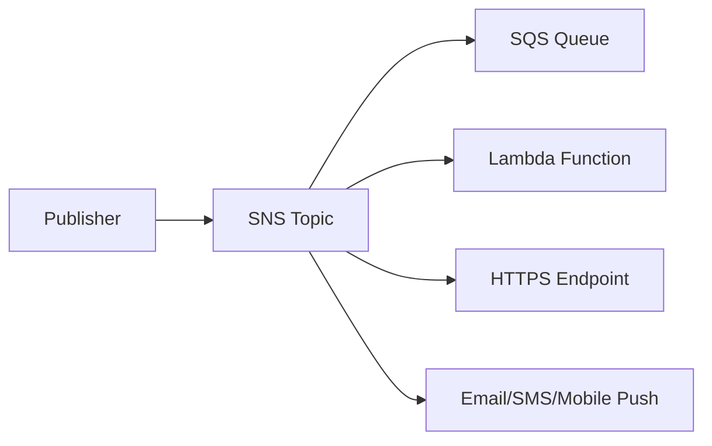
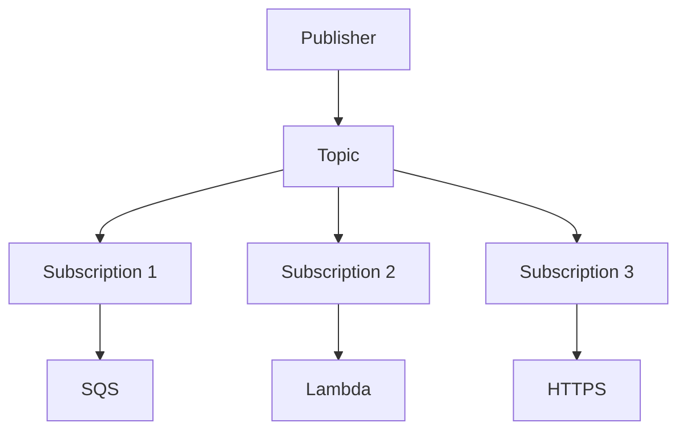
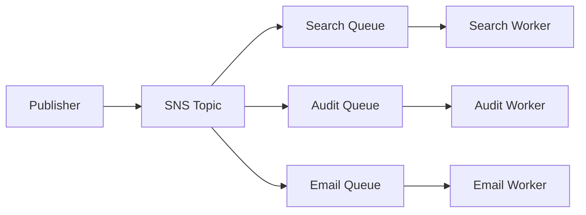
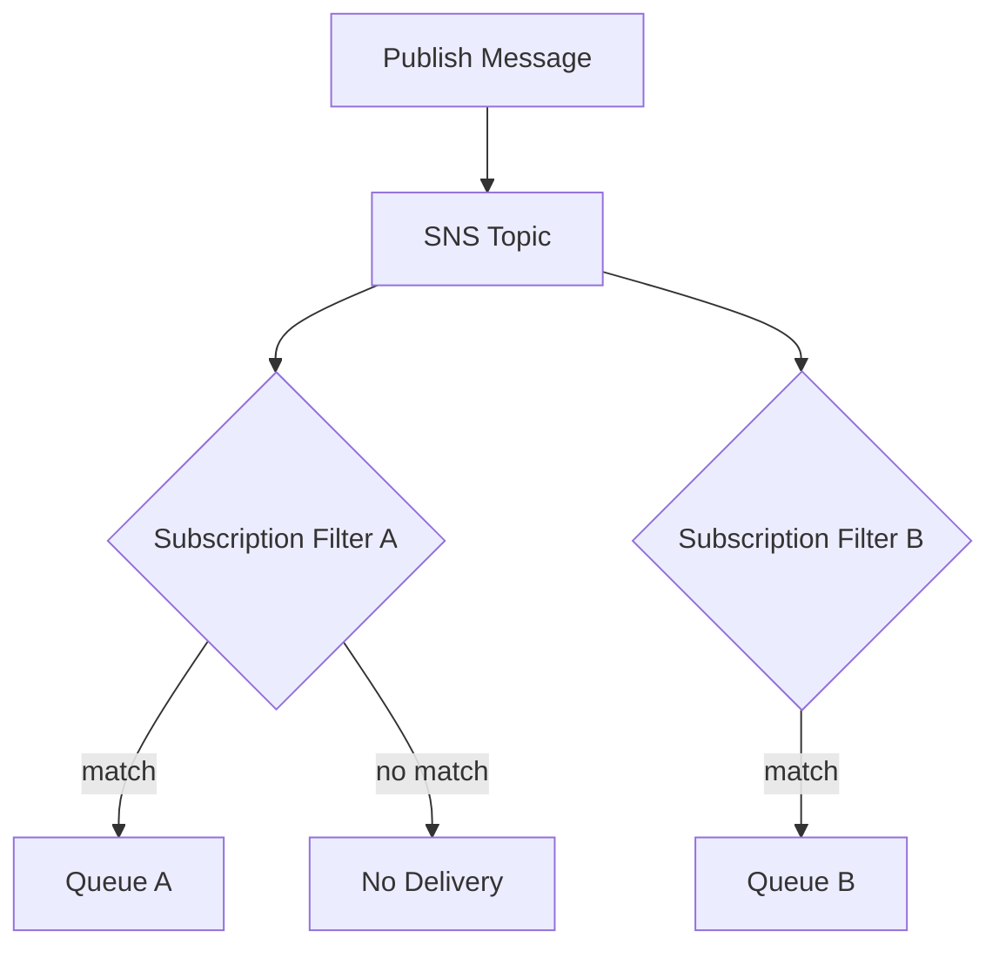
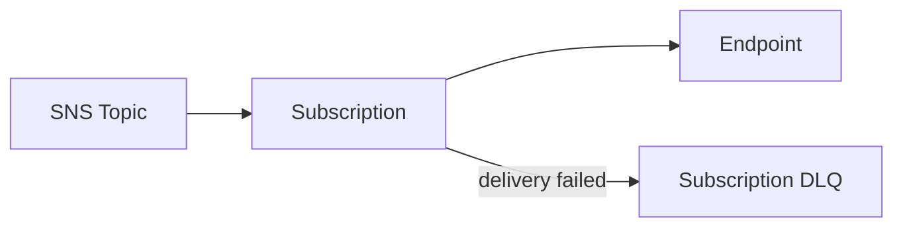
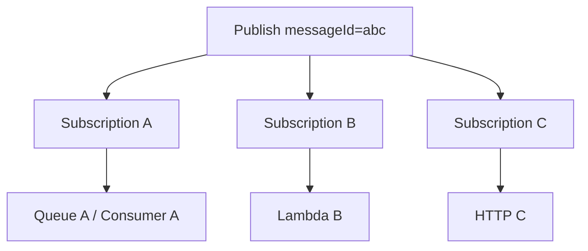
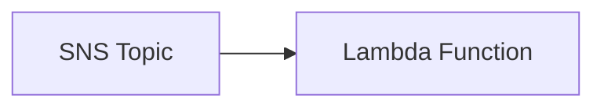
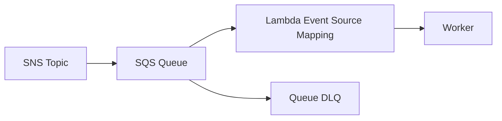
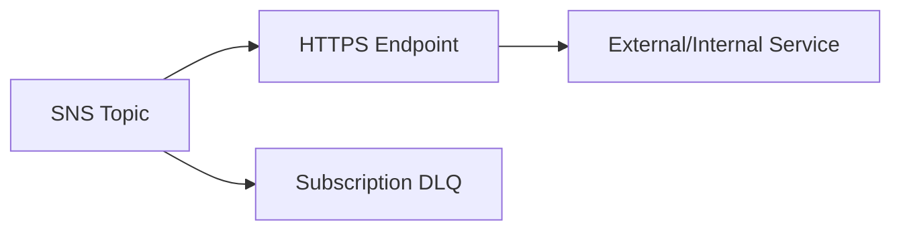

# Part 066 — SNS Fanout and Pub/Sub Patterns

Amazon SNS is a push-based pub/sub service.

Its core value is fanout:

```txt
one publish -> many subscriptions
```



SNS is excellent when multiple subscribers should receive the same message independently.

It is dangerous when teams confuse fanout with durable per-consumer backpressure.

The production distinction:

```txt
SNS fans out.
SQS buffers.
Lambda computes.
Step Functions coordinates.
EventBridge routes by event pattern.
```

SNS is a delivery fanout primitive, not a full workflow engine.

---

## 1. SNS Mental Model

SNS has:

- topic;
- publisher;
- subscription;
- protocol endpoint;
- message;
- message attributes;
- filter policy;
- delivery policy;
- dead-letter queue per subscription;
- standard and FIFO topic modes;
- access policy;
- encryption;
- delivery status logging.



The topic does not guarantee that every subscriber processes successfully.

Each subscription endpoint has its own delivery behavior and failure handling.

---

## 2. When to Use SNS

Use SNS when:

- multiple subscribers need the same notification;
- push delivery is desired;
- subscriber protocols differ;
- simple pub/sub fanout is enough;
- mobile/SMS/email notification is needed;
- SQS queues should each receive a copy;
- notification semantics are simpler than EventBridge routing;
- low-latency fanout matters.

Use EventBridge when:

- event pattern routing by source/detail/body is central;
- many-source-many-target domain event bus is needed;
- archive/replay is important;
- cross-account event bus governance is needed;
- schema registry/event bus model matters.

Use SQS when:

- one consumer group needs durable backlog;
- worker pace must be controlled;
- DLQ/redrive/backpressure is central.

Use Step Functions when:

- multi-step business process needs orchestration.

---

## 3. SNS Topic Types

SNS supports standard and FIFO topics.

### Standard Topic

Good for:

- high-throughput fanout;
- notifications;
- independent consumers;
- no strict ordering requirement;
- consumers that are idempotent.

Consumers must tolerate duplicates and ordering differences.

### FIFO Topic

Good for:

- ordered fanout to SQS queues;
- message group ordering;
- deduplication within the supported deduplication interval;
- near-real-time consistency patterns where order matters.

AWS documents that SNS FIFO topics support delivery to both SQS standard and FIFO queues.

### Topic Choice

| Need | Topic Type |
|---|---|
| high-throughput notification | standard |
| ordered per aggregate fanout to queues | FIFO |
| mobile push/email/SMS | standard |
| strict group ordering with SQS FIFO subscribers | FIFO |
| general domain event routing with archive/replay | often EventBridge |

Do not use FIFO just because it sounds safer. It introduces throughput and group design constraints.

---

## 4. SNS and SQS Fanout

The most production-friendly SNS pattern is:

```txt
SNS topic -> SQS queue per consumer -> consumer worker
```



Benefits:

- each consumer gets its own copy;
- each consumer has independent backlog;
- each consumer has independent DLQ;
- each consumer controls concurrency;
- one slow consumer does not block others;
- redrive is consumer-specific;
- Lambda direct delivery is not forced;
- downstream systems are protected.

### Why Not SNS Direct to Lambda?

SNS direct to Lambda is fine for lightweight, idempotent work.

But for heavy or critical consumers, direct delivery lacks explicit backlog and consumer-specific pace control.

Preferred for production-heavy work:

```txt
SNS -> SQS -> Lambda
```

---

## 5. SNS vs EventBridge Fanout

Both can fan out, but mental model differs.

| Need | SNS | EventBridge |
|---|---|---|
| simple topic pub/sub | strong | okay |
| protocol fanout email/SMS/mobile | strong | not primary |
| message attribute/body filtering | strong | event pattern filtering |
| event bus archive/replay | not primary | strong |
| many-source domain routing | okay but less expressive | strong |
| point notification to many endpoints | strong | okay |
| SaaS/API destination routing | possible through HTTPS | API destinations richer |
| schema/event governance | manual | more native ecosystem |
| SQS per subscriber pattern | strong | strong |

Common guidance:

- SNS for notification fanout.
- EventBridge for domain event routing.
- SQS for buffering.
- Combine them when needed.

---

## 6. Message Attributes and Filtering

SNS message filtering lets subscribers receive only messages matching a subscription filter policy.

AWS documents that by default a subscriber receives every message; adding a filter policy lets the subscription receive only matching messages.

Filter policies can apply to:

- message attributes;
- message body.

The subscription attribute `FilterPolicyScope` controls this.



### Attribute-Based Filtering

Message:

```json
{
  "Message": "...",
  "MessageAttributes": {
    "eventType": { "DataType": "String", "StringValue": "OrderCreated" },
    "tenantClass": { "DataType": "String", "StringValue": "enterprise" }
  }
}
```

Filter:

```json
{
  "eventType": ["OrderCreated"],
  "tenantClass": ["enterprise"]
}
```

### Body-Based Filtering

If the message body is JSON, filter policy can target body fields when `FilterPolicyScope` is `MessageBody`.

Use when:

- filtering on nested payload;
- publisher cannot/should not duplicate attributes;
- payload shape is stable.

### Filtering Rule

Filtering reduces delivery noise. It does not replace consumer validation or authorization.

---

## 7. Filter Policy Design

Good filter policy:

```json
{
  "eventType": ["PaymentCaptured"],
  "schemaVersion": ["1.0", "1.1"],
  "tenantClass": ["regulated"]
}
```

Bad filter policy:

```json
{
  "eventType": [{ "prefix": "" }]
}
```

### Filter Design Questions

- Is this subscription intended to receive all messages?
- Are schema versions included?
- Are attributes always present?
- Are string comparisons case-sensitive?
- Is body filtering relying on stable JSON?
- Is filtering eventually consistent after policy update?
- Does consumer still validate?
- Is there an alarm if expected messages disappear?

### Filter Policy Drift

A changed filter can silently stop delivery.

Treat filter policy changes like production routing changes:

- review;
- test with sample messages;
- deploy through IaC;
- monitor delivered messages.

---

## 8. Delivery Semantics

SNS delivery behavior depends on endpoint protocol.

Endpoints include:

- SQS;
- Lambda;
- HTTP/S;
- email;
- SMS;
- mobile push;
- Firehose.

### SQS Endpoint

SNS publishes a copy to the queue.

Good for:

- durable subscriber backlog;
- consumer pacing;
- DLQ/redrive on queue side;
- decoupled worker.

### Lambda Endpoint

SNS invokes Lambda asynchronously.

Good for:

- lightweight handlers;
- immediate fanout compute;
- simple notifications.

Requires:

- idempotency;
- Lambda failure handling;
- function concurrency protection.

### HTTP/S Endpoint

SNS sends HTTP request.

Requires:

- endpoint confirmation;
- auth strategy;
- retries;
- idempotency;
- delivery policy;
- DLQ;
- rate limit protection;
- TLS/security review.

AWS documents HTTP/S retry policies and considers HTTP 5xx and 429 retryable for SNS HTTP/S delivery.

---

## 9. Subscription DLQ

SNS supports dead-letter queues for subscriptions. AWS documents that an SNS subscription can target an SQS queue as a DLQ for messages that cannot be delivered successfully.

This is subscription-level failure capture.



Use subscription DLQ for:

- HTTP endpoint unavailable;
- Lambda delivery failure;
- SQS endpoint permission issue;
- delivery exhaustion;
- operational inspection.

### DLQ Must Include

- alarm;
- owner;
- runbook;
- retention;
- encryption;
- redrive/replay process;
- sample inspection process.

### Important

SNS DLQ captures delivery failure to subscriber endpoint.

If SNS successfully delivers to SQS, but the SQS consumer later fails, that is the SQS queue’s DLQ responsibility.

There can be two failure boundaries:

```txt
SNS -> SQS delivery
SQS -> consumer processing
```

Do not confuse them.

---

## 10. Delivery Retry Policies

SNS retries delivery failures depending endpoint type.

For HTTP/S, AWS documents customizable delivery policies with phases such as immediate/no-delay, pre-backoff, backoff, and post-backoff. For server-side errors to AWS-managed endpoints like SQS and Lambda, AWS documentation describes long retry behavior over many attempts/days.

### Design Questions

- Is endpoint failure transient?
- Can endpoint handle retry bursts?
- Is delivery idempotent?
- Is there a DLQ?
- Should HTTP endpoint use backoff?
- What status codes are retryable?
- What happens after final failure?
- Is duplicate delivery safe?

### HTTP Endpoint Rule

Every HTTP subscriber must be idempotent.

SNS can retry when it does not receive success.

The endpoint may have processed the message but failed before responding.

---

## 11. Raw Message Delivery

For SQS and HTTP/S subscriptions, SNS can deliver either:

- SNS envelope containing metadata;
- raw message delivery, where only the message body is delivered.

### Envelope Delivery

Includes metadata like:

- topic ARN;
- message ID;
- timestamp;
- signature fields for HTTP;
- message attributes.

Good for:

- audit;
- source validation;
- tracing;
- debugging.

### Raw Delivery

Good for:

- consumers expecting original message shape;
- simpler SQS message body;
- avoiding nested JSON.

Trade-off:

- less SNS metadata in body;
- attributes handling differs by protocol;
- debugging may be harder if metadata not preserved elsewhere.

Choose deliberately.

---

## 12. SNS FIFO Design

SNS FIFO topics support message group and deduplication concepts.

Use for:

- ordered fanout to SQS FIFO queues;
- per-aggregate ordering;
- deduplication within window;
- event propagation where order matters.

Design:

```txt
MessageGroupId = aggregateId
MessageDeduplicationId = business event id
```

Example:

```txt
MessageGroupId = case-123
MessageDeduplicationId = CaseEscalated:case-123:version-17
```

### FIFO Warning

Deduplication window does not replace durable consumer idempotency.

If event is replayed after deduplication window, duplicate can still be delivered.

Consumers still dedupe by business event ID.

### Message Group Hotspot

If one group receives all messages, throughput is limited.

Partition groups by aggregate.

---

## 13. Mobile, SMS, and Email Notifications

SNS can send user notifications through channels like SMS, email, and mobile push.

Use for:

- operational alerts;
- transactional notifications;
- mobile push;
- simple email/SMS delivery;
- fanout to humans/systems.

Be careful with:

- compliance/consent;
- regional SMS rules;
- opt-out behavior;
- cost;
- delivery status;
- rate limits;
- PII;
- localization;
- retry semantics;
- duplicate user-visible notifications;
- audit of sent messages.

For complex product email, use purpose-built email systems or SES workflows where needed.

SNS notification delivery is not a full customer communication platform.

---

## 14. SNS Access Control

SNS security includes:

- topic policy;
- IAM publish/subscribe permissions;
- subscription confirmation;
- encryption;
- KMS key policy;
- cross-account permissions;
- endpoint policy for SQS queues;
- HTTPS endpoint auth/signature validation;
- VPC endpoints if private access needed.

### Publisher Permission

Allow:

```txt
sns:Publish
```

to specific topic ARN.

### Subscription Permission

Control who can:

- subscribe;
- unsubscribe;
- set attributes;
- change filter policy;
- change DLQ;
- publish;
- delete topic.

### Topic Policy

For cross-account publish, scope:

- principal;
- source account/org;
- condition keys;
- topic ARN.

### SNS to SQS Policy

SQS queue policy must allow SNS topic to send messages.

Use source ARN condition.

---

## 15. Encryption

SNS supports server-side encryption for topics.

Design questions:

- AWS-managed or customer-managed KMS?
- Which publishers can encrypt?
- Which SNS service principal/access path needs key permissions?
- Which subscribers receive encrypted/decrypted flow?
- Are SQS queues also encrypted?
- Are DLQs encrypted?
- Is cross-account KMS policy correct?
- What is KMS cost/throttle impact?

Do not put secrets in messages just because topic is encrypted.

Encryption at rest does not protect data copied into logs, endpoints, or external systems.

---

## 16. Observability

SNS observability should include:

### Topic Metrics

- messages published;
- publish failures;
- message size;
- delivery attempts;
- delivery failures;
- filtered-out messages;
- delivery latency where available;
- SMS/mobile/email specific failures if used.

### Subscription Metrics

- delivered messages;
- failed notifications;
- DLQ messages;
- filter match rate;
- endpoint errors;
- HTTP response codes;
- Lambda errors/throttles if direct;
- SQS queue depth if SQS subscriber.

### Logs

For HTTP/S, delivery status logging can send SNS delivery status logs to CloudWatch Logs.

Log correlation fields:

```txt
snsMessageId
topicArn
subscriptionArn
eventId
correlationId
tenantId
targetEndpoint
deliveryStatus
```

### Critical Alarms

- publish failure;
- subscription DLQ depth > 0;
- HTTP endpoint failure rate;
- Lambda subscription errors/throttles;
- SQS subscriber age/backlog;
- unexpected filter drop rate;
- SMS spend/delivery anomalies.

---

## 17. Fanout Observability

For fanout, a single message has many delivery paths.



You must be able to answer:

- was message published?
- which subscriptions matched?
- which endpoints received it?
- which delivery failed?
- which consumer processed it?
- which DLQ contains it?
- did one subscriber lag?
- did any subscriber duplicate side effects?

This requires correlation IDs inside the message, not only SNS message ID.

---

## 18. SNS + Lambda Direct Pattern



Use when:

- handler is lightweight;
- failure policy is clear;
- duplicate processing is safe;
- no explicit backlog needed;
- concurrency is protected;
- function has async failure destination if needed.

Risk:

- SNS fanout can invoke Lambda rapidly;
- Lambda throttling/error behavior must be monitored;
- no per-consumer queue depth;
- downstream pressure can spike;
- redrive is less clear than SQS queue.

For critical processing, prefer:

```txt
SNS -> SQS -> Lambda
```

---

## 19. SNS + SQS + Lambda Pattern



Use when:

- work is important;
- processing may fail;
- downstream must be protected;
- backlog must be visible;
- redrive is needed;
- each subscriber should scale independently.

This is the default robust fanout pattern.

### Required Controls

- SNS subscription DLQ for delivery to SQS if needed;
- SQS queue DLQ for processing failure;
- queue policy allowing topic;
- Lambda partial batch response;
- event source maximum concurrency;
- idempotent worker;
- queue age alarms;
- DLQ alarms.

---

## 20. SNS to HTTP/S Pattern



Use when:

- external webhook integration;
- internal service expects push;
- subscriber cannot poll queue.

Requirements:

- endpoint confirmation;
- signature validation;
- auth/authorization;
- idempotency;
- retry policy;
- rate limit;
- DLQ;
- TLS;
- payload minimization;
- observability.

### HTTP/S Retry Handling

If endpoint processes message but returns 500/timeout, SNS may retry.

Endpoint must treat message ID/business event ID idempotently.

---

## 21. SNS vs EventBridge With Filters

SNS filter policies and EventBridge event patterns overlap conceptually.

SNS filtering is subscription-level pub/sub filtering.

EventBridge patterns are rule-level event routing.

### Use SNS Filtering When

- topic fanout is central;
- subscribers need subsets;
- attributes/body fields are simple;
- protocols include SQS/Lambda/HTTP/email/mobile;
- no bus archive/replay requirement.

### Use EventBridge Patterns When

- event bus routing is central;
- source/detail-type taxonomy matters;
- cross-account event routing and archive/replay matter;
- targets are AWS service integrations;
- event governance/schema registry fits better.

SNS can be simpler.

EventBridge can be more expressive for domain event routing.

---

## 22. Message Contract

An SNS message should have:

```json
{
  "schemaVersion": "1.0",
  "eventId": "evt-123",
  "eventType": "OrderCreated",
  "correlationId": "corr-456",
  "tenantId": "tenant-1",
  "occurredAt": "2026-07-06T10:15:30Z",
  "data": {
    "orderId": "ord-789"
  }
}
```

Message attributes:

```json
{
  "eventType": "OrderCreated",
  "schemaVersion": "1.0",
  "tenantClass": "enterprise"
}
```

Use attributes for filtering.

Use body for business payload.

Avoid duplicating too much, but keep filter-relevant fields stable.

---

## 23. Runbook: Subscription DLQ Has Messages

Questions:

1. Which topic and subscription?
2. Which endpoint protocol?
3. What delivery error?
4. Was endpoint unavailable or permission denied?
5. Did filter change?
6. Did endpoint auth fail?
7. Did Lambda throttle?
8. Did SQS queue policy reject topic?
9. Is message still valid?
10. Is redelivery safe?

Actions:

- sample DLQ message;
- inspect delivery status logs;
- fix endpoint/permission;
- verify idempotency;
- replay/redrive through controlled path;
- add guardrail if policy/config drift caused failure.

---

## 24. Runbook: Subscriber Did Not Receive Message

Questions:

1. Did publisher successfully publish?
2. Was topic ARN correct?
3. Did subscription exist and confirm?
4. Did filter policy match?
5. Was message attribute/body field present?
6. Did raw delivery change shape?
7. Did endpoint fail and message go to DLQ?
8. Is cross-account policy correct?
9. Was subscriber looking in wrong environment?
10. Is delivery delayed/retrying?

Evidence:

```bash
aws sns list-subscriptions-by-topic --topic-arn "$TOPIC_ARN"
aws sns get-subscription-attributes --subscription-arn "$SUB_ARN"
aws sns get-topic-attributes --topic-arn "$TOPIC_ARN"
```

---

## 25. Runbook: Duplicate Notification

Questions:

1. Was message published twice?
2. Did SNS retry delivery?
3. Did endpoint timeout after processing?
4. Was DLQ redriven?
5. Did SQS visibility timeout expire?
6. Was idempotency key stable?
7. Is FIFO dedup window misunderstood?
8. Did mobile/email provider retry?

Mitigation:

- use business event ID;
- make endpoint idempotent;
- send provider idempotency key if supported;
- avoid user-visible duplicate send;
- reconcile affected recipients;
- add duplicate metrics.

---

## 26. Production Checklist

### Topic

- [ ] Topic type standard/FIFO justified.
- [ ] Owner defined.
- [ ] Encryption configured if needed.
- [ ] Topic policy scoped.
- [ ] Publish permissions least privilege.
- [ ] Message schema documented.
- [ ] Message attributes documented.
- [ ] No secrets in payload.

### Subscriptions

- [ ] Each subscription has owner.
- [ ] Filter policy reviewed.
- [ ] Filter policy scope correct.
- [ ] Subscription DLQ configured for critical endpoints.
- [ ] Endpoint permissions verified.
- [ ] Raw message delivery decision documented.
- [ ] Delivery status logging enabled where useful.

### Consumers

- [ ] Idempotency implemented.
- [ ] Duplicate delivery safe.
- [ ] Downstream capacity protected.
- [ ] SQS queue per critical consumer.
- [ ] Lambda direct subscriptions concurrency-limited.
- [ ] HTTP endpoints validate SNS signature/auth.
- [ ] DLQ/redrive runbook exists.

### Observability

- [ ] Publish failure alarm.
- [ ] Subscription DLQ alarm.
- [ ] Filter drop visibility.
- [ ] SQS backlog alarms for queue subscribers.
- [ ] Lambda errors/throttles for direct subscribers.
- [ ] HTTP delivery status logs/alarms.
- [ ] Correlation ID in every message.

---

## 27. Common Anti-Patterns

### Anti-Pattern 1 — SNS Direct to Heavy Lambda

No explicit backlog; downstream can be overloaded.

### Anti-Pattern 2 — No Subscription DLQ

Delivery failures vanish into metrics nobody watches.

### Anti-Pattern 3 — Filter Policy Drift

Subscriber stops receiving messages silently.

### Anti-Pattern 4 — No Business Event ID

Duplicates cannot be deduped.

### Anti-Pattern 5 — User Notifications Not Idempotent

Customer receives duplicate email/SMS/push.

### Anti-Pattern 6 — Raw Delivery Changed Without Consumer Contract

Consumers break because envelope shape changes.

### Anti-Pattern 7 — Topic Policy Too Broad

Unexpected publishers inject messages.

### Anti-Pattern 8 — FIFO Dedup Treated as Permanent Dedup

Deduplication window is not durable idempotency.

### Anti-Pattern 9 — Full Domain Event Sent to External HTTPS Endpoint

Data leakage and partner coupling.

### Anti-Pattern 10 — One Topic for Everything

Topic loses meaning; filtering becomes complex and brittle.

---

## 28. Final Mental Model

SNS is the fanout layer.

It answers:

```txt
when publisher sends one message to this topic,
which subscriptions should receive a copy?
```

It does not answer:

- how each consumer processes safely;
- how downstream is protected;
- how duplicates are handled forever;
- how business workflows are coordinated;
- how event schemas evolve;
- how critical backlog is redriven.

For production:

```txt
SNS topic for fanout
SQS per critical consumer for buffering
Lambda/ECS/EKS workers for processing
DLQ and idempotency for failure safety
observability for every subscription path
```

A top-tier engineer does not ask:

> “Can SNS send to Lambda?”

They ask:

> “Which subscribers need independent durability and backpressure, what happens when one delivery path fails, and how do we avoid duplicate user-visible side effects?”

That is SNS engineering.

---

## References

- Amazon SNS Developer Guide: what is Amazon SNS
- Amazon SNS Developer Guide: message filtering and filter policies
- Amazon SNS Developer Guide: subscription filter policy scope
- Amazon SNS Developer Guide: dead-letter queues
- Amazon SNS Developer Guide: message delivery retries
- Amazon SNS Developer Guide: FIFO topics and message delivery
- Amazon SQS Developer Guide: using SQS with SNS fanout patterns
