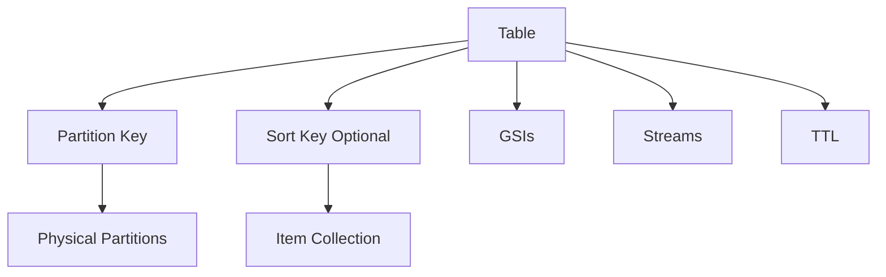
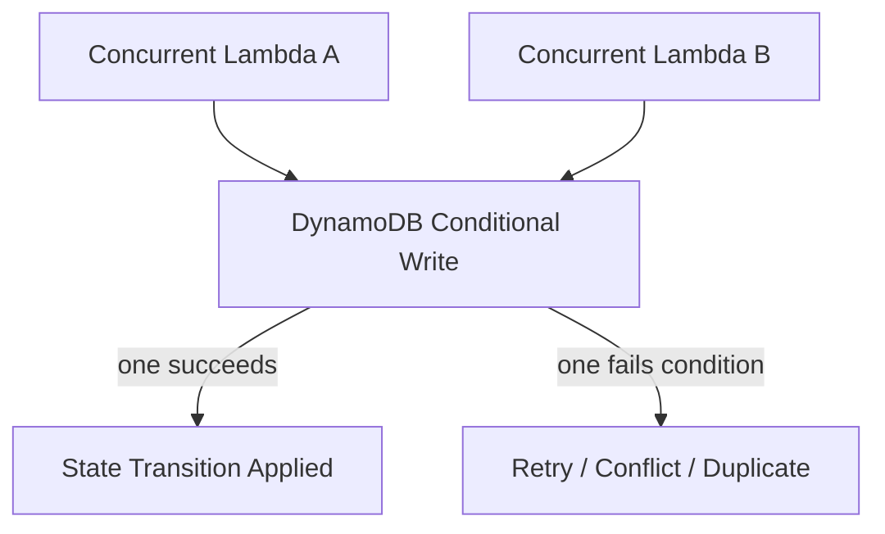
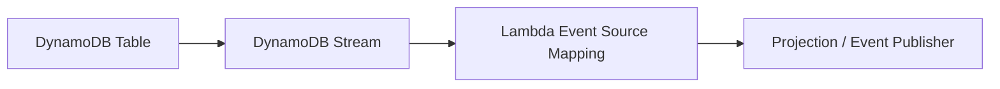

# Part 067 — DynamoDB Serverless State and Idempotency

Serverless architecture still needs state.

Lambda is stateless at the runtime boundary, but your system is not stateless. Orders, payments, cases, idempotency records, workflow status, outbox events, rate limits, tenant quotas, projection checkpoints, and audit references all need durable state.

DynamoDB is one of the most important state stores in AWS serverless systems because it is:

- fully managed;
- low-latency at scale when modeled correctly;
- API-native;
- event-driven through Streams;
- strong for conditional writes;
- useful for idempotency;
- useful for optimistic concurrency;
- useful for serverless counters/locks/leases when designed carefully;
- integrated with Lambda, Step Functions, EventBridge, IAM, KMS, CloudWatch, and global tables.

But DynamoDB is not “SQL without joins.”

A weak DynamoDB design says:

> “Create table with id, then query however we want later.”

A production DynamoDB design says:

> “Define access patterns first, choose partition/sort keys to distribute load and satisfy queries, use conditional writes for correctness, model duplication deliberately, and monitor hot keys/throttling before they become incidents.”

DynamoDB rewards intentional modeling.

It punishes relational thinking disguised as NoSQL.

---

## 1. DynamoDB Mental Model

DynamoDB stores items in tables. A table has a primary key:

- partition key only; or
- partition key + sort key.

The partition key determines data distribution.

The sort key orders items within the same partition key.



DynamoDB is built around predictable key-value and query access.

The primary question is not:

```txt
What entities do I have?
```

The primary question is:

```txt
What access patterns must be fast, safe, and scalable?
```

---

## 2. Access-Pattern-First Design

Start with queries and writes.

Example domain: case management.

Access patterns:

```txt
1. Get case by caseId.
2. List cases by tenant and status.
3. List open cases assigned to investigator.
4. Append case event if expected version matches.
5. Get latest case state.
6. Check idempotency for commandId.
7. Query deadlines due before timestamp.
8. Publish outbox events.
```

Only after access patterns are known do you design keys.

### Bad Modeling Flow

```txt
entities -> tables -> columns -> hope queries work
```

### Good Modeling Flow

```txt
user/system actions -> access patterns -> keys/indexes -> item shapes -> capacity/cost -> invariants
```

### Access Pattern Table

| Access Pattern | Key/Index |
|---|---|
| get case by ID | `PK=CASE#<caseId>`, `SK=METADATA` |
| events by case | `PK=CASE#<caseId>`, `SK=EVENT#<version>` |
| cases by tenant/status | GSI `GSI1PK=TENANT#<tenantId>#STATUS#<status>`, `GSI1SK=updatedAt#caseId` |
| cases by assignee | GSI `GSI2PK=ASSIGNEE#<userId>`, `GSI2SK=status#deadline#caseId` |
| idempotency | `PK=IDEMPOTENCY#<key>`, `SK=RECORD` |
| deadline queue | GSI `GSI3PK=DEADLINE#<bucket>`, `GSI3SK=dueAt#caseId` |

This is how DynamoDB table design begins.

---

## 3. Partition Key Design

DynamoDB performance depends heavily on partition key distribution.

A good partition key:

- has high cardinality;
- distributes write/read load;
- matches primary access pattern;
- avoids unbounded hot keys;
- avoids one tenant/account/global key receiving all traffic;
- supports item collection size constraints if using sort key;
- aligns with aggregate/concurrency boundary.

### Good Partition Keys

```txt
ORDER#ord-123
CASE#case-456
IDEMPOTENCY#tenant-1:CapturePayment:pay-123:v1
TENANT#tenant-1#BUCKET#2026-07-06T10
USER#user-789
```

### Risky Partition Keys

```txt
STATUS#OPEN
TENANT#big-tenant
DATE#2026-07-06
GLOBAL
TYPE#OrderCreated
```

These may concentrate traffic.

### Hot Key Risk

A hot partition key happens when too much traffic targets the same logical key.

Examples:

- all writes use `PK=COUNTER#GLOBAL`;
- all due jobs query `PK=DUE#TODAY`;
- one enterprise tenant sends 80% of traffic to `PK=TENANT#x`;
- all events of one mega-aggregate use one partition;
- a GSI partitions by low-cardinality status like `OPEN`.

DynamoDB adaptive capacity helps, but it is not permission to design hot keys casually.

---

## 4. Sort Key Design

Sort key gives ordered access inside a partition key.

Use it for:

- time-ordered events;
- versioned records;
- entity type grouping;
- prefix queries;
- composite ordering;
- hierarchy;
- timeline;
- state snapshots.

Examples:

```txt
SK=METADATA
SK=EVENT#0000000017
SK=STATE#CURRENT
SK=AUDIT#2026-07-06T10:15:30Z#evt-123
SK=DEADLINE#2026-07-10T09:00:00Z
```

### Query Patterns

With sort key, you can query:

```txt
PK = CASE#case-123 AND begins_with(SK, EVENT#)
PK = CASE#case-123 AND SK BETWEEN EVENT#0000000010 AND EVENT#0000000020
PK = TENANT#tenant-1 AND begins_with(SK, CASE#OPEN#)
```

Sort key is not an afterthought. It is the timeline/index inside an aggregate boundary.

---

## 5. Single-Table vs Multi-Table

DynamoDB supports both.

### Single-Table Design

One table stores many entity types.

Pros:

- efficient multi-entity access patterns;
- fewer tables;
- transactional item collections;
- common stream/outbox pattern;
- fewer operational resources;
- powerful when access patterns are known.

Cons:

- modeling complexity;
- harder onboarding;
- shared capacity/cost visibility;
- schema discipline required;
- GSI overload can become confusing;
- governance burden.

### Multi-Table Design

Separate tables per entity/purpose.

Pros:

- simpler mental model;
- clearer ownership;
- separate capacity/cost;
- easier security boundaries;
- easier local reasoning.

Cons:

- more resources;
- cross-table transactions if aggregate spans tables;
- more stream consumers;
- duplicated patterns;
- harder multi-entity query.

### Practical Rule

Use single-table when:

- access patterns benefit from co-location;
- team has DynamoDB modeling maturity;
- aggregate/event patterns are clear;
- shared operational model is acceptable.

Use multi-table when:

- domain boundaries are separate;
- table ownership/security differs;
- queries do not need co-location;
- simplicity is more valuable;
- team is still building DynamoDB skill.

Top-tier design is not dogmatic. It is pattern-fit.

---

## 6. Conditional Writes

Conditional writes are a major reason DynamoDB is powerful for serverless correctness.

They allow an update only if a condition is true.

Examples:

- create item only if it does not exist;
- update state only if current version matches;
- claim idempotency key only if missing;
- acquire lock only if expired;
- append event only if aggregate version matches;
- enforce uniqueness.

### Idempotent Create

```txt
PutItem
ConditionExpression: attribute_not_exists(PK)
```

This means:

```txt
create only if the item does not already exist
```

### Optimistic Update

```txt
UpdateItem
ConditionExpression: version = :expectedVersion
SET version = version + 1, status = :newStatus
```

This means:

```txt
apply transition only if nobody else changed the item since caller read it
```

### Why This Matters for Lambda

Lambda concurrency can create simultaneous attempts.

Conditional writes let DynamoDB become the serialization boundary.



Do not implement correctness with “read then write” unless you understand the race.

---

## 7. Idempotency Store Pattern

DynamoDB is a common idempotency store for Lambda.

Table or item pattern:

```txt
PK = IDEMPOTENCY#<idempotencyKey>
SK = RECORD
```

Attributes:

```json
{
  "status": "IN_PROGRESS",
  "requestHash": "sha256...",
  "createdAt": "2026-07-06T10:15:30Z",
  "inProgressExpiresAt": 1783332100,
  "ttl": 1783936900,
  "sideEffectRef": null,
  "resultSummary": null
}
```

### Claim

```txt
PutItem
ConditionExpression: attribute_not_exists(PK)
```

If claim succeeds, this invocation owns the operation.

If claim fails, read existing record.

### Existing Record Behavior

| Status | Action |
|---|---|
| `COMPLETED` and same request hash | return cached/success result |
| `COMPLETED` and different hash | reject key reuse |
| `IN_PROGRESS` and not expired | retry later / conflict |
| `IN_PROGRESS` and expired | conditional takeover |
| `FAILED_RETRYABLE` | retry depending policy |
| `FAILED_PERMANENT` | do not retry unless repaired |

### Complete

```txt
UpdateItem
ConditionExpression: status = IN_PROGRESS AND requestHash = :hash
SET status = COMPLETED,
    sideEffectRef = :ref,
    resultSummary = :summary,
    ttl = :retention
```

### TTL

Use TTL to remove old idempotency records after the replay/retry window.

Do not expire records earlier than possible retries/redrives/replays.

---

## 8. Optimistic Locking for Domain State

DynamoDB can protect state transitions.

Example case state item:

```json
{
  "PK": "CASE#case-123",
  "SK": "STATE",
  "status": "REVIEW_READY",
  "version": 17,
  "assignedTo": "user-456"
}
```

Transition command:

```txt
Escalate case if:
  current status = REVIEW_READY
  version = 17
```

Conditional update:

```txt
ConditionExpression:
  status = :expectedStatus AND version = :expectedVersion

UpdateExpression:
  SET status = :newStatus,
      version = version + :one,
      updatedAt = :now
```

If two Lambdas try to transition the same case:

- one succeeds;
- one gets conditional check failure;
- failing one returns conflict or reloads state.

This is optimistic concurrency.

### Business Meaning

Conditional failure is not necessarily an error.

It can mean:

- duplicate command;
- stale client state;
- concurrent transition;
- invalid business transition;
- retry after state changed.

Classify it.

---

## 9. Transactions

DynamoDB transactions allow all-or-nothing operations across multiple items within service limits.

Use transactions when:

- multiple items must change atomically;
- uniqueness record + entity record must be created together;
- idempotency record + state transition must be coupled;
- outbox item must be inserted with state change;
- cross-item invariant must hold.

Example transaction:

```txt
TransactWriteItems:
  1. ConditionCheck idempotency key not completed/conflicting
  2. Update case state if version/status expected
  3. Put case event if event id not exists
  4. Put outbox event if event id not exists
```

Transactions are powerful but not free.

Trade-offs:

- higher cost;
- size/item limits;
- more complex failure handling;
- transaction conflict under high contention;
- not a replacement for good aggregate boundaries.

### Rule

Use transaction when invariant requires atomicity.

Do not use transaction to compensate for unclear data model.

---

## 10. TTL

Time To Live deletes items after an expiration timestamp.

Use TTL for:

- idempotency records;
- short-lived locks/leases;
- sessions;
- rate-limit buckets;
- temporary job status;
- deduplication windows;
- ephemeral workflow markers;
- cache entries.

TTL is not immediate deletion. It is eventual cleanup.

Do not design correctness assuming the item disappears exactly at expiration time.

### Good TTL Pattern

```json
{
  "PK": "IDEMPOTENCY#...",
  "ttl": 1783936900
}
```

### TTL Warnings

- expired items may remain visible for some time;
- application should check expiry attribute explicitly where correctness matters;
- TTL deletes can appear in Streams depending configuration/region behavior;
- do not store compliance data with TTL unless retention policy allows deletion;
- TTL is cleanup, not a scheduler.

For exact scheduled action, use EventBridge Scheduler or Step Functions.

---

## 11. Global Secondary Indexes

A GSI provides alternate query access patterns.

Example base table:

```txt
PK = CASE#case-123
SK = STATE
```

GSI for tenant/status:

```txt
GSI1PK = TENANT#tenant-1#STATUS#OPEN
GSI1SK = updatedAt#case-123
```

AWS documents that GSI throughput is separate from base table throughput in provisioned mode, and writes to base table also update GSIs.

### GSI Design Rules

- one GSI per real access pattern group;
- avoid low-cardinality hot partition keys;
- project only needed attributes;
- understand eventual consistency;
- monitor GSI throttling separately;
- remember base table write also updates each affected GSI;
- sparse indexes are useful.

### Sparse GSI

Only items with GSI keys appear in the index.

Example deadline index only for open cases:

```txt
GSI_DEADLINE_PK = DEADLINE#2026-07-06
GSI_DEADLINE_SK = dueAt#caseId
```

When case closes, remove the GSI attributes.

Sparse indexes reduce noise and cost.

---

## 12. Streams

DynamoDB Streams capture item-level changes.

Use for:

- outbox-like event propagation;
- materialized views;
- search indexing;
- audit replication;
- cache invalidation;
- async projections;
- integration events.



### Stream Record Contains

Depending view type:

- keys only;
- new image;
- old image;
- both old and new images.

Choose stream view type deliberately.

### Stream Consumer Rules

- idempotent processing;
- handle INSERT/MODIFY/REMOVE;
- avoid recursive writes;
- monitor iterator age;
- use partial batch response if appropriate;
- use failure destination/DLQ;
- do not make stream consumer a hidden critical transaction unless failure path is designed.

### Outbox with Streams

Pattern:

```txt
DynamoDB transaction writes:
  business state
  outbox item

Stream Lambda reads outbox item
publishes EventBridge event
marks outbox published or writes publish status
```

This helps bridge database transaction to event publication.

---

## 13. Global Tables

DynamoDB global tables provide multi-Region, multi-active replication.

Use for:

- low-latency regional reads/writes;
- regional resiliency;
- active-active applications;
- global user base;
- disaster recovery with write capability.

Trade-offs:

- conflict resolution model must be understood;
- last-writer behavior can surprise domain logic;
- multi-Region idempotency key design required;
- global secondary indexes/streams/replication cost;
- operational complexity;
- cross-region consistency expectations.

### Global Table Rule

Do not add global tables only because “multi-region sounds resilient.”

Ask:

- can domain tolerate concurrent writes in multiple Regions?
- what is conflict resolution?
- what is source of truth?
- are idempotency keys globally unique?
- what happens during failback?
- what are replication metrics/alarms?
- does compliance allow replication?

Multi-Region state is a distributed systems design, not a checkbox.

---

## 14. Capacity Modes

DynamoDB supports on-demand and provisioned capacity modes.

### On-Demand

Good for:

- unpredictable traffic;
- early-stage workloads;
- bursty serverless workloads;
- teams wanting simpler capacity management.

Watch out:

- cost at steady high volume;
- account/table quotas;
- hot key still matters;
- downstream effect of sudden traffic.

### Provisioned

Good for:

- predictable traffic;
- cost optimization;
- controlled throughput;
- auto scaling;
- reserved capacity strategies.

Watch out:

- under-provisioning/throttling;
- GSI capacity separate;
- operational management.

### Capacity Mode Rule

On-demand removes capacity planning at table level, not data modeling.

Bad partition key design can still throttle.

---

## 15. Hot Partition and Write Sharding

If one logical key receives too much write traffic, shard it.

Example counter:

Bad:

```txt
PK = COUNTER#global
```

Better:

```txt
PK = COUNTER#global#shard-00
PK = COUNTER#global#shard-01
...
PK = COUNTER#global#shard-99
```

Then aggregate reads across shards.

### Use Write Sharding For

- high-volume counters;
- rate-limit buckets;
- time-window indexes;
- tenant with extreme traffic;
- global queue-like patterns.

### Avoid Sharding When

- traffic is already distributed;
- query requires strict single-key transaction;
- operational complexity outweighs benefit;
- aggregate read cost would be too high.

Sharding is a tool, not default.

---

## 16. Rate Limiting and Leases

DynamoDB can implement serverless rate limits and leases.

### Token Bucket

Key:

```txt
PK = RATE#tenant-1#2026-07-06T10:15
```

Conditional update:

```txt
ADD count :one
ConditionExpression count < :limit
```

Use TTL for cleanup.

### Lease

Key:

```txt
PK = LEASE#job-runner
```

Acquire if:

```txt
attribute_not_exists(PK) OR expiresAt < now
```

Set:

```txt
holderId
expiresAt
fencingToken
```

### Lease Warning

Distributed locks are subtle.

Use fencing tokens when side effects must be protected.

Do not rely only on “I think I have the lock” after network delay.

---

## 17. Lambda Integration

Lambda + DynamoDB patterns:

| Pattern | Use |
|---|---|
| API Lambda reads/writes table | synchronous command/query |
| SQS worker writes idempotency/state | async processing |
| Stream Lambda publishes events | outbox/projection |
| Step Functions tasks call DynamoDB directly | remove Lambda glue |
| EventBridge consumer updates projection | event-driven materialization |
| DynamoDB TTL cleanup | expiry for ephemeral records |

### Lambda Client Reuse

Create DynamoDB client outside handler.

```java
private static final DynamoDbClient DDB = DynamoDbClient.builder()
        .region(Region.AP_SOUTHEAST_1)
        .build();
```

### Timeouts

AWS SDK calls need bounded retry/timeout settings appropriate for Lambda timeout.

Do not let SDK retries exceed business budget.

---

## 18. Query vs Scan

Query uses key conditions.

Scan reads through items and filters after reading.

Production rule:

```txt
Scan is not a query strategy.
```

Scan is acceptable for:

- admin backfill;
- small tables;
- offline migration;
- controlled maintenance;
- export/import jobs;
- rare repair with throttle.

Not acceptable for:

- user-facing API;
- high-volume request path;
- routine lookup;
- “we forgot an index.”

If you need to search by a field, model an index/access pattern.

---

## 19. Pagination

DynamoDB queries are paginated.

API design must support pagination.

Return:

```json
{
  "items": [...],
  "nextToken": "opaque-token"
}
```

Do not expose raw internal keys unless safe.

Pagination rules:

- stable sort key;
- consistent filters;
- bounded page size;
- next token includes enough state;
- validate token tenant/context;
- avoid loading all pages in Lambda memory;
- never assume query returns all items.

---

## 20. Security

DynamoDB security controls:

- IAM permissions;
- table/index resource ARNs;
- condition keys;
- KMS encryption;
- VPC endpoint if private path required;
- streams permissions;
- backup/export permissions;
- CloudTrail/audit;
- fine-grained access patterns in app logic.

### IAM Example

Function that writes idempotency table:

```txt
dynamodb:GetItem
dynamodb:PutItem
dynamodb:UpdateItem
```

on:

```txt
arn:aws:dynamodb:region:account:table/payment-idempotency
```

Avoid:

```txt
dynamodb:* on *
```

### Tenant Isolation

IAM can help with leading keys in some designs, but many multi-tenant checks must happen in application logic.

Always validate tenant from trusted context.

Do not trust tenant ID from payload alone.

---

## 21. Observability

Minimum table metrics:

- read/write throttles;
- consumed read/write capacity;
- system errors;
- user errors;
- latency;
- returned item count;
- conditional check failures;
- transaction conflicts;
- GSI throttles;
- stream iterator age;
- TTL deletion effect where relevant;
- account/table limits;
- hot key symptoms through application logs.

### Application Metrics

Emit:

- idempotency claimed;
- duplicate completed;
- conditional conflict;
- optimistic lock conflict;
- transaction cancelled reason;
- DynamoDB latency by operation;
- item size warning;
- query page count;
- GSI query count;
- throttled retry count.

### Logs

Log operation names and keys safely:

```json
{
  "operation": "CapturePayment",
  "ddb_operation": "TransactWriteItems",
  "table": "payments-prod",
  "idempotency_status": "CLAIMED",
  "conditional_result": "SUCCESS",
  "duration_ms": 21
}
```

Do not log full sensitive items.

---

## 22. Cost Model

DynamoDB cost drivers:

- read/write request units;
- item size;
- strong vs eventual consistency;
- transactions;
- GSIs;
- streams;
- global tables replication;
- backups/PITR;
- exports/imports;
- storage;
- TTL not immediate but reduces storage eventually;
- Lambda retries causing duplicate reads/writes.

### Cost Traps

- large items read frequently;
- over-projected GSIs;
- unnecessary transactions;
- scan in request path;
- hot key causing retries/throttling;
- duplicate events without idempotency;
- global table replication for noisy data;
- storing large blobs instead of S3 references.

Rule:

```txt
DynamoDB is cheap when access patterns are precise.
DynamoDB is expensive when the table becomes a search engine or blob store.
```

---

## 23. Runbook: Throttling

Symptoms:

- `ProvisionedThroughputExceededException`;
- `ThrottlingException`;
- Lambda duration increases;
- retry count increases;
- queue backlog grows;
- API latency/errors increase.

Questions:

1. Which table/index?
2. Read or write?
3. Base table or GSI?
4. One partition key hot?
5. Traffic spike or deployment?
6. On-demand or provisioned?
7. Conditional failures or real throttles?
8. Is retry storm amplifying load?
9. Is downstream queue/worker concurrency too high?
10. Can workload be sharded/buffered?

Actions:

- identify operation/key pattern;
- reduce Lambda/worker concurrency if overload;
- check GSI capacity;
- add/write-shard hot key if design issue;
- adjust capacity mode/provisioning if appropriate;
- rollback bad query/index change;
- add SQS buffer if direct API burst hitting table;
- fix retry policy.

Do not solve hot key by blindly increasing table capacity.

---

## 24. Runbook: Conditional Check Failures Spike

Conditional failures can be expected or problematic.

Questions:

1. Which condition failed?
2. Is this duplicate idempotency?
3. Is optimistic concurrency conflict expected?
4. Did client retry incorrectly?
5. Did event replay happen?
6. Did producer send duplicate business IDs?
7. Is there a real business contention hotspot?

Classify:

| Failure | Meaning |
|---|---|
| idempotency key exists completed | safe duplicate |
| idempotency key conflict hash mismatch | client bug/security issue |
| expected version mismatch | concurrent update/stale command |
| status mismatch | invalid transition |
| lock exists unexpired | another worker owns it |
| unique item exists | duplicate create |

Conditional failures should have metrics by reason, not all lumped as errors.

---

## 25. Runbook: Stream Consumer Lag

Symptoms:

- iterator age rising;
- projection stale;
- outbox not published;
- event-driven consumers delayed.

Questions:

1. Is stream Lambda failing?
2. Poison record?
3. Downstream slow?
4. Lambda throttled?
5. Batch size too high/low?
6. Partial batch response configured?
7. Failure destination configured?
8. Stream record volume spike?
9. Recursive write loop?

Actions:

- inspect Lambda errors;
- inspect failed records;
- reduce batch size for isolation;
- enable/use partial batch response;
- fix downstream;
- cap or increase concurrency only if safe;
- quarantine poison record;
- prevent recursive writes.

---

## 26. Data Modeling Checklist

- [ ] Access patterns listed.
- [ ] Partition key high-cardinality.
- [ ] Hot key analysis done.
- [ ] Sort key supports query ordering.
- [ ] GSIs map to real access patterns.
- [ ] Sparse indexes used where useful.
- [ ] Item size bounded.
- [ ] No large blobs stored directly.
- [ ] Conditional writes protect invariants.
- [ ] Idempotency strategy defined.
- [ ] TTL retention matches replay window.
- [ ] Streams configured deliberately.
- [ ] Capacity mode justified.
- [ ] Alarms configured.
- [ ] Runbooks exist.

---

## 27. Common Anti-Patterns

### Anti-Pattern 1 — Modeling Tables Like SQL Tables

Many tables, joins in application code, scans for lookup.

### Anti-Pattern 2 — Low-Cardinality GSI Partition Key

`status=OPEN` becomes hot.

### Anti-Pattern 3 — Scan in API Path

Latency and cost grow with table size.

### Anti-Pattern 4 — No Conditional Writes

Concurrent Lambdas overwrite each other.

### Anti-Pattern 5 — Idempotency Stored In Memory

Fails across cold starts/concurrency/replay.

### Anti-Pattern 6 — TTL as Exact Scheduler

TTL deletion is eventual, not exact.

### Anti-Pattern 7 — Huge Items

Every read/write costs more and Lambda memory suffers.

### Anti-Pattern 8 — Stream Consumer Without Poison Strategy

One bad record delays projection/outbox.

### Anti-Pattern 9 — Global Tables Without Conflict Model

Multi-Region writes surprise business logic.

### Anti-Pattern 10 — GSI Added for Every New Question

Index sprawl without access-pattern governance.

---

## 28. Final Mental Model

DynamoDB is a serverless state engine when used intentionally.

It excels at:

```txt
key-based access
conditional writes
idempotency
optimistic concurrency
event streams
low-latency state
serverless scale
```

It fails when treated as:

```txt
relational database
search engine
blob store
global lock server
query-anything database
```

A top-tier serverless engineer asks:

> “What invariant must this write protect, what access pattern must this key satisfy, and what happens under duplicate, concurrent, or replayed execution?”

That is DynamoDB engineering.

---

## References

- Amazon DynamoDB Developer Guide: partition key design and adaptive capacity
- Amazon DynamoDB Developer Guide: condition expressions and conditional writes
- Amazon DynamoDB Developer Guide: working with items and conditional write idempotence
- Amazon DynamoDB Developer Guide: global secondary indexes
- Amazon DynamoDB Developer Guide: Time To Live
- Amazon DynamoDB Developer Guide: transactions
- Amazon DynamoDB Developer Guide: Streams and Lambda integration
- Amazon DynamoDB Developer Guide: global tables
