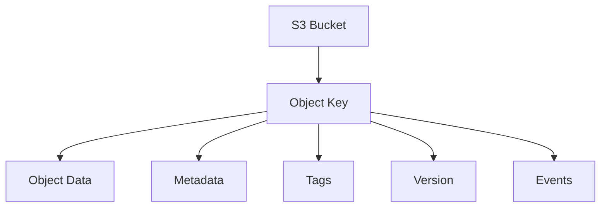
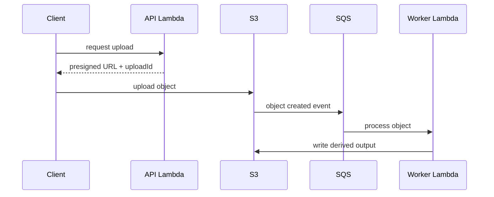
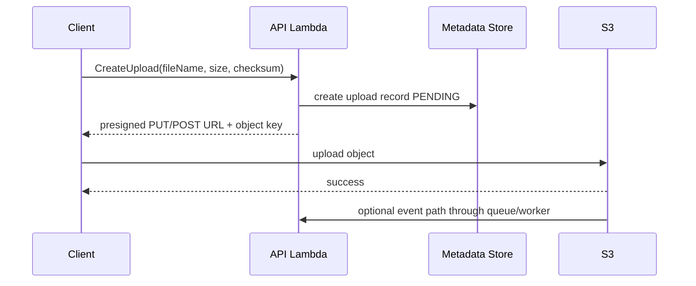
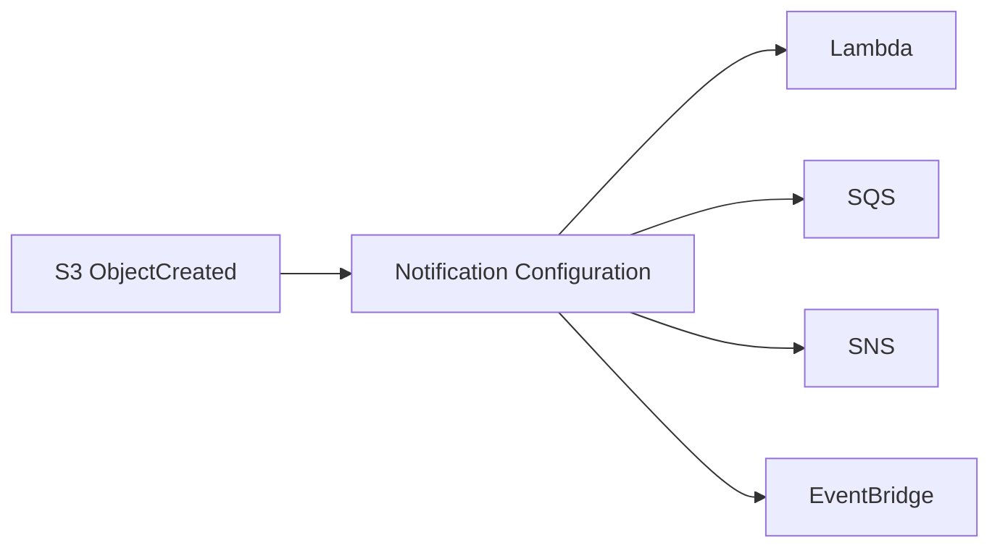
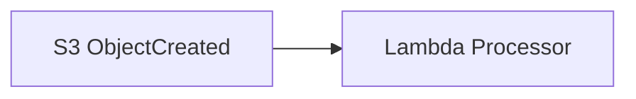
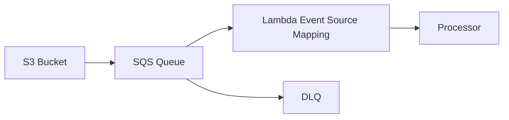
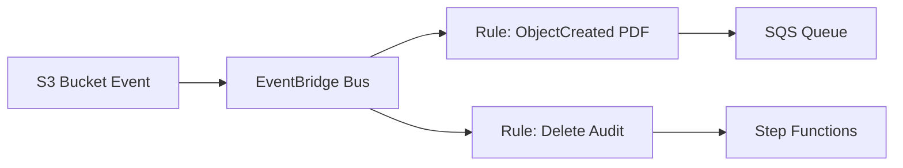
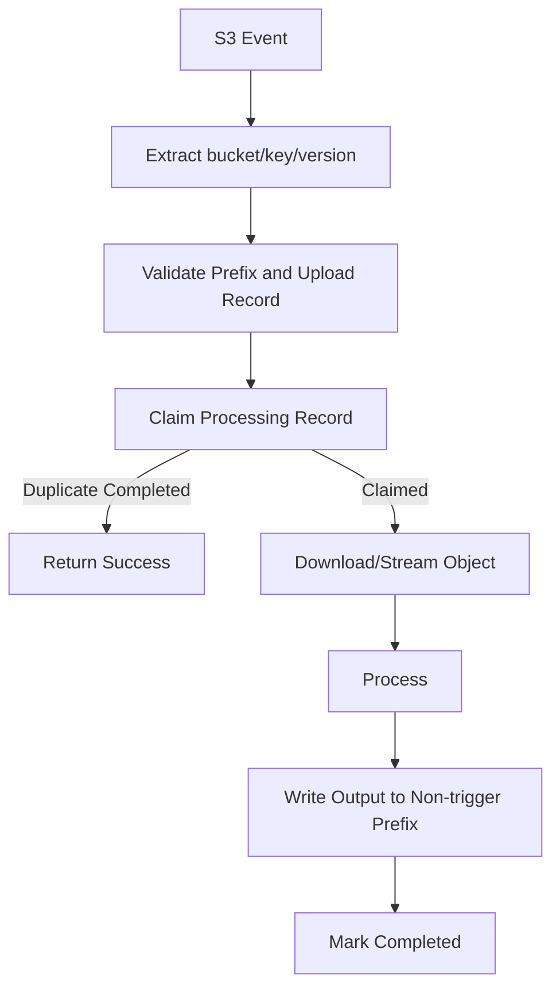
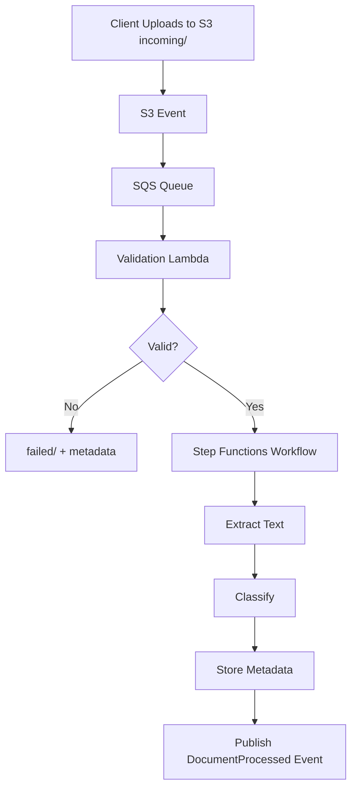

# Part 068 — S3 Event-Driven Object Workflows

S3 is not a filesystem.

S3 is an object store.

That distinction matters for serverless architecture.

A file workflow built on S3 should not think in terms of:

```txt
open file
mutate in place
rename directory
watch folder
```

It should think in terms of:

```txt
put object
object key
object version
metadata
checksum
event notification
processing state
derived object
lifecycle policy
```

S3 is a backbone for serverless object workflows:

- user uploads;
- document ingestion;
- image/video processing;
- malware scanning;
- data lake ingestion;
- archive;
- export generation;
- report delivery;
- model artifact storage;
- evidence/case files;
- batch manifest processing.

But S3 event-driven workflows need discipline:

- object identity;
- idempotency;
- event delivery safety;
- recursive trigger prevention;
- large object strategy;
- metadata validation;
- versioning;
- security;
- lifecycle;
- observability;
- replay/repair.

Without those, S3 workflows become “a Lambda fires when a file appears” and fail quietly under scale.

---

## 1. S3 Mental Model

An S3 object is identified by:

```txt
bucket + key + versionId optional
```

Object metadata can include:

- content type;
- content length;
- ETag;
- checksum;
- user metadata;
- tags;
- encryption information;
- storage class;
- version ID;
- last modified time.



The object key is not a real directory path. It is a string.

Prefixes are naming conventions with operational implications.

---

## 2. S3 Is Usually Data Plane, Not Control Plane

Bad design:

```txt
API uploads entire file through Lambda
Lambda stores bytes
Lambda returns result
```

Better design:



Lambda should usually coordinate upload authorization, not stream large payloads through itself.

Use S3 for bytes.

Use Lambda/Step Functions/SQS for control and processing.

---

## 3. Presigned Upload Pattern

Presigned URLs let clients upload to S3 without receiving AWS credentials. AWS documents that a presigned URL is limited by the permissions of the user/principal that creates it.

Use for:

- browser/mobile uploads;
- partner uploads;
- large file transfer;
- direct-to-S3 ingestion;
- avoiding API Gateway/Lambda payload limits;
- reducing Lambda memory/cost.

### Flow



### Upload Record

Store metadata:

```json
{
  "uploadId": "upl-123",
  "tenantId": "tenant-1",
  "bucket": "case-documents-prod",
  "key": "tenant-1/uploads/upl-123/original.pdf",
  "expectedSize": 1234567,
  "expectedChecksum": "sha256...",
  "status": "URL_ISSUED",
  "expiresAt": "2026-07-06T11:15:30Z"
}
```

### Validation

After upload:

- check object exists;
- check size;
- check checksum if required;
- check content type cautiously;
- check key prefix;
- check object version;
- update upload status;
- trigger processing.

Do not trust client-provided filename/content type.

---

## 4. Object Key Design

Object key design is architecture.

Good key design encodes:

- tenant/account boundary;
- domain object;
- upload/job ID;
- processing stage;
- immutable object identity;
- partitioning prefix if needed;
- lifecycle category.

Examples:

```txt
tenant-1/cases/case-123/uploads/upl-456/original.pdf
tenant-1/cases/case-123/processed/upl-456/text.json
tenant-1/reports/report-789/output/report.pdf
tenant-1/tmp/uploads/upl-456/part.json
audit/2026/07/06/event-123.json
```

### Avoid

```txt
uploads/file.pdf
latest.pdf
tmp/output.pdf
tenant-1/current/report.pdf
```

Mutable “latest” keys are dangerous unless versioning and idempotency are designed.

### Prefix as Boundary

Use prefixes for:

- IAM conditions;
- lifecycle policies;
- event notification filters;
- cost allocation;
- operational search;
- access isolation;
- avoiding recursive triggers.

---

## 5. S3 Event Notifications

S3 event notifications can publish events when object events happen.

AWS documents supported destinations such as:

- Lambda;
- SQS standard queue;
- SNS standard topic;
- EventBridge.

Only one destination can be specified for each event notification configuration, but you can create multiple configurations with filters.



### Common Event Types

- object created;
- object removed;
- restore events;
- replication events;
- lifecycle events;
- object tagging events depending integration path.

### S3 Event Rule

S3 event tells you that something happened to an object.

It does not mean your processing is complete.

It does not guarantee your Lambda side effect succeeded.

---

## 6. S3 to Lambda Direct



Use for:

- simple lightweight processing;
- low/controlled volume;
- idempotent handler;
- no explicit backlog needed;
- quick reaction.

Watch out:

- duplicate events;
- recursive triggers;
- Lambda concurrency spikes;
- large object processing timeout;
- no visible queue backlog;
- downstream overload;
- direct failure handling weaker than SQS buffer;
- object may be overwritten/deleted before processing if versioning not used.

For important/heavy processing, prefer:

```txt
S3 -> SQS -> Lambda
```

---

## 7. S3 to SQS to Lambda

Robust pattern:



Benefits:

- durable buffer;
- visible backlog;
- DLQ/redrive;
- consumer concurrency control;
- partial batch response;
- downstream protection;
- operational replay;
- better failure isolation.

Use for:

- document processing;
- image/video pipelines;
- large ingestion;
- virus scanning;
- OCR/text extraction;
- data lake pipelines;
- indexing;
- any critical object workflow.

### Queue Message

S3 event notification message includes bucket/key/event metadata. Handler should extract:

- bucket;
- key;
- version ID if present;
- event name;
- event time;
- object size;
- sequencer if present;
- request ID if available.

Always URL-decode S3 object key correctly.

---

## 8. S3 EventBridge Integration

S3 can send events to EventBridge. EventBridge then uses rules to route events to targets.



Use S3 + EventBridge when:

- event routing pattern is complex;
- multiple consumers need different object events;
- cross-account routing is needed;
- integration with Step Functions or API destinations matters;
- central event governance matters;
- filtering/routing should live in EventBridge.

For heavy consumers, still route EventBridge to SQS.

```txt
S3 -> EventBridge -> SQS -> Lambda
```

EventBridge is routing. SQS is backpressure.

---

## 9. Idempotency for S3 Processing

S3 events can be duplicated. Processing can be retried. Operators can redrive.

Use object identity as idempotency basis:

```txt
bucket + key + versionId
```

If versioning is disabled, use:

```txt
bucket + key + eTag/checksum + eventName
```

But versioning is stronger for mutable keys.

### Idempotency Record

```json
{
  "PK": "S3PROCESS#bucket#key#versionId",
  "status": "COMPLETED",
  "outputKey": "tenant-1/cases/case-123/processed/upl-456/text.json",
  "inputChecksum": "sha256...",
  "processorVersion": "ocr-v3",
  "createdAt": "...",
  "ttl": 1783936900
}
```

### Flow



The output key should be deterministic.

If the same input is processed twice, it should write the same output or safely no-op.

---

## 10. Recursive Trigger Prevention

One of the most common S3 Lambda incidents is recursive triggering.

Bad:

```txt
Bucket notification: ObjectCreated for prefix ""
Lambda reads input file
Lambda writes output file to same prefix
Output triggers same Lambda
Lambda writes another output
...
```

Prevent with:

### Separate Prefixes

```txt
incoming/
processing/
processed/
failed/
```

Notification only on:

```txt
incoming/
```

Output to:

```txt
processed/
```

### Separate Buckets

```txt
raw bucket -> processor -> processed bucket
```

### Event Filter

Configure prefix/suffix filters.

### Handler Guard

Validate key prefix in code even if notification filter exists.

```java
if (!key.startsWith("incoming/")) {
    log.info("ignored_non_input_key key={}", key);
    return;
}
```

Infrastructure filters can drift. Code guard prevents loops.

---

## 11. Multipart Uploads

Large objects often use multipart upload.

Design considerations:

- event triggers after final object creation, not each upload part as normal object-created completion path;
- checksum/ETag behavior differs for multipart;
- object may appear only after complete multipart upload;
- client can abandon multipart uploads;
- lifecycle rules can clean incomplete multipart uploads;
- post-upload validation should use supported checksum/version metadata, not naive ETag assumption.

### ETag Warning

For single-part unencrypted uploads, ETag often resembles MD5.

For multipart uploads, ETag is not a simple MD5 of the whole object.

Do not use ETag as universal checksum.

Use explicit checksum metadata where correctness requires it.

---

## 12. Processing Large Objects

Lambda can process large objects, but design carefully.

Options:

| Strategy | Use When |
|---|---|
| stream object from S3 | avoid loading full file in memory |
| download to `/tmp` | library requires file path |
| increase ephemeral storage | large temp files |
| split into chunks | parallel processing |
| Step Functions Distributed Map | many independent files/chunks |
| ECS/EKS worker | long-running/heavy processing |
| AWS Batch | batch-heavy compute |
| managed service | OCR/media/transcode/search if appropriate |

### Lambda Large Object Rules

- do not load whole object into memory unless small;
- set timeout/memory/ephemeral storage deliberately;
- validate object size before processing;
- use range requests/chunking when possible;
- write intermediate outputs to S3;
- checkpoint progress for long workflows;
- use Step Functions for multi-step processing.

If one object processing may take minutes or require heavy CPU, Lambda may be the wrong compute contract.

---

## 13. File Processing Pipeline Pattern

Example document ingestion:



This separates:

- upload;
- event buffering;
- validation;
- workflow orchestration;
- processing steps;
- metadata persistence;
- event publication.

A one-Lambda “do everything” pipeline becomes hard to debug and replay.

---

## 14. Metadata Store Pattern

S3 stores bytes. DynamoDB often stores processing metadata.

Example item:

```json
{
  "PK": "DOCUMENT#doc-123",
  "SK": "METADATA",
  "tenantId": "tenant-1",
  "status": "PROCESSED",
  "sourceBucket": "case-documents-prod",
  "sourceKey": "tenant-1/cases/case-123/uploads/upl-456/original.pdf",
  "sourceVersionId": "abc",
  "sha256": "...",
  "contentType": "application/pdf",
  "size": 1234567,
  "processedTextKey": "tenant-1/cases/case-123/processed/upl-456/text.json",
  "createdAt": "...",
  "updatedAt": "..."
}
```

Why not rely only on S3 list?

- business status;
- owner/tenant;
- validation result;
- processing version;
- idempotency;
- workflow state;
- audit.

S3 is object storage. Use a metadata store for queryable state.

---

## 15. Object Tags and Metadata

S3 supports object metadata and tags.

Use metadata for:

- content type;
- checksum;
- uploader;
- original filename;
- processing hints;
- trace/correlation ID if safe.

Use tags for:

- lifecycle;
- classification;
- processing status where tags make sense;
- cost allocation;
- retention controls;
- security/data classification.

### Caution

- user metadata is set at upload and can require object copy to change;
- tags have separate API/cost/permissions;
- tags are useful for lifecycle but not a full database;
- do not store secrets in metadata/tags;
- metadata and tags can be exposed to principals with object read/head/tag permissions.

---

## 16. Versioning

Enable versioning when:

- overwrites are possible;
- processing must identify exact object version;
- audit/history matters;
- recovery from accidental delete/overwrite matters;
- event idempotency needs stable object identity.

With versioning:

```txt
bucket + key + versionId
```

becomes strong object identity.

Without versioning:

```txt
bucket + key
```

can point to different bytes over time.

### Versioning Rule

For compliance/evidence/document systems, versioning is often mandatory.

For temporary/cache buckets, it may not be needed.

Design per bucket purpose.

---

## 17. Consistency and Listing

S3 provides strong read-after-write consistency for object PUT/DELETE/list operations in modern S3 behavior.

But workflow design should still avoid using bucket listing as the only coordination mechanism.

Prefer event + metadata state.

List operations are useful for:

- backfill;
- inventory;
- repair;
- reconciliation;
- batch processing;
- cleanup.

Do not build a high-frequency scheduler by repeatedly listing bucket prefixes in Lambda.

Use S3 events, Inventory, Batch Operations, Step Functions, or event metadata.

---

## 18. Security

S3 security surfaces:

- bucket policy;
- IAM identity policy;
- access points;
- VPC endpoints;
- Block Public Access;
- Object Ownership;
- ACLs if still relevant;
- KMS encryption;
- presigned URL scope;
- CORS;
- lifecycle/retention;
- object lock;
- CloudTrail data events;
- server access logs/CloudTrail/S3 access logs depending needs.

### Bucket Policy Principles

- block public access by default;
- use least-privilege prefix conditions;
- separate raw/processed/sensitive buckets when needed;
- enforce TLS;
- enforce encryption;
- restrict upload content length/type where possible through presigned POST policy;
- use object ownership controls;
- avoid broad `s3:*`.

### Presigned URL Security

- short expiration;
- key prefix scoped to tenant/upload ID;
- content length constraints if using presigned POST;
- checksum requirement where possible;
- do not allow arbitrary key writes;
- store upload record before issuing URL;
- validate object after upload;
- revoke by changing policy/permissions where practical.

A presigned URL is a delegated permission.

Treat it like one.

---

## 19. Encryption and KMS

S3 supports server-side encryption.

Options include:

- SSE-S3;
- SSE-KMS;
- DSSE-KMS in supported contexts;
- client-side encryption if required by application model.

Use KMS when:

- customer-managed key controls required;
- audit of key use required;
- cross-account encryption boundary;
- compliance requires CMK;
- fine-grained key policy needed.

KMS design questions:

- who can encrypt?
- who can decrypt?
- can Lambda processor decrypt?
- can S3 service use key for events/replication?
- can cross-account consumers read?
- are DLQ/message references safe?
- what is KMS request cost/throttle?

Encryption at rest does not make it safe to put secrets in object metadata or logs.

---

## 20. Lifecycle and Retention

S3 lifecycle policies can:

- transition storage class;
- expire objects;
- clean incomplete multipart uploads;
- expire old versions;
- delete markers;
- manage noncurrent versions.

Use lifecycle for:

- temporary upload cleanup;
- raw input retention;
- processed output retention;
- failed object retention;
- logs/archive;
- incomplete multipart cleanup.

Example policy intent:

```txt
tmp/uploads/ expire after 1 day
incoming/ retain 30 days
processed/ retain 365 days
failed/ retain 90 days
incomplete multipart uploads abort after 7 days
```

Lifecycle is governance, not just cost optimization.

---

## 21. Object Lock and Compliance

For audit/evidence workloads, S3 Object Lock may be relevant.

Use when:

- write-once-read-many retention required;
- compliance retention;
- legal hold;
- evidence immutability;
- audit artifacts.

Design carefully:

- retention mode;
- governance vs compliance;
- legal hold process;
- deletion permissions;
- bucket versioning requirement;
- lifecycle interaction;
- operational recovery.

Object Lock can prevent deletion. Misconfiguration can also prevent legitimate cleanup.

---

## 22. Event Ordering and Duplicate Handling

S3 event notifications can be duplicated and are not a general ordering system for business workflows.

Design handler to tolerate:

- duplicate event;
- late event;
- object overwritten;
- object deleted before processing;
- out-of-order create/remove;
- version mismatch;
- redrive.

### Sequencer

S3 events may include a sequencer for object events. It can help compare ordering for events on the same object key, but do not treat it as global ordering.

Use version ID and metadata state for robust processing.

---

## 23. Observability

Minimum signals:

### Bucket

- request count;
- 4xx/5xx errors;
- latency;
- bytes uploaded/downloaded;
- object count/size;
- lifecycle transitions;
- replication status if used;
- event notification failures indirectly through target metrics.

### Queue/Worker

- SQS age/depth;
- DLQ depth;
- Lambda duration/errors/throttles;
- object processing status;
- duplicate processing count;
- poison object count;
- downstream latency;
- output object write success.

### Business

- uploads created;
- uploads completed;
- validation failed;
- objects processed;
- processing time;
- failed processing by reason;
- user-visible artifacts ready;
- SLA missed.

### Logs

Include:

```json
{
  "operation": "ProcessDocument",
  "bucket": "case-documents-prod",
  "key": "tenant-1/cases/case-123/uploads/upl-456/original.pdf",
  "versionId": "abc",
  "documentId": "doc-123",
  "correlationId": "corr-456",
  "idempotencyStatus": "CLAIMED",
  "outputKey": "tenant-1/cases/case-123/processed/upl-456/text.json",
  "durationMs": 1842,
  "outcome": "SUCCESS"
}
```

Do not log full object content or signed URLs.

---

## 24. Cost Model

S3 workflow cost includes:

- storage;
- requests;
- data retrieval;
- data transfer;
- lifecycle transitions;
- storage class retrieval fees;
- KMS requests;
- event targets;
- SQS/Lambda/Step Functions processing;
- logs/traces;
- replication;
- inventory/batch operations;
- object tagging requests;
- failed retries.

Cost anti-patterns:

- repeatedly reading large object in retry loop;
- Lambda downloads full file when range/stream would do;
- lifecycle moves hot objects to cold storage too early;
- storing many tiny objects with high request overhead;
- no cleanup for temp/multipart uploads;
- verbose logs with object payloads;
- duplicate processing from no idempotency;
- recursive trigger generating infinite objects.

---

## 25. Runbook: S3 Event Did Not Process

Questions:

1. Was object uploaded to expected bucket/key?
2. Does notification filter match prefix/suffix?
3. Is destination configured?
4. Does S3 have permission to invoke/send?
5. Did event go to SQS/EventBridge?
6. Is queue backlog growing?
7. Is Lambda throttled/failing?
8. Was object overwritten/deleted?
9. Is version ID expected?
10. Was event filtered by EventBridge rule?

Evidence:

```bash
aws s3api head-object --bucket "$BUCKET" --key "$KEY"
aws s3api get-bucket-notification-configuration --bucket "$BUCKET"
aws sqs get-queue-attributes --queue-url "$QUEUE_URL" --attribute-names All
```

Actions:

- verify notification config;
- verify destination policy;
- verify queue/Lambda metrics;
- replay by sending synthetic message/reference if safe;
- run repair/backfill job by listing/inventory if needed.

---

## 26. Runbook: Recursive Trigger

Symptoms:

- sudden Lambda invocation spike;
- new objects created continuously;
- bucket request count spikes;
- cost spike;
- same key pattern repeats;
- output prefix matches input event filter.

Actions:

1. disable notification or set Lambda reserved concurrency to 0;
2. identify source/output prefixes;
3. preserve sample events/logs;
4. fix prefix/suffix filter;
5. add handler guard;
6. move outputs to safe prefix/bucket;
7. clean generated objects if needed;
8. add alarm for invocation/object creation spike.

Recursive triggers can become expensive very quickly.

---

## 27. Runbook: Object Processing Fails

Questions:

1. Is object accessible?
2. Is KMS decrypt allowed?
3. Is object size within processor limit?
4. Is content type/schema valid?
5. Is checksum valid?
6. Does processor have enough memory/ephemeral storage?
7. Did dependency fail?
8. Is this duplicate or new version?
9. Is output prefix writable?
10. Is DLQ filling?

Actions:

- sample failed object metadata;
- classify permanent vs retryable;
- quarantine invalid object;
- increase memory/storage only if measured;
- split workflow if object too large;
- fix permissions/KMS;
- redrive after fix.

---

## 28. S3 Workflow Checklist

### Upload

- [ ] Direct upload via presigned URL where appropriate.
- [ ] Key scoped to tenant/upload ID.
- [ ] Upload record created.
- [ ] URL expiration short.
- [ ] Size/checksum/content constraints.
- [ ] Post-upload validation.
- [ ] No arbitrary key writes.

### Event

- [ ] Notification destination chosen deliberately.
- [ ] SQS buffer for critical/heavy processing.
- [ ] Prefix/suffix filters precise.
- [ ] Handler guard against wrong prefix.
- [ ] Recursive trigger prevented.
- [ ] EventBridge routing if multiple consumers/cross-account.

### Processing

- [ ] Idempotency by bucket/key/version.
- [ ] Versioning enabled where needed.
- [ ] Large objects streamed/chunked.
- [ ] Output key deterministic.
- [ ] Metadata store updated.
- [ ] Poison object strategy.
- [ ] DLQ/redrive runbook.

### Security

- [ ] Block Public Access.
- [ ] Bucket policy least privilege.
- [ ] KMS policy tested.
- [ ] No secrets in metadata/logs.
- [ ] CORS scoped.
- [ ] Object ownership/ACL posture defined.
- [ ] Lifecycle/retention defined.
- [ ] Object Lock evaluated for evidence/compliance.

### Operations

- [ ] Queue age/DLQ alarms.
- [ ] Lambda error/throttle alarms.
- [ ] Bucket request/error metrics.
- [ ] Processing SLA dashboard.
- [ ] Cost monitoring.
- [ ] Repair/backfill procedure.
- [ ] Recursive trigger alarm.

---

## 29. Common Anti-Patterns

### Anti-Pattern 1 — Upload Through Lambda

Large payloads create memory, timeout, and cost problems.

### Anti-Pattern 2 — Same Prefix for Input and Output

Recursive trigger risk.

### Anti-Pattern 3 — No Versioning for Mutable Objects

Processing may read different bytes than event intended.

### Anti-Pattern 4 — ETag as Universal Checksum

Multipart uploads break this assumption.

### Anti-Pattern 5 — Direct S3 to Heavy Lambda

No explicit backlog/backpressure.

### Anti-Pattern 6 — Full Object Loaded Into Memory

OOM and slow processing.

### Anti-Pattern 7 — No Metadata Store

Business state hidden in bucket listing and filenames.

### Anti-Pattern 8 — Presigned URL Allows Arbitrary Key

Tenant/data boundary bypass.

### Anti-Pattern 9 — Object Event Treated as Exactly Once

Duplicate/retry creates repeated side effects.

### Anti-Pattern 10 — Lifecycle Deletes Evidence Too Early

Recovery/compliance problem.

---

## 30. Final Mental Model

S3 is the object data plane for serverless workflows.

A production S3 workflow separates:

```txt
upload authorization
object storage
event notification
queue/backpressure
processing
metadata state
derived output
lifecycle/retention
```

The key identity is:

```txt
bucket + key + versionId
```

The key safety questions are:

- can the same object event be processed twice safely?
- can output trigger input again?
- can object bytes change between event and processing?
- can the workflow recover from failed processing?
- is large data flowing through the right service?
- are security/lifecycle policies aligned with business retention?

A top-tier engineer does not ask:

> “Can S3 trigger Lambda?”

They ask:

> “What object identity, event path, idempotency record, output boundary, and repair process make this file workflow correct under duplicate, late, failed, and replayed events?”

That is S3 event-driven engineering.

---

## References

- Amazon S3 User Guide: Event Notifications
- Amazon S3 User Guide: event notification destinations and event types
- Amazon S3 User Guide: using EventBridge with S3
- AWS Lambda Developer Guide: processing Amazon S3 event notifications with Lambda
- Amazon S3 User Guide: uploading objects with presigned URLs
- Amazon S3 User Guide: multipart upload and object integrity/checksums
- Amazon S3 User Guide: versioning, lifecycle configuration, and Object Lock
