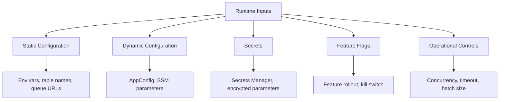
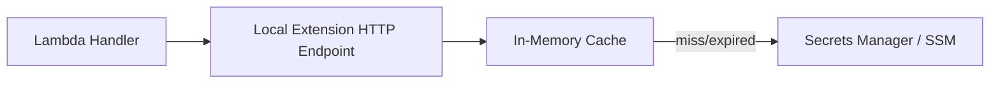
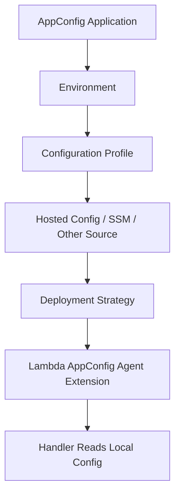
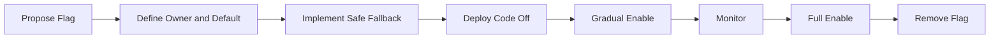
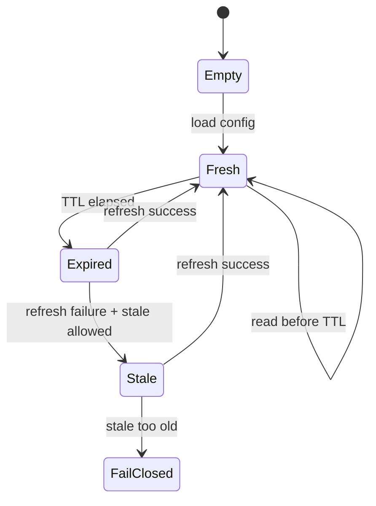
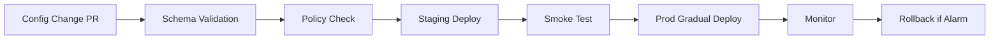

# Part 069 — Serverless Configuration, Secrets, and Feature Flags

Configuration is not a footnote.

In serverless systems, configuration often changes behavior faster than code does.

A single bad value can:

- route events to the wrong queue;
- disable idempotency;
- point a function to the wrong table;
- increase batch size and overload a database;
- enable a broken feature flag for every tenant;
- leak a secret through logs;
- make a Lambda fail at cold start;
- send customer notifications twice;
- break cross-account event routing;
- cause a region-wide incident without a new deployment.

Configuration is production code with fewer tests if you do not govern it.

A top-tier serverless engineer treats configuration as a controlled runtime contract.

---

## 1. Configuration Mental Model

Configuration has multiple categories.



Different categories need different controls.

| Category | Example | Change Frequency | Storage |
|---|---|---:|---|
| static config | table name, queue URL, bus name | low | environment variables/IaC |
| dynamic config | risk threshold, routing rule, tenant limit | medium | AppConfig/SSM/custom config |
| secret | DB password, API key | rotated | Secrets Manager/SSM SecureString |
| feature flag | enable new payment provider | frequent | AppConfig/feature flag system |
| operational control | reserved concurrency, batch size | incident-driven | Lambda/SQS/IaC/runtime controls |

Do not store all categories the same way.

---

## 2. Static Configuration

Static configuration is known at deploy time.

Examples:

```txt
TABLE_NAME
QUEUE_URL
EVENT_BUS_NAME
LOG_LEVEL
POWERTOOLS_SERVICE_NAME
IDEMPOTENCY_TABLE
AWS_REGION
ENVIRONMENT
```

AWS Lambda environment variables are common for this. AWS documents that Lambda environment variables are encrypted at rest and can use AWS KMS keys.

### Good Use of Environment Variables

- resource names/ARNs;
- feature defaults;
- environment name;
- log level;
- config profile identifiers;
- non-sensitive constants;
- secret ARN/reference, not secret value;
- tenant class config that changes only through deployment.

### Bad Use

- database passwords;
- API keys;
- JWT signing private keys;
- large JSON config blobs;
- rapidly changing feature flags;
- per-tenant dynamic authorization policies;
- operational emergency switches that must change without deployment.

### Environment Variable Rule

```txt
Environment variables are deployment-time config.
They are not a full dynamic config system.
```

Changing Lambda environment variables creates a configuration update and affects function versions/environments according to deployment behavior. For production, update through pipeline/IaC, not console clickops.

---

## 3. Secrets

Secrets are values that grant access.

Examples:

- database credentials;
- API tokens;
- OAuth client secrets;
- signing keys;
- webhook secrets;
- private certificates;
- encryption keys managed outside KMS;
- provider credentials.

Secrets should be stored in:

- AWS Secrets Manager;
- SSM Parameter Store SecureString for simpler cases;
- external secret manager if organization standard;
- encrypted configuration system with audit/rotation.

Do not store secrets as plaintext environment variables.

Even encrypted-at-rest environment variables can be read by identities with function configuration access.

### Secret Reference Pattern

Environment variable:

```txt
PAYMENT_PROVIDER_SECRET_ARN=arn:aws:secretsmanager:...
```

Execution role:

```txt
secretsmanager:GetSecretValue on that secret
kms:Decrypt on the key if customer-managed KMS is used
```

Code:

```txt
fetch secret with timeout
cache with TTL
refresh on rotation/error
redact in logs
```

### Java Secret Provider Sketch

```java
public final class SecretProvider {
    private static volatile ProviderSecret cached;
    private static volatile Instant expiresAt = Instant.EPOCH;

    public static ProviderSecret get(Context context) {
        Instant now = Instant.now();

        if (cached == null || now.isAfter(expiresAt)) {
            synchronized (SecretProvider.class) {
                if (cached == null || now.isAfter(expiresAt)) {
                    if (context.getRemainingTimeInMillis() < 2_000) {
                        throw new RetryableException("not enough time to refresh secret");
                    }

                    cached = fetchSecretWithTimeout();
                    expiresAt = now.plusSeconds(300);
                }
            }
        }

        return cached;
    }
}
```

Caching is good.

Infinite caching is dangerous.

---

## 4. Parameters and Secrets Lambda Extension

AWS provides the AWS Parameters and Secrets Lambda Extension, which exposes a local HTTP interface to retrieve and cache Secrets Manager secrets and Parameter Store parameters. AWS documents that it caches values by default for 300 seconds and can cache up to 1,000 secrets, configurable with environment variables.

Mental model:



Use it when:

- you want runtime-agnostic local cache;
- multiple functions/languages use same pattern;
- direct SDK cache implementation is undesirable;
- reducing per-invoke secret API calls matters;
- extension overhead is acceptable.

Watch out:

- extension adds memory and lifecycle behavior;
- cache lives per execution environment;
- TTL must match rotation needs;
- extension failure path must be understood;
- local HTTP call still needs error handling;
- secrets must still be redacted.

### Direct SDK Cache vs Extension

| Approach | Good For | Watch Out |
|---|---|---|
| SDK + app cache | custom logic, Java type safety, fewer moving parts | every app implements cache correctly |
| Lambda extension | standardized cache across runtimes | extension overhead/lifecycle/config |

Both can be correct.

The incorrect approach is fetching secrets from Secrets Manager on every high-volume invocation without caching or timeout discipline.

---

## 5. AWS AppConfig

AWS AppConfig is designed for controlled application configuration and feature flag deployment.

Use it for:

- dynamic runtime configuration;
- feature flags;
- kill switches;
- tenant rollout;
- gradual config deployment;
- validated configuration;
- operational knobs;
- config rollback;
- multi-variant flags.

AWS recommends using the AWS AppConfig Agent Lambda extension for Lambda compute environments to retrieve configuration data and feature flags efficiently, reducing API calls and processing time.



### AppConfig Concepts

| Concept | Meaning |
|---|---|
| application | logical app/system |
| environment | dev/staging/prod |
| configuration profile | specific config/flag set |
| deployment strategy | rollout pattern |
| validator | JSON schema or Lambda validator |
| extension/agent | local retrieval/cache layer |
| feature flag | runtime switch with optional variants |

### Why AppConfig Matters

Feature flags are dangerous if they are just booleans in a database.

You need:

- validation;
- rollout strategy;
- rollback;
- audit;
- environment separation;
- alarm integration;
- owner;
- default behavior;
- expiration/removal.

AppConfig helps implement those controls.

---

## 6. Feature Flags

A feature flag changes behavior at runtime.

Types:

| Type | Example |
|---|---|
| release flag | enable new checkout flow |
| experiment flag | variant A/B |
| ops flag | disable external provider |
| permission flag | enable feature for tenant class |
| migration flag | read old/write new path |
| kill switch | stop unsafe workflow |
| circuit flag | route away from dependency |

### Feature Flag Lifecycle



Feature flags must be removed.

A system with 500 old flags is a second codebase nobody understands.

### Flag Metadata

```yaml
flag: use-new-payment-provider
owner: payments-platform
type: migration
default: false
created: 2026-07-06
expires: 2026-08-15
blastRadius: payment capture
rollback: set false
metrics:
  - payment_provider_error_rate
  - duplicate_payment_count
  - capture_latency_p95
```

### Kill Switch Rule

A kill switch should fail safe.

Example:

```txt
disable notification sender
pause risky provider call
route to fallback queue
reject new job with 503
```

Do not make kill switch failure mode ambiguous.

---

## 7. Configuration Validation

Every config must be validated before use.

Validation layers:

```txt
schema validation
semantic validation
dependency validation
safe range validation
environment validation
runtime fallback
```

### Schema Example

```json
{
  "type": "object",
  "required": ["providerTimeoutMs", "maxBatchSize", "enabledTenants"],
  "properties": {
    "providerTimeoutMs": { "type": "integer", "minimum": 100, "maximum": 5000 },
    "maxBatchSize": { "type": "integer", "minimum": 1, "maximum": 50 },
    "enabledTenants": {
      "type": "array",
      "items": { "type": "string" }
    }
  }
}
```

### Semantic Validation

Schema says timeout is an integer.

Semantic validation says:

```txt
providerTimeoutMs < lambdaTimeoutRemainingSafeBudget
maxBatchSize <= downstreamSafeBatchSize
enabledTenants exist
target queue ARN belongs to this environment
```

### AppConfig Validators

Use validators to prevent bad config deployment.

But handler should still handle config missing/corrupt/stale.

Defense in depth.

---

## 8. Configuration Caching

Serverless functions should not fetch remote config on every invocation unless volume is tiny and latency/cost are acceptable.

Cache with TTL.



### Cache Policy Questions

- What is TTL?
- Is stale config allowed?
- For how long?
- What happens if config service is down?
- Does config affect security?
- Does config affect money movement?
- Is default safe?
- Is refresh synchronous or lazy?
- Is there a forced refresh path?
- How is config version logged?

### Fail Open vs Fail Closed

| Config Type | Failure Behavior |
|---|---|
| non-critical display config | fail open/stale |
| payment provider routing | usually fail safe/stale with alarm |
| authorization policy | fail closed or use last-known-valid with strict TTL |
| kill switch | fail to safest behavior |
| experiment flag | default off |
| tenant quota | fail conservative |

Do not use one global cache policy for all config types.

---

## 9. Secrets Rotation

Secrets must rotate.

Rotation design:

- source of truth;
- rotation schedule;
- dual credential window;
- cache TTL;
- connection pool refresh;
- failure rollback;
- downstream compatibility;
- alarm on failed rotation;
- app refresh behavior;
- manual break-glass.

### Rotation Problem

If Lambda caches secret for 1 hour but secret rotates and old credential is revoked immediately:

```txt
warm environments keep using old credential
calls fail
retry storm
```

### Safer Rotation

```txt
new secret version created
downstream accepts old and new for overlap
Lambda cache TTL short enough
connection pool refreshes
monitor auth failures
old version disabled after grace window
```

### DB Credential Rotation

For databases:

- use Secrets Manager rotation where appropriate;
- use RDS Proxy where useful;
- keep connection pool max lifetime short enough;
- handle authentication failure by refreshing secret and recreating connection;
- avoid infinite pool holding old credentials.

### Secret Version Logging

Log secret version/stage if safe, not value.

```json
{
  "operation": "secret_refresh",
  "secretName": "payment-provider",
  "versionStage": "AWSCURRENT",
  "outcome": "SUCCESS"
}
```

---

## 10. KMS and Encryption

KMS appears in:

- Lambda environment variable encryption;
- Secrets Manager;
- Parameter Store SecureString;
- S3/DynamoDB/SQS/SNS encryption;
- application-level encryption;
- config artifact encryption.

KMS failure can become application failure.

### KMS Design Questions

- Which key encrypts which config/secret?
- Which Lambda role can decrypt?
- Is key policy aligned with IAM?
- Is cross-account access required?
- Are grants used?
- What happens if KMS is throttled/denied?
- Are KMS calls cached through secrets/config caching?
- Is key rotation enabled where appropriate?
- Is audit required?

### Avoid

```json
{
  "Action": "kms:Decrypt",
  "Resource": "*"
}
```

Scope decrypt to required keys.

Use encryption context conditions where applicable.

---

## 11. Configuration by Environment

Separate environments:

```txt
dev
staging
prod
```

Different resources:

```txt
TABLE_NAME=payments-dev
TABLE_NAME=payments-prod
```

Different config profiles:

```txt
appconfig: payments/dev/runtime
appconfig: payments/prod/runtime
```

### Environment Rules

- prod functions cannot read dev config accidentally;
- dev cannot publish to prod event bus;
- staging mimics prod config shape;
- secret names include environment or account boundary;
- config validation runs in all environments;
- promotion is deliberate;
- production config changes are audited.

### Account Boundary

Prefer separate AWS accounts for serious environment isolation.

Config naming is not a substitute for account/IAM isolation.

---

## 12. Configuration Deployment

Configuration changes should have a release process.



Do not edit production config directly in console for normal operations.

### Emergency Changes

Emergency config changes need:

- break-glass role;
- incident ticket;
- approval if possible;
- timestamp/operator;
- rollback value;
- post-incident review;
- permanent fix through IaC.

Break-glass should be rare and visible.

---

## 13. Operational Controls as Config

Some runtime controls are configuration, but they are applied to AWS resources:

- Lambda reserved concurrency;
- SQS event source maximum concurrency;
- Lambda timeout;
- batch size;
- retry attempts;
- max event age;
- DLQ target;
- EventBridge rule enabled/disabled;
- Step Functions Map max concurrency;
- AppConfig flag value.

These controls change system behavior.

Treat them like production changes.

### Example: Batch Size

Changing SQS batch size from 10 to 100 can:

- reduce invocation count;
- increase memory;
- increase duration;
- increase retry blast radius;
- increase downstream transaction size;
- cause timeouts.

It is not harmless.

---

## 14. Feature Rollout Patterns

### Boolean Release Flag

```txt
if flag enabled -> new path
else -> old path
```

Good for simple rollout.

### Percentage Rollout

```txt
hash(tenantId or userId) % 100 < rolloutPercentage
```

Use stable identity. Do not randomize per request unless intended.

### Tenant Allowlist

```txt
enabledTenants = ["tenant-1", "tenant-2"]
```

Good for staged B2B rollout.

### Multi-Variant

```txt
provider = A | B | fallback
```

Good for provider routing or experiments.

### Kill Switch

```txt
externalProviderEnabled = false
```

Should have safe behavior.

### Migration Flag

```txt
readFromNewIndex
writeToBothStores
```

Migrations usually require multiple flags:

```txt
write old only
write both
read old
read new
stop old
```

Document transitions.

---

## 15. Safe Defaults

Every config should have a default posture.

| Config | Safe Default |
|---|---|
| new feature flag | disabled |
| external provider | disabled or fallback |
| max batch size | conservative |
| retry attempts | bounded |
| timeout | bounded |
| tenant allowlist | empty |
| expensive workflow | disabled |
| debug logging | disabled |
| public endpoint | no public access |
| destructive action | disabled |

Do not let missing config mean “enable everything.”

Missing config should often fail deployment or fail closed.

---

## 16. Config and Idempotency

Configuration can affect idempotency.

Example:

```txt
providerRouting = new-payment-provider
idempotencyKey = paymentId + provider
```

If provider changes on retry, side effect can duplicate.

Better:

- idempotency key independent of mutable routing config;
- routing decision persisted at command start;
- retries use persisted routing;
- config version logged;
- workflow state stores chosen provider.

### Rule

For multi-step operations:

```txt
important config decisions become part of durable workflow state
```

Do not recompute critical routing decision differently on each retry.

---

## 17. Config and Step Functions

Step Functions can read config via Lambda or service integrations, but avoid dynamic config ambiguity mid-execution.

For long-running workflows, decide:

- config snapshot at start;
- config read per state;
- config version stored in execution input/state;
- kill switch checked before risky state;
- migration flags fixed per execution or dynamic.

### Workflow Config Rule

```txt
If changing config mid-workflow can create inconsistent business behavior,
snapshot the config decision at workflow start.
```

Example:

```json
{
  "workflowConfig": {
    "paymentProvider": "providerA",
    "riskThresholdVersion": "42",
    "selectedAt": "2026-07-06T10:15:30Z"
  }
}
```

---

## 18. Config and Event Consumers

Event consumers should log config version used.

Example:

```json
{
  "eventType": "PaymentCaptured",
  "eventId": "evt-123",
  "consumer": "audit-writer",
  "configVersion": "audit-runtime-v17",
  "featureFlags": {
    "writeToNewAuditStore": true
  },
  "outcome": "SUCCESS"
}
```

When replaying events, consider:

- use current config;
- use config at event time;
- use config stored in event;
- use config stored in durable workflow state.

For projections/search indexes, current config may be fine.

For financial/regulatory decisions, event-time or decision-time config may be required.

---

## 19. Observability

Minimum config observability:

- config version loaded;
- config refresh success/failure;
- cache hit/miss;
- stale config use;
- secret refresh success/failure;
- secret auth failures;
- AppConfig deployment status;
- feature flag evaluation count;
- kill switch activation;
- config validation failure;
- config source latency;
- config rollback event.

### Log Example

```json
{
  "operation": "config_load",
  "service": "payment-consumer",
  "configSource": "appconfig",
  "configProfile": "payment-runtime",
  "configVersion": "43",
  "cacheStatus": "MISS",
  "durationMs": 37,
  "outcome": "SUCCESS"
}
```

### Feature Flag Metrics

- flag evaluated;
- variant selected;
- tenant class;
- outcome by variant;
- error rate by variant;
- latency by variant.

Be careful with high-cardinality dimensions such as user ID or tenant ID.

---

## 20. Config Cost

Cost comes from:

- Secrets Manager API calls;
- Parameter Store API calls;
- KMS decrypt calls;
- AppConfig retrieval;
- Lambda extension memory/duration;
- logs;
- config-related retries;
- feature flag mistake increasing downstream cost.

Caching reduces API and KMS cost.

But cache TTL must match correctness.

### Cost Trap

A Lambda with 1,000 RPS fetches a secret every invocation.

```txt
1,000 secret reads/sec
```

This is unnecessary, slow, and expensive.

Cache.

---

## 21. Security

Security checklist:

- secrets not in env vars unless unavoidable and access controlled;
- env var readers restricted;
- secret ARNs not secret values in env vars;
- execution role scoped to specific secrets/parameters;
- KMS decrypt scoped;
- config changes audited;
- AppConfig/SSM/Secrets permissions separated;
- no secrets in logs;
- no secrets in event payloads;
- secret rotation tested;
- break-glass access monitored.

### Config Read Permission

Function should read only its config.

Bad:

```txt
ssm:GetParameter *
secretsmanager:GetSecretValue *
```

Better:

```txt
ssm:GetParameter /prod/payments/*
secretsmanager:GetSecretValue arn:...:secret:prod/payments/provider-*
```

Scope aggressively.

---

## 22. Runbook: Bad Feature Flag Rollout

Symptoms:

- error spike after flag enable;
- only enabled tenants affected;
- latency increase;
- downstream error;
- duplicate side effects;
- new code path error.

Actions:

1. identify flag and config version;
2. disable flag or rollback config;
3. verify errors stop;
4. identify affected tenants/events;
5. reconcile side effects;
6. preserve logs/config version;
7. add validation/guardrail;
8. remove or fix flag.

Evidence:

- AppConfig deployment history;
- logs with flag variant;
- metrics by variant;
- deployment timeline;
- downstream metrics.

---

## 23. Runbook: Secret Rotation Breaks Function

Symptoms:

- authentication failures;
- DB connection failures;
- provider 401/403;
- Lambda duration/retries;
- queue backlog.

Questions:

1. Which secret rotated?
2. Did downstream accept new secret?
3. Are old credentials still valid?
4. Is Lambda cache TTL too long?
5. Is connection pool using old credentials?
6. Does function role have permission to new secret/KMS?
7. Did secret ARN/name change?
8. Did AppConfig/SSM reference update?

Actions:

- temporarily restore old credential if needed;
- force refresh/redeploy/recycle environments;
- reduce cache TTL;
- recreate connection pools on auth failure;
- fix IAM/KMS;
- rerun rotation with overlap;
- add rotation test.

---

## 24. Runbook: Config Service Unavailable

Symptoms:

- cold starts fail;
- config refresh errors;
- latency spike;
- stale config metric rising.

Decision:

| Config Type | Action |
|---|---|
| non-critical display/config | use stale/default |
| security policy | fail closed or use last-known-valid strict TTL |
| payment provider routing | use persisted workflow decision or safe fallback |
| kill switch | choose safest behavior |
| batch size | use conservative default |

Actions:

- check AppConfig/SSM/Secrets/KMS metrics;
- check IAM denies;
- check VPC endpoint/NAT path;
- check extension health;
- check recent config deployment;
- increase cache resilience if needed.

---

## 25. Design Checklist

### Classification

- [ ] Config classified as static/dynamic/secret/flag/operational.
- [ ] Storage matches classification.
- [ ] Owner defined.
- [ ] Default behavior defined.
- [ ] Expiration/removal date for feature flags.

### Validation

- [ ] Schema validation.
- [ ] Semantic validation.
- [ ] Safe ranges.
- [ ] Environment/account validation.
- [ ] Config compatibility tests.
- [ ] AppConfig validators where useful.

### Runtime

- [ ] Cache TTL defined.
- [ ] Stale behavior defined.
- [ ] Secret rotation behavior tested.
- [ ] Remaining-time guard for refresh.
- [ ] Config version logged.
- [ ] Feature flag variant logged safely.
- [ ] Critical decisions persisted when needed.

### Security

- [ ] Secrets stored in Secrets Manager/SSM.
- [ ] KMS scoped.
- [ ] IAM least privilege.
- [ ] Env var read access restricted.
- [ ] No secrets in logs/events.
- [ ] Break-glass monitored.

### Operations

- [ ] Rollback process.
- [ ] Config deployment pipeline.
- [ ] AppConfig deployment strategy.
- [ ] Alarms for config/secret failures.
- [ ] Runbooks for bad flag and rotation failure.
- [ ] Dashboard for config version and refresh status.

---

## 26. Common Anti-Patterns

### Anti-Pattern 1 — Secrets in Environment Variables

Encrypted at rest does not mean safe from config readers.

### Anti-Pattern 2 — Fetch Secret Every Invocation

Unnecessary latency, cost, KMS/API pressure.

### Anti-Pattern 3 — Feature Flag Without Owner or Expiry

Permanent complexity.

### Anti-Pattern 4 — Config Change Through Console

No review, no tests, weak audit, no rollback artifact.

### Anti-Pattern 5 — Missing Config Means Enabled

Unsafe default.

### Anti-Pattern 6 — Kill Switch That Requires Broken Dependency

A kill switch must work during dependency failure.

### Anti-Pattern 7 — Dynamic Config Changes Idempotency Behavior

Retries may duplicate side effects.

### Anti-Pattern 8 — No Config Version in Logs

Incident diagnosis becomes guessing.

### Anti-Pattern 9 — Stale Secret Cache Longer Than Rotation Window

Warm Lambdas keep using revoked credentials.

### Anti-Pattern 10 — AppConfig Used Without Validation

Bad values roll out faster and more confidently.

---

## 27. Final Mental Model

Configuration is runtime behavior.

Secrets are runtime authority.

Feature flags are runtime branching.

Operational knobs are runtime blast-radius controls.

A production serverless system needs:

```txt
classification
validation
least privilege
caching
rotation
safe defaults
gradual rollout
rollback
observability
runbooks
```

A top-tier engineer does not ask:

> “Where do I put this value?”

They ask:

> “Who owns this value, how often can it change, what is the safe default, how is it validated, how is it rolled back, and what happens if it is stale, missing, or wrong?”

That is serverless configuration engineering.

---

## References

- AWS Lambda Developer Guide: environment variables and encryption
- AWS Lambda Developer Guide: using Secrets Manager with Lambda
- AWS Secrets Manager User Guide: Parameters and Secrets Lambda Extension
- AWS AppConfig User Guide: feature flags, configuration retrieval, and Lambda extension
- AWS Key Management Service documentation
- AWS Systems Manager Parameter Store documentation
