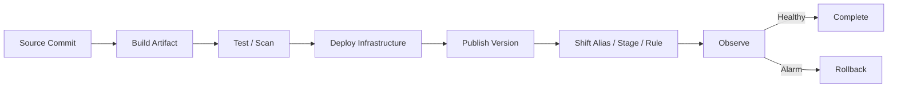
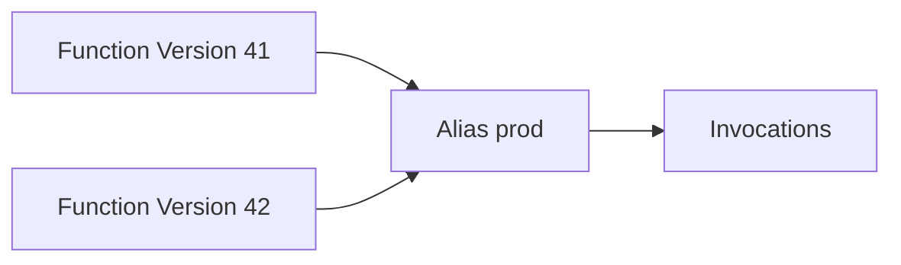
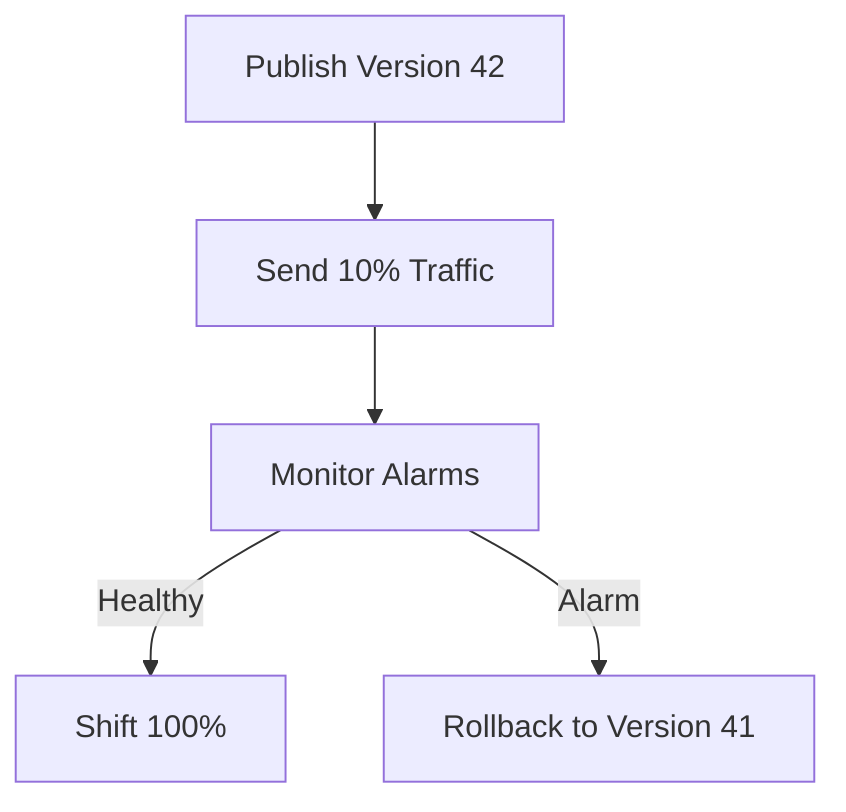
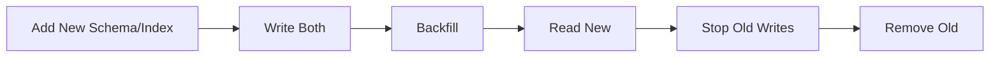
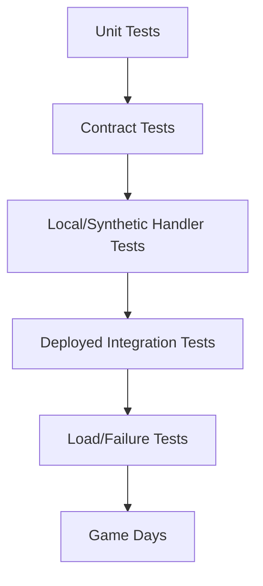

# Part 070 — Serverless Deployment, IaC, and Release Safety

Serverless does not remove deployment risk.

It makes deployment faster.

That is useful only if release safety is strong.

A serverless release can change:

- Lambda code;
- Lambda runtime;
- environment variables;
- IAM permissions;
- event source mappings;
- SQS batch size;
- EventBridge rules;
- Step Functions definitions;
- API routes;
- DynamoDB indexes;
- S3 notifications;
- AppConfig flags;
- concurrency settings;
- DLQs;
- KMS keys;
- VPC config.

Any of these can break production.

A mature serverless team treats infrastructure and application deployment as one coordinated release system.

---

## 1. Release Mental Model

A production release maps:

```txt
source commit
-> build artifact
-> infrastructure definition
-> immutable version
-> environment alias/stage
-> traffic
-> monitoring
-> rollback
```



The goal is not “deploy succeeded.”

The goal is:

```txt
the new behavior is serving production safely,
and we can prove it or roll it back.
```

---

## 2. Artifact vs Configuration vs Infrastructure

Separate three things.

| Category | Example | Release Concern |
|---|---|---|
| artifact | Lambda ZIP/image, layer, state machine definition | immutable build provenance |
| configuration | env vars, AppConfig, feature flags | validation, rollout, rollback |
| infrastructure | IAM, queues, rules, tables, APIs | safe dependency changes and drift control |

Do not blur them.

Example:

```txt
Lambda code artifact changes handler logic.
Environment variable changes target table.
IAM policy changes what function can access.
EventBridge rule changes which events invoke it.
```

All can change behavior.

All need review.

---

## 3. Infrastructure as Code

Use IaC for production serverless systems.

Options include:

- AWS CloudFormation;
- AWS SAM;
- AWS CDK;
- Terraform;
- Pulumi;
- Serverless Framework;
- organization-specific platform tooling.

The tool matters less than discipline:

- declarative desired state;
- code review;
- CI validation;
- repeatable deployment;
- environment promotion;
- drift detection;
- least privilege;
- rollback procedure;
- artifact traceability;
- policy checks.

### IaC Should Own

- Lambda functions;
- IAM roles/policies;
- aliases/versions;
- API Gateway routes/stages;
- Step Functions state machines;
- EventBridge buses/rules/targets;
- SQS/SNS resources;
- DynamoDB tables/indexes;
- S3 buckets/notifications/lifecycle;
- AppConfig applications/environments/profiles;
- KMS keys/policies;
- dashboards/alarms;
- DLQs;
- event source mappings.

Manual console edits create hidden state.

Hidden state creates incidents.

---

## 4. Deployment Units

A deployment unit should align with ownership and rollback.

Bad:

```txt
one giant stack deploys all serverless resources for entire company
```

Bad:

```txt
each tiny resource has a separate stack with no dependency model
```

Better:

```txt
bounded-context/service stack
platform shared stack
environment stack
observability stack
```

Example:

```txt
payments-api-stack
payments-worker-stack
payments-events-stack
payments-data-stack
platform-observability-stack
```

### Deployment Unit Questions

- Who owns it?
- Can it be deployed independently?
- Can it be rolled back independently?
- What upstream/downstream contracts change?
- What data migrations are included?
- What permissions change?
- What alarms gate deployment?

---

## 5. Lambda Versions and Aliases

Lambda versions are immutable snapshots of code and configuration.

Aliases are pointers to versions.

AWS documents that a Lambda alias can point to a function version and can split traffic between two versions.



Use aliases for:

- prod/staging/dev environment routing;
- canary/linear traffic shifting;
- rollback;
- provisioned concurrency attachment;
- event source stability;
- API integration stability.

### Production Rule

Do not invoke `$LATEST` in production.

Use:

```txt
function alias ARN
or
qualified version ARN
```

### Alias Rollback

If version 42 is bad:

```txt
prod alias -> version 41
```

Rollback should be fast and practiced.

---

## 6. Traffic Shifting

Lambda aliases support weighted routing.

CodeDeploy can automate canary/linear deployments and rollback on alarms. AWS documents Lambda weighted alias routing as the underlying capability, and CodeDeploy can shift traffic between versions and trigger rollback based on alarms.

Deployment styles:

| Style | Use |
|---|---|
| all-at-once | low-risk/internal/non-critical |
| canary 10% then 100% | catch major issues early |
| linear 10% every N minutes | gradual risk reduction |
| manual weighted shift | careful incident/migration |
| blue/green alias | clear rollback boundary |

### Canary Flow



### Canary Requirements

- enough traffic to detect issue;
- alarms on correct metrics;
- version/alias in logs;
- idempotency safe across versions;
- schema compatibility;
- downstream capacity;
- rollback does not require data rollback.

A canary without meaningful alarms is theater.

---

## 7. Deployment Alarms

Use alarms as deployment gates.

For Lambda API:

- 5xx rate;
- p95/p99 duration;
- throttles;
- timeouts;
- provisioned concurrency spillover;
- custom business error;
- downstream failure.

For queue worker:

- errors;
- duration;
- DLQ messages;
- age of oldest message;
- downstream latency;
- idempotency conflicts.

For Step Functions:

- executions failed;
- executions timed out;
- state failure count;
- retry spike;
- compensation path spike.

For EventBridge:

- failed invocations;
- DLQ messages;
- unexpected matched event count;
- PutEvents failures.

### Alarm Rule

Alarms should represent user/business/system health, not only “Lambda Errors.”

A deployment can return no errors and still process zero useful events.

---

## 8. Pre-Deployment Hooks

Before traffic shifts:

- validate artifact;
- validate handler loads;
- run unit/contract tests;
- run security scan;
- verify IAM permissions;
- run smoke invocation;
- verify environment variables;
- verify secret access;
- verify AppConfig profile;
- verify event source disabled/enabled as intended;
- verify schema compatibility;
- verify downstream connectivity.

For CodeDeploy Lambda, pre-traffic and post-traffic hooks can run validation functions.

### Example Pre-Traffic Checks

```txt
invoke new version with synthetic event
read required secret
write/read test item in non-prod table or safe health path
validate config version
validate response contract
```

Do not run destructive business operations in hooks.

---

## 9. Post-Deployment Checks

After traffic shift:

- verify invocation count on new version;
- verify error rate;
- verify p95 latency;
- verify business metric;
- verify DLQ remains empty;
- verify queue age not rising;
- verify downstream metrics;
- verify logs contain expected version;
- verify no unexpected IAM denies;
- verify cost/log spike absent.

Post-deployment success should be based on evidence, not pipeline green status.

---

## 10. Step Functions Deployment

Step Functions definitions are code.

Changing a state machine can change:

- workflow order;
- retry policy;
- catch path;
- timeouts;
- compensation;
- task resource ARNs;
- service integration parameters;
- Map concurrency;
- payload shaping.

Use:

- versions;
- aliases;
- definition validation;
- ASL linting;
- contract tests;
- replay/simulation with sample input;
- canary start through alias where supported by integration;
- explicit in-flight execution strategy.

### In-Flight Executions

For Standard workflows, existing executions continue according to the definition/version they started with depending how you invoke/manage versions.

Design questions:

- what happens to in-flight executions?
- are task Lambda aliases stable?
- can old workflow call new Lambda version?
- are task input/output contracts compatible?
- is rollback state-safe?

### State Machine Alias Rule

Start production executions through a version/alias when release identity matters.

---

## 11. EventBridge Deployment

EventBridge deployment can change event topology.

Changes include:

- bus policy;
- rule pattern;
- target;
- retry policy;
- DLQ;
- input transform;
- archive;
- replay;
- scheduler;
- pipe.

### Rule Deployment Risks

- broad rule invokes unexpected consumer;
- narrow rule stops delivery;
- target permission missing;
- DLQ missing;
- input transform changes contract;
- cross-account policy denied;
- event loop created;
- archive pattern wrong.

### Safe Deployment

- test event pattern with samples;
- deploy rule disabled first when needed;
- verify target permission;
- enable rule;
- publish synthetic event;
- verify target receives;
- monitor matched/failed invocations.

### Event Pattern Tests

Keep sample events in repository.

```txt
samples/OrderCreated.v1.json
samples/PaymentCaptured.v2.json
```

Test rule patterns against them.

---

## 12. SQS/SNS Deployment

Queue/topic changes can affect delivery and retries.

SQS risky changes:

- visibility timeout;
- max receive count;
- DLQ ARN;
- retention;
- FIFO group/dedup strategy;
- Lambda batch size;
- event source max concurrency;
- encryption/KMS key;
- queue policy.

SNS risky changes:

- filter policy;
- raw message delivery;
- subscription endpoint;
- subscription DLQ;
- topic policy;
- FIFO setting;
- KMS key.

### Migration Rule

Changing queue type from standard to FIFO is not an in-place simple toggle. Treat as migration.

Plan:

```txt
create new queue/topic
update producer
drain old queue
switch consumers
monitor
decommission old
```

---

## 13. DynamoDB Deployment

DynamoDB changes can be operationally sensitive.

Changes include:

- new table;
- new GSI;
- capacity mode;
- TTL attribute;
- streams;
- PITR/backups;
- global tables;
- IAM access;
- item shape changes;
- key design changes.

### GSI Deployment

Adding a GSI can require backfill. Monitor:

- backfill progress;
- write throttling;
- table/index capacity;
- application query switch timing.

Do not deploy code that queries GSI before index is active.

### Data Migration

Use expand/contract.

```txt
1. add new attributes/index
2. deploy code writes both old and new
3. backfill old items
4. deploy reads new
5. verify
6. remove old path later
```

Never make a breaking data-shape change in one deploy.

---

## 14. S3 Deployment

S3 changes can affect data access and eventing.

Risky changes:

- bucket policy;
- KMS key;
- event notification;
- lifecycle rule;
- CORS;
- public access block;
- object ownership;
- replication;
- versioning;
- Object Lock;
- prefix filters.

### Notification Deployment Risk

Wrong event notification can:

- stop processing;
- duplicate processing;
- create recursive trigger;
- route to wrong queue/Lambda;
- fail due to missing permissions.

Safe process:

- use precise prefix/suffix;
- test in staging;
- deploy with output prefix not matching input;
- verify destination permission;
- publish test object;
- monitor queue/Lambda;
- keep rollback config.

---

## 15. API Deployment

API deployment can break clients.

Changes include:

- route path;
- method;
- auth;
- CORS;
- request validation;
- response schema;
- error envelope;
- stage variables;
- integration target;
- WAF;
- throttling;
- custom domain/base path.

### Compatibility Rules

Avoid breaking:

- required request fields;
- response field removal;
- enum behavior;
- error code contract;
- pagination token format;
- auth claim expectations;
- CORS headers;
- idempotency semantics.

For breaking changes, version route/API:

```txt
/v1/payments
/v2/payments
```

or use negotiated contract where appropriate.

---

## 16. IAM Deployment

IAM changes can break or over-permit production.

### Safe IAM Deployment

- policy diff review;
- least privilege generation/review;
- IAM Access Analyzer where useful;
- no wildcard expansion without justification;
- canary invocation verifies permissions;
- rollback policy available;
- monitor AccessDenied after deploy.

### Permission Expansion Risk

Adding permission may be more dangerous than removing one.

Example:

```txt
lambda execution role gets s3:GetObject on all buckets
```

This may not break anything, so alarms stay green, but security posture worsens.

Use policy-as-code guardrails.

---

## 17. Secrets and Config Deployment

Config deployment risks:

- wrong secret ARN;
- missing KMS decrypt;
- bad AppConfig value;
- feature flag enabled globally;
- stale cache;
- batch size increase;
- kill switch disabled;
- wrong environment resource.

Safe process:

- schema validation;
- AppConfig validator;
- staged rollout;
- config version logging;
- rollback value;
- alarm linkage;
- secret rotation test;
- avoid console clickops.

Configuration changes should be included in release notes and incident timelines.

---

## 18. Blue/Green for Event Consumers

API can shift traffic by percentage.

Event consumers need different strategy.

Patterns:

### Dual Queue

```txt
producer -> old queue
producer -> new queue
```

or EventBridge rule targets both during test.

### Shadow Consumer

New consumer receives copy but does not side effect.

```txt
EventBridge -> SQS old -> production worker
EventBridge -> SQS shadow -> validation worker
```

### Alias Target

Event source mapping targets function alias, and alias is shifted to new version.

### Disable/Enable Mapping

For risky consumers:

```txt
deploy new mapping disabled
enable in controlled window
monitor
disable old
```

### Important

If both old and new consumers side-effect same event, idempotency must protect duplicates.

---

## 19. Database/Data Migration for Serverless

Serverless does not eliminate data migrations.

Use expand/contract.



Examples:

- adding DynamoDB GSI;
- changing event schema;
- moving S3 prefix layout;
- splitting queue;
- changing idempotency key;
- migrating provider;
- moving from direct Lambda to SQS buffered consumer.

### Migration Rule

The system must work during the transition.

Do not require all producers and consumers to deploy simultaneously unless you control the whole fleet and can prove ordering.

---

## 20. Drift Control

Drift is when actual production state differs from IaC.

Sources:

- console edits;
- emergency changes;
- manual resource deletion;
- auto-created permissions;
- failed rollback;
- imported resources;
- separate teams modifying same resource;
- runtime changes not captured in code.

Controls:

- drift detection;
- change control;
- read-only console for most roles;
- break-glass audit;
- IaC import process;
- policy-as-code;
- periodic reconciliation;
- tags/ownership.

### Drift Examples

- EventBridge rule manually disabled;
- Lambda reserved concurrency set to 0 during incident and never restored;
- SQS redrive policy changed;
- function env var changed in console;
- IAM role manually broadened;
- S3 notification overwritten by another stack.

Drift is invisible risk.

---

## 21. Multi-Account and Multi-Region Release

For serious production:

- separate dev/staging/prod accounts;
- deployment role per account;
- cross-account artifact promotion;
- regional rollout waves;
- account-specific config;
- global table/event bus implications;
- rollback per Region;
- operational freeze windows.

### Regional Rollout

```txt
wave 1: low-risk region
wave 2: secondary regions
wave 3: primary region
```

Monitor between waves.

### Multi-Region Warning

Rolling back code in one Region while global state/event replication continues can create mixed-version behavior.

Design event/config compatibility.

---

## 22. Testing Pyramid for Serverless



### Unit Tests

- business logic;
- idempotency keys;
- validation;
- error mapping.

### Contract Tests

- event schemas;
- API request/response;
- Step Functions task input/output;
- EventBridge patterns.

### Deployed Integration Tests

- IAM permissions;
- VPC connectivity;
- real SQS/EventBridge/Lambda integration;
- Secrets/AppConfig;
- DynamoDB condition writes;
- S3 notifications.

### Failure Tests

- downstream timeout;
- Lambda timeout;
- duplicate event;
- poison message;
- DLQ redrive;
- canary rollback;
- config rollback.

Local emulation is useful but not sufficient.

---

## 23. Artifact Provenance

For every deployment, record:

```txt
source repo
commit SHA
build ID
artifact checksum
container image digest if image-based
dependency lock
SBOM
vulnerability scan status
Lambda version
alias traffic
state machine version
IaC commit
deployer identity
deployment time
```

Without provenance, incident debugging becomes archaeology.

### Lambda Image Deployment

Deploy by digest, not mutable tag.

```txt
repo/image@sha256:...
```

### ZIP Deployment

Record artifact checksum.

### Layers

Record layer version and functions using it.

Old vulnerable layer versions are a common hidden risk.

---

## 24. Rollback Strategy

Rollback types:

| Type | Example |
|---|---|
| code rollback | alias back to previous Lambda version |
| config rollback | AppConfig rollback to previous version |
| infra rollback | redeploy previous IaC |
| event rollback | disable bad rule/target |
| data rollback | compensate or repair, rarely simple |
| workflow rollback | route new executions to old state machine version |
| consumer rollback | disable new mapping/alias |

### Rollback Warning

Code rollback is easy.

Data/side-effect rollback is hard.

If new code wrote bad data, rollback code only stops new damage. It does not repair existing damage.

Use:

- idempotency;
- outbox;
- audit logs;
- compensation workflows;
- repair scripts;
- backfill jobs.

### Rollback Readiness

Before deploy, know:

```txt
how to revert traffic
how to revert config
how to stop consumers
how to pause event rules
how to protect downstream
how to identify affected records
```

---

## 25. Deployment Runbook

### Before Deploy

- review diff;
- validate IaC;
- run tests;
- scan artifact;
- check alarms healthy;
- check downstream healthy;
- confirm rollback target;
- confirm config version;
- confirm migration phase;
- confirm owner/on-call.

### During Deploy

- publish immutable artifact;
- deploy infra;
- run pre-traffic checks;
- shift traffic gradually;
- watch alarms;
- verify business metrics;
- pause if anomaly.

### After Deploy

- confirm final traffic;
- monitor for delayed failures;
- check DLQs;
- check queue age;
- check Step Functions failures;
- check logs for new error codes;
- record deployment metadata;
- update runbook if needed.

---

## 26. Incident Runbook: Bad Deployment

Symptoms:

- error spike;
- latency spike;
- DLQ messages;
- queue backlog;
- Step Functions failures;
- EventBridge target failures;
- API 5xx;
- business metric drop;
- cost/log spike.

Actions:

1. identify deployment/version/config change;
2. stop blast radius:
   - rollback alias;
   - disable rule;
   - set reserved concurrency to 0;
   - pause mapping;
   - rollback AppConfig;
3. preserve evidence;
4. inspect logs/DLQ/events;
5. identify side effects;
6. repair/reconcile data;
7. redrive safely if needed;
8. write post-incident action items.

### Do Not

- blindly redrive DLQ before fixing bug;
- raise concurrency during downstream failure;
- delete evidence messages;
- make console edits without recording them;
- assume rollback fixes data.

---

## 27. Policy-as-Code Guardrails

Examples:

- no Lambda production invocation of `$LATEST`;
- every critical Lambda has DLQ/destination or explicit waiver;
- no wildcard IAM in execution role without waiver;
- EventBridge prod rules require owner tag;
- SQS queues require DLQ;
- S3 buckets block public access;
- function URLs require auth review;
- secrets not in environment variables;
- KMS keys scoped;
- CloudWatch alarms exist for critical paths;
- DynamoDB PITR enabled for critical tables;
- Lambda timeout not maximum unless justified;
- reserved concurrency defined for DB writers.

Guardrails reduce repeated human review burden.

---

## 28. Common Anti-Patterns

### Anti-Pattern 1 — Deploying `$LATEST`

No immutable production identity.

### Anti-Pattern 2 — Canary Without Alarms

Traffic shifts gradually into an undetected outage.

### Anti-Pattern 3 — Console ClickOps

No repeatability, weak audit, drift.

### Anti-Pattern 4 — Code and Data Migration in One Irreversible Step

Rollback impossible.

### Anti-Pattern 5 — Event Rule Change Without Sample Pattern Test

Events stop or fanout unexpectedly.

### Anti-Pattern 6 — Queue Batch Size Changed Without Load Test

Memory/timeouts/retry blast radius change.

### Anti-Pattern 7 — IAM Wildcard Added “Temporarily”

Temporary broad permissions become permanent.

### Anti-Pattern 8 — Layer Updated but Functions Not Migrated

Old vulnerable layer versions remain in production.

### Anti-Pattern 9 — Rollback Plan Only Covers Code

Data and external side effects remain broken.

### Anti-Pattern 10 — Local Tests Only

IAM, VPC, SQS, EventBridge, KMS, and async behavior fail only after deploy.

---

## 29. Production Deployment Checklist

### Build

- [ ] Reproducible artifact.
- [ ] Commit SHA recorded.
- [ ] Tests passed.
- [ ] Dependency scan passed.
- [ ] SBOM generated.
- [ ] Artifact checksum/image digest recorded.
- [ ] No secrets in artifact.

### IaC

- [ ] Plan/diff reviewed.
- [ ] IAM diff reviewed.
- [ ] EventBridge/SQS/S3 notifications reviewed.
- [ ] DynamoDB migration phase safe.
- [ ] AppConfig/config changes validated.
- [ ] Tags/owners present.
- [ ] Policy checks pass.

### Release

- [ ] Lambda version published.
- [ ] Production uses alias/version.
- [ ] Traffic shifting configured.
- [ ] Pre/post hooks.
- [ ] Alarms gate deployment.
- [ ] Rollback target known.
- [ ] In-flight workflow behavior understood.

### Operations

- [ ] Dashboards healthy before deploy.
- [ ] On-call aware for risky deploy.
- [ ] DLQs checked after deploy.
- [ ] Queue age checked.
- [ ] Business metrics checked.
- [ ] Deployment metadata recorded.
- [ ] Drift check scheduled.

---

## 30. Final Mental Model

Serverless deployment is not “upload function code.”

It is coordinated change across compute, events, queues, workflows, state, permissions, configuration, and data.

A safe release has:

```txt
immutable artifact
IaC-controlled resources
version/alias routing
automated tests
policy checks
canary/linear rollout
meaningful alarms
fast rollback
data migration strategy
drift control
deployment evidence
```

A top-tier engineer does not ask:

> “Did CloudFormation/SAM/CDK/Terraform finish?”

They ask:

> “Is the new behavior safely receiving production traffic, are business metrics healthy, can we roll back without data corruption, and can we prove exactly what changed?”

That is serverless deployment engineering.

---

## References

- AWS Lambda Developer Guide: versions and aliases
- AWS Lambda Developer Guide: weighted aliases and traffic shifting
- AWS CodeDeploy User Guide: Lambda deployments
- AWS SAM documentation: safe Lambda deployments with deployment preferences
- AWS Step Functions Developer Guide: versions and aliases
- Amazon EventBridge User Guide: rules, targets, archives, and Scheduler
- Amazon SQS, SNS, DynamoDB, and S3 documentation for deployment-sensitive resource settings
