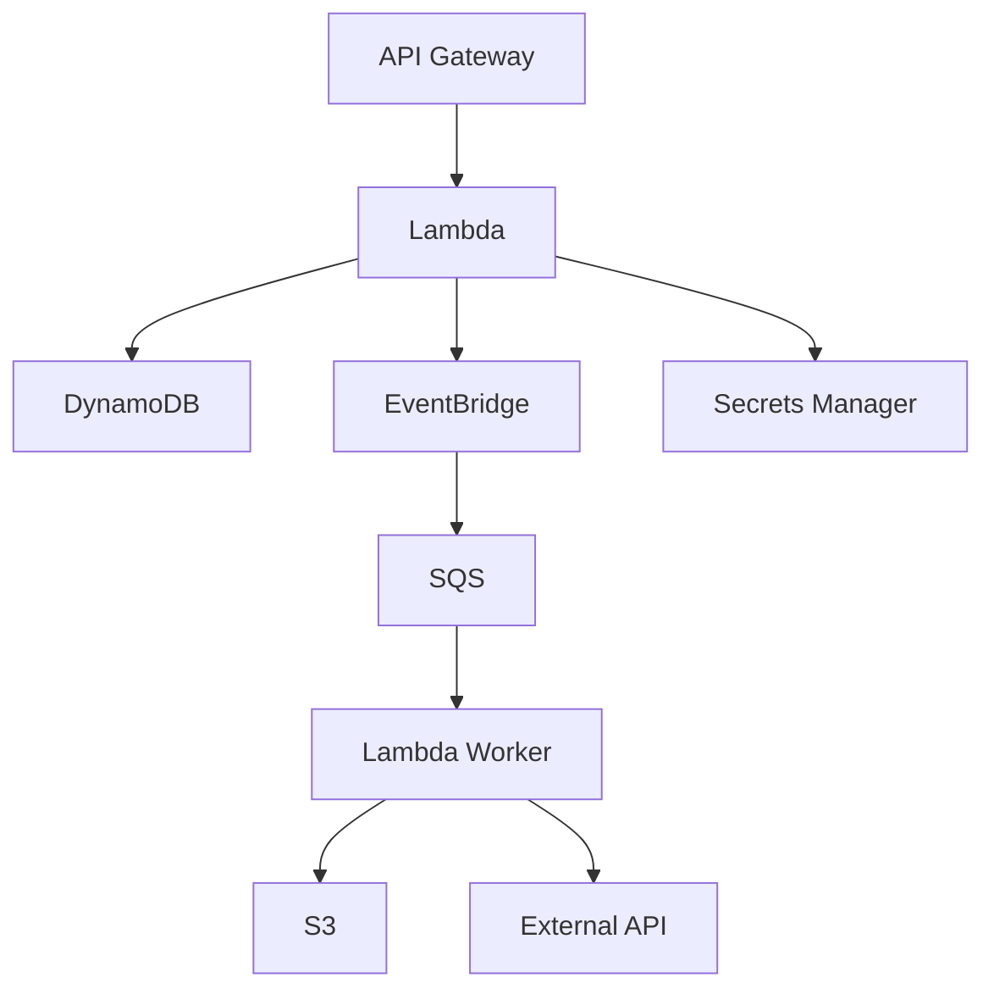
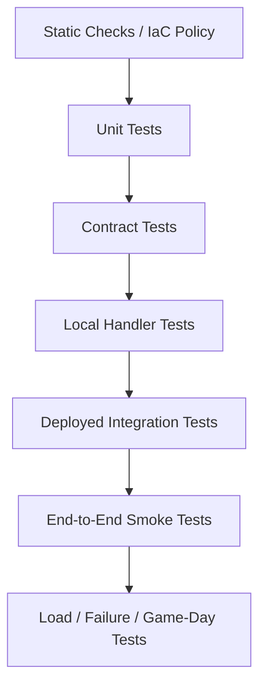
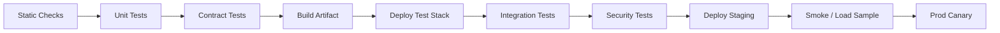

# Part 071 — Serverless Testing Strategy

Serverless systems fail in places local unit tests cannot see.

A Lambda handler can pass all unit tests and still fail because:

- IAM permission is missing;
- EventBridge rule pattern does not match;
- SQS visibility timeout is wrong;
- DynamoDB conditional write behavior is misunderstood;
- KMS key policy denies decrypt;
- VPC route has no NAT or endpoint;
- Step Functions task input path is wrong;
- API Gateway payload format is different from fixture;
- S3 notification filter does not fire;
- SNS filter policy drops messages;
- Lambda alias points to old version;
- AppConfig value is invalid;
- async failure destination is not configured;
- a retry duplicates a side effect.

Serverless testing must therefore be layered.

The goal is not to test AWS itself.

The goal is to prove that **your configuration, code, contracts, permissions, and failure semantics** work together.

---

## 1. Serverless Testing Mental Model

A serverless application is an integration graph.



Testing must cover:

- code correctness;
- event shape correctness;
- service integration correctness;
- identity/permission correctness;
- retry/idempotency correctness;
- deployment correctness;
- observability correctness;
- failure recovery correctness.

A strong test strategy asks:

```txt
What can fail at this boundary, and which test proves it?
```

---

## 2. The Serverless Testing Pyramid

Classic testing pyramid:

```txt
many unit tests
some integration tests
few end-to-end tests
```

Serverless needs a slightly different shape:



### Why This Shape?

Because many serverless bugs are not in Java methods.

They are in:

- IAM;
- resource policies;
- event source mappings;
- queue settings;
- API integration settings;
- state machine paths;
- VPC routes;
- KMS keys;
- deployment aliases;
- async retry paths.

Those require deployed tests.

Local tests are useful.

Deployed integration tests are mandatory.

---

## 3. Test Categories

| Test Type | Purpose |
|---|---|
| static checks | catch IaC/security/config mistakes before deploy |
| unit tests | validate pure logic quickly |
| event fixture tests | validate handler against real event shapes |
| contract tests | validate producer/consumer/API/schema compatibility |
| local integration tests | run handler locally with emulated/minimal services |
| deployed integration tests | prove AWS resources/permissions/integrations work |
| smoke tests | verify critical flows after deploy |
| load tests | prove capacity/concurrency/cost assumptions |
| failure tests | prove retry/DLQ/idempotency/runbooks |
| game days | prove people + system can recover |

A team that only has unit tests is not testing serverless behavior.

A team that only has end-to-end tests is too slow and fragile.

You need layers.

---

## 4. Unit Tests

Unit tests should cover pure logic.

Good targets:

- input validation;
- idempotency key generation;
- error classification;
- request/response mapping;
- authorization policy logic;
- domain state transitions;
- configuration parsing;
- retry decision logic;
- timeout budget calculation;
- event filtering logic;
- data transformation.

Example Java unit test:

```java
@Test
void idempotencyKeyUsesBusinessCommandIdNotLambdaRequestId() {
    CapturePaymentCommand command = new CapturePaymentCommand(
            "tenant-1",
            "pay-123",
            "cmd-456"
    );

    String key = IdempotencyKeys.capturePayment(command);

    assertEquals("tenant-1:CapturePayment:pay-123:cmd-456", key);
}
```

### What Unit Tests Should Avoid

- mocking every AWS service method until test verifies mock behavior only;
- testing AWS SDK internals;
- assuming IAM success;
- asserting implementation details of framework adapters;
- large brittle snapshots of entire payloads without semantic checks.

Unit tests should be fast, deterministic, and focused.

---

## 5. Handler Tests With Event Fixtures

Handlers should be tested using realistic event fixtures.

Examples:

```txt
events/api-gateway-http-v2-create-payment.json
events/sqs-order-created-batch.json
events/eventbridge-payment-captured-v1.json
events/s3-object-created-versioned.json
events/dynamodb-stream-insert.json
events/step-functions-task-input.json
```

### Why Fixtures Matter

AWS event shapes are precise.

A handler can work with your invented JSON but fail with real AWS event shape.

Fixture test example:

```java
@Test
void handlesSqsBatchWithOnePoisonMessage() throws Exception {
    SQSEvent event = Fixtures.readSqsEvent("events/sqs-batch-one-poison.json");

    SQSBatchResponse response = handler.handleRequest(event, testContext());

    assertThat(response.getBatchItemFailures())
            .extracting(SQSBatchResponse.BatchItemFailure::getItemIdentifier)
            .containsExactly("message-retryable-1");
}
```

### Fixture Guidelines

- store real examples from AWS docs or captured non-sensitive prod/staging events;
- redact sensitive data;
- version fixtures with schema;
- include malformed fixtures;
- include old schema versions;
- include duplicate events;
- include batch partial failure cases;
- include missing optional fields;
- include unexpected extra fields.

A fixture library becomes a contract asset.

---

## 6. Contract Tests

Serverless systems are event/API contract systems.

Contract tests prove producers and consumers agree.

### API Contract Tests

Validate:

- request schema;
- response schema;
- error envelope;
- status codes;
- auth claims;
- idempotency behavior;
- pagination;
- CORS where needed;
- backward compatibility.

### Event Contract Tests

Validate:

- `source`;
- `detail-type`;
- `schemaVersion`;
- required fields;
- event ID;
- correlation ID;
- aggregate ID/version;
- optional field handling;
- unsupported version behavior.

### Step Functions Task Contract Tests

Validate:

- state input to Lambda task;
- task output shape;
- error names;
- retryable/permanent error mapping;
- ResultPath/OutputPath assumptions.

### EventBridge Rule Contract Tests

Validate sample events against rule patterns.

Example intent:

```txt
OrderCreated v1 should match search-indexer rule.
PaymentCaptured should not match search-indexer rule.
OrderCreated test event from dev should not match prod rule.
```

Rule patterns are code. Test them.

---

## 7. Local Testing

AWS SAM CLI can test Lambda functions locally and invoke functions using event files.

Local testing is useful for:

- handler wiring;
- serialization/deserialization;
- quick debug;
- running event fixtures;
- testing API locally;
- validating packaging shape;
- checking environment variables;
- checking basic function behavior before deploy.

Local testing does not fully prove:

- IAM;
- VPC routes;
- KMS;
- Lambda scaling;
- async retry;
- event source mappings;
- EventBridge rules;
- SQS visibility timeout;
- CloudWatch/X-Ray behavior;
- provisioned concurrency;
- SnapStart;
- real service limits;
- exact AWS integration behavior.

### Local Testing Rule

```txt
Use local tests to shorten feedback loop.
Use deployed tests to prove cloud behavior.
```

Local emulation is not production.

---

## 8. Deployed Integration Tests

Deployed integration tests run against real AWS resources in an isolated environment.

They prove:

- IAM permissions;
- resource policies;
- event source mappings;
- event delivery;
- queues/DLQs;
- DynamoDB conditional writes;
- S3 notifications;
- Step Functions state transitions;
- Lambda aliases;
- VPC connectivity;
- Secrets Manager/KMS access;
- AppConfig retrieval;
- CloudWatch metrics/logs.

### Example: SQS Consumer Integration Test

```txt
1. send test message to queue
2. wait for worker result in DynamoDB/S3/event bus
3. assert message deleted
4. assert no DLQ message
5. assert idempotency record exists
6. send duplicate message
7. assert side effect not duplicated
```

### Example: EventBridge Integration Test

```txt
1. PutEvents with sample event
2. assert target SQS receives message
3. assert Lambda consumer processes
4. assert output state exists
5. assert wrong event sample does not route
```

### Example: S3 Workflow Integration Test

```txt
1. upload test object to incoming prefix
2. assert SQS receives event
3. assert worker processes object
4. assert output object created in processed prefix
5. assert metadata state updated
6. assert no recursive trigger
```

Deployed integration tests should run in CI against ephemeral or shared test stacks.

---

## 9. Ephemeral Test Environments

For serious teams, create isolated test stacks per branch/PR when feasible.

Benefits:

- tests run against real AWS;
- no shared-state pollution;
- safe destructive tests;
- IAM/resource policy validated;
- event paths tested;
- cleanup after run;
- parallel development.

Challenges:

- cost;
- account quotas;
- test duration;
- eventual consistency;
- naming collisions;
- cleanup failure;
- concurrency limits;
- test data management.

### Naming Strategy

```txt
service-pr-123-payments-api
service-pr-123-payment-events
service-pr-123-idempotency-table
```

Use TTL/lifecycle cleanup for orphan resources.

### When Ephemeral Is Too Expensive

Use shared integration environment with:

- test tenant IDs;
- deterministic resource prefixes;
- cleanup jobs;
- test isolation in data keys;
- serializing destructive tests;
- strong observability.

---

## 10. Test Data Management

Serverless integration tests must create and clean data safely.

Rules:

- use unique test run ID;
- tag resources/items with test ID;
- use TTL for temporary records;
- write to test-specific prefixes/queues/tables;
- do not use production tenant IDs;
- do not call real external provider in normal CI;
- do not send real SMS/email/payment;
- use sandbox providers;
- clean DLQs after assertion;
- preserve failure evidence for failed test runs.

Example test ID:

```txt
testRunId = it-20260706-abc123
```

Use in:

```txt
tenantId = test-tenant-it-20260706-abc123
S3 prefix = test/it-20260706-abc123/
DynamoDB PK = TEST#it-20260706-abc123#...
```

---

## 11. Testing Idempotency

Idempotency must be tested intentionally.

### Duplicate Sequential Test

```txt
send same event twice
expect one side effect
expect second returns success/duplicate
```

### Duplicate Concurrent Test

```txt
invoke two handlers concurrently with same idempotency key
expect one claims
expect one duplicate/in-progress
expect one side effect
```

### Ambiguous Commit Test

Simulate:

```txt
side effect succeeds
completion record fails
retry occurs
```

Expected:

- external idempotency key prevents duplicate side effect;
- reconciliation/lookup can recover;
- state becomes consistent.

### Redrive Test

```txt
process event
redrive/replay same event
expect no duplicate user-visible side effect
```

### Payload Conflict Test

```txt
same idempotency key
different payload hash
expect 409/security/error
```

Idempotency that is not tested is a hope.

---

## 12. Testing Retries and DLQs

Every async/queue/stream workflow needs failure tests.

### SQS DLQ Test

```txt
1. send poison message
2. consumer classifies/fails
3. after maxReceiveCount, message reaches DLQ
4. alarm fires or metric visible
5. redrive runbook can inspect message
```

### Partial Batch Test

```txt
batch contains:
  success message
  retryable failure message
  permanent poison message

expect:
  success deleted
  retryable returned as failed item
  poison quarantined or DLQ path according to policy
```

### Lambda Async Destination Test

```txt
1. invoke async with event causing controlled failure
2. verify retry behavior if practical
3. verify failure destination receives invocation record
4. verify alarm/dashboards
```

### Stream Poison Record Test

```txt
1. insert stream record that fails validation
2. verify bisect/partial failure/quarantine
3. verify iterator age does not grow indefinitely
```

Failure path tests are production safety tests.

---

## 13. Testing Timeouts

Timeouts are among the most dangerous failures because side effects may be ambiguous.

Test:

- downstream timeout;
- Lambda timeout;
- remaining-time cutoff;
- Step Functions task timeout;
- API Gateway integration timeout;
- SQS visibility timeout;
- external API slow response.

### Timeout Budget Test

```java
@Test
void refusesToStartPaymentWhenRemainingTimeTooLow() {
    Context context = new FakeContext(remainingMs = 1_000);

    assertThrows(RetryableTimeoutBudgetException.class,
            () -> handler.capturePayment(command, context));

    assertThat(paymentProvider.calls()).isZero();
}
```

### Deployed Timeout Test

Use a fake downstream endpoint that sleeps longer than configured timeout.

Expect:

- handler fails fast before Lambda timeout;
- error classified retryable;
- idempotency record state correct;
- no duplicate side effect;
- metrics/alarm visible.

Do not discover timeout behavior first in production.

---

## 14. Testing IAM and KMS

IAM/KMS tests must be deployed.

Examples:

- Lambda can read only required secret;
- Lambda cannot read unrelated secret;
- Lambda can decrypt specific KMS key;
- Lambda cannot put events to wrong bus;
- producer can send only to expected queue/topic;
- consumer can read/delete only expected queue;
- S3 presigned upload cannot write arbitrary prefix;
- cross-account EventBridge bus policy works;
- function URL/API invoke policy is restricted.

### Negative Permission Tests

Security posture needs negative tests.

Example:

```txt
attempt to read /prod/other-service/secret
expect AccessDenied
```

Do not overdo destructive tests in CI, but include critical permission boundaries.

---

## 15. Testing API Contracts

For API Gateway/Lambda APIs:

Test:

- success response;
- validation failure;
- unauthorized;
- forbidden;
- not found;
- conflict;
- idempotent duplicate;
- idempotency key conflict;
- rate limited;
- dependency unavailable;
- timeout mapping;
- CORS preflight;
- error envelope;
- correlation ID header;
- response schema.

### API Contract Example

```http
POST /payments
Idempotency-Key: test-key-123

201 Created
{
  "paymentId": "pay-123",
  "status": "CAPTURED"
}
```

Duplicate:

```http
POST /payments
Idempotency-Key: test-key-123

200/201
same business result
```

Same key different payload:

```http
409 Conflict
{
  "error": {
    "code": "IDEMPOTENCY_KEY_CONFLICT"
  }
}
```

Document and test the behavior.

---

## 16. Testing EventBridge Rules

EventBridge event pattern mistakes are common.

Test patterns with representative events:

- should match;
- should not match;
- old schema version;
- new schema version;
- wrong source;
- wrong environment;
- replay/test marker;
- high-volume ignored event.

### Pattern Test Table

| Event Fixture | Expected |
|---|---|
| `OrderCreated.v1.json` | match |
| `OrderCreated.v2.json` | match if supported |
| `PaymentCaptured.v1.json` | no match |
| `OrderCreated.dev.json` | no prod match |
| `OrderUpdated.v1.json` | no match |

Rule changes should fail CI if expectations break.

---

## 17. Testing Step Functions

Step Functions needs both definition tests and execution tests.

### Definition Tests

- ASL syntax valid;
- state names stable;
- required retries/catches exist;
- task ARNs point to aliases, not `$LATEST`;
- timeouts configured;
- Map concurrency capped;
- input/output paths valid with sample payloads.

### Execution Tests

Run deployed test execution:

```txt
start execution with sample input
wait for completion
assert states/results
assert Lambda tasks invoked
assert expected side effects
assert failure path for controlled error
```

### Error Path Tests

Test:

- retryable Lambda error;
- permanent business error;
- compensation path;
- callback timeout;
- Map item failure;
- redrive safety where possible.

A workflow whose happy path is tested but catch paths are not is incomplete.

---

## 18. Testing S3 Workflows

Test:

- presigned upload key boundary;
- valid upload triggers processing;
- invalid prefix ignored;
- large object behavior;
- checksum validation;
- versioned object idempotency;
- recursive trigger prevention;
- output prefix does not trigger same workflow;
- KMS decrypt/encrypt;
- lifecycle assumptions where relevant;
- DLQ path.

### Recursive Trigger Test

```txt
1. upload input object to incoming/
2. worker writes output to processed/
3. verify no second processing event for output
```

Add a handler guard test:

```txt
event with key processed/output.json -> ignored
```

---

## 19. Testing DynamoDB State

Test:

- conditional create;
- optimistic lock conflict;
- duplicate idempotency record;
- payload hash conflict;
- transaction cancellation classification;
- GSI query result;
- sparse index behavior;
- TTL attribute set;
- stream record produced;
- stream consumer idempotency;
- hot key load behavior under test volume.

### Concurrency Test

```txt
run N concurrent commands against same aggregate version
expect exactly one transition succeeds
others conflict/duplicate safely
```

This proves state boundary correctness.

---

## 20. Testing Configuration and Secrets

Test:

- required env vars exist;
- config schema valid;
- AppConfig/SSM retrieval works;
- stale config behavior;
- bad config rejected by validator;
- feature flag default safe;
- flag rollout changes behavior only for intended tenant;
- secret access works;
- secret value redacted in logs;
- secret rotation simulated;
- KMS deny path classified.

### Feature Flag Test

```txt
tenant A flag off -> old path
tenant B flag on -> new path
flag missing -> safe default off
```

### Secret Refresh Test

```txt
auth failure from provider -> refresh secret -> retry once if safe
```

---

## 21. Load Testing

Load tests prove capacity assumptions.

For Lambda APIs:

- p50/p95/p99 latency;
- cold start rate;
- provisioned concurrency spillover;
- Lambda throttles;
- API throttles;
- downstream latency;
- error rate;
- cost/log volume.

For SQS workers:

- queue age;
- messages/sec;
- Lambda concurrency;
- batch duration;
- DLQ;
- downstream latency;
- database connections.

For EventBridge/SNS fanout:

- publish rate;
- matched rules/subscriptions;
- delivery failures;
- target backlog;
- cost amplification.

### Load Test Rule

Do not load test Lambda alone if risk is downstream.

A load test with mocked database may prove only that your mock is fast.

---

## 22. Failure Testing

Failure tests prove the system handles known bad conditions.

Examples:

| Failure | Expected Behavior |
|---|---|
| downstream timeout | retryable error, no duplicate side effect |
| database throttle | backoff, queue backlog, alarm |
| poison message | quarantine/DLQ |
| Lambda throttle | async event age/backlog visible |
| KMS deny | fail fast, alarm |
| secret missing | safe failure |
| EventBridge target denied | DLQ/alarm |
| S3 KMS decrypt denied | processing failure classified |
| Step Functions task failure | retry/catch path |
| API dependency unavailable | 503 safe response |
| duplicate event | idempotent success |

Failure tests should be part of release readiness for critical workflows.

---

## 23. Testing Observability

Observability must be tested.

Assert that logs/metrics/traces include:

- correlation ID;
- event ID;
- Lambda request ID;
- function version;
- error code;
- idempotency status;
- config version;
- cold start marker;
- batch outcome;
- DLQ/failure metric;
- business metric.

### Observability Test Example

```txt
invoke handler with validation error
assert structured log contains error_code=VALIDATION_ERROR
assert metric ValidationFailureCount increments
assert response is 400
assert no secret in logs
```

### Alarm Tests

For critical systems:

- create controlled failure in staging;
- verify alarm fires;
- verify notification routes to owner;
- verify runbook link exists;
- verify alarm clears after recovery.

An untested alarm is a guess.

---

## 24. CI/CD Test Gates

Pipeline stages:



### Static Checks

- IaC lint;
- IAM policy analysis;
- no `$LATEST`;
- DLQ required;
- no public S3;
- no wildcard IAM without waiver;
- timeout/concurrency policy;
- EventBridge rule owner;
- SQS visibility > Lambda timeout;
- secrets not in env vars.

### Build Checks

- dependency tests;
- package size;
- SBOM;
- vulnerability scan;
- handler existence;
- architecture compatibility;
- image digest or ZIP checksum.

### Integration Gates

- API smoke;
- SQS processing;
- EventBridge routing;
- Step Functions execution;
- secret/config access;
- DynamoDB condition write;
- S3 notification.

CI should fail before production does.

---

## 25. Test Speed Strategy

Not every test runs at every stage.

| Stage | Tests |
|---|---|
| developer local | unit, fixture, SAM local |
| PR | static, unit, contract |
| merge | build, scan, integration in test env |
| staging deploy | smoke, deployed integration, small load |
| prod deploy | pre-traffic, canary, post-traffic |
| scheduled | failure tests, game-day, load, drift |

Fast tests protect developer loop.

Slow tests protect production.

Both are needed.

---

## 26. Test Doubles and Emulators

Use mocks and emulators carefully.

### Good Use

- unit tests of domain logic;
- local DynamoDB for query logic;
- localstack-style smoke for developer convenience;
- fake downstream provider for timeout/error tests;
- stub external SaaS API in CI;
- in-memory idempotency store for pure unit tests.

### Bad Use

- relying only on emulator for IAM;
- assuming local event source mapping equals AWS;
- testing retry behavior only with mock;
- testing VPC/KMS locally;
- testing EventBridge rule delivery locally only;
- testing Step Functions path with hand-written orchestrator mock.

Emulators speed development. They do not certify production integration.

---

## 27. Test Case Matrix

For every function/workflow, build a matrix.

Example Lambda SQS worker:

| Case | Expected |
|---|---|
| valid message | success |
| duplicate message | no duplicate side effect |
| malformed JSON | quarantine/DLQ |
| unsupported schema | quarantine |
| downstream timeout | retryable failure |
| downstream permanent rejection | terminal business failure |
| batch partial failure | only failed message retried |
| remaining time low | do not start side effect |
| idempotency store unavailable | fail safe |
| config missing | fail safe |
| secret denied | fail and alarm |

Example API command:

| Case | Expected |
|---|---|
| valid request | 201 |
| duplicate idempotency key same payload | same result |
| duplicate key different payload | 409 |
| unauthorized | 401/403 |
| invalid state | 409 |
| downstream unavailable | 503 |
| timeout budget low | 503/504 before side effect |
| response schema | valid |

This matrix becomes your engineering spec.

---

## 28. Game Days

Game days test system and team readiness.

Scenarios:

- SQS DLQ fills;
- EventBridge rule broken;
- Lambda alias rollback;
- DynamoDB conditional conflict spike;
- KMS deny;
- secret rotation failure;
- Step Functions compensation path;
- API latency spike;
- recursive S3 trigger;
- downstream provider outage;
- queue backlog recovery;
- replay/redrive after bug fix.

Game day questions:

- did alarms fire?
- did on-call know what to do?
- was runbook accurate?
- was blast radius contained?
- was recovery time acceptable?
- were duplicates safe?
- was evidence preserved?
- what automation/guardrail is missing?

Testing is not only for code. It is for operational muscle.

---

## 29. Common Anti-Patterns

### Anti-Pattern 1 — “Unit Tests Are Enough”

IAM, event routing, VPC, KMS, and async retry are untested.

### Anti-Pattern 2 — Only Happy Path End-to-End

No DLQ, timeout, duplicate, poison, or retry tests.

### Anti-Pattern 3 — Fake Event Shapes

Handler passes tests but fails real API Gateway/SQS/EventBridge event.

### Anti-Pattern 4 — No Contract Tests

Producer changes break consumers silently.

### Anti-Pattern 5 — No Deployed Integration Tests

Infrastructure bugs reach production.

### Anti-Pattern 6 — Load Test Without Downstream

Capacity result is meaningless.

### Anti-Pattern 7 — DLQ Not Tested

Failure path broken when needed.

### Anti-Pattern 8 — Observability Not Tested

During incident, fields/metrics are missing.

### Anti-Pattern 9 — Test Data in Shared Prod-Like Resources Without Isolation

Tests pollute state and create false incidents.

### Anti-Pattern 10 — Manual Console Testing as Release Gate

Unrepeatable and unauditable.

---

## 30. Production Testing Checklist

### Code

- [ ] Unit tests for domain logic.
- [ ] Handler fixture tests.
- [ ] Error classification tests.
- [ ] Idempotency tests.
- [ ] Timeout budget tests.
- [ ] Authorization tests.
- [ ] Config parsing tests.

### Contracts

- [ ] API contract tests.
- [ ] Event schema tests.
- [ ] EventBridge rule pattern tests.
- [ ] Step Functions task input/output tests.
- [ ] Consumer compatibility tests.

### Integration

- [ ] Deployed Lambda invocation.
- [ ] IAM/KMS access.
- [ ] SQS/SNS/EventBridge delivery.
- [ ] DynamoDB conditional write.
- [ ] S3 notification.
- [ ] Step Functions execution.
- [ ] Secrets/AppConfig retrieval.
- [ ] VPC connectivity if applicable.

### Failure

- [ ] Duplicate event.
- [ ] Retryable downstream error.
- [ ] Permanent poison event.
- [ ] Partial batch failure.
- [ ] DLQ path.
- [ ] Timeout.
- [ ] Throttle/backlog.
- [ ] Redrive/replay.
- [ ] Rollback.

### Operations

- [ ] Logs contain required fields.
- [ ] Metrics emitted.
- [ ] Alarms tested.
- [ ] Runbooks validated.
- [ ] Dashboards show expected signals.
- [ ] Test data cleanup.
- [ ] Cost impact understood.

---

## 31. Final Mental Model

Serverless testing is not about mocking AWS.

It is about proving the contracts between:

```txt
event sources
functions
permissions
state stores
queues
workflows
configuration
observability
failure paths
```

The correct question is not:

> “Does this handler work when called once?”

The correct question is:

> “Does this serverless workflow remain correct when events are duplicated, delayed, malformed, retried, throttled, redriven, deployed across versions, and partially failed?”

A top-tier serverless engineer builds tests that answer that question before production does.

---

## References

- AWS SAM Developer Guide: testing serverless applications with AWS SAM
- AWS SAM Developer Guide: `sam local` testing
- AWS Lambda Developer Guide: testing Lambda functions
- AWS Lambda Developer Guide: best practices and idempotent code
- AWS Lambda Developer Guide: retry behavior
- AWS Lambda Developer Guide: event source mappings and partial batch failure
- AWS Well-Architected Serverless Applications Lens
