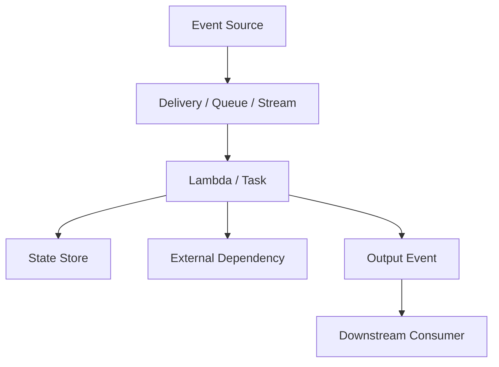
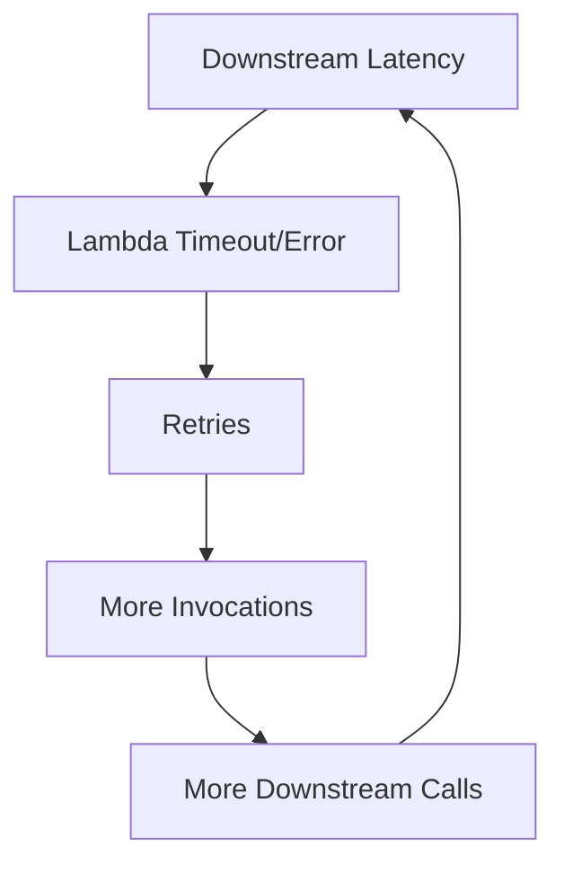
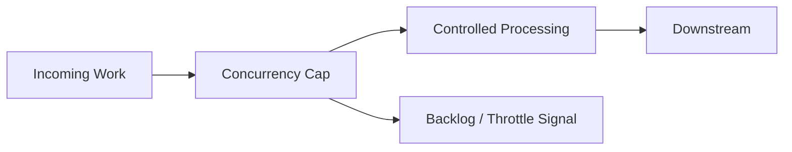
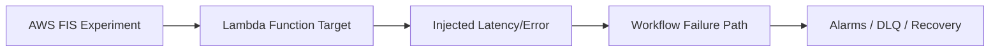

# Part 072 — Serverless Reliability and Failure Drills

Reliability is not the absence of failure.

Reliability is the system’s ability to continue or recover when failure happens.

Serverless systems fail differently from traditional server-based systems.

You may not patch hosts, but you still own:

- event loss/duplication handling;
- retry storms;
- throttling;
- queue backlog;
- DLQ recovery;
- poison records;
- dependency failure;
- database overload;
- IAM/KMS denial;
- config mistakes;
- deployment bugs;
- side-effect ambiguity;
- replay safety;
- business compensation;
- observability gaps.

The core reliability question is:

```txt
When this component fails, does the system degrade safely, preserve evidence, and recover without duplicating harmful side effects?
```

This part is about proving the answer.

---

## 1. Reliability Mental Model

Serverless reliability is a chain of managed and application-owned responsibilities.



Every arrow is a failure boundary.

For each boundary, ask:

- can delivery be duplicated?
- can delivery be delayed?
- can it be lost after retries?
- where does failure go?
- is there a DLQ/destination?
- can it be replayed?
- is replay safe?
- is side effect idempotent?
- can downstream absorb retries?
- what alarm detects it?
- what runbook repairs it?

Reliability is not a feature of one Lambda function. It is an emergent property of the workflow.

---

## 2. Failure-Mode Inventory

Create a failure-mode inventory for every critical workflow.

Example workflow:

```txt
API -> Lambda -> DynamoDB -> EventBridge -> SQS -> Lambda Worker -> External API
```

Failure modes:

| Component | Failure |
|---|---|
| API | throttled, auth failure, timeout |
| Lambda API | cold start spike, exception, timeout, IAM deny |
| DynamoDB | throttling, conditional conflict, KMS deny |
| EventBridge | PutEvents partial failure, rule mismatch, target failure |
| SQS | backlog, DLQ, visibility timeout misconfig |
| Worker Lambda | timeout, duplicate, poison message, throttled |
| External API | latency, 429, 500, ambiguous commit |
| Observability | missing correlation ID, alarm absent |
| Deployment | bad version, alias wrong, config bad |

For each failure, define:

```txt
detection
containment
recovery
data repair
owner
drill
```

If a failure mode has no detection, it is not controlled.

---

## 3. Reliability Invariants

Reliability starts with invariants.

Examples:

### Payment

```txt
A payment capture command must not charge the customer more than once.
```

### Audit

```txt
Every case decision must produce exactly one durable audit record per event ID.
```

### Notification

```txt
User-visible notifications may be retried but must dedupe by notification ID.
```

### Search Projection

```txt
Search index may lag but must eventually reflect latest aggregate version.
```

### File Processing

```txt
Each object version is processed at most once per processor version.
```

### Workflow

```txt
If shipment creation fails after payment capture, refund compensation must be attempted and visible.
```

Tests and drills should prove invariants.

Do not start with “Lambda should not error.”

Start with “business invariant must hold under failure.”

---

## 4. Retry Storms

Retries are useful.

Unbounded retries are incidents.

A retry storm happens when failure causes more work, which causes more failure.



### Retry Storm Sources

- async Lambda retry;
- SQS redelivery;
- stream batch retry;
- Step Functions retry;
- SDK retry;
- client retry;
- EventBridge/SNS target retry;
- operator redrive;
- workflow redrive;
- scheduled retry.

Multiple layers can retry the same operation.

### Reliability Rule

```txt
Every retry layer must have a budget.
```

Budget includes:

- max attempts;
- backoff;
- max event/record age;
- DLQ/failure destination;
- idempotency;
- downstream concurrency cap;
- alarm.

If five layers all retry three times, total attempts may explode.

---

## 5. Throttling as Protection

Throttling is sometimes an incident.

It is sometimes a safety mechanism.

Reserved concurrency, event source maximum concurrency, API throttles, and Step Functions Map concurrency can protect downstream systems.



### Good Throttling

- queue backlog grows but downstream remains healthy;
- API returns 429/503 before database melts;
- low-priority worker capped during incident;
- reserved concurrency set to 0 to stop damage;
- Map concurrency prevents mass external API calls.

### Bad Throttling

- critical API starved by noisy function;
- account concurrency exhausted;
- async event age grows unnoticed;
- queue age exceeds business SLA;
- stream iterator age grows for hours;
- throttles are not alarmed.

Reliability design distinguishes intentional backpressure from accidental starvation.

---

## 6. Backpressure Drills

Backpressure drill proves that queues and caps work.

### Drill: Downstream Slowness

Setup:

```txt
SQS -> Lambda Worker -> fake downstream
```

Inject downstream latency.

Expected:

- Lambda duration increases;
- queue age rises;
- concurrency caps at configured maximum;
- DLQ remains empty if downstream recovers in time;
- alarms fire when age exceeds threshold;
- downstream is not overloaded beyond cap.

### Drill Questions

- Did queue absorb burst?
- Did worker concurrency stay within safe limit?
- Did old messages exceed SLA?
- Did retries duplicate side effects?
- Did alarm route to owner?
- Did recovery drain backlog safely?
- Was cost/log volume acceptable?

If the system scales consumers indefinitely into a slow downstream, backpressure is missing.

---

## 7. DLQ Drills

DLQ must be tested before real failure.

### Drill: Poison Message

Inject a message that fails validation.

Expected:

- message not processed successfully;
- error classified as permanent;
- message reaches DLQ or quarantine;
- alarm fires;
- runbook identifies schema/error;
- redrive is blocked until fix or message marked non-retryable.

### Drill: Retryable Failure

Inject downstream timeout.

Expected:

- message retries;
- not immediately DLQ if transient policy allows;
- idempotency record handles duplicate attempts;
- eventually succeeds when downstream recovers or goes to DLQ after threshold;
- operator can inspect receive count.

### DLQ Readiness Checklist

- DLQ exists;
- DLQ encrypted if needed;
- DLQ alarm exists;
- DLQ owner exists;
- sample inspection possible;
- redrive permission controlled;
- redrive runbook tested;
- idempotency proof exists.

A DLQ that nobody knows how to redrive is a warehouse of unresolved incidents.

---

## 8. Replay and Redrive Safety Drills

Replay/redrive is one of the riskiest serverless operations.

### Drill: Replay Safe Event

1. process event successfully;
2. replay/redrive same event;
3. verify duplicate detected;
4. verify no duplicate side effect;
5. verify duplicate metric/log emitted.

### Drill: Replay With New Consumer Version

1. process events with old version;
2. deploy new consumer;
3. replay old events;
4. verify schema compatibility;
5. verify idempotency and projections.

### Drill: Redrive DLQ After Fix

1. send poison event to DLQ;
2. deploy fix;
3. redrive one message;
4. verify success;
5. redrive controlled batch;
6. monitor downstream.

### Redrive Stop Conditions

Stop redrive if:

- error rate rises;
- duplicate side effects detected;
- downstream latency high;
- queue age grows unexpectedly;
- DLQ receives same messages again;
- idempotency conflicts spike.

Redrive is not a one-click operation. It is a controlled recovery workflow.

---

## 9. Idempotency Failure Drill

Idempotency is central to reliability.

### Drill: Concurrent Duplicate

Invoke same command concurrently N times.

Expected:

- one operation claims idempotency;
- one side effect occurs;
- other attempts return duplicate/in-progress/controlled conflict;
- final state is correct.

### Drill: Timeout After Side Effect

Simulate:

```txt
external API accepts charge
Lambda times out before writing completed idempotency record
```

Expected:

- retry uses same external idempotency key;
- provider does not duplicate charge;
- reconciliation/lookup marks operation complete;
- alarm/log captures ambiguous commit.

### Drill: Payload Conflict

Same idempotency key with different payload.

Expected:

- operation rejected;
- no side effect;
- security/error metric emitted.

If a duplicate drill creates duplicate business side effects, reliability is not ready.

---

## 10. Dependency Failure Drills

Dependencies fail.

Drill them deliberately.

### External API Down

Expected:

- timeout is short;
- retryable error classified;
- queue backlog absorbs if async;
- API returns 503 if sync;
- circuit breaker/kill switch available;
- no runaway retries;
- no duplicate side effects.

### DynamoDB Throttling

Expected:

- SDK retries bounded;
- Lambda errors/backlog visible;
- worker concurrency can be reduced;
- hot key diagnosed;
- no data corruption.

### KMS Deny

Expected:

- function fails fast;
- alarm fires;
- error classified as `KMS_ACCESS_DENIED`;
- no secret value logged;
- runbook checks key policy/IAM.

### Secrets Manager Failure

Expected:

- cached value used if safe;
- stale TTL respected;
- secret refresh error metric emitted;
- fail closed for sensitive operations if no valid secret.

### S3 KMS/Object Deny

Expected:

- object processing failure classified;
- message goes DLQ/quarantine;
- no endless retry without alarm.

---

## 11. Lambda Fault Injection

AWS Fault Injection Service supports Lambda actions that can inject faults into selected Lambda functions. AWS documentation states Lambda FIS actions can inject faults into every invocation of selected Lambda function ARNs, with an `invocationPercentage` parameter to affect only a fraction of invocations.

Faults can be used to test:

- latency behavior;
- error handling;
- throttling-like application behavior;
- retry paths;
- DLQ/failure destinations;
- alarms;
- runbooks;
- client behavior.



### FIS Safety

Before running fault injection:

- run in non-prod first;
- define blast radius;
- target aliases/functions carefully;
- set stop conditions;
- notify on-call;
- ensure rollback/abort;
- monitor business metrics;
- avoid destructive side effects;
- use small invocation percentage first.

Chaos engineering without guardrails is just causing outages.

---

## 12. Step Functions Failure Drills

Step Functions makes failure paths explicit. Test them.

### Retry Drill

Task fails with retryable error.

Expected:

- retry policy applies;
- backoff works;
- max attempts respected;
- final success or catch path.

### Catch Drill

Task fails with permanent business error.

Expected:

- no retry if not configured;
- catch path executes;
- compensation/audit state written;
- execution status matches design.

### Callback Timeout Drill

Human/external callback never arrives.

Expected:

- timeout triggers;
- workflow moves to timeout handler;
- task token invalid after timeout;
- operator notification exists.

### Distributed Map Failure Drill

Some items fail.

Expected:

- item-level failures captured;
- tolerated failure threshold understood;
- downstream not overloaded;
- result writer/audit captures successes/failures.

### Redrive Drill

Failed Standard execution is redriven after fix where supported and appropriate.

Expected:

- tasks idempotent;
- duplicate side effects avoided;
- execution history clear.

---

## 13. EventBridge Failure Drills

### Rule Pattern Failure

Deploy/test event that should match but does not.

Expected:

- pattern test catches in CI;
- deployed synthetic test detects;
- runbook inspects rule and sample event.

### Target Permission Failure

Remove/deny target permission in staging.

Expected:

- EventBridge failed invocations metric;
- DLQ receives failed event if configured;
- alarm fires;
- runbook checks target policy.

### Replay Drill

Replay small archived time window.

Expected:

- consumers detect duplicates;
- downstream stays safe;
- replay status visible;
- no event loop.

### Event Loop Drill

Synthetic consumer emits event that might match same rule.

Expected:

- rule excludes derived event or handler guard prevents loop;
- loop detection metric/alarm exists.

---

## 14. S3 Workflow Failure Drills

### Recursive Trigger Drill

Ensure output object does not retrigger input processor.

Expected:

- output prefix ignored;
- invocation count stable;
- handler logs ignored output if synthetic event sent.

### Object Missing Drill

S3 event references object that no longer exists.

Expected:

- error classified;
- retry/quarantine based on policy;
- no infinite retry;
- metadata state marks missing.

### Large Object Drill

Upload object near max expected size.

Expected:

- processor streams/chunks;
- memory stable;
- `/tmp` sufficient if used;
- timeout safe;
- output correct.

### KMS Deny Drill

Processor cannot decrypt object.

Expected:

- failure classified;
- DLQ/quarantine;
- no secret/log leak;
- runbook checks key policy.

---

## 15. API Reliability Drills

### Dependency Slow

Fake downstream sleeps beyond budget.

Expected:

- handler timeout is lower than API timeout where appropriate;
- downstream client timeout triggers;
- API returns 503/504 safely;
- no side effect started with insufficient time;
- metrics show dependency latency.

### Client Retry Duplicate

Client sends same POST twice.

Expected:

- idempotency key produces same result;
- no duplicate write/payment/notification;
- logs show duplicate completed.

### Throttle Drill

Send traffic above API/Lambda safe capacity.

Expected:

- API throttles or Lambda reserved concurrency caps;
- downstream remains healthy;
- client receives documented 429/503;
- alarms fire if threshold exceeds design.

### Bad Auth/Authorization

Expected:

- unauthenticated returns 401;
- authenticated unauthorized returns 403;
- no business side effect;
- audit logs safe.

---

## 16. Reliability Scorecard

For each critical workflow, score 0–2.

| Area | 0 | 1 | 2 |
|---|---|---|---|
| idempotency | none | partial | tested under duplicate/concurrent/replay |
| DLQ/failure path | none | exists | alarmed + runbook tested |
| backpressure | none | queue/cap exists | capacity drill tested |
| retry policy | default/unbounded | configured | budgeted across layers |
| observability | logs only | dashboards | event-level reconstruction |
| deployment rollback | manual | alias/IaC | tested canary rollback |
| data repair | ad hoc | scripts | tested runbook/compensation |
| dependency failure | unknown | alarms | drill tested |
| config rollback | manual | AppConfig/IaC | tested |
| owner/runbook | unclear | documented | game-day validated |

A workflow with many 0s is not production-grade.

---

## 17. Reliability SLOs

Define SLOs by business outcome.

Examples:

### API

```txt
99.9% of POST /payments requests complete within 800ms excluding provider outage.
0 duplicate charges per quarter.
```

### Queue Worker

```txt
99% of invoice requests processed within 5 minutes.
DLQ messages investigated within 15 minutes.
```

### Stream Projection

```txt
Search projection lag p95 < 2 minutes.
Iterator age alarm at 5 minutes.
```

### File Workflow

```txt
95% of uploaded PDFs processed within 3 minutes.
Invalid files are quarantined within 1 minute.
```

### Audit

```txt
100% of case decision events create durable audit record or appear in critical DLQ.
```

SLOs must map to metrics and alarms.

---

## 18. Error Budget for Serverless

Error budget is not only HTTP errors.

For event-driven systems, budget includes:

- message age over SLA;
- DLQ messages;
- duplicate side effects;
- failed workflows;
- missed audit events;
- stale projections;
- unprocessed files;
- poison events unresolved;
- replay failures;
- compensation failures.

### Example

```txt
Invoice worker SLO:
99% processed within 5 minutes.

Budget burn:
age of oldest message > 5 minutes
or per-message processing delay > 5 minutes
```

A Lambda with zero errors can still violate SLO if queue age is high.

---

## 19. Graceful Degradation

Reliable systems degrade intentionally.

Examples:

| Failure | Degradation |
|---|---|
| search service down | writes continue, projection backlog builds |
| email provider down | notification queue backs up |
| analytics down | business transaction continues, analytics DLQ |
| fraud provider slow | route to manual review |
| report generation overloaded | return 202 and delay job |
| non-critical enrichment fails | skip enrichment and mark partial |
| payment provider down | reject new captures safely |

### Design Rule

```txt
Critical path and non-critical side effects should be separated.
```

Do not let analytics/email/search failure block payment/order/case transaction unless business requires it.

---

## 20. Bulkheads

Bulkheads isolate failure.

Serverless bulkheads:

- reserved concurrency per function;
- SQS queue per consumer;
- event source maximum concurrency;
- API throttles per route/client;
- Step Functions Map max concurrency;
- tenant-specific queues;
- separate event buses;
- separate DynamoDB tables/indexes for high-risk workloads;
- separate AWS accounts for environments/domains;
- separate DLQs;
- per-provider circuit breakers.

### Example

```txt
payment-worker reserved concurrency = 50
analytics-worker reserved concurrency = 10
audit-worker reserved concurrency = 30
```

Analytics cannot starve payments.

Bulkheads are reliability boundaries.

---

## 21. Circuit Breakers and Kill Switches

Circuit breaker stops calls to unhealthy dependency.

Kill switch disables risky behavior.

### Lambda Pattern

```txt
if providerDisabled flag:
    fail fast or route to queue/manual review
else:
    call provider with timeout
```

### Queue Consumer Pattern

If downstream down:

- reduce concurrency;
- set reserved concurrency to 0 if unsafe;
- leave messages in queue;
- alarm;
- resume after recovery.

### API Pattern

If dependency down:

- return 503 with retry guidance;
- do not enqueue work that cannot be processed if business cannot tolerate delay;
- use fallback where safe.

Circuit breakers must be observable and reversible.

---

## 22. Disaster Recovery for Serverless

DR design depends on state and event durability.

Questions:

- what is RTO/RPO?
- which region/account fails?
- where is state stored?
- are DynamoDB global tables used?
- are S3 buckets replicated?
- are event buses cross-region?
- are queues regional?
- can DLQs be recovered?
- are secrets/config replicated?
- can Lambda artifacts deploy to another region?
- are external providers region-aware?
- how is DNS/API failover handled?
- what about in-flight workflows?

### Serverless DR Layers

| Layer | DR Concern |
|---|---|
| Lambda code | artifact available in target region |
| API | custom domain/failover |
| DynamoDB | backup/global table/export |
| S3 | replication/versioning |
| SQS/SNS | regional messages not automatically global |
| EventBridge | events/archives regional |
| Step Functions | executions regional |
| Secrets/AppConfig | replication/deployment |
| IAM/KMS | regional/account policy |
| Observability | cross-region visibility |

Serverless DR is not automatic multi-region magic.

---

## 23. Backup and Restore Drills

Test restore, not only backup.

### DynamoDB

- PITR/backup restore to test table;
- validate item count/sample queries;
- validate GSI availability;
- validate application can read restored schema.

### S3

- restore deleted/overwritten object version;
- verify KMS access;
- restore archived object if lifecycle moved it;
- validate metadata/tags.

### Event Replay

- replay archived events to test bus;
- verify consumers idempotent;
- verify target rules.

### Step Functions

- decide whether failed workflows are redriven, restarted, or compensated;
- there is no simple “restore all in-flight business workflows” unless designed.

Backup without restore drill is faith.

---

## 24. Observability for Reliability

Reliability dashboards should show:

- SLO indicators;
- error budget burn;
- queue ages;
- DLQ depths;
- async event age;
- iterator age;
- throttles;
- concurrency saturation;
- p95/p99 duration;
- dependency latency;
- retry counts;
- idempotency duplicate/conflict;
- compensation failures;
- workflow failures;
- replay/redrive activity;
- deployment/config version.

### Event-Level Reconstruction

For any business event, answer:

```txt
where did it enter?
which version processed it?
was it retried?
was it duplicated?
what side effects happened?
where did it fail?
is it in DLQ?
can it be replayed?
```

If you cannot answer, observability is not reliability-grade.

---

## 25. Incident Evidence Preservation

During incident, preserve evidence before repair.

Evidence:

- DLQ sample messages;
- failed event payloads/references;
- Lambda logs;
- Step Functions execution history;
- EventBridge replay/rule metadata;
- SQS receive counts;
- DynamoDB idempotency records;
- config/AppConfig version;
- deployment version/alias;
- CloudTrail changes;
- downstream error logs.

Do not delete DLQ messages or overwrite state before capturing enough information.

Evidence enables safe repair and postmortem.

---

## 26. Reliability Runbook Template

Every critical workflow should have a runbook:

```yaml
workflow: payment-capture
owner: payments-platform
slo:
  - duplicate_charges: zero
  - p95_api_latency: 800ms
entrypoints:
  - API Gateway POST /payments
  - SQS payment-capture-queue
state:
  - DynamoDB payments table
  - idempotency table
dependencies:
  - payment provider
  - EventBridge payment bus
failure_modes:
  - provider timeout
  - duplicate command
  - DynamoDB throttle
  - SQS DLQ
  - Lambda timeout
alarms:
  - payment_api_5xx
  - payment_worker_dlq
  - duplicate_payment_metric
emergency_actions:
  - disable new provider flag
  - set worker reserved concurrency to 0
  - rollback Lambda alias
redrive:
  - runbook/payment-redrive.md
drills:
  - duplicate command quarterly
  - provider timeout quarterly
  - DLQ redrive quarterly
```

Runbooks must be executable, not essays.

---

## 27. Game-Day Program

Start small.

### Monthly Small Drill

- one workflow;
- one failure mode;
- staging environment;
- validate alarm/runbook.

### Quarterly Production-Safe Drill

- low blast radius;
- business-approved;
- stop conditions;
- on-call present;
- post-drill review.

### Annual DR Drill

- restore data;
- region/account failover simulation;
- replay events;
- validate RTO/RPO assumptions.

### Drill Report

Record:

- what was tested;
- expected vs actual;
- detection time;
- recovery time;
- missing alarms;
- incorrect runbook steps;
- data side effects;
- action items.

Reliability improves through repeated practice.

---

## 28. AWS Fault Injection Service Experiment Design

For AWS FIS experiments:

1. Define hypothesis.
2. Define target.
3. Define action.
4. Define blast radius.
5. Define stop conditions.
6. Define metrics.
7. Notify stakeholders.
8. Run in non-prod.
9. Run controlled prod if approved.
10. Review results.

### Example Hypothesis

```txt
If 10% of payment-worker Lambda invocations fail for 10 minutes,
messages will retry, DLQ remains below threshold,
payment provider will not receive duplicate captures,
and alarms will fire within 5 minutes.
```

### Stop Conditions

- duplicate payment metric > 0;
- DLQ depth > threshold;
- API error rate > threshold;
- downstream latency > threshold;
- manual operator stop.

Fault injection without hypothesis is noise.

---

## 29. Reliability Anti-Patterns

### Anti-Pattern 1 — “AWS Manages Reliability”

AWS manages infrastructure. You manage workflow correctness.

### Anti-Pattern 2 — No DLQ Drill

Failure path breaks when first needed.

### Anti-Pattern 3 — Retry Everywhere

Retry storm multiplies failure.

### Anti-Pattern 4 — No Idempotency Under Redrive

Recovery creates duplicate side effects.

### Anti-Pattern 5 — Raising Concurrency During Downstream Failure

You amplify the incident.

### Anti-Pattern 6 — Queue Backlog Without Age SLO

Backlog may be invisible business failure.

### Anti-Pattern 7 — No Stop Button

No reserved concurrency brake, no kill switch, no rule disable runbook.

### Anti-Pattern 8 — Observability Only Shows Lambda Errors

Async event age, DLQ, iterator age, and business outcomes missing.

### Anti-Pattern 9 — DR Assumed Because Service Is Managed

State, events, queues, workflows, and secrets remain regional/design-specific.

### Anti-Pattern 10 — Game Days Only After Incidents

Practice happens when stakes are highest.

---

## 30. Reliability Checklist

### Workflow

- [ ] Business invariants defined.
- [ ] Critical/non-critical paths separated.
- [ ] Idempotency tested.
- [ ] Retry budget defined across layers.
- [ ] DLQ/failure destination configured.
- [ ] Replay/redrive safe.
- [ ] Compensation defined where needed.

### Capacity

- [ ] Reserved concurrency/bulkheads.
- [ ] Event source max concurrency.
- [ ] API throttles.
- [ ] Queue age alarms.
- [ ] Downstream safe capacity known.
- [ ] Load/backpressure drill completed.

### Failure

- [ ] Poison message strategy.
- [ ] Dependency failure strategy.
- [ ] Timeout budget.
- [ ] KMS/secret/config failure behavior.
- [ ] Deployment rollback tested.
- [ ] Stop button documented.

### Observability

- [ ] Correlation/event IDs.
- [ ] DLQ dashboards.
- [ ] Async event age.
- [ ] Iterator age.
- [ ] Retry counts.
- [ ] Business SLO metrics.
- [ ] Deployment/config version in logs.
- [ ] Runbook links.

### Operations

- [ ] Runbooks tested.
- [ ] Game-day schedule.
- [ ] Backup/restore drill.
- [ ] FIS experiments designed where useful.
- [ ] Post-drill action items tracked.
- [ ] On-call trained.

---

## 31. Final Mental Model

Serverless reliability is not guaranteed by using managed services.

It is built by composing managed services with explicit failure contracts:

```txt
bounded retries
durable queues
idempotent handlers
DLQs
backpressure
bulkheads
timeouts
compensation
observability
tested runbooks
```

A reliable serverless system does not promise failure will not happen.

It promises:

```txt
failure is detected,
damage is contained,
evidence is preserved,
side effects are safe,
and recovery is practiced.
```

A top-tier engineer does not ask:

> “Is this serverless service highly available?”

They ask:

> “When this workflow fails in the worst realistic way, what prevents duplicate harm, what alarm fires, what queue stores the evidence, what runbook restores service, and how recently have we tested it?”

That is serverless reliability engineering.

---

## References

- AWS Well-Architected Framework: Reliability Pillar
- AWS Well-Architected Serverless Applications Lens: Reliability
- AWS Lambda Developer Guide: retry behavior
- AWS Lambda Developer Guide: best practices and idempotency
- AWS Lambda Developer Guide: event source mapping failure handling
- AWS Fault Injection Service documentation
- AWS FIS documentation: Lambda function fault injection actions
- AWS Resilience Hub documentation: managing FIS experiments
