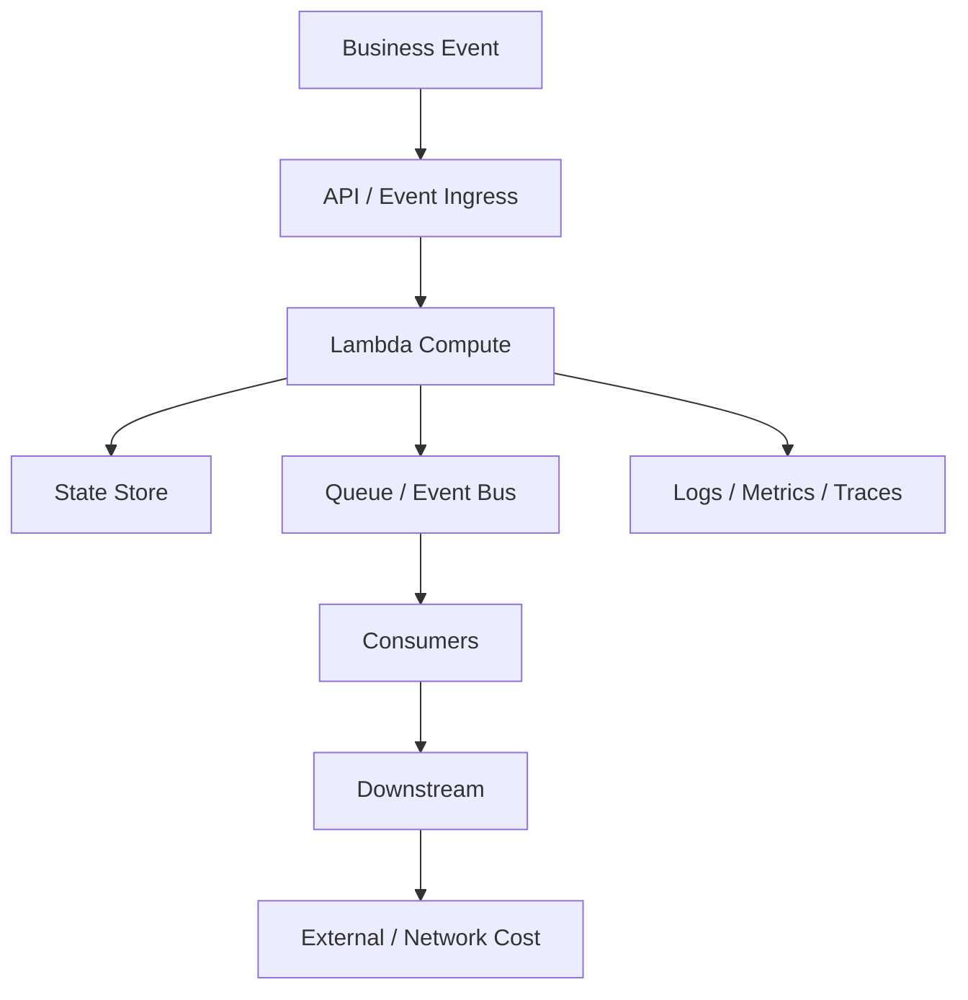
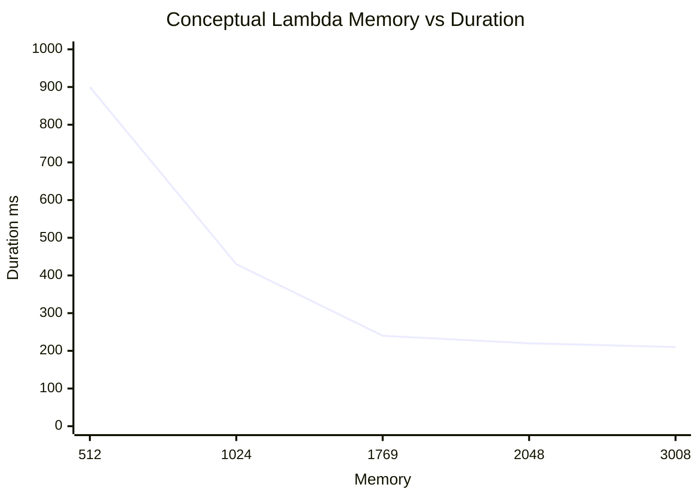
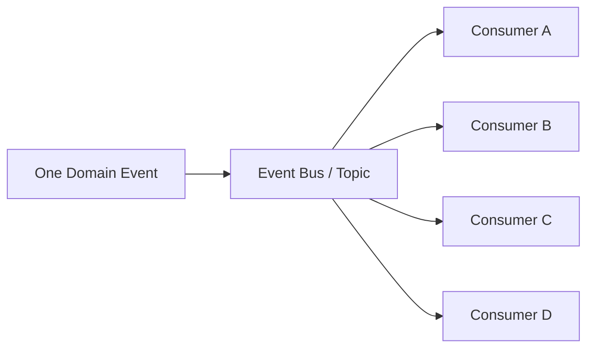

# Part 073 — Serverless Cost Engineering and FinOps

Serverless makes cost more granular.

That is both good and dangerous.

Good:

```txt
you pay close to usage
idle capacity can approach zero
small workloads are cheap
cost can map to business activity
```

Dangerous:

```txt
retries multiply silently
logs can exceed compute cost
fanout amplifies downstream cost
provisioned concurrency charges while idle
NAT data processing hides behind VPC design
queues can store failure for weeks
DynamoDB indexes multiply write cost
Step Functions can charge per transition/workflow shape
```

A weak serverless cost model says:

> “Lambda is cheap.”

A production serverless cost model says:

> “What is the cost per successful business outcome, including retries, logs, event routing, state writes, queues, storage, network, and failure recovery?”

That is the FinOps question.

---

## 1. Cost Engineering Mental Model

Cost is a system property.



The unit is not:

```txt
one Lambda invocation
```

The unit is:

```txt
one completed business operation
```

Examples:

- cost per payment captured;
- cost per document processed;
- cost per case escalation;
- cost per invoice generated;
- cost per million events routed;
- cost per search projection update;
- cost per API request;
- cost per workflow completed.

Serverless cost engineering is unit economics plus architecture.

---

## 2. AWS Cost Optimization Principles

AWS Well-Architected defines cost optimization as running systems to deliver business value at the lowest price point. The Cost Optimization pillar emphasizes Cloud Financial Management, consumption models, measuring efficiency, and continual improvement.

For serverless, that means:

- cost visibility by workload/team/tenant/feature;
- usage-based architecture decisions;
- continuous optimization, not one-time tuning;
- right service for the workload;
- waste elimination;
- feedback loops to engineers;
- cost-aware reliability decisions;
- cost-aware observability;
- cost-aware replay/redrive;
- cost-aware deployment guardrails.

Cost optimization is not “make everything cheaper.”

It is:

```txt
achieve business outcome with acceptable reliability, security, performance, and cost
```

A system can be cheap and unacceptable.

A system can be expensive and justified.

The question is whether cost is intentional.

---

## 3. Lambda Cost Model

Lambda cost is driven primarily by:

- number of requests;
- duration;
- configured memory;
- architecture/runtime pricing differences where applicable;
- ephemeral storage above included amount;
- provisioned concurrency;
- SnapStart restoration/cache pricing if applicable to runtime/region/pricing model;
- logs/traces generated by function;
- downstream services called by function;
- retries/duplicates.

Core compute intuition:

```txt
compute cost ∝ invocations × duration × configured memory
```

This creates a trade-off:

```txt
more memory can reduce duration
reduced duration can reduce or increase total cost depending curve
```

### Memory-Duration Curve



The cost optimum may not be the lowest memory.

For CPU-bound Java functions, increasing memory can reduce duration substantially.

For network-bound functions, memory may not help much.

### Tuning Rule

```txt
measure memory-duration-cost curve with representative traffic
```

Do not guess.

---

## 4. Lambda Provisioned Concurrency Cost

Provisioned concurrency reduces cold start by keeping execution environments initialized.

It also creates always-on cost.

Use when:

- latency SLO requires it;
- traffic pattern is predictable;
- cold starts materially hurt user experience;
- SnapStart or optimization is insufficient;
- scheduled scaling can match peaks.

Avoid when:

- traffic is sporadic;
- async workload does not need low cold latency;
- provisioned capacity is mostly idle;
- cold start can be solved by SnapStart/dependency tuning;
- API can tolerate initial latency.

### Provisioned Concurrency Cost Trap

```txt
provisioned concurrency = 100
memory = 1536 MB
enabled 24/7
traffic peak = 2 hours/day
```

You may pay for idle readiness most of the day.

Better:

- scheduled provisioned concurrency;
- application autoscaling policy;
- SnapStart for Java where compatible;
- lower provisioned baseline plus on-demand burst;
- async queue for non-latency-critical work.

Provisioned concurrency is a latency product. Buy it only where latency value justifies it.

---

## 5. Lambda Ephemeral Storage Cost

Lambda includes a default `/tmp` ephemeral storage amount. Additional configured ephemeral storage can add cost depending pricing model and usage.

Use larger ephemeral storage when needed:

- image/PDF/video processing;
- large decompression;
- temporary model files;
- sort/merge jobs;
- libraries requiring file paths.

Do not increase `/tmp` blindly.

Cost and performance questions:

- is the object too large for Lambda?
- can the code stream instead of download?
- should the workflow use ECS/Batch?
- does temporary file cleanup work?
- is processing retried and re-downloading large object?
- is S3 range read better?
- is Step Functions chunking better?

Bigger `/tmp` is a tool, not a workload architecture.

---

## 6. Logs, Metrics, and Traces Cost

Observability can cost more than compute.

Cost drivers:

- log ingestion volume;
- log retention duration;
- verbose framework logs;
- full payload logging;
- large stack traces;
- high-cardinality custom metrics;
- trace sampling rate;
- telemetry extensions;
- duplicate telemetry to many vendors;
- retry storms generating repeated logs;
- debug logs left on in production.

### Log Cost Anti-Pattern

```txt
function cost: $80/month
CloudWatch log ingestion: $900/month
```

This happens when every invocation logs full payloads.

### Logging Policy

Use:

- structured logs;
- concise outcome logs;
- error logs always;
- sampled success detail at high volume;
- no full payloads;
- no secrets/PII;
- log retention per workload;
- dynamic log level with safe defaults;
- metric dimensions governed.

### Retention

Set log retention explicitly.

Do not leave every log group at indefinite retention by accident.

Retention is a compliance and cost decision.

---

## 7. Retry and Duplicate Cost

Retries multiply cost.

One business event may create:

```txt
producer retry
EventBridge target retry
Lambda async retry
SQS redelivery
SDK retry
Step Functions retry
operator redrive
```

### Attempt Multiplication

If a workflow has:

```txt
client retry: 3
Lambda retry: 3
SDK retry: 3
Step Functions retry: 3
```

Worst-case attempts can multiply.

This affects:

- Lambda cost;
- API calls;
- external provider cost;
- logs;
- queue volume;
- state writes;
- user-visible duplicates;
- incident duration.

### Cost Optimization Rule

```txt
Correct retry budgets reduce both cost and failure blast radius.
```

Cost engineering and reliability engineering are linked.

---

## 8. Event Fanout Cost

EventBridge/SNS fanout can amplify cost.



One event becomes many target deliveries.

Each target may invoke:

- Lambda;
- SQS;
- Step Functions;
- DynamoDB;
- external API;
- logs/traces.

### Fanout Cost Equation

```txt
event_cost = publish_cost + Σ(target_delivery + target_processing + target_downstream + telemetry)
```

A new consumer is not free.

It may be cheap, but it has a cost owner.

### Controls

- precise EventBridge rules;
- SNS filter policies;
- SQS buffer for heavy consumers;
- consumer owner tags;
- target-level cost allocation;
- archive only needed events;
- sample high-volume analytics events;
- avoid catch-all rules;
- review fanout changes like production cost changes.

---

## 9. API Gateway and Front Door Cost

API front door choices affect cost.

Cost drivers:

- API request count;
- REST API vs HTTP API product choice;
- custom authorizer Lambda invocations;
- WAF requests/rules;
- caching;
- data transfer;
- logs/access logs;
- CloudFront if used;
- integration errors/retries;
- request/response payload size.

### Authorizer Cost

A Lambda authorizer called on every request can be expensive and latency-heavy.

Mitigations:

- authorizer caching where safe;
- JWT authorizers for HTTP API where applicable;
- IAM auth for trusted service calls;
- push authorization to application only where appropriate;
- avoid over-fetching identity data per request.

### API Logging Cost

Access logs are useful.

But logging full request/response bodies is usually dangerous and expensive.

Use structured access logs with:

- route;
- status;
- latency;
- request ID;
- caller/tenant class if safe;
- integration latency;
- error code.

---

## 10. SQS/SNS/EventBridge Cost Model

### SQS

Cost drivers:

- requests;
- payload size chunks;
- long polling efficiency;
- encryption/KMS;
- queue retention;
- DLQ storage;
- Lambda invokes from event source;
- redrive;
- logs from consumers.

Optimization:

- batch messages;
- long polling for custom consumers;
- avoid tiny chatty messages where batching fits;
- DLQ alarms to prevent retention waste;
- right retention period;
- avoid retry storms.

### SNS

Cost drivers:

- publishes;
- deliveries per subscription;
- protocol-specific delivery;
- SMS/mobile/email costs;
- filter policy behavior;
- delivery retries;
- subscription DLQ;
- downstream consumers.

Optimization:

- use filters;
- avoid unnecessary subscriptions;
- SQS per critical consumer;
- idempotency to reduce duplicate user notifications;
- monitor SMS/email spend.

### EventBridge

Cost drivers:

- events published;
- matched rules/deliveries;
- archives;
- replay;
- Pipes;
- Scheduler;
- API destinations;
- targets and downstream.

Optimization:

- precise rules;
- avoid high-volume catch-all;
- archive only useful events;
- transform/minimize payload;
- route heavy consumers through SQS;
- monitor matched events per rule.

---

## 11. Step Functions Cost Model

Step Functions cost depends on workflow type and shape.

Cost drivers:

- state transitions for Standard workflows;
- request/duration/memory for Express workflows;
- retries;
- loops;
- Map/Distributed Map;
- child executions;
- Lambda/service calls;
- logs/tracing;
- workflow history volume;
- redrive/replay.

### State Explosion

A state machine with many tiny states may be operationally clear but can cost more.

A Lambda with too many hidden steps may be cheaper but less reliable.

Optimize after choosing correct reliability boundary.

### Direct Service Integration

Remove Lambda glue when it only wraps an AWS API call.

Example:

```txt
Step Functions -> Lambda -> SQS SendMessage
```

can often become:

```txt
Step Functions -> SQS SendMessage
```

This saves:

- Lambda invocation;
- cold start;
- IAM/runtime dependency;
- logs;
- failure surface.

But do not remove Lambda if custom validation/domain logic is required.

---

## 12. DynamoDB Cost Model

DynamoDB cost drivers:

- read/write request units;
- item size;
- strong vs eventual consistency;
- transactions;
- GSIs;
- Streams;
- global tables;
- backups/PITR;
- storage;
- exports/imports;
- retries/throttling;
- scans.

### Cost Anti-Patterns

- scan in API path;
- large item read for small field;
- over-projected GSIs;
- too many GSIs on write-heavy table;
- hot key causing throttled retries;
- transactions for simple single-item operations;
- global table replication for data that does not need it;
- storing blobs instead of S3 references.

### Optimization

- access-pattern-first keys;
- sparse indexes;
- projection only needed fields;
- use Query not Scan;
- tune item size;
- TTL for ephemeral records;
- choose on-demand vs provisioned deliberately;
- reduce retries by fixing hot partitions.

DynamoDB cost optimization is mostly data model optimization.

---

## 13. S3 Cost Model

S3 cost drivers:

- storage size;
- storage class;
- request count;
- lifecycle transitions;
- retrieval fees;
- data transfer;
- replication;
- KMS requests;
- event processing;
- inventory/batch operations;
- object tags;
- many small objects;
- failed recursive triggers.

### Optimization

- lifecycle policies;
- expire temporary uploads;
- abort incomplete multipart uploads;
- transition cold data deliberately;
- avoid moving hot data to cold classes too early;
- store large data in S3, not Lambda payloads/DynamoDB;
- use presigned uploads;
- avoid repeated full downloads in retries;
- stream/range read;
- use S3 Inventory/Batch for large repair jobs.

S3 can be very cheap or surprisingly expensive depending request/retrieval pattern.

---

## 14. VPC Networking Cost

Serverless VPC design can create hidden costs.

Cost drivers:

- NAT gateway hourly cost;
- NAT data processing;
- cross-AZ NAT traffic;
- interface endpoint hourly cost;
- interface endpoint data processing;
- data transfer;
- private link/API destination paths;
- retries through NAT;
- high-volume AWS API calls through NAT instead of endpoints.

### NAT Trap

A VPC-attached Lambda reads S3 heavily through NAT instead of S3 gateway endpoint.

Result:

```txt
unnecessary NAT data processing cost
```

### Endpoint Trap

Team creates interface endpoints for every service in every AZ for low-volume functions.

Result:

```txt
endpoint hourly cost exceeds avoided NAT/API path cost
```

### Decision

Use traffic math.

```txt
low-volume public/SaaS egress -> NAT may be fine
high-volume S3/DynamoDB from VPC -> gateway endpoint likely better
frequent AWS API private path -> interface endpoint may be justified
no private resource needed -> avoid VPC attachment
```

Network cost is architecture cost.

---

## 15. Container vs Lambda Cost Decision

Sometimes Lambda is not the cheapest or best compute.

Lambda works well for:

- bursty work;
- short execution;
- event-driven tasks;
- unpredictable traffic;
- low idle need;
- simple horizontal scaling.

ECS/Fargate/EKS/App Runner may be better for:

- sustained high utilization;
- long-running workers;
- connection-heavy services;
- stable CPU-bound workloads;
- high memory workloads;
- always-on APIs;
- custom runtime/host needs;
- heavy Kafka consumers.

### Utilization Question

```txt
Is this workload idle often or busy most of the time?
```

If mostly idle, Lambda often wins.

If constantly busy at high volume, container/server-based economics may win.

### Engineering Rule

Use total cost:

```txt
compute + operations + reliability + scaling + platform complexity + team skill
```

Cheapest bill is not always cheapest business cost.

---

## 16. Unit Economics

Define business cost metrics.

Examples:

```txt
cost per 1,000 API requests
cost per successful payment
cost per invoice generated
cost per document processed
cost per million domain events
cost per workflow execution
cost per tenant per day
cost per GB ingested
cost per case lifecycle
```

### Example: Document Processing

Cost includes:

- presigned upload API;
- S3 PUT/storage;
- S3 event notification;
- SQS message;
- Lambda validation;
- Step Functions workflow;
- OCR Lambda/ECS/managed service;
- DynamoDB metadata writes;
- EventBridge output event;
- logs/traces;
- retries/failures;
- output storage;
- lifecycle retention.

Unit cost:

```txt
total monthly workflow cost / successfully processed documents
```

This is more useful than “Lambda cost.”

---

## 17. Cost Allocation

Use:

- AWS tags;
- cost categories;
- account boundaries;
- resource naming;
- CloudWatch metrics;
- CUR/Athena/QuickSight;
- budgets;
- service-level dashboards;
- tenant attribution where applicable.

### Required Tags

```yaml
Service: payments
Owner: payments-platform
Environment: prod
CostCenter: finops-123
Criticality: high
DataClassification: confidential
ManagedBy: iac
```

For serverless, tagging gaps can happen with generated resources, log groups, versions, and event targets.

Ensure platform tooling applies tags consistently.

### Tenant Cost

Tenant-level cost is harder because AWS bill is resource-level.

Approaches:

- application metrics per tenant;
- request/event counts per tenant;
- approximate allocation by usage;
- dedicated queues/tables for high-value tenants if needed;
- cost attribution logs.

Do not over-engineer tenant cost unless business needs it.

---

## 18. Budgets and Anomaly Detection

Use budgets and anomaly detection for:

- workload-level spend;
- service-level spend;
- environment spend;
- log ingestion spike;
- NAT gateway spike;
- Lambda invocation spike;
- Step Functions transition spike;
- S3 storage/retrieval spike;
- DynamoDB throttling/retry cost;
- SMS/email spend.

### Budget Types

- monthly budget;
- daily burn-rate budget;
- forecasted budget;
- service-specific budget;
- tag/cost-category budget.

### Anomaly Questions

When cost spikes:

1. Which service?
2. Which resource/tag?
3. Traffic increase or bug?
4. Retries?
5. New fanout target?
6. Logging level changed?
7. Recursive S3 trigger?
8. DLQ/backlog?
9. Deployment/config change?
10. Attack/abuse?

Cost anomaly is often a reliability/security signal.

---

## 19. Cost-Aware Observability

Observability must be effective and sustainable.

### Logging Rules

- no full payloads by default;
- sample high-volume successes;
- always log errors and state transitions;
- structured fields;
- retention policy;
- redact PII/secrets;
- avoid DEBUG in prod;
- alert on log ingestion spike.

### Metrics Rules

- low-cardinality dimensions;
- business metrics for unit economics;
- high-cardinality data in logs, not metrics;
- avoid custom metric explosion;
- metric namespaces by service/domain.

### Tracing Rules

- sample deliberately;
- always capture errors where possible;
- evaluate extension overhead;
- avoid duplicating traces to many vendors unnecessarily;
- propagate correlation IDs even when trace sampling skips.

Cost-aware observability is not less observability. It is higher signal per dollar.

---

## 20. Cost-Aware Reliability

Reliability mechanisms cost money.

Examples:

- DLQs store messages;
- retries invoke compute;
- provisioned concurrency buys readiness;
- global tables replicate writes;
- S3 versioning stores old versions;
- EventBridge archive stores events;
- Step Functions Standard stores execution history;
- multi-region doubles infrastructure;
- backups/PITR cost money.

Do not disable them blindly.

Ask:

```txt
What business loss does this reliability control prevent?
```

Examples:

| Control | Cost Justification |
|---|---|
| idempotency table | prevents duplicate payments |
| audit DLQ | prevents compliance failure |
| provisioned concurrency | protects checkout p99 latency |
| S3 versioning | protects evidence/documents |
| EventBridge archive | enables replay after bug |
| global tables | meets regional RTO/RPO |
| Step Functions | reduces manual recovery and ambiguity |

Cost optimization that removes reliability controls can increase business risk.

---

## 21. Cost-Aware Security

Security controls also cost money.

Examples:

- KMS requests;
- CloudTrail data events;
- VPC endpoints;
- WAF;
- GuardDuty/Security services;
- detailed logs;
- private networking;
- object lock/retention;
- vulnerability scanning.

Security cost should map to risk.

Do not turn off critical security logging because it costs money without understanding risk.

Optimize by:

- scoping logs to sensitive buckets;
- sampling where safe;
- using lifecycle retention;
- minimizing payloads;
- reducing unnecessary decrypt calls through caching;
- using endpoint/NAT math;
- separating high-risk workloads.

---

## 22. Cost Review Cadence

Cost optimization is continual.

Cadence:

### Daily/Weekly

- anomaly alerts;
- top spend changes;
- log spike;
- runaway queue/retry;
- NAT/SMS spikes.

### Monthly

- top services/resources by workload;
- unit cost trend;
- unused resources;
- provisioned concurrency utilization;
- Step Functions transition count;
- DynamoDB GSI utilization;
- S3 lifecycle effectiveness;
- log retention review.

### Quarterly

- architecture fit review;
- Lambda vs container economics;
- multi-region/DR cost vs RTO;
- reserved/savings plan for container side;
- account/tag governance;
- cost allocation accuracy.

Cost review belongs in engineering, not only finance.

---

## 23. Optimization Playbook

### Lambda

- tune memory-duration curve;
- remove dependency bloat;
- reduce retries;
- adjust architecture/runtime;
- use SnapStart/provisioned concurrency only where justified;
- batch appropriately;
- reduce logs;
- avoid VPC/NAT unless needed.

### API

- choose HTTP API vs REST API deliberately;
- cache authorizer if safe;
- throttle abusive clients;
- reduce payloads;
- avoid unnecessary custom authorizer invokes.

### Queues/Events

- batch SQS messages;
- use precise EventBridge rules;
- avoid catch-all fanout;
- use filters;
- archive only required events;
- control redrive/replay.

### State

- avoid scans;
- reduce item size;
- sparse GSIs;
- TTL ephemeral data;
- optimize capacity mode;
- fix hot keys.

### Storage

- lifecycle policies;
- abort multipart uploads;
- right storage class;
- stream/range large objects;
- avoid duplicate processing.

### Network

- avoid unnecessary VPC attachment;
- NAT vs endpoint cost math;
- avoid cross-AZ data path;
- monitor data transfer.

---

## 24. Cost Incident Runbook

### Symptom: Spend Spike

Questions:

1. Which service/resource/tag?
2. When did spike begin?
3. What deployment/config changed?
4. Traffic or retry?
5. New fanout target?
6. Log level changed?
7. Recursive trigger?
8. Queue/DLQ backlog?
9. NAT/data transfer?
10. External abuse?

Actions:

- identify top cost driver;
- stop blast radius if active:
  - disable EventBridge rule;
  - set reserved concurrency to 0;
  - pause event source mapping;
  - rollback config/log level;
  - block abusive API client;
- preserve evidence;
- estimate impact;
- repair root cause;
- add guardrail.

### Cost Spike Diagnosis Matrix

| Spike | Likely Cause |
|---|---|
| Lambda invocations | retry loop, fanout, traffic, recursive trigger |
| Lambda duration | downstream slowness, code regression |
| logs | DEBUG/full payload/retry storm |
| NAT | VPC Lambda high-volume AWS/SaaS calls |
| Step Functions | loop/Map/retry/workflow spike |
| DynamoDB | scan/retry/GSI/global table writes |
| S3 requests | recursive processing/list loop |
| SMS/email | notification duplicate or abuse |
| EventBridge | broad rule/replay/fanout |

---

## 25. Cost Design Checklist

### Visibility

- [ ] Resources tagged.
- [ ] Workload cost dashboard.
- [ ] Unit cost metric defined.
- [ ] Log/tracing cost visible.
- [ ] Budgets/anomaly alerts.
- [ ] Cost owner per service.

### Lambda

- [ ] Memory-duration-cost curve measured.
- [ ] Provisioned concurrency utilization reviewed.
- [ ] Retry cost understood.
- [ ] Log volume controlled.
- [ ] Package/dependency bloat reviewed.

### Events/Queues

- [ ] Fanout cost reviewed.
- [ ] Rule/filter precision tested.
- [ ] Archive/replay cost justified.
- [ ] SQS batch size tuned.
- [ ] DLQ retention reviewed.

### State/Storage

- [ ] DynamoDB access patterns cost-aware.
- [ ] GSIs justified.
- [ ] S3 lifecycle rules.
- [ ] Large payloads stored in S3.
- [ ] TTL for ephemeral state.

### Network

- [ ] VPC attachment justified.
- [ ] NAT vs endpoint math.
- [ ] Cross-AZ traffic reviewed.
- [ ] High-volume AWS API calls avoid unnecessary NAT.

### Process

- [ ] Cost review cadence.
- [ ] Cost impact in design review.
- [ ] Cost anomaly runbook.
- [ ] Guardrails for recursive triggers/log spikes.
- [ ] Cost-aware reliability decisions.

---

## 26. Common Anti-Patterns

### Anti-Pattern 1 — “Serverless Is Always Cheap”

At scale or under retry storms, it may be expensive.

### Anti-Pattern 2 — Optimizing Lambda While Logs Dominate Cost

Wrong target.

### Anti-Pattern 3 — Provisioned Concurrency 24/7 Without Utilization Review

Paying for idle latency readiness.

### Anti-Pattern 4 — Direct Fanout to Many Lambdas Without Ownership

Every consumer adds hidden cost.

### Anti-Pattern 5 — Scans in DynamoDB Request Path

Cost grows with table size.

### Anti-Pattern 6 — S3 Recursive Trigger

Cost incident and reliability incident at once.

### Anti-Pattern 7 — NAT for High-Volume S3/DynamoDB From VPC

Often avoidable with gateway endpoints.

### Anti-Pattern 8 — Infinite Log Retention Everywhere

Compliance and cost issue.

### Anti-Pattern 9 — Cost Optimization Removes DLQs/Idempotency

Cheaper until the incident.

### Anti-Pattern 10 — Finance Owns Cost Alone

Engineers create the usage patterns. Engineers need cost feedback.

---

## 27. Final Mental Model

Serverless cost is not about one service bill.

It is about the cost of a business event moving through a distributed workflow.

The core formula is:

```txt
unit cost =
  ingress
+ compute
+ state
+ events/queues
+ storage
+ network
+ observability
+ retries/failures
+ reliability controls
```

A top-tier serverless engineer does not ask:

> “How much does Lambda cost?”

They ask:

> “What does one successful business outcome cost, what amplifies that cost under failure, and which architecture choices reduce waste without weakening reliability or security?”

That is serverless cost engineering.

---

## References

- AWS Lambda Pricing
- AWS Lambda Developer Guide: concurrency, provisioned concurrency, quotas, and configuration
- AWS Well-Architected Framework: Cost Optimization Pillar
- AWS Well-Architected Serverless Applications Lens: Cost Optimization
- Amazon CloudWatch pricing and logging documentation
- Amazon API Gateway, EventBridge, SQS, SNS, Step Functions, DynamoDB, and S3 pricing and documentation
