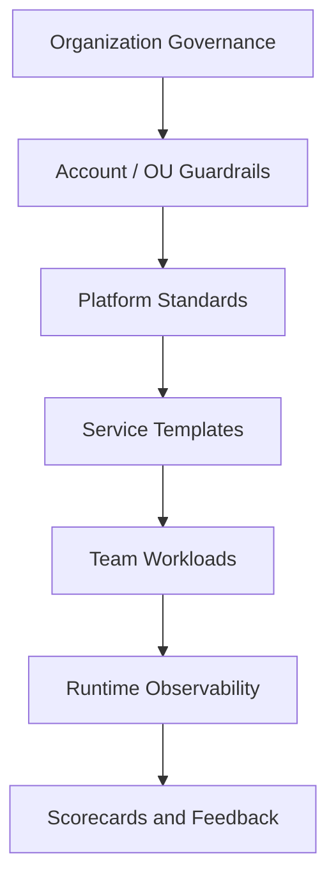
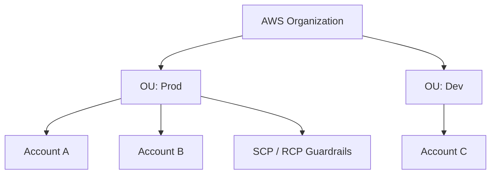
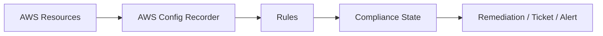

# Part 074 — Serverless Platform Governance and Golden Paths

A single team can run serverless by convention.

Ten teams need templates.

Fifty teams need a platform.

A hundred teams need governance.

Governance should not mean every team waits two weeks for approval to create a queue.

Good governance means:

```txt
teams move fast inside safe boundaries
```

The platform gives teams paved roads:

- standard Lambda templates;
- standard event contracts;
- standard SQS worker pattern;
- standard Step Functions workflow pattern;
- standard observability;
- standard IAM boundaries;
- standard DLQ/runbook;
- standard deployment pipeline;
- standard cost tags;
- standard security controls.

The guardrails prevent known bad outcomes.

The best platform feels like acceleration, not restriction.

---

## 1. Governance Mental Model

Governance has layers.



Each layer answers different questions.

| Layer | Examples |
|---|---|
| organization | AWS Organizations, SCPs/RCPs, account boundaries |
| landing zone | Control Tower, baseline accounts, networking, logging |
| compliance | AWS Config rules, conformance packs, Security Hub |
| platform | golden path templates, CI/CD, service catalog |
| workload | Lambda/API/SQS/EventBridge/Step Functions resources |
| runtime | dashboards, alarms, cost, incidents |
| feedback | scorecards, drift, game days, remediation |

Governance is not only policy.

It is operating system design for engineering teams.

---

## 2. Account Strategy

AWS account is a security, billing, quota, and blast-radius boundary.

Use accounts deliberately.

Common layout:

```txt
management account
log archive account
security tooling account
network account
shared services account
dev workload accounts
staging workload accounts
prod workload accounts
sandbox accounts
```

### Serverless Account Questions

- Which teams own which accounts?
- Are dev/staging/prod separated?
- Are sensitive workloads isolated?
- Are quotas sufficient?
- Are logs centralized?
- Is cost allocation clear?
- Are cross-account event buses controlled?
- Are CI/CD roles scoped?
- Are SCPs applied by OU?
- Can teams self-serve accounts?

### Anti-Pattern

```txt
all workloads in one shared prod account
```

Consequences:

- concurrency noisy neighbor;
- IAM blast radius;
- cost attribution difficulty;
- event bus confusion;
- deployment conflict;
- quota contention;
- difficult incident isolation.

Account strategy is platform architecture.

---

## 3. AWS Organizations Guardrails

AWS Organizations supports organization-wide policy management.

Service control policies (SCPs) offer central control over the maximum available permissions for IAM users and roles in member accounts. SCPs do not grant permissions by themselves; they set boundaries that identity/resource policies cannot exceed.

Resource control policies (RCPs) similarly provide central control over maximum available permissions for resources in an organization.



### SCP Examples

Use SCPs to prevent:

- disabling CloudTrail/logging;
- creating public S3 buckets;
- using unapproved Regions;
- deleting KMS keys in prod;
- leaving organization controls;
- creating IAM users where prohibited;
- attaching broad admin outside break-glass;
- disabling security services;
- changing critical log archive resources.

### SCP Caution

SCPs are coarse guardrails.

Do not encode every app-specific policy in SCPs.

Use:

- SCP for organization-wide “never do this” rules;
- IAM permission boundaries for role-level controls;
- resource policies for resource-specific trust;
- Config/policy-as-code for detection;
- platform templates for defaults.

Too many SCPs can create operational friction and confusing AccessDenied errors.

---

## 4. Landing Zone and Control Tower

AWS Control Tower provides a managed way to set up and govern a multi-account AWS environment. AWS documentation describes controls, also called guardrails, as high-level rules for ongoing governance, with preventive, detective, and proactive types.

Use landing zone for:

- account vending;
- baseline logging;
- security account setup;
- log archive;
- guardrails;
- organization units;
- baseline IAM/identity;
- centralized visibility;
- environment consistency.

### Control Types

| Control Type | Meaning |
|---|---|
| preventive | prevents action/configuration |
| detective | detects noncompliance |
| proactive | checks resource before provisioning through supported mechanisms |

### Serverless Relevance

Landing zone controls affect:

- Lambda creation;
- IAM role policies;
- S3 bucket public access;
- KMS usage;
- logging/CloudTrail;
- EventBridge cross-account routing;
- VPC/network restrictions;
- allowed Regions;
- account baselines.

Serverless teams should understand the guardrails they operate inside.

---

## 5. AWS Config and Conformance Packs

AWS Config records resource configuration and evaluates resources against rules.

A conformance pack is a collection of AWS Config rules and remediation actions deployed as a single entity in an account/Region or across an organization.

Use Config/conformance packs for:

- detecting drift;
- checking compliance;
- enforcing baseline controls;
- security posture;
- operational posture;
- cost governance;
- remediation workflows.



### Serverless Config Rules

Examples:

- Lambda function not using `$LATEST` in production integration;
- Lambda runtime not deprecated;
- Lambda env vars do not contain obvious secret patterns;
- SQS queue has DLQ;
- S3 bucket public access blocked;
- DynamoDB PITR enabled for critical table;
- EventBridge rule has target DLQ for critical event;
- log group retention set;
- KMS encryption enabled;
- API Gateway logging enabled;
- function URL auth configuration reviewed.

Not all checks exist as managed rules. Use custom rules or policy-as-code where needed.

---

## 6. Policy-as-Code

Policy-as-code checks templates before deployment.

Tools/patterns:

- CloudFormation Guard;
- OPA/Rego;
- Checkov;
- cfn-nag;
- CDK Aspects;
- Terraform policy checks;
- custom CI scripts;
- organization platform compiler.

Policy-as-code prevents mistakes earlier than AWS Config.

### Example Policies

```txt
No production Lambda may be invoked through $LATEST.
Critical SQS queue must have DLQ.
S3 bucket must block public access.
Lambda timeout must be less than SQS visibility timeout for mappings.
EventBridge rules must have Owner tag.
Function URL auth type NONE requires security waiver.
DynamoDB critical tables require PITR.
CloudWatch log groups require retention.
IAM wildcard action/resource requires waiver.
```

### Prevent vs Detect

| Control | When |
|---|---|
| policy-as-code | before deploy |
| SCP/Control Tower | prevent prohibited actions |
| AWS Config | detect deployed drift/noncompliance |
| runtime alarms | detect behavior failure |
| scorecard | continuous improvement |

Use all layers.

---

## 7. Golden Paths

A golden path is an approved, supported way to build a common workload.

It includes:

- template;
- documentation;
- CI/CD;
- IAM;
- observability;
- security;
- cost tags;
- tests;
- runbooks;
- examples.

Golden paths should be easy to use.

If the safe path is harder than the unsafe path, teams will bypass it.

### Serverless Golden Paths

Examples:

1. API Lambda service.
2. SQS worker Lambda.
3. EventBridge consumer.
4. Step Functions workflow.
5. S3 file processing pipeline.
6. DynamoDB-backed state service.
7. Scheduled job with EventBridge Scheduler.
8. SNS/SQS fanout subscriber.
9. Java Lambda with SnapStart-ready template.
10. Containerized worker on ECS/Fargate for long jobs.

Each template should include production defaults.

---

## 8. Golden Path: API Lambda

Template includes:

- API Gateway HTTP API/REST decision;
- Lambda alias/version;
- Java handler skeleton;
- request validation;
- idempotency middleware;
- structured logging;
- metrics/tracing;
- auth integration;
- error envelope;
- timeout budget;
- reserved concurrency option;
- deployment canary;
- dashboard;
- alarms;
- integration tests;
- runbook.

Default:

```txt
no public unauthenticated API
no $LATEST
log retention set
correlation ID enabled
least privilege IAM
```

---

## 9. Golden Path: SQS Worker

Template includes:

- SQS queue;
- DLQ;
- redrive policy;
- Lambda event source mapping;
- partial batch response enabled;
- event source maximum concurrency;
- reserved concurrency;
- visibility timeout aligned;
- idempotency table or library;
- poison message classification;
- structured logs/metrics;
- queue age alarm;
- DLQ alarm;
- redrive runbook.

Default:

```txt
visibility timeout > Lambda timeout
DLQ required
queue age alarm required
consumer concurrency capped
```

---

## 10. Golden Path: EventBridge Consumer

Template includes:

- custom bus or approved bus;
- precise event pattern;
- rule owner tag;
- target SQS queue by default for critical consumer;
- target DLQ/retry policy;
- event schema fixture;
- idempotency key convention;
- consumer contract test;
- replay safety doc;
- dashboard;
- alarms.

Default:

```txt
EventBridge -> SQS -> Lambda
```

for non-trivial consumers.

Direct EventBridge -> Lambda requires justification for critical/high-volume workloads.

---

## 11. Golden Path: Step Functions Workflow

Template includes:

- Standard vs Express selection guide;
- state machine version/alias;
- Lambda task aliases;
- retry/catch policy patterns;
- error taxonomy;
- compensation template;
- input/output shaping;
- correlation ID propagation;
- execution naming/idempotency;
- workflow dashboard;
- failure alarms;
- redrive checklist;
- contract tests.

Default:

```txt
no unbounded retries
Map concurrency capped
task timeout configured
workflow logs/traces configured
```

---

## 12. Golden Path: S3 File Processing

Template includes:

- upload API/presigned URL;
- S3 bucket/prefix structure;
- SQS notification destination;
- Lambda worker;
- recursive trigger prevention;
- object versioning decision;
- idempotency by bucket/key/version;
- metadata table;
- KMS policy;
- lifecycle rules;
- DLQ;
- processing dashboard;
- repair/backfill runbook.

Default:

```txt
no direct heavy S3 -> Lambda
input/output prefixes separated
block public access
lifecycle for temporary prefixes
```

---

## 13. Platform Libraries

A serverless platform should provide libraries for repeated correctness concerns.

Examples:

- Java logging standard;
- correlation ID propagation;
- idempotency utility;
- error taxonomy;
- API response/error mapper;
- EventBridge envelope builder;
- SQS batch processor;
- config/secret provider;
- tenant context validator;
- metrics helper;
- timeout budget helper;
- redaction utility.

### Library Rule

Libraries should encode standards without hiding critical AWS semantics.

Bad library:

```txt
processMessage(message) // swallows errors and retries mysteriously
```

Good library:

```txt
processBatch(records, handlers) -> explicit partial failure response
```

Abstractions should make correct behavior easier, not invisible.

---

## 14. Platform APIs and Self-Service

Teams should self-serve common resources safely.

Examples:

- create new service from template;
- request new event schema;
- create SQS worker;
- create scheduled job;
- register EventBridge consumer;
- request secret/config profile;
- provision DynamoDB table pattern;
- create dashboard/alarms.

Self-service can be delivered through:

- internal developer portal;
- service catalog;
- Backstage plugin;
- GitOps repository;
- CLI;
- CDK construct library;
- Terraform modules;
- code generators.

### Self-Service Contract

A request should capture:

```txt
owner
environment
data classification
criticality
expected traffic
downstream dependencies
SLO
cost center
runbook
```

Then platform tooling produces safe defaults.

---

## 15. Ownership Model

Every resource needs an owner.

Owner metadata:

```yaml
OwnerTeam: payments-platform
SlackChannel: payments-alerts
PagerDutyService: payments-prod
Runbook: https://internal/runbooks/payments
CostCenter: finops-123
Criticality: high
DataClassification: confidential
```

Resources without owners become production debt.

### Ownership Responsibilities

| Resource | Owner Does |
|---|---|
| Lambda | code, alarms, runbook, dependencies |
| SQS queue | schema, DLQ, redrive, consumer capacity |
| EventBridge rule | pattern, target, cost, failure path |
| DynamoDB table | data model, backups, capacity, access |
| S3 bucket | data classification, lifecycle, access |
| Step Functions | workflow definition, failures, redrive |
| API route | contract, auth, latency, errors |

Platform owns guardrails.

Teams own workloads.

---

## 16. Scorecards

Scorecards turn standards into visibility.

Example service scorecard:

| Category | Check |
|---|---|
| deployment | uses Lambda alias/version |
| observability | structured logs and required metrics |
| reliability | DLQ for async paths |
| security | least privilege IAM, no public S3 |
| cost | tags and log retention |
| testing | integration tests exist |
| operations | runbook linked |
| config | AppConfig/secrets pattern |
| data | backup/PITR/lifecycle where required |

### Scorecard Levels

```txt
Bronze: basic production safety
Silver: tested failure paths and cost visibility
Gold: game-day validated, SLOs, automated remediation
```

Scorecards should help teams prioritize improvement, not shame them.

---

## 17. Runtime Governance

Pre-deploy checks are not enough.

Runtime governance detects drift and behavior.

Signals:

- resources without tags;
- Lambda without log retention;
- queue without DLQ;
- EventBridge rule disabled unexpectedly;
- Lambda reserved concurrency changed manually;
- function URL public;
- S3 bucket policy changed;
- IAM policy broadened;
- DLQ messages unowned;
- old runtime versions;
- code storage growth;
- cost anomaly.

Automate detection through:

- AWS Config;
- Security Hub;
- EventBridge rules on CloudTrail;
- custom inventory jobs;
- cost/anomaly tools;
- platform scorecards;
- dashboards.

---

## 18. Drift and Exception Handling

There will be exceptions.

Good exception process:

```txt
request exception
state reason
risk accepted by owner
expiration date
compensating control
review cadence
automatic reminder
```

Bad exception:

```txt
temporary wildcard IAM, no expiry
```

### Exception Example

```yaml
control: lambda-function-url-auth-none
service: public-webhook-ingest
reason: third-party provider cannot sign IAM request
compensatingControls:
  - HMAC signature validation
  - WAF rate limit
  - payload schema validation
  - DLQ and alarm
expires: 2026-09-01
owner: integrations-team
```

Exceptions must expire or be reviewed.

---

## 19. Guardrail Design Principles

Good guardrails are:

- clear;
- automated;
- close to developer workflow;
- actionable;
- documented;
- with examples;
- with safe default alternatives;
- with exception path;
- measured.

Bad guardrails:

- block without explanation;
- require manual approval for common safe actions;
- create broad AccessDenied confusion;
- are undocumented;
- conflict across layers;
- are impossible to test locally;
- slow emergency response.

### Rule

```txt
Prevent what must never happen.
Guide what should usually happen.
Detect what may need context.
```

---

## 20. Platform Observability Standards

Every golden path should emit standard fields.

### Required Log Fields

```txt
service
environment
version
correlationId
lambdaRequestId
eventId
operation
outcome
errorCode
tenantId where safe
```

### Required Metrics

```txt
Invocations
Errors
Duration p95/p99
Throttles
DLQ depth
Queue age
Async event age
Iterator age
Business outcome
Cost/unit proxy
```

### Required Dashboards

- service overview;
- event/queue health;
- workflow health;
- dependency health;
- cost;
- release view;
- SLO/error budget if critical.

Standard observability lets platform teams support many services.

---

## 21. Security Governance

Serverless-specific security guardrails:

- no wildcard execution role without waiver;
- Lambda environment variables cannot contain secret patterns;
- secrets must be in Secrets Manager/SSM;
- function URL with no auth requires waiver;
- S3 block public access;
- KMS required for sensitive queues/topics/buckets/tables;
- resource-based policies scoped by SourceArn/SourceAccount;
- VPC Lambda egress reviewed for sensitive workloads;
- dependency scanning;
- code signing/image provenance for critical workloads;
- CloudTrail data events for sensitive S3/Lambda as required.

Security governance should be embedded in templates and CI.

---

## 22. Reliability Governance

Reliability guardrails:

- async critical functions require DLQ/destination;
- SQS queues require DLQ unless explicitly ephemeral;
- queue age alarms required;
- Lambda timeouts bounded;
- SQS visibility > Lambda timeout;
- reserved concurrency for DB writers;
- EventBridge target failure DLQ for critical rules;
- Step Functions retries/catches explicit;
- Map concurrency capped;
- idempotency library required for side-effecting handlers;
- redrive runbook required for DLQs.

Reliability governance converts repeated lessons into defaults.

---

## 23. Cost Governance

Cost guardrails:

- tags required;
- log retention required;
- no DEBUG logs by default in prod;
- provisioned concurrency requires owner/SLO/schedule;
- NAT-heavy VPC Lambda review;
- EventBridge archive retention reviewed;
- Step Functions Distributed Map concurrency capped;
- DynamoDB GSI approval with access pattern;
- S3 lifecycle for temp prefixes;
- budget/anomaly alerts per workload;
- SMS/email spend controls.

Cost governance should not block useful systems. It should prevent invisible waste.

---

## 24. Data Governance

Serverless moves data through many services.

Data governance asks:

- what data classification?
- where is data stored?
- how long retained?
- is event archived?
- are DLQs encrypted?
- does log contain PII?
- does external API destination receive sensitive data?
- is cross-account routing allowed?
- is object lifecycle correct?
- is deletion/retention policy enforced?
- does replay violate retention/consent?

Data classification should drive:

- KMS;
- logs;
- retention;
- access policies;
- event payload design;
- DLQ handling;
- backups;
- Object Lock.

---

## 25. Standard Runbook Requirements

Each production service should have:

```yaml
owner:
criticality:
entrypoints:
dependencies:
dashboards:
alarms:
deploy:
rollback:
dlq:
redrive:
replay:
dataRepair:
costAnomaly:
securityIncident:
contacts:
```

Runbooks should link to:

- CloudWatch dashboards;
- Logs Insights queries;
- deployment pipeline;
- IaC repository;
- queue/DLQ console;
- Step Functions executions;
- EventBridge rules;
- cost dashboard;
- known failure drills.

A runbook hidden in a wiki nobody updates is not enough. Keep runbook close to code/templates.

---

## 26. Platform KPIs

Measure platform health.

Examples:

- percent services using golden paths;
- percent async workflows with DLQ alarms;
- percent Lambdas using aliases;
- percent services with cost tags;
- percent log groups with retention;
- number of public exceptions;
- time to create a new service;
- deployment frequency;
- change failure rate;
- mean time to recovery;
- DLQ mean time to acknowledgment;
- cost anomaly time to detection;
- scorecard distribution;
- policy false-positive rate.

Governance should improve both safety and speed.

If safety improves but delivery collapses, platform failed.

---

## 27. Migration to Golden Paths

Existing systems rarely start compliant.

Migration strategy:

1. inventory workloads;
2. classify criticality;
3. build scorecard;
4. identify high-risk gaps;
5. fix with highest risk reduction first;
6. provide templates and migration guides;
7. migrate teams gradually;
8. create exception process;
9. automate new standards for new services;
10. reduce legacy exceptions over time.

Do not demand every team rewrite everything immediately.

Prioritize:

- public/security-critical endpoints;
- payment/audit/compliance workflows;
- no-DLQ async paths;
- broad IAM roles;
- unowned resources;
- high cost anomalies.

---

## 28. Governance Runbooks

### Runbook: Noncompliant Resource Detected

1. identify owner;
2. classify severity;
3. check if exception exists;
4. notify owner with remediation;
5. auto-remediate if safe;
6. escalate if critical;
7. record closure.

### Runbook: Guardrail Blocks Deployment

1. read policy failure;
2. identify violated standard;
3. use recommended template/fix;
4. request exception if justified;
5. record expiry/compensating control.

### Runbook: Public Exposure Detected

1. block or quarantine if critical;
2. identify resource and owner;
3. check CloudTrail for change;
4. fix policy/config;
5. review access logs;
6. add preventive control if missing.

### Runbook: Unknown Owner DLQ Filling

1. map resource tags/IaC stack;
2. inspect event source;
3. identify producer/consumer;
4. pause destructive redrive;
5. assign incident owner;
6. fix ownership metadata.

---

## 29. Common Anti-Patterns

### Anti-Pattern 1 — Governance by Wiki Only

Standards are written but not enforced or templated.

### Anti-Pattern 2 — Platform as Ticket Queue

Every safe action requires manual approval.

### Anti-Pattern 3 — One Giant Shared Account

Blast radius and ownership become unclear.

### Anti-Pattern 4 — SCPs for Everything

Coarse guardrails become a maze of AccessDenied.

### Anti-Pattern 5 — Golden Path Without Escape Hatch

Teams bypass platform when workload differs.

### Anti-Pattern 6 — Scorecards Used for Blame

Teams hide problems instead of improving.

### Anti-Pattern 7 — No Runtime Drift Detection

IaC was correct once, production changed later.

### Anti-Pattern 8 — Templates Without Updates

Golden path becomes outdated and insecure.

### Anti-Pattern 9 — No Cost Owner

Fanout and logs grow without accountability.

### Anti-Pattern 10 — Guardrails Block Incidents Response

Emergency controls need break-glass with audit.

---

## 30. Production Governance Checklist

### Organization

- [ ] Account strategy defined.
- [ ] OUs and environments separated.
- [ ] SCP/RCP guardrails documented.
- [ ] Control Tower/landing zone baseline.
- [ ] Central logging/security accounts.
- [ ] Account vending/self-service.

### Controls

- [ ] Config rules/conformance packs.
- [ ] Policy-as-code in CI.
- [ ] Runtime drift detection.
- [ ] Exception process with expiry.
- [ ] CloudTrail/EventBridge monitoring for critical changes.

### Golden Paths

- [ ] API Lambda template.
- [ ] SQS worker template.
- [ ] EventBridge consumer template.
- [ ] Step Functions workflow template.
- [ ] S3 processing template.
- [ ] DynamoDB state template.
- [ ] Observability standard.
- [ ] Deployment pipeline standard.

### Operations

- [ ] Owner tags required.
- [ ] Runbook required.
- [ ] DLQ alarm required for critical async.
- [ ] Cost tags and budgets.
- [ ] Security data classification.
- [ ] Scorecard visible.
- [ ] Game-day program.

### Developer Experience

- [ ] Templates are easy.
- [ ] Documentation includes examples.
- [ ] CLI/portal/self-service exists.
- [ ] Guardrail failures are actionable.
- [ ] Support channel exists.
- [ ] Feedback loop improves platform.

---

## 31. Final Mental Model

Serverless platform governance is not about saying no.

It is about making the correct path the easiest path.

A strong platform provides:

```txt
accounts
guardrails
golden paths
policy checks
observability
runbooks
scorecards
self-service
exception process
runtime feedback
```

The best governance system lets teams ship quickly because dangerous choices are already handled by defaults.

A top-tier platform engineer does not ask:

> “How do we stop teams from making mistakes?”

They ask:

> “How do we design paved roads where teams naturally get security, reliability, observability, cost control, and operability by default?”

That is serverless platform governance.

---

## References

- AWS Organizations User Guide: service control policies and resource control policies
- AWS Control Tower User Guide: controls and landing zones
- AWS Config Developer Guide: rules and conformance packs
- AWS Well-Architected Framework: Operational Excellence pillar
- AWS Well-Architected Serverless Applications Lens
- AWS IAM, CloudFormation Guard, and policy-as-code ecosystem documentation
