# Part 075 — Hybrid Containers and Serverless Architectures

Top-tier AWS architecture is rarely “all Lambda” or “all Kubernetes.”

It is usually a careful composition of compute contracts.

Some work wants:

```txt
milliseconds-to-seconds execution
event-driven scale
no idle servers
```

That often fits Lambda.

Some work wants:

```txt
long-running process
connection-heavy runtime
custom process control
steady CPU
large memory
daemon-like behavior
```

That often fits ECS/EKS/App Runner/Fargate.

Some work wants:

```txt
durable state machine
retry/catch/compensation
human approval
long wait
parallel map
```

That fits Step Functions.

Some work wants:

```txt
durable backlog
backpressure
redrive
consumer isolation
```

That fits SQS.

Some work wants:

```txt
event routing
fanout
integration contracts
```

That fits EventBridge/SNS.

The advanced engineer does not pick a favorite compute platform.

They pick the smallest reliable contract for each part of the workload.

---

## 1. The Hybrid Compute Mental Model

Compute choices are contracts.

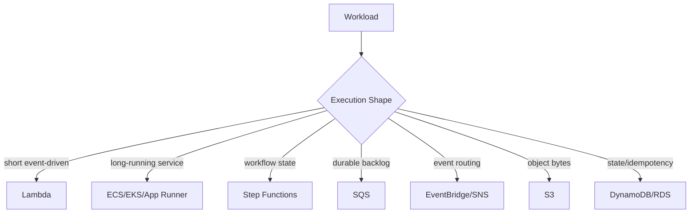

A system is often a graph:

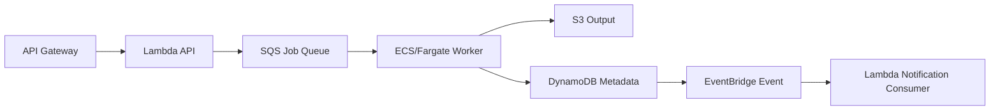

Each node exists because it gives a specific operational property.

Do not draw architecture as brand logos.

Draw architecture as contracts:

- request/response;
- async queue;
- durable workflow;
- long-running compute;
- event fanout;
- state transition;
- object processing.

---

## 2. Why Hybrid Architectures Win

Hybrid architectures let each service do what it is good at.

### Lambda Strengths

- fast event-driven scale;
- no server management;
- strong integration with AWS event sources;
- good for short handlers;
- pay-per-use;
- simple background tasks;
- API adapters;
- event consumers;
- glue logic;
- lightweight transformations.

### Container Strengths

- long-running workloads;
- custom process lifecycle;
- connection-heavy services;
- stable high throughput;
- background workers;
- large dependency/runtime control;
- streaming consumers;
- sidecars/agents;
- custom networking;
- CPU/GPU/memory-heavy jobs;
- portability across platforms.

### Step Functions Strengths

- workflow state;
- retries/catches;
- compensation;
- human/external callback;
- durable waits;
- service integrations;
- parallel and map states;
- audit history;
- redrive.

### SQS/EventBridge Strengths

- decoupling;
- backpressure;
- fanout;
- replay/redrive;
- explicit failure boundaries.

The strongest architecture combines these properties without letting one service become everything.

---

## 3. A Compute Contract Table

| Workload Shape | Prefer | Why |
|---|---|---|
| short stateless API adapter | Lambda | fast, low ops |
| long-running HTTP service | ECS/EKS/App Runner | always-on, connection reuse |
| bursty queue consumer | Lambda or ECS | Lambda for short bursts, ECS for sustained/heavy |
| sustained high-throughput worker | ECS/EKS/Fargate | better steady compute economics/control |
| multi-step business process | Step Functions | durable orchestration |
| file upload control plane | Lambda + S3 presigned URL | avoid payload through compute |
| file processing heavy CPU | ECS/Batch/Step Functions | longer/heavier processing |
| scheduled short job | EventBridge Scheduler -> Lambda | simple |
| scheduled long job | EventBridge Scheduler -> ECS/Step Functions | runtime control |
| Kafka stateful consumer | ECS/EKS often | long-lived partition consumers |
| event fanout | EventBridge/SNS -> SQS | routing + backpressure |
| idempotency/state | DynamoDB/RDS | durable correctness |

This table is not universal.

It is a starting point for reasoning.

---

## 4. Pattern A — Lambda API, Queue, Container Worker

Use when API request starts work that is too long or variable for synchronous Lambda.

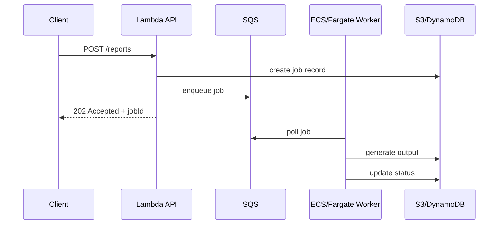

### Use Cases

- report generation;
- PDF rendering;
- media processing;
- large exports;
- ML inference batch;
- partner sync;
- long third-party API calls;
- compliance evidence packaging.

### Why It Works

- API remains fast;
- queue buffers work;
- container worker can run longer;
- worker has stable process and connection pools;
- job status is queryable;
- retries/redrive are explicit.

### Guardrails

- job idempotency;
- queue DLQ;
- worker concurrency cap;
- job timeout/deadline;
- status state machine;
- output S3 lifecycle;
- cost per job;
- worker autoscaling by queue age/depth;
- duplicate job detection.

### Anti-Pattern

```txt
API Lambda waits synchronously for 10-minute report generation.
```

This creates timeouts, ambiguous side effects, and poor user experience.

---

## 5. Pattern B — EventBridge Routes, SQS Buffers, Mixed Consumers

Use when many consumers react to domain events.

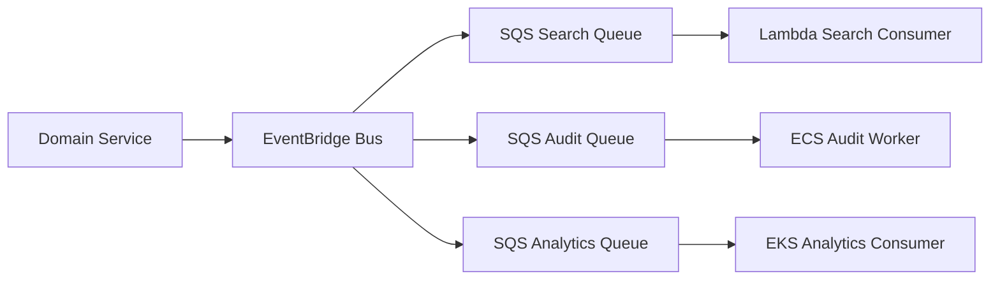

### Why Mixed Consumers?

Each consumer has a different execution shape.

| Consumer | Compute |
|---|---|
| search index small update | Lambda |
| audit write with heavy validation | ECS |
| analytics stream aggregation | EKS |
| notification | Lambda |
| external partner export | Step Functions/ECS |

EventBridge provides routing.

SQS provides per-consumer backlog.

Compute is chosen per consumer.

### Guardrails

- one queue per critical consumer;
- event schema versioning;
- idempotency per consumer;
- replay safety;
- DLQ per consumer;
- downstream-specific concurrency;
- fanout cost ownership;
- rule pattern tests.

---

## 6. Pattern C — Step Functions Orchestrates Lambda and ECS/Fargate

Use when a workflow has short tasks and long/container tasks.

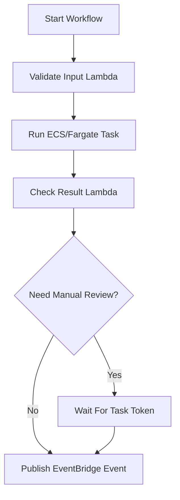

Step Functions can integrate with AWS services, including optimized integrations for Lambda and ECS/Fargate. It can run ECS/Fargate tasks and wait for completion using supported service integration patterns.

### Use Cases

- document processing pipeline;
- batch job followed by validation;
- ETL orchestration;
- containerized model inference;
- compliance review workflow;
- media transcode orchestration;
- ECS task for tool that cannot fit Lambda.

### Why It Works

- Step Functions owns process state;
- ECS owns long/heavy compute;
- Lambda owns small glue/validation tasks;
- retries/catches are explicit;
- audit history exists;
- redrive and compensation are possible.

### Guardrails

- task idempotency;
- ECS task timeout;
- workflow timeout;
- Map concurrency cap;
- task result size control;
- S3 for large payloads;
- error taxonomy;
- compensation path.

### Anti-Pattern

```txt
Lambda invokes ECS task, then polls ECS in a loop until complete.
```

Use Step Functions `.sync` style integration where appropriate instead of burning Lambda duration as a poller.

---

## 7. Pattern D — Scheduler Starts Workflow or ECS Task

Use when work is time-based.

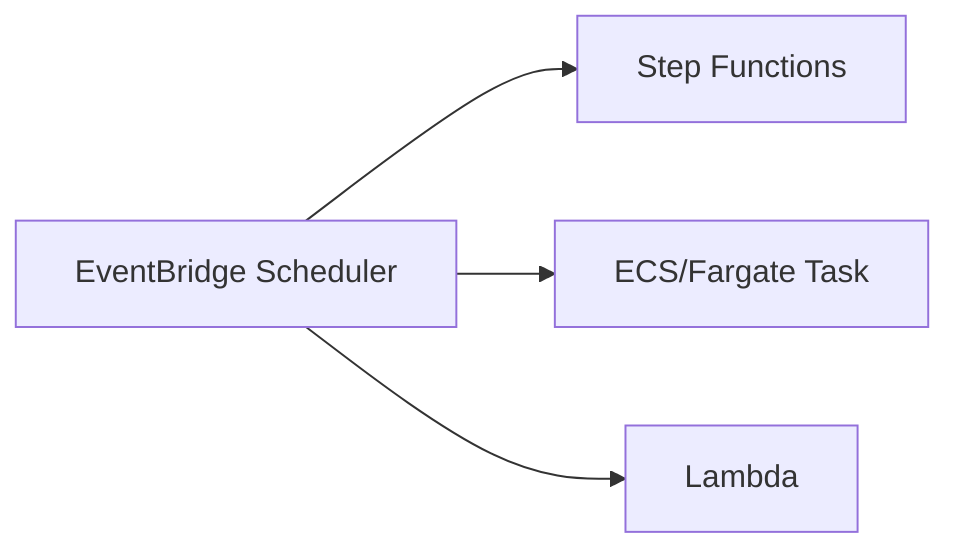

EventBridge Scheduler supports one-time and recurring schedules and can target many AWS services. AWS documentation describes it as a serverless scheduler and recommends it over older scheduled rules for many scheduled invocation needs.

### Use Cases

- nightly reconciliation;
- daily report generation;
- delayed job;
- future deadline escalation;
- periodic export;
- scheduled ECS maintenance task;
- batch data processing.

### Decision

| Job Shape | Target |
|---|---|
| short simple task | Lambda |
| multi-step workflow | Step Functions |
| long containerized task | ECS/Fargate |
| buffered work | SQS |
| many scheduled tenant jobs | Scheduler -> SQS/Step Functions |

### Guardrails

- schedule owner;
- DLQ;
- retry policy;
- idempotent run ID;
- overlap prevention;
- timezone correctness;
- flexible window if exact timing unnecessary;
- cleanup for one-time schedules;
- cost monitoring.

---

## 8. Pattern E — S3 Object Pipeline with Container Stage

Some file workflows start in S3 and require heavy compute.

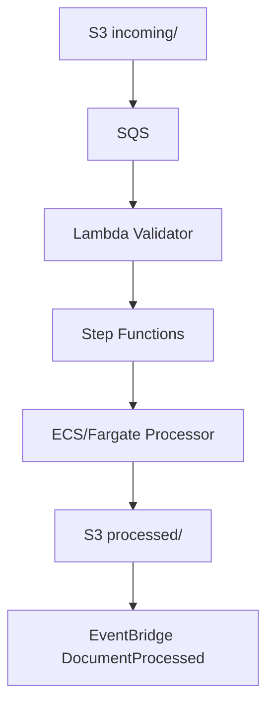

### Use When

- object is large;
- processing takes longer than Lambda sweet spot;
- native library requires OS packages;
- CPU/memory needs are high;
- processing has multiple phases;
- failure needs workflow-level visibility.

### Why Not Direct S3 -> ECS?

S3 does not directly run ECS tasks as a normal notification destination.

Use:

```txt
S3 -> SQS/EventBridge -> Step Functions -> ECS
```

or:

```txt
S3 -> SQS -> ECS worker polling queue
```

### Guardrails

- bucket/key/version idempotency;
- input/output prefix separation;
- queue DLQ;
- processing status store;
- ECS task retry policy;
- output checksum;
- repair/backfill using S3 Inventory/manifest;
- lifecycle policy.

---

## 9. Pattern F — Container Service Emits Events, Lambda Consumers React

ECS/EKS services can publish domain events to EventBridge/SNS/SQS.

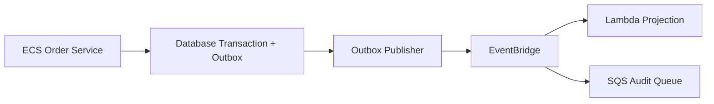

### Use Cases

- containerized core service;
- Lambda projections/notifications;
- serverless audit pipeline;
- decoupled side effects;
- migration from monolith to event-driven consumers.

### Key Point

Containers can be event producers.

Serverless services can be consumers.

This is often better than forcing core service into Lambda when it wants long-running process semantics.

### Guardrails

- outbox for atomic publish;
- event schema governance;
- producer retry/partial failure handling;
- consumer idempotency;
- fanout cost ownership;
- replay safety.

---

## 10. Pattern G — Lambda Front Door to Container Service

Sometimes Lambda is a thin API/control adapter and containers serve core logic.

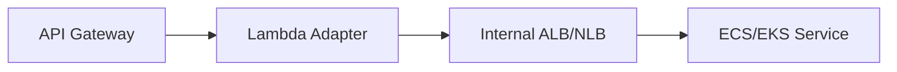

Use when:

- API Gateway features are desired;
- Lambda performs auth/request normalization;
- core service already exists in containers;
- gradual migration;
- request volume is moderate;
- latency budget allows extra hop.

Be careful:

- Lambda adds latency/cost;
- VPC/network path required;
- timeouts must align;
- retries can duplicate backend calls;
- internal service must handle bursts;
- auth context propagation must be safe.

Often API Gateway can integrate directly with HTTP backends or ALB/Cloud Map patterns may be cleaner.

Do not add Lambda as unnecessary proxy.

---

## 11. Pattern H — Container Front Door, Lambda for Burst Side Tasks

Container service handles synchronous API, Lambda handles event-driven side work.

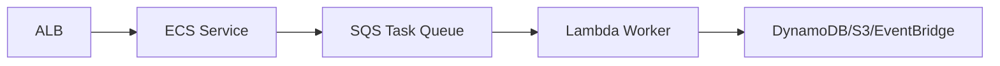

Use when:

- main API is long-running service;
- side tasks are bursty;
- side task processing is short;
- scaling side tasks independently is useful.

Examples:

- send notification;
- update projection;
- generate small thumbnail;
- update cache;
- emit integration event;
- validate small object.

This pattern avoids scaling the whole service for side work.

---

## 12. Pattern I — ECS/EKS Worker for Queue, Lambda for Control Plane

For sustained queue processing, containers may be better.

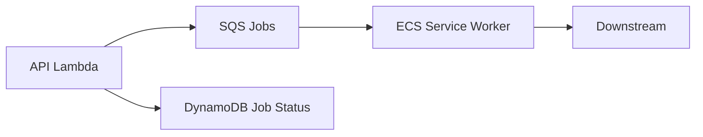

Use containers when:

- jobs are long-running;
- throughput is sustained;
- worker needs custom process lifecycle;
- needs large memory/CPU;
- connection pools are important;
- expensive SDK/client warmup;
- needs specialized native dependencies;
- cost of always-on workers is justified.

Use Lambda when:

- jobs are short;
- traffic is spiky;
- idle is common;
- simple scale-to-zero economics matter.

### Autoscaling

For ECS workers:

- scale on SQS queue depth;
- scale on age of oldest message;
- scale on CPU/memory;
- cap max tasks based on downstream;
- use target tracking/step scaling;
- keep DLQ and idempotency.

---

## 13. Pattern J — EKS for Platform Runtime, Serverless for Edge Integrations

EKS may host complex services/platforms, while serverless handles AWS event integrations.

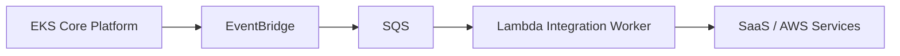

Use when:

- core platform already runs on Kubernetes;
- teams have Kubernetes operational maturity;
- workloads need controllers/operators/sidecars;
- event integrations are simpler as Lambda/SQS;
- cloud-native glue should not be inside cluster.

This avoids making Kubernetes the integration bus.

It also avoids putting every tiny AWS event handler into the cluster.

---

## 14. Pattern K — Step Functions as Cross-Compute Orchestrator

Step Functions can orchestrate:

- Lambda tasks;
- ECS/Fargate tasks;
- AWS Batch;
- Glue;
- DynamoDB;
- SQS/SNS/EventBridge;
- API Gateway/HTTP APIs;
- many AWS SDK integrations.

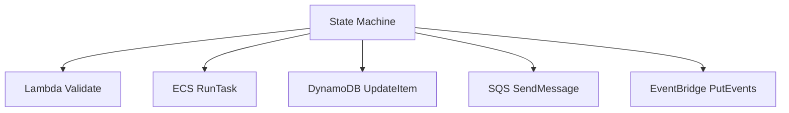

### When It Shines

- workflow crosses compute types;
- coordination matters more than compute choice;
- task durations vary;
- failure/compensation explicit;
- audit timeline important;
- no team wants to maintain custom orchestrator.

### Design Rule

```txt
Step Functions coordinates.
Compute nodes execute bounded work.
```

Do not hide workflow inside ECS or Lambda if Step Functions would make it explicit and recoverable.

---

## 15. Integration Boundaries

Hybrid architectures should communicate through explicit boundaries.

Preferred boundaries:

- HTTP for synchronous request/response;
- SQS for command/job backlog;
- EventBridge/SNS for events/fanout;
- Step Functions for workflow;
- S3 for large object references;
- DynamoDB/RDS for state;
- gRPC/HTTP inside service mesh where appropriate.

Avoid:

- direct Lambda invoking Lambda chains;
- containers calling many Lambdas synchronously as internal RPC;
- shared database across unrelated compute without ownership;
- event bus used for commands requiring immediate result;
- queues with multiple unrelated consumer semantics;
- state hidden only in logs.

### Lambda-to-Lambda Warning

Direct Lambda-to-Lambda can be okay in small cases, but often creates:

- hidden synchronous coupling;
- double billing;
- poor error semantics;
- nested timeout complexity;
- difficult tracing;
- retry ambiguity.

Prefer:

- Step Functions for orchestration;
- SQS/EventBridge for async;
- shared library for common logic;
- direct service integration when possible.

---

## 16. Timeout Alignment Across Compute

Hybrid systems need time budget alignment.

Example API -> Lambda -> ECS HTTP service:

```txt
client timeout: 10s
API Gateway integration budget: 8s
Lambda timeout: 9s
ECS service HTTP timeout: 2s
DB query timeout: 1s
```

Example queue -> ECS worker:

```txt
SQS visibility timeout: 15m
worker job timeout: 10m
downstream timeout: bounded
heartbeat/visibility extension if needed
```

Example Step Functions -> ECS task:

```txt
state timeout > expected task runtime + margin
task container timeout/stop behavior defined
workflow catch path handles failure
```

### Rule

The outer system should not time out before the inner system can report safe outcome unless side effects are idempotent and recoverable.

---

## 17. Concurrency and Capacity Across Compute

Hybrid architectures fail when one layer scales faster than another.

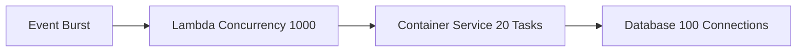

Ask:

- what is maximum Lambda concurrency?
- what is ECS/EKS service capacity?
- what is DB connection limit?
- what is external API rate limit?
- what is SQS backlog tolerance?
- what is Step Functions Map concurrency?
- what is EventBridge fanout multiplier?

### Bulkhead Example

```txt
API Lambda reserved concurrency = 100
SQS consumer max concurrency = 30
ECS worker max tasks = 20
Step Functions Map max concurrency = 10
DB connection pool total target <= 80
```

Every scaling layer must respect downstream capacity.

---

## 18. Networking Across Compute

Hybrid systems often span:

- Lambda outside VPC;
- Lambda in VPC;
- ECS/EKS in private subnets;
- internal ALB/NLB;
- VPC endpoints;
- NAT gateways;
- PrivateLink;
- service mesh;
- cross-account networking.

### Design Questions

- Does Lambda truly need VPC?
- Can container service expose internal ALB?
- Is API path public or private?
- Is NAT needed or endpoint enough?
- Are security groups scoped by service?
- Does DNS work across VPC/accounts?
- Is cross-AZ traffic cost acceptable?
- Are timeouts explicit?
- Are VPC Flow Logs useful for this path?

### Network Anti-Pattern

```txt
Every Lambda attached to VPC and all egress through one NAT,
even for functions only calling DynamoDB/S3.
```

This adds cost and failure surface.

---

## 19. Security Across Compute

Hybrid means multiple identity models.

- Lambda execution role;
- ECS task role;
- EKS IRSA / Pod Identity;
- Step Functions execution role;
- EventBridge target role;
- SQS/SNS resource policies;
- API auth;
- KMS policies;
- Secrets access.

### Principle

```txt
Each compute unit gets only the permissions for its side effects.
```

Do not use one broad role for Lambda and ECS workers.

### Cross-Compute Traceability

Every side effect should be attributable to:

- service;
- workload;
- version;
- role;
- event ID;
- tenant/resource.

This helps security incident response and audit.

---

## 20. Observability Across Compute

Hybrid systems need end-to-end correlation.

Fields:

```txt
correlationId
causationId
eventId
workflowExecution
jobId
lambdaRequestId
ecsTaskArn
podName
containerImageDigest
functionVersion
serviceVersion
```

### Trace Across Boundaries

- API request -> Lambda log;
- Lambda -> SQS message attributes;
- SQS -> ECS/Lambda worker log;
- worker -> DynamoDB/S3/EventBridge;
- Step Functions execution ARN passed to tasks;
- EventBridge event carries correlation ID.

### Dashboard Layers

- API/front door;
- Lambda;
- queue/event bus;
- container service/tasks/pods;
- workflow;
- state store;
- downstream;
- cost.

A Lambda-only dashboard cannot operate a hybrid architecture.

---

## 21. Deployment Across Compute

Hybrid deployments must coordinate versions.

Example:

```txt
Lambda producer emits event v2
ECS consumer supports only v1
```

Incident.

### Compatibility Strategy

- additive event changes first;
- consumers support old and new;
- deploy consumers before producers for breaking changes;
- use schema version;
- use feature flags;
- canary producers;
- shadow consumers;
- rollback plan;
- avoid simultaneous big-bang deploy.

### Artifact Provenance

Track:

- Lambda version;
- ECS image digest;
- EKS deployment image;
- Step Functions version;
- IaC commit;
- event schema version;
- AppConfig version.

Hybrid incidents are harder if you cannot identify which component version acted.

---

## 22. Migration Pattern: Lambda to ECS Worker

When Lambda worker becomes unsuitable:

Reasons:

- sustained high volume;
- long runtime;
- memory/CPU heavy;
- connection-heavy;
- dependency/runtime control;
- lower steady-state cost in containers.

Migration:

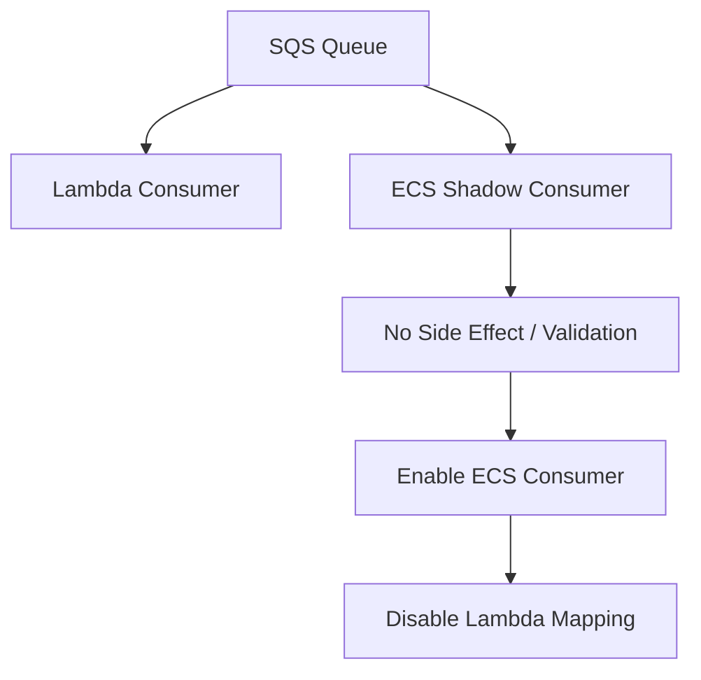

Steps:

1. keep same SQS queue/message schema;
2. build ECS worker idempotent against same store;
3. run shadow consumer on copied queue if possible;
4. cap ECS task count;
5. disable Lambda mapping gradually;
6. monitor backlog/DLQ/downstream;
7. decommission Lambda after stability.

The queue boundary makes migration easier.

---

## 23. Migration Pattern: Container API to Lambda Edge Functions

When parts of a container API are spiky/simple:

```txt
ALB/ECS monolith route -> API Gateway/Lambda route
```

Use for:

- webhook receiver;
- lightweight command intake;
- file upload presign;
- auth callback;
- event ingestion;
- notification preference API.

Migration:

1. extract route contract;
2. implement Lambda adapter;
3. share domain library carefully or duplicate boundary logic;
4. route small percentage/custom domain path;
5. monitor;
6. remove route from container.

Do not split routes if it creates shared database transaction ambiguity.

---

## 24. Migration Pattern: Lambda Chain to Step Functions

Bad old pattern:

```txt
Lambda A invokes Lambda B invokes Lambda C
```

Better:

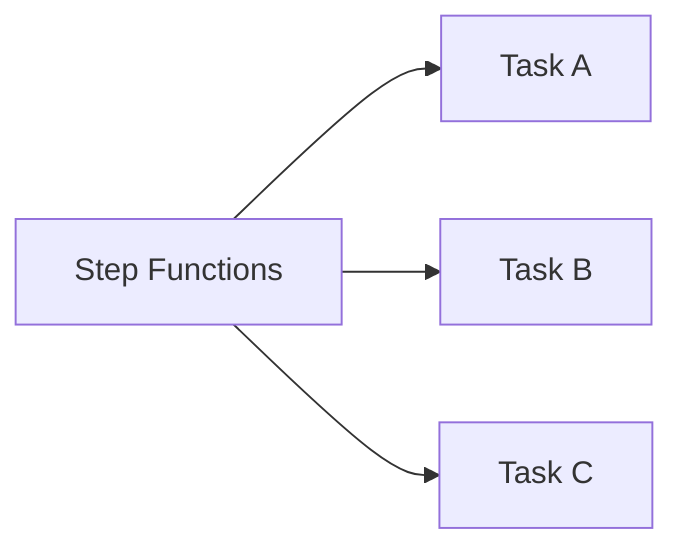

Migration:

1. identify implicit workflow;
2. define state machine;
3. make tasks idempotent;
4. define retry/catch;
5. deploy state machine;
6. route new executions;
7. keep old chain for in-flight only;
8. retire chain.

This improves auditability and failure handling.

---

## 25. Migration Pattern: Direct Lambda to SQS Buffer

Bad:

```txt
EventBridge -> Lambda -> database
```

under bursty load.

Better:

```txt
EventBridge -> SQS -> Lambda/ECS worker -> database
```

Migration:

1. create consumer queue and DLQ;
2. update EventBridge rule target to queue;
3. create worker with concurrency cap;
4. test message schema;
5. enable target;
6. disable old direct target;
7. monitor queue age and DB load.

This adds backpressure without changing producer event contract.

---

## 26. Hybrid Architecture Review Questions

### Workload Fit

- Is each compute choice justified by workload shape?
- Is any Lambda doing long-running orchestration?
- Is any container service doing simple event glue?
- Is any queue missing where backpressure is needed?
- Is any workflow hidden in code?

### Failure

- Where does failure go?
- What is replay/redrive path?
- Are side effects idempotent?
- Are retries bounded?
- Is there a DLQ/failure destination?
- Are queues per consumer?

### Capacity

- What scales first?
- What bottlenecks first?
- What protects downstream?
- Is fanout multiplier known?
- Are concurrency caps aligned?

### Operations

- Can we trace one business event end to end?
- Can we roll back one component safely?
- Are versions compatible?
- Are owners clear?
- Are runbooks cross-compute?

---

## 27. Common Anti-Patterns

### Anti-Pattern 1 — All Lambda Because It Is Serverless

Long-running/connection-heavy workloads suffer.

### Anti-Pattern 2 — All Kubernetes Because Platform Standard

Tiny event handlers become over-operated.

### Anti-Pattern 3 — Lambda Polling ECS Job

Use Step Functions or event-driven completion.

### Anti-Pattern 4 — Direct Fanout to Heavy Consumers

No backpressure; downstream overload.

### Anti-Pattern 5 — Queue Shared by Unrelated Consumers

Ownership and scaling conflicts.

### Anti-Pattern 6 — Event Bus as RPC

Commands needing immediate result are disguised as events.

### Anti-Pattern 7 — No Version Compatibility Across Compute

Producer and consumer deployments break each other.

### Anti-Pattern 8 — VPC Everywhere

Cost and networking complexity without private-resource need.

### Anti-Pattern 9 — Container Service as Integration Dump

All event glue buried in long-running app.

### Anti-Pattern 10 — No End-to-End Correlation

Hybrid incident becomes log archaeology.

---

## 28. Production Checklist

### Architecture

- [ ] Each compute choice has workload-shape justification.
- [ ] Long work not hidden in synchronous API.
- [ ] Queues exist where backpressure is needed.
- [ ] Step Functions used for durable workflows.
- [ ] EventBridge/SNS used for routing/fanout, not hidden RPC.
- [ ] S3 used for large objects, not payload through compute.

### Reliability

- [ ] Idempotency per side effect.
- [ ] DLQ/failure destination per async path.
- [ ] Replay/redrive runbook.
- [ ] Bounded retries.
- [ ] Concurrency caps.
- [ ] Downstream capacity known.
- [ ] Migration paths tested.

### Security

- [ ] Separate roles per compute unit.
- [ ] Resource policies scoped.
- [ ] Secrets/config access scoped.
- [ ] Network paths reviewed.
- [ ] KMS/access policies tested.

### Operations

- [ ] End-to-end correlation ID.
- [ ] Dashboards across compute/event/state.
- [ ] Version/provenance visible.
- [ ] Owners/tags/runbooks.
- [ ] Cost per workflow measured.
- [ ] Deployment compatibility strategy.

---

## 29. Final Mental Model

Hybrid AWS architecture is not compromise.

It is precision.

Use:

```txt
Lambda for short event-driven compute
ECS/EKS/Fargate for long-running or sustained container workloads
Step Functions for durable orchestration
SQS for backpressure
EventBridge/SNS for routing/fanout
S3 for object data
DynamoDB/RDS for state
```

The advanced question is not:

> “Should we use containers or serverless?”

The advanced question is:

> “What execution, state, failure, scaling, and ownership contract does this part of the workflow need?”

A top-tier engineer composes contracts, not hype cycles.

That is hybrid containers and serverless architecture.

---

## References

- AWS Step Functions Developer Guide: integrating services
- AWS Step Functions Developer Guide: optimized integrations
- AWS Step Functions Developer Guide: run Amazon ECS or Fargate tasks
- AWS Lambda Developer Guide: event-driven architectures with Lambda
- AWS Lambda Developer Guide: event source mappings
- Amazon EventBridge Scheduler documentation for ECS scheduled tasks
- AWS Well-Architected Serverless Applications Lens
