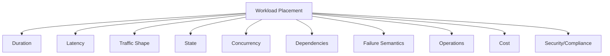
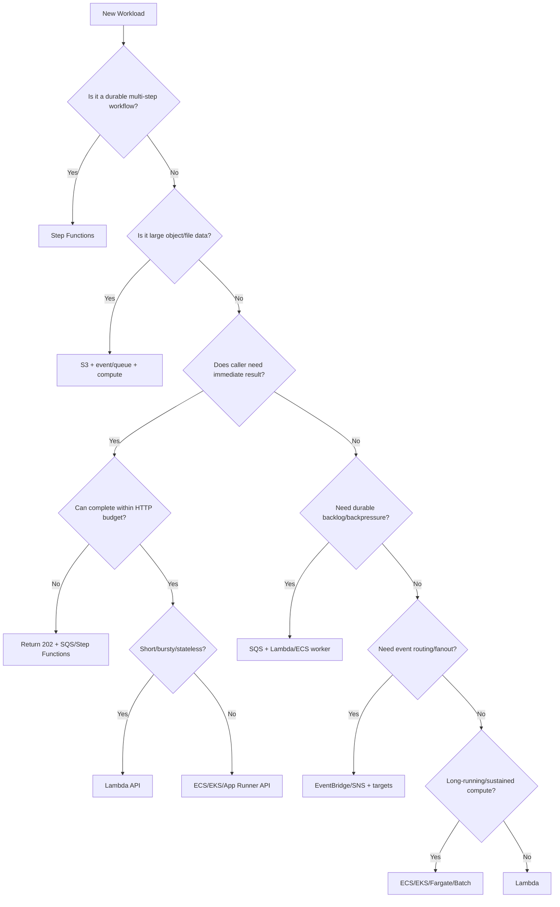

# Part 076 — Workload Placement Decision Framework

Most compute debates are framed badly.

Bad question:

```txt
Should we use Lambda or Kubernetes?
```

Better question:

```txt
What does this workload require from execution, state, latency, scale, failure handling, cost, security, and operations?
```

Compute placement is a decision framework, not a religion.

This part gives a practical framework for choosing between:

- Lambda;
- ECS/Fargate;
- ECS on EC2;
- EKS;
- App Runner;
- Step Functions;
- AWS Batch;
- SQS/EventBridge/SNS;
- DynamoDB/S3/RDS as state/data plane;
- hybrid combinations.

The goal is not to produce one answer.

The goal is to make trade-offs explicit.

---

## 1. Placement Starts With Workload Shape

Before picking a service, describe the workload.

```yaml
workload:
  name: invoice-generation
  trigger: API command
  duration: 2-8 minutes
  traffic: bursty during end-of-month
  payload: references S3 documents
  state: job status and output
  dependencies:
    - billing database
    - PDF rendering library
    - S3
  reliability:
    - no duplicate invoices
    - retryable processing
    - DLQ and redrive
  latency:
    - API should return within 1 second
    - job output within 10 minutes
  security:
    - tenant isolated
    - confidential documents
  cost:
    - cost per invoice matters
  operations:
    - on-call needs status and redrive
```

This description already suggests:

```txt
API Lambda -> SQS -> ECS/Fargate worker or Step Functions -> S3/DynamoDB
```

Not because of preference.

Because duration, payload, state, and reliability suggest it.

---

## 2. The Ten Placement Dimensions

Evaluate every workload on ten dimensions.



### 1. Duration

- milliseconds/seconds;
- minutes;
- hours;
- always-on.

### 2. Latency

- user-facing p99;
- async completion time;
- cold start tolerance;
- queue delay tolerance.

### 3. Traffic Shape

- spiky;
- steady;
- predictable schedule;
- burst after event;
- high sustained throughput.

### 4. State

- stateless;
- small durable state;
- session/connection state;
- workflow state;
- large object state.

### 5. Concurrency

- high parallelism;
- ordered per aggregate;
- downstream-limited;
- connection-limited.

### 6. Dependencies

- AWS APIs;
- VPC resources;
- database;
- external API;
- native binaries;
- GPU/large CPU.

### 7. Failure Semantics

- retry-safe;
- idempotent;
- compensation needed;
- poison records;
- redrive/replay;
- audit critical.

### 8. Operations

- debugging needs;
- deployment model;
- runtime control;
- team skill;
- observability.

### 9. Cost

- idle cost;
- per-request cost;
- steady utilization;
- logs/egress/downstream;
- unit economics.

### 10. Security/Compliance

- data classification;
- network isolation;
- audit;
- encryption;
- runtime control;
- tenant isolation.

---

## 3. Compute Options at a Glance

| Service | Best Fit | Avoid When |
|---|---|---|
| Lambda | short event-driven tasks, bursty APIs/workers | long-running, connection-heavy, custom daemon/runtime control |
| ECS Fargate | container workloads without EC2 management | ultra-tiny sporadic tasks where Lambda simpler |
| ECS on EC2 | high utilization/cost control, custom capacity | team does not want host/capacity management |
| EKS | Kubernetes ecosystem, controllers, platform standard | simple AWS-native event handlers |
| App Runner | simple containerized web apps/APIs | complex networking/orchestration/custom platform needs |
| Step Functions | durable workflow/orchestration | pure compute-heavy task without workflow state |
| AWS Batch | batch/HPC/large compute jobs | low-latency request/response |
| SQS | durable backlog/backpressure | synchronous request requiring immediate result |
| EventBridge | event routing/fanout | queue/backpressure or strict ordering |
| SNS | push pub/sub notifications | complex event governance/replay |
| DynamoDB | key-value/document state/idempotency | ad hoc relational querying/joins |
| S3 | object bytes/files | low-latency mutable record state |

Services are not competitors only.

They are building blocks.

---

## 4. Duration Decision

### Short Work

If work is:

```txt
< few seconds to tens of seconds
stateless or small state
event-driven
bursty
```

Lambda is often strong.

Examples:

- API adapter;
- webhook receiver;
- SQS small message consumer;
- EventBridge consumer;
- S3 metadata validator;
- Step Functions task;
- DynamoDB stream projection.

### Medium Work

If work is:

```txt
minutes
variable duration
needs status
```

Use:

- Step Functions;
- SQS job queue;
- ECS/Fargate worker;
- Lambda only if within timeout and operationally safe.

### Long Work

If work is:

```txt
tens of minutes to hours
```

Use:

- ECS/Fargate;
- EKS Job;
- AWS Batch;
- Step Functions orchestration;
- Glue/EMR/etc depending data type.

Do not hide long work inside Lambda.

### Always-On Work

If work is:

```txt
server process
long-lived connection
Kafka consumer
websocket server
in-memory cache
```

Use containers or specialized managed service.

---

## 5. Latency Decision

### User-Facing API

Ask:

- p95/p99 SLO?
- cold start tolerance?
- request duration?
- auth complexity?
- downstream latency?
- provisioned concurrency justified?
- can work be async?

Options:

| Shape | Placement |
|---|---|
| simple low-latency API | Lambda + API Gateway with SnapStart/provisioned concurrency if needed |
| always-on high-throughput API | ECS/EKS/App Runner |
| long command | API returns 202 + SQS/Step Functions |
| file upload | presigned S3 URL |
| heavy response generation | async job or container |

### Async Latency

For async, user does not wait, but business still has latency.

Measure:

- queue age;
- async event age;
- iterator age;
- workflow duration;
- job completion time.

Async systems need SLOs too.

---

## 6. Traffic Shape Decision

### Spiky and Idle Often

Lambda usually fits.

Examples:

- webhook spikes;
- scheduled small job;
- event consumer with low average traffic;
- dev/internal tool.

### Predictable Peaks

Lambda with provisioned concurrency/scheduled scaling may fit.

ECS/Fargate scheduled scaling may also fit.

### Steady High Utilization

Containers may be more cost-efficient.

Examples:

- 24/7 API with high RPS;
- continuous worker;
- Kafka consumer;
- high-volume transformation.

### Burst With Downstream Limits

Use SQS regardless of compute.

```txt
burst -> queue -> capped consumers
```

Compute choice comes after backpressure decision.

---

## 7. State Decision

### Stateless

Lambda or containers both fine.

Choose by duration/traffic/ops.

### Durable Item State

DynamoDB/RDS with Lambda/ECS.

Use conditional writes/idempotency.

### Workflow State

Step Functions.

Do not encode long workflow state in Lambda memory or container local disk.

### Object State

S3.

Pass references, not bytes.

### Session/Connection State

Containers, managed sessions, or external store.

Lambda execution environment reuse is not session state.

### In-Memory Cache

Containers or external cache.

Lambda `/tmp`/memory cache is opportunistic only.

---

## 8. Concurrency Decision

### High Independent Parallelism

Lambda can scale fast, but protect downstream.

Use:

- reserved concurrency;
- SQS max concurrency;
- Step Functions Map max concurrency;
- DynamoDB capacity/key design.

### Ordered Processing

Use:

- SQS FIFO message groups;
- Kinesis partition key;
- DynamoDB optimistic concurrency;
- Step Functions per aggregate;
- single consumer per group/partition.

### Downstream-Limited

Use queue + cap.

Do not let compute auto-scale beyond dependency.

### Connection-Limited

Containers often better because connection pools are stable and countable.

Lambda can work with RDS Proxy/reserved concurrency but needs careful math.

---

## 9. Dependency Decision

### AWS API Calls Only

Lambda often excellent.

### Private VPC Database

Lambda works but consider:

- VPC config;
- RDS Proxy;
- connection limits;
- reserved concurrency;
- cold/start networking;
- query latency.

Containers may be better for connection-heavy workloads.

### External API

For short calls:

- Lambda with timeout/idempotency.

For slow/rate-limited calls:

- SQS + worker;
- Step Functions;
- containers for sustained workflows;
- circuit breaker.

### Native Libraries

Lambda container image may fit.

If library requires long process/OS control or huge artifacts, ECS/EKS/Fargate may fit better.

### Kafka

Lambda supports MSK/Kafka event source mappings, but long-lived custom Kafka consumers may fit ECS/EKS better when offset/state/control needs are complex.

---

## 10. Failure Semantics Decision

### Simple Retry

Lambda async/SQS/EventBridge may be enough.

### Need Durable Backlog

SQS.

### Need Workflow Compensation

Step Functions.

### Need Poison Record Isolation

SQS DLQ, stream failure destination, Step Functions catch/quarantine.

### Need Human Approval

Step Functions callback token or external workflow.

### Need Replay

EventBridge archive/replay, SQS DLQ redrive, stream retention, S3 manifest, outbox/event log.

### Need Exactly-Once Business Side Effect

No AWS compute option magically gives this.

Use:

- idempotency;
- conditional writes;
- external idempotency keys;
- transactions/outbox;
- reconciliation.

Placement does not remove correctness design.

---

## 11. Operations Decision

### Team Skill

Use what team can operate well.

- If team has no Kubernetes maturity, EKS may be costly operationally.
- If team has no serverless async experience, Lambda/EventBridge can fail subtly.
- If team has no workflow discipline, Step Functions can become spaghetti.

Golden paths reduce skill burden.

### Debugging Needs

Containers provide:

- process-level debugging;
- shell/sidecar/agent patterns;
- long-running logs;
- local parity.

Lambda provides:

- simpler deployment;
- managed scale;
- CloudWatch/X-Ray/Powertools;
- no host management.

### Deployment Needs

- Lambda aliases/canary for functions;
- ECS rolling/blue-green;
- EKS deployment strategies;
- Step Functions versions/aliases;
- EventBridge rule rollout;
- AppConfig flags.

Choose based on operational model, not only runtime.

---

## 12. Cost Decision

### Lambda Cost Good When

- low average utilization;
- bursty;
- short;
- no idle required;
- scale-to-zero valuable;
- ops savings significant.

### Container Cost Good When

- high steady utilization;
- long-running;
- connection-heavy;
- predictable capacity;
- CPU/memory intensive;
- team already operates platform well.

### Step Functions Cost Good When

- workflow visibility/reliability saves engineering time;
- compensation/retry/audit needed;
- direct integrations remove Lambda glue.

### Cost Trap

Comparing only compute cost:

```txt
Lambda GB-seconds vs Fargate vCPU-hours
```

misses:

- logs;
- retries;
- NAT;
- downstream;
- operations;
- incidents;
- deployment safety;
- developer time.

Use unit cost per business outcome.

---

## 13. Security Decision

Ask:

- what data classification?
- public or private endpoint?
- VPC access required?
- IAM role granularity?
- runtime isolation requirements?
- secrets handling?
- audit requirements?
- network egress restrictions?
- tenant isolation?
- compliance retention?

### Lambda Security Strength

- small execution role per function;
- short-lived environments;
- no host patching;
- easy narrow integration.

### Container Security Strength

- custom runtime hardening;
- sidecars/agents;
- network/service mesh controls;
- long-running inspection;
- runtime policies;
- deeper platform controls.

Both can be secure.

Both can be insecure.

Placement must match security controls and team maturity.

---

## 14. Decision Tree



This tree is a simplification, but it forces the right questions.

---

## 15. Scoring Matrix

Use a 1–5 score.

| Dimension | Lambda | ECS/Fargate | EKS | Step Functions |
|---|---:|---:|---:|---:|
| short bursty event | 5 | 3 | 2 | 2 |
| long-running process | 1 | 5 | 5 | 2 |
| workflow state | 2 | 1 | 1 | 5 |
| low ops overhead | 5 | 4 | 2 | 4 |
| custom runtime control | 2 | 4 | 5 | 1 |
| steady high utilization cost | 3 | 5 | 5 | 2 |
| connection-heavy | 2 | 5 | 5 | 1 |
| AWS event integration | 5 | 3 | 3 | 4 |
| compensation/retry visibility | 2 | 2 | 2 | 5 |
| team skill dependent | medium | medium | high | medium |

Do not use this as absolute truth.

Use it to have structured conversations.

---

## 16. Workload Examples

### Example 1 — Payment Capture API

Requirements:

- synchronous response;
- strict idempotency;
- external provider call;
- p95 latency target;
- no duplicate charge.

Placement:

```txt
API Gateway -> Lambda API
DynamoDB idempotency
external provider with idempotency key
EventBridge event after success
```

If provider is slow/unreliable:

```txt
API -> Step Functions or SQS async command
```

depending business UX.

### Example 2 — Monthly PDF Report Generation

Requirements:

- large job;
- minutes;
- S3 output;
- user checks status.

Placement:

```txt
API Lambda -> SQS/Step Functions -> ECS/Fargate worker -> S3 + DynamoDB status
```

### Example 3 — Search Index Projection

Requirements:

- eventually consistent;
- idempotent update;
- bursty events.

Placement:

```txt
EventBridge -> SQS -> Lambda consumer
```

If volume sustained/high:

```txt
EventBridge -> SQS -> ECS worker
```

### Example 4 — Kafka Aggregator

Requirements:

- long-lived partition consumer;
- high throughput;
- stateful processing.

Placement:

```txt
EKS/ECS consumer service
```

with output to:

```txt
EventBridge/SQS/DynamoDB/S3
```

### Example 5 — File Upload Ingestion

Requirements:

- direct upload;
- validation;
- processing;
- output metadata.

Placement:

```txt
API Lambda presigned URL
S3 incoming/
S3 -> SQS
Lambda validator
Step Functions/ECS for heavy processing
DynamoDB metadata
```

---

## 17. Placement by Anti-Requirement

Sometimes decision is made by what service should not do.

### Do Not Use Lambda If

- work exceeds Lambda timeout;
- requires long-lived bidirectional connection;
- requires stable in-memory session;
- requires daemon/background thread reliability;
- requires GPU/custom host;
- needs heavy sustained CPU for cost;
- connection pool math is unsafe;
- debugging/runtime control is central.

### Do Not Use EKS If

- workload is simple event glue;
- team lacks Kubernetes operations maturity;
- no need for cluster ecosystem;
- platform overhead exceeds benefit;
- AWS-native integration is easier with Lambda/Step Functions.

### Do Not Use Step Functions If

- single short function is enough;
- workflow state is unnecessary;
- state transitions would be excessive without value;
- team uses it as visual programming for simple code;
- data payloads are huge and not referenced.

### Do Not Use EventBridge If

- you need durable queue/backpressure as primary feature;
- you need strict ordering;
- you need immediate request/response;
- consumers are command handlers with result expectation.

---

## 18. Placement and Migration Cost

Initial placement can be wrong. Make migration possible.

Use boundaries:

- SQS between producers and workers;
- EventBridge between domains;
- Step Functions for orchestration;
- S3 references for large data;
- API contracts for front door;
- idempotency keys;
- schema versions.

These boundaries let you move compute behind them.

Example:

```txt
SQS consumer starts as Lambda.
Later becomes ECS worker.
Producer unchanged.
```

That is good architecture.

Bad architecture:

```txt
API directly invokes specific Lambda that contains all workflow and side effects.
```

Migration is hard.

---

## 19. Placement Review Template

Use this in design docs.

```yaml
workload:
  name:
  owner:
  criticality:
  dataClassification:

trigger:
  type:
  syncOrAsync:
  expectedRate:
  peakRate:

execution:
  expectedDuration:
  maxDuration:
  memoryCpuNeed:
  coldStartTolerance:
  runtimeDependencies:

state:
  durableState:
  objectData:
  workflowState:
  idempotencyKey:

failure:
  retryableFailures:
  permanentFailures:
  dlq:
  redrive:
  compensation:
  duplicateSafety:

capacity:
  downstreamLimits:
  concurrencyCap:
  backlogSlo:
  rateLimit:

security:
  iam:
  secrets:
  network:
  audit:

operations:
  logsMetricsTraces:
  alarms:
  runbook:
  deployment:
  rollback:

cost:
  unitCostMetric:
  expectedMonthlyVolume:
  majorCostDrivers:

decision:
  selectedServices:
  rejectedOptions:
  tradeoffs:
```

A decision without rejected options is usually not a decision. It is a default.

---

## 20. Decision Smells

### Smell 1 — “We Always Use Lambda”

Likely ignoring workload diversity.

### Smell 2 — “We Always Use EKS”

Likely over-operating simple workloads.

### Smell 3 — “This Lambda Just Orchestrates 8 Steps”

Probably Step Functions.

### Smell 4 — “This API Might Take 5 Minutes”

Probably async job/workflow.

### Smell 5 — “We Need to Slow Down Consumers”

Probably SQS/backpressure.

### Smell 6 — “One Event Should Notify Many Consumers”

Probably EventBridge/SNS, often with SQS per consumer.

### Smell 7 — “We Need Exactly Once”

Probably misunderstanding. Need idempotency/transactions/reconciliation.

### Smell 8 — “We Need to Query by Many Fields in DynamoDB”

Maybe wrong data model or RDS/OpenSearch need.

### Smell 9 — “We Need Shell Access to Debug Lambda”

Maybe container service or better observability.

### Smell 10 — “Kubernetes Because Resume”

Not an architecture reason.

---

## 21. Placement Under Constraints

### Constraint: Team Is Small

Prefer:

- Lambda;
- Step Functions;
- SQS/EventBridge;
- DynamoDB/S3;
- App Runner for simple container API.

Avoid unless necessary:

- EKS;
- custom platforms;
- EC2 cluster management.

### Constraint: High Compliance

Prefer:

- clear account boundaries;
- IAM least privilege;
- KMS;
- audit logs;
- Step Functions for audit workflows;
- S3 Object Lock/versioning where needed;
- explicit runbooks.

Compute can be Lambda or containers, but auditability matters.

### Constraint: Extremely High Throughput

Evaluate:

- containers for steady compute;
- Lambda for burst;
- Kinesis/MSK for streams;
- DynamoDB key design;
- SQS batch/concurrency;
- cost per unit.

### Constraint: Legacy Container App

Maybe:

- ECS/App Runner for first migration;
- then extract async/serverless side paths;
- do not rewrite everything to Lambda immediately.

### Constraint: Fast Product Experiment

Maybe:

- Lambda + DynamoDB + API Gateway;
- AppConfig flags;
- simple EventBridge/SQS;
- revisit if workload becomes sustained/heavy.

---

## 22. Build-vs-Managed Decision

Sometimes the placement question is not just compute.

Ask whether AWS managed service replaces custom compute.

Examples:

| Need | Managed Service Option |
|---|---|
| workflow orchestration | Step Functions |
| queue/backpressure | SQS |
| pub/sub | SNS/EventBridge |
| scheduler | EventBridge Scheduler |
| file storage | S3 |
| key-value state | DynamoDB |
| API front door | API Gateway/ALB/App Runner |
| search | OpenSearch |
| batch compute | AWS Batch |
| ETL | Glue/EMR depending need |

Do not build a scheduler inside ECS if EventBridge Scheduler fits.

Do not build a workflow engine inside Lambda if Step Functions fits.

Do not build a queue in DynamoDB unless SQS does not fit and you understand trade-offs.

---

## 23. Placement and Team Topology

Architecture should match team ownership.

### Single Team, One Service

Simple stack may be fine.

### Multiple Producers/Consumers

EventBridge/SNS/SQS boundaries help.

### Platform Team + Product Teams

Golden paths and templates matter.

### Data Team Consumers

Event contracts, S3 data lake, streams, and governance matter.

### Security/Compliance Stakeholders

Audit trails, account boundaries, KMS, and retention matter.

A compute choice that ignores ownership becomes an operating problem.

---

## 24. Placement and Future Change

Ask:

- if traffic grows 10x, what changes?
- if duration grows 10x, what changes?
- if one tenant becomes 80% traffic, what changes?
- if external API becomes slow, what changes?
- if workflow adds human approval, what changes?
- if we need replay, what changes?
- if we need multi-region, what changes?

Choose boundaries that preserve optionality.

SQS/EventBridge/S3 references/Step Functions often preserve optionality better than direct synchronous coupling.

---

## 25. Migration Playbook by Trigger

| Trigger | Likely Migration |
|---|---|
| Lambda timeout pressure | Lambda -> Step Functions/ECS worker |
| Lambda cost high steady traffic | Lambda worker/API -> ECS/Fargate/App Runner |
| container side tasks bursty | ECS side work -> SQS/Lambda |
| workflow hidden in code | code chain -> Step Functions |
| downstream overload | direct invoke -> SQS buffer |
| event fanout growing | direct calls -> EventBridge/SNS |
| file payload through API | API payload -> S3 presigned upload |
| DynamoDB query complexity | add access-pattern index or move read model |
| queue consumer heavy sustained | Lambda consumer -> ECS worker |
| low-latency Java cold start issue | SnapStart/provisioned concurrency or container API |

Migration should preserve contracts where possible.

---

## 26. Placement Decision Checklist

### Workload

- [ ] Duration known.
- [ ] Latency SLO known.
- [ ] Traffic pattern known.
- [ ] State needs classified.
- [ ] Payload size known.
- [ ] Dependencies listed.
- [ ] Ordering requirement known.

### Reliability

- [ ] Retry semantics known.
- [ ] Idempotency key defined.
- [ ] DLQ/failure path defined.
- [ ] Backpressure need evaluated.
- [ ] Workflow/compensation need evaluated.
- [ ] Replay/redrive requirement known.

### Operations

- [ ] Team skill considered.
- [ ] Deployment strategy known.
- [ ] Observability plan.
- [ ] Runbook owner.
- [ ] Debugging needs considered.
- [ ] Migration path considered.

### Security/Cost

- [ ] IAM/network/secrets requirements.
- [ ] Data classification.
- [ ] Unit cost driver identified.
- [ ] Idle vs utilization evaluated.
- [ ] Downstream cost included.

### Decision

- [ ] Selected services listed.
- [ ] Rejected alternatives documented.
- [ ] Trade-offs explicit.
- [ ] Review date set.

---

## 27. Common Anti-Patterns

### Anti-Pattern 1 — Compute First, Workload Later

Team chooses platform before describing workload.

### Anti-Pattern 2 — Ignoring Failure Semantics

Placement based on happy path only.

### Anti-Pattern 3 — No Migration Boundary

Producer tightly coupled to current compute.

### Anti-Pattern 4 — Cost Compared Without Reliability

Cheaper service selected but DLQ/replay/audit missing.

### Anti-Pattern 5 — Serverless Used for Stateful Daemon

Wrong execution contract.

### Anti-Pattern 6 — Kubernetes Used for Tiny Glue

Operational overhead dominates value.

### Anti-Pattern 7 — EventBridge Used Instead of Queue

No consumer backpressure.

### Anti-Pattern 8 — SQS Used Instead of Workflow

No visibility into multi-step process.

### Anti-Pattern 9 — DynamoDB Used for Arbitrary Queries

Access patterns not modeled.

### Anti-Pattern 10 — Step Functions Used for Pure CPU Loop

Wrong tool for compute-heavy tight loop.

---

## 28. Final Mental Model

Workload placement is architecture under constraints.

The correct answer is not:

```txt
Lambda
```

or:

```txt
EKS
```

The correct answer is a composition:

```txt
front door
execution
queue/event boundary
state store
workflow
object store
observability
failure path
deployment model
```

A top-tier engineer makes placement decisions by asking:

```txt
What contract does this workload need today,
what failure mode must it survive,
what scale/cost might it reach,
and what boundary lets us change compute later?
```

That is workload placement engineering.

---

## References

- AWS Lambda Developer Guide: event-driven architectures
- AWS Lambda Developer Guide: event source mappings
- AWS Step Functions Developer Guide: integrating services and optimized integrations
- AWS Step Functions Developer Guide: run ECS/Fargate tasks
- Amazon EventBridge Scheduler documentation
- AWS Well-Architected Framework and Serverless Applications Lens
- Amazon ECS, Amazon EKS, AWS Fargate, AWS App Runner, Amazon SQS, Amazon EventBridge, Amazon SNS, DynamoDB, and S3 documentation
