# Part 077 — Migration and Modernization Patterns

Modernization is not rewriting everything.

Modernization is changing the shape of a system while preserving business continuity.

The safest modernization strategy is usually incremental:

```txt
create boundary
route a small slice
observe
expand
retire old path
```

Not:

```txt
rewrite whole monolith
big-bang cutover
hope data is consistent
```

AWS containers and serverless services give many migration boundaries:

- API Gateway / ALB routes;
- SQS queues;
- EventBridge event buses;
- SNS topics;
- Step Functions workflows;
- DynamoDB tables;
- S3 object prefixes;
- Lambda aliases;
- ECS/EKS services;
- AppConfig flags;
- database outbox;
- CDC streams;
- shadow consumers.

This part is about using those boundaries to modernize safely.

---

## 1. Migration Mental Model

A migration is a controlled change from old behavior to new behavior.

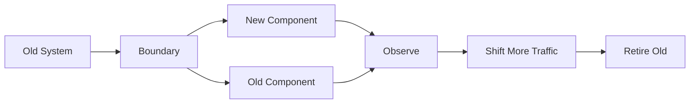

The boundary is the most important design decision.

Good boundaries:

- API route;
- queue;
- event;
- object prefix;
- workflow state;
- read model;
- feature flag;
- database table;
- consumer group.

Bad boundaries:

- shared mutable global state;
- direct function-to-function chains;
- hidden side effects;
- undocumented database writes;
- manual routing;
- one-off scripts without idempotency.

### Migration Rule

```txt
Before changing compute, create a stable contract boundary.
```

If you can preserve the contract, you can change implementation behind it.

---

## 2. Modernization Goals

Do not modernize because the architecture diagram looks old.

Modernize because you need one or more outcomes:

| Goal | Example |
|---|---|
| reduce operational load | move cron jobs to Scheduler + Lambda/Step Functions |
| improve resilience | add SQS backpressure and DLQ |
| improve deployment speed | extract service with independent release |
| improve scalability | move heavy worker to ECS/Fargate |
| reduce cost | move sustained Lambda worker to container |
| improve auditability | extract workflow into Step Functions |
| improve security | least-privilege roles per function/worker |
| improve team ownership | split domain event consumers |
| improve recovery | add outbox/replay/redrive |
| improve user latency | async handoff and job status |

Every migration should state its success metric.

Example:

```txt
Reduce invoice generation p95 completion time from 45m to 10m
and reduce manual retry tickets by 90%.
```

---

## 3. Strangler Fig Pattern

The strangler fig pattern gradually replaces old system behavior with new components.

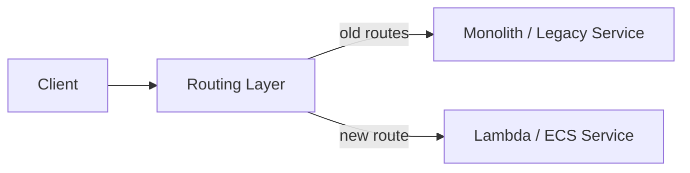

Routing layer can be:

- API Gateway;
- ALB path/host rules;
- CloudFront;
- service mesh ingress;
- application router;
- feature flag route;
- DNS only for coarse cutover.

### Use When

- monolith has many routes/features;
- route boundaries are clear;
- new team can own extracted slice;
- rollback route is possible;
- data dependencies are manageable.

### Steps

1. inventory routes/capabilities;
2. select low-risk slice;
3. define contract;
4. implement new path;
5. mirror/shadow if possible;
6. route small traffic;
7. compare outputs/metrics;
8. expand;
9. retire old route.

### Avoid

- extracting route that depends on many hidden monolith side effects;
- sharing write ownership over same tables without concurrency plan;
- breaking session/auth behavior;
- no rollback path.

---

## 4. Route Carving: API Modernization

Example old system:

```txt
ALB -> monolith ECS service
```

New:

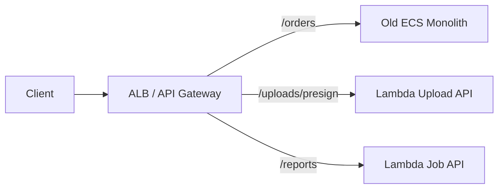

### Good Candidate Routes

- presigned upload creation;
- webhooks;
- async job submission;
- read-only lightweight query;
- notification preference;
- admin action;
- status endpoint;
- isolated new feature.

### Bad Early Candidates

- complex transaction spanning many monolith tables;
- critical payment path with unknown side effects;
- route dependent on in-memory monolith session;
- route with undocumented authorization behavior;
- route needing synchronous call back into monolith for most logic.

### Compatibility

Keep:

- auth claims;
- error envelope;
- status codes;
- idempotency behavior;
- headers/correlation IDs;
- rate limiting;
- audit logs.

Clients should not know route implementation changed.

---

## 5. Async Extraction With SQS

A common modernization is inserting a queue.

Old:

```txt
API -> monolith does long work synchronously
```

New:

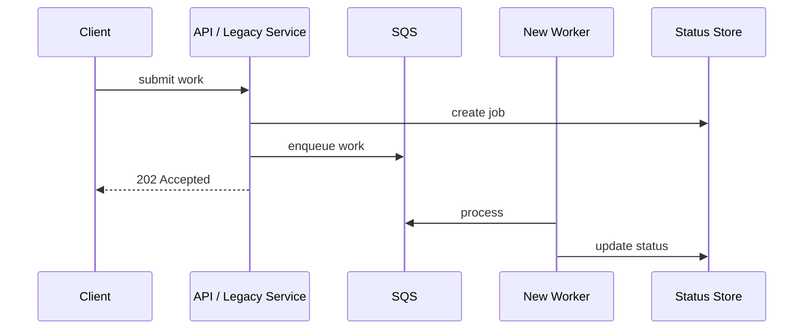

### Use When

- work is long or variable;
- API timeouts happen;
- retries are manual;
- downstream needs pacing;
- processing can be asynchronous;
- job status can be modeled.

### Benefits

- decouples user latency from processing;
- creates backlog visibility;
- enables Lambda/ECS worker selection later;
- adds DLQ/redrive;
- protects downstream;
- improves operational control.

### Migration Steps

1. add job status model;
2. add queue;
3. have old system enqueue while still processing synchronously in shadow if needed;
4. build worker idempotently;
5. switch API to 202 response;
6. monitor job completion;
7. retire synchronous path.

### Critical Control

The enqueue operation and job record creation must be consistent.

Use transaction/outbox where needed.

---

## 6. Event Extraction With Outbox

Old monolith changes state but does not emit events.

New architecture needs events.

Do not publish events directly from random application code without transaction safety.

Use outbox.

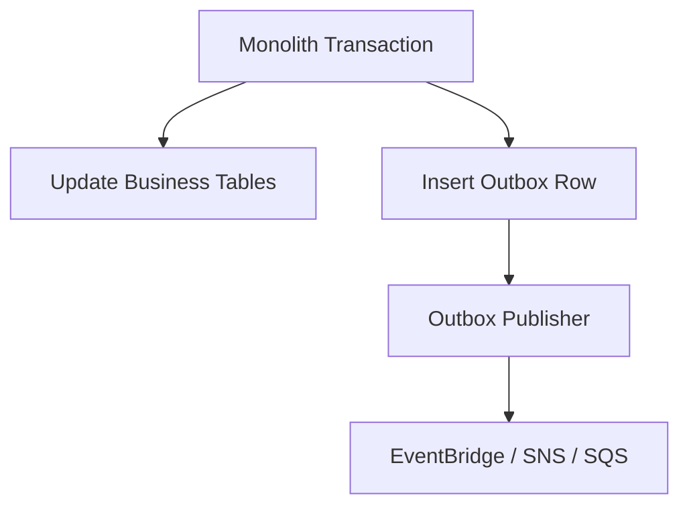

### Why Outbox?

Without outbox:

```txt
DB commit succeeds, publish fails -> event missing
publish succeeds, DB commit fails -> false event
```

Outbox makes state change and event intent atomic in same database transaction.

### Outbox Publisher

Can be:

- ECS/EKS background worker;
- Lambda scheduled poller;
- Debezium/CDC pipeline;
- DynamoDB stream consumer;
- database trigger + worker pattern.

### Event Contract

Outbox event should include:

- event ID;
- aggregate ID/version;
- schema version;
- occurredAt;
- correlation/causation ID;
- tenant ID;
- business payload.

### Migration Value

Outbox lets you add new serverless consumers without changing old transaction flow too much.

---

## 7. Shadow Consumer Pattern

Shadow consumer receives copy of production events but does not produce user-visible side effects.

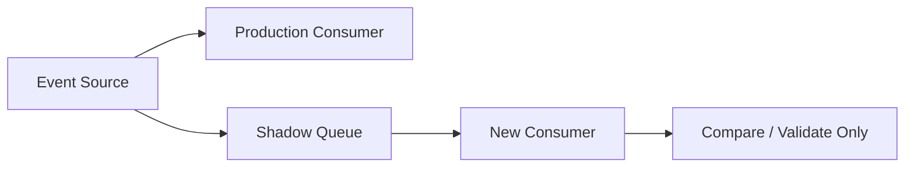

Use for:

- validating new implementation;
- comparing old vs new outputs;
- testing performance;
- testing schema support;
- warming up caches;
- assessing cost.

### Shadow Output

Write to:

```txt
shadow table
shadow S3 prefix
comparison log
metrics only
```

Do not write to production side-effect systems.

### Promotion

Once shadow metrics match:

1. enable side effects for small tenant/traffic;
2. compare again;
3. gradually expand;
4. keep rollback path.

Shadowing is one of the safest migration tools.

---

## 8. Dual-Write Hazard

Dual-write is writing to old and new systems in one request path.

Example:

```txt
API writes old DB
API writes new DynamoDB
```

Problem:

```txt
old write succeeds
new write fails
request retries
state diverges
```

Dual-write can be necessary temporarily, but it is dangerous.

### Safer Alternatives

- outbox event from source of truth;
- CDC replication;
- expand/contract with idempotent writes;
- transaction if same database;
- Step Functions saga if cross-system side effects need compensation;
- reconciliation job.

### If You Must Dual-Write

Use:

- idempotency key;
- deterministic target keys;
- retry with bounded attempts;
- write audit;
- reconciliation process;
- alarms on divergence;
- clear migration window;
- rollback plan.

Do not leave dual-write as permanent architecture.

---

## 9. Expand/Contract Migration

Use expand/contract for data/schema changes.

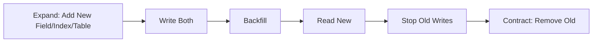

Examples:

- adding DynamoDB GSI;
- migrating S3 prefix layout;
- moving job state from RDS to DynamoDB;
- splitting queue;
- adding event schema v2;
- replacing Lambda worker with ECS worker;
- moving API route.

### Rules

- each phase is independently deployable;
- rollback possible before contract phase;
- compatibility maintained during overlap;
- metrics prove completeness;
- old path removed only after confidence.

Big-bang migrations fail because they skip phases.

---

## 10. Lambda to ECS/Fargate Migration

Move from Lambda to containers when:

- workload is long-running;
- duration approaches timeout;
- sustained traffic makes containers cheaper;
- connection pooling matters;
- dependencies are large/native;
- process lifecycle/control is needed;
- debugging requires container runtime;
- memory/CPU profile exceeds Lambda sweet spot.

### Best Boundary: Queue

Old:

```txt
SQS -> Lambda worker
```

New:

```txt
SQS -> ECS/Fargate worker
```

The message contract stays.

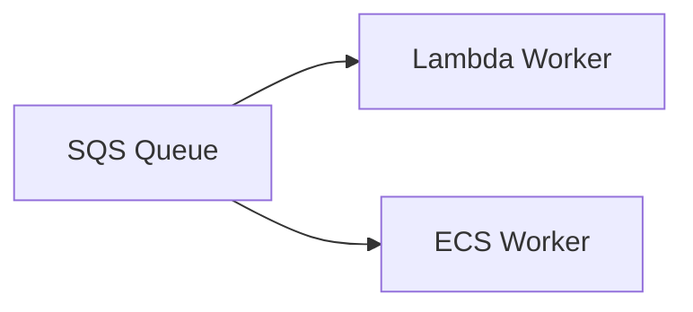

### Migration Steps

1. keep queue/message schema unchanged;
2. implement ECS worker with same idempotency store;
3. run shadow queue if possible;
4. disable Lambda event source mapping or reduce concurrency;
5. scale ECS worker gradually;
6. monitor backlog/DLQ/downstream;
7. remove Lambda mapping after stability.

### Watch Out

- visibility timeout;
- long polling;
- delete message after success;
- graceful shutdown;
- idempotency;
- connection pool size;
- container autoscaling based on queue age/depth;
- DLQ ownership.

---

## 11. ECS/EKS to Lambda Extraction

Move small side tasks from containers to Lambda when:

- task is bursty;
- task is event-driven;
- task is independent;
- task does not need long-running process;
- side work should scale separately;
- operations can be simplified.

Example:

```txt
ECS service writes outbox event
EventBridge routes to Lambda notification consumer
```

Use cases:

- send notification;
- update projection;
- generate small thumbnail;
- webhook intake;
- audit/event enrichment;
- lightweight scheduled cleanup;
- S3 metadata validation.

### Benefits

- reduces code in core service;
- independent deployment;
- independent scaling;
- narrower IAM;
- clearer side-effect ownership.

### Watch Out

- event schema;
- duplicate processing;
- idempotency;
- side-effect ordering;
- eventual consistency;
- observability across service boundary.

---

## 12. Lambda Chain to Step Functions

Old pattern:

```txt
Lambda A -> Lambda B -> Lambda C -> Lambda D
```

Problems:

- hidden workflow;
- nested timeouts;
- unclear retry boundaries;
- hard audit;
- rollback complexity;
- partial failure ambiguity.

New:

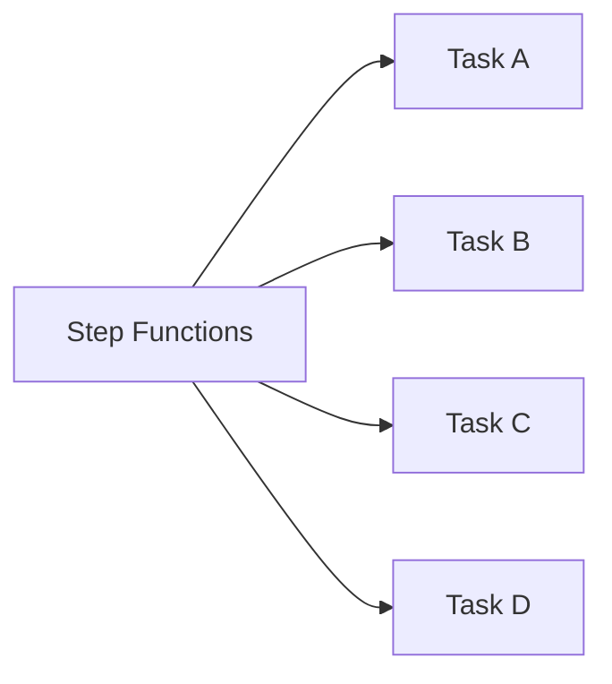

### Migration Steps

1. map implicit workflow;
2. define state machine;
3. define task input/output contracts;
4. classify errors;
5. add retry/catch;
6. make tasks idempotent;
7. start new executions through Step Functions;
8. let old chain drain;
9. remove direct invokes.

### Benefit

Workflow becomes visible, retryable, redrivable, and auditable.

---

## 13. Direct EventBridge to SQS Buffer Migration

Old:

```txt
EventBridge -> Lambda -> RDS
```

During spike, RDS overloads.

New:

```txt
EventBridge -> SQS -> Lambda/ECS worker -> RDS
```

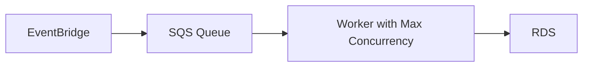

### Steps

1. create queue/DLQ;
2. create worker with idempotency;
3. set concurrency cap based on RDS capacity;
4. change EventBridge target to queue;
5. test synthetic event;
6. monitor queue age and DB;
7. disable old direct target.

### Why It Works

The queue becomes the shock absorber.

You can later move worker from Lambda to ECS without changing producer.

---

## 14. Monolith Cron to EventBridge Scheduler

Old:

```txt
cron inside EC2/container/monolith
```

Problems:

- hidden schedules;
- no per-schedule ownership;
- no DLQ;
- hard failover;
- overlaps;
- manual deployment.

New:

```txt
EventBridge Scheduler -> Lambda / SQS / Step Functions / ECS task
```

### Migration Steps

1. inventory cron jobs;
2. classify job duration/criticality;
3. choose target:
   - short: Lambda
   - long: ECS/Step Functions
   - buffered: SQS
4. define idempotent run ID;
5. add DLQ/retry policy;
6. disable old cron after validation.

### Overlap Control

Recurring jobs need:

- idempotent run key;
- lease/lock;
- max runtime;
- skip/queue policy when previous run still active.

Do not migrate cron without overlap semantics.

---

## 15. File Upload Modernization

Old:

```txt
client -> monolith -> file bytes -> local disk/shared storage
```

New:

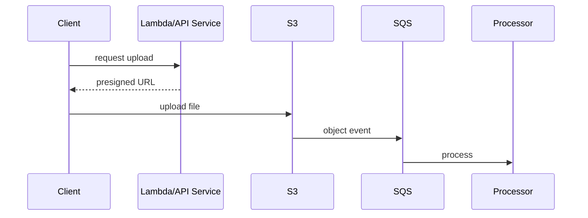

### Migration Steps

1. create S3 bucket/prefix model;
2. implement presigned URL API;
3. write upload metadata record;
4. process S3 events through queue;
5. migrate clients gradually;
6. backfill old files if needed;
7. retire local/shared storage.

### Watch Out

- filename/content-type trust;
- object key tenant isolation;
- versioning;
- recursive triggers;
- lifecycle policies;
- object metadata migration;
- authorization model;
- old links/download URLs.

---

## 16. Database Modernization

Do not “lift and shift” data blindly.

Patterns:

### Read Model Extraction

Keep source DB as system of record.

Use outbox/CDC/events to build DynamoDB/OpenSearch/S3 read model.

```txt
RDS -> outbox/CDC -> EventBridge/SQS -> DynamoDB projection
```

### Command Side Extraction

Harder.

Requires:

- ownership of write model;
- transactional boundary;
- migration of invariants;
- idempotency;
- backward compatibility.

### Table Split

Monolith owns old table.

New service owns new table.

Use events to synchronize read-only data instead of shared write access.

### Data Backfill

Use:

- snapshot/export;
- S3 manifest;
- Step Functions Distributed Map;
- ECS/Batch;
- controlled concurrency;
- idempotent writes;
- reconciliation.

### Reconciliation

Every data migration needs reconciliation:

```txt
count comparison
sample comparison
business invariant comparison
lag metric
error report
```

---

## 17. Event Schema Migration

Event schemas evolve during modernization.

Use versioning.

```txt
OrderCreated v1
OrderCreated v1.1 additive
OrderCreated v2 breaking
```

### Consumer-First Change

For breaking changes:

1. create new schema;
2. update consumers to support both old and new;
3. deploy consumers;
4. switch producer;
5. monitor old/new usage;
6. deprecate old.

### Bad

```txt
producer changes field name
consumers fail at runtime
```

### Rule

```txt
Producer should not deploy breaking event changes before consumers are compatible.
```

Event contracts are migration contracts.

---

## 18. Authorization Migration

Auth behavior is often hidden in old systems.

Before extracting a route/workflow:

- identify authentication source;
- identify authorization rules;
- identify tenant boundary;
- identify audit behavior;
- identify admin overrides;
- identify legacy exceptions;
- identify session/context dependencies.

### Migration Risk

New Lambda route validates JWT but misses domain authorization.

Old monolith had:

```txt
case.assignedRegion == user.region
```

New route forgets it.

Security regression.

### Pattern

Extract authorization policy into shared tested library or dedicated authorization service where appropriate.

But avoid shared library becoming a deployment bottleneck.

---

## 19. Observability During Migration

During migration, observe old and new paths together.

Metrics:

- traffic split;
- success/error rate;
- latency;
- business outcome count;
- duplicate count;
- divergence count;
- DLQ depth;
- cost per path;
- downstream pressure;
- old/new output comparison.

Logs:

```json
{
  "migration": "invoice-worker-v2",
  "path": "shadow",
  "oldResultHash": "...",
  "newResultHash": "...",
  "match": true,
  "jobId": "job-123"
}
```

### Compare Outcomes

For shadow/double-run, compare:

- response status;
- output hash;
- state transition;
- side-effect intent;
- processing duration;
- error classification.

Do not compare raw timestamps or nondeterministic fields.

---

## 20. Rollback Strategy

Every migration phase needs rollback.

| Phase | Rollback |
|---|---|
| route carving | route back to old service |
| queue insertion | point producer back or drain queue |
| event extraction | disable new rules/consumers |
| shadow consumer | disable shadow target |
| new worker | reduce concurrency/disable mapping |
| schema migration | producer emits old version |
| data read switch | flag reads old model |
| workflow migration | start new executions on old workflow |

### Rollback Warning

If new path wrote data or side effects, rollback does not undo them.

Need:

- compensation;
- reconciliation;
- data repair;
- idempotent side effects;
- audit trail.

The rollback plan must include data.

---

## 21. Migration Runbook Template

```yaml
migration: invoice-worker-lambda-to-ecs
owner: billing-platform
goal: reduce timeout failures and improve sustained throughput
oldPath:
  source: SQS invoice-queue
  consumer: Lambda invoice-worker
newPath:
  consumer: ECS invoice-worker-v2
boundary: SQS message contract
successMetrics:
  - queueAgeP95 < 2m
  - DLQ = 0
  - duplicateInvoices = 0
  - costPerInvoice reduced 20%
phases:
  - build shadow worker
  - shadow compare
  - 10% traffic/concurrency
  - 50%
  - 100%
rollback:
  - stop ECS service
  - re-enable Lambda mapping
  - preserve DLQ messages
dataRepair:
  - reconcile invoice output by invoiceRequestId
```

A migration without a runbook is an experiment on production.

---

## 22. Migration Testing

Test:

- old/new contract compatibility;
- idempotency under duplicate;
- data backfill correctness;
- rollback;
- DLQ path;
- shadow comparison;
- authorization parity;
- cost impact;
- load/concurrency;
- observability fields;
- event schema compatibility;
- deployment ordering.

### Migration-Specific Failure Tests

- old producer emits old event to new consumer;
- new producer emits new event to old consumer during rollback;
- duplicate event during cutover;
- old and new consumers both process same event;
- partial backfill failure;
- feature flag toggled mid-workflow;
- queue backlog during cutover.

---

## 23. Cutover Strategies

### Big Bang

All traffic at once.

Use only when:

- low risk;
- rollback simple;
- data state small;
- strong tests;
- maintenance window acceptable.

### Canary

Small percentage or subset.

Use for:

- API routes;
- Lambda alias;
- tenant allowlist;
- consumer concurrency.

### Blue/Green

Old and new environments.

Use for:

- APIs/services;
- container migrations;
- workflow versions.

### Shadow

New path observes without side effects.

Use for:

- complex logic;
- data transformation;
- cost/performance validation.

### Parallel Run

Both produce outputs, compare, then switch read.

Use for:

- read model migration;
- report generation;
- analytics/projections.

Choose strategy per risk.

---

## 24. Decommissioning

Migration is not complete when new path works.

It is complete when old path is safely removed.

Decommission checklist:

- traffic zero on old path;
- old consumers disabled;
- old event rules removed;
- old queues drained/archived;
- old DLQs inspected;
- old IAM roles removed;
- old secrets deleted/rotated;
- old dashboards retired;
- old alarms removed or redirected;
- old data retention decided;
- old code deleted;
- docs updated;
- cost verified.

Old paths left alive become security/cost/reliability debt.

---

## 25. Common Anti-Patterns

### Anti-Pattern 1 — Big-Bang Rewrite

High risk, delayed feedback, unclear rollback.

### Anti-Pattern 2 — Dual-Write Forever

Permanent consistency hazard.

### Anti-Pattern 3 — Extract Route Without Auth Parity

Security regression.

### Anti-Pattern 4 — New Consumer Without Idempotency

Cutover duplicates side effects.

### Anti-Pattern 5 — No Shadow/Comparison

New path trusted without evidence.

### Anti-Pattern 6 — Queue Added Without DLQ/Runbook

Backpressure exists but recovery absent.

### Anti-Pattern 7 — Producer Breaks Event Schema First

Consumers fail.

### Anti-Pattern 8 — Data Migration Without Reconciliation

Unknown correctness.

### Anti-Pattern 9 — Rollback Only in Code

Data and side effects ignored.

### Anti-Pattern 10 — Old Resources Never Decommissioned

Cost, attack surface, and operational confusion remain.

---

## 26. Migration Checklist

### Strategy

- [ ] Goal and success metric defined.
- [ ] Boundary identified.
- [ ] Old/new contract documented.
- [ ] Cutover strategy selected.
- [ ] Rollback strategy defined.
- [ ] Data repair strategy defined.

### Correctness

- [ ] Idempotency key.
- [ ] Duplicate/retry behavior.
- [ ] Authorization parity.
- [ ] Event schema compatibility.
- [ ] Data reconciliation.
- [ ] Side-effect audit.

### Operations

- [ ] Shadow/canary metrics.
- [ ] DLQ alarms.
- [ ] Dashboards compare old/new.
- [ ] Runbook.
- [ ] Owner/on-call.
- [ ] Cost visibility.

### Decommission

- [ ] Old path traffic zero.
- [ ] Old resources removed.
- [ ] Secrets/IAM cleaned.
- [ ] Documentation updated.
- [ ] Cost reduction verified.

---

## 27. Final Mental Model

Modernization is the art of changing implementation while preserving contracts.

AWS gives you many safe migration boundaries:

```txt
API routes
queues
events
workflows
object prefixes
aliases
feature flags
outbox
read models
```

A top-tier engineer does not ask:

> “How do we rewrite this in Lambda/ECS/EKS?”

They ask:

> “What boundary lets us move one behavior safely, compare it, roll it back, and eventually delete the old path?”

That is modernization engineering.

---

## References

- AWS Prescriptive Guidance: migration and modernization patterns
- AWS Lambda Developer Guide: asynchronous invocation, retries, and destinations
- Amazon SQS Developer Guide: dead-letter queues and redrive
- Amazon EventBridge User Guide: event buses, rules, archives, and replays
- AWS Step Functions Developer Guide: service integrations, versions, aliases, and redrive
- Amazon ECS and Amazon EKS documentation for containerized worker migrations
- AWS Well-Architected Framework: Operational Excellence and Reliability pillars
