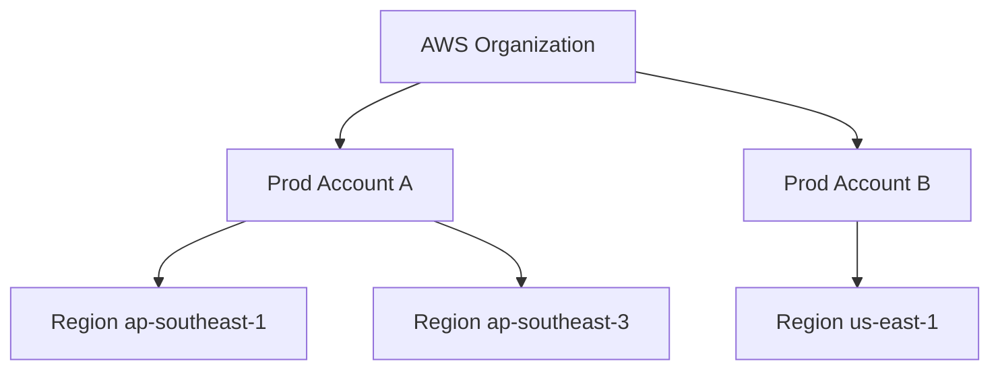
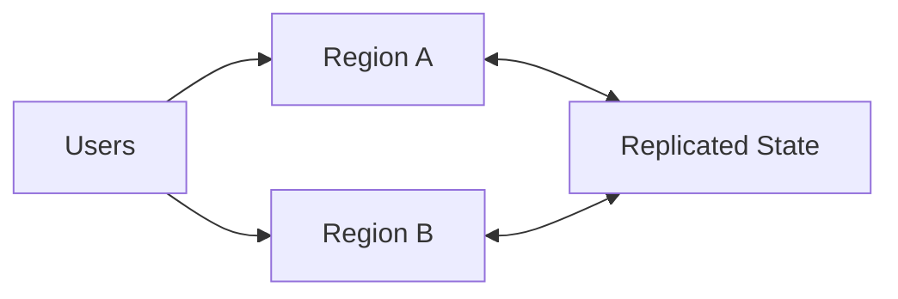
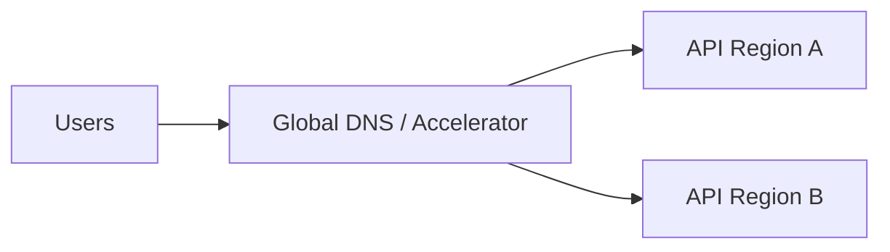
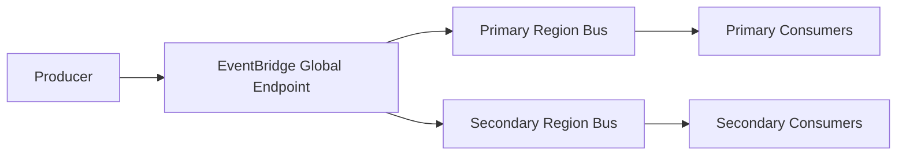
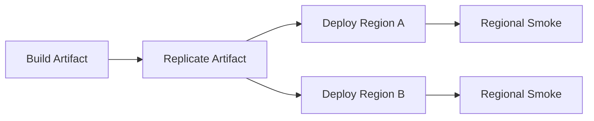

# Part 078 — Multi-Account Multi-Region Resilience

Multi-Region architecture is not a checkbox.

It is a system-wide commitment.

You must replicate or re-create:

- code artifacts;
- container images;
- Lambda functions;
- ECS/EKS services;
- API front doors;
- DNS/failover controls;
- state stores;
- object storage;
- secrets;
- configuration;
- event buses;
- queues;
- workflows;
- schedules;
- IAM/KMS policies;
- observability;
- runbooks;
- operator access;
- data repair processes.

A system can run across two Regions and still fail over incorrectly.

A system can use managed services and still lose business continuity because state, events, or idempotency were not designed.

The advanced question is:

```txt
What exactly happens to every in-flight request, event, message, workflow, object, and side effect when one Region fails?
```

This part helps you answer that.

---

## 1. Region and Account Mental Model

AWS accounts and Regions are different boundaries.



### Account Boundary

Account separates:

- IAM/security;
- billing;
- quotas;
- blast radius;
- logs;
- ownership;
- compliance;
- environment.

### Region Boundary

Region separates:

- physical geography;
- service control planes/data planes;
- latency;
- data residency;
- disaster domain;
- regional quotas;
- regional resources.

Multi-account does not automatically give multi-region.

Multi-region does not automatically give security isolation.

You need both intentionally.

---

## 2. DR Strategies

AWS Well-Architected commonly discusses several DR strategies.

| Strategy | RTO/RPO Shape | Example |
|---|---|---|
| backup and restore | longer RTO/RPO | restore data + redeploy |
| pilot light | core minimal resources ready | DB replica, infra templates |
| warm standby | scaled-down full environment | secondary stack running low capacity |
| active-active | both Regions serve traffic | multi-region writes/reads |

### Serverless Interpretation

#### Backup and Restore

- Lambda/ECS artifacts stored;
- IaC can recreate;
- DynamoDB backup/PITR;
- S3 version/replication/backups;
- manual DNS cutover.

#### Pilot Light

- state replication ready;
- artifacts replicated;
- minimal services deployed;
- scale up on failover.

#### Warm Standby

- full stack deployed in secondary;
- low capacity/provisioning;
- health checks run;
- event replication tested.

#### Active-Active

- traffic served in multiple Regions;
- state conflict strategy;
- event duplicate/ordering strategy;
- regional isolation;
- failover often automatic or fast.

Higher readiness usually means higher cost and complexity.

---

## 3. RTO and RPO

Define RTO and RPO per workflow.

```txt
RTO = how long until service is restored
RPO = how much data loss is acceptable
```

Examples:

| Workflow | RTO | RPO |
|---|---:|---:|
| public marketing page | 1h | low importance |
| payment capture | 5m | near-zero |
| audit event writer | 15m | zero tolerated loss, delayed okay |
| search projection | 30m | can rebuild |
| report generation | 4h | jobs can resume |
| file upload | 15m | no uploaded object loss |
| analytics | 24h | can backfill |

Do not set one RTO/RPO for everything.

Critical path and side effects need different strategies.

---

## 4. Multi-Region Topologies

### Active-Passive

One Region serves traffic. Secondary waits.


Pros:

- simpler conflict model;
- lower risk of concurrent writes;
- easier reasoning.

Cons:

- failover time;
- secondary readiness must be tested;
- capacity scale-up needed;
- failback process required.

### Active-Active

Multiple Regions serve traffic.



Pros:

- low latency globally;
- fast regional evacuation;
- higher availability.

Cons:

- data conflict complexity;
- duplicate events;
- ordering issues;
- operational complexity;
- cost;
- compliance.

### Active-Active Rule

If two Regions can write the same business entity, you need conflict strategy.

Not just replication.

---

## 5. Control Plane vs Data Plane in DR

AWS services have control planes and data planes.

During incident, control plane operations may be degraded even if data plane continues.

DR design should not depend on making many new control-plane changes during outage.

Bad failover:

```txt
during outage:
  create all functions
  create all queues
  create all roles
  build images
  deploy cluster
  configure DNS
```

Better:

```txt
pre-provision secondary resources
replicate artifacts
test health regularly
fail traffic/routing
scale capacity
```

### Rule

```txt
For low RTO, pre-create what you need before the incident.
```

IaC is necessary but not sufficient for fast DR.

---

## 6. Artifact Replication

You cannot fail over if code artifacts are unavailable.

Artifacts:

- Lambda ZIP packages;
- Lambda container images;
- Lambda layers;
- ECS/EKS container images;
- Step Functions definitions;
- IaC templates;
- configuration profiles;
- scripts/runbooks;
- database migration tools.

### ECR Replication

Amazon ECR supports private image replication across Regions and accounts. Cross-account replication requires the destination account to configure registry permissions to allow replication.

Use ECR replication for:

- ECS/EKS/Fargate images;
- Lambda container images;
- shared base images;
- multi-account deployment.

### Lambda ZIP Artifacts

Store build artifacts in replicated S3/artifact repository.

Record:

- checksum;
- source commit;
- version;
- Region deployed;
- layer versions.

### Artifact Rule

```txt
Do not make secondary Region build artifacts during outage.
Replicate/promote them before outage.
```

---

## 7. Lambda Multi-Region

Lambda functions are regional.

Multi-Region Lambda requires:

- deploy function to each Region;
- deploy aliases/versions in each Region;
- replicate artifacts/layers/images;
- recreate IAM roles/policies;
- configure environment variables per Region;
- configure secrets/KMS per Region;
- configure event sources per Region;
- configure alarms/logs per Region;
- test health per Region.

### Lambda State

Lambda local state is irrelevant to DR.

Durable state is external:

- DynamoDB;
- S3;
- RDS;
- SQS;
- EventBridge;
- Step Functions.

### Lambda Async Events

Asynchronous invocation uses a regional internal queue. If Region fails, in-flight async events in that Region may not be available elsewhere unless producer/event source also replicated events to another Region.

Use explicit durable event storage/replication if RPO requires it.

### Lambda DR Checklist

- function deployed in secondary;
- alias/version exists;
- provisioned concurrency/SnapStart strategy if needed;
- IAM/KMS/secret access works;
- VPC config/subnets/security groups exist;
- event source mappings tested;
- DLQs exist;
- dashboards/alarms exist;
- synthetic invocation passes.

---

## 8. ECS/EKS Multi-Region

Containers require regional capacity.

For ECS/Fargate:

- clusters in each Region;
- task definitions;
- services;
- load balancers;
- target groups;
- autoscaling;
- secrets;
- logs;
- IAM task roles;
- ECR image replicated;
- networking.

For EKS:

- clusters in each Region;
- node groups/Fargate profiles/Karpenter;
- add-ons;
- IRSA/Pod Identity;
- ingress controllers;
- service mesh if used;
- manifests/Helm/GitOps;
- secrets;
- container images replicated;
- observability stack.

### Warm Standby

Keep secondary Region running low capacity.

Pros:

- verifies deployment;
- detects drift;
- reduces failover time.

Cons:

- cost;
- operational overhead;
- data synchronization needed.

### Cold Restore

Cheaper, slower, riskier.

Use only for workloads with longer RTO.

---

## 9. API and DNS Failover

Front door options:

- Route 53 failover/latency/weighted routing;
- AWS Global Accelerator;
- CloudFront;
- API Gateway custom domains per Region;
- ALB per Region;
- Route 53 ARC for advanced recovery controls.

### API Failover Design



Need:

- health checks that reflect business readiness;
- regional API endpoints;
- auth availability;
- TLS certs;
- WAF configuration;
- rate limits;
- rollback/failback control.

### Health Check Warning

A `/health` endpoint that only returns `200` because the process is alive is insufficient.

Better health checks include:

- critical config loaded;
- state store reachable if required;
- dependency status if critical;
- regional failover mode;
- queue backlog threshold;
- workflow readiness.

But health checks must not overload dependencies.

---

## 10. DynamoDB Global Tables

DynamoDB global tables replicate data across Regions. AWS documents that global tables consist of replica tables across Regions and support multi-Region writes. For multi-Region eventual consistency, DynamoDB global tables use last-writer-wins conflict reconciliation for concurrent updates.

### Use When

- low-latency regional reads/writes;
- active-active or fast failover;
- serverless state needs multi-Region availability;
- app can handle conflict semantics;
- item-level replication fits data model.

### Watch Out

- last-writer-wins can overwrite concurrent changes;
- replication is asynchronous unless using supported strong consistency model/settings where available and appropriate;
- GSIs/streams/TTL/global replication implications;
- write conflicts;
- global idempotency keys;
- per-Region conditional writes do not automatically serialize global intent;
- cost of replicated writes.

### Conflict-Safe Design

Prefer:

- single-writer per aggregate;
- Region-owned partitioning;
- globally unique command IDs;
- append-only event records;
- version/fencing tokens;
- conflict detection records;
- reconciliation workflows.

Avoid:

```txt
two Regions concurrently update same payment/case/account item
and assume DynamoDB will merge business intent
```

Replication is not business conflict resolution.

---

## 11. RDS/Aurora Multi-Region

Many container workloads use relational databases.

Options may include:

- read replicas;
- Aurora Global Database;
- backup/restore;
- DMS/CDC;
- application-level outbox;
- active/passive failover.

Key questions:

- write failover time;
- data loss/RPO;
- schema migration propagation;
- connection endpoint failover;
- transaction consistency;
- application retry/idempotency;
- split-brain prevention;
- regional writer ownership.

For serverless APIs with RDS:

- Lambda reserved concurrency;
- RDS Proxy per Region;
- secrets per Region;
- failover testing;
- DNS/endpoint update behavior.

Relational DR is a database architecture topic, not just compute deployment.

---

## 12. S3 Multi-Region

S3 is regional.

Options:

- Cross-Region Replication;
- Same-Region Replication;
- versioning;
- S3 Multi-Region Access Points;
- failover controls;
- lifecycle/restore policies;
- object lock/retention;
- backup.

S3 Multi-Region Access Points can be configured for active-passive failover, with traffic going to active Region during normal conditions and passive Region on standby.

### S3 DR Design

For uploads:

- which Region receives upload?
- are presigned URLs Region-specific?
- is object replicated before processing?
- what if failover happens during upload?
- is version ID preserved/usable across replicas?
- are KMS keys available in replica Region?
- are event notifications configured in both Regions?

For processing:

- avoid duplicate processing from replicated object events;
- use idempotency by object identity and replication status;
- separate regional processing state;
- define source-of-truth Region for outputs.

### S3 Rule

Object replication does not automatically replicate processing semantics.

Events, metadata, and workflow state must be designed.

---

## 13. EventBridge Multi-Region

EventBridge is regional, but supports cross-Region routing and global endpoints.

AWS EventBridge global endpoints can improve Regional fault tolerance. EventBridge documentation says global endpoints can enable event replication to primary and secondary Region event buses using managed rules, and AWS best practices strongly recommend enabling replication and processing events in the secondary Region.



### Use Cases

- regional-fault-tolerant event ingestion;
- active-passive event routing;
- replicated event consumers;
- centralized event architecture with failover.

### Design Questions

- are events replicated?
- are consumers active in secondary?
- are events idempotent across Regions?
- does failback duplicate events?
- do targets exist in both Regions?
- are archives configured per Region?
- are DLQs regional?
- is event ordering needed?
- does producer use global endpoint or regional bus?

### EventBridge Rule

Event replication gives durability/availability for events.

It does not solve consumer idempotency.

---

## 14. SQS/SNS Multi-Region

SQS and SNS are regional.

There is no magic global queue that preserves all semantics across Regions.

Patterns:

### Regional Queues

Each Region has its own queue.

```txt
queue-a in Region A
queue-b in Region B
```

Producers route to active Region or both.

### Event Replication to Regional Queues

```txt
EventBridge global endpoint -> regional bus -> regional SQS queues
```

### Active-Passive

Primary queue receives messages.

On failover, producers send to secondary queue.

Need to decide what happens to messages stuck in primary.

### Active-Active

Each Region processes its local queue.

Need globally idempotent side effects and partitioning.

### DLQs

DLQs are regional.

DR runbook must include:

- primary DLQ inspection after recovery;
- secondary DLQ during failover;
- redrive order;
- duplicate handling;
- data reconciliation.

---

## 15. Step Functions Multi-Region

Step Functions state machines and executions are regional.

Multi-Region workflow design must answer:

- are state machines deployed in both Regions?
- are executions started only in active Region?
- what happens to in-flight executions during regional outage?
- can workflow be restarted in secondary?
- is execution name deterministic globally?
- are tasks idempotent?
- is workflow state persisted externally?
- can failed primary executions be reconciled later?
- are callbacks/human approvals Region-aware?
- are task tokens Region-specific?
- are versions/aliases aligned?

### Active-Passive Workflow

New executions start in primary.

On failover, new executions start in secondary.

In-flight primary executions may need:

- wait for recovery;
- manual compensation;
- restart from durable business state;
- reconciliation.

### Workflow Rule

Do not assume long-running Step Functions execution can magically continue in another Region.

Design restart/compensation from durable state.

---

## 16. Secrets, Config, and KMS Multi-Region

DR needs secrets/config in secondary Region.

Options:

- replicate Secrets Manager secrets;
- deploy SSM parameters per Region;
- AppConfig profiles per Region;
- KMS multi-Region keys where appropriate;
- per-Region KMS keys;
- CI/CD config promotion.

Questions:

- does secondary Lambda role decrypt secondary secret?
- are secret versions synchronized?
- does rotation happen in both Regions?
- is AppConfig version same?
- are feature flags failover-safe?
- does kill switch work in secondary?
- are KMS key policies equivalent?
- is cross-account access configured?

### Rule

Configuration drift between Regions is a DR incident waiting to happen.

---

## 17. Observability Multi-Region

Operators need one view.

Signals per Region:

- API health;
- Lambda errors/throttles/concurrency;
- queue age/DLQ;
- EventBridge failed invocations;
- Step Functions failures;
- DynamoDB replication lag/conflicts where visible;
- S3 replication status;
- ECS/EKS service health;
- cost anomalies;
- deployment version;
- config version.

Global dashboard:

```txt
Region A health
Region B health
traffic split
state replication
event replication
queue backlog
failover status
business SLO
```

### Logs

Logs are regional.

Centralize or aggregate indexes if needed.

Correlation IDs must include Region.

```json
{
  "correlationId": "corr-123",
  "region": "ap-southeast-1",
  "service": "payment-api",
  "version": "42"
}
```

During failover, trace must show region transition.

---

## 18. Deployment Multi-Region

Deployment strategy:

- build once;
- promote artifact to Regions/accounts;
- deploy Region waves;
- verify health in each Region;
- keep versions aligned or explicitly different;
- record artifact digest/checksum;
- test secondary regularly.



### Avoid

```txt
Region B is deployed only during failover
```

For low RTO, secondary must be continuously deployable and testable.

### Container Images

Use ECR replication.

Deploy by image digest.

### Lambda ZIP

Replicate artifact bucket.

Deploy same version/build ID.

---

## 19. Failover Runbook

A failover runbook must be explicit.

### Before Incident

- secondary stack deployed;
- data replication healthy;
- event replication healthy;
- synthetic tests passing;
- capacity ready or scalable;
- operators trained;
- DNS/global endpoint controls tested.

### During Incident

1. declare primary Region impaired;
2. freeze risky deployments;
3. check secondary health;
4. activate failover control:
   - Route 53/ARC/Global Accelerator/EventBridge global endpoint/etc;
5. scale secondary if needed;
6. monitor traffic arrival;
7. monitor errors/backlog;
8. disable unsafe primary writes if possible;
9. communicate status.

### After Failover

- identify stuck primary messages/workflows;
- inspect primary DLQs after recovery;
- reconcile duplicated/partial side effects;
- keep secondary primary until failback plan ready.

Failover is not complete when DNS changes.

It is complete when business workflow is healthy in secondary.

---

## 20. Failback Runbook

Failback is often riskier than failover.

Questions:

- is primary Region healthy?
- is data reconciled?
- did secondary accept writes?
- are global tables converged?
- are S3 objects replicated back?
- are events duplicated?
- are queues drained?
- are workflows in secondary complete?
- are deployment/config versions aligned?
- can traffic shift gradually?

### Failback Steps

1. stop new risky changes;
2. verify replication/convergence;
3. compare business metrics;
4. drain or pause secondary queues if needed;
5. shift small traffic back;
6. monitor;
7. continue gradual shift;
8. keep secondary warm;
9. post-incident reconciliation.

Do not automatically fail back just because health check turns green.

---

## 21. Split-Brain Prevention

Split brain happens when two Regions both believe they are active writer for same business domain and conflict model is not safe.

Prevent with:

- active/passive routing;
- single-writer per aggregate/tenant;
- Route 53 ARC controls;
- regional write fencing;
- global lock/lease carefully designed;
- idempotency keys with Region awareness;
- conflict detection;
- operational freeze during failover;
- explicit failback procedure.

### Example Partitioning

Active-active by tenant:

```txt
tenant A primary Region = ap-southeast-1
tenant B primary Region = ap-southeast-3
```

Each tenant writes only in its assigned Region unless evacuation.

This reduces conflict.

### Avoid

```txt
any Region can write any item anytime
and last-writer-wins is considered acceptable for financial state
```

---

## 22. Data Reconciliation

After failover/failback, reconcile.

Reconciliation sources:

- DynamoDB items/event versions;
- S3 object inventories;
- EventBridge archives;
- SQS/DLQ messages;
- Step Functions execution histories;
- application audit logs;
- external provider records;
- outbox tables;
- idempotency tables.

### Reconciliation Questions

- Which commands succeeded?
- Which side effects completed?
- Which events were published?
- Which events were processed twice?
- Which objects were uploaded but not processed?
- Which workflows are stuck?
- Which DLQs contain unresolved work?
- Which Region has latest valid state?
- Which conflicts need human/business decision?

### Reconciliation Job

Build reconciliation jobs before incident when possible.

Do not invent reconciliation while under pressure.

---

## 23. DR Testing

DR is not real until tested.

### Tests

| Test | Purpose |
|---|---|
| artifact restore | code/images available |
| secondary smoke | stack works |
| data restore | backups usable |
| queue failover | producers/consumers route |
| event replication | events arrive secondary |
| DNS failover | clients route |
| workflow restart | business process resumes |
| DLQ recovery | unresolved events repaired |
| failback | return safely |
| game day | people/process validated |

### Frequency

- smoke secondary continuously;
- small failover drill quarterly for critical systems;
- full DR exercise annually or by business requirement;
- after major architecture change.

### Success Metric

Not:

```txt
we ran a DR test
```

But:

```txt
RTO/RPO achieved with documented evidence and no unacceptable duplicate side effects
```

---

## 24. Cost of Multi-Region

Multi-Region costs include:

- duplicate compute;
- duplicate provisioned concurrency;
- ECS/EKS standby capacity;
- DynamoDB replicated writes;
- S3 replication/storage;
- ECR replication;
- EventBridge replication/archive;
- logs in multiple Regions;
- NAT/endpoints in multiple Regions;
- data transfer;
- monitoring;
- operational complexity.

Cost must be justified by RTO/RPO/business risk.

Use tiered resilience:

| Workload | Strategy |
|---|---|
| critical payment/auth | warm standby/active-active |
| audit | replicated durable event/state |
| search projection | rebuildable |
| analytics | delayed backfill |
| batch reports | restore/retry |
| dev tools | backup/restore |

Not every component needs the same DR posture.

---

## 25. Multi-Region Design Checklist

### Artifacts and Deploy

- [ ] Lambda artifacts replicated.
- [ ] ECR images replicated cross-Region/account.
- [ ] IaC can deploy both Regions.
- [ ] Secondary deployed and smoke-tested.
- [ ] Versions/config aligned.
- [ ] Deployment waves defined.

### State

- [ ] DynamoDB/RDS strategy.
- [ ] Conflict model defined.
- [ ] Idempotency global.
- [ ] S3 replication/versioning.
- [ ] Secrets/config/KMS replicated.
- [ ] Backups and restore tested.

### Events and Queues

- [ ] EventBridge global/cross-Region strategy.
- [ ] Event replication enabled where needed.
- [ ] Regional SQS/SNS plan.
- [ ] DLQ plan per Region.
- [ ] Replay/redrive plan.
- [ ] Ordering/duplicates handled.

### Compute

- [ ] Lambda functions in secondary.
- [ ] ECS/EKS/App Runner capacity in secondary.
- [ ] Step Functions deployed in secondary.
- [ ] Schedules exist in correct Region.
- [ ] VPC/networking ready.
- [ ] IAM roles/policies ready.

### Operations

- [ ] Global dashboard.
- [ ] Health checks reflect business readiness.
- [ ] Failover runbook.
- [ ] Failback runbook.
- [ ] Split-brain prevention.
- [ ] Reconciliation process.
- [ ] DR drills scheduled.

---

## 26. Common Anti-Patterns

### Anti-Pattern 1 — “We Have IaC, So We Have DR”

Recreating everything during outage may miss RTO.

### Anti-Pattern 2 — Code Replicated, State Not Replicated

Secondary can run but has no correct data.

### Anti-Pattern 3 — State Replicated, Events Not Replicated

System state changes but consumers miss events.

### Anti-Pattern 4 — Active-Active Without Conflict Strategy

Last-writer-wins silently violates business rules.

### Anti-Pattern 5 — Queues Assumed Global

SQS is regional; primary backlog may remain in failed Region.

### Anti-Pattern 6 — Step Functions In-Flight Executions Ignored

Long workflows do not teleport to secondary Region.

### Anti-Pattern 7 — Secret/KMS Drift

Secondary code cannot decrypt or authenticate.

### Anti-Pattern 8 — Health Check Is Too Shallow

Traffic routes to Region that cannot process business operations.

### Anti-Pattern 9 — Automatic Failback

Failback before reconciliation causes more damage.

### Anti-Pattern 10 — DR Never Tested

Architecture exists only in diagrams.

---

## 27. Final Mental Model

Multi-Region resilience is not deploying the same code twice.

It is a complete operating model for:

```txt
traffic
compute
state
events
queues
objects
workflows
artifacts
config
secrets
identity
observability
failover
failback
reconciliation
```

A top-tier engineer does not ask:

> “Is this service multi-region?”

They ask:

> “For this exact business workflow, what is the RTO/RPO, where is the source of truth during failover, what events/messages/workflows are at risk, how do we prevent duplicate harm, and when did we last prove failover and failback?”

That is multi-account multi-region resilience engineering.

---

## References

- AWS Well-Architected Framework: Reliability Pillar and disaster recovery strategies
- Amazon EventBridge User Guide: global endpoints and cross-Region events
- Amazon DynamoDB Developer Guide: global tables
- Amazon S3 User Guide: replication and Multi-Region Access Points failover controls
- Amazon ECR User Guide: private image replication
- AWS Lambda, Amazon ECS, Amazon EKS, AWS Step Functions, Amazon SQS, Amazon SNS, AWS KMS, and AWS Secrets Manager documentation
- Route 53 and AWS Application Recovery Controller documentation
