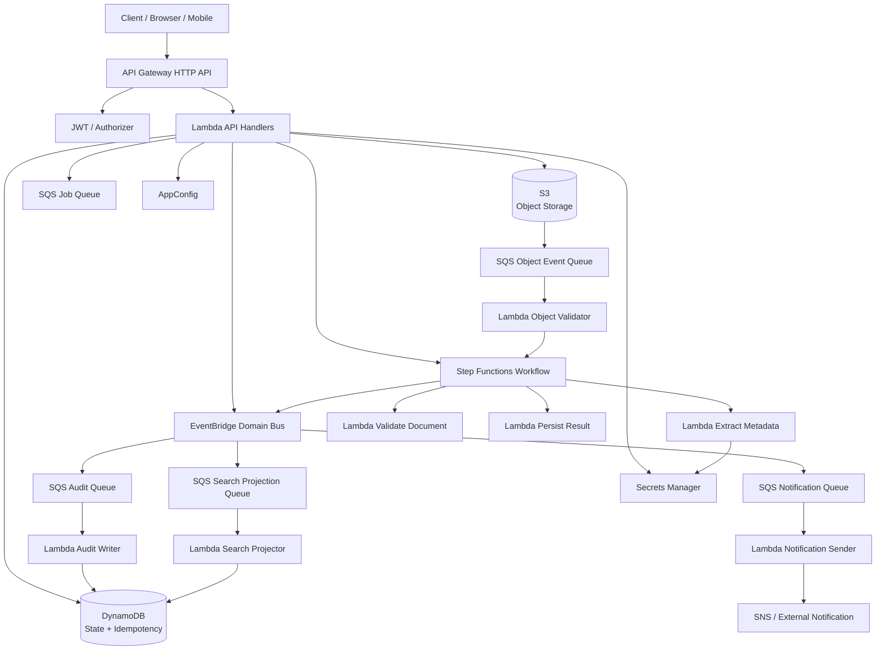
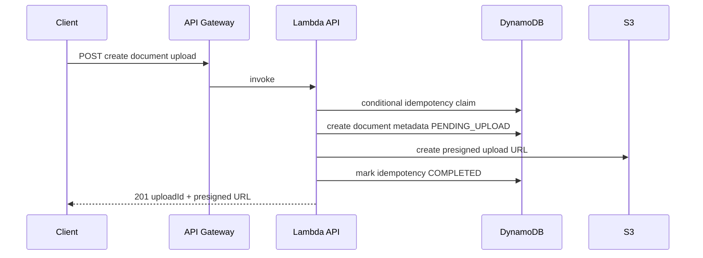
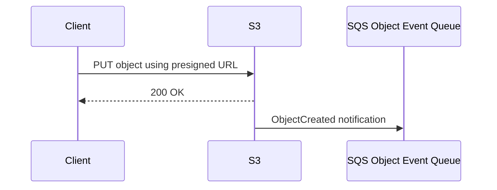
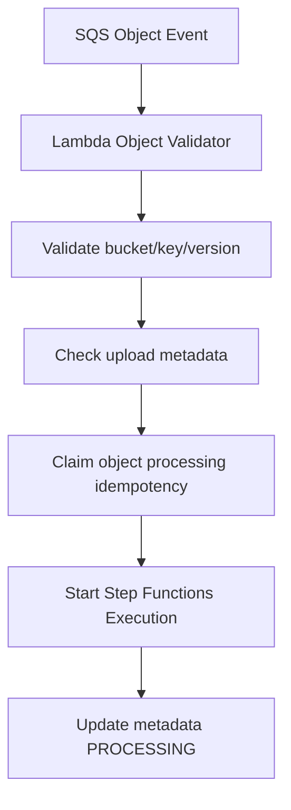
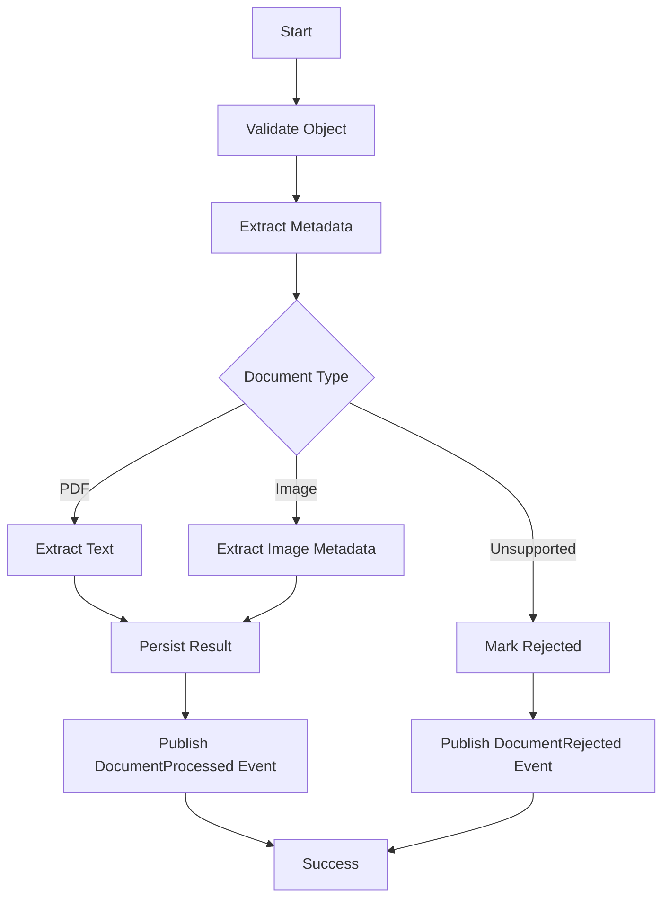
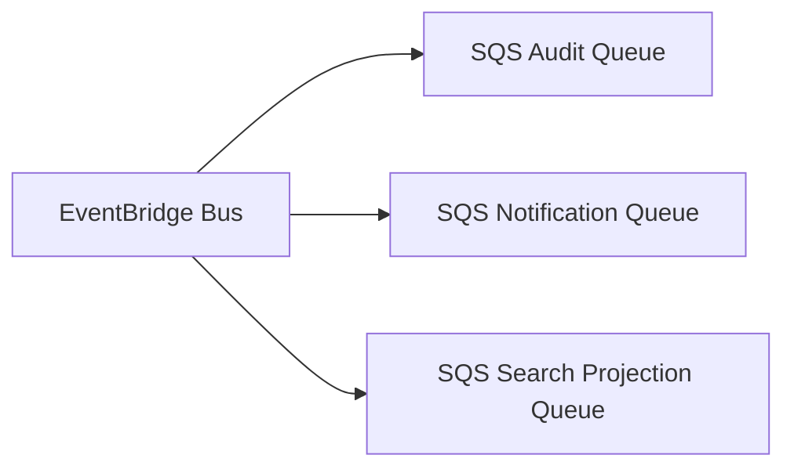
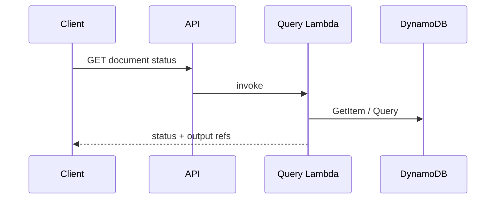

# Part 079 — End-to-End Serverless Reference Architecture

This part turns the previous mental models into a concrete production blueprint.

The example workload:

> A multi-tenant document case platform where users upload documents, submit processing jobs, track job status, run asynchronous workflows, generate audit events, notify users, and expose query APIs.

The exact domain does not matter.

The architecture pattern matters.

This blueprint uses:

- API Gateway as front door;
- Lambda for API adapters and short event handlers;
- S3 for object bytes;
- DynamoDB for state, idempotency, and metadata;
- SQS for durable backpressure;
- Step Functions for long-running workflow orchestration;
- EventBridge for domain event routing;
- SNS where simple notification fanout is needed;
- AppConfig for feature flags/runtime config;
- Secrets Manager and KMS for secrets/encryption;
- CloudWatch/X-Ray/OpenTelemetry/Powertools for observability;
- IaC and aliases for deployment safety.

It is a pure serverless reference architecture.

No ECS/EKS worker is required in this part. Hybrid version comes in Part 080.

---

## 1. Architecture Goals

The system must support:

- public authenticated API;
- direct-to-S3 file upload;
- asynchronous document processing;
- durable job status;
- multi-step processing workflow;
- event-driven side effects;
- audit trail;
- notification fanout;
- idempotent commands;
- replay/redrive;
- tenant isolation;
- safe deployment;
- operational dashboards;
- cost visibility.

Non-goals:

- heavy CPU/GPU processing;
- long-running custom daemon;
- Kafka consumer;
- complex relational OLTP;
- active-active multi-region.

Those non-goals matter. They keep the serverless architecture honest.

If heavy/long-running processing appears later, use the hybrid pattern from Part 080.

---

## 2. High-Level Architecture



### What Each Component Owns

| Component | Responsibility |
|---|---|
| API Gateway | HTTP front door, auth integration, route throttling |
| Lambda API handlers | request validation, command intake, idempotency, short orchestration start |
| S3 | document bytes and generated artifacts |
| DynamoDB | durable state, metadata, idempotency, job status |
| SQS | backpressure, retries, DLQs, per-consumer isolation |
| Step Functions | document workflow state, retries, catch, compensation |
| EventBridge | domain event routing and fanout |
| SNS | simple user/system notification fanout where useful |
| AppConfig | dynamic config and feature flags |
| Secrets Manager | external provider credentials |
| KMS | encryption control |
| CloudWatch/X-Ray | logs, metrics, traces, alarms |
| IaC pipeline | repeatable deployment and release safety |

Every component has one primary job.

That is the architecture’s strength.

---

## 3. Core Flows

The architecture has five core flows.

```txt
1. API command flow
2. File upload flow
3. Object processing flow
4. Domain event fanout flow
5. Query/status flow
```

Each flow has its own failure boundary.

Do not collapse all flows into one Lambda.

---

## 4. Flow 1 — API Command

Example command:

```http
POST /cases/{caseId}/documents
Idempotency-Key: tenant-1:create-document:cmd-123
```

The API creates an upload intent and returns a presigned S3 URL.



### API Handler Responsibilities

- authenticate caller;
- authorize tenant/case access;
- validate request;
- check idempotency key;
- create document metadata;
- generate object key;
- generate presigned URL;
- return stable response;
- emit audit/event if needed.

### It Must Not

- upload file through Lambda;
- process document synchronously;
- perform long workflow;
- store secret values in response;
- trust client filename/content type blindly.

### Idempotency

Key:

```txt
tenantId + operation + commandId
```

Record:

```json
{
  "PK": "IDEMPOTENCY#tenant-1:create-document:cmd-123",
  "status": "COMPLETED",
  "requestHash": "sha256...",
  "resultRef": "DOCUMENT#doc-789",
  "ttl": 1783936900
}
```

Duplicate same request returns same upload metadata if still valid.

Same key with different payload returns conflict.

---

## 5. Flow 2 — Direct S3 Upload

Client uploads file directly to S3.



### Object Key Design

```txt
tenants/{tenantId}/cases/{caseId}/documents/{documentId}/uploads/{uploadId}/original
```

Example:

```txt
tenants/tenant-1/cases/case-123/documents/doc-789/uploads/upl-456/original.pdf
```

### Required Controls

- key generated server-side;
- presigned URL short-lived;
- content length constraints if using presigned POST;
- checksum expected where needed;
- S3 bucket blocks public access;
- object encryption enforced;
- upload metadata exists before URL issued;
- object event routed to SQS, not direct heavy Lambda;
- output prefixes do not trigger input workflow.

### Why SQS Between S3 and Lambda?

Because object processing can fail.

SQS provides:

- durable event buffer;
- visible backlog;
- DLQ;
- partial retry control;
- concurrency cap;
- redrive process.

S3 direct to Lambda can be fine for lightweight handlers, but S3 → SQS → Lambda is safer for production file workflows.

---

## 6. Flow 3 — Object Validation Starts Workflow

SQS object event triggers a validator Lambda.



### Validator Responsibilities

- parse S3 event;
- URL-decode key correctly;
- verify prefix matches expected input;
- retrieve object metadata/head;
- compare size/checksum/content type policy;
- verify upload record;
- claim processing idempotency;
- start workflow using deterministic execution name;
- return partial batch response for failures.

### Deterministic Execution Name

```txt
document-processing-{tenantId}-{documentId}-{objectVersionHash}
```

This prevents duplicate workflow starts.

### Failure Handling

| Failure | Behavior |
|---|---|
| invalid prefix | ignore or quarantine |
| upload record missing | retry briefly, then quarantine |
| object not found | retry or quarantine depending timing |
| checksum mismatch | mark upload invalid |
| workflow already started | success duplicate |
| Step Functions throttled | retry |
| malformed event | DLQ/quarantine |

---

## 7. Flow 4 — Step Functions Document Workflow

Workflow:



### Why Step Functions?

Because document processing is multi-step.

It needs:

- durable workflow state;
- retries;
- catch paths;
- failure classification;
- audit timeline;
- ability to redrive/restart;
- clear operator visibility;
- task-level timeouts;
- optional parallel/map later.

Step Functions documentation describes state machines as workflows for distributed applications, process automation, microservice orchestration, and data/ML pipelines. That is exactly the contract here.

### Task Design

Each Lambda task does one bounded operation:

| Task | Responsibility |
|---|---|
| ValidateObject | object metadata and policy |
| ExtractMetadata | lightweight metadata extraction |
| ExtractText | text extraction if within Lambda constraints |
| PersistResult | update DynamoDB and S3 output references |
| PublishEvent | put domain event to EventBridge |

If `ExtractText` becomes heavy, migrate only that task to ECS/Fargate in the hybrid blueprint.

The workflow boundary remains stable.

---

## 8. Flow 5 — Domain Event Fanout

When processing completes, workflow publishes event:

```json
{
  "source": "com.example.case-documents",
  "detail-type": "DocumentProcessed",
  "detail": {
    "schemaVersion": "1.0",
    "eventId": "evt-123",
    "correlationId": "corr-456",
    "tenantId": "tenant-1",
    "caseId": "case-123",
    "documentId": "doc-789",
    "object": {
      "bucket": "case-documents-prod",
      "key": "tenants/tenant-1/...",
      "versionId": "..."
    },
    "processedAt": "2026-07-06T10:15:30Z"
  }
}
```

EventBridge routes to consumer queues:



AWS Well-Architected Serverless Lens describes SQS for reliable durable communication, SNS for fanout, and EventBridge for event filtering/routing in event-driven architectures.

### Why EventBridge → SQS?

Because consumers need independent durability and pacing.

Audit writer, notification sender, and search projector have different failure modes.

Each gets:

- own queue;
- own DLQ;
- own concurrency;
- own idempotency;
- own runbook.

### Consumer Idempotency Key

```txt
source + detail-type + detail.eventId + consumerName
```

Example:

```txt
com.example.case-documents:DocumentProcessed:evt-123:audit-writer
```

---

## 9. Query and Status Flow

Clients query job/document status.

```http
GET /cases/{caseId}/documents/{documentId}
```

API Lambda reads DynamoDB.



### Query Response

```json
{
  "documentId": "doc-789",
  "status": "PROCESSED",
  "uploadedAt": "2026-07-06T10:10:00Z",
  "processedAt": "2026-07-06T10:15:30Z",
  "outputs": {
    "text": {
      "downloadUrl": "short-lived-presigned-url"
    }
  }
}
```

Do not expose raw internal object keys unless contract requires it.

Use presigned download URLs or mediated access.

---

## 10. DynamoDB Data Model

A possible single-table design:

```txt
PK = TENANT#<tenantId>#CASE#<caseId>
SK = DOCUMENT#<documentId>
```

Document item:

```json
{
  "PK": "TENANT#tenant-1#CASE#case-123",
  "SK": "DOCUMENT#doc-789",
  "entityType": "Document",
  "documentId": "doc-789",
  "status": "PROCESSED",
  "uploadId": "upl-456",
  "sourceBucket": "case-documents-prod",
  "sourceKey": "tenants/tenant-1/cases/case-123/documents/doc-789/uploads/upl-456/original.pdf",
  "sourceVersionId": "abc",
  "outputTextKey": "tenants/tenant-1/cases/case-123/documents/doc-789/processed/text.json",
  "createdAt": "...",
  "updatedAt": "...",
  "version": 4
}
```

Idempotency item:

```txt
PK = IDEMPOTENCY#<key>
SK = RECORD
```

Workflow item:

```txt
PK = WORKFLOW#<executionName>
SK = STATE
```

### Access Patterns

| Access Pattern | Key/Index |
|---|---|
| get document by case/document | base PK/SK |
| list documents in case | base PK with SK prefix |
| get idempotency record | idempotency PK |
| list processing jobs by status | GSI status index |
| find stale processing jobs | GSI by status/time |
| audit by event ID | audit table or GSI |

### Conditional Writes

Use conditional writes for:

- create document once;
- claim idempotency key;
- update status only from expected state;
- mark workflow completed once;
- avoid duplicate audit event.

---

## 11. S3 Bucket Design

Bucket strategy:

```txt
case-documents-prod
```

Prefixes:

```txt
tenants/{tenantId}/cases/{caseId}/documents/{documentId}/uploads/{uploadId}/
tenants/{tenantId}/cases/{caseId}/documents/{documentId}/processed/
tenants/{tenantId}/cases/{caseId}/documents/{documentId}/failed/
tmp/
```

### Event Notification

Only input prefix triggers object event:

```txt
tenants/*/cases/*/documents/*/uploads/*/
```

In practice, S3 prefix filters are prefix/suffix-based, not glob pattern matching. Use a prefix hierarchy that can be configured safely, or route through EventBridge and filter there if routing needs are complex.

### Guard in Code

Even if S3 notification has prefix filters:

```txt
handler validates key starts with expected upload prefix pattern
```

This prevents recursive processing if notification config drifts.

### Lifecycle

- `tmp/` expires quickly;
- failed uploads retained for investigation;
- processed outputs retained by business policy;
- old versions lifecycle based on compliance;
- incomplete multipart uploads cleaned.

---

## 12. IAM Boundaries

Each function has its own execution role.

### API Create Upload Role

Allows:

```txt
dynamodb:PutItem/UpdateItem/GetItem on metadata/idempotency table
s3:PutObject presign permissions through SDK context
kms:Encrypt where needed
appconfig:GetLatestConfiguration if using extension/agent path
```

Does not allow:

```txt
sqs:ReceiveMessage
dynamodb:Scan
s3:GetObject on all buckets
secretsmanager:GetSecretValue for unrelated secrets
```

### Object Validator Role

Allows:

```txt
sqs receive/delete/change visibility on object event queue
s3:HeadObject/GetObject on upload prefix
dynamodb read/write metadata/idempotency
states:StartExecution for specific state machine alias
```

### Workflow Task Roles

Each Lambda task has role scoped to its operation.

### Event Consumers

Each consumer can read its queue and perform its side effect only.

### EventBridge Target Permissions

Resource policies use SourceArn/SourceAccount where applicable.

IAM is part of architecture, not a deployment detail.

---

## 13. Security Model

### Authentication

- JWT/OIDC/Cognito/custom authorizer depending environment;
- API Gateway route protection;
- machine-to-machine IAM where appropriate.

### Authorization

Business authorization in Lambda/service layer:

```txt
caller tenant == resource tenant
caller role can upload document for case
case state allows document upload
```

Do not rely only on URL path tenant ID.

### Data Protection

- S3 Block Public Access;
- SSE-KMS for sensitive objects if required;
- DynamoDB encryption;
- SQS/SNS encryption;
- KMS key policies scoped;
- secrets in Secrets Manager;
- no secrets in events/logs;
- presigned URLs short-lived and prefix-scoped;
- CloudTrail data events for sensitive buckets if required.

### Tenant Isolation

- tenant ID from trusted auth context;
- object keys include tenant but are not trusted alone;
- DynamoDB key includes tenant;
- IAM may use prefix conditions for stronger separation where feasible;
- logs avoid leaking cross-tenant data.

---

## 14. Configuration and Feature Flags

Use AppConfig for:

- max upload size;
- allowed document types;
- processing feature flags;
- tenant rollout;
- OCR/extraction mode;
- notification kill switch;
- queue processing controls where applicable.

Use environment variables for:

- table names;
- queue URLs;
- event bus names;
- state machine ARN/alias;
- bucket names;
- AppConfig profile identifiers.

Use Secrets Manager for:

- external OCR provider API key;
- notification provider token;
- webhook signing secret.

### Config Snapshot Rule

Workflow should snapshot critical processing config at start.

Example:

```json
{
  "documentId": "doc-789",
  "processingConfig": {
    "extractorVersion": "v3",
    "ocrProvider": "internal",
    "maxPages": 50,
    "configVersion": "document-processing-42"
  }
}
```

This prevents one document from changing behavior halfway through processing due to config rollout.

---

## 15. Observability Contract

Every log line includes:

```txt
service
environment
version
correlationId
tenantId where safe
caseId/documentId
operation
outcome
errorCode
lambdaRequestId
workflowExecutionArn where applicable
eventId where applicable
```

### Required Dashboards

1. API health:
   - request count;
   - 4xx/5xx;
   - latency;
   - auth failures;
   - idempotency conflicts.

2. Upload health:
   - upload intents created;
   - S3 object events;
   - validation failures;
   - missing upload record count.

3. Workflow health:
   - executions started/succeeded/failed/timed out;
   - state failures;
   - duration;
   - retries;
   - compensation/rejection.

4. Queue health:
   - queue age/depth;
   - DLQ depth;
   - consumer errors;
   - throttles.

5. Event health:
   - EventBridge matched events;
   - failed target invocations;
   - consumer duplicate counts.

6. Cost:
   - Lambda duration/invocations;
   - log ingestion;
   - Step Functions transitions;
   - S3 storage/requests;
   - DynamoDB read/write;
   - EventBridge/SQS volume.

### Tracing

Trace synchronous API path and workflow task calls where practical.

For async hops, propagate correlation ID through:

- SQS message attributes;
- EventBridge detail;
- Step Functions input;
- DynamoDB state;
- logs.

Trace sampling may skip some requests; correlation ID must still exist.

---

## 16. Deployment Architecture

Use IaC.

Deployment units:

```txt
document-api-stack
document-storage-stack
document-workflow-stack
document-events-stack
document-observability-stack
```

### Lambda Release

- publish version;
- alias per environment;
- canary/linear shift for API functions;
- event source mappings point to alias where appropriate;
- rollback alias quickly.

### Step Functions Release

- publish version/alias where release identity matters;
- route new executions to alias;
- keep task Lambda contracts backward compatible;
- know in-flight behavior.

### EventBridge Release

- test rule patterns using fixtures;
- deploy new rules disabled if risky;
- enable after synthetic event;
- use DLQ for critical targets.

### Data Changes

Use expand/contract:

- add fields/indexes;
- write both;
- backfill;
- switch reads;
- remove old later.

---

## 17. Failure Modes and Controls

| Failure | Control |
|---|---|
| duplicate API command | DynamoDB idempotency |
| upload object event duplicated | processing idempotency by bucket/key/version |
| object validator fails | SQS retry + DLQ |
| workflow task fails | Step Functions retry/catch |
| poison document | rejected/quarantine state |
| EventBridge target fails | target DLQ |
| audit writer fails | audit queue DLQ |
| notification provider down | notification queue backlog/kill switch |
| search projection slow | queue backlog, not critical path |
| DynamoDB throttling | alarms, key design, retry budget |
| bad deployment | alias rollback |
| bad config | AppConfig rollback |
| recursive S3 trigger | prefix separation + handler guard |

Failure path is not optional.

It is designed into the blueprint.

---

## 18. Runbooks

### Runbook: Document Stuck PROCESSING

Check:

1. Step Functions execution by document ID.
2. Workflow state and failed task.
3. Lambda task logs with correlation ID.
4. Object existence/version.
5. DynamoDB document state version.
6. DLQ for object queue and workflow consumers.
7. Recent deployment/config change.

Actions:

- if workflow failed and task idempotent, redrive/restart per runbook;
- if object invalid, mark rejected;
- if code/config bug, fix then redrive;
- if duplicate workflow, reconcile idempotency.

### Runbook: Object Event Queue Backlog

Check:

- object upload spike;
- validator Lambda errors;
- throttles/concurrency;
- DynamoDB latency;
- Step Functions StartExecution throttles;
- poison event sample.

Actions:

- cap/raise concurrency based on downstream;
- fix poison pattern;
- inspect DLQ;
- redrive after fix.

### Runbook: EventBridge Consumer DLQ

Check:

- rule/target;
- event type/version;
- target permission;
- consumer deployment;
- duplicate/replay;
- downstream dependency.

Actions:

- sample DLQ;
- classify;
- fix target/consumer;
- redrive to queue/bus safely.

---

## 19. Cost Model

Main cost drivers:

- API Gateway requests;
- Lambda invocations/duration;
- Step Functions transitions;
- S3 storage/requests;
- DynamoDB reads/writes/indexes;
- SQS requests;
- EventBridge events/matches;
- CloudWatch logs/traces;
- KMS requests;
- retries/redrive;
- external provider.

### Unit Cost

```txt
cost per processed document =
  upload API
+ S3 PUT/storage
+ SQS object event
+ validator Lambda
+ Step Functions execution
+ workflow Lambda tasks
+ DynamoDB state writes
+ EventBridge event
+ consumers
+ logs/traces
+ retry overhead
```

Track unit cost by:

- document type;
- tenant class;
- success vs failure;
- processor version.

Cost anomalies often indicate reliability bugs such as recursive triggers or retry storms.

---

## 20. Scaling Model

### API

Scales with API Gateway/Lambda concurrency.

Protect downstream with:

- API throttles;
- Lambda reserved concurrency;
- DynamoDB capacity/key design.

### Upload

S3 scales object ingestion.

Processing is paced by:

- SQS queue;
- validator Lambda max concurrency;
- Step Functions quotas/concurrency;
- task Lambda concurrency.

### Event Consumers

Each consumer has own queue and concurrency.

This prevents notification/search/audit from blocking each other.

### Rule

```txt
Every automatic scaling layer must have a downstream capacity control.
```

---

## 21. Testing Strategy

Required tests:

### Unit

- validation;
- idempotency keys;
- error mapping;
- authorization;
- config parsing.

### Contract

- API schema;
- event schema;
- EventBridge rule pattern;
- Step Functions task input/output.

### Integration

- create upload command;
- upload object to S3;
- SQS event delivered;
- workflow starts;
- output metadata written;
- EventBridge event emitted;
- audit/search/notification queues receive events;
- duplicate upload event safe.

### Failure

- poison object event;
- workflow task failure;
- consumer DLQ;
- duplicate API command;
- AppConfig bad config rejected;
- secret access denied;
- rollback/canary.

### Observability

- correlation ID present across API, queue, workflow, event consumers;
- alarms fire in staging failure drill.

---

## 22. Evolution Path

This architecture can evolve.

### Need Heavy Processing

Replace workflow task Lambda with ECS/Fargate task.

Step Functions remains.

### Need More Complex Search

Search consumer writes to OpenSearch.

Queue boundary remains.

### Need Multi-Region

Replicate artifacts/state/events according to Part 078.

### Need Tenant Isolation

Move high-value tenant to separate table/bucket/account/queue.

Contracts remain.

### Need More Consumers

Add EventBridge rule target to SQS queue with owner/DLQ.

Producer unchanged.

### Need External Partner Integration

EventBridge API destination or SQS/ECS integration worker.

Add idempotency and DLQ.

A good architecture makes change local.

---

## 23. Anti-Patterns Avoided

### Anti-Pattern 1 — API Upload Through Lambda

Avoided by presigned S3 URL.

### Anti-Pattern 2 — One Lambda Does Everything

Avoided by API handler, validator, workflow tasks, consumers.

### Anti-Pattern 3 — Direct Heavy EventBridge to Lambda

Avoided by EventBridge → SQS per consumer.

### Anti-Pattern 4 — Workflow Hidden in Code

Avoided by Step Functions.

### Anti-Pattern 5 — No Backpressure

Avoided by SQS queues.

### Anti-Pattern 6 — No Idempotency

Idempotency at API, object processing, and consumer side effects.

### Anti-Pattern 7 — Recursive S3 Trigger

Input/output prefix separation and handler guard.

### Anti-Pattern 8 — Shared Overpowered Role

Per-function/per-consumer roles.

### Anti-Pattern 9 — Unknown Failure Path

DLQs, catch paths, rejected states, runbooks.

### Anti-Pattern 10 — No Cost Unit

Cost per processed document defined.

---

## 24. Production Readiness Checklist

### API

- [ ] Auth/authz implemented.
- [ ] Idempotency key required for commands.
- [ ] Error envelope stable.
- [ ] API throttles.
- [ ] Lambda alias/canary deployment.
- [ ] Dashboard and alarms.

### Upload/Object

- [ ] Presigned URL scoped.
- [ ] S3 Block Public Access.
- [ ] KMS/lifecycle/versioning decisions.
- [ ] Event notification to SQS.
- [ ] Recursive trigger prevention.
- [ ] Object idempotency.

### Workflow

- [ ] Step Functions retry/catch.
- [ ] Task input/output contracts.
- [ ] Task timeouts.
- [ ] Config snapshot.
- [ ] Workflow alarms.
- [ ] Redrive/restart runbook.

### Events/Consumers

- [ ] Event schema version.
- [ ] EventBridge pattern tests.
- [ ] SQS per critical consumer.
- [ ] DLQ per queue.
- [ ] Partial batch response.
- [ ] Consumer idempotency.

### State/Security/Ops

- [ ] DynamoDB conditional writes.
- [ ] IAM least privilege.
- [ ] Secrets in Secrets Manager.
- [ ] AppConfig validation.
- [ ] Structured logs.
- [ ] Correlation ID.
- [ ] Cost tags.
- [ ] Runbooks.
- [ ] Failure drills.

---

## 25. Final Mental Model

This reference architecture is not about using many AWS services.

It is about assigning the right responsibility to each service:

```txt
API Gateway: HTTP boundary
Lambda: bounded compute
S3: object bytes
DynamoDB: state and idempotency
SQS: backpressure
Step Functions: workflow state
EventBridge/SNS: routing/fanout
AppConfig/Secrets/KMS: runtime control and authority
CloudWatch/X-Ray: operational truth
IaC/Aliases: release safety
```

A top-tier engineer does not build serverless by wiring triggers randomly.

They design explicit contracts:

```txt
request contract
object contract
state contract
event contract
workflow contract
failure contract
deployment contract
observability contract
```

That is end-to-end serverless architecture.

---

## References

- AWS Well-Architected Serverless Applications Lens
- AWS Lambda Developer Guide: event-driven architectures and event source mappings
- AWS Step Functions Developer Guide: service integrations and state machines
- Amazon EventBridge User Guide: event buses, rules, targets, archives, and replays
- Amazon SQS Developer Guide: queues, DLQs, and redrive
- Amazon DynamoDB Developer Guide: condition expressions, TTL, Streams, and GSIs
- Amazon S3 User Guide: presigned URLs and event notifications
