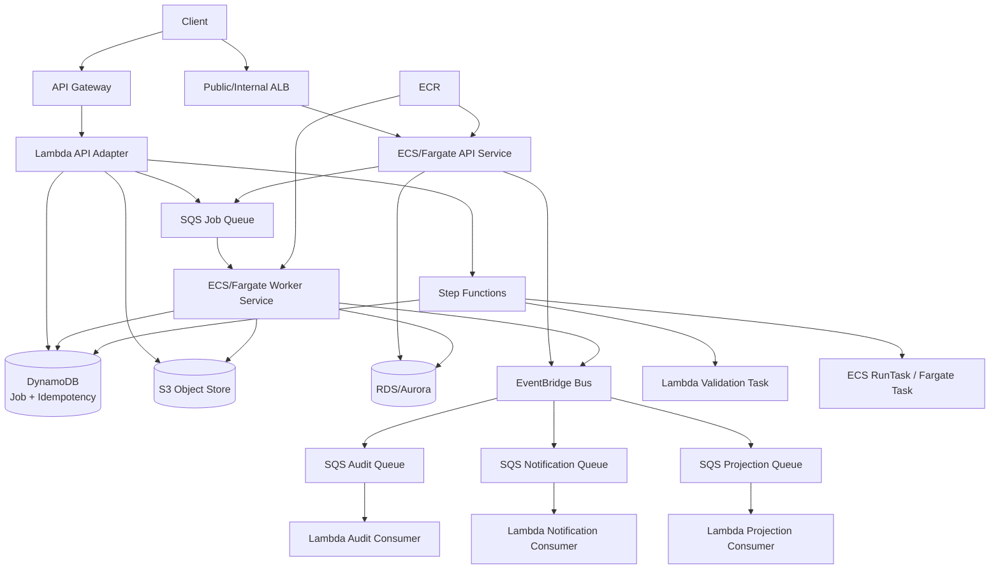
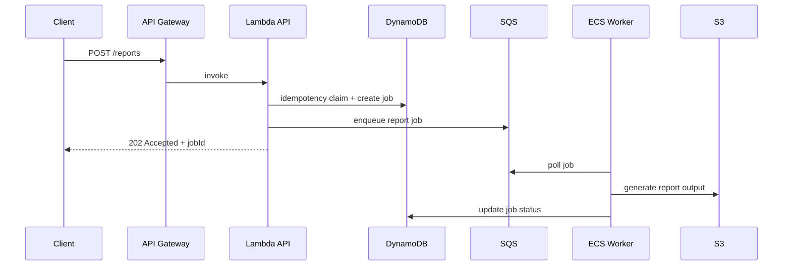
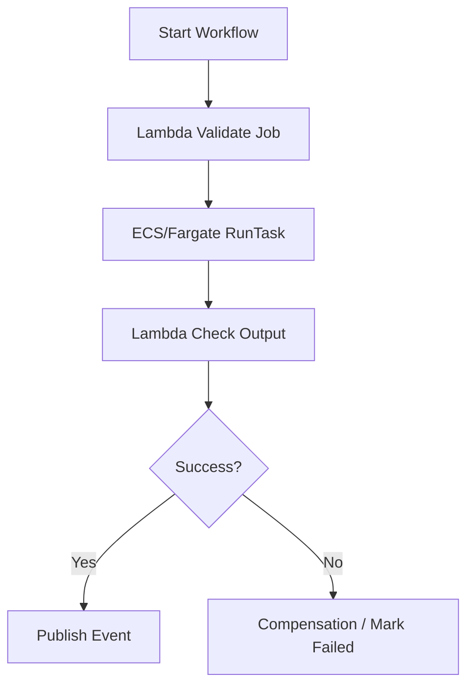
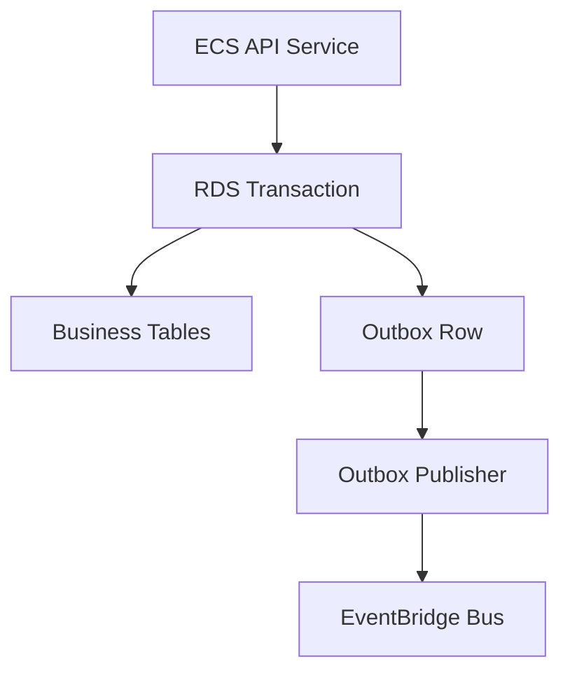
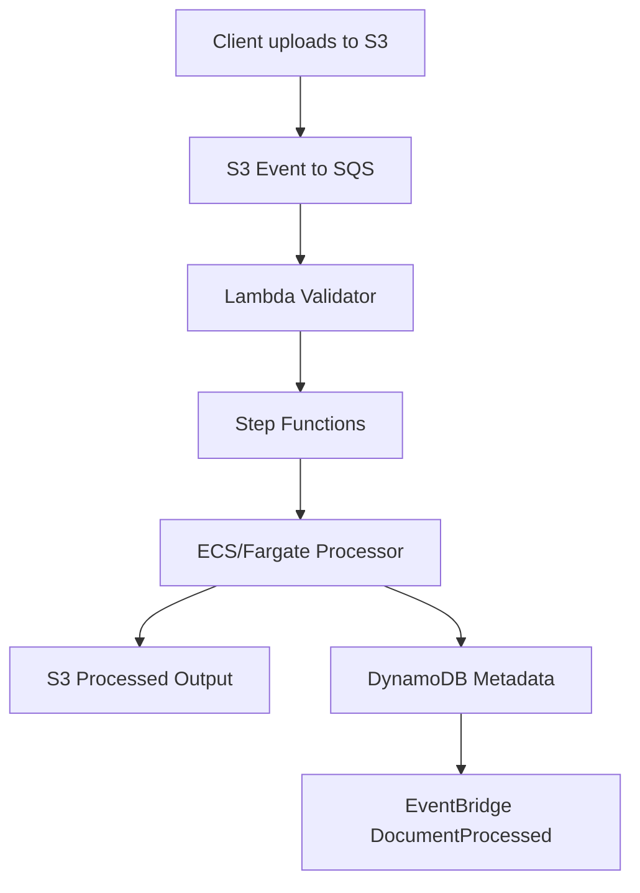
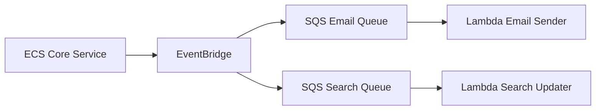

# Part 080 — End-to-End Hybrid Platform Reference Architecture

Part 079 showed a pure serverless reference architecture.

This part shows the hybrid version.

The example workload:

> A production document and reporting platform where APIs are partly serverless, long-running document/report processing runs on ECS/Fargate, event-driven side effects use Lambda, workflows use Step Functions, state is stored in DynamoDB/RDS/S3, and events are routed through EventBridge and SQS.

This architecture is for workloads where Lambda is excellent for edge/event glue, but some processing needs containers.

The pattern is common in real production systems:

```txt
Lambda for short bounded work.
Containers for long-running or sustained work.
Step Functions for orchestration.
SQS for backpressure.
EventBridge for domain routing.
S3 for objects.
DynamoDB/RDS for state.
```

---

## 1. Architecture Goals

The system must support:

- public API;
- internal container service;
- async jobs;
- long-running document/report processing;
- event-driven consumers;
- stateful database access;
- direct S3 uploads;
- workflow orchestration;
- queue-based backpressure;
- container autoscaling;
- Lambda side effects;
- safe deployment across compute types;
- end-to-end observability;
- failure recovery;
- cost visibility.

Non-goals:

- forcing all compute into containers;
- forcing all compute into Lambda;
- using Kubernetes if ECS/Fargate is enough;
- synchronous long-running API requests;
- shared mutable state across all components.

The architecture chooses compute per workload shape.

---

## 2. High-Level Architecture



### Compute Responsibilities

| Compute | Responsibility |
|---|---|
| Lambda API adapter | lightweight commands, presigned URLs, async job intake |
| ECS/Fargate API service | long-running HTTP service, connection-heavy logic |
| ECS/Fargate worker | sustained/heavy async processing |
| ECS RunTask | workflow-controlled container task |
| Lambda event consumers | short event-driven side effects |
| Step Functions | orchestration of Lambda and ECS tasks |
| EKS optional | use when Kubernetes platform/operator ecosystem required |

The architecture does not make one runtime the hero.

The workflow is the hero.

---

## 3. Flow 1 — API Command to Async Container Worker

Example:

```http
POST /reports
Idempotency-Key: tenant-1:report:cmd-123
```



### Why Lambda API + ECS Worker?

Lambda is excellent for:

- auth/validation;
- idempotency claim;
- job record creation;
- SQS enqueue;
- quick response.

ECS worker is better for:

- minutes-long report generation;
- PDF rendering;
- large memory;
- native libraries;
- stable connections;
- sustained throughput.

SQS separates them.

### AWS Pattern Alignment

AWS Prescriptive Guidance has an architecture pattern for asynchronous processing with API Gateway, SQS, and Fargate, where API Gateway is the interface, SQS queues work, and Fargate processes jobs without duration restrictions.

This is a strong hybrid reference pattern.

---

## 4. Flow 2 — Step Functions Orchestrates ECS/Fargate Task

Use when processing has multiple states.



Step Functions can run ECS/Fargate tasks through service integrations. Use this when workflow state matters.

### Why Not Lambda Polling ECS?

Bad:

```txt
Lambda starts ECS task
Lambda loops every 10 seconds checking task status
```

This burns Lambda duration and hides workflow state.

Better:

```txt
Step Functions starts ECS task and waits using supported integration pattern
```

### Task Payload

Pass references:

```json
{
  "jobId": "job-123",
  "input": {
    "bucket": "documents-prod",
    "key": "tenants/tenant-1/jobs/job-123/input.json"
  },
  "outputPrefix": "tenants/tenant-1/jobs/job-123/output/"
}
```

Do not pass large payload through workflow state.

---

## 5. Flow 3 — Container Service Emits Domain Events

ECS API service changes core state and emits events.



### Why Outbox?

A container service often owns relational transactions.

If it publishes EventBridge event outside the DB transaction:

```txt
DB commit succeeds, event publish fails
```

or:

```txt
event publish succeeds, DB commit fails
```

Outbox makes event intent durable with the state change.

### Outbox Publisher Options

- ECS background worker;
- scheduled Lambda;
- database CDC pipeline;
- Debezium on EKS/ECS;
- custom poller.

### Event Consumers

EventBridge routes to SQS queues for Lambda consumers:

```txt
EventBridge -> SQS Audit -> Lambda Audit
EventBridge -> SQS Notification -> Lambda Notification
EventBridge -> SQS Projection -> Lambda Projection
```

Containers produce facts.

Serverless consumers react.

---

## 6. Flow 4 — S3 File Pipeline With Container Stage



### Why Hybrid?

S3 upload/validation is serverless.

Heavy processing is containerized.

Workflow orchestration is Step Functions.

Event fanout is EventBridge.

This is the cleanest split when files are large or processing uses native tools.

### Guardrails

- input/output prefix separation;
- object idempotency by bucket/key/version;
- SQS object event DLQ;
- ECS task timeout;
- workflow catch path;
- output checksum;
- DynamoDB metadata update with condition;
- EventBridge event after durable state update.

---

## 7. Flow 5 — ECS Service and Lambda Side Effects

ECS service handles core API.

Lambda handles bursty side effects.



### Benefits

- core service remains focused;
- side effects isolated;
- side effects deploy independently;
- Lambda scales with event volume;
- SQS gives backpressure;
- consumer failures do not block core API.

### Risk

Eventual consistency.

User may create case before search index updates.

That is acceptable if product contract says projection is eventually consistent.

Document it.

---

## 8. ECS vs EKS in This Reference

This blueprint defaults to ECS/Fargate.

Use EKS when you need:

- Kubernetes-native platform;
- custom controllers/operators;
- service mesh standard;
- multi-cloud portability requirement;
- advanced scheduling requirements;
- existing strong Kubernetes operations;
- custom admission/policy ecosystem;
- high-density node-level optimization.

Use ECS/Fargate when you want:

- AWS-native container orchestration;
- lower cluster management burden;
- straightforward services/tasks;
- strong IAM/task integration;
- simpler Fargate serverless containers.

### Decision

Do not choose EKS only because it is more “advanced.”

Advanced means correct for workload and team.

For many hybrid serverless/container workloads, ECS/Fargate is a strong default.

---

## 9. Network Architecture

Typical layout:

```txt
public subnets:
  ALB / NAT if needed

private subnets:
  ECS services/tasks
  RDS/Aurora
  VPC endpoints
  Lambda functions requiring VPC access

outside VPC:
  Lambda functions that only call public AWS APIs
```

### VPC Endpoints

Use gateway endpoints for:

- S3;
- DynamoDB.

Use interface endpoints where justified for:

- Secrets Manager;
- SQS;
- SNS;
- EventBridge;
- ECR;
- CloudWatch Logs;
- STS;
- Step Functions;
- other AWS APIs.

### NAT Decision

NAT is needed for private subnet internet egress.

But high-volume AWS API/S3 traffic through NAT may be wasteful.

Do NAT vs endpoint math.

### Security Groups

- ALB to ECS API service only;
- ECS worker to RDS only as needed;
- Lambda VPC security group scoped;
- no broad outbound if workload is sensitive;
- VPC endpoints security groups scoped.

---

## 10. Data Stores

### DynamoDB

Use for:

- job status;
- idempotency;
- metadata;
- projection state;
- lightweight read models.

### RDS/Aurora

Use for:

- relational transactional domain state;
- complex queries/joins;
- legacy database;
- strong relational constraints.

### S3

Use for:

- input documents;
- generated reports;
- workflow artifacts;
- large payload references;
- dead-letter evidence if too large for queues.

### Rule

```txt
Do not make RDS the hidden integration point for all components.
```

If Lambda and ECS both write the same relational tables, define ownership and transactions carefully.

Prefer events/read models for cross-boundary data.

---

## 11. RDS Connection Safety

Hybrid architectures often have both Lambda and ECS accessing RDS.

Risk:

```txt
Lambda burst opens too many DB connections
ECS service loses DB capacity
```

Controls:

- RDS Proxy for Lambda where appropriate;
- Lambda reserved concurrency;
- ECS connection pool sizing;
- query timeouts;
- database max connection budget;
- read replicas for queries;
- avoid synchronous fanout to database;
- SQS worker concurrency cap.

### Connection Budget Example

```txt
RDS safe app connections: 300
ECS API pool total: 120
ECS worker pool total: 80
Lambda via RDS Proxy target: 60
reserved headroom: 40
```

Budget connections explicitly.

---

## 12. Queue and Worker Autoscaling

ECS worker scales from SQS metrics.

Signals:

- approximate visible messages;
- age of oldest message;
- messages per task;
- task CPU/memory;
- downstream latency;
- job completion SLO.

### Scaling Model

```txt
desiredTasks ≈ visibleMessages / targetMessagesPerTask
```

But cap by downstream capacity.

### Worker Rules

- long polling;
- graceful shutdown;
- delete message only after durable success;
- extend visibility for long jobs if necessary;
- idempotency by job ID;
- DLQ after max receive;
- structured logs with job ID/correlation ID.

### Lambda vs ECS Worker

If queue traffic is bursty and job short, Lambda worker may be simpler.

If queue traffic is sustained or job long/heavy, ECS worker may be better.

The queue makes switching possible.

---

## 13. Container Image Supply Chain

Use ECR.

Controls:

- image digest deploys;
- vulnerability scanning;
- SBOM;
- base image patch policy;
- signed images if required;
- least-privilege build role;
- separate build/deploy roles;
- image lifecycle policy;
- cross-account/Region replication;
- no secrets in images;
- runtime read-only filesystem where possible.

### Deployment Record

For each ECS/EKS deployment:

```txt
service
cluster
task definition / deployment revision
image digest
git commit
build ID
config version
deployer
time
```

Without this, hybrid incident diagnosis becomes hard.

---

## 14. Deployment Strategy

### Lambda

- version + alias;
- canary/linear;
- rollback alias;
- event source mapping points to alias where practical.

### ECS/Fargate

- rolling deployment;
- blue/green via CodeDeploy where needed;
- deployment circuit breaker;
- health checks;
- image digest;
- task definition revision.

### Step Functions

- versions/aliases;
- new executions via alias;
- task contracts backward compatible.

### EventBridge/SQS

- rule pattern tests;
- target DLQs;
- consumer compatibility;
- deploy queues before targets;
- deploy consumers before producers for new event versions.

### RDS/DynamoDB

- expand/contract migrations;
- backfills controlled;
- schema/index active before read switch.

### Release Rule

In hybrid systems, deployment order matters.

Example:

```txt
consumer supports event v2
then producer emits event v2
```

Not the other way around.

---

## 15. Observability Across Lambda and Containers

Standard fields:

```txt
correlationId
causationId
eventId
jobId
tenantId
lambdaRequestId
ecsTaskArn
containerImageDigest
functionVersion
taskDefinitionRevision
workflowExecutionArn
```

### Logs

- Lambda structured logs;
- ECS container logs;
- API access logs;
- Step Functions execution history;
- EventBridge/SQS metrics;
- RDS/DynamoDB metrics.

### Traces

Propagate trace/correlation across:

- API Gateway;
- Lambda;
- SQS message attributes;
- ECS worker logs;
- EventBridge detail;
- Step Functions input;
- outbound HTTP headers.

### Dashboards

1. API and ALB health.
2. Lambda function health.
3. ECS service/task health.
4. SQS queue age/DLQ.
5. Step Functions execution health.
6. RDS/DynamoDB health.
7. S3 workflow health.
8. EventBridge fanout health.
9. Cost per job/document/report.
10. Deployment version dashboard.

A hybrid system needs hybrid observability.

---

## 16. Security Boundaries

### IAM Roles

- Lambda API role;
- Lambda consumer roles;
- ECS task role for API service;
- ECS task role for worker;
- Step Functions execution role;
- EventBridge target role;
- CI/CD deploy role.

Each role is scoped.

### Secrets

- ECS reads DB credentials from Secrets Manager;
- Lambda reads only needed secrets;
- secret rotation tested;
- RDS Proxy or connection refresh handles rotation.

### Network

- ECS/RDS in private subnets;
- API Gateway/Lambda public edge;
- private service calls through internal ALB or VPC Lattice/Cloud Map where appropriate;
- security groups scoped;
- egress controlled.

### Resource Policies

- SQS allows EventBridge/SNS source ARNs;
- Lambda invoke permissions scoped;
- S3 bucket policy enforces TLS/encryption;
- KMS key policies include required service principals/roles.

---

## 17. Failure Boundaries

| Boundary | Failure Control |
|---|---|
| API Gateway -> Lambda | timeout, error mapping, canary rollback |
| Lambda -> SQS | idempotent enqueue, retry, alarm |
| SQS -> ECS worker | DLQ, visibility timeout, autoscaling |
| ECS worker -> RDS | connection pool, timeout, transaction, retry budget |
| ECS worker -> S3 | idempotent output key, checksum |
| ECS worker -> EventBridge | outbox/retry/partial failure handling |
| EventBridge -> consumers | SQS target + DLQ |
| Step Functions -> ECS task | task timeout, retry/catch |
| S3 -> SQS | queue policy, DLQ/monitoring |
| Config/Secrets | cache, fail-safe behavior |

Every boundary has a failure destination or recovery story.

---

## 18. Runbook: ECS Worker Backlog

Symptoms:

- SQS age rising;
- visible messages increasing;
- ECS CPU/memory high or task count maxed;
- downstream latency rising.

Questions:

1. Did producer volume increase?
2. Are ECS tasks healthy?
3. Is autoscaling working?
4. Is downstream RDS/S3/external API slow?
5. Are messages poison?
6. Is DLQ filling?
7. Was there a deployment/config change?
8. Is image/task definition correct?

Actions:

- inspect ECS service events;
- inspect task logs by job ID;
- inspect queue sample;
- cap or scale tasks based on downstream;
- rollback task definition if regression;
- redrive DLQ after fix.

---

## 19. Runbook: Step Functions ECS Task Failure

Questions:

1. Which state failed?
2. Did ECS task start?
3. Did container exit non-zero?
4. Was it stopped by timeout/OOM?
5. Did task role lack permission?
6. Was image pull failure?
7. Did logs reach CloudWatch?
8. Is failure retryable?
9. Is compensation required?

Actions:

- inspect execution history;
- inspect ECS task stopped reason;
- inspect container logs;
- inspect task definition/image digest;
- fix code/config/IAM;
- redrive/restart workflow only if idempotent.

---

## 20. Runbook: RDS Connection Exhaustion

Symptoms:

- RDS max connections;
- API latency;
- ECS errors;
- Lambda timeout;
- queue backlog.

Actions:

1. identify connection source:
   - ECS API;
   - ECS worker;
   - Lambda;
   - admin/migration;
2. reduce worker concurrency;
3. cap Lambda reserved concurrency;
4. inspect connection pools;
5. check RDS Proxy;
6. kill runaway deployment if needed;
7. tune pool and timeouts;
8. add alarms/budget.

Do not simply raise max connections without understanding memory and query load.

---

## 21. Cost Model

Cost drivers:

- Lambda API/event consumers;
- ECS/Fargate vCPU/memory/task runtime;
- ALB/API Gateway;
- SQS/SNS/EventBridge;
- Step Functions;
- RDS/Aurora;
- DynamoDB;
- S3;
- ECR storage/scans;
- NAT/VPC endpoints;
- CloudWatch logs;
- KMS;
- retries/backlog.

### Unit Cost

```txt
cost per report =
  API command
+ SQS message
+ ECS worker task time
+ RDS/DynamoDB writes
+ S3 storage/requests
+ EventBridge event
+ Lambda consumers
+ logs/traces
+ retries
```

### Optimization Levers

- Lambda memory tuning;
- ECS task right-sizing;
- queue batch/worker concurrency;
- direct service integration where possible;
- log retention;
- NAT vs endpoints;
- RDS instance/serverless capacity;
- S3 lifecycle;
- avoid duplicate processing.

Hybrid cost optimization is about placing each workload on the right cost curve.

---

## 22. Scaling Model

### API Layer

- API Gateway scales;
- Lambda adapter reserved concurrency;
- ECS API service autoscaling behind ALB;
- RDS connection budget.

### Worker Layer

- SQS backlog drives ECS worker scaling;
- worker max tasks protects downstream;
- DLQ isolates poison jobs;
- Lambda consumers have per-queue concurrency.

### Workflow Layer

- Step Functions executions;
- ECS RunTask capacity;
- Map concurrency;
- Lambda task concurrency.

### Event Layer

- EventBridge fanout multiplier;
- SQS per consumer backlog;
- consumer-specific scaling.

### Rule

```txt
Do not let every layer autoscale independently without a shared capacity model.
```

---

## 23. Testing Strategy

### Contract Tests

- API schemas;
- SQS job message schema;
- EventBridge event schema;
- ECS worker input/output;
- Step Functions task input/output.

### Integration Tests

- API creates job;
- SQS receives job;
- ECS worker processes test job;
- output stored in S3;
- status updated;
- EventBridge event emitted;
- Lambda consumers process event.

### Failure Tests

- ECS task fails;
- ECS task timeout;
- RDS throttling/connection failure;
- SQS poison job;
- EventBridge target DLQ;
- duplicate job message;
- Lambda consumer partial batch failure;
- rollback ECS task definition;
- rollback Lambda alias.

### Load Tests

- API RPS;
- queue backlog drain rate;
- ECS worker max capacity;
- RDS connection saturation;
- EventBridge fanout.

Hybrid architecture must be tested as a graph.

---

## 24. Evolution and Migration Paths

### Heavy Lambda Task Becomes ECS

Step Functions task resource changes from Lambda to ECS RunTask.

Workflow contract remains.

### ECS Side Effect Becomes Lambda Consumer

Core service emits event; Lambda consumes.

Core service shrinks.

### ECS Worker Becomes EKS

If Kubernetes platform needed, SQS/job contract remains.

### API Route Moves Between Lambda and ECS

Route through API Gateway/ALB with compatibility.

### RDS Read Model Moves to DynamoDB

Outbox/CDC builds projection; API read switches later.

The reference architecture uses boundaries that allow compute migration.

---

## 25. Anti-Patterns Avoided

### Anti-Pattern 1 — Container Service Does All Side Effects

Avoided by event fanout.

### Anti-Pattern 2 — Lambda Handles Long Report Generation

Avoided by ECS worker.

### Anti-Pattern 3 — Step Functions Replaced by Polling Lambda

Avoided by workflow orchestration.

### Anti-Pattern 4 — Direct Burst to RDS

Avoided by SQS and concurrency caps.

### Anti-Pattern 5 — Shared Role Across Lambda/ECS

Avoided by per-compute roles.

### Anti-Pattern 6 — No Boundary for Migration

SQS/EventBridge/Step Functions provide boundaries.

### Anti-Pattern 7 — No Hybrid Traceability

Standard correlation fields across compute.

### Anti-Pattern 8 — EKS by Default

ECS/Fargate default unless Kubernetes needs are explicit.

### Anti-Pattern 9 — All Events Direct to Lambda

Critical consumers use SQS.

### Anti-Pattern 10 — Deployment Order Ignored

Compatibility and versions are explicit.

---

## 26. Production Readiness Checklist

### Architecture

- [ ] Compute choice justified per component.
- [ ] Queue boundary for long/heavy work.
- [ ] Step Functions for multi-step workflows.
- [ ] EventBridge/SQS for fanout/backpressure.
- [ ] S3 for object data.
- [ ] RDS/DynamoDB ownership clear.

### Containers

- [ ] ECR image digest deployment.
- [ ] Task roles least privilege.
- [ ] Health checks.
- [ ] Autoscaling by queue/CPU/latency.
- [ ] Graceful shutdown.
- [ ] Log/metric standards.
- [ ] Vulnerability scanning.

### Serverless

- [ ] Lambda aliases/versions.
- [ ] SQS partial batch response.
- [ ] DLQs.
- [ ] EventBridge pattern tests.
- [ ] Step Functions retry/catch.
- [ ] AppConfig/secrets.

### Data/Security

- [ ] RDS connection budget.
- [ ] DynamoDB conditional writes.
- [ ] KMS policies.
- [ ] S3 lifecycle/versioning.
- [ ] Tenant isolation.
- [ ] Resource policies scoped.

### Operations

- [ ] End-to-end dashboard.
- [ ] Runbooks.
- [ ] Cost unit metric.
- [ ] Deployment provenance.
- [ ] Failure drills.
- [ ] Redrive/replay tested.

---

## 27. Final Mental Model

Hybrid architecture is not mixing services randomly.

It is assigning execution contracts precisely:

```txt
Lambda: short bounded event/API compute
ECS/EKS/Fargate: long-running or sustained container compute
Step Functions: durable workflow state
SQS: backpressure and redrive
EventBridge/SNS: routing and fanout
S3: object data
DynamoDB/RDS: durable state
```

The architecture succeeds when every boundary has:

```txt
contract
owner
idempotency
failure path
observability
deployment strategy
cost model
```

A top-tier engineer does not ask:

> “Are we a serverless team or a Kubernetes/container team?”

They ask:

> “Which compute contract gives this workflow the safest, simplest, most operable path from request to durable business outcome?”

That is hybrid platform architecture.

---

## References

- AWS Prescriptive Guidance: process events asynchronously with API Gateway, SQS, and AWS Fargate
- Amazon ECS Developer Guide: services, tasks, events, and EventBridge integration
- AWS Step Functions Developer Guide: service integrations and running ECS/Fargate tasks
- AWS Lambda Developer Guide: event source mappings and SQS integration
- Amazon EventBridge User Guide: rules, targets, and event buses
- Amazon SQS Developer Guide: queues, DLQs, and redrive
- AWS Well-Architected Serverless Applications Lens
