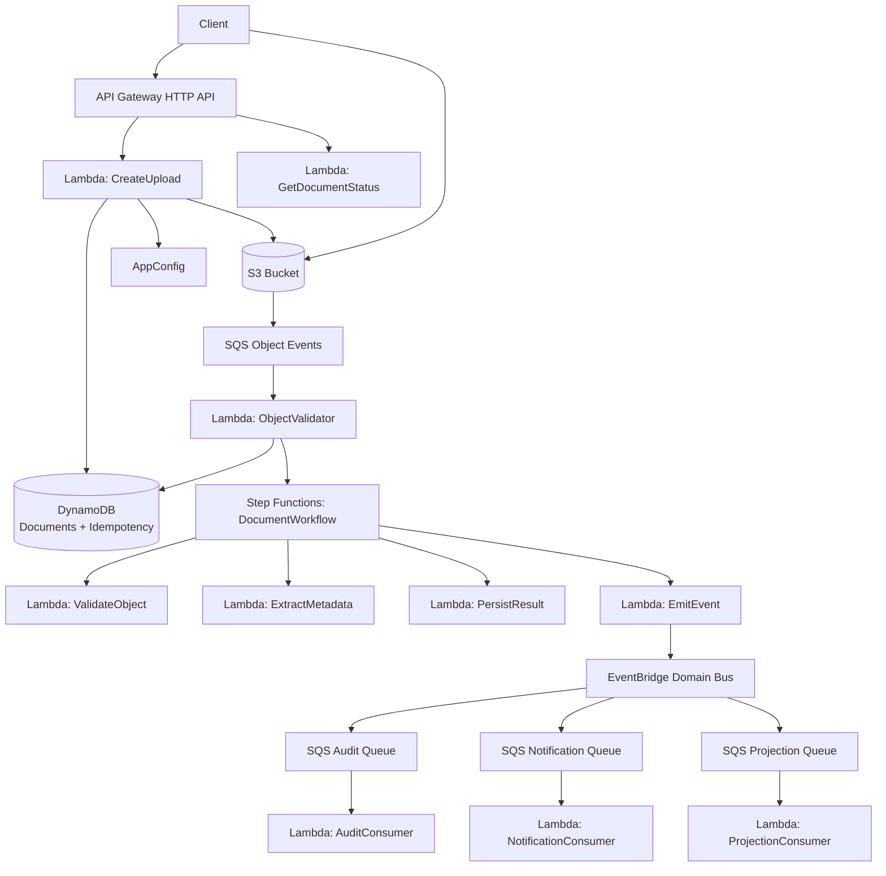
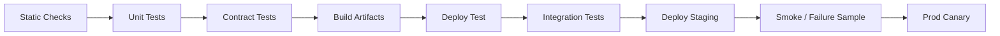

# Part 081 — Lab: Build a Serverless Document Processing Platform

This lab converts the Part 079 reference architecture into an implementation plan.

The goal is not to paste a toy template.

The goal is to build a production-shaped serverless platform with:

- clear boundaries;
- idempotent commands;
- S3 direct upload;
- queue-based object event handling;
- Step Functions workflow;
- EventBridge domain event fanout;
- DynamoDB state and idempotency;
- least-privilege IAM;
- structured observability;
- deployed integration tests;
- failure drills;
- runbooks.

You can implement this lab using:

- AWS SAM;
- AWS CDK;
- Terraform;
- Pulumi;
- raw CloudFormation;
- your internal platform.

The architecture and contracts matter more than the IaC tool.

---

## 1. Lab Scenario

Build a multi-tenant document processing platform.

Users can:

1. create a document upload intent;
2. upload a file directly to S3;
3. let the system validate/process the object;
4. track document status;
5. receive event-driven side effects:
   - audit record;
   - notification;
   - projection update.

The system is intentionally simple in business logic but production-like in infrastructure.

### Functional Requirements

- `POST /cases/{caseId}/documents` creates upload intent.
- API returns `documentId`, `uploadId`, and presigned upload URL.
- Client uploads file to S3.
- S3 object event goes to SQS.
- Validator Lambda starts Step Functions workflow.
- Workflow updates document status.
- Workflow emits `DocumentProcessed` or `DocumentRejected`.
- EventBridge routes event to consumer queues.
- Consumers process audit/notification/projection side effects.
- `GET /cases/{caseId}/documents/{documentId}` returns document status.

### Non-Functional Requirements

- all mutating API commands are idempotent;
- duplicate S3 events do not start duplicate workflows;
- consumers are idempotent;
- queues have DLQs;
- workflow has retry/catch;
- logs are structured;
- correlation ID flows end to end;
- deployments use aliases/versions where appropriate;
- failure paths are testable.

---

## 2. Target Architecture



### Why This Shape?

| Boundary | Reason |
|---|---|
| API Gateway -> Lambda | thin API adapter |
| Client -> S3 | large payload bypasses Lambda |
| S3 -> SQS | durable object event buffer |
| SQS -> Lambda validator | controlled object event handling |
| Validator -> Step Functions | durable workflow orchestration |
| Step Functions -> tasks | explicit processing stages |
| Workflow -> EventBridge | domain event publication |
| EventBridge -> SQS consumers | per-consumer backpressure |
| DynamoDB | state/idempotency |
| AppConfig | runtime config/flags |

The system is small enough to build, but shaped like production.

---

## 3. Repository Structure

Use a structure that separates infrastructure, functions, shared libraries, tests, and runbooks.

```txt
serverless-document-platform/
├── infra/
│   ├── app/
│   │   ├── api.ts
│   │   ├── storage.ts
│   │   ├── workflow.ts
│   │   ├── events.ts
│   │   ├── observability.ts
│   │   └── security.ts
│   └── templates/
├── services/
│   ├── create-upload-function/
│   ├── get-document-status-function/
│   ├── object-validator-function/
│   ├── workflow-tasks/
│   │   ├── validate-object/
│   │   ├── extract-metadata/
│   │   ├── persist-result/
│   │   └── emit-event/
│   ├── audit-consumer-function/
│   ├── notification-consumer-function/
│   └── projection-consumer-function/
├── shared/
│   ├── idempotency/
│   ├── logging/
│   ├── metrics/
│   ├── authz/
│   ├── config/
│   ├── errors/
│   └── event-contracts/
├── events/
│   ├── api/
│   ├── s3/
│   ├── sqs/
│   ├── eventbridge/
│   └── step-functions/
├── tests/
│   ├── unit/
│   ├── contract/
│   ├── integration/
│   └── failure/
├── runbooks/
│   ├── document-stuck-processing.md
│   ├── object-event-dlq.md
│   ├── workflow-failed.md
│   └── event-consumer-dlq.md
└── README.md
```

### Design Principle

Functions should not be organized only by AWS service.

Organize by business boundary and runtime role.

---

## 4. Resource Inventory

Create these resources.

### API

- HTTP API or REST API.
- Routes:
  - `POST /cases/{caseId}/documents`
  - `GET /cases/{caseId}/documents/{documentId}`
- Authorizer:
  - JWT/OIDC/Cognito or test authorizer for lab.
- Access logs.

### Lambda

- CreateUpload.
- GetDocumentStatus.
- ObjectValidator.
- ValidateObject task.
- ExtractMetadata task.
- PersistResult task.
- EmitEvent task.
- AuditConsumer.
- NotificationConsumer.
- ProjectionConsumer.

### Storage and State

- S3 bucket for documents.
- DynamoDB table:
  - documents;
  - idempotency;
  - workflow metadata;
  - optional audit/projection items.

You may use one table or multiple tables.

For learning clarity, two tables are acceptable:

```txt
DocumentTable
IdempotencyTable
```

For advanced single-table practice, use one table with entity prefixes.

### Messaging and Workflow

- SQS object event queue + DLQ.
- SQS audit queue + DLQ.
- SQS notification queue + DLQ.
- SQS projection queue + DLQ.
- EventBridge custom bus.
- EventBridge rules for `DocumentProcessed` and `DocumentRejected`.
- Step Functions state machine.
- AppConfig profile for processing config.
- Secrets Manager secret if external notification provider is simulated.
- KMS key if practicing CMK.

---

## 5. DynamoDB Model

Use two-table design for lab readability.

### DocumentTable

Primary key:

```txt
PK = TENANT#<tenantId>#CASE#<caseId>
SK = DOCUMENT#<documentId>
```

Item:

```json
{
  "PK": "TENANT#tenant-1#CASE#case-123",
  "SK": "DOCUMENT#doc-789",
  "entityType": "Document",
  "tenantId": "tenant-1",
  "caseId": "case-123",
  "documentId": "doc-789",
  "uploadId": "upl-456",
  "status": "PENDING_UPLOAD",
  "sourceBucket": "documents-prod",
  "sourceKey": "tenants/tenant-1/cases/case-123/documents/doc-789/uploads/upl-456/original.pdf",
  "sourceVersionId": null,
  "outputPrefix": "tenants/tenant-1/cases/case-123/documents/doc-789/processed/",
  "createdAt": "2026-07-06T10:00:00Z",
  "updatedAt": "2026-07-06T10:00:00Z",
  "version": 1
}
```

### GSI for Status

```txt
GSI1PK = TENANT#<tenantId>#STATUS#<status>
GSI1SK = updatedAt#caseId#documentId
```

Use for:

- list processing documents;
- find stale workflows;
- operational repair.

### IdempotencyTable

Primary key:

```txt
PK = IDEMPOTENCY#<key>
```

Attributes:

```json
{
  "PK": "IDEMPOTENCY#tenant-1:CreateDocument:cmd-123",
  "status": "COMPLETED",
  "requestHash": "sha256...",
  "result": {
    "documentId": "doc-789",
    "uploadId": "upl-456"
  },
  "createdAt": "2026-07-06T10:00:00Z",
  "expiresAt": 1783936900
}
```

Use TTL on `expiresAt`.

### Conditional Writes

Create document:

```txt
PutItem
ConditionExpression: attribute_not_exists(PK) AND attribute_not_exists(SK)
```

Update status:

```txt
ConditionExpression: version = :expectedVersion AND status = :expectedStatus
```

Idempotency claim:

```txt
PutItem
ConditionExpression: attribute_not_exists(PK)
```

---

## 6. S3 Bucket and Prefixes

Bucket:

```txt
<env>-document-platform-documents
```

Prefixes:

```txt
tenants/{tenantId}/cases/{caseId}/documents/{documentId}/uploads/{uploadId}/
tenants/{tenantId}/cases/{caseId}/documents/{documentId}/processed/
tenants/{tenantId}/cases/{caseId}/documents/{documentId}/failed/
tmp/
```

### Object Upload Key

```txt
tenants/tenant-1/cases/case-123/documents/doc-789/uploads/upl-456/original.pdf
```

### Event Notification

Configure S3 event notification to SQS for object created events under upload prefix.

In practice, S3 native prefix filters are simple prefix/suffix filters. If your path requires rich filtering, use S3 to EventBridge and route there.

For lab:

```txt
prefix = tenants/
suffix = .pdf
```

Then validate exact structure in code.

### Recursive Trigger Prevention

Output goes to:

```txt
processed/
```

Input event only accepts:

```txt
uploads/
```

Code guard rejects non-upload prefix.

---

## 7. API Contract

### Create Upload

Request:

```http
POST /cases/case-123/documents
Idempotency-Key: tenant-1:create-document:cmd-123
Content-Type: application/json
```

Body:

```json
{
  "fileName": "evidence.pdf",
  "contentType": "application/pdf",
  "sizeBytes": 1048576,
  "sha256": "optional-checksum"
}
```

Response:

```json
{
  "documentId": "doc-789",
  "uploadId": "upl-456",
  "status": "PENDING_UPLOAD",
  "upload": {
    "method": "PUT",
    "url": "https://...",
    "expiresAt": "2026-07-06T10:15:00Z"
  }
}
```

### Get Status

```http
GET /cases/case-123/documents/doc-789
```

Response:

```json
{
  "documentId": "doc-789",
  "caseId": "case-123",
  "status": "PROCESSED",
  "createdAt": "...",
  "updatedAt": "...",
  "outputs": {
    "text": {
      "available": true,
      "downloadUrl": "https://..."
    }
  }
}
```

### Error Envelope

```json
{
  "error": {
    "code": "IDEMPOTENCY_KEY_CONFLICT",
    "message": "The idempotency key was reused with a different request.",
    "correlationId": "corr-123",
    "requestId": "req-456"
  }
}
```

---

## 8. CreateUpload Lambda

Responsibilities:

1. Parse and validate request.
2. Derive tenant/user from trusted auth context.
3. Authorize case access.
4. Require idempotency key.
5. Hash request payload.
6. Claim idempotency.
7. Generate document ID/upload ID.
8. Create DocumentTable item with `PENDING_UPLOAD`.
9. Generate presigned S3 URL.
10. Mark idempotency completed.
11. Return response.

### Pseudocode

```java
public ApiResponse handle(ApiRequest request, Context context) {
    RequestContext ctx = RequestContext.from(request, context);

    CreateUploadCommand command = adapter.parse(request);
    validator.validate(command);

    authz.checkCanUpload(ctx.user(), ctx.tenantId(), command.caseId());

    String idemKey = IdempotencyKeys.createDocument(ctx.tenantId(), request.idempotencyKey());
    String requestHash = Hashing.sha256(command.normalizedJson());

    IdempotencyClaim claim = idempotency.claim(idemKey, requestHash);

    if (claim.isDuplicateCompleted()) {
        return mapper.created(claim.cachedResult());
    }

    DocumentIds ids = DocumentIds.newIds();

    DocumentRecord record = DocumentRecord.pendingUpload(ctx, command, ids);

    documentRepository.createIfAbsent(record);

    PresignedUpload upload = s3Presigner.createPutUrl(record.sourceBucket(), record.sourceKey());

    idempotency.complete(idemKey, requestHash, result(ids, upload));

    return mapper.created(result(ids, upload));
}
```

### Failure Decisions

| Failure | Response |
|---|---|
| invalid request | 400 |
| unauthorized | 401/403 |
| same idempotency key same payload completed | same result |
| same key different payload | 409 |
| DynamoDB conditional duplicate document | retry/409 depending cause |
| S3 presign error | 503 |
| remaining time too low | 503 before side effect |

---

## 9. ObjectValidator Lambda

Input: SQS batch containing S3 event notification.

Responsibilities:

1. For each message, parse S3 event.
2. Extract bucket/key/version.
3. Validate key prefix.
4. `HeadObject`.
5. Load document record.
6. Validate object size/content/checksum policy.
7. Claim processing idempotency.
8. Start Step Functions execution.
9. Update document status to `PROCESSING`.
10. Return partial batch failures.

### Partial Batch Response

Enable event source mapping response type:

```txt
ReportBatchItemFailures
```

AWS guidance says partial batch responses let Lambda retry only failed messages instead of reprocessing successfully processed messages.

### Pseudocode

```java
public SQSBatchResponse handleRequest(SQSEvent event, Context context) {
    List<BatchItemFailure> failures = new ArrayList<>();

    for (SQSMessage message : event.getRecords()) {
        try {
            processOne(message, context);
        } catch (PermanentObjectException e) {
            quarantine(message, e);
        } catch (RetryableException e) {
            failures.add(new BatchItemFailure(message.getMessageId()));
        }
    }

    return new SQSBatchResponse(failures);
}
```

### Processing Idempotency Key

```txt
ObjectProcessing:<bucket>:<key>:<versionId-or-etag>:processor-v1
```

### Start Execution Name

```txt
docproc-{tenantId}-{documentId}-{objectVersionHash}
```

If execution already exists, treat as duplicate success after verifying state.

---

## 10. Step Functions Workflow Definition

Conceptual Amazon States Language:

```json
{
  "StartAt": "ValidateObject",
  "States": {
    "ValidateObject": {
      "Type": "Task",
      "Resource": "arn:aws:states:::lambda:invoke",
      "Retry": [
        {
          "ErrorEquals": ["RetryableError", "Lambda.ServiceException"],
          "IntervalSeconds": 2,
          "BackoffRate": 2,
          "MaxAttempts": 3
        }
      ],
      "Catch": [
        {
          "ErrorEquals": ["UnsupportedDocument"],
          "Next": "RejectDocument"
        },
        {
          "ErrorEquals": ["States.ALL"],
          "Next": "FailDocument"
        }
      ],
      "Next": "ExtractMetadata"
    },
    "ExtractMetadata": {
      "Type": "Task",
      "Resource": "arn:aws:states:::lambda:invoke",
      "Next": "PersistResult"
    },
    "PersistResult": {
      "Type": "Task",
      "Resource": "arn:aws:states:::lambda:invoke",
      "Next": "EmitDocumentProcessed"
    },
    "EmitDocumentProcessed": {
      "Type": "Task",
      "Resource": "arn:aws:states:::events:putEvents",
      "End": true
    },
    "RejectDocument": {
      "Type": "Task",
      "Resource": "arn:aws:states:::lambda:invoke",
      "End": true
    },
    "FailDocument": {
      "Type": "Task",
      "Resource": "arn:aws:states:::lambda:invoke",
      "End": true
    }
  }
}
```

### Production Notes

Use direct EventBridge service integration for `PutEvents` when no custom code is needed.

Use Lambda task for custom event construction/validation if domain logic is non-trivial.

### Workflow Input

```json
{
  "correlationId": "corr-123",
  "tenantId": "tenant-1",
  "caseId": "case-123",
  "documentId": "doc-789",
  "uploadId": "upl-456",
  "object": {
    "bucket": "documents-prod",
    "key": "tenants/tenant-1/cases/case-123/documents/doc-789/uploads/upl-456/original.pdf",
    "versionId": "abc",
    "sizeBytes": 1048576
  },
  "processingConfig": {
    "processorVersion": "v1",
    "maxPages": 50,
    "configVersion": "document-processing-42"
  }
}
```

---

## 11. EventBridge Contract

Event:

```json
{
  "Source": "com.example.documents",
  "DetailType": "DocumentProcessed",
  "Detail": "{\"schemaVersion\":\"1.0\",\"eventId\":\"evt-123\",\"tenantId\":\"tenant-1\",\"caseId\":\"case-123\",\"documentId\":\"doc-789\"}",
  "EventBusName": "document-domain-prod"
}
```

Detail:

```json
{
  "schemaVersion": "1.0",
  "eventId": "evt-123",
  "correlationId": "corr-123",
  "tenantId": "tenant-1",
  "caseId": "case-123",
  "documentId": "doc-789",
  "documentStatus": "PROCESSED",
  "occurredAt": "2026-07-06T10:15:30Z",
  "output": {
    "textKey": "tenants/tenant-1/cases/case-123/documents/doc-789/processed/text.json"
  }
}
```

Rules:

```json
{
  "source": ["com.example.documents"],
  "detail-type": ["DocumentProcessed"],
  "detail": {
    "schemaVersion": ["1.0"]
  }
}
```

Targets:

- AuditQ.
- NotifyQ.
- ProjectionQ.

Each target queue has a policy allowing the EventBridge rule/source to send messages.

---

## 12. Consumers

### AuditConsumer

- Reads `DocumentProcessed`.
- Writes immutable audit record.
- Idempotency key:
  ```txt
  audit:<eventId>
  ```
- Permanent failures go to DLQ only after classification.
- Audit DLQ is critical.

### NotificationConsumer

- Reads `DocumentProcessed`.
- Checks AppConfig notification flag.
- Sends notification or writes notification intent.
- Uses notification idempotency key:
  ```txt
  notify:<eventId>:<recipient>
  ```
- External provider failures are retryable.
- Duplicate user-visible notifications must be prevented.

### ProjectionConsumer

- Updates read model/search projection.
- Idempotency by:
  ```txt
  projection:<documentId>:<eventId>
  ```
- Usually safe to replay as upsert.

### Consumer Rule

Each consumer owns its queue and DLQ.

Do not share one queue among audit, notification, and projection.

---

## 13. IAM Design

Create one role per Lambda function.

### CreateUpload Role

Permissions:

- `dynamodb:PutItem`, `UpdateItem`, `GetItem` on DocumentTable/IdempotencyTable.
- `s3:PutObject` on upload prefix if needed for presign context.
- `kms:Encrypt` if CMK used.
- AppConfig read if used.

### ObjectValidator Role

Permissions:

- SQS receive/delete/change visibility on ObjectEventQueue.
- S3 `HeadObject`, `GetObject` on upload prefix.
- DynamoDB read/write.
- `states:StartExecution` on state machine alias.

### Workflow Task Roles

Each task role scoped to task needs.

### Consumer Roles

Each consumer role can:

- receive/delete from its own queue;
- write to its own state/side-effect resources;
- no access to other consumer queues.

### Guardrail

Avoid shared `serverless-platform-role`.

Over-shared roles destroy blast-radius control.

---

## 14. Observability Implementation

### Structured Log Schema

```json
{
  "timestamp": "2026-07-06T10:15:30Z",
  "level": "INFO",
  "service": "object-validator",
  "environment": "prod",
  "version": "42",
  "correlationId": "corr-123",
  "tenantId": "tenant-1",
  "caseId": "case-123",
  "documentId": "doc-789",
  "operation": "StartDocumentWorkflow",
  "outcome": "SUCCESS",
  "lambdaRequestId": "req-456"
}
```

### Metrics

Emit custom metrics:

- `CreateUploadSuccess`.
- `CreateUploadIdempotentDuplicate`.
- `ObjectValidationFailed`.
- `WorkflowStarted`.
- `DocumentProcessed`.
- `DocumentRejected`.
- `ConsumerDuplicateEvent`.
- `NotificationSendFailed`.
- `AuditWriteFailed`.

### Alarms

- API 5xx.
- API p95 latency.
- Object queue age.
- Object queue DLQ > 0.
- Step Functions failures.
- Audit DLQ > 0.
- Notification DLQ > threshold.
- Projection queue age.
- Lambda throttles.
- DynamoDB throttles.
- EventBridge failed invocations.
- Log ingestion anomaly.

### Logs Insights Queries

Find document:

```sql
fields @timestamp, service, operation, outcome, errorCode
| filter documentId = "doc-789"
| sort @timestamp asc
```

Find correlation:

```sql
fields @timestamp, service, operation, message
| filter correlationId = "corr-123"
| sort @timestamp asc
```

---

## 15. Configuration

Environment variables:

```txt
DOCUMENT_TABLE_NAME
IDEMPOTENCY_TABLE_NAME
DOCUMENT_BUCKET_NAME
OBJECT_EVENT_QUEUE_URL
STATE_MACHINE_ARN
EVENT_BUS_NAME
APP_CONFIG_APPLICATION
APP_CONFIG_ENVIRONMENT
APP_CONFIG_PROFILE
POWERTOOLS_SERVICE_NAME
LOG_LEVEL
```

AppConfig:

```json
{
  "maxUploadBytes": 10485760,
  "allowedContentTypes": ["application/pdf"],
  "processorVersion": "v1",
  "notificationsEnabled": true,
  "workflowStartEnabled": true
}
```

Validation:

- max upload <= business limit;
- allowed types non-empty;
- processor version known;
- kill switch safe.

---

## 16. Local Development

Local tests:

- unit tests for handlers;
- event fixture tests;
- SAM local invoke/start-api where using SAM;
- local DynamoDB for repository logic if useful;
- Step Functions Local for workflow shape where useful.

But remember:

Local testing does not prove IAM, KMS, event source mapping, EventBridge delivery, or S3 notification behavior.

Use deployed integration tests.

### Useful Event Fixtures

```txt
events/api/create-upload-valid.json
events/api/create-upload-invalid.json
events/s3/object-created-pdf.json
events/sqs/s3-event-batch-one-poison.json
events/eventbridge/document-processed-v1.json
events/step-functions/document-workflow-input.json
```

---

## 17. Deployed Integration Test Plan

### Test 1 — Create Upload

1. Call `POST /cases/{caseId}/documents`.
2. Assert response contains `documentId`, `uploadId`, URL.
3. Assert DocumentTable item exists.
4. Repeat with same idempotency key and payload.
5. Assert same result.
6. Repeat with same key different payload.
7. Assert conflict.

### Test 2 — Upload and Process

1. Use presigned URL to upload test PDF/text object.
2. Wait for document status `PROCESSED` or `REJECTED`.
3. Assert Step Functions execution completed.
4. Assert output object exists if processed.
5. Assert `DocumentProcessed` event reached consumer queues.
6. Assert audit/projection records exist.

### Test 3 — Duplicate S3 Event

1. Send same S3 event message to ObjectEventQueue twice.
2. Assert only one workflow execution.
3. Assert idempotency duplicate metric increments.

### Test 4 — Poison Event

1. Send malformed S3 event.
2. Assert message reaches DLQ or quarantine.
3. Assert alarm/test metric visible.

### Test 5 — Consumer Failure

1. Send event that causes notification provider failure.
2. Assert retry/DLQ behavior.
3. Assert audit consumer unaffected.

---

## 18. Failure Drills

### Drill: Recursive Trigger Prevention

Upload file to `processed/` prefix or simulate event.

Expected:

- validator ignores;
- no workflow start;
- metric `IgnoredNonInputObject`.

### Drill: Workflow Task Failure

Make `ExtractMetadata` throw controlled `RetryableError`.

Expected:

- Step Functions retries;
- if still failing, catch path marks document failed;
- alarm fires.

### Drill: Audit Consumer DLQ

Make audit write fail permanently.

Expected:

- message reaches Audit DLQ;
- notification/projection consumers still succeed;
- runbook can inspect by event ID.

### Drill: DynamoDB Throttling

Use controlled low provisioned capacity in test env or synthetic fault.

Expected:

- retries bounded;
- queue age alarm if backlog;
- no duplicate side effects.

---

## 19. Deployment Pipeline

Stages:



### Static Checks

- no wildcard IAM without waiver;
- log retention set;
- DLQs configured;
- SQS visibility > Lambda timeout;
- functions use aliases;
- EventBridge rules have owner tags;
- S3 bucket blocks public access;
- KMS policy scoped;
- AppConfig validators exist.

### Deployment Safety

- publish Lambda versions;
- API functions use canary shift;
- workflow state machine version/alias;
- EventBridge rules pattern-tested;
- data migrations expand/contract;
- rollback alias/config ready.

---

## 20. Runbooks

### Document Stuck PROCESSING

Check:

1. DynamoDB document item.
2. Step Functions execution.
3. ObjectValidator logs.
4. Workflow task logs.
5. S3 object exists/version.
6. DLQs.
7. Recent deployment/config.

Actions:

- if workflow failed due bug, fix and restart/redrive if idempotent;
- if object invalid, mark rejected;
- if duplicate idempotency conflict, reconcile;
- if downstream unavailable, wait/backlog or disable workflow start.

### Object Event DLQ

Check:

- message body;
- bucket/key/version;
- error code;
- upload record exists;
- object exists;
- schema/prefix.

Actions:

- classify permanent vs retryable;
- repair upload metadata if safe;
- redrive small batch;
- monitor.

### Event Consumer DLQ

Check:

- event type/version;
- consumer;
- target resource;
- side-effect status;
- idempotency record.

Actions:

- fix consumer/permission/downstream;
- redrive queue;
- ensure no duplicate audit/notification.

---

## 21. Cost Review

Track:

- cost per upload intent;
- cost per processed document;
- Lambda duration by function;
- Step Functions transitions per workflow;
- S3 storage/requests;
- DynamoDB read/write units;
- SQS requests;
- EventBridge events/matches;
- CloudWatch log ingestion;
- KMS requests.

### Optimization Exercises

- tune Lambda memory for workflow tasks;
- reduce success log volume;
- validate SQS batch size;
- remove unnecessary Lambda glue with direct Step Functions integrations;
- add lifecycle rule for `tmp/`;
- use sparse GSI for status queries;
- sample trace volume.

---

## 22. Extensions

After base lab works, add:

### Extension A — EventBridge Archive and Replay

- archive domain events;
- replay a small window;
- prove consumer idempotency.

### Extension B — AppConfig Kill Switch

- disable notifications;
- verify NotificationConsumer no-ops safely.

### Extension C — Step Functions Redrive

- create controlled failed workflow;
- fix issue;
- redrive/restart safely.

### Extension D — Multi-Tenant Isolation

- tenant-specific prefix condition;
- per-tenant quota config;
- tenant-specific dashboard.

### Extension E — Hybrid Processor

- replace `ExtractMetadata` Lambda with ECS task.
- This becomes Part 082 style.

---

## 23. Success Criteria

The lab is complete when:

- API creates upload intent idempotently.
- S3 upload triggers processing.
- Duplicate S3 event is safe.
- Workflow completes or rejects document.
- EventBridge routes domain event.
- Consumers process independently.
- DLQs exist and are alarmed.
- Logs allow correlation by document ID.
- Integration tests pass.
- At least one failure drill passes.
- Rollback path is documented.
- Cost/unit metric exists.

Do not call the lab complete after “deployment succeeded.”

Call it complete when failure paths are proven.

---

## 24. Common Mistakes

### Mistake 1 — S3 Direct to Heavy Lambda

Use SQS buffer.

### Mistake 2 — No Idempotency on CreateUpload

Client retries create duplicate documents.

### Mistake 3 — Workflow Input Contains Huge Payload

Use S3 references.

### Mistake 4 — EventBridge Direct to All Lambdas

Critical consumers need SQS backpressure.

### Mistake 5 — One Role for All Functions

Blast radius too large.

### Mistake 6 — No Prefix Guard

Recursive triggers possible.

### Mistake 7 — Tests Stop at SAM Local

IAM/event delivery unproven.

### Mistake 8 — No DLQ Runbook

Failure evidence exists but recovery is ad hoc.

---

## 25. Final Mental Model

This lab teaches the production serverless pattern:

```txt
API accepts command
S3 stores bytes
SQS buffers events
Step Functions orchestrates workflow
DynamoDB stores state/idempotency
EventBridge routes domain facts
SQS isolates consumers
Lambda performs bounded compute
```

The system is not production-shaped because it uses many services.

It is production-shaped because every service has a clear contract:

```txt
idempotency
failure path
observability
security boundary
deployment strategy
runbook
```

That is the difference between a demo and an engineered serverless platform.

---

## References

- AWS SAM Developer Guide: local API testing and policy templates
- AWS Step Functions Developer Guide: orchestrating SAM resources and state machines
- AWS Lambda Developer Guide: using Lambda with SQS and partial batch responses
- Amazon S3 User Guide: event notifications and presigned URLs
- Amazon EventBridge User Guide: event buses, rules, targets, archives, and replays
- Amazon DynamoDB Developer Guide: condition expressions, TTL, and GSIs
- AWS Well-Architected Serverless Applications Lens
