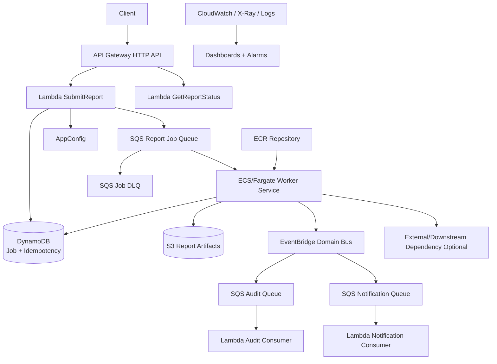
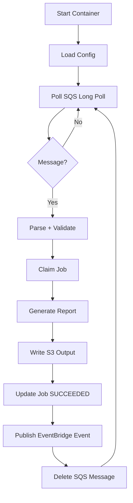
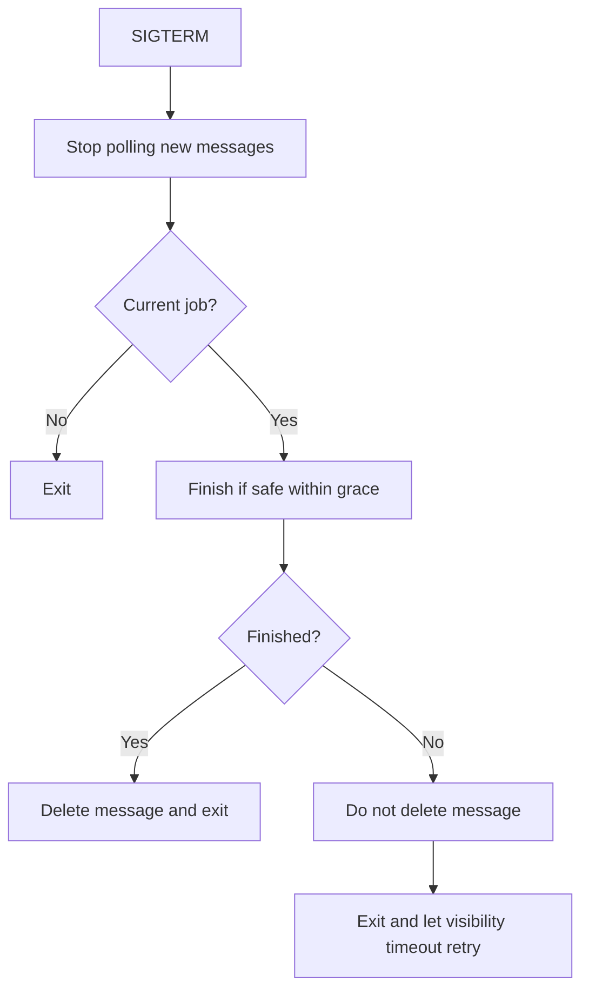
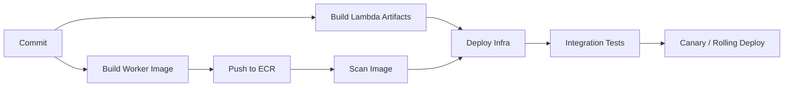

# Part 082 — Lab: Build a Hybrid API + SQS + Fargate Worker Platform

This lab converts the Part 080 hybrid reference architecture into an implementation plan.

You will build a platform where:

- API Gateway + Lambda accepts job requests;
- SQS stores jobs durably;
- ECS/Fargate workers process long-running jobs;
- S3 stores input/output artifacts;
- DynamoDB stores job status and idempotency;
- EventBridge publishes job completion events;
- Lambda consumers handle lightweight side effects;
- autoscaling controls worker fleet size;
- runbooks cover backlog, DLQ, failed task, and duplicate jobs.

The core lesson:

```txt
Use Lambda for fast control-plane work.
Use SQS for backpressure.
Use Fargate for long-running data-plane processing.
Use EventBridge for domain event publication.
```

This is a very common production pattern.

AWS Prescriptive Guidance has an official pattern for async processing with API Gateway, SQS, and Fargate, where the API is the interface, SQS queues work, and Fargate processes jobs without Lambda duration limitations.

---

## 1. Lab Scenario

Build an asynchronous report generation platform.

Users can:

1. submit a report request;
2. receive `202 Accepted` with `jobId`;
3. worker processes report in container;
4. output is written to S3;
5. job status is updated in DynamoDB;
6. `ReportGenerated` event is published to EventBridge;
7. notification/audit consumers process side effects.

### Functional Requirements

- `POST /reports` creates a report job.
- API is idempotent.
- Job is enqueued to SQS.
- ECS/Fargate worker polls queue.
- Worker writes output to S3.
- Worker updates job status.
- Worker emits `ReportGenerated` or `ReportFailed`.
- `GET /reports/{jobId}` returns status.
- DLQ captures poison/unrecoverable jobs.

### Non-Functional Requirements

- API response p95 under 1 second.
- Worker jobs can run for minutes.
- No duplicate reports for same idempotency key.
- No duplicate user-visible notification.
- Worker concurrency protects downstream.
- Worker gracefully handles shutdown.
- Queue backlog is visible and alarmed.
- Container image is versioned by digest.
- Runbooks exist.

---

## 2. Target Architecture



### Component Responsibilities

| Component | Responsibility |
|---|---|
| API Gateway | HTTP front door |
| SubmitReport Lambda | validate, authorize, idempotency claim, create job, enqueue |
| GetReportStatus Lambda | query job status |
| SQS job queue | durable backlog/backpressure |
| ECS/Fargate worker | long-running report generation |
| S3 | input/output artifacts |
| DynamoDB | job state/idempotency |
| EventBridge | job completion/failure events |
| Lambda consumers | lightweight side effects |
| ECR | container image registry |
| CloudWatch | logs/metrics/alarms |

---

## 3. Repository Structure

```txt
hybrid-report-platform/
├── infra/
│   ├── api-stack/
│   ├── queue-stack/
│   ├── ecs-stack/
│   ├── data-stack/
│   ├── events-stack/
│   ├── observability-stack/
│   └── security-stack/
├── lambdas/
│   ├── submit-report/
│   ├── get-report-status/
│   ├── audit-consumer/
│   └── notification-consumer/
├── worker/
│   ├── Dockerfile
│   ├── src/
│   ├── tests/
│   └── entrypoint.sh
├── shared/
│   ├── contracts/
│   ├── idempotency/
│   ├── logging/
│   ├── errors/
│   └── config/
├── events/
│   ├── api/
│   ├── sqs/
│   └── eventbridge/
├── tests/
│   ├── unit/
│   ├── contract/
│   ├── integration/
│   └── load/
└── runbooks/
    ├── queue-backlog.md
    ├── job-dlq.md
    ├── ecs-worker-failure.md
    ├── rds-or-downstream-overload.md
    └── duplicate-job.md
```

This repo explicitly separates Lambda functions from the container worker.

Do not hide the worker inside the API Lambda.

---

## 4. Resource Inventory

### API

- HTTP API.
- Routes:
  - `POST /reports`
  - `GET /reports/{jobId}`
- Authorizer.
- Access logs.

### Lambda

- SubmitReport.
- GetReportStatus.
- AuditConsumer.
- NotificationConsumer.

### Messaging

- ReportJobQueue.
- ReportJobDLQ.
- AuditQueue + DLQ.
- NotificationQueue + DLQ.

### Compute

- ECS cluster.
- Fargate service for report worker.
- Task definition.
- Task role.
- Execution role.
- CloudWatch log group.
- Autoscaling policies.

### Data and Storage

- DynamoDB JobTable.
- DynamoDB IdempotencyTable.
- S3 ReportArtifactsBucket.
- Optional RDS/Aurora if report uses relational data.

### Events

- EventBridge custom bus.
- Rules:
  - `ReportGenerated` -> AuditQueue + NotificationQueue.
  - `ReportFailed` -> AuditQueue + NotificationQueue.

### Supply Chain

- ECR repository.
- CI build/push pipeline.
- Image scanning/lifecycle.
- Deploy by digest.

---

## 5. Job Message Contract

SQS message body:

```json
{
  "schemaVersion": "1.0",
  "jobId": "job-123",
  "tenantId": "tenant-1",
  "reportType": "monthly-summary",
  "requestedBy": "user-456",
  "requestedAt": "2026-07-06T10:00:00Z",
  "correlationId": "corr-789",
  "idempotencyKey": "tenant-1:CreateReport:cmd-123",
  "input": {
    "caseId": "case-123",
    "month": "2026-06"
  },
  "output": {
    "bucket": "reports-prod",
    "prefix": "tenants/tenant-1/reports/job-123/"
  }
}
```

### Required Fields

- schemaVersion;
- jobId;
- tenantId;
- reportType;
- correlationId;
- idempotencyKey;
- input;
- output bucket/prefix.

### Message Attributes

```txt
tenantId
reportType
schemaVersion
correlationId
```

These help with debugging/filtering if needed.

### Idempotency Key

Job-level idempotency:

```txt
tenantId + operation + commandId
```

Worker-level idempotency:

```txt
ReportWorker:<jobId>:<workerVersion>
```

Output key deterministic:

```txt
tenants/{tenantId}/reports/{jobId}/report.pdf
```

---

## 6. DynamoDB Job Model

### JobTable

Primary key:

```txt
PK = TENANT#<tenantId>
SK = REPORT#<jobId>
```

Item:

```json
{
  "PK": "TENANT#tenant-1",
  "SK": "REPORT#job-123",
  "entityType": "ReportJob",
  "tenantId": "tenant-1",
  "jobId": "job-123",
  "reportType": "monthly-summary",
  "status": "QUEUED",
  "requestedBy": "user-456",
  "requestedAt": "2026-07-06T10:00:00Z",
  "startedAt": null,
  "completedAt": null,
  "outputBucket": "reports-prod",
  "outputKey": null,
  "errorCode": null,
  "version": 1
}
```

### Statuses

```txt
QUEUED
RUNNING
SUCCEEDED
FAILED_RETRYABLE
FAILED_PERMANENT
CANCELLED
```

### GSI

```txt
GSI1PK = TENANT#<tenantId>#STATUS#<status>
GSI1SK = updatedAt#jobId
```

Use for:

- list jobs by status;
- find stuck jobs;
- operations dashboard.

### Conditional Updates

Worker starts job:

```txt
ConditionExpression:
  status = QUEUED OR status = FAILED_RETRYABLE
```

Set:

```txt
status = RUNNING
startedAt = now
version = version + 1
workerAttempt = workerAttempt + 1
```

Worker completes:

```txt
ConditionExpression:
  status = RUNNING AND jobId = :jobId
```

This prevents stale worker from overwriting repaired state.

---

## 7. SubmitReport Lambda

Responsibilities:

1. Validate request.
2. Authorize caller/tenant.
3. Require idempotency key.
4. Claim idempotency.
5. Create JobTable item.
6. Send SQS message.
7. Complete idempotency.
8. Return `202 Accepted`.

### Request

```json
{
  "reportType": "monthly-summary",
  "caseId": "case-123",
  "month": "2026-06"
}
```

### Response

```json
{
  "jobId": "job-123",
  "status": "QUEUED",
  "statusUrl": "/reports/job-123"
}
```

### Critical Transaction Concern

If Lambda creates job but fails to enqueue SQS message, the job is stuck.

Options:

#### Option A — Transactional Outbox

Write job and outbox message in DynamoDB transaction.

Outbox publisher sends to SQS.

#### Option B — Enqueue Then Update Carefully

Not ideal if enqueue succeeds and job write fails.

#### Option C — Write Job, Send Queue, Repair Stuck QUEUED Jobs

Acceptable for lab if you implement stuck job repair.

Production-grade path: outbox or transaction-aware design.

### Lab Recommendation

Implement a simple outbox item in DynamoDB:

```txt
PK = OUTBOX#<eventId>
SK = SQS#ReportJob
```

A publisher Lambda/Scheduler can publish missing queue messages.

For first implementation, you may send SQS directly but must add a repair job.

---

## 8. ECS/Fargate Worker Design

The worker is a long-running process.

It polls SQS.



### Worker Responsibilities

- long poll SQS;
- parse message;
- validate schema;
- claim job with conditional write;
- process report;
- write output to S3;
- update job status;
- publish event;
- delete message only after durable success;
- handle graceful shutdown.

### Worker Must Not

- delete message before output/state commit;
- generate random output key on retry;
- process unsupported schema indefinitely;
- ignore stop signal;
- keep old credentials forever;
- use unbounded concurrency;
- log report contents/secrets.

---

## 9. Worker Concurrency Model

Inside each Fargate task, decide:

```txt
one message at a time
or
N concurrent messages per task
```

Start simple:

```txt
one message per task
```

Then scale task count.

This simplifies:

- visibility timeout;
- memory;
- CPU;
- debugging;
- graceful shutdown.

For higher throughput, add internal concurrency carefully.

### Throughput Formula

```txt
throughput = running_tasks × jobs_per_task_concurrency / avg_job_duration
```

Example:

```txt
tasks = 10
jobs per task = 1
avg duration = 120s
throughput = 10 / 120 = 0.083 jobs/sec = 300 jobs/hour
```

### Downstream Cap

If RDS/external API can support only 20 concurrent jobs:

```txt
max ECS tasks <= 20
```

Autoscaling must respect downstream capacity.

---

## 10. SQS Visibility Timeout

Set visibility timeout greater than expected job duration.

Example:

```txt
job p95 duration = 5 minutes
visibility timeout = 15 minutes
```

If job can exceed visibility timeout:

- extend visibility periodically;
- split job;
- use Step Functions + ECS RunTask;
- raise timeout based on measured max;
- avoid unbounded job duration.

### Heartbeat Extension

Worker can call `ChangeMessageVisibility`.

Rules:

- extend before timeout;
- stop extending if shutdown requested and job can be retried safely;
- do not extend forever for stuck job;
- record progress.

### Warning

If visibility expires while worker still processing, another worker may process same job concurrently.

Idempotency and conditional job state must protect side effects.

---

## 11. Graceful Shutdown

Fargate may stop tasks during deployment/scale-in.

Worker must handle SIGTERM.

### Shutdown Flow



### Rules

- stop polling new messages immediately;
- finish current job only if enough time;
- if not finished, leave message undeleted;
- update job state carefully;
- ensure retry can resume or restart safely.

### Idempotent Output

If worker writes output then dies before deleting message, next worker must not generate duplicate bad output.

Use deterministic output key and state check.

---

## 12. Container Image

Dockerfile principles:

- small base image;
- pinned dependencies;
- non-root user;
- no secrets;
- health-friendly entrypoint;
- SIGTERM handled;
- read-only filesystem where possible;
- logs to stdout/stderr;
- architecture matches Fargate platform;
- SBOM/vulnerability scan.

Example conceptual Dockerfile:

```dockerfile
FROM eclipse-temurin:21-jre

WORKDIR /app
COPY build/libs/report-worker.jar /app/report-worker.jar

RUN useradd -r -u 10001 appuser
USER appuser

ENTRYPOINT ["java", "-jar", "/app/report-worker.jar"]
```

### Image Deployment

Deploy by digest:

```txt
account.dkr.ecr.region.amazonaws.com/report-worker@sha256:...
```

Not mutable `latest`.

---

## 13. ECS/Fargate Service

Use:

- ECS cluster;
- Fargate capacity;
- service desired count;
- private subnets;
- task security group;
- task role;
- execution role;
- log group;
- autoscaling policy.

### Environment Variables

```txt
JOB_QUEUE_URL
JOB_TABLE_NAME
IDEMPOTENCY_TABLE_NAME
ARTIFACT_BUCKET_NAME
EVENT_BUS_NAME
APP_CONFIG_PROFILE
AWS_REGION
LOG_LEVEL
WORKER_VERSION
```

### Task Role Permissions

- `sqs:ReceiveMessage`;
- `sqs:DeleteMessage`;
- `sqs:ChangeMessageVisibility`;
- `sqs:GetQueueAttributes`;
- `dynamodb:GetItem/PutItem/UpdateItem`;
- `s3:PutObject/GetObject/HeadObject`;
- `events:PutEvents`;
- `secretsmanager:GetSecretValue` if needed;
- `kms:Decrypt/Encrypt` on specific keys.

### Execution Role

- pull image from ECR;
- write logs;
- retrieve secrets if using ECS secret injection.

Separate task role and execution role responsibilities.

---

## 14. Autoscaling

Scale workers based on queue backlog/age.

### Basic Signals

- visible messages;
- age of oldest message;
- CPU;
- memory;
- job duration;
- downstream latency.

### Target Tracking Concept

```txt
target messages per task = 5
desired tasks = visible messages / 5
```

But with long jobs, age may be more useful.

### Scaling Guardrails

- min tasks;
- max tasks based on downstream;
- cooldown;
- deployment health;
- DLQ alarm;
- cost alarm.

### AWS CDK Shortcut

AWS CDK provides an `QueueProcessingFargateService` construct pattern that wires an ECS service to process messages from SQS. It can be useful as a reference or starting point, but production teams should still understand the generated resources and tune IAM, DLQ, scaling, and observability.

### Custom Scaling

For advanced systems, publish custom metric:

```txt
backlog_per_running_task = visible_messages / running_tasks
```

Scale on this with target tracking.

---

## 15. Worker Error Classification

Errors:

| Error | Action |
|---|---|
| invalid schema | mark permanent fail or let DLQ |
| unsupported report type | permanent fail |
| missing business data | permanent or retry depending consistency |
| downstream timeout | retryable |
| S3 write failure | retryable |
| DynamoDB throttling | retryable |
| idempotency duplicate completed | delete message success |
| stale job state | delete or quarantine depending status |
| unknown exception | retryable limited, then DLQ |

Worker must not treat all exceptions the same.

### Permanent Failure

Update job:

```txt
status = FAILED_PERMANENT
errorCode = UNSUPPORTED_REPORT_TYPE
```

Publish `ReportFailed`.

Delete message only after durable failure state/event.

### Retryable Failure

Do not delete message.

Let visibility timeout retry, or change visibility for delay.

---

## 16. EventBridge Output

On success:

```json
{
  "source": "com.example.reports",
  "detail-type": "ReportGenerated",
  "detail": {
    "schemaVersion": "1.0",
    "eventId": "evt-123",
    "correlationId": "corr-456",
    "tenantId": "tenant-1",
    "jobId": "job-123",
    "reportType": "monthly-summary",
    "output": {
      "bucket": "reports-prod",
      "key": "tenants/tenant-1/reports/job-123/report.pdf"
    },
    "generatedAt": "2026-07-06T10:20:00Z"
  }
}
```

On failure:

```json
{
  "source": "com.example.reports",
  "detail-type": "ReportFailed",
  "detail": {
    "schemaVersion": "1.0",
    "eventId": "evt-124",
    "tenantId": "tenant-1",
    "jobId": "job-123",
    "errorCode": "UNSUPPORTED_REPORT_TYPE",
    "failedAt": "2026-07-06T10:20:00Z"
  }
}
```

### Outbox Option

If EventBridge publish after job update fails, the job status may be correct but event missing.

For higher reliability, write outbox item in DynamoDB transaction and publish from outbox publisher.

Lab extension: implement outbox.

---

## 17. Lambda Side Consumers

### AuditConsumer

- consumes `ReportGenerated` and `ReportFailed`;
- writes audit record;
- idempotency by event ID.

### NotificationConsumer

- sends user notification;
- uses AppConfig kill switch;
- idempotency by event ID + recipient;
- external failure retryable;
- DLQ after max receives.

Use SQS queues between EventBridge and Lambda.

Do not direct invoke notification Lambda from EventBridge for critical user notification path unless failure semantics are acceptable.

---

## 18. API GetReportStatus Lambda

Responsibilities:

- authenticate and authorize;
- read JobTable;
- return status;
- generate presigned download URL if succeeded;
- hide internal S3 key if needed;
- map errors.

Response:

```json
{
  "jobId": "job-123",
  "status": "SUCCEEDED",
  "reportType": "monthly-summary",
  "requestedAt": "...",
  "completedAt": "...",
  "download": {
    "available": true,
    "url": "https://..."
  }
}
```

Do not create report output in status handler.

Status handler is read path only.

---

## 19. Observability

### Worker Logs

```json
{
  "service": "report-worker",
  "workerVersion": "v1.3.7",
  "imageDigest": "sha256:...",
  "ecsTaskArn": "arn:aws:ecs:...",
  "jobId": "job-123",
  "tenantId": "tenant-1",
  "correlationId": "corr-456",
  "operation": "GenerateReport",
  "outcome": "SUCCESS",
  "durationMs": 125000
}
```

### Metrics

- jobs received;
- jobs started;
- jobs succeeded;
- jobs failed retryable/permanent;
- job duration p50/p95/p99;
- queue age;
- visible messages;
- DLQ depth;
- ECS running tasks;
- worker CPU/memory;
- S3 output write failures;
- EventBridge publish failures;
- duplicate job count.

### Dashboards

- API requests/latency/errors.
- Queue backlog/age/DLQ.
- ECS service tasks/CPU/memory/deployments.
- Job success/failure/duration.
- EventBridge output.
- Consumer queues/DLQs.
- Cost per job.

---

## 20. Deployment Pipeline



### Worker Image Pipeline

1. Build image.
2. Run unit tests.
3. Generate SBOM.
4. Scan vulnerabilities.
5. Push to ECR.
6. Record digest.
7. Deploy task definition with digest.
8. ECS rolling/blue-green deploy.
9. Monitor queue/job metrics.

### Lambda Pipeline

- build ZIP;
- unit tests;
- publish version;
- alias/canary if API-facing.

### Infra

- queues before producers;
- ECS service before routing production jobs;
- EventBridge rules after target queues exist;
- IAM policies least privilege.

---

## 21. Integration Tests

### Test 1 — Submit Job

1. POST `/reports`.
2. Assert `202`.
3. Assert JobTable status `QUEUED`.
4. Assert SQS message exists or worker picks it up.

### Test 2 — Worker Processes Job

1. Submit job with small test input.
2. Wait until status `SUCCEEDED`.
3. Assert S3 output exists.
4. Assert EventBridge event routed to audit/notification queues.
5. Assert audit record exists.

### Test 3 — Duplicate Submit

1. POST same request with same idempotency key.
2. Assert same job ID.
3. Assert only one SQS job message/effective job.

### Test 4 — Poison Job

1. Send message with unsupported schema/report type.
2. Assert job marked permanent failure or DLQ.
3. Assert worker continues other jobs.

### Test 5 — Worker Shutdown

1. Start long job.
2. Stop ECS task.
3. Assert message not lost.
4. Assert retry resumes safely.

### Test 6 — Downstream Failure

1. Simulate dependency timeout.
2. Assert message retries.
3. Assert no duplicate output.
4. Assert queue age/alarms visible.

---

## 22. Load Test

Measure:

- API p95 latency;
- SQS queue age;
- ECS task count;
- job duration;
- S3 output throughput;
- DynamoDB throttling;
- EventBridge publish failures;
- cost per job.

### Load Test Inputs

- 100 jobs short;
- 100 jobs mixed duration;
- burst of 1,000 jobs;
- one tenant heavy;
- downstream slow simulation.

### Acceptance

- queue age stays within SLO;
- worker max tasks respects downstream;
- no DLQ under normal load;
- no duplicate outputs;
- cost per job within expected band.

---

## 23. Failure Drills

### Drill: Queue Backlog

Pause ECS service or set desired count to 0.

Expected:

- queue visible messages rise;
- age alarm fires;
- API still accepts or rejects based on backlog policy;
- resume service drains backlog.

### Drill: Worker Bug

Deploy worker version that fails controlled test job.

Expected:

- DLQ or failed status;
- ECS deployment rollback possible;
- old task definition redeploy works;
- evidence preserved.

### Drill: RDS/External Dependency Slow

Expected:

- worker timeout/backoff;
- queue absorbs;
- max tasks do not overload dependency;
- kill switch/circuit breaker works.

### Drill: EventBridge Publish Failure

Simulate permission/config issue in test.

Expected:

- job state still durable;
- outbox/retry or alarm catches missing event;
- runbook repairs.

---

## 24. Runbooks

### Queue Backlog

Check:

- visible messages;
- age oldest;
- ECS desired/running tasks;
- worker logs;
- CPU/memory;
- downstream latency;
- deployment version.

Actions:

- rollback worker if regression;
- scale tasks if downstream safe;
- reduce tasks if downstream overloaded;
- inspect poison messages;
- check DLQ.

### Job DLQ

Check:

- message schema;
- job ID;
- status in DynamoDB;
- worker error code;
- output existence;
- previous attempts.

Actions:

- classify;
- fix code/config/data;
- redrive one message;
- monitor;
- redrive batch.

### Duplicate Report

Check:

- idempotency record;
- duplicate messages;
- visibility timeout;
- worker shutdown;
- output key determinism;
- event duplicates.

Actions:

- stop worker if harmful;
- reconcile S3 outputs;
- patch idempotency;
- redrive safely.

### ECS Worker Failure

Check:

- ECS service events;
- stopped task reason;
- image digest;
- task definition revision;
- container logs;
- IAM/task role;
- memory/CPU.

Actions:

- rollback task definition;
- scale down/up;
- fix image/config;
- preserve failed message evidence.

---

## 25. Cost Model

Cost per report:

```txt
API request
+ SubmitReport Lambda
+ SQS job message
+ ECS/Fargate task runtime
+ DynamoDB job/idempotency writes
+ S3 output storage/requests
+ EventBridge event
+ Lambda consumers
+ CloudWatch logs
+ retries/failures
```

### Key Optimization Levers

- right-size Fargate CPU/memory;
- tune number of worker tasks;
- use SQS long polling;
- reduce verbose worker logs;
- deterministic output prevents duplicate artifacts;
- lifecycle old reports;
- optimize report generation code;
- use Lambda for small jobs and Fargate for heavy jobs if mixed.

### Cost Trap

Leaving worker min tasks high during low usage.

For bursty jobs, consider:

- min tasks 0 or low if startup latency acceptable;
- scheduled scaling for known peaks;
- Lambda worker for short jobs;
- Fargate Spot for non-critical retryable jobs if business allows.

---

## 26. Security Checklist

- [ ] API authenticated.
- [ ] API authorization checks tenant/report access.
- [ ] SubmitReport role can only write job table and send job queue.
- [ ] Worker task role scoped to job queue, tables, bucket prefix, event bus.
- [ ] Execution role separate from task role.
- [ ] S3 bucket blocks public access.
- [ ] Output access via presigned URL or authorized download.
- [ ] Secrets in Secrets Manager.
- [ ] KMS policies tested.
- [ ] ECR image scanning enabled.
- [ ] No secrets in image/environment/logs.
- [ ] Queue policies scoped.
- [ ] EventBridge target permissions scoped.

---

## 27. Extension A — Step Functions + ECS RunTask

Instead of always-on ECS worker polling SQS:

```txt
SubmitReport -> Step Functions -> ECS RunTask
```

Use when:

- each job is workflow-controlled;
- job count is moderate;
- audit history matters;
- per-job container task is acceptable;
- retry/catch/timeout visible.

Step Functions can run ECS/Fargate tasks and wait for completion.

Trade-off:

- more workflow cost;
- clearer orchestration;
- no always-on poller needed;
- easier per-job visibility.

---

## 28. Extension B — EKS Worker

Replace ECS worker with EKS deployment/job when:

- Kubernetes platform is standard;
- job needs custom scheduling;
- operator/controller pattern;
- service mesh;
- existing shared cluster;
- advanced pod policies.

Keep SQS job contract unchanged.

Migration path:

```txt
SQS -> ECS worker
SQS -> EKS shadow worker
SQS -> EKS worker
```

The queue boundary protects producer from compute change.

---

## 29. Extension C — Outbox for EventBridge

Worker completion transaction writes:

```txt
Job status SUCCEEDED
Outbox event ReportGenerated
```

Outbox publisher sends EventBridge events.

This prevents:

```txt
job succeeded but event publish failed
```

Implementation options:

- DynamoDB Streams on outbox item;
- scheduled Lambda scans pending outbox;
- worker retries with outbox status;
- Step Functions task.

Outbox is strongly recommended when event publication is business-critical.

---

## 30. Success Criteria

The lab is complete when:

- API submits job idempotently.
- SQS receives job.
- ECS/Fargate worker processes job.
- Output lands in S3.
- Job status updates correctly.
- EventBridge emits completion/failure event.
- Lambda consumers process side effects.
- Worker handles duplicate job safely.
- Queue backlog alarm works.
- DLQ runbook is tested.
- ECS deployment rollback works.
- Cost per job is observable.
- Worker shutdown does not lose messages.

Deployment success is not enough.

Operational proof is the finish line.

---

## 31. Common Mistakes

### Mistake 1 — Delete SQS Message Before Durable Success

Job can be lost.

### Mistake 2 — No Idempotency in Worker

Retry/shutdown duplicates output.

### Mistake 3 — ECS Autoscaling Ignores Downstream

Scaling melts database/external API.

### Mistake 4 — Visibility Timeout Too Short

Two workers process same job.

### Mistake 5 — Mutable Image Tag in Production

Rollback/provenance unclear.

### Mistake 6 — Worker Does Not Handle SIGTERM

Scale-in/deploy loses or duplicates work.

### Mistake 7 — No DLQ Alarm

Failures wait silently.

### Mistake 8 — API Does Long Job Synchronously

Defeats async architecture.

### Mistake 9 — One Task Role for API and Worker

Blast radius too large.

### Mistake 10 — No Outbox for Critical Completion Event

Job succeeds but domain event missing.

---

## 32. Final Mental Model

This lab teaches the hybrid production pattern:

```txt
fast command intake with Lambda
durable backpressure with SQS
long-running processing with Fargate
state/idempotency with DynamoDB
artifacts with S3
domain events with EventBridge
side effects with Lambda consumers
```

The architecture works because each piece has the right contract.

A top-tier engineer does not ask:

> “Can Fargate process SQS messages?”

They ask:

> “How do we guarantee a submitted job is durable, processed at a safe rate, not duplicated under retry/shutdown, observable by job ID, recoverable from DLQ, and cheap enough per business result?”

That is hybrid platform implementation engineering.

---

## References

- AWS Prescriptive Guidance: asynchronous processing with API Gateway, SQS, and AWS Fargate
- AWS CDK API Reference: QueueProcessingFargateService
- Amazon ECS Developer Guide: service auto scaling and best practices
- Amazon SQS Developer Guide: visibility timeout, long polling, DLQs, and redrive
- AWS Step Functions Developer Guide: running ECS/Fargate tasks
- AWS Lambda Developer Guide: using Lambda with SQS and partial batch responses
- Amazon EventBridge User Guide: rules, targets, and event buses
