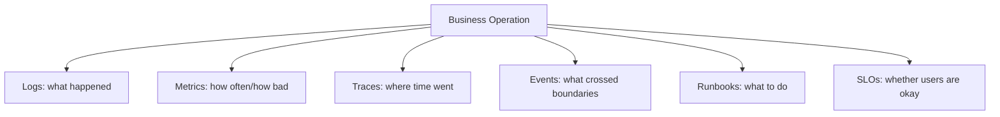
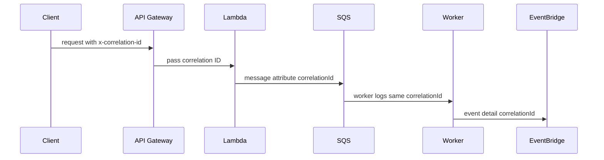

# Part 083 — Lab: Observability for Serverless and Containers

A production system is not observable because logs exist.

It is observable when engineers can answer operational questions quickly.

Examples:

```txt
Why did this payment fail?
Which event triggered this workflow?
Did the SQS message get retried?
Which Lambda version processed it?
Which ECS task generated the output?
Was the downstream dependency slow?
Did the event reach EventBridge?
Is the message in DLQ?
Was the failure caused by config version 42?
Did the user-visible side effect happen twice?
```

This lab builds observability for the serverless and hybrid architectures from Parts 081 and 082.

The goal is to create a telemetry contract that works across:

- API Gateway;
- Lambda;
- SQS;
- EventBridge;
- Step Functions;
- ECS/Fargate;
- DynamoDB;
- S3;
- external APIs;
- AppConfig;
- deployment versions.

The lab uses AWS-native services and patterns:

- CloudWatch Logs;
- CloudWatch Metrics;
- Embedded Metric Format;
- CloudWatch Alarms;
- CloudWatch Dashboards;
- X-Ray;
- AWS Distro for OpenTelemetry;
- Lambda Powertools for Java where useful;
- structured logs;
- correlation IDs;
- SLO dashboards;
- alarm drills.

---

## 1. Observability Mental Model

Observability has three common telemetry pillars:

```txt
logs
metrics
traces
```

But production operations need more than the words.



### Logs

Used for:

- debugging one request/event/job;
- reconstructing timeline;
- evidence during incident;
- audit breadcrumbs;
- root cause analysis.

### Metrics

Used for:

- alarms;
- trends;
- capacity;
- SLOs;
- dashboards;
- anomaly detection.

### Traces

Used for:

- latency breakdown;
- dependency calls;
- distributed path;
- service map;
- request flow.

### Events and State

Used for:

- async workflow reconstruction;
- DLQ/redrive;
- business outcome;
- idempotency;
- job status.

Observability is complete only when all of them connect.

---

## 2. Lab Target

Add observability to two systems:

### System A — Serverless Document Platform

From Part 081:

```txt
API Gateway -> Lambda -> S3 -> SQS -> Lambda -> Step Functions -> EventBridge -> SQS -> Lambda consumers
```

### System B — Hybrid Report Platform

From Part 082:

```txt
API Gateway -> Lambda -> SQS -> ECS/Fargate worker -> S3/DynamoDB/EventBridge -> Lambda consumers
```

### Lab Outputs

By the end:

- every component emits structured logs;
- every request/job/event has correlation ID;
- custom metrics are emitted using EMF or library wrappers;
- traces exist for sync paths and important async segments;
- dashboards show health by workflow;
- alarms map to runbooks;
- SLOs are defined;
- DLQ, backlog, and workflow failure are visible;
- deployment/config versions appear in logs;
- observability tests prove fields/alarms exist.

---

## 3. Telemetry Contract

Create a standard telemetry contract.

Every log from every component should include:

```txt
timestamp
level
service
environment
version
operation
outcome
correlationId
causationId optional
eventId optional
tenantId where safe
resourceId/jobId/documentId where safe
requestId/runtime id
errorCode when failure
configVersion when applicable
```

### Lambda-Specific Fields

```txt
lambdaRequestId
functionName
functionVersion
coldStart
memoryLimit
remainingTimeMs when useful
```

### ECS/Fargate-Specific Fields

```txt
ecsCluster
ecsTaskArn
containerName
imageDigest
taskDefinitionRevision
workerVersion
```

### Step Functions Fields

```txt
stateMachineArn
executionArn
stateName
workflowName
workflowVersion
```

### Queue/Event Fields

```txt
queueName
messageId
receiveCount
eventSource
eventBusName
eventDetailType
eventSchemaVersion
```

### Why Standardization Matters

Without standard fields:

```txt
searching logs requires guessing every team's naming convention
```

With standard fields:

```txt
filter correlationId = "corr-123"
```

works across services.

---

## 4. Correlation ID Design

A correlation ID follows a business operation across boundaries.



### Source

If caller provides valid `x-correlation-id`, use it.

If missing, generate.

Rules:

- validate length/charset;
- avoid using untrusted huge header;
- do not treat correlation ID as authentication;
- include in response header;
- propagate through async messages.

### Fields

| Field | Meaning |
|---|---|
| `correlationId` | whole business request/process |
| `causationId` | immediate cause of current event |
| `eventId` | domain event identity |
| `jobId` | async job identity |
| `documentId` | domain resource identity |
| `requestId` | platform runtime request ID |

### Correlation vs Trace

A trace ID tracks sampled distributed tracing.

A correlation ID tracks business flow.

Even if tracing is not sampled, correlation ID must be logged.

---

## 5. Propagation Rules

### API Gateway to Lambda

- Read `x-correlation-id` header.
- If missing, create.
- Put in logging context.
- Return in response header.

### Lambda to SQS

Message attributes:

```json
{
  "correlationId": {
    "DataType": "String",
    "StringValue": "corr-123"
  },
  "causationId": {
    "DataType": "String",
    "StringValue": "cmd-456"
  }
}
```

Message body should also contain correlation ID if consumer may not read attributes.

### Lambda to EventBridge

Event detail:

```json
{
  "correlationId": "corr-123",
  "causationId": "job-456",
  "eventId": "evt-789"
}
```

### Step Functions

State machine input:

```json
{
  "correlationId": "corr-123",
  "workflowId": "wf-456"
}
```

Every task receives it.

### ECS Worker

Read from SQS message body/attributes.

Set MDC/log context for every log line.

### External HTTP Calls

Propagate:

```txt
x-correlation-id
x-request-id
idempotency-key where appropriate
```

Do not leak internal tenant/user data unnecessarily.

---

## 6. Structured Logging for Lambda Java

Use JSON logs.

You can use:

- Lambda Powertools for Java logging utility;
- Log4j2 JSON layout;
- SLF4J with structured encoder;
- internal standard logger.

AWS Lambda Powertools for Java provides utilities for structured logging, metrics, tracing, parameters, idempotency, validation, and more.

### Example Log

```json
{
  "timestamp": "2026-07-06T10:15:30.123Z",
  "level": "INFO",
  "service": "create-upload",
  "environment": "prod",
  "functionVersion": "42",
  "coldStart": false,
  "correlationId": "corr-123",
  "tenantId": "tenant-1",
  "caseId": "case-123",
  "documentId": "doc-789",
  "operation": "CreateUpload",
  "outcome": "SUCCESS",
  "durationMs": 84
}
```

### Java MDC Pattern

```java
try (var ignored = LoggingContext.open(Map.of(
        "correlationId", correlationId,
        "tenantId", tenantId,
        "operation", "CreateUpload"
))) {
    log.info("create_upload_started");
    // work
    log.info("create_upload_completed");
}
```

### Error Log

```json
{
  "level": "ERROR",
  "service": "object-validator",
  "operation": "ValidateS3Event",
  "outcome": "FAILURE",
  "errorCode": "OBJECT_NOT_FOUND",
  "retryable": true,
  "correlationId": "corr-123",
  "bucket": "documents-prod",
  "key": "tenants/tenant-1/...",
  "lambdaRequestId": "req-456"
}
```

### Logging Rules

- log start/end for important operations;
- log errors with classification;
- log idempotency status;
- log config version;
- log runtime version;
- do not log secrets;
- do not log full payloads by default;
- sample high-volume success details;
- always log enough identifiers to reconstruct flow.

---

## 7. Structured Logging for ECS/Fargate

Container logs go to stdout/stderr and CloudWatch Logs or your log pipeline.

Use JSON logs.

Fields:

```json
{
  "timestamp": "2026-07-06T10:15:30Z",
  "level": "INFO",
  "service": "report-worker",
  "environment": "prod",
  "workerVersion": "1.3.7",
  "imageDigest": "sha256:...",
  "ecsTaskArn": "arn:aws:ecs:...",
  "taskDefinitionRevision": "report-worker:42",
  "correlationId": "corr-123",
  "jobId": "job-456",
  "operation": "GenerateReport",
  "outcome": "SUCCESS",
  "durationMs": 125000
}
```

### ECS Metadata

Use ECS task metadata endpoint where available to collect:

- task ARN;
- cluster;
- container name;
- image digest;
- availability zone;
- task definition family/revision.

Cache this metadata at startup.

### Worker Lifecycle Logs

Emit logs for:

- worker startup;
- config loaded;
- queue polling started;
- message received;
- job claimed;
- job completed;
- message deleted;
- SIGTERM received;
- graceful shutdown result.

Worker lifecycle logs are essential for queue incidents.

---

## 8. Metrics With EMF

CloudWatch Embedded Metric Format lets you emit custom metrics through structured logs, and CloudWatch extracts them asynchronously.

Use EMF for Lambda and container applications when you want metrics and context in one log event.

AWS documents EMF as a way to generate custom metrics asynchronously in logs written to CloudWatch Logs, which CloudWatch automatically extracts for visualization and alarms.

### Metric Types

#### Business Metrics

```txt
DocumentProcessed
ReportGenerated
PaymentCaptured
NotificationSent
AuditRecordWritten
```

#### Reliability Metrics

```txt
IdempotencyDuplicate
IdempotencyConflict
PoisonMessage
DLQRedriveStarted
WorkflowCompensationStarted
RetryableDependencyFailure
```

#### Performance Metrics

```txt
JobDurationMs
WorkflowDurationMs
ExternalApiLatencyMs
DynamoDbLatencyMs
S3ObjectSizeBytes
```

#### Cost Proxy Metrics

```txt
ProcessedBytes
ReportPages
EventsPublished
MessagesProcessed
```

### EMF Example

```json
{
  "_aws": {
    "Timestamp": 1783332930000,
    "CloudWatchMetrics": [
      {
        "Namespace": "DocumentPlatform",
        "Dimensions": [["Service", "Environment"]],
        "Metrics": [
          { "Name": "DocumentProcessed", "Unit": "Count" },
          { "Name": "ProcessingDurationMs", "Unit": "Milliseconds" }
        ]
      }
    ]
  },
  "Service": "document-workflow",
  "Environment": "prod",
  "DocumentProcessed": 1,
  "ProcessingDurationMs": 1423,
  "correlationId": "corr-123",
  "documentId": "doc-789"
}
```

### Dimension Discipline

Good dimensions:

```txt
Service
Environment
Operation
Outcome
ErrorCode
```

Risky dimensions:

```txt
userId
documentId
jobId
correlationId
requestId
```

High-cardinality dimensions can explode custom metric cost.

Keep high-cardinality identifiers in logs, not metric dimensions.

---

## 9. Lambda Powertools Metrics

Powertools for AWS Lambda Java Metrics utility creates custom metrics by logging EMF to stdout.

Use it to avoid hand-rolling EMF incorrectly.

Example conceptual Java:

```java
@Metrics(namespace = "DocumentPlatform", service = "create-upload")
public ApiResponse handleRequest(ApiRequest request, Context context) {
    metrics.addMetric("CreateUploadRequest", 1, Unit.COUNT);

    try {
        ApiResponse response = service.createUpload(request);
        metrics.addMetric("CreateUploadSuccess", 1, Unit.COUNT);
        return response;
    } catch (IdempotencyConflictException e) {
        metrics.addMetric("IdempotencyConflict", 1, Unit.COUNT);
        throw e;
    }
}
```

### Metric Rules

- every alarm metric must have clear owner/runbook;
- every metric must have expected direction;
- avoid emitting one-off metrics nobody uses;
- add dimensions only when operationally needed;
- test metrics exist in staging.

---

## 10. Tracing With X-Ray and OpenTelemetry

Tracing shows where time is spent.

AWS X-Ray can trace requests through supported AWS services and applications. AWS Distro for OpenTelemetry is AWS-supported OpenTelemetry distribution and can be used with Lambda and container workloads.

### Use Tracing For

- API latency;
- cold start impact;
- downstream call latency;
- DynamoDB/S3/SQS/EventBridge calls;
- external provider calls;
- service map;
- error hotspots.

### Limitations

Tracing across async boundaries is not as automatic as sync HTTP calls.

You must propagate context/correlation manually.

For SQS/EventBridge/Step Functions, use:

- message attributes;
- event detail;
- workflow input;
- logs;
- custom spans where useful.

### Lambda

Options:

- AWS X-Ray SDK;
- ADOT Lambda layers;
- Lambda Powertools tracing;
- OpenTelemetry instrumentation.

### ECS/Fargate

Options:

- ADOT Collector sidecar;
- CloudWatch agent;
- OpenTelemetry SDK in application;
- X-Ray daemon/collector pattern depending setup.

### Rule

Do not rely on tracing alone for async workflows.

Async observability needs logs, metrics, state, queues, and correlation IDs.

---

## 11. Step Functions Observability

Step Functions gives execution history.

Use it.

For every workflow:

- set meaningful execution name;
- include correlation ID in input;
- log execution ARN in task logs;
- emit metrics for workflow start/success/failure;
- alarm on failures/timeouts;
- track duration;
- track retries/catch paths;
- include business IDs.

### Execution Name

```txt
docproc-tenant-1-doc-789-vabc
```

### Task Log Context

When Lambda task runs:

```json
{
  "workflowExecutionArn": "arn:aws:states:...",
  "stateName": "ExtractMetadata",
  "documentId": "doc-789",
  "correlationId": "corr-123"
}
```

### Workflow Dashboard

- executions started;
- succeeded;
- failed;
- timed out;
- duration p95;
- retry count;
- catch path count;
- redrive count.

### Workflow Failure Query

Runbook should say:

```txt
Find execution by documentId/jobId -> inspect failed state -> inspect task logs by correlationId.
```

---

## 12. SQS Observability

Queue metrics are reliability metrics.

Dashboard:

- ApproximateNumberOfMessagesVisible;
- ApproximateNumberOfMessagesNotVisible;
- ApproximateAgeOfOldestMessage;
- NumberOfMessagesSent;
- NumberOfMessagesReceived;
- NumberOfMessagesDeleted;
- DLQ visible messages;
- Lambda consumer errors/throttles if Lambda;
- ECS worker task count if ECS.

### Important Signals

| Signal | Meaning |
|---|---|
| visible messages rising | backlog |
| age oldest rising | SLA risk |
| not visible high | many in-flight / stuck work |
| sent > deleted sustained | consumers falling behind |
| DLQ > 0 | terminal failure |
| receive count high | retry storm/poison |

### Worker Log Link

Every worker log should include:

```txt
messageId
receiveCount
queueName
jobId/documentId
correlationId
```

SQS message ID alone is not enough. It is platform ID, not business ID.

---

## 13. EventBridge Observability

Track:

- PutEvents success/failure;
- failed entry count;
- rule matched events;
- target failed invocations;
- DLQs;
- archive/replay status;
- event type/version counts;
- consumer queue depth.

### Producer Log

```json
{
  "operation": "PublishDomainEvent",
  "eventBus": "document-domain-prod",
  "source": "com.example.documents",
  "detailType": "DocumentProcessed",
  "eventId": "evt-123",
  "outcome": "SUCCESS"
}
```

### EventBridge Runbook Question

When a consumer says “I did not receive event”:

1. Did producer publish successfully?
2. Was `PutEvents` partially failed?
3. Was event on expected bus?
4. Did rule pattern match?
5. Did target delivery fail?
6. Did message arrive in target queue?
7. Did consumer process or DLQ?

Your observability must answer each step.

---

## 14. API Observability

API dashboard:

- request count;
- 2xx/4xx/5xx;
- p50/p95/p99 latency;
- integration latency;
- auth failures;
- throttles;
- route-level errors;
- idempotency conflicts;
- validation failures;
- dependency failures.

### Access Log Fields

```json
{
  "requestId": "$context.requestId",
  "routeKey": "$context.routeKey",
  "status": "$context.status",
  "responseLatency": "$context.responseLatency",
  "integrationError": "$context.integrationErrorMessage",
  "sourceIp": "$context.identity.sourceIp"
}
```

Do not log sensitive request bodies in access logs.

### API Error Codes

Application error envelope should include stable `error.code`.

Metrics by error code:

```txt
VALIDATION_ERROR
AUTHORIZATION_DENIED
IDEMPOTENCY_KEY_CONFLICT
DOWNSTREAM_UNAVAILABLE
TIMEOUT_BUDGET_EXCEEDED
```

This makes alarms and dashboards meaningful.

---

## 15. DynamoDB Observability

Track:

- throttles;
- system errors;
- user errors;
- latency;
- consumed capacity;
- conditional check failures;
- transaction cancellations;
- GSI throttles;
- stream iterator age;
- hot key symptoms via application metrics.

### Application Metrics

Emit:

- IdempotencyClaimed;
- IdempotencyDuplicateCompleted;
- IdempotencyConflict;
- OptimisticLockConflict;
- ConditionalWriteFailedByReason;
- TransactionCancelledByReason.

Do not treat all conditional failures as errors.

Some are normal duplicate/concurrency behavior.

### Log Example

```json
{
  "operation": "UpdateDocumentStatus",
  "documentId": "doc-789",
  "expectedStatus": "PROCESSING",
  "newStatus": "PROCESSED",
  "conditionalResult": "SUCCESS",
  "dynamodbLatencyMs": 18
}
```

---

## 16. S3 Observability

Track:

- object upload count;
- object size;
- event notifications delivered to queue;
- processing started;
- processing completed;
- processing failed;
- recursive trigger ignored count;
- object not found;
- KMS access denied;
- output object written;
- lifecycle cleanup.

### S3 Logs vs App Logs

S3 access logs/CloudTrail data events can be useful for security/audit.

Application logs are better for workflow status.

Use both when required.

### Object Traceability

Store:

```txt
bucket
key
versionId
etag/checksum
documentId/jobId
correlationId
```

Without `versionId`, object event debugging is weaker when keys are overwritten.

---

## 17. Deployment and Config Observability

Every service log should include:

- application version;
- Lambda function version/alias;
- container image digest;
- task definition revision;
- Step Functions version/alias;
- AppConfig version;
- feature flag variants when relevant;
- deployment ID.

### Why

Incidents often start with:

```txt
What changed?
```

If logs contain versions, you answer quickly.

### Config Load Log

```json
{
  "operation": "ConfigLoad",
  "configSource": "AppConfig",
  "configProfile": "document-processing",
  "configVersion": "42",
  "cacheStatus": "MISS",
  "outcome": "SUCCESS"
}
```

### Feature Flag Metric

```txt
FeatureFlagEvaluated{flagName, variant, service}
```

Avoid tenant/user as metric dimension at high volume.

---

## 18. SLOs and Error Budgets

Define SLOs.

### API SLO

```txt
99.9% of CreateUpload requests return non-5xx within 800ms over 30 days.
```

Indicators:

- API 5xx;
- Lambda timeout;
- p95/p99 latency.

### Document Processing SLO

```txt
95% of valid uploaded documents reach PROCESSED or REJECTED within 5 minutes.
```

Indicators:

- workflow duration;
- object queue age;
- document status stale count.

### Report Worker SLO

```txt
99% of report jobs complete within 10 minutes, excluding declared downstream provider outage.
```

Indicators:

- job duration;
- queue age;
- DLQ count.

### Audit SLO

```txt
100% of DocumentProcessed events are written to audit store or present in critical DLQ within 2 minutes.
```

Indicators:

- audit queue age;
- audit DLQ;
- audit write success.

SLOs must match business truth, not only Lambda errors.

---

## 19. Dashboard Design

Create dashboards by workflow, not only service.

### Dashboard 1 — API Overview

- requests by route;
- 5xx/4xx;
- p95/p99 latency;
- throttles;
- idempotency conflicts;
- auth failures.

### Dashboard 2 — Document Workflow

- upload intents;
- S3 object events;
- object queue age;
- workflows started/succeeded/failed;
- processing duration;
- rejected documents;
- stuck processing count.

### Dashboard 3 — Event Consumers

- EventBridge PutEvents failures;
- matched events;
- audit/notification/projection queue age;
- DLQ depth;
- consumer errors/throttles;
- duplicate event count.

### Dashboard 4 — Hybrid Worker

- job queue depth/age;
- ECS running tasks;
- worker CPU/memory;
- job success/failure;
- job duration;
- DLQ;
- downstream latency.

### Dashboard 5 — Cost/Telemetry

- log ingestion;
- custom metric count;
- Lambda duration;
- Step Functions transitions;
- ECS task hours;
- S3 storage;
- DynamoDB capacity;
- EventBridge events.

---

## 20. Alarm Strategy

Every alarm needs:

- owner;
- severity;
- threshold;
- evaluation window;
- runbook link;
- expected action;
- false-positive review.

### Critical Alarms

| Alarm | Why |
|---|---|
| API 5xx high | user-facing outage |
| object queue age high | document processing delayed |
| DLQ > 0 for critical queue | terminal failure |
| Step Functions failed executions | workflow failure |
| audit DLQ > 0 | compliance risk |
| ECS worker desired > 0 and running = 0 | worker down |
| DynamoDB throttles sustained | state store issue |
| EventBridge failed invocations | event delivery issue |
| log ingestion anomaly | cost/loop/retry issue |
| S3 recursive trigger metric | cost/reliability incident |

### Alarm Thresholds

Use business SLOs.

Bad:

```txt
Lambda Errors > 0
```

for all functions.

Good:

```txt
AuditDLQVisibleMessages > 0 for 1 datapoint
```

critical.

Good:

```txt
ObjectQueueAge > 300s for 3 datapoints
```

workflow SLA.

---

## 21. CloudWatch Logs Insights Queries

### Find by Correlation ID

```sql
fields @timestamp, service, operation, outcome, errorCode, message
| filter correlationId = "corr-123"
| sort @timestamp asc
```

### Find by Document

```sql
fields @timestamp, service, operation, status, errorCode
| filter documentId = "doc-789"
| sort @timestamp asc
```

### Find Idempotency Conflicts

```sql
fields @timestamp, service, operation, idempotencyKey, errorCode
| filter errorCode = "IDEMPOTENCY_KEY_CONFLICT"
| sort @timestamp desc
```

### Find SQS Poison Messages

```sql
fields @timestamp, service, queueName, messageId, receiveCount, errorCode
| filter outcome = "FAILURE" and receiveCount >= 3
| sort @timestamp desc
```

### Find Config Version After Deployment

```sql
fields @timestamp, service, configVersion, operation, outcome
| filter configVersion = "42"
| sort @timestamp desc
```

Put useful queries in runbooks.

---

## 22. Observability Tests

Observability must be tested.

### Test 1 — Structured Log Contract

Invoke each handler with fixture.

Assert logs contain:

```txt
service
environment
operation
outcome
correlationId
```

For failure fixture, assert:

```txt
errorCode
retryable
```

### Test 2 — Correlation Propagation

1. Call API with `x-correlation-id = corr-test-123`.
2. Upload object / enqueue job.
3. Wait for workflow/worker completion.
4. Query logs for `corr-test-123`.
5. Assert logs exist in API, validator/worker, workflow task, consumer.

### Test 3 — Metric Emission

Trigger success and failure.

Assert custom metrics appear:

- `CreateUploadSuccess`;
- `DocumentProcessed`;
- `JobFailed`;
- `DLQMessageObserved` if test path.

### Test 4 — Alarm Drill

In staging:

- send poison message;
- assert DLQ alarm fires;
- assert notification reaches test channel;
- assert runbook link present.

### Test 5 — No Secret Logging

Inject secret-like value in request/config.

Assert it does not appear in logs.

This test can be approximate using known canary secret string.

---

## 23. Observability Cost Controls

Telemetry can become expensive.

Controls:

- log retention per environment;
- no full payload logging;
- sampled success details;
- DEBUG disabled by default;
- high-cardinality identifiers in logs, not metrics;
- trace sampling;
- custom metric review;
- dashboard review;
- log ingestion alarms;
- compression/export for long-term analytics if needed.

### Retention Example

| Log Group | Retention |
|---|---:|
| dev Lambda logs | 7 days |
| staging Lambda logs | 14 days |
| prod API logs | 30–90 days |
| audit/security logs | per compliance |
| debug temporary logs | short TTL |

Retention is both cost and compliance.

---

## 24. Incident Response Using Observability

Incident: user says document is stuck.

Procedure:

1. Get `documentId` or `correlationId`.
2. Query logs by ID.
3. Inspect DynamoDB document status.
4. Inspect Step Functions execution.
5. Inspect object queue and DLQ.
6. Inspect EventBridge event if workflow completed.
7. Inspect consumer queues.
8. Identify last successful boundary.
9. Classify failure.
10. Repair/redrive using runbook.

The key skill:

```txt
find the last durable successful state
```

That is how you recover async systems.

---

## 25. Common Anti-Patterns

### Anti-Pattern 1 — Logs Without Correlation ID

You cannot reconstruct async flow.

### Anti-Pattern 2 — Only Lambda Errors Dashboard

Queue age, DLQ, workflow failure, and business SLOs missing.

### Anti-Pattern 3 — High-Cardinality Metrics

Custom metrics become expensive and hard to use.

### Anti-Pattern 4 — Full Payload Logging

Cost, PII, and security risk.

### Anti-Pattern 5 — Trace Sampling as Only Observability

Async workflows need durable identifiers and logs.

### Anti-Pattern 6 — Alarms Without Runbooks

On-call knows something is wrong but not what to do.

### Anti-Pattern 7 — No Version in Logs

Deployment-related incident becomes guesswork.

### Anti-Pattern 8 — DLQ Exists but Is Not Alarmed

Silent terminal failure.

### Anti-Pattern 9 — Success Metrics Only

No poison/retry/duplicate metrics.

### Anti-Pattern 10 — Observability Not Tested

Fields are missing during real incident.

---

## 26. Lab Checklist

### Logs

- [ ] JSON logs.
- [ ] Standard fields.
- [ ] Correlation ID everywhere.
- [ ] Error code taxonomy.
- [ ] Version/config fields.
- [ ] No secrets/PII leakage.
- [ ] Retention set.

### Metrics

- [ ] Business outcome metrics.
- [ ] Reliability metrics.
- [ ] Performance metrics.
- [ ] Queue/DLQ metrics.
- [ ] Cost proxy metrics.
- [ ] Dimension policy.
- [ ] Alarms attached to runbooks.

### Traces

- [ ] X-Ray/ADOT enabled for relevant paths.
- [ ] Trace/correlation propagation.
- [ ] External calls instrumented.
- [ ] Sampling configured.
- [ ] Async trace limitations documented.

### Dashboards

- [ ] API dashboard.
- [ ] Workflow dashboard.
- [ ] Queue/consumer dashboard.
- [ ] ECS worker dashboard.
- [ ] Cost/telemetry dashboard.
- [ ] SLO dashboard.

### Tests

- [ ] Log contract tests.
- [ ] Correlation propagation test.
- [ ] Metric emission test.
- [ ] Alarm drill.
- [ ] No secret logging test.

---

## 27. Final Mental Model

Observability is not “we have logs.”

Production observability means:

```txt
for any request, event, job, object, or workflow,
we can reconstruct what happened,
where it failed,
which version/config handled it,
what side effects occurred,
whether users are affected,
and what action should be taken.
```

A top-tier engineer does not ask:

> “Did the function log an error?”

They ask:

> “Can an on-call engineer start from a user report or event ID and find the last durable successful boundary in under a few minutes?”

That is observability engineering.

---

## References

- AWS Lambda Powertools for Java documentation
- Amazon CloudWatch Embedded Metric Format documentation
- AWS Distro for OpenTelemetry documentation
- AWS X-Ray documentation for ADOT and Lambda
- Amazon CloudWatch Logs Insights documentation
- AWS Well-Architected Serverless Applications Lens: observability and operations
