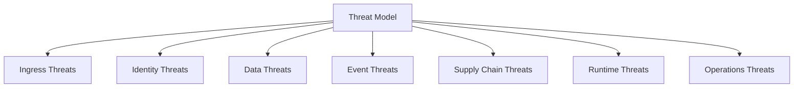
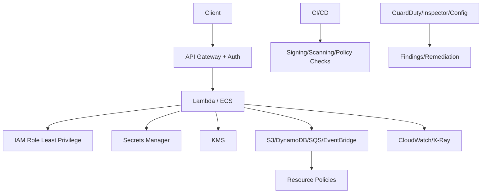
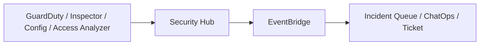

# Part 084 — Lab: Security Hardening for Serverless and Containers

Security hardening is not a final checklist after architecture is done.

Security is part of the architecture contract.

A serverless/container platform has many small identities and many event boundaries:

- API Gateway authorizers;
- Lambda execution roles;
- ECS task roles;
- Step Functions execution roles;
- EventBridge target roles;
- SQS queue policies;
- S3 bucket policies;
- KMS key policies;
- Secrets Manager resource policies;
- ECR repository policies;
- CI/CD deploy roles;
- cross-account trust;
- logs and audit trails.

The good news:

```txt
small compute units can have small permissions
```

The bad news:

```txt
many small permissions can become a complex attack surface
```

This lab hardens the systems from Parts 081 and 082.

The goal is to produce a security operating model, not only enable a few settings.

---

## 1. Threat Model First

Before writing policies, define threats.



### Ingress Threats

- unauthenticated access;
- authorization bypass;
- request tampering;
- replay;
- upload abuse;
- oversized payload;
- malicious file;
- webhook spoofing;
- API rate abuse.

### Identity Threats

- overbroad Lambda role;
- ECS task role can access unrelated secrets;
- EventBridge target role too broad;
- CI/CD role can deploy everywhere;
- cross-account trust too permissive;
- KMS key policy too open.

### Data Threats

- public S3 bucket;
- secrets in environment variables/logs;
- PII in events/DLQs;
- object metadata leakage;
- unencrypted queue/topic/table/bucket;
- excessive log retention;
- no audit trail for sensitive access.

### Event Threats

- forged event to bus;
- queue injection;
- replay causing duplicate side effects;
- EventBridge rule too broad;
- SNS/SQS resource policy allows unexpected principal;
- DLQ redrive by unauthorized operator.

### Supply Chain Threats

- vulnerable dependency;
- malicious transitive dependency;
- unsigned Lambda code;
- mutable container image tag;
- vulnerable base image;
- broad build role;
- secrets in image layer.

### Runtime Threats

- compromised container;
- SSRF credential abuse;
- command injection;
- deserialization bug;
- malicious file parser exploit;
- privilege escalation through IAM;
- abnormal network/data access.

### Operations Threats

- console drift;
- break-glass misuse;
- unreviewed config change;
- disabled alarms;
- unowned resources;
- DLQ evidence deleted.

Security hardening starts by deciding which threats matter most.

---

## 2. Shared Responsibility

AWS manages the security of the cloud.

You manage security in the cloud.

For Lambda/ECS/serverless/container workloads, you own:

- code;
- dependencies;
- IAM policies;
- resource policies;
- data classification;
- encryption configuration;
- secrets handling;
- event schemas;
- authorization logic;
- network egress;
- logging/audit;
- deployment pipeline;
- incident response;
- tenant isolation;
- vulnerability remediation.

Managed compute does not remove application security.

It changes where you apply controls.

---

## 3. Security Baseline Architecture

Apply baseline controls to both labs.



Baseline:

- authentication on all public APIs;
- authorization in application/domain layer;
- least-privilege roles;
- no shared overpowered runtime role;
- secrets in Secrets Manager/SSM SecureString;
- encryption at rest where data classification requires;
- S3 Block Public Access;
- queue/topic/bus policies scoped;
- KMS key policies scoped;
- logs redacted;
- vulnerability scanning;
- deployment provenance;
- runtime monitoring where supported/needed;
- CloudTrail/Config/Security Hub/GuardDuty integration.

---

## 4. IAM Least Privilege

IAM is the most important serverless/container hardening surface.

### Role Per Runtime Unit

Create separate roles:

```txt
CreateUploadLambdaRole
GetDocumentStatusLambdaRole
ObjectValidatorLambdaRole
WorkflowValidateTaskRole
AuditConsumerLambdaRole
NotificationConsumerLambdaRole
ReportWorkerTaskRole
ReportApiTaskRole
StepFunctionsExecutionRole
EventBridgeTargetRole
CiDeployRole
```

Do not use:

```txt
AppRuntimeRole
ServerlessFullAccessRole
EcsTaskEverythingRole
```

### Policy Design

For each role:

1. list side effects;
2. list resources;
3. list actions;
4. scope by ARN;
5. add conditions where useful;
6. test negative access;
7. validate with IAM Access Analyzer;
8. monitor CloudTrail usage;
9. refine.

IAM Access Analyzer policy validation checks policies against IAM grammar and AWS best practices and reports findings such as errors, security warnings, general warnings, and suggestions.

### Example: SQS Consumer Role

```json
{
  "Effect": "Allow",
  "Action": [
    "sqs:ReceiveMessage",
    "sqs:DeleteMessage",
    "sqs:ChangeMessageVisibility",
    "sqs:GetQueueAttributes"
  ],
  "Resource": "arn:aws:sqs:ap-southeast-1:123456789012:report-job-prod"
}
```

### Example: Event Publisher

```json
{
  "Effect": "Allow",
  "Action": "events:PutEvents",
  "Resource": "arn:aws:events:ap-southeast-1:123456789012:event-bus/report-domain-prod"
}
```

This role should not have `events:*`.

---

## 5. IAM Permission Boundaries and SCPs

Use permission boundaries for developer-created roles.

Use SCPs for organization-level guardrails.

### Permission Boundary Examples

Developer-created roles cannot:

- create admin policies;
- pass arbitrary roles;
- access log archive account;
- disable security services;
- use unapproved Regions;
- create public S3 access;
- deploy functions without required tags.

### SCP Examples

Prevent:

- disabling CloudTrail;
- deleting GuardDuty/Security Hub/Config;
- creating IAM users in workload accounts;
- changing log archive bucket policy;
- leaving organization;
- using disallowed Regions;
- public S3 bucket policy in prod.

### Rule

Use SCP for “never allowed.”

Use permission boundaries for delegated self-service.

Use IAM policies for normal least privilege.

Do not encode every app detail in SCP.

---

## 6. Resource Policies

Serverless uses many resource-based policies.

### SQS Queue Policy for EventBridge

Queue should allow only the specific EventBridge rule/source to send messages.

```json
{
  "Effect": "Allow",
  "Principal": { "Service": "events.amazonaws.com" },
  "Action": "sqs:SendMessage",
  "Resource": "arn:aws:sqs:region:account:audit-queue",
  "Condition": {
    "ArnEquals": {
      "aws:SourceArn": "arn:aws:events:region:account:rule/bus/rule-name"
    }
  }
}
```

### SNS to SQS

Scope by SNS topic ARN.

### Lambda Invoke Permission

Scope by source ARN/source account for API Gateway/EventBridge/S3 where applicable.

### S3 Bucket Policy

Enforce:

- TLS;
- encryption;
- block public access;
- allowed principals;
- prefix conditions if needed.

### EventBridge Bus Policy

For cross-account put events:

- allowed accounts/OUs;
- allowed principals;
- maybe source restrictions by governance;
- no wildcard external principal.

Resource policies are often where accidental public/cross-account access appears.

---

## 7. API Authentication and Authorization

### Authentication

Use one of:

- JWT authorizer;
- Cognito;
- IAM SigV4 for service-to-service;
- custom Lambda authorizer;
- mTLS where appropriate;
- private API/VPC endpoints for internal traffic.

### Authorization

Authentication says who caller is.

Authorization says what they can do.

Implement domain checks:

```txt
caller tenant == resource tenant
caller has role/action permission
case state allows upload
user can access report type
tenant quota not exceeded
```

Do not trust tenant ID from path/body alone.

Use trusted claims/context.

### API Security Checklist

- [ ] all public routes authenticated unless explicitly public;
- [ ] authorization tested;
- [ ] request body validation;
- [ ] size limits;
- [ ] WAF/rate limits where needed;
- [ ] CORS scoped;
- [ ] error messages do not leak secrets/internal state;
- [ ] idempotency for side-effecting commands;
- [ ] audit events for sensitive actions.

---

## 8. Upload Security

Presigned URLs are delegated permissions.

Controls:

- short expiration;
- server-generated key;
- key prefix includes tenant/resource;
- content length constraints if using presigned POST;
- content type treated as hint only;
- checksum validation where needed;
- upload metadata record required;
- object post-upload validation;
- antivirus/malware scanning if required by domain;
- Block Public Access;
- SSE-S3/SSE-KMS;
- lifecycle for abandoned uploads.

### Bad

Client chooses arbitrary key:

```txt
../../other-tenant/secret.pdf
```

S3 key is not a filesystem path, but arbitrary key writes can still break tenant isolation.

### Good

Server generates:

```txt
tenants/{tenantId}/cases/{caseId}/documents/{documentId}/uploads/{uploadId}/original.pdf
```

API never lets client choose tenant prefix.

---

## 9. S3 Security

Baseline:

- Block Public Access enabled;
- bucket owner enforced where appropriate;
- encryption enforced;
- TLS enforced;
- bucket policy scoped;
- access logging/CloudTrail data events for sensitive buckets as required;
- lifecycle/retention defined;
- Object Lock for evidence/compliance if needed;
- no secrets in object metadata/tags;
- KMS key policy scoped;
- presigned download URLs short-lived.

### Sensitive Object Policy

For confidential documents:

- SSE-KMS with CMK;
- least-privilege object read;
- CloudTrail data events enabled if audit requires;
- Object Lock/versioning if evidence;
- strict lifecycle;
- no public ACL/policy;
- access via application authorization or scoped presigned URL.

### Event Notification Security

S3 destination permissions must be scoped to bucket.

SQS queue policy should allow only that bucket/source to send if directly used.

---

## 10. SQS/SNS/EventBridge Security

### SQS

- queue policies scoped;
- encryption where needed;
- DLQ encryption;
- producer/consumer roles separated;
- redrive permission restricted;
- message payload minimized;
- no secrets in messages;
- queue names/tags owner/data classification.

### SNS

- topic policy scoped;
- subscriptions controlled;
- filter policy changes reviewed;
- subscription DLQs;
- external HTTP endpoint auth/signature validation;
- SMS/email spend controls;
- no sensitive full payload to external endpoints.

### EventBridge

- custom bus policies scoped;
- `PutEvents` permission narrow;
- rule creation controlled in prod;
- target roles scoped;
- API destinations reviewed for data leakage;
- archive/replay permission restricted;
- replay approval process.

### Replay/Redrive Security

Redrive/replay can re-trigger side effects.

Restrict:

- who can redrive DLQ;
- who can replay EventBridge archive;
- who can start Step Functions redrive/restart;
- who can edit rule targets.

Operational power is security power.

---

## 11. DynamoDB Security

Controls:

- IAM scoped by table/index;
- KMS encryption as required;
- PITR for critical tables;
- no broad `dynamodb:*`;
- tenant validation in app;
- avoid scanning sensitive tables by unauthorized roles;
- CloudTrail management events; data event strategy where required;
- backups protected;
- streams access scoped.

### Fine-Grained Access

For some designs, IAM condition keys can restrict leading keys.

But application authorization is still essential.

Do not rely only on partition key naming for tenant isolation.

### Sensitive Fields

Avoid storing secrets.

For sensitive values:

- encrypt client-side/application-side if required;
- use KMS envelope encryption patterns;
- minimize retention;
- redact logs.

---

## 12. Secrets Management

Use Secrets Manager or SSM SecureString.

### Rules

- no plaintext secrets in code;
- no secrets in container image;
- no secrets in Lambda environment variables where avoidable;
- environment variable stores secret ARN/reference;
- execution role reads only needed secret;
- cache secrets with TTL;
- refresh on auth failure where safe;
- rotate secrets;
- log secret version/stage, not value.

### ECS Secret Injection

ECS can inject secrets into container environment from Secrets Manager/SSM.

This is convenient but remember:

- environment variables can be visible to process;
- rotation may require task restart unless app fetches dynamically;
- task execution role and task role separation matters;
- logs must not print env.

For high rotation needs, fetch at runtime with cache.

### Lambda Extension

Parameters and Secrets Lambda Extension can cache secrets/parameters.

Set TTL according to rotation.

---

## 13. KMS Hardening

KMS appears everywhere:

- Lambda env var encryption;
- S3 objects;
- SQS/SNS queues/topics;
- DynamoDB tables;
- Secrets Manager;
- CloudWatch Logs if encrypted;
- ECR if using CMK;
- application encryption.

### Key Policy Questions

- Which principals can administer key?
- Which runtime roles can use key?
- Which services need grants?
- Is cross-account use needed?
- Is key rotation enabled?
- Is decrypt scoped by encryption context where possible?
- Is CloudTrail monitored?
- Is deletion disabled/controlled?

### Anti-Pattern

```json
{
  "Action": "kms:*",
  "Resource": "*"
}
```

### Runtime Rule

A Lambda that only reads one encrypted secret should not decrypt every key in the account.

---

## 14. Lambda Supply Chain Security

### Code Signing

AWS Lambda code signing helps ensure only trusted signed code packages are deployed. Lambda validates signatures at deployment time, so there is no runtime impact.

Use code signing for:

- critical functions;
- regulated environments;
- shared platform functions;
- high-risk public ingress;
- functions with sensitive permissions.

Controls:

- AWS Signer signing profile;
- code signing config on function;
- CI signs artifact;
- deployment rejects unsigned/untrusted package;
- exception process.

### Dependency Scanning

Use:

- Amazon Inspector Lambda scanning;
- build-time dependency scanning;
- SCA tools;
- SBOM;
- lockfiles;
- dependency update process.

Amazon Inspector can scan Lambda functions for package vulnerabilities and code vulnerabilities, with documented limitations such as no scanning for Lambda functions encrypted with customer-managed keys.

### Lambda Hardening Checklist

- [ ] least-privilege role;
- [ ] code signing for critical functions;
- [ ] no secrets in env/logs;
- [ ] dependency scanning;
- [ ] runtime supported;
- [ ] layers reviewed;
- [ ] function URL auth reviewed;
- [ ] reserved concurrency where blast radius matters;
- [ ] VPC only if needed;
- [ ] DLQ/destination for async critical paths;
- [ ] env var access controlled.

---

## 15. Container Supply Chain Security

### ECR and Image Controls

- image scanning;
- deploy by digest;
- no mutable `latest` in production;
- base image policy;
- SBOM;
- signed images where platform supports/enforces;
- lifecycle policy;
- private repository policy;
- cross-account/Region replication controlled.

### Dockerfile Hardening

- minimal base image;
- non-root user;
- pinned dependencies;
- no secrets;
- no package manager cache;
- read-only filesystem where feasible;
- drop unnecessary Linux capabilities if platform supports;
- health checks;
- graceful SIGTERM handling.

### ECS Task Definition Hardening

- task role least privilege;
- execution role limited;
- secrets injected safely;
- logging configured;
- CPU/memory limits;
- no privileged mode;
- private subnets where appropriate;
- security group scoped;
- ephemeral storage managed.

### EKS Additional Controls

If using EKS:

- Pod Identity/IRSA least privilege;
- admission policies;
- network policies;
- runtime security;
- image policy;
- secrets management;
- RBAC least privilege;
- node/pod isolation.

---

## 16. Amazon Inspector

Amazon Inspector is a vulnerability management service that can scan multiple workload types, including ECR container images and Lambda functions.

Use Inspector for:

- Lambda package vulnerabilities;
- Lambda code vulnerability scanning where supported;
- ECR image vulnerabilities;
- EC2/ECS-on-EC2 where applicable;
- CI/CD findings integration;
- vulnerability SLA.

### Workflow

1. Enable Inspector.
2. Ensure ECR repositories scanned.
3. Ensure Lambda scanning enabled where applicable.
4. Route findings to Security Hub/EventBridge.
5. Create remediation SLA by severity.
6. Block deploy on critical findings if policy requires.
7. Track exceptions with expiry.

### Finding Triage

For each finding:

- affected resource;
- severity;
- exploitability;
- package/image/function version;
- internet exposure;
- runtime permission level;
- fix version;
- compensating control;
- remediation owner.

Vulnerability severity is not the only risk. Runtime permission and exposure matter.

---

## 17. GuardDuty Runtime Monitoring

Amazon GuardDuty Runtime Monitoring helps monitor runtime activity for supported resources and detect potential threats. AWS documentation describes runtime monitoring for workloads such as Amazon ECS on Fargate, EKS, EC2, and gives examples such as detecting compromise, privilege escalation attempts, suspicious API requests, and malicious data access.

For Amazon ECS on Fargate, AWS documentation states that GuardDuty manages the security agent through GuardDuty; manual agent management is not supported for ECS Fargate.

Use for:

- container runtime threat detection;
- suspicious process/network/file activity;
- credential abuse signals;
- runtime compromise detection;
- security incident response enrichment.

### Lab Setup

For the hybrid lab:

1. Enable GuardDuty.
2. Enable Runtime Monitoring for ECS/Fargate where supported in your accounts/Regions.
3. Include/exclude specific ECS clusters if needed.
4. Route GuardDuty findings to EventBridge/Security Hub.
5. Create response runbook.

### Finding Response

When finding occurs:

- identify resource/task;
- isolate task/service if needed;
- stop task;
- preserve logs;
- inspect image digest;
- inspect IAM role permissions;
- inspect network access;
- rotate secrets;
- patch vulnerability;
- redeploy clean image;
- review CloudTrail for credential use.

Runtime monitoring is detection, not prevention. Pair it with least privilege.

---

## 18. Network Security

### Lambda

Do not attach Lambda to VPC unless it needs private resources.

If VPC-attached:

- private subnets;
- security groups scoped;
- VPC endpoints for AWS APIs where useful;
- NAT egress controlled;
- NACLs if required;
- DNS/resolution tested.

### ECS/Fargate

- tasks in private subnets for internal workers;
- ALB security group to service only;
- service SG to RDS only;
- no broad outbound for sensitive workloads;
- VPC endpoints;
- egress proxy/inspection where required.

### API

- WAF for public APIs where needed;
- rate limits;
- private APIs for internal services;
- mTLS for partner if required;
- CloudFront/security headers if web.

### Egress Control

Many incidents involve outbound calls.

Ask:

- which external domains are allowed?
- can compromised task exfiltrate data?
- do we need NAT logs/proxy?
- are VPC Flow Logs enabled?
- are DNS logs useful?

---

## 19. Event and Payload Security

Events, queues, and DLQs are data stores.

Rules:

- no secrets in event/message body;
- minimize PII;
- include references instead of sensitive blobs;
- encrypt queues/topics where needed;
- restrict DLQ access;
- log event metadata, not full sensitive body;
- archive retention follows data policy;
- replay permissions restricted;
- schema includes data classification if useful.

### Sensitive Event Example

Bad:

```json
{
  "resetToken": "secret-token",
  "fullDocumentText": "..."
}
```

Better:

```json
{
  "resetRequestId": "rr-123",
  "documentRef": {
    "bucket": "documents-prod",
    "key": "..."
  }
}
```

### DLQ Security

DLQs often contain malformed/sensitive messages.

Controls:

- encryption;
- retention;
- access restricted to operators;
- redrive permission separated;
- inspection logs;
- no broad read by all developers.

---

## 20. CI/CD Security

Pipeline controls:

- branch protection;
- code review;
- dependency scan;
- IaC policy checks;
- IAM Access Analyzer validation;
- secret scanning;
- SAST;
- Lambda code signing;
- ECR image scanning;
- deploy by digest;
- artifact checksum;
- SBOM;
- separate build/deploy roles;
- OIDC federation instead of long-lived CI credentials;
- least-privilege deploy role;
- manual approval for prod if required;
- deployment provenance.

### Policy Checks

Fail build if:

- S3 bucket public;
- Lambda role has wildcard admin;
- queue lacks DLQ;
- log retention missing;
- Function URL auth none without waiver;
- KMS decrypt wildcard;
- EventBridge bus policy external wildcard;
- secret value in environment variable;
- image tag `latest` used in prod;
- Lambda uses unsupported runtime.

### Deployment Identity

Record:

- who/what deployed;
- commit SHA;
- artifact digest;
- policy checks;
- approvals;
- target account/Region;
- timestamp.

CloudTrail plus pipeline metadata should answer “who changed what?”

---

## 21. Audit and Detection

Enable/route:

- CloudTrail management events;
- CloudTrail data events for sensitive S3/Lambda/DynamoDB where required;
- AWS Config;
- GuardDuty;
- Security Hub;
- Inspector;
- IAM Access Analyzer;
- CloudWatch alarms;
- EventBridge rules for security findings;
- VPC Flow Logs where useful;
- S3 server/access logs where required.

### Security Event Routing



### Detection Examples

- public S3 policy;
- function URL auth none;
- unexpected `PutBucketPolicy`;
- IAM policy wildcard added;
- GuardDuty runtime finding;
- Inspector critical vulnerability;
- KMS key deletion scheduled;
- CloudTrail disabled attempt;
- EventBridge archive replay started;
- SQS redrive started.

Security detections need owners and runbooks.

---

## 22. Incident Response Runbooks

### Runbook: Compromised Lambda Suspected

Actions:

1. disable event source mapping or set reserved concurrency to 0;
2. preserve logs and configuration;
3. identify function version and code artifact;
4. inspect IAM role permissions;
5. rotate secrets accessible to role;
6. review CloudTrail for role activity;
7. deploy clean signed artifact;
8. re-enable gradually;
9. post-incident least privilege review.

### Runbook: Compromised ECS Task Suspected

Actions:

1. stop/isolate task;
2. preserve logs/task metadata/image digest;
3. scale service to clean image if needed;
4. rotate secrets;
5. review task role CloudTrail activity;
6. inspect ECR image findings;
7. check GuardDuty finding details;
8. review network egress;
9. patch and redeploy.

### Runbook: Public S3 Exposure

Actions:

1. block public access immediately;
2. identify policy/ACL change;
3. review CloudTrail;
4. determine object exposure scope;
5. rotate affected secrets if any;
6. notify data/security process;
7. add preventive guardrail.

### Runbook: Overbroad IAM Policy Deployed

Actions:

1. rollback policy;
2. identify role and permissions;
3. review CloudTrail during exposure window;
4. check Access Analyzer findings;
5. add policy-as-code rule;
6. rotate credentials/secrets if accessed unexpectedly.

---

## 23. Security Testing

### Unit/SAST

- authorization logic;
- input validation;
- path traversal-like key validation;
- idempotency conflict;
- redaction utilities.

### Contract Tests

- API rejects unauthorized tenant access;
- event schema has no secret fields;
- queue message schema excludes PII where required;
- presigned URL key prefix is tenant-bound.

### Deployed Security Tests

- Lambda cannot read unrelated secret;
- ECS task cannot access unrelated S3 prefix;
- EventBridge producer cannot put events to wrong bus;
- SQS queue rejects unexpected sender;
- S3 bucket rejects public access;
- KMS decrypt denied for wrong role;
- function URL requires auth or waiver.

### Negative Test Example

```txt
ObjectValidator role attempts s3:GetObject on processed private prefix it should not read.
Expected: AccessDenied.
```

Negative tests prove boundaries.

---

## 24. Compliance Mapping

Map controls to common objectives.

| Objective | Control |
|---|---|
| least privilege | role-per-function/task, Access Analyzer |
| code integrity | Lambda code signing, image digest/signing |
| vulnerability management | Inspector, dependency scanning |
| data encryption | KMS, S3/SQS/DynamoDB encryption |
| auditability | CloudTrail, structured logs, deployment provenance |
| incident detection | GuardDuty, Security Hub, alarms |
| data retention | S3 lifecycle/Object Lock, log retention |
| change control | IaC, CI policy checks, approvals |
| tenant isolation | authz, key prefixes, IAM/resource policy |
| secret protection | Secrets Manager, rotation, no logs |

Compliance should be evidence-driven.

Store evidence:

- policy check results;
- scan results;
- deployment metadata;
- runbook drill reports;
- IAM analysis;
- Config compliance;
- CloudTrail logs.

---

## 25. Security Scorecard

Score each workload.

| Area | 0 | 1 | 2 |
|---|---|---|---|
| IAM | broad shared role | scoped role | least privilege validated/tested |
| secrets | env/plaintext | secret manager | rotation/cache/tested |
| data encryption | default only | KMS where needed | key policy/tested/audited |
| supply chain | no scan | scanning | signed/provenance/SBOM |
| events/DLQ | unencrypted/open | scoped | redrive/replay restricted |
| runtime detection | none | GuardDuty/Inspector | findings routed/runbooks tested |
| API security | auth only | authz/input/WAF | negative tests |
| observability | logs | security metrics | incident reconstruction |
| compliance | manual | Config/Security Hub | evidence automation |
| incident response | ad hoc | runbook | drill tested |

Use scorecard to prioritize.

Do not pretend everything must be perfect before launch, but know the risk.

---

## 26. Production Hardening Checklist

### Identity

- [ ] Role per Lambda/task/workflow.
- [ ] IAM Access Analyzer validation.
- [ ] Permission boundaries for delegated roles.
- [ ] SCPs for organization guardrails.
- [ ] `iam:PassRole` scoped.
- [ ] No admin runtime roles.

### Data

- [ ] S3 Block Public Access.
- [ ] KMS/encryption policy.
- [ ] Secrets Manager/SSM for secrets.
- [ ] No secrets in logs/events/env where avoidable.
- [ ] DLQ access restricted.
- [ ] Data classification tags.
- [ ] Retention/lifecycle defined.

### Events

- [ ] Event bus policies scoped.
- [ ] Queue/topic policies scoped by source.
- [ ] Replay/redrive restricted.
- [ ] Schema excludes secrets.
- [ ] Consumer idempotency.

### Compute

- [ ] Lambda code signing for critical functions.
- [ ] Lambda runtime supported.
- [ ] Inspector scanning enabled.
- [ ] ECR scanning.
- [ ] Deploy by digest.
- [ ] Non-root containers.
- [ ] Runtime monitoring where applicable.
- [ ] VPC/network controls reviewed.

### Pipeline

- [ ] Secret scanning.
- [ ] Dependency scanning.
- [ ] IaC policy checks.
- [ ] SBOM/provenance.
- [ ] Separate build/deploy roles.
- [ ] OIDC/no long-lived CI keys.
- [ ] Approval/waiver process.

### Detection/Response

- [ ] CloudTrail enabled/protected.
- [ ] GuardDuty/Security Hub/Config.
- [ ] Security findings routed.
- [ ] Incident runbooks.
- [ ] Security drills.
- [ ] Evidence retention.

---

## 27. Common Anti-Patterns

### Anti-Pattern 1 — One Runtime Role

Every function/task can do everything.

### Anti-Pattern 2 — Secrets in Environment Variables and Logs

Fast to build, painful to incident respond.

### Anti-Pattern 3 — Public S3 “Temporarily”

Temporary exposure becomes breach.

### Anti-Pattern 4 — Queue Policy Allows Any Sender

Message injection risk.

### Anti-Pattern 5 — EventBridge Bus Open Cross-Account

Unknown event producers.

### Anti-Pattern 6 — ECR Image Tag `latest` in Production

No provenance or stable rollback.

### Anti-Pattern 7 — No Code/Image Scanning

Known vulnerabilities ship silently.

### Anti-Pattern 8 — Redrive/Replays Unrestricted

Operators can duplicate side effects accidentally.

### Anti-Pattern 9 — Authorization Hidden in Client

Backend must enforce.

### Anti-Pattern 10 — Detection Without Runbook

Findings appear, nobody knows what to do.

---

## 28. Lab Exercises

### Exercise A — Least Privilege

For each Lambda/task:

1. list actions used;
2. create minimal policy;
3. validate with IAM Access Analyzer;
4. run integration test;
5. run negative access test.

### Exercise B — S3 Hardening

1. enable Block Public Access;
2. enforce TLS;
3. enforce encryption;
4. restrict prefix access;
5. attempt unauthorized object read/write;
6. verify denied.

### Exercise C — Queue Policy Hardening

1. configure queue to accept only EventBridge rule/SNS/S3 source;
2. attempt send from unauthorized role;
3. verify denied;
4. verify legitimate source works.

### Exercise D — Lambda Code Signing

1. create signing profile;
2. sign deployment artifact;
3. configure function code signing;
4. attempt unsigned deploy;
5. verify rejection.

### Exercise E — Inspector and ECR

1. enable Inspector/ECR scanning;
2. deploy image/function with known vulnerable test dependency in non-prod;
3. verify finding;
4. remediate;
5. verify finding closes.

### Exercise F — GuardDuty Runtime Monitoring

1. enable GuardDuty Runtime Monitoring for ECS/Fargate where supported;
2. route findings to EventBridge/Security Hub;
3. run approved safe test/sample finding workflow;
4. verify runbook/alert path.

---

## 29. Final Mental Model

Serverless and container security is the engineering of boundaries.

Boundaries include:

```txt
identity
resource policy
network
encryption
event contract
deployment artifact
runtime behavior
data classification
operator permission
incident evidence
```

A top-tier engineer does not ask:

> “Is this Lambda/ECS service secure?”

They ask:

> “If this function, task, event producer, queue, secret, artifact, or operator credential is compromised or misconfigured, what can it access, what can it change, how do we detect it, and how do we contain it?”

That is production security hardening.

---

## References

- AWS Well-Architected Framework: Security Pillar
- AWS IAM Access Analyzer policy validation documentation
- AWS Lambda code signing documentation
- AWS Signer documentation for signing Lambda code
- Amazon Inspector documentation for Lambda and ECR/container scanning
- Amazon GuardDuty Runtime Monitoring documentation
- Amazon ECS/Fargate runtime monitoring documentation
- AWS KMS, Secrets Manager, S3, SQS, SNS, EventBridge, DynamoDB, and CloudTrail documentation
