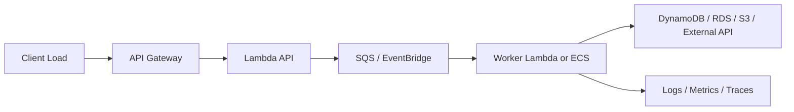

# Part 085 — Lab: Performance, Load Testing, and Scaling

A system that works for one request may fail under one thousand.

A system that works under load may become too expensive.

A system that scales compute may overload its database.

A system that drains a queue quickly may violate downstream rate limits.

Performance engineering is not simply making things faster.

It is designing a system that:

```txt
meets latency and throughput goals
protects downstream dependencies
keeps cost within unit economics
degrades safely under overload
and is observable while doing so
```

This lab applies to both:

- Part 081 pure serverless document processing platform;
- Part 082 hybrid API + SQS + Fargate worker platform.

You will build load tests, scaling models, dashboards, and tuning runbooks.

---

## 1. Lab Goals

By the end, you should be able to answer:

- How many requests per second can the API handle?
- What is p95/p99 latency?
- What causes cold starts?
- What is the safe Lambda concurrency?
- How fast does the SQS queue drain?
- What is the maximum safe ECS worker task count?
- What is the downstream database/API capacity?
- How does backlog behave during spike?
- What happens when load exceeds capacity?
- What is cost per successful business operation?
- Which knob should be changed first under pressure?
- Which scaling decision is dangerous?

This lab is deliberately practical.

You will build measurable capacity envelopes.

---

## 2. Performance Mental Model

Performance is a chain.



The chain capacity is not equal to the largest service capacity.

It is constrained by the bottleneck.

```txt
workflow capacity = min(front door, compute, queue drain, state store, downstream, cost budget)
```

Serverless can scale very fast.

Your dependencies may not.

That is why performance testing must include the whole workflow.

---

## 3. Define Performance SLOs

Before load testing, define targets.

### API SLO

```txt
99% of POST /reports requests return 202 Accepted within 800ms
while accepting up to 200 RPS for 10 minutes.
```

### Document Processing SLO

```txt
95% of valid documents are processed within 5 minutes
under a burst of 10,000 uploads/hour.
```

### Queue Worker SLO

```txt
Report job queue age p95 stays below 10 minutes
during 5,000 report jobs/hour.
```

### Cost SLO

```txt
Cost per generated report remains below $0.05 at target load,
excluding external paid provider costs.
```

### Reliability SLO

```txt
DLQ remains zero for valid load tests.
Duplicate side effect count remains zero.
```

Do not run a load test without success criteria.

Otherwise, every result is ambiguous.

---

## 4. Capacity Inventory

Create a capacity inventory.

```yaml
api:
  expected_rps: 200
  peak_rps: 500
  timeout_ms: 5000

lambda_api:
  reserved_concurrency: 200
  memory_mb: 1024
  p95_duration_ms: 120

sqs_job_queue:
  target_queue_age_seconds: 600
  visibility_timeout_seconds: 900
  max_receive_count: 5

ecs_worker:
  min_tasks: 2
  max_tasks: 50
  jobs_per_task: 1
  avg_job_duration_seconds: 120

dynamodb:
  mode: on_demand
  hot_key_risk: tenant-heavy

external_provider:
  max_safe_concurrency: 20
  p95_latency_ms: 700
  rate_limit_per_second: 50
```

Capacity inventory prevents random scaling.

---

## 5. Load Test Types

Use multiple load profiles.

### Smoke Load

Small traffic to verify path.

```txt
10 requests/minute for 5 minutes
```

### Baseline Load

Normal expected load.

```txt
100 RPS for API
500 jobs/hour for worker
```

### Peak Load

Expected peak.

```txt
500 RPS for 30 minutes
10,000 queued jobs
```

### Spike Load

Sudden burst.

```txt
0 -> 1000 RPS in 1 minute
```

### Soak Load

Sustained traffic.

```txt
target load for 4–24 hours
```

### Stress Load

Push until degradation.

```txt
increase until p99 latency, throttles, backlog, or errors break SLO
```

### Failure Load

Load while dependency is slow/failing.

```txt
500 jobs while downstream latency increases 10x
```

Each profile teaches different behavior.

---

## 6. Load Test Tooling

You can use:

- k6;
- Artillery;
- Gatling;
- Locust;
- JMeter;
- custom Go/Java/Python load generator;
- distributed load test on AWS;
- Step Functions Distributed Map for controlled internal fanout;
- ECS/Fargate load generator;
- AWS Distributed Load Testing solution where appropriate.

### Tooling Requirements

Your load tool must capture:

- response status;
- latency percentiles;
- error codes;
- correlation IDs;
- request rate;
- payload mix;
- test run ID.

It should also emit test metadata:

```json
{
  "testRunId": "load-20260706-001",
  "scenario": "api-spike",
  "targetRps": 500,
  "environment": "staging"
}
```

All test-generated requests should carry:

```txt
x-test-run-id
x-correlation-id
```

Do not mix test traffic with production without clear labeling and approval.

---

## 7. API Load Test

Test `POST /reports` or `POST /cases/{caseId}/documents`.

### k6-Style Scenario

```javascript
import http from 'k6/http';
import { check, sleep } from 'k6';

export const options = {
  scenarios: {
    submit_reports: {
      executor: 'ramping-arrival-rate',
      startRate: 10,
      timeUnit: '1s',
      preAllocatedVUs: 100,
      maxVUs: 1000,
      stages: [
        { target: 100, duration: '5m' },
        { target: 300, duration: '10m' },
        { target: 500, duration: '10m' },
        { target: 0, duration: '2m' }
      ]
    }
  },
  thresholds: {
    http_req_failed: ['rate<0.01'],
    http_req_duration: ['p(95)<800', 'p(99)<1500']
  }
};

export default function () {
  const id = `${__VU}-${__ITER}-${Date.now()}`;
  const payload = JSON.stringify({
    reportType: 'monthly-summary',
    caseId: `case-${__VU}`,
    month: '2026-06'
  });

  const res = http.post(`${__ENV.BASE_URL}/reports`, payload, {
    headers: {
      'Content-Type': 'application/json',
      'Idempotency-Key': `test:${id}`,
      'x-correlation-id': `corr-${id}`,
      'x-test-run-id': __ENV.TEST_RUN_ID
    }
  });

  check(res, {
    'accepted': r => r.status === 202,
    'has job id': r => r.json('jobId') !== undefined
  });

  sleep(1);
}
```

### Measure

- API p50/p95/p99;
- API 4xx/5xx;
- Lambda duration;
- Lambda concurrent executions;
- Lambda throttles;
- DynamoDB latency/throttles;
- SQS send failures;
- job queue depth/age;
- log ingestion.

### Expected Behavior

For async submit API:

- API latency should remain low;
- queue backlog may grow;
- downstream worker load should not affect API too much unless state store is bottleneck;
- if backlog too high, API may intentionally reject/slow with documented overload policy.

---

## 8. Idempotency Under Load

Load tests must include duplicates.

Scenario:

```txt
5% of requests retry same idempotency key
1% reuse same key with different payload
```

Expected:

- duplicate same payload returns same result;
- conflicting payload returns 409;
- no duplicate jobs/messages/side effects;
- idempotency table latency acceptable;
- conditional check failures classified correctly.

### Duplicate Load Test

```txt
send original command
wait random 0–500ms
send same command same key
```

Measure:

- IdempotencyDuplicateCompleted;
- IdempotencyConflict;
- ConditionalCheckFailed by reason;
- duplicate job created count should be zero.

Performance without correctness is not success.

---

## 9. Lambda Scaling Test

For API and worker Lambdas, test:

- concurrent executions;
- throttles;
- duration;
- cold start rate;
- memory usage;
- p95/p99;
- provisioned concurrency spillover if used;
- downstream latency.

### Lambda Knobs

| Knob | Effect |
|---|---|
| memory | CPU/network allocation and cost/duration curve |
| timeout | max execution time and failure semantics |
| reserved concurrency | blast-radius cap |
| provisioned concurrency | cold start reduction with idle cost |
| SnapStart for Java where applicable | cold start reduction with compatibility constraints |
| batch size/window | queue/stream throughput and retry blast radius |
| event source max concurrency | downstream protection |

### Lambda SQS Scaling

For SQS event source mappings, AWS documents scaling behavior and maximum concurrency controls. The practical lab goal is not only “scale more,” but “scale safely.”

Test:

```txt
SQS queue with 10,000 messages
Lambda consumer with max concurrency 5, 20, 100
```

Measure:

- drain time;
- downstream errors;
- DLQ;
- Lambda throttles;
- cost;
- age of oldest message.

### Result Table

| Max Concurrency | Drain Time | Downstream Errors | DLQ | Cost | Verdict |
|---:|---:|---:|---:|---:|---|
| 5 | 40m | 0 | 0 | low | safe but slow |
| 20 | 12m | 0 | 0 | medium | good |
| 100 | 4m | high | 12 | high | unsafe |

The safest setting is not always the highest.

---

## 10. Lambda Memory Tuning

For each Lambda:

1. choose representative payloads;
2. test memory values;
3. measure duration and cost;
4. choose memory based on p95/cost/SLO;
5. verify under concurrency.

Example matrix:

| Memory MB | p95 Duration | Error | Relative Cost | Notes |
|---:|---:|---:|---:|---|
| 512 | 900ms | 0 | 1.0 | slow |
| 1024 | 430ms | 0 | 0.95 | good |
| 1769 | 250ms | 0 | 0.9 | best |
| 3008 | 220ms | 0 | 1.4 | faster but costly |

### Java-Specific Notes

Measure:

- init duration;
- handler duration;
- cold vs warm;
- classpath size;
- dependency initialization;
- SDK client reuse;
- SnapStart compatibility if used.

Do not blindly assign 10GB memory.

Measure.

---

## 11. ECS/Fargate Worker Scaling Test

For the hybrid lab, scale workers from SQS backlog.

AWS Application Auto Scaling documentation describes calculating SQS backlog per task by dividing approximate visible messages by number of ECS tasks. This is a useful target tracking metric.

### Backlog Per Task

```txt
backlog_per_task = ApproximateNumberOfMessagesVisible / RunningTaskCount
```

Target example:

```txt
target backlog per task = 5 messages/task
```

If visible messages = 500:

```txt
desired tasks ≈ 500 / 5 = 100
```

But cap at downstream capacity.

### Test Plan

1. Set worker max tasks = 5.
2. Enqueue 1,000 jobs.
3. Measure drain time and queue age.
4. Increase max tasks = 20.
5. Repeat.
6. Increase max tasks = 50.
7. Repeat.
8. Simulate downstream slow.
9. Verify max tasks does not overload dependency.

### Metrics

- SQS visible messages;
- age oldest;
- ECS desired/running tasks;
- CPU/memory;
- job duration;
- downstream latency;
- RDS connections;
- DLQ;
- cost.

### Acceptance

- queue age within SLO;
- no downstream saturation;
- no DLQ for valid jobs;
- stable task starts/stops;
- graceful shutdown works during scale-in.

---

## 12. Worker Internal Concurrency

Start with:

```txt
one job per task
```

Then evaluate internal concurrency.

### One Job Per Task

Pros:

- simpler visibility;
- simpler shutdown;
- easier resource sizing;
- easier debugging;
- better isolation.

Cons:

- more tasks;
- possible overhead;
- slower if jobs are I/O-bound.

### Multiple Jobs Per Task

Pros:

- better utilization for I/O-bound jobs;
- fewer tasks;
- less startup overhead.

Cons:

- complex shutdown;
- harder memory isolation;
- more difficult visibility extension;
- harder per-job metrics;
- one task failure may affect many jobs.

### Rule

Only add internal concurrency after proving one-job-per-task bottleneck and memory/CPU headroom.

---

## 13. Step Functions Load and Distributed Map

Step Functions can orchestrate high-scale workflows.

For large parallel datasets, AWS documents Distributed Map as a mode for large-scale parallel workloads, useful when input exceeds normal state payload limits, execution history would exceed limits, or concurrency above inline map behavior is needed.

### Test Scenarios

#### Standard Workflow Load

```txt
start 1,000 document workflows
measure start throttling, duration, task failures
```

#### Distributed Map

Input: S3 manifest of 10,000 object keys.

Workflow:

```txt
Distributed Map -> per-object processing child workflow/task
```

Measure:

- child workflow count;
- max concurrency;
- item failure rate;
- result writer;
- downstream load;
- cost.

### Guardrails

- cap max concurrency;
- use S3 references;
- set tolerated failure threshold only if business allows;
- monitor child failures;
- avoid overwhelming Lambda/DynamoDB/S3/external APIs.

Step Functions can fan out faster than your dependencies can handle.

---

## 14. SQS Backlog and Drain Math

For queue workers:

```txt
drain_rate = consumers × messages_per_consumer_per_second
```

If arrival rate > drain rate:

```txt
backlog grows
```

If arrival rate < drain rate:

```txt
backlog drains
```

### Example

```txt
arrival = 100 jobs/min
worker tasks = 10
avg job duration = 30s
jobs/task concurrency = 1
drain = 10 * (60/30) = 20 jobs/min
```

Backlog grows by:

```txt
80 jobs/min
```

Need either:

- more tasks;
- faster jobs;
- lower arrival;
- queue accepted backlog;
- async SLA adjustment;
- downstream increase.

### Queue Age

Queue depth alone is not enough.

Age of oldest message tells SLA risk.

A queue with 100,000 messages may be okay if drain is fast and SLA wide.

A queue with 10 messages may be bad if oldest age is 2 hours.

---

## 15. Downstream Capacity Test

Never load test compute alone.

Test downstream.

### DynamoDB

- conditional write latency;
- throttles;
- hot partition symptoms;
- GSI write pressure;
- transaction conflicts;
- retry amplification.

### RDS/Aurora

- connection count;
- query latency;
- lock waits;
- CPU;
- IOPS;
- pool saturation;
- RDS Proxy metrics.

### S3

- request rates;
- object size;
- KMS requests;
- download/upload latency;
- lifecycle/object count.

### External API

- rate limits;
- p95 latency;
- 429/500;
- timeout rate;
- circuit breaker behavior;
- idempotency key behavior.

### Acceptance

Compute must respect downstream safe capacity.

If downstream max concurrency is 20, do not scale consumers to 1,000.

---

## 16. Backpressure Policy

Define what happens when backlog is high.

Options:

### Accept and Queue

Good when:

- jobs are durable;
- delay acceptable;
- users can track status.

### Reject New Work

Return:

```http
503 Service Unavailable
Retry-After: 60
```

or domain-specific:

```txt
SYSTEM_BUSY
```

Good when:

- backlog exceeds business SLA;
- accepting more work worsens outage;
- work becomes stale.

### Degrade

Examples:

- lower-quality report;
- skip non-critical enrichment;
- disable notification;
- delay analytics.

### Prioritize

Examples:

- premium tenant queue;
- urgent jobs queue;
- separate queues per priority.

### Rule

Backpressure must be product decision, not accidental queue growth.

---

## 17. Overload Testing

Test overload deliberately.

Scenario:

```txt
send 5x expected load for 15 minutes
```

Expected:

- API throttles or returns safe overload response;
- queues grow but stay within retention/SLA where expected;
- worker concurrency caps;
- downstream not overloaded;
- DLQs not filled with valid jobs;
- alarms fire;
- system recovers after load stops.

### Failure Indicators

- unbounded retries;
- database saturation;
- Lambda account concurrency starvation;
- logs explode;
- cost anomaly;
- DLQ fills with valid jobs;
- API timeouts instead of controlled 429/503;
- workers die due memory;
- queue age remains high after recovery.

Overload behavior is part of the design.

---

## 18. Cold Start Testing

For Lambda APIs:

Measure:

- cold start rate;
- init duration;
- handler duration;
- p99 latency;
- impact of memory;
- impact of dependency size;
- provisioned concurrency;
- SnapStart where applicable;
- VPC attachment impact.

### Test

1. Deploy new version.
2. Invoke with concurrency spike.
3. Capture init duration from logs.
4. Compare with warm path.
5. Tune.

### Cold Start Controls

- reduce dependency bloat;
- initialize SDK clients outside handler;
- lazy load heavy dependencies only if needed;
- avoid unnecessary VPC;
- use SnapStart for Java where compatible;
- use provisioned concurrency for latency-critical APIs;
- keep handlers small.

### Decision

If API has strict p99 latency and traffic is bursty, test both:

```txt
SnapStart
provisioned concurrency
```

where supported and appropriate.

Do not guess.

---

## 19. Load Testing Async Workflows

Async load testing is different from API load testing.

You must wait for completion.

### Test Flow

1. Submit N jobs/documents.
2. Record `jobId/documentId`.
3. Poll status or query metrics.
4. Wait until terminal state.
5. Compute:
   - time to terminal state;
   - success rate;
   - DLQ count;
   - duplicate side effects;
   - queue age curve;
   - workflow duration;
   - cost.

### Output Metrics

```txt
submitted = 10000
completed = 9950
failed_permanent = 50
failed_retryable = 0
dlq = 0
p50_completion = 2m
p95_completion = 7m
p99_completion = 13m
duplicate_side_effects = 0
```

### Important

API success only means work accepted.

For async workflows, success means terminal business outcome.

---

## 20. Cost Under Load

Load tests should estimate unit cost.

Collect:

- API Gateway requests;
- Lambda invocations/duration;
- ECS task hours;
- Step Functions transitions;
- SQS requests;
- EventBridge events/matches;
- DynamoDB reads/writes;
- S3 requests/storage;
- CloudWatch log ingestion;
- KMS requests;
- NAT/data transfer;
- external provider usage.

### Unit Cost Formula

For report lab:

```txt
cost_per_report =
  total_test_cost / successful_reports
```

For document lab:

```txt
cost_per_document =
  total_test_cost / processed_documents
```

### Cost Trap Detection

During load test, watch:

- log ingestion spike;
- retry amplification;
- recursive S3 trigger;
- Step Functions state explosion;
- NAT traffic;
- excessive custom metrics;
- idle provisioned concurrency.

Performance success with unacceptable cost is not success.

---

## 21. Load Test Data Safety

Test data must not pollute production.

Rules:

- use staging/sandbox;
- tag every test request with `testRunId`;
- tenant ID uses `test-tenant-*`;
- S3 prefix uses `test-runs/{testRunId}/`;
- DynamoDB items include TTL;
- queues are drained after test;
- DLQs inspected and cleaned;
- external providers use sandbox mode;
- no real emails/SMS/payments;
- cleanup job exists.

### Cleanup Checklist

- DynamoDB test items expired/deleted;
- S3 test objects lifecycle/removed;
- queues empty;
- DLQs empty or evidence saved;
- Step Functions executions recorded;
- ECS desired count restored;
- provisioned concurrency restored;
- AppConfig flags restored;
- dashboards annotated.

---

## 22. Performance Dashboard

Create a dashboard with sections.

### API

- RPS;
- p50/p95/p99 latency;
- 4xx/5xx;
- throttles;
- Lambda concurrency;
- Lambda duration.

### Queue

- visible messages;
- not visible;
- age oldest;
- sent/received/deleted;
- DLQ.

### Worker

- Lambda/ECS concurrency;
- ECS running tasks;
- CPU/memory;
- job duration;
- success/failure.

### State

- DynamoDB latency/throttles;
- RDS connections/CPU/latency;
- S3 request/errors.

### Workflow/Event

- Step Functions started/succeeded/failed;
- EventBridge PutEvents failures;
- consumer queue age.

### Cost

- log ingestion;
- Lambda/ECS cost proxy;
- Step Functions transitions;
- S3/DynamoDB request volume.

Dashboard should show cause and effect on one page.

---

## 23. Tuning Runbook

When latency is high:

1. Identify where time is spent:
   - API Gateway;
   - Lambda init/handler;
   - queue waiting;
   - worker runtime;
   - downstream;
   - workflow transitions.
2. Check recent deployment/config.
3. Check cold start/init duration.
4. Check downstream latency.
5. Check throttles.
6. Check concurrency saturation.
7. Check log volume.
8. Tune one knob at a time.

### Common Knobs

| Symptom | First Knobs |
|---|---|
| API cold p99 high | memory, SnapStart, provisioned concurrency, dependency size |
| API throttles | reserved/account concurrency, API throttles, downstream cap |
| queue age high | worker concurrency, ECS max tasks, Lambda max concurrency, job duration |
| downstream overload | reduce concurrency, add queue, circuit breaker |
| high cost | logs, memory curve, ECS right-size, retries |
| DLQ under load | error classification, visibility timeout, timeout budgets |
| RDS saturation | pool size, reserved concurrency, worker max tasks |

### Rule

Do not change many knobs at once.

You will not know what worked.

---

## 24. Performance Anti-Patterns

### Anti-Pattern 1 — Load Testing Only API 202

Async work may fail later.

### Anti-Pattern 2 — Scaling Consumers to Max

Downstream melts.

### Anti-Pattern 3 — Queue Depth Without Age

SLA risk hidden.

### Anti-Pattern 4 — Memory Tuning Without Cost

Faster but more expensive.

### Anti-Pattern 5 — No Duplicate Load Test

Retries under load create duplicate jobs.

### Anti-Pattern 6 — Testing With Mocked Database Only

Bottleneck hidden.

### Anti-Pattern 7 — DEBUG Logs During Load

Log cost and latency distort result.

### Anti-Pattern 8 — No Cleanup

Test data becomes production debt.

### Anti-Pattern 9 — One Huge Step Functions Map With No Cap

Massive fanout overloads dependencies.

### Anti-Pattern 10 — Treating Throttles as Always Bad

Intentional throttling may protect system.

---

## 25. Lab Exercises

### Exercise A — API Ramp Test

- Run 10 -> 500 RPS.
- Measure latency/error.
- Identify first bottleneck.
- Tune Lambda/API settings.

### Exercise B — Lambda SQS Concurrency Sweep

- Enqueue 10,000 messages.
- Test max concurrency 5/20/100.
- Compare drain time and downstream health.

### Exercise C — Fargate Backlog Autoscaling

- Enqueue 1,000 jobs.
- Scale on backlog per task.
- Verify max tasks cap.
- Measure drain curve.

### Exercise D — Downstream Slow Test

- Add artificial dependency latency.
- Verify backlog grows safely.
- Verify no retry storm.
- Verify alarms.

### Exercise E — Step Functions Fanout Test

- Process S3 manifest with Distributed Map or controlled Map.
- Cap concurrency.
- Measure child failures and cost.

### Exercise F — Cost Per Operation

- Run 1,000 complete workflows.
- Estimate cost per success.
- Identify top cost drivers.

---

## 26. Production Readiness Checklist

### SLOs

- [ ] API latency target.
- [ ] Async completion target.
- [ ] Queue age target.
- [ ] Error/DLQ target.
- [ ] Cost per operation target.

### Load Tests

- [ ] Smoke.
- [ ] Baseline.
- [ ] Peak.
- [ ] Spike.
- [ ] Soak.
- [ ] Stress.
- [ ] Failure load.

### Scaling

- [ ] Lambda reserved concurrency.
- [ ] SQS event source max concurrency.
- [ ] ECS min/max tasks.
- [ ] Backlog per task metric.
- [ ] Step Functions Map concurrency.
- [ ] Downstream capacity cap.

### Observability

- [ ] Performance dashboard.
- [ ] Queue age alarms.
- [ ] DLQ alarms.
- [ ] Throttle alarms.
- [ ] Cost/log alarms.
- [ ] Test run ID in logs.

### Safety

- [ ] Test data isolated.
- [ ] Cleanup automated.
- [ ] External providers sandboxed.
- [ ] No production test without approval.
- [ ] Rollback controls known.

---

## 27. Final Mental Model

Performance engineering is not making AWS services scale.

AWS services already scale in many dimensions.

The hard part is making your workflow scale correctly:

```txt
without duplicate side effects
without overloading dependencies
without invisible backlog
without runaway cost
without losing observability
without manual guessing during incidents
```

A top-tier engineer does not ask:

> “How much traffic can Lambda/ECS handle?”

They ask:

> “At what load does this business workflow violate latency, backlog, cost, or correctness SLOs, what is the first bottleneck, and which safe control prevents overload?”

That is performance and scaling engineering.

---

## References

- AWS Lambda Developer Guide: concurrency and SQS event source scaling
- Amazon SQS Developer Guide: visibility timeout, long polling, DLQs, and redrive
- Application Auto Scaling documentation: SQS backlog per ECS task
- Amazon ECS Developer Guide: service auto scaling
- AWS Step Functions Developer Guide: Distributed Map state
- AWS Well-Architected Framework: Performance Efficiency and Cost Optimization pillars
