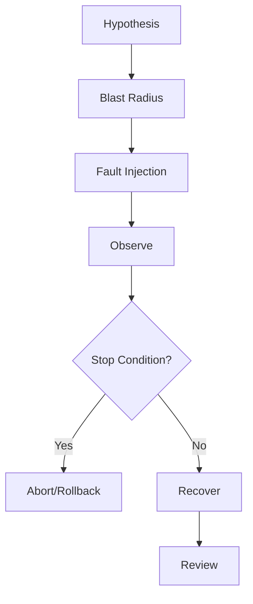

# Part 086 — Lab: Reliability, Fault Injection, and Game Days

Reliability is not proven by architecture diagrams.

Reliability is proven when the system survives controlled failure.

This lab turns the reliability concepts from Part 072 into practical drills for:

- Lambda APIs;
- SQS event source mappings;
- ECS/Fargate workers;
- Step Functions workflows;
- EventBridge fanout;
- S3 object pipelines;
- DynamoDB/RDS state stores;
- external dependencies;
- DLQs and redrive;
- deployment rollback;
- operator runbooks.

You will design fault experiments with:

- clear hypothesis;
- bounded blast radius;
- stop conditions;
- observability;
- rollback;
- post-drill review.

AWS Fault Injection Service is the main AWS-native tool for some experiments, but not every drill needs FIS. Some drills are performed by controlled configuration, synthetic messages, dependency simulators, or staging experiments.

---

## 1. Lab Goal

By the end, you should have a tested reliability program.

It should prove:

- duplicate commands do not create duplicate side effects;
- queue backlog is visible and recoverable;
- DLQs are alarmed and redrive-safe;
- Lambda errors trigger retry/failure paths correctly;
- ECS/Fargate worker failures do not lose messages;
- Step Functions catch/retry/compensation paths work;
- EventBridge target failures are detectable;
- S3 recursive triggers are prevented;
- downstream failures degrade safely;
- deployment rollback works;
- on-call runbooks are executable.

The goal is not to break the system randomly.

The goal is to validate specific reliability hypotheses.

---

## 2. Chaos Engineering Mental Model

A chaos experiment has structure.



### Good Hypothesis

```txt
If 10% of ObjectValidator Lambda invocations fail for 10 minutes,
SQS will retry failed messages,
valid documents will eventually process,
object DLQ will remain below threshold,
and alarms will fire within 5 minutes.
```

### Bad Hypothesis

```txt
Let's see what happens if we break Lambda.
```

Reliability experiments are engineering tests, not drama.

---

## 3. Experiment Safety Rules

Before running any experiment:

- define scope;
- run in non-prod first;
- identify owner;
- define start/end time;
- define stop conditions;
- verify dashboards;
- verify alarms;
- verify rollback;
- notify on-call;
- avoid real customer side effects unless explicitly approved;
- tag all synthetic traffic;
- preserve evidence;
- write post-drill review.

### Stop Conditions

Examples:

```txt
duplicate payment/report/document count > 0
DLQ depth > 100
API 5xx > 5% for 5 minutes
queue age > 30 minutes
RDS CPU > 85% for 10 minutes
external provider error > threshold
manual abort by incident commander
```

Stop conditions make chaos safe.

---

## 4. AWS Fault Injection Service Overview

AWS Fault Injection Service is a managed service for running fault injection experiments on AWS workloads.

AWS FIS supports actions for multiple resource types. AWS documentation includes Lambda function actions and ECS task actions. Lambda actions can target Lambda function ARNs and include `invocationPercentage` to inject faults into a fraction of invocations. ECS task actions can inject faults into ECS tasks, and AWS documentation states EC2 and Fargate capacity types are supported for ECS task actions.

Use FIS when you want:

- managed experiment templates;
- stop conditions;
- controlled targets;
- repeatable experiments;
- integration with AWS resource tags;
- fault injection for Lambda/ECS/EC2/network-like scenarios depending service support.

Do not use FIS as a substitute for idempotency, DLQ, or runbook design.

FIS tests whether your design works.

---

## 5. Experiment Catalog

Create experiment catalog.

```yaml
experiments:
  - id: lambda-object-validator-error
    target: ObjectValidator Lambda
    failure: injected exception/latency
    env: staging
    frequency: monthly
    owner: document-platform
  - id: ecs-worker-task-kill
    target: report-worker ECS tasks
    failure: stop task / CPU / network where supported
    env: staging
    frequency: monthly
    owner: report-platform
  - id: sqs-poison-message
    target: report-job-queue
    failure: malformed message
    env: staging
    frequency: monthly
  - id: eventbridge-target-deny
    target: audit rule/queue
    failure: target permission denial in test
    env: staging
  - id: downstream-timeout
    target: external provider simulator
    failure: latency/5xx
    env: staging
```

Every experiment should have:

- hypothesis;
- expected metrics;
- runbook;
- cleanup;
- evidence links.

---

## 6. Drill A — Lambda API Dependency Timeout

### Scenario

API Lambda calls a dependency that becomes slow.

### Hypothesis

```txt
If dependency latency exceeds client timeout budget,
the Lambda will fail fast before its own timeout,
return safe 503,
not start irreversible side effects,
and emit DependencyTimeout metric.
```

### Injection

Use a fake dependency endpoint in staging.

Set it to sleep longer than configured timeout.

### Expected

- API returns 503/504 with stable error envelope;
- Lambda does not hit hard timeout;
- no job/state created if side effect not safe;
- metric `DependencyTimeout` increments;
- logs include errorCode;
- alarm if threshold exceeded.

### Failure

If Lambda times out at platform timeout:

- side effect may be ambiguous;
- idempotency may be incomplete;
- user receives poor error;
- retry behavior unclear.

### Fix

- shorter HTTP client timeout;
- remaining-time budget guard;
- idempotency before side effects;
- circuit breaker/kill switch.

---

## 7. Drill B — Lambda SQS Consumer Failure

### Scenario

Inject failures into SQS-triggered Lambda consumer.

### Hypothesis

```txt
If 10% of consumer invocations fail,
successful messages will not be retried when partial batch response is used,
failed messages will retry,
DLQ remains below threshold,
and queue age stays under SLO.
```

### Injection Options

- FIS Lambda action targeting consumer function;
- feature flag to fail selected messages;
- synthetic messages that cause controlled retryable error.

### Expected

- partial batch response returns failed message IDs;
- successful messages deleted;
- retry count visible;
- queue age may rise but stays bounded;
- DLQ only for poison/permanent after threshold;
- alarm fires if SLO breached.

### Observability

Track:

- Lambda errors;
- batch item failures;
- queue visible/not visible;
- age oldest;
- DLQ depth;
- duplicate side effects.

### Recovery

- disable failure flag or stop FIS experiment;
- verify queue drains;
- redrive DLQ only after fix.

---

## 8. Drill C — Poison Message to DLQ

### Scenario

Send malformed SQS message.

### Hypothesis

```txt
Permanent invalid message is isolated in DLQ or quarantine,
does not block valid messages,
and operator can inspect and classify it.
```

### Steps

1. Send malformed message with `testRunId`.
2. Consumer fails/classifies permanent.
3. Message reaches DLQ or quarantine state.
4. Alarm fires.
5. Runbook inspection works.
6. Valid messages continue processing.

### Expected

- DLQ depth > 0;
- poison message contains enough metadata;
- valid messages unaffected;
- runbook tells operator not to blindly redrive.

### Common Failure

Consumer retries poison message endlessly, causing queue age and cost spike.

---

## 9. Drill D — ECS/Fargate Worker Task Killed

### Scenario

ECS/Fargate worker dies while processing message.

### Hypothesis

```txt
If a worker task stops during a job,
the SQS message will not be deleted,
visibility timeout will expire,
another worker will retry,
and idempotency/deterministic output will prevent duplicate harmful output.
```

### Injection

Options:

- stop ECS task manually in staging;
- use FIS ECS task action where appropriate;
- deploy controlled worker that exits after claiming job.

### Expected

- job may remain RUNNING temporarily;
- SQS message becomes visible after timeout;
- another worker claims/retries safely;
- output not duplicated incorrectly;
- queue age alarm if recovery slow;
- ECS service replaces task.

### Required Design

- delete message only after durable success;
- deterministic output key;
- conditional job state updates;
- graceful shutdown;
- visibility timeout appropriate.

### Recovery

- ensure ECS service healthy;
- inspect job state;
- if stale RUNNING, repair/retry using runbook.

---

## 10. Drill E — ECS Worker Downstream Slow

### Scenario

External provider or RDS becomes slow.

### Hypothesis

```txt
Worker timeout/backoff prevents runaway load,
SQS backlog absorbs delay,
ECS autoscaling does not exceed downstream-safe max,
and API remains responsive.
```

### Injection

- fake provider latency;
- reduce RDS capacity in non-prod;
- feature flag forcing dependency delay;
- network fault where safe.

### Expected

- job duration increases;
- queue age rises;
- worker task count caps;
- downstream not overloaded beyond safe threshold;
- DLQ does not fill with valid retryable work unless threshold exceeded;
- alarm fires.

### Dangerous Behavior

- autoscaling adds many tasks;
- more tasks call slow provider;
- provider gets worse;
- retry storm begins.

### Fix

- cap max tasks;
- circuit breaker;
- reduce concurrency;
- queue backlog policy;
- API overload response.

---

## 11. Drill F — Step Functions Task Failure

### Scenario

A workflow task fails with retryable and permanent errors.

### Hypothesis

```txt
Retryable error follows retry policy;
permanent error follows catch path;
workflow state is visible;
document/job status becomes FAILED or REJECTED;
and no duplicate side effects occur on redrive.
```

### Steps

1. Trigger workflow with input causing retryable failure.
2. Observe retries.
3. Trigger workflow with input causing permanent failure.
4. Observe catch path.
5. Verify state update.
6. Redrive/restart where appropriate.

### Expected

- execution history shows failed state;
- retry attempts bounded;
- catch path executed;
- alarms fire;
- status durable;
- event emitted only once if terminal.

### Common Failure

Task throws generic error for everything, causing retry of permanent invalid data.

---

## 12. Drill G — EventBridge Target Failure

### Scenario

EventBridge cannot deliver to target queue/consumer.

### Hypothesis

```txt
If EventBridge target delivery fails,
failed invocation metric/DLQ captures event,
alarm fires,
and producer success/failure is distinguishable from target delivery failure.
```

### Injection

In staging:

- misconfigure target queue policy temporarily;
- disable target permission;
- use test rule/target with intentional deny.

### Expected

- producer PutEvents may still succeed;
- EventBridge rule target delivery fails;
- target DLQ receives event if configured;
- failed invocations metric rises;
- runbook identifies rule/target permission.

### Lesson

Publishing event successfully does not mean every target processed it.

Event producer and target delivery are separate observability boundaries.

---

## 13. Drill H — Event Replay Duplicate Safety

### Scenario

Replay archived EventBridge events or re-send event fixtures.

### Hypothesis

```txt
Consumers process replayed events idempotently,
do not duplicate audit/notification/projection side effects,
and replay activity is visible.
```

### Steps

1. Process a normal event.
2. Replay/re-send same event.
3. Verify idempotency records.
4. Verify side effect count remains one.
5. Verify duplicate metric increments.

### Expected

- audit record not duplicated;
- notification not sent twice;
- projection upsert safe;
- logs show duplicate;
- no DLQ.

### Red Flag

Replay causes duplicate email/payment/audit.

Replay is not safe until fixed.

---

## 14. Drill I — S3 Recursive Trigger Prevention

### Scenario

Output object could trigger input processor.

### Hypothesis

```txt
Objects written to processed/ prefix are ignored,
do not start workflow,
and recursive trigger alarm remains quiet.
```

### Steps

1. Upload synthetic object to `processed/` prefix.
2. Or send synthetic S3 event for processed key.
3. Observe validator.

### Expected

- validator logs `IgnoredNonInputObject`;
- no workflow starts;
- metric increments;
- no queue loop.

### Failure

If workflow starts, immediately disable notification/event source and fix prefix/guard.

Recursive triggers can become cost incidents quickly.

---

## 15. Drill J — DynamoDB Conditional Conflict Storm

### Scenario

Many concurrent commands update same aggregate.

### Hypothesis

```txt
Only one valid state transition succeeds,
others fail as optimistic conflicts or duplicates,
and no corrupted final state appears.
```

### Steps

1. Send N concurrent commands for same resource/version.
2. Observe conditional writes.
3. Verify final state.
4. Verify conflict metrics.

### Expected

- exactly one transition success;
- conflicts classified;
- no retry storm;
- API returns 409/duplicate as appropriate;
- metrics distinguish expected conflict from service error.

### Purpose

This proves your state boundary.

---

## 16. Drill K — Deployment Rollback

### Scenario

Bad Lambda/ECS deployment causes errors.

### Hypothesis

```txt
Canary/rolling deployment detects failure,
rollback restores previous version,
and in-flight async work remains recoverable.
```

### Lambda Steps

1. Deploy version that fails test route/consumer.
2. Canary sends small traffic.
3. Alarm fires.
4. Alias rolls back.
5. Verify no DLQ growth beyond expected.

### ECS Steps

1. Deploy bad worker image.
2. Observe ECS deployment health/job failures.
3. Roll back task definition.
4. Verify queue drains.
5. Inspect failed jobs.

### Expected

- rollback time within target;
- version visible in logs;
- no data corruption;
- failed messages recoverable.

---

## 17. Drill L — Config/Kill Switch

### Scenario

Feature flag disables unsafe path.

### Hypothesis

```txt
When notification kill switch is disabled,
NotificationConsumer stops external sends,
acknowledges or parks events according to design,
and audit/search consumers continue.
```

### Steps

1. Set AppConfig flag `notificationsEnabled=false`.
2. Send `ReportGenerated` event.
3. Verify no notification sent.
4. Verify audit still works.
5. Restore flag.

### Expected

- config version logged;
- notification skipped metric;
- no errors;
- no DLQ.

### Lesson

Kill switch must work during incident, not only during normal operations.

---

## 18. Drill M — Secret Rotation Failure

### Scenario

A rotated secret breaks provider authentication.

### Hypothesis

```txt
Authentication failures trigger secret refresh and bounded retry;
if still failing, consumer backs off/DLQ according to policy;
secret value is never logged.
```

### Steps

1. In staging, rotate or swap provider secret to invalid value.
2. Trigger provider call.
3. Observe refresh behavior.
4. Restore valid secret.
5. Verify recovery.

### Expected

- auth error metric;
- secret refresh log without value;
- no secret in logs;
- queue backlog/DLQ according to policy;
- recovery after restore.

### Fix If Fails

- shorter cache TTL;
- refresh on auth failure;
- rotation grace window;
- better secret version observability.

---

## 19. Drill N — KMS Access Denied

### Scenario

Runtime cannot decrypt required secret/object/message.

### Hypothesis

```txt
KMS denial is detected as security/config failure,
not retried indefinitely as generic application error,
and runbook identifies key policy/IAM issue.
```

### Steps

In non-prod:

1. Remove KMS permission from test role or use wrong key.
2. Invoke function/worker.
3. Observe error classification.
4. Restore permission.

### Expected

- errorCode `KMS_ACCESS_DENIED`;
- alarm/log;
- no secret/object content logged;
- retries bounded;
- DLQ/quarantine where appropriate.

---

## 20. Drill O — Multi-Consumer Isolation

### Scenario

Notification consumer fails while audit and projection should continue.

### Hypothesis

```txt
Because each consumer has its own SQS queue,
notification failure does not block audit or projection.
```

### Steps

1. Force NotificationConsumer to fail.
2. Publish `DocumentProcessed` or `ReportGenerated`.
3. Verify NotificationQueue backlog/DLQ.
4. Verify AuditConsumer succeeds.
5. Verify ProjectionConsumer succeeds.

### Expected

- one consumer unhealthy;
- other consumers healthy;
- EventBridge fanout continues;
- alarm targeted to notification owner.

This proves per-consumer queues are not overengineering.

---

## 21. Game Day Design

A game day is a coordinated reliability exercise.

### Roles

- facilitator;
- system owner;
- on-call engineer;
- observer/scribe;
- incident commander if production-like;
- security representative if relevant.

### Agenda

```txt
1. review hypothesis and stop conditions
2. verify dashboards/alarms
3. inject fault
4. observe detection
5. execute runbook
6. recover
7. review evidence
8. create action items
```

### Artifacts

- experiment template;
- dashboard link;
- logs queries;
- runbook;
- timeline;
- metrics snapshot;
- findings/action items.

### Rule

Game day result is not pass/fail only.

It is learning.

---

## 22. Resilience Scorecard

Score each workflow after drills.

| Capability | Evidence |
|---|---|
| duplicate safety | duplicate drill passed |
| retry policy | retry drill passed |
| DLQ handling | DLQ drill and redrive tested |
| backlog protection | backpressure drill passed |
| deployment rollback | rollback drill passed |
| dependency failure | timeout/slow drill passed |
| workflow catch | Step Functions failure drill passed |
| event replay | duplicate replay safe |
| observability | correlation and alarms proved |
| operator readiness | runbook executed successfully |

### Example Score

```yaml
workflow: report-generation
score:
  duplicate_safety: 2
  dlq_handling: 2
  backlog_protection: 1
  rollback: 2
  dependency_failure: 1
  replay_safety: 2
actions:
  - add backlog-based API overload response
  - reduce worker max tasks during provider outage
  - add KMS denial runbook
```

Scorecard should drive improvement backlog.

---

## 23. Evidence Collection

For every drill, collect:

- start/end time;
- test run ID;
- fault injected;
- resource ARNs;
- deployment/config versions;
- dashboard screenshots/links;
- logs query links;
- alarm timestamps;
- DLQ message IDs;
- Step Functions execution ARNs;
- ECS task ARNs;
- recovery actions;
- observed vs expected;
- action items.

Do not rely on memory.

Evidence makes reliability program real.

---

## 24. Recovery Patterns

### Pause Damage

- set Lambda reserved concurrency to 0;
- disable event source mapping;
- disable EventBridge rule;
- set ECS desired count to 0;
- turn off feature flag;
- block API route/client;
- stop Step Functions starts.

### Preserve Evidence

- sample DLQ messages;
- export logs;
- record failed executions;
- store event IDs;
- capture deployment version.

### Repair

- fix code/config/IAM;
- deploy;
- verify with one event/job;
- redrive small batch;
- scale redrive;
- reconcile state.

### Resume

- restore concurrency;
- enable mapping/rule;
- scale workers;
- monitor.

### Review

- update runbook;
- add alarm/test;
- remove root cause.

---

## 25. Redrive Safety Procedure

Before redrive:

1. Identify bug fixed.
2. Confirm idempotency.
3. Sample DLQ messages.
4. Classify permanent vs retryable.
5. Redrive one message.
6. Verify side effects.
7. Monitor downstream.
8. Redrive small batch.
9. Continue gradually.
10. Stop on error spike.

Never redrive a full DLQ blindly.

### Redrive Decision Matrix

| Message Type | Redrive? |
|---|---|
| transient dependency failure | yes after dependency recovered |
| schema bug fixed | yes after consumer supports schema |
| permanent invalid request | no, quarantine/audit |
| duplicate already completed | safe if idempotency works |
| unknown error | sample and classify first |

---

## 26. Fault Injection With FIS: Template Elements

A FIS experiment template needs:

- description;
- targets;
- actions;
- stop conditions;
- role;
- tags;
- logs if configured.

Conceptual shape:

```yaml
description: inject 10 percent Lambda invocation errors into object validator
targets:
  objectValidator:
    resourceType: aws:lambda:function
    selectionMode: ALL
    resourceArns:
      - arn:aws:lambda:region:account:function:object-validator:staging
actions:
  injectError:
    actionId: aws:lambda:invocation-error
    parameters:
      invocationPercentage: "10"
      duration: PT10M
stopConditions:
  - source: aws:cloudwatch:alarm
    value: ObjectQueueAgeHigh
```

Actual action IDs/parameters must match current AWS FIS documentation for your Region and service support.

Always validate in non-prod.

---

## 27. Fault Injection Without FIS

Some drills are simpler without FIS.

### Feature Flag Faults

```txt
FAIL_OBJECT_VALIDATOR_PERCENT=10
DOWNSTREAM_LATENCY_MS=2000
FORCE_NOTIFICATION_FAILURE=true
```

Use only in non-prod or controlled prod with strong guardrails.

### Synthetic Poison Messages

Send malformed messages directly to test queues.

### IAM/KMS Deny

Use separate test role/resource, not production-wide change.

### Dependency Simulator

Run a fake provider service that returns:

- timeout;
- 429;
- 500;
- malformed response;
- slow success.

### Deployment Fault

Deploy intentionally failing version to staging.

FIS is a tool, not the only way to test reliability.

---

## 28. Runbook Test Checklist

For each runbook:

- [ ] Can on-call find it from alarm?
- [ ] Does it identify owner?
- [ ] Does it show dashboard/log links?
- [ ] Does it list safe first actions?
- [ ] Does it preserve evidence?
- [ ] Does it distinguish retryable/permanent?
- [ ] Does it include rollback?
- [ ] Does it include redrive procedure?
- [ ] Does it include stop conditions?
- [ ] Was it executed in a drill?
- [ ] Was it updated after drill?

A runbook that has never been executed is a draft.

---

## 29. Common Anti-Patterns

### Anti-Pattern 1 — Chaos Without Hypothesis

Random outage, little learning.

### Anti-Pattern 2 — No Stop Conditions

Experiment becomes incident.

### Anti-Pattern 3 — DLQ Drill Without Redrive Test

You know messages arrive but not how to recover.

### Anti-Pattern 4 — Dependency Failure Test With Mocked Success Path

Failure semantics remain unknown.

### Anti-Pattern 5 — Redrive Before Fix

You repeat the incident.

### Anti-Pattern 6 — Production Game Day Without Non-Prod Rehearsal

Avoidable risk.

### Anti-Pattern 7 — Fault Injection Without Observability

You cannot see whether system behaved correctly.

### Anti-Pattern 8 — Testing Only Technical Metrics

Business duplicates, stale jobs, and missed audit events ignored.

### Anti-Pattern 9 — No Evidence Retention

Postmortem becomes opinion.

### Anti-Pattern 10 — Action Items Not Tracked

Same failure repeats.

---

## 30. Lab Completion Criteria

The lab is complete when:

- at least one Lambda fault experiment passed;
- at least one ECS/Fargate worker failure drill passed;
- one poison message reached DLQ and was inspected;
- one redrive was performed safely;
- one Step Functions retry/catch path was tested;
- one EventBridge target failure was detected;
- one dependency timeout test passed;
- one deployment rollback test passed;
- alarms fired and linked to runbooks;
- evidence was captured;
- action items were created and tracked.

Reliability is not declared.

It is demonstrated.

---

## 31. Final Mental Model

Reliability is operational proof.

The system is reliable when:

```txt
known failures are detected,
damage is bounded,
state remains correct,
side effects are idempotent,
evidence is preserved,
operators know what to do,
and recovery has been practiced.
```

A top-tier engineer does not ask:

> “Do we have DLQs and retries?”

They ask:

> “When we injected the realistic failure, did the right alarm fire, did the runbook work, did redrive avoid duplicate harm, and did the system return to SLO?”

That is reliability and game-day engineering.

---

## References

- AWS Fault Injection Service documentation
- AWS FIS documentation: Lambda function actions
- AWS FIS documentation: ECS task actions
- AWS Lambda Developer Guide: retry behavior and event source mappings
- Amazon SQS Developer Guide: DLQs, redrive, and visibility timeout
- AWS Step Functions Developer Guide: retries, catch, and redrive
- Amazon EventBridge User Guide: targets, DLQs, archives, and replay
- AWS Well-Architected Framework: Reliability Pillar
