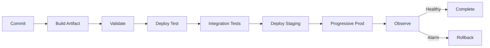
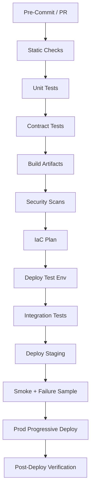

# Part 087 — Lab: CI/CD, IaC, and Progressive Delivery

A production serverless/container platform is only as safe as its release process.

You can build a good architecture and still break production with:

- direct deploy to `$LATEST`;
- mutable container image tag;
- EventBridge rule pattern mistake;
- SQS visibility timeout regression;
- IAM wildcard expansion;
- Lambda environment variable typo;
- Step Functions definition change that breaks in-flight tasks;
- ECS worker image with bad dependency;
- missing rollback target;
- config change outside IaC;
- migration deployed in wrong order.

This lab builds a release system for the architectures from Parts 081–086.

The goal is not to use one specific CI/CD product.

The goal is to establish release invariants that hold whether you use:

- GitHub Actions;
- GitLab CI;
- AWS CodePipeline;
- Jenkins;
- Buildkite;
- ArgoCD;
- Spinnaker;
- internal platform tooling.

The release contract matters more than the brand.

---

## 1. Release Engineering Mental Model

A safe production release is a state transition.



The pipeline must prove:

```txt
what changed
who changed it
what artifact was built
what policy checks passed
what tests passed
what version is serving traffic
what rollback target exists
what alarms protect deployment
```

A deploy is not done when CloudFormation finishes.

It is done when the new behavior is serving safely and rollback is still possible.

---

## 2. Lab Scope

You will build CI/CD for two workload types.

### Serverless Document Platform

From Part 081:

```txt
API Gateway
Lambda functions
S3/SQS
Step Functions
EventBridge
DynamoDB
AppConfig
```

### Hybrid Report Platform

From Part 082:

```txt
API Gateway
Lambda API functions
SQS job queue
ECS/Fargate worker
ECR image
DynamoDB/S3
EventBridge
Lambda consumers
```

### Pipeline Requirements

- build once, deploy many;
- immutable artifacts;
- Lambda versions/aliases;
- ECS image digest;
- IaC plan/diff;
- static policy checks;
- unit/contract/integration tests;
- deployment gates;
- canary/linear/rolling/blue-green strategy;
- alarms tied to rollback;
- migration ordering;
- rollback drills;
- deployment evidence.

---

## 3. Repository Strategy

Choose monorepo or multi-repo deliberately.

### Monorepo

Good when:

- one platform/workload;
- shared contracts/libraries;
- coordinated releases;
- small/medium team.

Risks:

- large pipeline;
- unnecessary redeploys;
- ownership conflicts.

### Multi-Repo

Good when:

- independent services/teams;
- separate release cadence;
- clearer ownership;
- platform modules shared via package registry.

Risks:

- contract drift;
- cross-repo release ordering;
- duplicated pipeline logic.

### Recommended Lab Structure

```txt
platform/
├── infra/
│   ├── stacks/
│   ├── modules/
│   └── policies/
├── lambdas/
├── ecs-workers/
├── contracts/
├── tests/
├── runbooks/
├── dashboards/
└── .github/workflows/ or ci/
```

Contracts should be versioned close to code.

Runbooks should be versioned close to service.

IaC should define operational resources, not only compute.

---

## 4. Artifact Strategy

Build artifacts once.

Promote the same artifact across environments.

### Lambda ZIP Artifact

Record:

```txt
function
git commit
build id
artifact checksum
dependency lock hash
runtime
architecture
signing status
```

### Lambda Container Image

Record:

```txt
ECR digest
git commit
base image digest
SBOM
scan result
```

### ECS/Fargate Image

Deploy by digest:

```txt
123456789012.dkr.ecr.ap-southeast-1.amazonaws.com/report-worker@sha256:...
```

Not:

```txt
report-worker:latest
```

### Step Functions Definition

Record:

```txt
state machine definition hash
task function aliases
integration resources
version/alias if used
```

### IaC Artifact

Record:

```txt
template/module version
plan/diff
policy check results
approvals
```

### Release Evidence

Store a deployment manifest:

```yaml
releaseId: rel-20260706-001
commit: abc123
lambda:
  create-upload:
    version: 42
    alias: prod
    artifactSha256: ...
ecs:
  report-worker:
    taskDefinition: report-worker:57
    imageDigest: sha256:...
stepFunctions:
  documentWorkflow:
    version: 12
eventSchemas:
  DocumentProcessed: 1.0
config:
  appConfigVersion: 43
```

This manifest is incident gold.

---

## 5. Pipeline Stages

A strong pipeline has explicit stages.



### PR Stage

- formatting/lint;
- unit tests;
- contract tests;
- IaC validation;
- policy-as-code;
- secret scanning;
- dependency scan;
- event pattern tests.

### Build Stage

- compile;
- package;
- generate SBOM;
- sign Lambda artifact if required;
- build container image;
- scan image;
- push to artifact registry/ECR;
- record digest/checksum.

### Test Environment

- deploy isolated stack;
- run integration tests;
- run deployed permission tests;
- run basic failure path tests;
- destroy or clean up.

### Staging

- production-like config;
- smoke tests;
- synthetic events;
- load sample;
- alarm validation.

### Production

- progressive rollout;
- monitor alarms;
- automatic/manual rollback;
- release evidence stored.

---

## 6. Static Checks and Policy-as-Code

Static checks catch unsafe changes before deployment.

### Required Checks

- no production Lambda uses `$LATEST`;
- Lambda aliases/versions defined;
- log retention set;
- critical queues have DLQ;
- SQS visibility timeout > Lambda timeout;
- EventBridge rules have owner tag;
- EventBridge target DLQ for critical targets;
- S3 buckets block public access;
- KMS decrypt not wildcard;
- IAM wildcard requires waiver;
- no secrets in environment variables;
- AppConfig validators exist for dynamic config;
- ECS task uses image digest in prod;
- ECS task role is not admin;
- ECS deployment circuit breaker enabled where rolling deployment used;
- DynamoDB PITR enabled for critical tables;
- Step Functions task ARNs point to aliases/versions where required.

### Example Policy Failure

```txt
FAIL: report-worker task role has Action="*" Resource="*"
FIX: scope permissions to SQS job queue, S3 artifact prefix, DynamoDB tables, EventBridge bus.
```

Policy failures must be actionable.

A guardrail that says only “AccessDenied” or “policy failed” is poor developer experience.

---

## 7. Lambda Progressive Delivery

Use Lambda versions and aliases.

Production invokes:

```txt
function:prod alias
```

not:

```txt
$LATEST
```

AWS Lambda aliases can point to function versions and support weighted routing between two versions. AWS Lambda documentation describes using CodeDeploy and AWS SAM for rolling deployments that gradually shift traffic to a new version.

### SAM DeploymentPreference

AWS SAM supports gradual deployments with `AutoPublishAlias` and `DeploymentPreference`. AWS SAM documentation describes using `AutoPublishAlias` to automatically create aliases, and `DeploymentPreference` to configure traffic shifting.

Conceptual SAM:

```yaml
CreateUploadFunction:
  Type: AWS::Serverless::Function
  Properties:
    AutoPublishAlias: live
    DeploymentPreference:
      Type: Canary10Percent5Minutes
      Alarms:
        - !Ref CreateUploadErrorAlarm
        - !Ref CreateUploadLatencyAlarm
      Hooks:
        PreTraffic: !Ref PreTrafficValidationFunction
        PostTraffic: !Ref PostTrafficValidationFunction
```

### Canary Requirements

- previous version exists;
- alias used by API/event sources;
- alarms represent real health;
- pre/post hooks test meaningful behavior;
- idempotency safe across versions;
- rollback alias known.

### Lambda Deployment Patterns

| Pattern | Use |
|---|---|
| all-at-once | low-risk internal function |
| canary | user-facing API/function |
| linear | gradual confidence |
| manual weighted shift | high-risk migrations |
| provisioned concurrency shift | latency-sensitive alias |

### Lab Exercise

1. Deploy version 1 of `CreateUpload`.
2. Configure alias `prod/live`.
3. Deploy version 2 with controlled failure for 10% of traffic.
4. Canary should alarm and rollback.
5. Verify alias points back to version 1.
6. Verify idempotent requests remain safe.

---

## 8. Lambda Pre-Traffic and Post-Traffic Hooks

Hooks are validation functions.

### Pre-Traffic Hook

Runs before shifting traffic.

Should verify:

- new version loads;
- required env vars exist;
- secret/config access works;
- simple synthetic request passes;
- IAM permissions exist;
- dependency reachable where safe.

### Post-Traffic Hook

Runs after some/all traffic shifted.

Should verify:

- new version receives traffic;
- metrics healthy;
- no DLQ growth;
- no critical business errors.

### Hook Anti-Patterns

Bad hook:

```txt
returns success without checking anything
```

Bad hook:

```txt
performs destructive production side effect
```

Good hook:

```txt
invokes safe synthetic path with test tenant and verifies expected response/state
```

Hooks should be fast, deterministic, and safe.

---

## 9. ECS/Fargate Deployment

ECS supports rolling deployments and blue/green deployment options.

Amazon ECS documentation describes rolling deployments where ECS replaces unhealthy tasks while maintaining minimum healthy percentage, and deployment circuit breaker behavior that detects failures in deployments. ECS blue/green deployment documentation describes blue/green as running two production environments and validating new service revisions before shifting production traffic.

### Rolling Deployment

Use for:

- simple worker service;
- low-risk changes;
- stateless service;
- quick rollback.

Controls:

- minimum healthy percent;
- maximum percent;
- health check grace period;
- deployment circuit breaker;
- rollback enabled;
- alarms.

### Blue/Green Deployment

Use for:

- user-facing service behind load balancer;
- high-risk deployment;
- need pre-production validation;
- traffic shift control;
- quick rollback.

### ECS Worker Deployment

For SQS polling workers, load balancer health does not prove job correctness.

You need:

- synthetic test job;
- queue processing metric;
- worker startup log;
- job success metric;
- DLQ check;
- deployment alarm.

### Lab Exercise

1. Deploy report-worker image v1.
2. Submit synthetic job.
3. Deploy v2 with controlled failure.
4. ECS deployment circuit breaker or custom alarm should fail/rollback.
5. Verify queue messages are not lost.
6. Redeploy fixed v3.
7. Verify backlog drains.

---

## 10. ECS Deployment Circuit Breaker

The ECS deployment circuit breaker can detect failed deployments and optionally roll back.

Use it for services where ECS can evaluate task health.

For worker services, task health might be “container running” while business processing is broken.

So combine:

- ECS circuit breaker;
- container health checks;
- CloudWatch alarms;
- synthetic job test;
- deployment bake time;
- rollback task definition.

### Health Check Design

Container health endpoint/check should test:

- process alive;
- config loaded;
- can poll queue if required;
- dependencies optional depending blast radius;
- not stuck in startup.

Do not make health check call a fragile downstream on every interval if that causes outage.

### Business Health

Separate from container health:

- job success rate;
- DLQ;
- queue age;
- worker error rate.

A container can be healthy while the workload is failing.

---

## 11. Step Functions Deployment

Step Functions definitions are release artifacts.

Changes can break:

- state input/output;
- retry/catch;
- task resources;
- timeouts;
- Map concurrency;
- service integration parameters.

### Safe Strategy

- validate ASL definition;
- test with sample inputs;
- deploy new version/alias where appropriate;
- route new executions to alias;
- keep task contracts backward compatible;
- understand in-flight execution behavior;
- rollback new starts to previous version/alias.

### Lab Exercise

1. Deploy workflow v1.
2. Start test execution.
3. Deploy workflow v2 with a changed task input.
4. Run contract test.
5. If task contract fails, deployment fails before prod.
6. Verify existing v1 execution behavior remains understood.

### Rule

Do not deploy workflow definition and task Lambda breaking changes in the wrong order.

Preferred order for incompatible change:

```txt
tasks support old and new input
workflow emits new input
old input support removed later
```

---

## 12. EventBridge Deployment

EventBridge rules are production routing logic.

Rule changes can:

- stop delivery;
- broaden delivery;
- create loops;
- route to wrong target;
- drop events due pattern mismatch;
- break target input transform.

### Event Rule Tests

Keep sample events:

```txt
events/DocumentProcessed.v1.json
events/DocumentRejected.v1.json
events/ReportGenerated.v1.json
events/ReportFailed.v1.json
```

Test expectations:

| Event | Rule | Expected |
|---|---|---|
| DocumentProcessed | audit rule | match |
| DocumentRejected | audit rule | match |
| ReportGenerated | document rule | no match |
| dev event | prod rule | no match |

### Deployment Process

1. deploy target queue/DLQ first;
2. deploy consumer;
3. deploy rule disabled if risky;
4. run pattern test;
5. enable rule;
6. publish synthetic event;
7. verify queue receives;
8. monitor target failures.

### Rollback

- disable rule;
- revert pattern;
- remove target;
- redrive missed events if archived/outbox exists.

---

## 13. SQS Deployment

SQS settings are operational behavior.

Risky changes:

- visibility timeout;
- max receive count;
- redrive policy;
- retention;
- FIFO/standard;
- encryption;
- queue policy;
- Lambda batch size;
- event source max concurrency.

### Pipeline Checks

- visibility timeout > consumer timeout;
- DLQ configured;
- max receive count > 1 and justified;
- retention meets recovery needs;
- event source max concurrency exists for downstream-limited consumers;
- queue policy scoped to sources;
- encryption configured based on data classification.

### Migration

Changing queue type or message contract is migration, not config tweak.

Use new queue and cutover when needed.

---

## 14. DynamoDB and Data Deployment

Data changes need expand/contract.

### Safe Phases

```txt
1. add new attribute/index/table
2. deploy writers to write both
3. backfill
4. deploy readers to read new
5. verify
6. remove old path
```

### Pipeline Gates

- GSI active before code queries it;
- backfill job complete;
- reconciliation passes;
- rollback still possible before contract phase;
- PITR/backups enabled for critical tables.

### Lab Exercise

Add a GSI for status queries.

1. Deploy table/index.
2. Wait until active.
3. Backfill attributes.
4. Deploy status query API.
5. Run integration test.
6. Remove old scan-based query.

This teaches safe data deployment.

---

## 15. AppConfig and Config Deployment

Configuration changes can break production without code changes.

Use AppConfig validators and deployment strategies.

### Pipeline

- schema validate JSON;
- semantic validate safe ranges;
- deploy to test;
- smoke test;
- gradual deployment to prod;
- monitor alarms;
- rollback config if alarm.

### Examples

Config:

```json
{
  "maxUploadBytes": 10485760,
  "notificationsEnabled": true,
  "workerMaxConcurrency": 20
}
```

Validation:

- `maxUploadBytes` <= platform max;
- `workerMaxConcurrency` <= downstream safe limit;
- boolean flags default safe;
- no unknown processor version.

### Lab Exercise

Deploy bad config in staging.

Expected:

- validator rejects;
- prod unchanged;
- pipeline fails before runtime.

---

## 16. Database/Workflow Migration Ordering

Many incidents come from wrong deployment order.

### Event Schema Change

Correct:

```txt
1. consumers support v1 and v2
2. producer emits v2
3. consumers stop v1 after usage zero
```

Wrong:

```txt
producer emits v2 first
consumers fail
```

### API Response Change

Correct:

```txt
additive field first
client adapts
old field deprecated later
```

### Worker Message Change

Correct:

```txt
worker supports old and new
producer sends new
old messages drain
remove old support
```

### Step Functions Task Input Change

Correct:

```txt
task supports old and new input
workflow sends new input
remove old support later
```

Write deployment order in migration plan.

---

## 17. Environment Strategy

Use separate environments.

```txt
dev
test
staging
prod
```

Better: separate AWS accounts.

### Promotion

Same artifact moves:

```txt
dev -> test -> staging -> prod
```

Config differs per environment.

Artifact does not.

### Environment Differences

Allowed:

- resource names;
- account IDs;
- Region;
- capacity/concurrency;
- feature flags;
- test vs prod secrets;
- log retention.

Not allowed:

- different code artifact built separately for prod;
- manual hotfix only in prod;
- prod-only IAM broad permission;
- no staging equivalent for critical path.

### Ephemeral Environments

For PRs, create ephemeral stacks when feasible.

Controls:

- names include PR/test run ID;
- TTL cleanup;
- budgets;
- restricted data;
- no real external side effects.

---

## 18. Deployment Observability

Every deployment should emit event:

```json
{
  "releaseId": "rel-20260706-001",
  "service": "report-worker",
  "environment": "prod",
  "artifact": "sha256:...",
  "version": "57",
  "deployedBy": "ci-role",
  "startedAt": "...",
  "completedAt": "...",
  "status": "SUCCESS"
}
```

Add dashboard annotations if tooling supports.

Logs should include:

- releaseId;
- function version;
- task definition revision;
- image digest;
- config version.

### Deployment Dashboard

- current versions;
- recent deployments;
- error/latency overlay;
- queue/DLQ overlay;
- config changes;
- rollback events.

When incident starts, first question is often:

```txt
What changed?
```

Deployment observability answers it.

---

## 19. Rollback Drills

Run rollback drills regularly.

### Lambda Rollback Drill

1. Deploy bad version to staging canary.
2. Alarm triggers.
3. Alias rolls back.
4. Verify previous version handles traffic.
5. Verify DLQ remains controlled.

### ECS Rollback Drill

1. Deploy bad image.
2. Health/business alarm triggers.
3. Roll back task definition.
4. Verify worker drains queue.
5. Verify no message lost.

### EventBridge Rollback Drill

1. Deploy bad rule pattern in test.
2. Synthetic event fails route.
3. Pipeline/test catches.
4. Revert pattern.
5. Replay/redrive if needed.

### Config Rollback Drill

1. Deploy bad AppConfig value in staging.
2. Validator or alarm catches.
3. Rollback config.
4. Verify functions reload safe version.

Rollback drills reveal missing assumptions.

---

## 20. Release Runbook

Every production deploy runbook should include:

```yaml
release:
  service:
  releaseId:
  artifact:
  migrationPhase:
preChecks:
  - dashboards healthy
  - downstream healthy
  - alarms enabled
  - rollback target known
  - data migration status
deployment:
  - deploy infra
  - run pre-traffic hook
  - shift traffic
  - monitor alarms
postChecks:
  - error rate
  - latency
  - queue age
  - DLQ
  - business metric
rollback:
  - lambda alias rollback
  - ecs task definition rollback
  - config rollback
  - event rule disable
  - data repair if needed
```

A release runbook should be executable under pressure.

---

## 21. CI/CD Security

Pipeline identity is powerful.

Controls:

- OIDC federation instead of long-lived keys;
- least-privilege deploy role;
- separate build and deploy roles;
- environment protection rules;
- approval for prod;
- artifact signing;
- image scanning;
- secret scanning;
- audit trail;
- deployment role cannot alter log archive/security account;
- `iam:PassRole` scoped;
- break-glass separate.

### CI/CD Anti-Pattern

```txt
GitHubActionsRole = AdministratorAccess
```

This is common and dangerous.

Treat pipeline roles as production identities.

---

## 22. Lab Implementation Steps

### Step 1 — Define Release Manifest

Create `release-manifest.json`.

### Step 2 — Add Static Checks

Use tool of choice.

Checks:

- IAM wildcard;
- S3 public;
- log retention;
- DLQs;
- Lambda alias;
- ECS image digest;
- queue visibility timeout;
- EventBridge rule owner.

### Step 3 — Build Lambda Artifacts

- package;
- test;
- sign if enabled;
- publish checksum.

### Step 4 — Build Container Image

- build;
- scan;
- SBOM;
- push to ECR;
- capture digest.

### Step 5 — Deploy Test Stack

- deploy IaC;
- run integration tests;
- run negative IAM test.

### Step 6 — Deploy Staging

- run smoke;
- run synthetic event/job;
- verify dashboards.

### Step 7 — Deploy Production Progressively

- Lambda canary/linear;
- ECS rolling/blue-green;
- Step Functions version/alias;
- EventBridge rules tested/enabled.

### Step 8 — Post-Deploy Verification

- metrics;
- logs;
- DLQs;
- queue age;
- cost/log anomaly;
- business outcomes.

### Step 9 — Store Evidence

- manifest;
- test results;
- approval;
- dashboard links;
- rollback result if any.

---

## 23. Common Anti-Patterns

### Anti-Pattern 1 — Deploying `$LATEST`

No immutable production identity.

### Anti-Pattern 2 — Mutable Container Tags

No stable rollback/provenance.

### Anti-Pattern 3 — IaC Only for Compute

Queues, alarms, dashboards, policies, and runbooks drift.

### Anti-Pattern 4 — Canary Without Real Alarms

Gradual outage.

### Anti-Pattern 5 — ECS Health Equals Business Health

Container running but worker failing jobs.

### Anti-Pattern 6 — Event Rule Untested

Production event routing broken by typo.

### Anti-Pattern 7 — Config Change Outside Pipeline

Invisible behavior change.

### Anti-Pattern 8 — Data Migration Big Bang

Rollback impossible.

### Anti-Pattern 9 — Prod Artifact Built Separately

Staging did not test prod artifact.

### Anti-Pattern 10 — Rollback Never Practiced

Rollback plan fails during incident.

---

## 24. Lab Checklist

### Artifact

- [ ] Lambda artifact checksum.
- [ ] Container image digest.
- [ ] SBOM.
- [ ] Scan result.
- [ ] Signing status.
- [ ] Release manifest.

### Tests

- [ ] Unit.
- [ ] Contract.
- [ ] Event pattern.
- [ ] Integration.
- [ ] Security negative.
- [ ] Smoke.
- [ ] Failure sample.

### Deployment

- [ ] Lambda alias/version.
- [ ] SAM/CodeDeploy or equivalent progressive deploy.
- [ ] ECS deployment circuit breaker or blue/green strategy.
- [ ] Step Functions version/alias strategy.
- [ ] EventBridge safe rollout.
- [ ] AppConfig validation/rollback.

### Operations

- [ ] Dashboards healthy before deploy.
- [ ] Alarms enabled.
- [ ] DLQs checked.
- [ ] Queue age checked.
- [ ] Release annotation/event.
- [ ] Rollback tested.

### Governance

- [ ] Policy-as-code passed.
- [ ] IAM diff reviewed.
- [ ] Cost tags present.
- [ ] Owner/runbook tags present.
- [ ] Exception/waiver tracked.

---

## 25. Final Mental Model

CI/CD is not automation for shipping faster only.

It is the system that preserves production invariants while shipping faster.

A production-grade release pipeline guarantees:

```txt
immutable artifacts
validated infrastructure
least-privilege changes
contract compatibility
progressive traffic shift
alarm-based rollback
deployment evidence
tested rollback
```

A top-tier engineer does not ask:

> “Did the pipeline pass?”

They ask:

> “Can we prove exactly what changed, why it was safe, which users/events received it, what alarm would stop it, and how to roll it back without corrupting state?”

That is CI/CD and progressive delivery engineering.

---

## References

- AWS Lambda Developer Guide: aliases and weighted alias routing
- AWS SAM Developer Guide: gradual deployments with AutoPublishAlias and DeploymentPreference
- AWS CodeDeploy User Guide: Lambda deployments and validation hooks
- Amazon ECS Developer Guide: rolling deployments, deployment circuit breaker, and blue/green deployments
- AWS Step Functions Developer Guide: versions and aliases
- Amazon EventBridge User Guide: rules, targets, archives, and replay
- AWS Well-Architected Framework: Operational Excellence pillar
