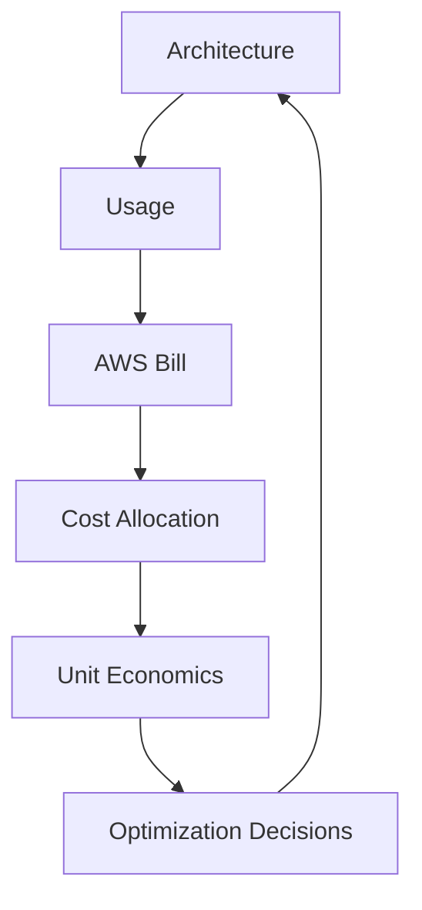

# Part 088 — Lab: FinOps, Cost Guardrails, and Unit Economics

Cost optimization is not a one-time cleanup.

It is an operating system.

For AWS containers and serverless, cost can move quickly because usage can scale quickly.

A small bug can create:

- millions of Lambda invocations;
- recursive S3 events;
- excessive Step Functions transitions;
- huge CloudWatch log ingestion;
- runaway EventBridge fanout;
- SQS redrive storm;
- NAT data processing spike;
- provisioned concurrency idle cost;
- ECS tasks running forever;
- DynamoDB scans;
- external provider spend;
- SMS/email duplicates.

This lab builds a FinOps operating model for serverless and hybrid workloads.

You will implement:

- cost allocation tags;
- cost dashboards;
- AWS Budgets;
- Cost Anomaly Detection;
- CUR/Data Exports + Athena analysis;
- ECS/EKS split cost allocation awareness;
- unit cost metrics;
- cost guardrails;
- load-test cost modeling;
- cost incident runbooks.

The goal is not simply “reduce cost.”

The goal is:

```txt
business-value-aware cost control without weakening reliability or security
```

---

## 1. FinOps Mental Model

FinOps connects engineering decisions to financial outcomes.



Serverless/container cost must be understood by workload.

Not only by AWS service.

Bad question:

```txt
Why is Lambda expensive?
```

Better question:

```txt
Which business workflow caused Lambda, logs, SQS, DynamoDB, EventBridge, and downstream cost to increase?
```

Best question:

```txt
What is cost per successful business operation, and what amplified it under failure?
```

---

## 2. Lab Scope

Apply FinOps to:

### Serverless Document Platform

Cost drivers:

- API Gateway requests;
- Lambda invocations/duration;
- S3 storage/requests;
- SQS queues;
- Step Functions transitions;
- DynamoDB reads/writes;
- EventBridge events/matches;
- CloudWatch logs/metrics/traces;
- KMS requests.

### Hybrid Report Platform

Cost drivers:

- API Gateway;
- Lambda submit/status/consumers;
- SQS job queue;
- ECS/Fargate task runtime;
- ECR storage/scanning;
- S3 artifacts;
- DynamoDB job/idempotency;
- EventBridge;
- CloudWatch logs;
- NAT/VPC endpoints;
- external provider;
- RDS/Aurora if used.

### Lab Deliverables

- tag policy;
- cost allocation tags activated;
- workload cost dashboard;
- Athena queries over cost data;
- budgets and alerts;
- anomaly monitors;
- unit cost metrics;
- cost optimization backlog;
- cost incident runbook.

---

## 3. Cost Allocation Tags

AWS documentation explains that cost allocation tags help organize and track AWS costs at detailed level after activation.

Define required tags.

```yaml
Service: document-platform
Owner: document-team
Environment: prod
CostCenter: cc-123
Application: case-management
Workload: document-processing
Criticality: high
DataClassification: confidential
ManagedBy: iac
```

### Tagging Rules

- tags are applied by IaC;
- required tags enforced by policy-as-code;
- missing tags fail production deployment;
- tags are consistent across Lambda, ECS, SQS, DynamoDB, S3, EventBridge, logs where supported;
- generated resources inherit tags where possible;
- exceptions tracked.

### Cost Allocation Activation

After creating user-defined tags, activate them as cost allocation tags in Billing/Cost Management.

Important:

```txt
Tagging resources is not enough.
Cost allocation tags must be activated for billing reports.
```

### Tagging Gaps

Some costs may not attribute cleanly:

- CloudWatch logs;
- data transfer;
- NAT;
- shared VPC endpoints;
- shared ECS/EKS infrastructure;
- KMS;
- support/marketplace;
- managed service overhead.

Use allocation rules where direct tagging is not enough.

---

## 4. Cost Categories

Use Cost Categories to group cost by business dimensions.

Examples:

```txt
BusinessUnit
Product
Platform
Environment
Criticality
SharedServices
```

### Example Mapping

```txt
if tag Service = document-platform -> Product = case-management
if account = shared-network -> SharedServices = networking
if tag Environment = prod -> Environment = prod
```

Cost Categories help leadership dashboards and chargeback/showback.

### Showback vs Chargeback

Showback:

```txt
show teams their cost
```

Chargeback:

```txt
bill teams for their cost
```

Start with showback unless organization is ready.

Visibility alone often changes behavior.

---

## 5. CUR / Data Exports and Athena

Use AWS Cost and Usage Reports or AWS Data Exports for detailed cost data.

AWS documentation states Cost and Usage Reports contain details about usage, and resource tag columns include activated user-defined cost allocation tags. AWS documentation also describes querying CUR using Amazon Athena.

### Setup

1. Enable cost data export/CUR to S3.
2. Include resource IDs and tags.
3. Configure Athena table/integration.
4. Create workgroup with query cost controls.
5. Build standard queries.

### Example Query: Cost by Service Tag

```sql
SELECT
  resource_tags_user_service AS service,
  product_product_name AS aws_service,
  SUM(line_item_unblended_cost) AS cost
FROM cost_and_usage
WHERE bill_billing_period_start_date = DATE '2026-07-01'
GROUP BY 1, 2
ORDER BY cost DESC;
```

### Example Query: Cost by Environment

```sql
SELECT
  resource_tags_user_environment AS environment,
  SUM(line_item_unblended_cost) AS cost
FROM cost_and_usage
WHERE line_item_usage_start_date >= TIMESTAMP '2026-07-01 00:00:00'
GROUP BY 1
ORDER BY cost DESC;
```

### Example Query: Untagged Cost

```sql
SELECT
  product_product_name,
  line_item_resource_id,
  SUM(line_item_unblended_cost) AS cost
FROM cost_and_usage
WHERE resource_tags_user_service IS NULL
  AND line_item_usage_start_date >= TIMESTAMP '2026-07-01 00:00:00'
GROUP BY 1, 2
ORDER BY cost DESC
LIMIT 100;
```

Untagged cost is platform debt.

---

## 6. ECS/EKS Split Cost Allocation

AWS documentation describes split cost allocation data for ECS and EKS in Cost and Usage Reports, allocating container costs to workloads based on compute and memory resource consumption.

Use this when:

- ECS/EKS workloads share clusters/capacity;
- you need task/pod-level cost visibility;
- shared EC2 capacity makes service attribution hard;
- platform team needs showback by workload/team.

### ECS/Fargate

Fargate is already task-oriented, but tags and split data still help analysis.

### ECS on EC2/EKS on EC2

Split allocation is more important because instances are shared.

### Questions

- Which task/pod owns the compute?
- Which team owns it?
- Which service tag exists?
- Are idle/shared costs allocated?
- Is cost per job/API available?

### Cost Attribution Principle

Shared platform cost should be visible and allocated by policy.

Otherwise platform cost becomes nobody’s problem.

---

## 7. Unit Economics

Define business unit costs.

### Document Platform

```txt
cost per upload intent
cost per valid uploaded document
cost per processed document
cost per rejected document
cost per tenant per month
```

### Report Platform

```txt
cost per submitted report
cost per generated report
cost per failed report
cost per report page
cost per GB processed
```

### Event Platform

```txt
cost per million domain events
cost per consumer delivery
cost per replay
```

### Unit Cost Formula

For document processing:

```txt
cost_per_processed_document =
  allocated_monthly_document_platform_cost
  / successful_processed_documents
```

Better with direct workflow allocation:

```txt
(api + lambda + s3 + sqs + stepfunctions + ddb + eventbridge + logs)
  / processed_documents
```

### Application Metrics Needed

Emit:

- `DocumentProcessed`;
- `DocumentRejected`;
- `ReportGenerated`;
- `ReportFailed`;
- `BytesProcessed`;
- `PagesGenerated`;
- `EventsPublished`;
- `MessagesProcessed`.

Unit economics require denominator metrics.

AWS bill gives numerator. Your application gives denominator.

---

## 8. Workload Cost Dashboard

Dashboard sections:

### Monthly Spend

- total workload cost;
- cost by AWS service;
- cost by environment;
- cost by team;
- cost by Region.

### Unit Cost

- cost per processed document;
- cost per generated report;
- trend over time;
- success vs failure cost.

### Top Drivers

- CloudWatch logs;
- Lambda;
- ECS/Fargate;
- Step Functions;
- DynamoDB;
- S3;
- NAT/data transfer;
- KMS;
- external services.

### Anomalies

- daily cost spike;
- service-specific anomaly;
- log ingestion spike;
- NAT spike;
- EventBridge/SQS spike;
- provisioned concurrency idle.

### Optimization Backlog

- estimated savings;
- risk;
- owner;
- status.

---

## 9. AWS Budgets

AWS Budgets can alert when cost/usage exceeds thresholds.

Use budgets for:

- account;
- workload tag;
- environment;
- service;
- anomaly response;
- forecast.

AWS Budgets documentation includes best practices for access control, advanced options, alerts, SNS topics, and tagging budgets.

### Budget Examples

#### Prod Workload Monthly Budget

```txt
Service=document-platform
Environment=prod
budget=$2,000/month
alerts:
  50% actual
  80% actual
  100% forecasted
```

#### Log Spend Budget

```txt
AWS Service=CloudWatch
Service=report-platform
budget=$500/month
```

#### Dev Environment Budget

```txt
Environment=dev
budget=$300/month
action: notify, maybe restrict after approval
```

### Budget Actions

For non-prod, budget actions may be used to restrict or stop runaway spend.

For prod, be careful.

Automatic cost control that disables production can become outage.

Use notify-first unless action is safe.

---

## 10. Cost Anomaly Detection

AWS Cost Anomaly Detection uses machine learning to monitor spend and detect unusual cost patterns. AWS documentation describes configuring monitors for spend segments such as services, accounts, cost allocation tags, and cost categories, with alerts sent through configured subscriptions.

Use anomaly monitors for:

- entire account;
- prod workloads;
- service tags;
- Cost Categories;
- CloudWatch/logging spend;
- NAT/data transfer;
- serverless eventing;
- ECS/Fargate.

### Example Monitors

```txt
Monitor: document-platform-prod
Dimension: Cost Category / Service tag
Alert: Slack/SNS/email if anomaly impact > $50

Monitor: CloudWatch log ingestion
Dimension: Service = CloudWatch
Alert: anomaly > $20

Monitor: serverless-eventing
Services: EventBridge, SQS, SNS, Step Functions
```

### Response

Anomaly alert runbook:

1. identify service/resource;
2. map to deployment/config change;
3. check traffic metrics;
4. check retry/DLQ/backlog;
5. check log level;
6. stop blast radius if active;
7. create optimization/incident ticket.

Cost anomaly is often a reliability signal.

---

## 11. Cost Guardrails in CI/CD

Add policy-as-code checks.

### Required Cost Checks

- required tags exist;
- CloudWatch log retention set;
- no DEBUG log level in prod;
- Lambda provisioned concurrency requires SLO/owner;
- Step Functions Distributed Map max concurrency set;
- EventBridge archive retention justified;
- SQS retention not excessive without reason;
- DynamoDB GSI has access pattern doc;
- S3 lifecycle for temp prefixes;
- NAT gateway usage reviewed for VPC Lambda;
- ECS min desired count justified;
- Fargate task CPU/memory within allowed sizes;
- no unbounded retry configuration.

### Example Failure

```txt
FAIL: CloudWatch log group retention is Never Expire.
FIX: set retention_days to 30, 90, or compliance-approved value.
```

### Guardrail Philosophy

Prevent obvious waste.

Require review for expensive features.

Do not block valid reliability/security controls.

---

## 12. Log Cost Controls

CloudWatch Logs can dominate cost.

### Controls

- log retention by environment;
- structured logs;
- no full payloads;
- no DEBUG in prod by default;
- sample high-volume success logs;
- always log errors;
- compress/export/archive if needed;
- log ingestion anomaly alarm;
- large stack trace rate limit if possible.

### Log Volume Metric

Emit or derive:

```txt
log_bytes_per_successful_operation
```

If this grows, investigate.

### Common Causes

- accidental debug logging;
- retry storm;
- recursive trigger;
- full request/response body;
- verbose SDK logs;
- exception loop;
- health check spam.

### Exercise

1. Run 1,000 workflow operations.
2. Measure log ingestion.
3. Compute average log KB per operation.
4. Reduce success log volume.
5. Re-run and compare.

---

## 13. Lambda Cost Optimization

### Levers

- memory tuning;
- reduce duration;
- reduce cold start;
- reduce retries;
- batch SQS messages appropriately;
- avoid unnecessary provisioned concurrency;
- use SnapStart where appropriate for Java;
- remove unnecessary VPC attachment;
- reduce logs;
- use direct service integrations where Lambda is glue only.

### Exercise

For `CreateUpload` and `ObjectValidator`:

1. Test memory values.
2. Measure duration and cost proxy.
3. Choose optimal memory for p95 and cost.
4. Verify under concurrency.
5. Record decision.

### Warning

The cheapest memory setting may be slower and cost more overall because duration increases.

Measure the curve.

---

## 14. ECS/Fargate Cost Optimization

### Levers

- right-size CPU/memory;
- min tasks low where startup latency acceptable;
- scheduled scaling for predictable peaks;
- scale on backlog per task;
- use Fargate Spot for interruptible/retryable non-critical jobs if policy allows;
- optimize worker duration;
- avoid idle polling waste with long polling;
- deploy by digest and remove old images;
- lifecycle ECR images;
- reduce NAT traffic through VPC endpoints where justified.

### Exercise

For report worker:

1. Run 1,000 report jobs with task size A.
2. Measure task duration, CPU/memory, cost proxy.
3. Run with task size B.
4. Compare cost per successful report.
5. Choose right size.

### Important

A smaller task that takes much longer may cost more.

A larger task that finishes quickly may be cheaper.

---

## 15. Step Functions Cost Optimization

### Levers

- avoid unnecessary tiny states;
- use direct service integrations instead of Lambda glue;
- choose Standard vs Express by workload shape;
- cap Map/Distributed Map concurrency;
- avoid retry storms;
- store large payloads in S3;
- control logging level;
- avoid loops without bound.

### Exercise

Workflow A:

```txt
Step Functions -> Lambda -> SQS SendMessage
```

Workflow B:

```txt
Step Functions -> SQS SendMessage direct integration
```

Compare:

- Lambda invocation count;
- latency;
- state transitions;
- logs;
- failure semantics.

Do not remove Lambda if it contains meaningful domain logic.

Remove Lambda only when it is pure glue.

---

## 16. EventBridge/SNS/SQS Cost Optimization

### EventBridge

- precise rule patterns;
- avoid catch-all high-volume rules;
- archive only needed events;
- replay carefully;
- monitor matched events per rule;
- per-consumer cost owner.

### SNS

- use subscription filters;
- watch SMS/email spend;
- subscription DLQs;
- no duplicate user notifications.

### SQS

- batch where appropriate;
- long polling for custom consumers;
- reduce poison retries;
- DLQ retention reasonable;
- queue age alarms to catch waste;
- redrive in controlled batches.

### Exercise

Add a new EventBridge consumer.

Estimate:

```txt
events matched per day × target cost × consumer processing cost
```

Require owner/cost tag before enabling.

---

## 17. DynamoDB Cost Optimization

### Levers

- Query not Scan;
- access-pattern-first keys;
- sparse GSIs;
- projected attributes only;
- TTL for idempotency/temporary records;
- avoid transactions unless needed;
- avoid large item reads;
- fix hot partitions;
- on-demand vs provisioned review;
- global tables only when justified.

### Exercise

Replace scan-based status endpoint with GSI query.

Measure:

- latency;
- read units;
- throttles;
- code complexity.

### Cost Smell

```txt
API handler scans table to find user documents
```

This becomes linearly worse with data size.

---

## 18. S3 Cost Optimization

### Levers

- lifecycle policies;
- abort incomplete multipart uploads;
- storage class by access pattern;
- avoid repeated full downloads;
- use range/streaming;
- avoid duplicate outputs;
- compress where useful;
- object size/count awareness;
- replication only where justified;
- KMS request awareness.

### Exercise

1. Add lifecycle rule for `tmp/`.
2. Add abort incomplete multipart upload rule.
3. Estimate storage savings.
4. Verify no required data deleted.

### Warning

Moving hot data to cold storage too early can increase retrieval cost and latency.

Storage class is workload-specific.

---

## 19. Network Cost Optimization

### Hidden Cost Drivers

- NAT gateway hourly cost;
- NAT data processing;
- cross-AZ data transfer;
- interface endpoint hourly and data processing;
- public internet egress;
- VPC-attached Lambda AWS API calls through NAT.

### Exercise

For VPC-attached worker/Lambda:

1. Identify AWS service calls.
2. Identify whether traffic goes through NAT.
3. Add S3/DynamoDB gateway endpoint if high volume.
4. Evaluate interface endpoint cost for SQS/Secrets/EventBridge/ECR/CloudWatch.
5. Compare before/after.

### Rule

Endpoints are not automatically cheaper.

Use traffic math.

---

## 20. Cost Under Failure

Failure amplifies cost.

### Retry Storm Cost

```txt
original events = 10,000
retry attempts = 5
effective processing attempts = 50,000
```

Costs multiply:

- Lambda/ECS;
- logs;
- SQS;
- downstream;
- KMS;
- external provider.

### Recursive S3 Trigger

One output triggers another input, repeatedly.

Signs:

- Lambda invocations spike;
- S3 PUT spike;
- logs spike;
- queue messages spike;
- same prefix pattern repeats.

### Event Fanout Mistake

One broad EventBridge rule matches all events.

Signs:

- matched events spike;
- consumer queues fill;
- logs spike;
- downstream calls increase.

### Cost Guardrail

Cost anomaly + reliability metrics together:

```txt
if cost spike AND invocation/message spike -> likely bug/load
if cost spike AND no business metric increase -> likely waste/loop/retry
```

---

## 21. Cost Incident Runbook

### Alert

Cost anomaly triggered for `document-platform-prod`.

### Step 1 — Identify Driver

Use Cost Explorer/CUR/Athena.

Questions:

- which AWS service?
- which resource/tag?
- when started?
- which account/Region?
- which deployment/config changed?

### Step 2 — Correlate With Telemetry

Check:

- Lambda invocations;
- SQS messages;
- EventBridge matches;
- Step Functions executions;
- S3 requests;
- log ingestion;
- ECS task count;
- NAT bytes;
- DLQ/retries;
- business operation count.

### Step 3 — Stop Blast Radius

Depending driver:

- disable EventBridge rule;
- set Lambda reserved concurrency to 0;
- pause event source mapping;
- scale ECS worker down;
- rollback config/log level;
- block abusive client;
- stop replay/redrive;
- disable schedule.

### Step 4 — Preserve Evidence

- deployment version;
- logs;
- event/message samples;
- rule/config diff;
- cost graph.

### Step 5 — Repair and Prevent

- fix bug;
- add guardrail;
- add alarm;
- update runbook;
- estimate impact.

---

## 22. Monthly FinOps Review

Run a monthly review.

Agenda:

1. total cost by workload;
2. cost by environment;
3. top 10 cost drivers;
4. unit cost trend;
5. anomalies/incidents;
6. untagged resources;
7. idle/unused resources;
8. log cost review;
9. provisioned concurrency utilization;
10. ECS/Fargate right-sizing;
11. DynamoDB GSI/capacity review;
12. S3 lifecycle review;
13. optimization backlog.

### Review Output

```yaml
month: 2026-07
workload: report-platform
unitCost:
  reportGenerated: 0.041
topDrivers:
  - ecs-fargate: 42%
  - cloudwatch-logs: 18%
  - s3: 12%
actions:
  - reduce worker debug logs
  - right-size task from 2vCPU/4GB to 1vCPU/2GB after test
  - add lifecycle for temp outputs
estimatedSavings: 23%
```

FinOps review should produce engineering actions.

---

## 23. Cost Optimization Backlog

Track optimization like product work.

Fields:

```yaml
item: reduce report-worker log volume
owner: report-platform
estimatedMonthlySavings: 300
risk: low
effort: small
dependencies: none
guardrailImpact: none
status: planned
```

Prioritize by:

```txt
savings × confidence / effort
```

But include risk.

Do not remove reliability/security controls for savings without risk acceptance.

---

## 24. Lab Exercises

### Exercise A — Tag Coverage

1. Enforce required tags in IaC.
2. Deploy stack.
3. Query untagged cost/resources.
4. Fix gaps.

### Exercise B — CUR Athena Dashboard

1. Enable CUR/Data Export.
2. Query cost by Service/Environment.
3. Query untagged cost.
4. Create saved queries.

### Exercise C — Unit Cost

1. Run 1,000 document/report workflows.
2. Capture application success count.
3. Estimate allocated cost.
4. Calculate cost per operation.

### Exercise D — Budget and Anomaly

1. Create budget for staging/prod workload.
2. Create anomaly monitor for service tag.
3. Send alert to SNS/ChatOps.
4. Verify alert route.

### Exercise E — Log Cost Reduction

1. Measure log KB per operation.
2. Remove noisy success logs.
3. Re-run load sample.
4. Compare.

### Exercise F — Cost Incident Simulation

1. In staging, enable controlled recursive/retry simulation.
2. Watch telemetry/cost proxy spike.
3. Execute cost incident runbook.
4. Add guardrail.

---

## 25. Production Cost Guardrail Checklist

### Allocation

- [ ] Required tags.
- [ ] Cost allocation tags activated.
- [ ] Cost Categories configured.
- [ ] CUR/Data Export enabled.
- [ ] Athena queries saved.
- [ ] Untagged cost monitored.

### Monitoring

- [ ] AWS Budgets.
- [ ] Cost Anomaly Detection.
- [ ] Log ingestion alarms.
- [ ] NAT/data transfer review.
- [ ] Unit cost dashboard.
- [ ] Business denominator metrics.

### Guardrails

- [ ] Log retention set.
- [ ] DEBUG disabled in prod.
- [ ] Provisioned concurrency requires justification.
- [ ] ECS min tasks justified.
- [ ] Step Functions concurrency capped.
- [ ] EventBridge archive retention justified.
- [ ] S3 lifecycle for temp data.
- [ ] DynamoDB scans blocked in API path where possible.

### Operations

- [ ] Monthly cost review.
- [ ] Optimization backlog.
- [ ] Cost incident runbook.
- [ ] Ownership per resource.
- [ ] Cost impact in design reviews.
- [ ] Cost-aware failure drills.

---

## 26. Common Anti-Patterns

### Anti-Pattern 1 — No Cost Tags

Cost cannot be assigned to teams/workloads.

### Anti-Pattern 2 — Cost Review Only by AWS Service

No business context.

### Anti-Pattern 3 — No Unit Economics

You cannot tell if growth is healthy or wasteful.

### Anti-Pattern 4 — Infinite Log Retention

Cost and compliance problem.

### Anti-Pattern 5 — DEBUG Logs in Production

Telemetry bill becomes incident.

### Anti-Pattern 6 — Provisioned Concurrency Always On

Paying for idle readiness.

### Anti-Pattern 7 — Over-Scaling Workers

Downstream and cost overload.

### Anti-Pattern 8 — Cost Optimization Removes DLQ/Idempotency

Savings create reliability risk.

### Anti-Pattern 9 — Budgets Without Action

Alerts ignored.

### Anti-Pattern 10 — Finance Owns Cost Alone

Engineers control architecture and usage patterns.

---

## 27. Final Mental Model

FinOps for containers and serverless is workflow economics.

The useful equation is:

```txt
unit cost =
  cloud bill allocated to workload
  / successful business outcomes
```

Then investigate amplification:

```txt
retries
fanout
logs
idle capacity
network
storage retention
workflow transitions
downstream usage
```

A top-tier engineer does not ask:

> “How do we make AWS cheaper?”

They ask:

> “Which architecture choices make cost scale with successful business value, which failure modes amplify spend without value, and which guardrails catch waste before it becomes an incident?”

That is FinOps engineering.

---

## References

- AWS Well-Architected Framework: Cost Optimization pillar
- AWS Budgets documentation and best practices
- AWS Cost Anomaly Detection documentation
- AWS Billing documentation: cost allocation tags
- AWS Cost and Usage Reports / AWS Data Exports documentation
- Amazon Athena documentation for querying CUR
- AWS CUR documentation: split cost allocation data for Amazon ECS and Amazon EKS
- AWS Lambda, Amazon ECS/Fargate, Step Functions, SQS, EventBridge, DynamoDB, S3, CloudWatch, and VPC pricing/documentation
