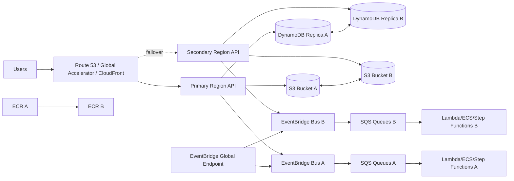

# Part 089 — Lab: Multi-Account Multi-Region Disaster Recovery

Multi-region disaster recovery is not a feature you turn on.

It is an operating model.

A production system needs answers for:

```txt
Where is the source of truth?
Where are in-flight messages?
Where are workflow executions?
Where are uploaded objects?
Where are container images?
Where are Lambda artifacts?
Where are secrets and KMS keys?
Where are event archives?
What happens during failover?
What happens during failback?
How do we prevent split brain?
How do we reconcile side effects?
```

This lab implements a practical multi-account, multi-region DR design for the platforms built in earlier parts.

The goal is not to make every workload active-active.

The goal is to design a DR posture that matches business RTO/RPO, then prove it with drills.

---

## 1. Lab Scenario

Use two Regions:

```txt
primaryRegion: ap-southeast-1
secondaryRegion: ap-southeast-3
```

Use at least two AWS accounts:

```txt
prod-workload account
security/log-archive account
```

Optionally add:

```txt
shared-services account
network account
dr-test account
```

Workloads:

### Serverless Document Platform

```txt
API Gateway
Lambda
S3
SQS
Step Functions
DynamoDB
EventBridge
AppConfig
Secrets Manager
KMS
```

### Hybrid Report Platform

```txt
API Gateway
Lambda
SQS
ECS/Fargate
ECR
DynamoDB/S3/RDS optional
EventBridge
CloudWatch
```

DR target:

```txt
active-passive warm standby
```

This is a strong practical default for many systems.

Active-active can be added later only if conflict strategy is proven.

---

## 2. DR Objectives

Define RTO/RPO by workflow.

| Workflow | RTO | RPO | Strategy |
|---|---:|---:|---|
| create upload intent | 15m | near-zero | warm standby + replicated state |
| upload object | 15m | near-zero for accepted uploads | S3 replication / MRAP plan |
| document processing | 30m | events may replay | regional queues + reconciliation |
| report job submit | 15m | near-zero accepted jobs | replicated state + secondary queue |
| report worker processing | 60m | in-flight job may retry | regional queues + idempotency |
| audit event | 30m | zero tolerated loss or DLQ | replicated event/state + audit DLQ |
| search projection | 2h | rebuildable | replay/backfill |
| notification | 1h | duplicate forbidden | idempotency + queue replay |
| analytics | 24h | backfillable | S3/events backfill |

Do not apply the strictest RTO/RPO to everything.

That creates unnecessary cost and complexity.

---

## 3. DR Architecture Overview



### DR Principle

For every production resource, ask:

```txt
Does it need to be replicated, pre-created, recreated, or intentionally abandoned during failover?
```

Do not assume the answer.

---

## 4. Account and Region Layout

Recommended accounts:

```txt
management
log-archive
security-tooling
prod-workloads
staging-workloads
shared-services
```

Recommended OU structure:

```txt
Root
├── Security
├── Infrastructure
├── Workloads
│   ├── Prod
│   ├── Staging
│   └── Dev
└── Sandbox
```

### Regional Resource Naming

Use explicit region suffixes when useful.

```txt
document-domain-prod-apse1
document-domain-prod-apse3
report-job-prod-apse1
report-job-prod-apse3
```

### Tags

```yaml
Service: document-platform
Environment: prod
RegionRole: primary
DRPair: ap-southeast-1-ap-southeast-3
DRStrategy: warm-standby
RTO: 15m
RPO: near-zero
Owner: document-platform
```

Tags help during incident.

---

## 5. Control Plane vs Data Plane Strategy

Low RTO requires pre-provisioning.

### Pre-Provision

- Lambda functions in both Regions.
- ECS clusters/services in both Regions.
- ECR repositories/replication.
- API custom domains or regional endpoints.
- DynamoDB global tables/replicas.
- S3 buckets and replication.
- EventBridge buses/rules.
- SQS queues/DLQs.
- Step Functions state machines.
- IAM roles/KMS keys.
- Secrets/config.
- Dashboards/alarms.
- Runbooks.

### Do Not Depend On

```txt
creating everything during outage
```

IaC is necessary, but for low RTO it must have already run in secondary Region.

### Warm Standby

Run reduced capacity in secondary:

```txt
Lambda deployed, maybe no provisioned concurrency
ECS service min tasks 0 or 1 depending RTO
SQS queues active
Step Functions deployed
DynamoDB/S3 replicated
```

A warm standby that is never tested is closer to cold standby.

---

## 6. Artifact Replication

### ECR Replication

Configure ECR private registry replication.

Replication should cover:

- ECS/Fargate worker images;
- Lambda container images if used;
- base images if internally maintained.

Checklist:

- source and destination Regions opted in;
- destination account registry policy allows replication for cross-account;
- replication rules match repositories/tags;
- image digest appears in secondary;
- deploy uses digest;
- old images lifecycle-managed.

### Lambda ZIP Artifacts

Store in artifact bucket with cross-region replication.

Record:

```txt
artifactSha256
functionName
version
runtime
architecture
gitCommit
buildId
```

### IaC Artifacts

Store templates/modules in source control and artifact repository.

DR should not depend on building code from developer laptop.

---

## 7. DynamoDB Global Tables Lab

Use DynamoDB global tables for job/document/idempotency state where appropriate.

DynamoDB global tables replicate tables across Regions and support multi-Region availability. For eventual consistency global tables, concurrent writes in different Regions are reconciled with a last-writer-wins method.

### Lab Setup

1. Create table in primary.
2. Add replica in secondary.
3. Enable PITR if critical.
4. Add required GSIs.
5. Deploy app in both Regions using same table logical model.
6. Test write in primary, read in secondary.
7. Test write in secondary during failover mode.
8. Test conflict behavior in controlled environment.

### Table Design for DR

Add fields:

```json
{
  "homeRegion": "ap-southeast-1",
  "lastWriterRegion": "ap-southeast-1",
  "version": 12,
  "updatedAt": "...",
  "commandId": "cmd-123",
  "fencingToken": "region-failover-epoch-7"
}
```

### Conflict Strategy

Avoid active-active writes to same item unless designed.

Prefer:

- single-writer per tenant/aggregate;
- failover epoch/fencing token;
- idempotency keys globally unique;
- append-only events for audit;
- reconciliation process.

### Drill

1. Write item in primary.
2. Wait for replica.
3. Trigger failover mode.
4. Write in secondary.
5. Restore primary.
6. Verify no stale primary writer overwrites secondary change.
7. Run reconciliation query.

### Red Flag

If both Regions can update the same job/item freely, last-writer-wins can hide business conflicts.

---

## 8. S3 Replication and Multi-Region Access

Use S3 replication for object durability/availability.

Options:

- Cross-Region Replication;
- Same-Region Replication;
- Multi-Region Access Points;
- MRAP failover controls;
- versioning;
- Object Lock where required.

S3 Multi-Region Access Points support failover controls that can shift S3 data request traffic between Regions.

### Lab Setup

1. Create bucket in primary.
2. Create bucket in secondary.
3. Enable versioning.
4. Configure replication.
5. Configure KMS keys/policies in both Regions.
6. Optionally create MRAP.
7. Upload test object.
8. Verify replica object exists.
9. Test read through regional endpoint and MRAP if used.
10. Simulate failover routing.

### Object Identity

Store:

```txt
bucket
key
versionId
region
replicationStatus
checksum
```

### S3 DR Questions

- Does upload go to active Region only?
- Can users upload during failover?
- Are presigned URLs Region-specific?
- Are existing presigned URLs invalid after failover?
- Are replicated object events duplicated?
- Which Region processes objects after failover?
- Is KMS decrypt available in secondary?

### Drill

1. Create upload intent in primary.
2. Upload object to primary bucket.
3. Verify replication.
4. Fail traffic to secondary.
5. Query status from secondary.
6. Process replicated object only once.
7. Fail back after reconciliation.

---

## 9. EventBridge Global Endpoints Lab

EventBridge global endpoints can improve regional fault tolerance. When event replication is enabled, EventBridge sends custom events to event buses in primary and secondary Regions using managed rules.

### Lab Setup

1. Create matching custom event buses in both Regions.
2. Create matching rules and targets in both Regions.
3. Create Route 53 health check.
4. Create EventBridge global endpoint.
5. Enable event replication.
6. Point producer to global endpoint.
7. Publish synthetic event.
8. Verify event arrives in primary and replicated/available in secondary according to configuration.
9. Simulate health check failure.
10. Verify routing to secondary.

### Required Matching Resources

In both Regions:

- event bus;
- rules;
- SQS target queues;
- DLQs;
- consumer Lambdas/ECS workers;
- IAM/resource policies;
- dashboards/alarms.

EventBridge documentation for creating global endpoints says to make sure matching event buses and rules exist in both primary and secondary Regions.

### Event Design

Events must include:

```json
{
  "eventId": "evt-123",
  "correlationId": "corr-456",
  "originRegion": "ap-southeast-1",
  "schemaVersion": "1.0",
  "failoverEpoch": "epoch-7"
}
```

Consumers must be idempotent across Regions.

### Drill

1. Publish event via global endpoint.
2. Verify primary consumer processes.
3. Force failover condition in test.
4. Publish event.
5. Verify secondary consumer processes.
6. Recover primary.
7. Verify no duplicate side effects on failback.

---

## 10. SQS/SNS Regional Design

SQS and SNS are regional.

Design queues per Region.

```txt
report-job-prod-apse1
report-job-prod-apse3
report-job-dlq-prod-apse1
report-job-dlq-prod-apse3
```

### Active-Passive Model

During normal operation:

```txt
producers send to primary queue
secondary queue exists but mostly idle
```

During failover:

```txt
producers send to secondary queue
secondary workers process
primary queue may still contain in-flight/backlog
```

### What Happens to Primary Queue Backlog?

Options:

- wait for primary recovery and drain;
- manually export/replay if possible;
- rely on state/outbox to recreate work in secondary;
- mark affected jobs for reconciliation.

SQS messages do not automatically replicate cross-region.

If near-zero RPO for queued jobs is required, store durable job state/outbox in replicated database and allow secondary to reconstruct missing queue messages.

### Queue Reconstruction Pattern

1. Job state written to DynamoDB global table.
2. Queue message send is best-effort.
3. Reconciler scans for jobs in `QUEUED` without recent worker claim.
4. Secondary enqueues missing jobs after failover.
5. Worker idempotency prevents duplicates.

This makes queue a delivery mechanism, not the source of truth.

---

## 11. Step Functions Regional Design

Step Functions executions are regional.

State machines must be deployed in both Regions.

### Normal Mode

```txt
new executions start in primary
secondary state machine exists but idle
```

### Failover Mode

```txt
new executions start in secondary
primary in-flight executions may be unavailable
```

### Workflow Recovery

Design workflows to restart from durable business state.

Example:

```txt
Document status PROCESSING, workflow execution not visible due primary outage.
Secondary reconciliation finds stale PROCESSING and starts secondary workflow if idempotency allows.
```

### Execution Naming

Use deterministic name:

```txt
docproc-{tenantId}-{documentId}-{objectVersionHash}-{failoverEpoch}
```

This prevents duplicates within same Region/epoch.

### Drill

1. Start workflow in primary.
2. Simulate primary unavailable.
3. Mark failover epoch.
4. Start/recover workflow in secondary from DynamoDB/S3 state.
5. Verify duplicate side effects do not occur.
6. After primary recovery, reconcile old execution.

### Rule

Do not assume workflow execution teleports between Regions.

---

## 12. Lambda Multi-Region Lab

Deploy all Lambda functions to both Regions.

### Checklist

- same artifact version;
- same alias names;
- environment variables use regional resource names;
- IAM role exists;
- KMS decrypt works;
- Secrets/AppConfig available;
- event source mappings exist but enabled according to mode;
- log groups/retention;
- alarms.

### Regional Config

```json
{
  "region": "ap-southeast-3",
  "mode": "standby",
  "eventBusName": "document-domain-prod-apse3",
  "documentTableName": "document-table-prod",
  "bucketName": "documents-prod-apse3"
}
```

### Failover Switch

Use AppConfig or parameter:

```txt
ACTIVE_REGION = ap-southeast-3
FAILOVER_EPOCH = epoch-7
```

Code should reject writes if Region is not active for that tenant/workload unless active-active strategy exists.

### Drill

1. Invoke secondary synthetic health function.
2. Verify secret/config/table/bucket access.
3. Switch test traffic to secondary.
4. Verify full workflow.
5. Switch back.

---

## 13. ECS/Fargate Multi-Region Lab

Deploy worker service in both Regions.

### Primary

```txt
desiredCount = normal
maxTasks = normal
```

### Secondary Warm Standby

Options:

```txt
desiredCount = 0
```

or:

```txt
desiredCount = 1
```

depending RTO.

### Required Resources

- ECS cluster;
- task definition;
- image in regional ECR;
- task role;
- execution role;
- security groups;
- subnets;
- log group;
- queue URL;
- S3 bucket;
- DynamoDB table access;
- EventBridge bus;
- AppConfig/secrets.

### Failover Steps

1. Set primary worker desired count to 0 if possible.
2. Set secondary worker desired count to failover capacity.
3. Reconstruct/enqueue pending jobs in secondary.
4. Monitor secondary queue age.
5. Monitor idempotency duplicates.
6. Keep primary paused until reconciliation.

### Drill

1. Enqueue jobs in primary.
2. Simulate primary worker unavailable.
3. Fail over to secondary.
4. Reconstruct jobs from DynamoDB global table.
5. Secondary workers process.
6. Verify no duplicate output when primary returns.

---

## 14. API/DNS Failover Lab

Options:

- Route 53 failover records;
- CloudFront origin failover;
- Global Accelerator;
- API Gateway regional custom domains;
- ALB per Region;
- Route 53 Application Recovery Controller for advanced controls.

### Health Checks

Health check should represent readiness.

Bad:

```txt
/health returns 200 always
```

Better:

```txt
/health/readiness verifies:
  config loaded
  activeRegion mode
  DynamoDB reachable
  critical queue exists
  secrets available
```

Be careful not to overload dependencies.

### Failover Drill

1. Set primary health check unhealthy in test.
2. Route traffic to secondary.
3. Submit API command.
4. Verify state written to secondary/global table.
5. Verify queue/event path active.
6. Restore primary health.
7. Do not automatically fail back until reconciliation done.

### Failover Response Headers

Return:

```txt
x-active-region: ap-southeast-3
x-failover-epoch: epoch-7
x-correlation-id: corr-123
```

This helps debugging.

---

## 15. Secrets, Config, and KMS

### Secrets

Options:

- replicate Secrets Manager secrets;
- deploy same secret values via pipeline;
- use separate regional secrets;
- rotate in both Regions.

### AppConfig

Deploy profiles/environments in both Regions.

Store:

```txt
activeRegion
failoverEpoch
feature flags
downstream endpoints
limits
```

### KMS

Options:

- multi-Region keys where appropriate;
- per-Region keys with consistent policy;
- tested decrypt/encrypt in secondary.

### Drill

1. Deploy secondary secret/config.
2. Run synthetic Lambda/ECS task.
3. Verify secret read and KMS decrypt.
4. Rotate secret in staging.
5. Verify secondary receives/use updated version.

Config drift is one of the most common DR failures.

---

## 16. Observability and Alarms

Create global dashboard.

Sections:

- active Region;
- failover epoch;
- API health by Region;
- Lambda errors/throttles by Region;
- ECS tasks by Region;
- SQS queue age/DLQ by Region;
- Step Functions failures by Region;
- EventBridge failed invocations by Region;
- DynamoDB replication/conflict indicators;
- S3 replication status;
- cost by Region;
- deployment/config versions.

### Required Alarms

- primary API unhealthy;
- secondary synthetic health failing;
- DynamoDB replication issue indicators;
- S3 replication failures;
- EventBridge target failures;
- EventBridge global endpoint health;
- secondary queue age high during failover;
- primary writes occurring after failover epoch;
- DLQ messages in either Region.

### Logs

Every log includes:

```txt
region
activeRegion
failoverEpoch
service
version
correlationId
```

Without region/epoch fields, DR debugging is painful.

---

## 17. Split-Brain Prevention

Split brain is when two Regions both accept writes for same business entity without safe conflict model.

### Controls

- active Region flag;
- failover epoch;
- single-writer per tenant/aggregate;
- Route 53/ARC controlled routing;
- application-level write fencing;
- IAM/SCP temporary write restriction if needed;
- operator procedure;
- alarms for unexpected writes in inactive Region.

### Write Fence Example

Every write command includes current epoch.

DynamoDB item stores:

```json
{
  "activeWriteEpoch": "epoch-7"
}
```

Condition:

```txt
failoverEpoch = current active epoch
```

If stale primary tries to write `epoch-6`, reject.

### Drill

1. Set active Region secondary.
2. Attempt write from primary using old epoch.
3. Expect rejection.
4. Verify alarm/metric.

Split-brain prevention is more important than fast failover.

---

## 18. Reconciliation Jobs

Build reconciliation before incident.

### Document Reconciliation

Find:

- uploaded objects without document state;
- document state without object;
- processing status stale;
- output object exists but status not updated;
- event emitted but consumer missing.

### Report Reconciliation

Find:

- queued jobs without queue message;
- running jobs stale;
- output exists but job not succeeded;
- succeeded job without EventBridge event;
- DLQ messages requiring repair.

### Event Reconciliation

Find:

- outbox events not published;
- published events not consumed by critical consumer;
- replay needed by time window;
- duplicate event side effects.

### Reconciliation Output

```json
{
  "reconciliationRunId": "dr-recon-20260706-001",
  "region": "ap-southeast-3",
  "findings": [
    {
      "type": "QUEUED_JOB_NOT_ENQUEUED",
      "jobId": "job-123",
      "action": "REENQUEUE"
    }
  ]
}
```

Reconciliation is how you repair reality after failover.

---

## 19. Failover Runbook

### Pre-Conditions

- secondary health green;
- artifacts deployed;
- state replication acceptable;
- event replication healthy;
- operators ready;
- stop conditions defined.

### Steps

1. Declare failover.
2. Freeze deployments.
3. Set failover epoch.
4. Mark primary as inactive writer.
5. Shift traffic to secondary.
6. Scale secondary workers.
7. Enable secondary event sources/rules if gated.
8. Run smoke tests.
9. Monitor business SLOs.
10. Start reconciliation.
11. Communicate status.

### Stop Conditions

- duplicate side effect detected;
- secondary critical DLQ grows;
- secondary API error rate high;
- state replication conflict unresolved;
- operator abort.

### Success

Failover is successful when:

```txt
new business operations complete in secondary
critical queues healthy
state writes safe
no duplicate harmful side effects
```

Not merely when DNS changes.

---

## 20. Failback Runbook

Failback is not automatic.

### Preconditions

- primary Region healthy;
- no stuck primary writes;
- secondary state replicated/converged;
- queues drained or migration plan exists;
- workflows completed/reconciled;
- deployment/config versions aligned;
- operators approve.

### Steps

1. Freeze risky changes.
2. Run reconciliation.
3. Compare business metrics by Region.
4. Set new failover epoch.
5. Shift small traffic to primary.
6. Monitor.
7. Gradually increase.
8. Keep secondary warm.
9. Inspect secondary DLQs/queues.
10. Close incident after evidence review.

### Rule

Do not fail back just because primary health check is green.

Failback without reconciliation can corrupt state.

---

## 21. DR Drill Plan

### Drill 1 — Secondary Smoke

Frequency: weekly/daily for critical.

- invoke secondary API synthetic path;
- read/write test item;
- publish test event;
- process test queue message;
- run ECS worker test job;
- verify dashboards.

### Drill 2 — Event Failover

- publish via global endpoint;
- force failover in test;
- verify secondary routing;
- verify idempotency.

### Drill 3 — Queue Reconstruction

- create queued job;
- do not send queue message;
- run reconciler in secondary;
- verify job is enqueued/processed.

### Drill 4 — Full Regional Failover

Frequency: quarterly/semiannual.

- shift controlled test traffic;
- process complete workflow;
- failback after reconciliation.

### Drill 5 — Restore Test

- restore DynamoDB/S3 backup to test;
- validate queries/objects;
- record RTO.

---

## 22. DR Evidence

For every drill, capture:

- time started/ended;
- RTO achieved;
- RPO observed;
- active Region;
- failover epoch;
- dashboard links;
- logs queries;
- queue depths;
- DLQ status;
- DynamoDB replication check;
- S3 replication check;
- EventBridge routing;
- ECS task count;
- Lambda versions;
- action items.

Evidence matters for compliance and improvement.

---

## 23. Common Anti-Patterns

### Anti-Pattern 1 — Multi-Region Compute, Single-Region State

Secondary API runs but cannot answer correctly.

### Anti-Pattern 2 — Replicated State, Regional Queue Loss Ignored

Accepted work stuck in failed Region.

### Anti-Pattern 3 — Step Functions Executions Assumed Portable

Executions are regional.

### Anti-Pattern 4 — No Split-Brain Fence

Both Regions write same items during failover.

### Anti-Pattern 5 — Secondary Never Tested

DR exists only in IaC.

### Anti-Pattern 6 — Secrets/KMS Drift

Secondary deploys but cannot decrypt.

### Anti-Pattern 7 — Event Replication Without Consumer Idempotency

Failover duplicates side effects.

### Anti-Pattern 8 — Automatic Failback

Primary recovery causes new incident.

### Anti-Pattern 9 — No Reconciliation Jobs

Operators invent data repair during outage.

### Anti-Pattern 10 — One RTO/RPO for Everything

Cost and complexity explode.

---

## 24. Lab Checklist

### Infrastructure

- [ ] Accounts/OUs defined.
- [ ] Primary and secondary Regions selected.
- [ ] IaC deploys both Regions.
- [ ] ECR replication.
- [ ] Lambda artifacts replicated.
- [ ] Secondary resources pre-created.
- [ ] KMS/secrets/config present in both Regions.

### State and Data

- [ ] DynamoDB global table or backup/restore strategy.
- [ ] S3 replication or MRAP strategy.
- [ ] RDS strategy if used.
- [ ] Idempotency global.
- [ ] Conflict strategy documented.
- [ ] Reconciliation jobs implemented.

### Events and Queues

- [ ] EventBridge global endpoint or cross-region plan.
- [ ] Matching buses/rules in both Regions.
- [ ] Regional SQS/SNS queues/DLQs.
- [ ] Queue reconstruction from durable state.
- [ ] Consumer idempotency.

### Compute

- [ ] Lambda secondary health.
- [ ] ECS/Fargate secondary capacity.
- [ ] Step Functions secondary deployment.
- [ ] Event source mapping mode.
- [ ] Worker scaling during failover.

### Operations

- [ ] Global dashboard.
- [ ] Failover runbook.
- [ ] Failback runbook.
- [ ] Split-brain alarm.
- [ ] DR drills.
- [ ] Evidence collection.

---

## 25. Final Mental Model

Multi-region DR is not deploying twice.

It is proving that the entire business workflow can survive a regional failure:

```txt
traffic
compute
state
objects
events
queues
workflows
secrets
KMS
artifacts
operators
runbooks
reconciliation
```

A top-tier engineer does not ask:

> “Do we have resources in two Regions?”

They ask:

> “When the primary Region is unavailable, which operations can continue, which in-flight events/messages/workflows are at risk, how do we prevent split brain, and how recently did we prove failover and failback?”

That is multi-region disaster recovery engineering.

---

## References

- Amazon EventBridge User Guide: global endpoints and event replication
- Amazon DynamoDB Developer Guide: global tables and conflict resolution
- Amazon S3 User Guide: Multi-Region Access Points and failover controls
- Amazon ECR User Guide: private image replication
- AWS Well-Architected Framework: Reliability pillar and disaster recovery strategies
- AWS Lambda, Amazon ECS, AWS Step Functions, Amazon SQS, AWS KMS, AWS Secrets Manager, Route 53, and AWS Application Recovery Controller documentation
