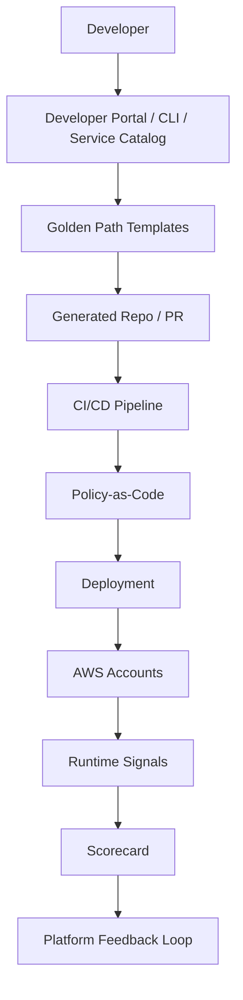

# Part 090 — Lab: Platform Golden Paths and Self-Service Governance

A platform is not a pile of Terraform modules.

A platform is a product that helps teams ship safely.

For AWS containers and serverless, a good platform gives teams:

- accounts with baseline guardrails;
- approved templates;
- secure defaults;
- observability by default;
- deployment safety by default;
- cost tags by default;
- runbooks by default;
- policy checks by default;
- clear exception path;
- self-service experience.

The platform goal is:

```txt
make the safe path the easy path
```

This lab builds a platform operating model for the workloads from this series.

It is about developer productivity and governance at the same time.

---

## 1. Platform Goals

Your platform should let a team create:

- API Lambda service;
- SQS worker Lambda;
- EventBridge consumer;
- Step Functions workflow;
- S3 file processing pipeline;
- ECS/Fargate SQS worker;
- scheduled job;
- DynamoDB state table;
- AppConfig profile;
- observability dashboard;
- runbook;
- CI/CD pipeline.

Without every team reinventing:

- IAM patterns;
- DLQs;
- alarms;
- logging fields;
- tags;
- deployment strategy;
- cost controls;
- security checks;
- event schemas.

### Success Metric

A product team should be able to go from:

```txt
new service request
```

to:

```txt
production-ready skeleton with tests, alarms, tags, pipeline, and runbook
```

without opening five platform tickets.

---

## 2. Platform Architecture



### Platform Components

| Component | Purpose |
|---|---|
| account vending | creates governed AWS accounts |
| golden templates | standard workload starting points |
| IaC modules | reusable secure primitives |
| CI/CD templates | standard release safety |
| policy-as-code | pre-deploy guardrails |
| AWS Config | runtime compliance/drift |
| scorecards | visibility and improvement |
| developer portal/CLI | self-service UX |
| exception process | controlled escape hatch |
| docs/runbooks | operational enablement |

Platform is both tooling and operating model.

---

## 3. Account Vending

Use account vending to create accounts with baseline controls.

AWS Control Tower Account Factory is a configurable account template that standardizes provisioning of new accounts with pre-approved configurations. AWS Control Tower also provides Account Factory for Terraform (AFT), which sets up a Terraform pipeline to provision and customize accounts in a Control Tower environment.

### Account Request Contract

```yaml
accountName: payments-prod
ownerTeam: payments-platform
environment: prod
ou: Workloads/Prod
email: aws-payments-prod@example.com
dataClassification: confidential
networkProfile: private-app
costCenter: cc-123
regions:
  - ap-southeast-1
  - ap-southeast-3
guardrailProfile: prod-standard
```

### Account Baseline

Every account gets:

- CloudTrail baseline;
- Config recorder;
- GuardDuty/Security Hub;
- IAM Identity Center access;
- log archive integration;
- VPC/network baseline if needed;
- budget/anomaly monitors;
- mandatory tags;
- baseline KMS policies;
- baseline SCP/OU controls;
- break-glass role;
- deployment roles;
- DNS/domain configuration as needed.

### Lab Exercise

Create an account vending request format and a mocked or real pipeline that:

1. validates request;
2. assigns OU;
3. applies baseline tags;
4. provisions account through Control Tower/AFT/manual approved path;
5. runs baseline compliance check;
6. publishes account metadata to platform catalog.

---

## 4. Service Catalog and Self-Service

AWS Service Catalog enables organizations to create and manage catalogs of approved IT services. Administrators can publish products and users can launch approved products with constraints.

Use Service Catalog or a developer portal/CLI to expose golden paths.

### Product Examples

```txt
serverless-api-service
sqs-lambda-worker
eventbridge-consumer
step-functions-workflow
s3-processing-pipeline
fargate-sqs-worker
scheduled-job
dynamodb-state-store
appconfig-profile
```

### Launch Parameters

For `fargate-sqs-worker`:

```yaml
serviceName: report-worker
ownerTeam: report-platform
environment: prod
queueType: standard
workerRuntime: java21
expectedJobDuration: 120s
maxWorkerConcurrency: 20
dataClassification: internal
costCenter: cc-456
```

### Output

- repository skeleton;
- IaC module instance;
- pipeline;
- dashboards;
- runbook;
- alarms;
- initial tests;
- ownership metadata.

### Launch Constraints

Service Catalog launch constraints can specify an IAM role that Service Catalog assumes when end users launch/update/terminate a product.

Use launch constraints to allow self-service while controlling permissions.

---

## 5. Golden Path Catalog

Build golden paths.

### Golden Path 1 — API Lambda Service

Includes:

- API route;
- Lambda Java template;
- auth/authz hook;
- idempotency for commands;
- structured logs;
- metrics/tracing;
- aliases/canary;
- dashboard;
- alarms;
- error envelope;
- integration test;
- runbook.

### Golden Path 2 — SQS Lambda Worker

Includes:

- queue + DLQ;
- Lambda event source mapping;
- partial batch response;
- max concurrency;
- idempotency utility;
- poison message handling;
- queue age alarm;
- DLQ runbook.

### Golden Path 3 — EventBridge Consumer

Includes:

- event schema fixture;
- EventBridge rule;
- target SQS queue;
- consumer Lambda;
- rule pattern tests;
- idempotency;
- replay safety doc.

### Golden Path 4 — Step Functions Workflow

Includes:

- state machine template;
- retry/catch defaults;
- task Lambda aliases;
- workflow dashboard;
- failure alarms;
- contract tests;
- redrive/restart runbook.

### Golden Path 5 — Fargate SQS Worker

Includes:

- ECR repo;
- Dockerfile baseline;
- ECS/Fargate service;
- SQS queue/DLQ;
- task role;
- autoscaling by backlog;
- graceful shutdown sample;
- image scan;
- deployment circuit breaker;
- worker runbook.

### Golden Path 6 — S3 File Pipeline

Includes:

- bucket/prefix policy;
- presigned URL API;
- S3 -> SQS event;
- validator Lambda;
- Step Functions workflow;
- recursive trigger guard;
- lifecycle rules.

---

## 6. Template Contract

Every golden path must include:

```txt
source code
IaC
tests
CI/CD
dashboard
alarms
runbook
README
security model
cost tags
owner metadata
```

### Required Files

```txt
README.md
architecture.md
runbook.md
slo.md
threat-model.md
cost-model.md
events/
tests/
infra/
src/
```

### Generated README

Should answer:

- what this service does;
- how to run locally;
- how to deploy;
- how to test;
- how to rollback;
- how to inspect logs;
- which alarms exist;
- who owns it;
- how to request exception.

A template that only deploys resources is incomplete.

---

## 7. Reusable IaC Modules

Build modules/constructs for primitives.

Examples:

```txt
SecureLambdaFunction
ApiLambdaRoute
DurableQueueWithDlq
EventBridgeToQueueConsumer
StepFunctionWorkflow
FargateQueueWorker
SecureS3ProcessingBucket
DynamoDbStateTable
AppConfigProfile
ServiceDashboard
```

### Module Defaults

`DurableQueueWithDlq` default:

- encryption;
- DLQ;
- max receive count;
- retention;
- queue age alarm;
- DLQ alarm;
- tags;
- owner metadata;
- redrive permission guidance.

`SecureLambdaFunction` default:

- log retention;
- structured logging env;
- least privilege placeholder;
- alias/version;
- tracing option;
- timeout default;
- reserved concurrency option;
- no wildcard policy;
- alarms.

### Escape Hatch

Allow overrides, but require explicit reason.

```yaml
waiver:
  control: lambda-timeout-max
  reason: migration workload temporarily needs 15m
  expires: 2026-09-01
  approvedBy: platform-security
```

Platform must support real workloads, not only ideal ones.

---

## 8. Policy-as-Code

Add policy checks to every generated pipeline.

### Pre-Deploy Checks

- required tags;
- no public S3;
- log retention set;
- queue has DLQ;
- SQS visibility > consumer timeout;
- no production `$LATEST`;
- EventBridge rules have owner;
- Function URL auth none requires waiver;
- IAM wildcard requires waiver;
- KMS decrypt scoped;
- ECS image digest in prod;
- Step Functions Map concurrency set;
- AppConfig validator exists;
- DynamoDB PITR for critical tables.

### Tools

Use any combination:

- CloudFormation Guard;
- CDK Aspects;
- OPA/Rego;
- Checkov;
- cfn-nag;
- Terraform Sentinel/policy sets;
- custom policy scripts.

### Policy Output

Bad:

```txt
Policy failed
```

Good:

```txt
SQS queue report-job-prod has no DLQ.
Add DurableQueueWithDlq module or set dlq.enabled=true.
Docs: internal/platform/queues#dlq
```

Developer experience is part of governance.

---

## 9. Runtime Governance With AWS Config

AWS Config conformance packs are collections of Config rules and remediation actions that can be deployed as a single entity in an account and Region or across an organization.

Use organization conformance packs to detect drift after deployment.

### Conformance Pack Examples

#### Serverless Baseline

- Lambda log retention configured.
- Lambda runtime not deprecated.
- SQS queue encrypted.
- SQS queue has DLQ tag/control.
- S3 bucket public access blocked.
- DynamoDB PITR enabled for critical tables.
- API Gateway access logging enabled.
- CloudTrail enabled.
- KMS key rotation where required.

#### Container Baseline

- ECS task definition does not run privileged.
- ECR scan on push enabled or Inspector scanning integrated.
- ECS service has deployment circuit breaker where required.
- Log group retention configured.
- Security groups do not allow broad ingress.
- Task role not admin.

#### Cost Baseline

- required tags present;
- log retention;
- no oversized retention for temp logs;
- budgets/anomaly monitors present by account.

### Organization Deployment

AWS Config supports managing conformance packs across accounts in an organization: deploy, update, and delete packs centrally across member accounts, with exclusions where needed.

### Lab Exercise

1. Define serverless baseline conformance pack.
2. Deploy to dev/staging/prod accounts.
3. Create an intentionally noncompliant resource.
4. Verify finding.
5. Route finding to platform dashboard/ticket.
6. Remediate.

---

## 10. Service Scorecards

Scorecards translate standards into visibility.

### Scorecard Categories

```txt
security
reliability
observability
cost
deployment
ownership
testing
data governance
```

### Example Checks

| Category | Check |
|---|---|
| security | no wildcard runtime role |
| reliability | async path has DLQ |
| observability | structured logs and correlation ID |
| cost | tags and log retention |
| deployment | Lambda alias / ECS digest |
| ownership | owner/team/runbook tags |
| testing | integration tests present |
| data | classification and retention defined |

### Score Levels

```txt
Bronze: minimum production controls
Silver: failure paths and SLOs
Gold: drills, cost unit economics, automated remediation
```

### Scorecard Input Sources

- IaC scan results;
- AWS Config;
- Security Hub;
- Cost tags;
- CloudWatch alarms;
- CI test reports;
- repo metadata;
- runbook links;
- deployment manifests.

### Lab Exercise

Create `scorecard.yaml` for each service.

```yaml
service: report-platform
level: silver
checks:
  dlq_alarm:
    status: pass
  log_retention:
    status: pass
  image_digest:
    status: pass
  failure_drill:
    status: warn
    due: 2026-08-01
```

Publish to dashboard or developer portal.

---

## 11. Developer Portal Contract

A developer portal should not only list services.

It should answer:

- who owns service?
- what is deployed?
- where are dashboards?
- where are runbooks?
- which alarms exist?
- what is scorecard level?
- what events does it produce/consume?
- what queues/DLQs does it own?
- what cost center?
- what APIs/routes?
- what data classification?
- how to create a new service?
- how to request exception?

### Service Catalog Entry

```yaml
name: report-platform
owner: report-team
type: hybrid-fargate-worker
environment: prod
repo: git@example/report-platform
dashboard: https://...
runbook: https://...
slo: 99% reports within 10m
eventsProduced:
  - ReportGenerated.v1
queues:
  - report-job-prod
  - report-job-dlq-prod
scorecard: silver
costCenter: cc-456
```

Portal metadata is operational metadata.

Keep it synced from code/IaC where possible.

---

## 12. Ownership and Onboarding

Every service has an owner.

Owner metadata:

```yaml
ownerTeam: report-platform
slack: "#report-alerts"
pagerDuty: report-platform-prod
engineeringManager: name
productOwner: name
runbook: https://...
costCenter: cc-456
dataSteward: name
```

### Onboarding Checklist

- team access to account;
- CI/CD deploy role;
- golden path selected;
- owner metadata set;
- dashboards created;
- runbook created;
- security model reviewed;
- cost budget assigned;
- support channel configured;
- scorecard baseline created.

### Offboarding/Ownership Change

- update owner tags;
- update alert routes;
- update cost owner;
- update runbooks;
- update deploy permissions;
- review stale secrets/roles.

Unowned infrastructure is production risk.

---

## 13. Exception Process

Not every workload fits default.

Create an exception process that is:

- fast;
- explicit;
- time-bound;
- risk-aware;
- tracked.

### Exception Request

```yaml
control: ecs-worker-min-tasks
requestedValue: 20
defaultMax: 5
reason: report platform has 24/7 SLA and cold worker startup exceeds SLO
risk: higher idle cost
compensatingControls:
  - monthly utilization review
  - budget alert
  - scheduled scaling evaluation
expires: 2026-10-01
owner: report-platform
approver: platform-architecture
```

### Exception Rules

- every exception has expiry;
- compensating control required;
- owner required;
- review cadence;
- dashboard/report;
- no permanent “temporary” exception.

### Lab Exercise

Create one safe exception workflow.

Example:

```txt
public webhook Function URL auth NONE
```

Requires:

- HMAC signature validation;
- WAF/rate limit;
- payload validation;
- DLQ;
- expiry/review.

---

## 14. Platform CI Templates

Provide reusable CI templates.

### Lambda Service Pipeline

Stages:

```txt
lint
unit
contract
policy
package
sign
deploy-test
integration
deploy-staging
canary-prod
```

### Fargate Worker Pipeline

Stages:

```txt
lint
unit
contract
docker-build
sbom
image-scan
push-ecr
policy
deploy-test
integration-job
deploy-staging
rolling/blue-green-prod
```

### Step Functions Pipeline

Stages:

```txt
asl-validate
task-contract-tests
policy
deploy-test
execution-test
prod-alias-shift
```

### Event Consumer Pipeline

Stages:

```txt
event-schema-test
rule-pattern-test
consumer-unit
queue-policy-check
deploy
synthetic-event-test
```

Teams should not create CI/CD from scratch.

Platform templates encode release lessons.

---

## 15. Platform Runtime Inventory

Maintain inventory of:

- Lambda functions;
- ECS services;
- EKS workloads;
- SQS queues/DLQs;
- EventBridge rules/buses;
- Step Functions state machines;
- S3 buckets;
- DynamoDB tables;
- APIs/routes;
- secrets;
- KMS keys;
- alarms;
- dashboards;
- cost tags.

### Inventory Sources

- AWS Config;
- Resource Groups Tagging API;
- IaC state;
- CI release manifests;
- developer portal metadata;
- CloudTrail;
- Cost data.

### Queries

Examples:

```txt
show production queues without DLQ
show Lambda functions with no alias
show ECS services without owner tag
show resources with no log retention
show EventBridge rules targeting Lambda directly
show stale Lambda runtimes
show public endpoints without WAF
```

Inventory powers governance.

---

## 16. Platform KPIs

Measure platform value.

### Developer Experience

- time to create new service;
- time to first deployment;
- golden path adoption;
- CI template adoption;
- self-service success rate;
- support tickets per service created.

### Reliability/Security

- percent async paths with DLQ;
- percent DLQs with alarms;
- percent services with runbooks;
- scorecard distribution;
- critical security findings age;
- policy exceptions overdue;
- failed deployment rollback success.

### Cost

- percent tagged cost;
- untagged cost trend;
- cost anomaly MTTA;
- log retention compliance;
- unit cost coverage.

### Operations

- MTTR;
- change failure rate;
- deployment frequency;
- incident count by pattern;
- runbook drill completion.

If governance slows teams without improving these metrics, redesign the platform.

---

## 17. Golden Path Maturity Model

### Level 0 — Ad Hoc

Teams hand-build resources.

### Level 1 — Templates

Basic starter templates exist.

### Level 2 — Guardrails

Policy-as-code and secure defaults.

### Level 3 — Self-Service

Portal/CLI creates services with pipeline/runbook/dashboard.

### Level 4 — Runtime Governance

Config/scorecards/drift detection.

### Level 5 — Continuous Improvement

Usage analytics, developer feedback, auto-remediation, platform KPIs.

Your goal is gradual maturity.

Do not wait for perfect platform to start.

---

## 18. Platform Support Model

Define support tiers.

### Tier 1 — Golden Path Supported

Platform team supports template/modules.

### Tier 2 — Extended Supported

Customizations within approved boundaries.

### Tier 3 — Team-Owned Exception

Team owns deviation and incident response.

### Tier 4 — Unsupported

Experimental/sandbox only.

This prevents platform team from being responsible for every custom snowflake.

### Support Contract

For golden path:

- platform provides module updates;
- security patches;
- CI updates;
- docs;
- examples;
- migration guides.

Product team owns business logic and service operation.

---

## 19. Upgrade and Deprecation

Golden paths evolve.

You need upgrade process.

### Examples

- Lambda runtime Java 21 -> newer runtime;
- ECS base image patch;
- new logging library;
- new IAM policy standard;
- queue module adds DLQ alarm;
- Step Functions template adds timeout;
- event envelope v2.

### Upgrade Strategy

1. announce change;
2. provide migration guide;
3. add scorecard warning;
4. update template for new services;
5. create PRs for existing services where possible;
6. set deadline for critical security changes;
7. track adoption.

### Deprecation

Do not leave outdated templates forever.

Old golden paths become liability.

---

## 20. Runtime Remediation

Some findings can auto-remediate.

Safe examples:

- set log retention on unconfigured log group;
- add missing tags where owner known;
- enable S3 Block Public Access for non-exception bucket;
- notify owner for missing DLQ;
- disable public resource only if critical and approved by policy.

Unsafe examples:

- deleting queues;
- changing SQS visibility timeout during incident;
- altering IAM policies without testing;
- disabling production API.

### Remediation Principle

```txt
auto-remediate low-risk reversible drift
ticket/escalate high-context changes
```

Automation should not create outages.

---

## 21. Governance Runbooks

### Runbook: Noncompliant Service

1. identify service/owner;
2. check scorecard;
3. check exception;
4. notify owner with exact remediation;
5. offer golden path migration;
6. escalate if critical;
7. track closure.

### Runbook: Untagged Resource

1. find resource;
2. infer owner from stack/account/logs;
3. tag or notify;
4. add policy check if recurring;
5. report untagged cost.

### Runbook: DLQ Without Owner

1. inspect queue tags;
2. find source rule/mapping;
3. identify producer/consumer;
4. create incident if messages present;
5. fix ownership metadata.

### Runbook: Policy Exception Expired

1. notify owner;
2. review risk;
3. extend with approval or remediate;
4. update scorecard.

---

## 22. Lab Implementation Plan

### Phase 1 — Define Standards

Write:

- tagging standard;
- telemetry standard;
- IAM standard;
- queue standard;
- event standard;
- deployment standard;
- cost standard;
- runbook standard.

### Phase 2 — Build Modules

Create:

- Lambda module;
- queue module;
- EventBridge consumer module;
- Fargate worker module;
- S3 processing module;
- dashboard module.

### Phase 3 — Add Policy Checks

Run in CI.

Fail unsafe PRs.

### Phase 4 — Add Service Catalog/Portal

Expose 2–3 golden paths.

Start with:

- API Lambda service;
- SQS worker;
- Fargate SQS worker.

### Phase 5 — Runtime Governance

Deploy Config conformance packs.

Build scorecard.

### Phase 6 — Adoption

Migrate one real team.

Collect feedback.

Improve template.

### Phase 7 — Scale

Add more golden paths.

Add account vending.

Add exception workflow.

---

## 23. Platform Backlog Examples

```yaml
- item: Add partial batch response default to SQS Lambda module
  impact: reliability
  priority: high

- item: Add log retention auto-remediation
  impact: cost/governance
  priority: medium

- item: Add ECR image digest enforcement for Fargate worker
  impact: release safety
  priority: high

- item: Add EventBridge replay safety checklist to consumer template
  impact: reliability
  priority: medium

- item: Add developer portal scorecard page
  impact: developer experience
  priority: medium
```

Platform backlog should be driven by incidents, user feedback, and scorecard gaps.

---

## 24. Common Anti-Patterns

### Anti-Pattern 1 — Platform as Ticket Queue

Self-service fails; teams wait.

### Anti-Pattern 2 — Templates Without Operations

Resources deploy but alarms/runbooks missing.

### Anti-Pattern 3 — Guardrails Without Escape Hatch

Teams bypass platform.

### Anti-Pattern 4 — SCPs for Fine-Grained App Logic

AccessDenied maze.

### Anti-Pattern 5 — Scorecards Used for Blame

Teams hide issues instead of improving.

### Anti-Pattern 6 — Runtime Drift Ignored

IaC was correct once but production changed.

### Anti-Pattern 7 — Golden Path Never Updated

New services inherit old vulnerabilities.

### Anti-Pattern 8 — Portal Metadata Manual Only

Catalog becomes stale.

### Anti-Pattern 9 — Every Team Builds Own CI/CD

Release safety inconsistent.

### Anti-Pattern 10 — Governance Slows Delivery Without Measuring Value

No platform KPIs.

---

## 25. Lab Checklist

### Account and Access

- [ ] Account request contract.
- [ ] Account baseline.
- [ ] OU/SCP mapping.
- [ ] Deployment roles.
- [ ] Break-glass process.

### Golden Paths

- [ ] API Lambda service.
- [ ] SQS Lambda worker.
- [ ] EventBridge consumer.
- [ ] Step Functions workflow.
- [ ] Fargate SQS worker.
- [ ] S3 processing pipeline.

### Governance

- [ ] Policy-as-code.
- [ ] Config conformance packs.
- [ ] Scorecards.
- [ ] Exception process.
- [ ] Runtime inventory.
- [ ] Remediation strategy.

### Developer Experience

- [ ] CLI/portal/catalog.
- [ ] Generated repo.
- [ ] CI templates.
- [ ] Docs/runbooks.
- [ ] Support model.
- [ ] Feedback loop.

### Metrics

- [ ] Time to create service.
- [ ] Golden path adoption.
- [ ] Compliance pass rate.
- [ ] Untagged cost.
- [ ] DLQ alarm coverage.
- [ ] Security finding age.
- [ ] Change failure rate.

---

## 26. Final Mental Model

Platform engineering is governance delivered as product.

A strong platform does not say:

```txt
You cannot create infrastructure.
```

It says:

```txt
Here is the fastest supported way to create infrastructure that is secure, reliable, observable, cost-aware, and deployable.
```

A top-tier platform engineer does not ask:

> “How do we enforce standards?”

They ask:

> “How do we make the standard path so useful that teams choose it, while guardrails prevent the mistakes we already know are dangerous?”

That is platform golden path engineering.

---

## References

- AWS Control Tower documentation: Account Factory and Account Factory for Terraform
- AWS Service Catalog documentation
- AWS Organizations documentation: service control policies
- AWS Config documentation: conformance packs and organization conformance packs
- AWS Well-Architected Framework: Operational Excellence, Security, Reliability, and Cost Optimization pillars
- AWS IAM, CloudFormation Guard, Security Hub, Config, Control Tower, Service Catalog, and Organizations documentation
