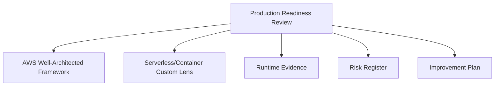
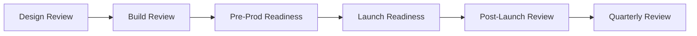

# Part 091 — Lab: Production Readiness Review and Well-Architected Scorecard

Production readiness is not a checklist you fill one day before launch.

It is a disciplined review of whether the system can safely serve real business traffic.

A serverless/container system is production-ready only when it has:

- clear ownership;
- tested deployment and rollback;
- defined SLOs;
- safe failure paths;
- idempotency;
- DLQs and redrive;
- observability;
- security boundaries;
- cost visibility;
- capacity model;
- runbooks;
- incident response;
- compliance evidence;
- improvement plan.

This lab builds a production readiness review process for the systems developed in this series.

The goal is to produce a repeatable readiness framework that can be used before launch, before major migrations, and periodically during operation.

---

## 1. What Production Readiness Means

A system is production-ready when the team can answer:

```txt
What is the business function?
Who owns it?
How does it fail?
How do we detect failure?
How do we recover?
How do we deploy safely?
How do we roll back?
How do we protect data?
How do we control cost?
How do we prove this?
```

Production readiness is evidence-based.

Not:

```txt
we think it should be okay
```

But:

```txt
we ran the failure drill, alarm fired, runbook worked, redrive succeeded, and no duplicate side effects occurred
```

---

## 2. AWS Well-Architected as Review Backbone

AWS Well-Architected provides a consistent way to evaluate workloads across six pillars:

```txt
Operational Excellence
Security
Reliability
Performance Efficiency
Cost Optimization
Sustainability
```

For containers and serverless, use Well-Architected as the backbone, then add a custom internal lens for workload-specific standards.



The AWS Well-Architected Tool lets teams define workloads, answer lens questions, review improvement plans, and save milestones over time.

### Why Use Milestones?

A milestone records the state of a workload at a point in time.

Use milestones for:

- initial launch review;
- post-launch review;
- post-incident review;
- major migration review;
- quarterly production review;
- after closing high-risk findings.

This turns architecture review into continuous improvement, not a one-time meeting.

---

## 3. Review Artifacts

Every review should produce artifacts.

```txt
1. workload definition
2. architecture diagram
3. data flow diagram
4. threat model
5. SLO document
6. operational runbooks
7. deployment/rollback plan
8. risk register
9. scorecard
10. improvement plan
11. launch decision
12. evidence links
```

### Evidence Examples

- deployed integration test result;
- load test report;
- failure drill report;
- DLQ redrive test;
- IAM Access Analyzer output;
- policy-as-code output;
- vulnerability scan result;
- cost dashboard;
- alarm screenshot/link;
- runbook execution notes;
- Well-Architected milestone report.

A readiness review without evidence is a discussion, not a review.

---

## 4. Workload Definition

Define the workload first.

Example:

```yaml
workload:
  name: document-processing-platform
  owner: case-platform-team
  businessFunction: process uploaded case documents
  criticality: high
  environment: prod
  regions:
    - ap-southeast-1
    - ap-southeast-3
  accounts:
    - prod-workloads
  components:
    - API Gateway
    - Lambda
    - S3
    - SQS
    - Step Functions
    - DynamoDB
    - EventBridge
  dataClassification: confidential
  users:
    - customer support
    - compliance reviewers
  launchDate: 2026-08-01
```

### Workload Boundaries

Clarify:

- included services;
- excluded services;
- upstream dependencies;
- downstream dependencies;
- data stores;
- event producers;
- event consumers;
- operational ownership.

A workload boundary that is too vague makes review useless.

---

## 5. Production Readiness Gates

Create gates.



### Gate 1 — Design Review

Before major build.

Questions:

- workload shape understood?
- compute placement justified?
- data model reviewed?
- event contracts defined?
- security model drafted?
- failure model drafted?
- cost model estimated?

### Gate 2 — Build Review

Before integration test.

Questions:

- IaC complete?
- IAM least privilege?
- golden path modules used?
- unit/contract tests?
- deployment pipeline?
- structured logs?
- basic alarms?

### Gate 3 — Pre-Prod Readiness

Before production deployment.

Questions:

- deployed integration tests pass?
- failure drills pass?
- load test pass?
- security checks pass?
- cost dashboard exists?
- runbooks ready?
- on-call trained?

### Gate 4 — Launch Readiness

Immediately before traffic.

Questions:

- rollback target exists?
- dashboards green?
- alarms active?
- launch owner present?
- support ready?
- stakeholder communication sent?
- risk acceptance signed?

### Gate 5 — Post-Launch Review

After launch.

Questions:

- SLO met?
- incidents?
- cost as expected?
- operational toil?
- missed alarms?
- user impact?
- improvement plan updated?

---

## 6. Pillar 1 — Operational Excellence Review

Operational excellence asks whether you can build, run, observe, respond, and improve.

### Review Questions

- Who owns the service?
- What is the on-call path?
- Are runbooks available?
- Are dashboards linked?
- Are deployment and rollback tested?
- Are operational events logged?
- Are alarms actionable?
- Are game days performed?
- Is there a continuous improvement process?
- Is operational data used in reviews?
- Are changes tracked?

### Evidence

- ownership metadata;
- on-call schedule;
- runbooks;
- dashboards;
- release manifests;
- rollback drill result;
- incident response plan;
- postmortem examples;
- Well-Architected milestone.

### Serverless/Container Specific Checks

- Lambda aliases used in prod;
- ECS image digest deployed;
- Step Functions execution history usable;
- SQS DLQ runbook;
- EventBridge replay/redrive policy;
- worker graceful shutdown tested;
- structured logs with correlation ID.

### Red Flags

- no owner;
- no runbook;
- alarms notify nobody;
- deployments manual;
- rollback never tested;
- logs do not include business ID;
- async failures only visible in DLQ if someone checks manually.

---

## 7. Pillar 2 — Security Review

Security asks whether the system protects identity, data, infrastructure, and operational actions.

### Review Questions

- Is every public route authenticated?
- Is domain authorization enforced server-side?
- Are runtime roles least privilege?
- Are resource policies scoped?
- Are secrets managed safely?
- Is encryption aligned to data classification?
- Is supply chain scanning enabled?
- Are Lambda code/image artifacts controlled?
- Are CI/CD roles scoped?
- Are audit logs available?
- Are replay/redrive permissions restricted?
- Is incident response defined?

### Evidence

- IAM policy review;
- Access Analyzer output;
- threat model;
- KMS key policies;
- S3 bucket policy;
- SQS/EventBridge resource policies;
- secret rotation plan;
- Inspector scan;
- GuardDuty/Security Hub findings;
- negative access tests;
- code signing/image scan evidence.

### Serverless/Container Specific Checks

- Lambda execution role per function;
- ECS task role per service;
- EventBridge bus policy scoped;
- SQS queue policy scoped by source;
- S3 presigned URL key generated server-side;
- DLQ access restricted;
- container images scanned;
- no `latest` tag in production;
- no secrets in logs/events.

### Red Flags

- `Action: *`, `Resource: *` runtime roles;
- public S3 bucket;
- unauthenticated function URL;
- DLQ readable by broad developer group;
- external events accepted from unknown accounts;
- CI/CD administrator role;
- secrets in Lambda env/logs.

---

## 8. Pillar 3 — Reliability Review

Reliability asks whether the system continues to serve its intended function under failure.

### Review Questions

- What are the SLOs?
- What is the RTO/RPO?
- What fails independently?
- Are retries bounded?
- Are side effects idempotent?
- Are DLQs configured and alarmed?
- Is redrive tested?
- Is backpressure designed?
- Are downstream limits respected?
- Are failure drills performed?
- Are backups/replication tested?
- Is multi-region strategy documented if required?

### Evidence

- SLO document;
- failure mode inventory;
- chaos/game-day report;
- DLQ redrive test;
- Step Functions retry/catch test;
- queue backlog test;
- load/stress test;
- backup restore test;
- DR drill evidence;
- reconciliation job evidence.

### Serverless/Container Specific Checks

- SQS visibility timeout > consumer timeout;
- Lambda SQS partial batch response where appropriate;
- event source max concurrency set for downstream-limited consumers;
- ECS worker graceful shutdown tested;
- Step Functions task timeouts set;
- EventBridge target DLQs for critical targets;
- object processing idempotent by bucket/key/version;
- DynamoDB conditional writes for state transitions.

### Red Flags

- retries unbounded;
- no DLQ;
- DLQ exists but no alarm;
- redrive never tested;
- direct fanout to fragile consumers;
- downstream database can be overwhelmed by auto-scaling compute;
- no idempotency for side-effecting operations.

---

## 9. Pillar 4 — Performance Efficiency Review

Performance efficiency asks whether resources are selected and configured to meet demand efficiently.

### Review Questions

- Is compute placement justified?
- Are latency SLOs defined?
- Are concurrency limits known?
- Are dependencies measured?
- Are Lambda memory settings tuned?
- Are ECS tasks right-sized?
- Are queue drain rates tested?
- Are Step Functions Map/Distributed Map concurrency caps set?
- Are database hot keys/connection limits reviewed?
- Are load tests realistic?
- Is autoscaling safe?

### Evidence

- capacity inventory;
- load test report;
- Lambda memory tuning report;
- ECS right-sizing report;
- SQS backlog/drain analysis;
- DB capacity test;
- API p95/p99 dashboard;
- Step Functions fanout test.

### Serverless/Container Specific Checks

- Lambda provisioned concurrency justified if used;
- Java cold start measured;
- ECS scaling based on queue age/backlog;
- RDS connection budget;
- DynamoDB partition key reviewed;
- S3 large object path avoids Lambda payload;
- API uses async handoff for long jobs.

### Red Flags

- API waits minutes for job;
- every Lambda attached to VPC without need;
- ECS worker scales without downstream cap;
- DynamoDB scan in API path;
- no load test;
- p99 latency unknown;
- Step Functions fanout with no concurrency limit.

---

## 10. Pillar 5 — Cost Optimization Review

Cost optimization asks whether cost scales with business value.

### Review Questions

- Are cost tags present?
- Are cost allocation tags activated?
- Is unit cost defined?
- Is log retention set?
- Are budgets/anomaly monitors configured?
- Is provisioned concurrency utilized?
- Are ECS tasks right-sized?
- Are Step Functions transitions justified?
- Are retry/fanout costs known?
- Are NAT/endpoints reviewed?
- Is cost under failure considered?

### Evidence

- cost dashboard;
- CUR/Athena query;
- unit economics report;
- budgets;
- anomaly monitor;
- tag coverage report;
- log ingestion review;
- load-test cost analysis;
- FinOps backlog.

### Serverless/Container Specific Checks

- cost per processed document/report/event;
- CloudWatch log cost controlled;
- SQS/EventBridge fanout ownership;
- DynamoDB GSI usage reviewed;
- S3 lifecycle rules;
- ECS min task count justified;
- provisioned concurrency schedule/utilization.

### Red Flags

- untagged spend;
- no unit cost;
- logs cost more than compute without explanation;
- EventBridge catch-all rule;
- recursive S3 trigger risk;
- NAT data spike;
- provisioned concurrency idle 24/7.

---

## 11. Pillar 6 — Sustainability Review

Sustainability asks whether workload resources are used efficiently to reduce environmental impact.

### Review Questions

- Is compute right-sized?
- Is idle capacity minimized?
- Is data lifecycle managed?
- Are unnecessary logs/metrics avoided?
- Are efficient runtimes/architectures evaluated?
- Are unused resources removed?
- Are batch jobs scheduled efficiently?
- Is storage class appropriate?

### Evidence

- right-sizing report;
- S3 lifecycle policy;
- log retention policy;
- unused resource cleanup;
- ECS/Lambda utilization report;
- test data cleanup;
- artifact lifecycle.

### Serverless/Container Specific Checks

- Fargate min tasks not excessive;
- Lambda memory/duration tuned;
- temporary S3 prefixes expire;
- old ECR images lifecycle-managed;
- log retention appropriate;
- dev/test environments have TTL;
- provisioned capacity justified.

### Red Flags

- idle dev environments permanent;
- old container images forever;
- infinite logs;
- stale S3 temporary data;
- ECS services running 24/7 for rare jobs;
- abandoned queues/buckets/functions.

---

## 12. Custom Serverless/Container Lens

Create a custom lens for internal review.

AWS Well-Architected Tool supports custom lenses with your own pillars, questions, best practices, and improvement plans.

### Custom Lens Sections

```yaml
pillars:
  - Event-Driven Correctness
  - Async Failure Handling
  - Runtime Identity
  - Deployment Safety
  - Observability Contract
  - Cost Under Failure
  - Platform Governance
```

### Example Questions

#### Event-Driven Correctness

```txt
Are domain events versioned, validated, and replay-safe?
```

Best practices:

- schema version;
- event ID;
- consumer idempotency;
- replay test;
- EventBridge rule pattern tests.

#### Async Failure Handling

```txt
Does every async boundary have bounded retry, DLQ/failure destination, alarm, and redrive runbook?
```

Best practices:

- DLQ;
- alarm;
- partial batch response;
- redrive test;
- poison message classification.

#### Runtime Identity

```txt
Does every Lambda/ECS task/Step Functions workflow have least-privilege identity scoped to side effects?
```

Best practices:

- role per runtime unit;
- resource policies scoped;
- Access Analyzer;
- negative tests.

---

## 13. Readiness Scorecard

Use a numeric score.

### Scoring

```txt
0 = not present
1 = present but untested
2 = tested/evidenced
3 = automated/governed
```

### Categories

| Category | Example Checks |
|---|---|
| ownership | owner, on-call, runbook |
| deployment | progressive deploy, rollback |
| observability | logs, metrics, traces, SLO |
| reliability | idempotency, DLQ, redrive |
| security | IAM, authz, KMS, scanning |
| performance | load test, capacity model |
| cost | tags, budgets, unit economics |
| data | retention, backup, recovery |
| governance | policy-as-code, scorecards |

### Example Scorecard

```yaml
service: report-platform
reviewDate: 2026-07-06
overall: silver
scores:
  ownership: 3
  deployment: 2
  observability: 2
  reliability: 2
  security: 2
  performance: 2
  cost: 1
  data: 2
  governance: 2
blockers:
  - cost unit metric exists but not automated
risksAccepted:
  - secondary Region warm standby desiredCount=0, accepted RTO 30m
```

### Launch Gate

Example:

```txt
No category below 1.
No critical/high risk without explicit risk acceptance.
Reliability and Security must be at least 2 for high-criticality workload.
```

---

## 14. Risk Register

Every readiness review produces risk register.

```yaml
risks:
  - id: REL-001
    title: Notification DLQ redrive not tested
    severity: medium
    pillar: Reliability
    owner: notification-team
    impact: duplicate or missed user notification during replay
    mitigation: implement idempotency + redrive drill
    dueDate: 2026-08-15
    launchBlocker: false

  - id: SEC-002
    title: Report worker task role has broad S3 access
    severity: high
    pillar: Security
    owner: report-platform
    mitigation: scope to reports bucket prefix
    dueDate: 2026-07-20
    launchBlocker: true
```

### Risk Severity

| Severity | Meaning |
|---|---|
| critical | launch blocker, likely severe customer/data impact |
| high | launch blocker unless explicit executive/security acceptance |
| medium | must have mitigation plan/date |
| low | track in backlog |

### Risk Acceptance

Risk acceptance must include:

- owner;
- reason;
- compensating controls;
- expiration/review date;
- approver.

No permanent invisible risks.

---

## 15. Launch Checklist

### Ownership

- [ ] owner team.
- [ ] on-call rotation.
- [ ] escalation path.
- [ ] runbook.
- [ ] support channel.

### Architecture

- [ ] diagram.
- [ ] data flow.
- [ ] event contracts.
- [ ] workload placement decision.
- [ ] dependency list.
- [ ] failure mode inventory.

### Security

- [ ] threat model.
- [ ] auth/authz tests.
- [ ] IAM least privilege.
- [ ] resource policies scoped.
- [ ] secrets/KMS.
- [ ] scan results.
- [ ] audit logging.

### Reliability

- [ ] SLO/RTO/RPO.
- [ ] idempotency.
- [ ] retries bounded.
- [ ] DLQs alarmed.
- [ ] redrive tested.
- [ ] backup/restore/DR if required.
- [ ] failure drills.

### Performance

- [ ] load test.
- [ ] capacity model.
- [ ] concurrency caps.
- [ ] downstream limits.
- [ ] cold start measured.
- [ ] queue drain rate known.

### Operations

- [ ] dashboards.
- [ ] alarms.
- [ ] logs/traces/correlation.
- [ ] deployment rollback.
- [ ] incident response plan.
- [ ] post-launch monitoring plan.

### Cost

- [ ] cost tags.
- [ ] unit cost.
- [ ] budget/anomaly monitor.
- [ ] log retention.
- [ ] top cost drivers understood.

---

## 16. Pre-Launch Review Meeting

Keep the review structured.

### Attendees

- service owner;
- tech lead;
- platform engineer;
- security engineer;
- SRE/on-call representative;
- product owner;
- data/compliance if needed;
- incident manager for critical workloads.

### Agenda

```txt
1. workload overview
2. architecture and data flow
3. SLO/RTO/RPO
4. top failure modes
5. security model
6. deployment/rollback plan
7. load/failure test evidence
8. cost model
9. risk register
10. launch decision
```

### Decision Options

```txt
GO
GO with accepted risks
NO-GO until blockers fixed
LIMITED LAUNCH / CANARY
```

Avoid ambiguous decisions.

---

## 17. Post-Launch Review

Run after launch.

Timeline:

```txt
24 hours after launch
7 days after launch
30 days after launch
```

Questions:

- were SLOs met?
- were alarms noisy/missing?
- were runbooks used?
- did cost match estimate?
- did users report issues?
- did async queues/backlogs behave?
- did any DLQ messages appear?
- did deployment/rollback work?
- what should become platform guardrail?

### Output

- updated scorecard;
- updated risk register;
- improvement plan;
- Well-Architected milestone;
- platform feedback items.

Launch learning should improve the platform.

---

## 18. Quarterly Production Review

Production readiness decays.

Run periodic reviews.

Review:

- architecture changes;
- traffic growth;
- new dependencies;
- security findings;
- cost trend;
- incident history;
- failed deployments;
- stale runbooks;
- runtime versions;
- IAM drift;
- DR drill status;
- SLO performance;
- scorecard trend.

### Milestone

Save a new Well-Architected milestone after significant improvements.

This creates historical evidence of improvement.

---

## 19. Improvement Plan

Every finding needs an improvement plan.

```yaml
improvement:
  id: REL-QUEUE-AGE-001
  finding: report queue age alarm threshold too high
  pillar: Reliability
  action: set alarm at 10m p95 age and link runbook
  owner: report-platform
  due: 2026-07-30
  evidenceRequired:
    - alarm screenshot/link
    - staging drill result
  status: in-progress
```

### Prioritization

Prioritize:

1. launch blockers;
2. data/security risks;
3. customer-impacting reliability gaps;
4. operational visibility gaps;
5. high-cost waste;
6. developer experience improvements.

Do not let improvement plans become graveyards.

---

## 20. Readiness Automation

Automate what can be automated.

### Automated Evidence

- policy-as-code results;
- Config compliance;
- Security Hub findings;
- Inspector scans;
- CI test reports;
- deployment manifest;
- cost tag coverage;
- DLQ alarm coverage;
- log retention compliance;
- runbook links in tags;
- scorecard generation.

### Manual Evidence

- architecture rationale;
- threat model quality;
- failure drill interpretation;
- risk acceptance;
- business impact;
- launch decision.

Automation supports review.

It does not replace engineering judgment.

---

## 21. PRR Templates

### Workload Summary

```yaml
name:
owner:
criticality:
businessFunction:
users:
dataClassification:
entrypoints:
dependencies:
deploymentModel:
```

### Readiness Decision

```yaml
decision: GO_WITH_RISKS
reviewDate:
approvers:
acceptedRisks:
  - REL-001
blockers: []
nextReviewDate:
```

### Evidence Index

```yaml
evidence:
  architectureDiagram:
  threatModel:
  loadTest:
  failureDrill:
  securityScan:
  costDashboard:
  runbook:
  deploymentRollback:
  wellArchitectedMilestone:
```

Store templates in repository.

---

## 22. Common Anti-Patterns

### Anti-Pattern 1 — Checklist Theater

Boxes checked without evidence.

### Anti-Pattern 2 — Launch Review One Day Before Go-Live

Too late to fix architecture.

### Anti-Pattern 3 — Security Review Separate From Reliability

Security failures cause reliability incidents and vice versa.

### Anti-Pattern 4 — No Risk Owner

Findings exist, no one fixes them.

### Anti-Pattern 5 — Well-Architected Report Filed Away

No improvement plan.

### Anti-Pattern 6 — No Post-Launch Review

Learning lost.

### Anti-Pattern 7 — Same Checklist for Every Criticality

Low-risk internal tool and payment system treated equally.

### Anti-Pattern 8 — No Evidence for Failure Paths

System works only on happy path.

### Anti-Pattern 9 — Cost Ignored Until Bill Arrives

FinOps too late.

### Anti-Pattern 10 — Platform Does Not Learn From Reviews

Same findings repeated across teams.

---

## 23. Lab Exercises

### Exercise A — Create Workload Review

1. Define workload in Well-Architected Tool or internal template.
2. Apply Framework lens.
3. Apply serverless/container custom lens.
4. Save baseline milestone.

### Exercise B — Build Scorecard

1. Create scorecard YAML.
2. Score each category 0–3.
3. Attach evidence links.
4. Identify launch blockers.

### Exercise C — Run PRR Meeting

1. Use agenda.
2. Walk through risks.
3. Decide GO/NO-GO.
4. Record accepted risks.

### Exercise D — Create Improvement Plan

1. Convert findings to backlog.
2. Assign owners/dates.
3. Define evidence required.
4. Review after closure.

### Exercise E — Post-Launch Review

1. Compare expected vs actual SLO/cost.
2. Update scorecard.
3. Save milestone.
4. Feed platform backlog.

---

## 24. Production Readiness Checklist

- [ ] workload defined.
- [ ] Well-Architected review completed.
- [ ] custom serverless/container lens completed.
- [ ] milestone saved.
- [ ] architecture and data flow diagrams.
- [ ] threat model.
- [ ] SLO/RTO/RPO.
- [ ] failure mode inventory.
- [ ] runbooks.
- [ ] dashboards/alarms.
- [ ] load test evidence.
- [ ] failure drill evidence.
- [ ] security scan/policy evidence.
- [ ] cost dashboard.
- [ ] deployment/rollback evidence.
- [ ] risk register.
- [ ] improvement plan.
- [ ] launch decision recorded.
- [ ] post-launch review scheduled.

---

## 25. Final Mental Model

Production readiness is not a meeting.

It is an evidence system.

A system is ready when you can prove:

```txt
it can be deployed safely
it can fail safely
it can be observed
it can be recovered
it protects data
it controls cost
it has owners
it improves over time
```

A top-tier engineer does not ask:

> “Did we pass the checklist?”

They ask:

> “What evidence proves this workload can serve real users, survive realistic failures, protect data, recover from incidents, and improve after launch?”

That is production readiness engineering.

---

## References

- AWS Well-Architected Framework
- AWS Well-Architected Tool documentation: workloads, lenses, custom lenses, improvement plans, and milestones
- AWS Well-Architected Operational Excellence pillar
- AWS Well-Architected Security, Reliability, Performance Efficiency, Cost Optimization, and Sustainability pillars
- AWS Well-Architected Serverless Applications Lens
