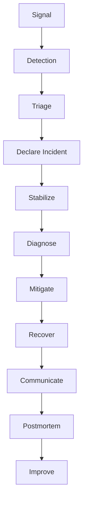
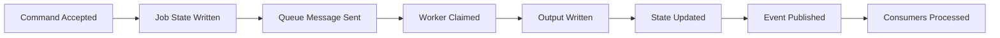

# Part 092 — Lab: Incident Management and On-Call Operations

An incident is when the system needs coordinated human response.

Serverless and container incidents are often async.

That means user impact may not appear as one obvious API 500.

It may appear as:

- queue age rising;
- DLQ messages accumulating;
- Step Functions executions failing;
- audit events missing;
- duplicate notifications;
- object processing stuck;
- report jobs delayed;
- EventBridge target failure;
- ECS worker tasks flapping;
- Lambda throttles;
- DynamoDB conditional conflict storm;
- cost anomaly;
- regional failover partial completion.

This lab builds an incident management and on-call operating model for serverless/container platforms.

The goal is to make incidents:

```txt
detected quickly
triaged systematically
mitigated safely
communicated clearly
recovered completely
learned from permanently
```

---

## 1. Incident Management Mental Model

Incident response is a workflow.



### Key Principle

During incident, do not optimize first.

Stabilize first.

Examples:

- pause event source mapping;
- set reserved concurrency to 0;
- disable EventBridge rule;
- scale down bad worker;
- rollback Lambda alias;
- rollback ECS task definition;
- enable kill switch;
- stop redrive/replay;
- reject new load safely.

After blast radius is contained, diagnose deeply.

---

## 2. Incident Severity Model

Define severity before incident.

### SEV-1

Critical customer/business impact.

Examples:

- production API unavailable;
- payment/report/document critical workflow failing;
- data exposure;
- duplicate harmful side effects;
- audit pipeline down with compliance risk;
- regional failover needed.

Expected:

- immediate paging;
- incident commander;
- executive/customer comms if required;
- postmortem required.

### SEV-2

Major degradation.

Examples:

- queue age causing SLA miss;
- DLQ accumulating for important workflow;
- ECS worker down but API still accepting;
- EventBridge target failures for non-critical consumer;
- high error rate for subset of tenants.

Expected:

- page owning team;
- incident channel;
- regular updates;
- post-incident review.

### SEV-3

Limited impact.

Examples:

- non-critical consumer delayed;
- staging incident;
- warning budget anomaly;
- minor deployment rollback.

Expected:

- ticket + owner;
- maybe no page.

### SEV-4

Informational.

Examples:

- isolated alarm self-resolved;
- small dev cost anomaly;
- warning-only compliance drift.

Severity should reflect user/business impact, not only technical metric.

---

## 3. Signals and Alarms

Not every metric should page.

Page only for actionable user/business impact or fast-moving risk.

### Critical Signals

| Signal | Why |
|---|---|
| API 5xx high | user-facing outage |
| API p99 high | user-facing degradation |
| queue age above SLO | async business delay |
| DLQ > 0 for critical path | terminal failure evidence |
| Step Functions failures | workflow failure |
| audit queue/DLQ issue | compliance risk |
| duplicate side effect metric | correctness incident |
| ECS running tasks = 0 while queue non-empty | worker outage |
| Lambda throttles causing queue age | capacity incident |
| DynamoDB/RDS throttling/saturation | state store incident |
| EventBridge target failures | event delivery incident |
| cost anomaly + traffic spike | runaway failure/cost |

### Non-Paging Signals

- single Lambda error for non-critical path;
- dev environment DLQ;
- low-priority queue age warning;
- transient 4xx validation errors;
- expected idempotency duplicates.

Alarm design should reduce noise.

Noise trains teams to ignore alerts.

---

## 4. CloudWatch Composite Alarms

CloudWatch composite alarms combine other alarms into a summarized alarm using Boolean logic.

Use composite alarms to reduce noise and represent workload health.

### Example: API Incident

```txt
ALARM(Api5xxHigh) AND ALARM(ApiTrafficPresent)
```

This avoids paging for 5xx percentage when there is no traffic.

### Example: Async Processing Incident

```txt
ALARM(ObjectQueueAgeHigh)
OR ALARM(ObjectDLQNotEmpty)
OR ALARM(DocumentWorkflowFailureHigh)
```

### Example: Worker Down

```txt
ALARM(QueueAgeHigh)
AND ALARM(ECSRunningTasksLow)
```

### Example: Deployment-Related Incident

```txt
ALARM(ApiErrorHigh)
AND ALARM(RecentDeployment)
```

RecentDeployment might be represented by custom metric/event or dashboard annotation, depending implementation.

### Alarm Rule Principle

Composite alarm should answer:

```txt
Is this a page-worthy condition?
```

Not just:

```txt
Did any metric move?
```

---

## 5. AWS Systems Manager Incident Manager

AWS Systems Manager Incident Manager helps prepare and respond to incidents using response plans, contacts, escalation, and runbooks.

AWS documentation defines response plans as plans for how incidents are responded to in an organization, and Incident Manager can use Systems Manager Automation runbooks as part of a response plan.

### Core Concepts

- response plan;
- incident;
- contacts;
- escalation plan;
- chat channel;
- runbook;
- engagement;
- timeline;
- post-incident analysis.

### Lab Use

Create response plans for:

```txt
document-platform-sev1
document-platform-sev2
report-platform-worker-incident
security-incident
dr-failover-incident
```

Each response plan includes:

- owner;
- contacts;
- escalation;
- chat channel;
- runbook;
- incident title template;
- impacted services metadata.

### Example Response Plan

```yaml
name: report-platform-worker-sev2
displayName: Report Platform Worker Incident
contacts:
  - report-platform-primary
  - platform-sre-secondary
chatChannel: "#inc-report-platform"
runbook: ReportWorkerBacklogRunbook
engagements:
  - onCallSchedule: report-platform
```

---

## 6. Contacts and Escalation

Define contact channels:

- email;
- SMS;
- voice;
- chat;
- paging system integration if used.

Incident Manager contacts can be used for notifications, including as part of on-call schedule rotations.

### Escalation Example

```txt
0 min: primary on-call
5 min: secondary on-call
10 min: team lead
20 min: incident commander / manager
```

### Contact Hygiene

- test contact methods;
- avoid personal-only knowledge;
- rotate schedules;
- document handoff;
- no single person dependency;
- update after team changes.

### On-Call Readiness

On-call engineer must have:

- AWS access;
- runbook access;
- dashboard access;
- ability to rollback;
- ability to pause event sources;
- ability to inspect DLQs;
- ability to engage other teams;
- clear escalation path.

Access discovered during incident is too late.

---

## 7. Runbook Design

A runbook is a decision aid.

It should not be a vague wiki page.

### Runbook Structure

```yaml
title:
service:
severity:
symptoms:
impact:
dashboards:
alarms:
initialTriage:
safeMitigations:
diagnosis:
recovery:
redrive:
rollback:
escalation:
communication:
postIncident:
```

### Good Runbook Characteristics

- starts with symptoms;
- lists safe first actions;
- preserves evidence;
- distinguishes retryable/permanent;
- includes exact dashboards/queries;
- includes rollback procedure;
- includes redrive safety;
- has owner;
- is tested in drills.

### Bad Runbook

```txt
Check CloudWatch. Restart if needed.
```

This is not enough.

---

## 8. Incident Roles

For SEV-1/SEV-2, assign roles.

### Incident Commander

- coordinates response;
- owns timeline;
- decides severity;
- manages priorities;
- prevents chaos.

### Technical Lead

- drives diagnosis/mitigation;
- coordinates engineers;
- validates fixes.

### Communications Lead

- updates stakeholders;
- writes customer/internal updates;
- maintains cadence.

### Scribe

- records timeline;
- captures actions;
- collects evidence.

### Subject Matter Experts

- database;
- networking;
- security;
- platform;
- application owners.

Role clarity prevents everyone from debugging the same log line.

---

## 9. First Five Minutes

The first five minutes matter.

### Checklist

1. Acknowledge alert.
2. Open incident channel/response plan.
3. Identify service/workflow.
4. Determine user/business impact.
5. Assign severity.
6. Assign incident commander if needed.
7. Check recent deployments/config changes.
8. Check top dashboards.
9. Stabilize if obvious safe mitigation exists.
10. Start timeline.

### Stabilize Examples

| Symptom | Safe Mitigation |
|---|---|
| bad Lambda deployment | rollback alias |
| bad ECS worker image | rollback task definition |
| recursive S3 trigger | disable event source/rule |
| retry storm | reduce concurrency/pause consumer |
| downstream overload | cap workers/enable circuit breaker |
| public route abuse | WAF/rate limit/block key |
| cost runaway | stop triggering rule/source |
| bad config | rollback AppConfig |

Do not start redrive during the first five minutes unless you understand root cause.

---

## 10. Async Incident Triage

Async incidents require finding the last durable successful boundary.



Triage question:

```txt
Where did the business operation stop?
```

### Boundary Checks

1. API accepted command?
2. Idempotency record created?
3. Job/document state exists?
4. SQS message exists?
5. Queue age/depth?
6. Worker logs show claim?
7. Output/state update?
8. EventBridge event published?
9. Event target delivery?
10. Consumer queue/DLQ?
11. Side effect performed?

### Tools

- DynamoDB item query;
- SQS queue metrics;
- DLQ sample;
- Step Functions execution history;
- EventBridge metrics;
- Lambda logs;
- ECS task logs;
- S3 object metadata;
- correlation ID search.

Async debugging is state boundary debugging.

---

## 11. Incident Type: API Outage

Symptoms:

- high 5xx;
- high p99;
- API Gateway integration errors;
- Lambda timeouts;
- auth failures.

### Triage

1. Which route?
2. Which tenants?
3. Recent deploy/config?
4. Lambda errors/throttles?
5. Downstream latency?
6. IAM/KMS/secret issue?
7. API Gateway throttling/WAF?
8. Cold start/provisioned concurrency issue?
9. Dependency outage?

### Mitigation

- rollback Lambda alias;
- rollback config;
- increase provisioned concurrency if justified and safe;
- reduce expensive route traffic;
- return controlled overload;
- fail over if regional issue;
- disable non-critical downstream call.

### Recovery

- verify route metrics;
- inspect DLQs for side effects;
- reconcile partially accepted commands;
- update postmortem.

---

## 12. Incident Type: Queue Backlog

Symptoms:

- SQS visible messages rising;
- age oldest high;
- async SLO missed;
- worker errors;
- DLQ maybe empty.

### Triage

1. Producer volume spike?
2. Consumer down?
3. Consumer throttled?
4. Downstream slow?
5. Poison messages?
6. Deployment regression?
7. Concurrency cap too low?
8. Visibility timeout issue?
9. External rate limit?

### Mitigation

- rollback consumer;
- scale worker if downstream safe;
- reduce worker if downstream overloaded;
- pause producer or reject new work;
- enable degraded mode;
- route priority traffic;
- inspect poison sample.

### Recovery

- backlog drain plan;
- monitor queue age;
- avoid over-scaling;
- redrive DLQ only after fix;
- update capacity model.

---

## 13. Incident Type: DLQ Not Empty

Symptoms:

- DLQ alarm;
- terminal failures;
- maybe no immediate user visible error.

### Triage

1. Which queue?
2. Which source?
3. What message type/schema?
4. First failure time?
5. Recent deployment?
6. Error classification?
7. Permanent or retryable?
8. Duplicate side-effect risk?
9. Safe to redrive?

### Mitigation

- pause redrive;
- sample messages;
- fix code/config/permission;
- if active poison storm, pause consumer/source;
- protect downstream.

### Redrive Procedure

1. classify messages;
2. fix root cause;
3. redrive one message;
4. verify side effects;
5. redrive small batch;
6. monitor;
7. continue gradually.

Never redrive blindly.

---

## 14. Incident Type: Step Functions Failures

Symptoms:

- failed executions;
- timed out tasks;
- stuck workflows;
- business status stale.

### Triage

1. Which state failed?
2. Retryable or permanent?
3. Task Lambda/ECS issue?
4. Input/schema change?
5. IAM/KMS/secret failure?
6. Timeout too low?
7. Downstream failure?
8. Recent workflow definition change?

### Mitigation

- rollback task Lambda alias;
- route new executions to previous state machine alias;
- disable workflow starts if harmful;
- mark affected resources failed/retryable;
- fix config.

### Recovery

- redrive supported executions where safe;
- restart from durable state if needed;
- reconcile side effects;
- update workflow error taxonomy.

---

## 15. Incident Type: ECS Worker Failure

Symptoms:

- ECS tasks stopped/flapping;
- queue backlog;
- job failures;
- memory/CPU high;
- image pull errors;
- task role errors.

### Triage

1. ECS service events.
2. stopped reason.
3. task definition revision.
4. image digest.
5. logs.
6. CPU/memory.
7. secrets/config.
8. IAM.
9. downstream.

### Mitigation

- rollback task definition;
- reduce desired count if harmful;
- scale if safe;
- stop bad deployment;
- use previous image digest;
- pause queue processing if duplicates risk.

### Recovery

- verify new tasks healthy;
- process one test job;
- monitor backlog drain;
- inspect jobs running during failure;
- reconcile outputs.

---

## 16. Incident Type: EventBridge Delivery Failure

Symptoms:

- producer says event published;
- consumer did not process;
- target failed invocation metric;
- target DLQ messages;
- queue empty unexpectedly.

### Triage

1. Was PutEvents successful?
2. Any failed entries?
3. Correct bus?
4. Correct source/detail-type?
5. Rule pattern matches?
6. Target policy permits?
7. Target DLQ?
8. Consumer queue received?
9. Consumer processed?

### Mitigation

- fix rule/policy;
- disable bad rule if broad/looping;
- replay archive or outbox after fix;
- re-send missed events if safe.

### Recovery

- consumer idempotency check;
- replay small time window;
- monitor duplicates/DLQ;
- update event pattern tests.

---

## 17. Incident Type: Duplicate Side Effects

Symptoms:

- duplicate notification/payment/report/audit;
- duplicate output files;
- idempotency conflict anomalies;
- replay/redrive recently run.

### Triage

1. Which side effect duplicated?
2. Same event ID or different?
3. Same idempotency key?
4. Queue redelivery?
5. Visibility timeout expired?
6. Worker killed/retried?
7. Event replay?
8. Producer duplicate?
9. Idempotency store failed?

### Mitigation

- stop consumer;
- stop redrive/replay;
- set reserved concurrency 0 for harmful function;
- pause worker;
- disable EventBridge rule;
- block affected operation.

### Recovery

- reconcile external provider/system;
- fix idempotency key;
- repair records;
- notify stakeholders/customers if needed;
- add duplicate test.

Duplicate side effects are correctness incidents, not only reliability incidents.

---

## 18. Incident Type: Cost Runaway

Symptoms:

- Cost Anomaly Detection alert;
- Lambda/S3/EventBridge/SQS/log spike;
- no matching business volume.

### Triage

1. Which service/resource?
2. Recent deployment/config?
3. Recursive trigger?
4. Retry storm?
5. EventBridge broad rule?
6. DEBUG logs?
7. redrive/replay?
8. abuse/attack?
9. NAT/data transfer spike?

### Mitigation

- disable event source/rule;
- set concurrency 0;
- rollback log level/config;
- block abusive client;
- stop redrive/replay;
- scale down worker;
- preserve evidence.

### Recovery

- fix root cause;
- cost estimate;
- add guardrail/anomaly metric;
- update FinOps runbook.

Cost incidents are often reliability incidents wearing a billing mask.

---

## 19. Incident Type: Security Finding

Symptoms:

- GuardDuty finding;
- Inspector critical vuln;
- public S3 policy;
- IAM policy widened;
- suspicious role usage;
- secret exposure.

### Triage

1. What resource?
2. Severity?
3. Exposure?
4. Data classification?
5. Active exploitation?
6. Recent change?
7. Role permissions?
8. Logs/CloudTrail?

### Mitigation

- isolate/disable resource;
- rollback policy;
- rotate secrets;
- stop compromised task/function;
- block public access;
- preserve evidence;
- engage security team.

### Recovery

- patch/redeploy;
- validate clean artifact;
- review CloudTrail;
- notify required parties;
- update guardrails.

Security incidents require evidence preservation.

---

## 20. Communication Cadence

Define update cadence.

### Internal Incident Channel

Every update includes:

```txt
current impact
what changed since last update
current hypothesis
actions in progress
next update time
help needed
```

### Stakeholder Update

Example:

```txt
SEV-2 report generation delay.
Impact: new reports are accepted but delayed. Existing completed reports are accessible.
Current status: queue backlog caused by worker deployment regression. Rollback complete; backlog draining.
Next update: 15 minutes.
```

### Customer-Facing

Coordinate with product/support/legal/security.

Avoid over-sharing internal implementation.

Be accurate and time-stamped.

---

## 21. Postmortem

Postmortem is for learning, not blame.

### Template

```yaml
incidentId:
title:
severity:
startTime:
endTime:
duration:
impact:
detection:
timeline:
rootCauses:
contributingFactors:
whatWentWell:
whatWentPoorly:
whereWeGotLucky:
actionItems:
  - owner:
    dueDate:
    evidence:
```

### Important Questions

- Why did detection work or fail?
- Why did blast radius expand?
- Why did mitigation take time?
- Did runbook work?
- Were alarms noisy/missing?
- Was rollback safe?
- Were duplicates prevented?
- Did platform/golden path need improvement?
- What guardrail would prevent recurrence?

### Action Items

Good:

```txt
Add EventBridge rule pattern test to CI by 2026-08-01, owner platform-team.
```

Bad:

```txt
Be more careful.
```

Postmortems must create system improvements.

---

## 22. Error Budgets

SLOs need error budgets.

Example:

```txt
SLO: 99.9% API successful requests over 30 days
Error budget: 0.1% failures
```

Use error budget to decide:

- continue feature delivery;
- focus on reliability;
- slow deployments;
- prioritize incident action items;
- invest in capacity/observability.

### Async Error Budgets

For async workflows:

```txt
95% documents processed within 5 minutes
99% reports completed within 10 minutes
audit event missing count = 0
```

Error budgets are not just HTTP errors.

They are business outcome budgets.

---

## 23. Operational Metrics

Track incident management performance.

### Detection

- mean time to detect;
- percent incidents detected by alarms vs users;
- missed alarm count;
- noisy alarm count.

### Response

- mean time to acknowledge;
- mean time to mitigate;
- mean time to recover;
- escalation time.

### Quality

- postmortem completion rate;
- action item closure rate;
- repeat incident rate;
- runbook tested rate;
- rollback success rate;
- DLQ redrive safety incidents.

### Workload Health

- SLO attainment;
- error budget burn;
- queue age SLO;
- DLQ count;
- deployment change failure rate.

Metrics should improve operations, not punish responders.

---

## 24. Automation in Incident Response

Automate safe steps.

### Safe Automation

- create incident from alarm;
- open chat channel;
- attach runbook;
- collect dashboard links;
- snapshot recent deployments;
- list DLQ depths;
- query current versions;
- generate timeline events;
- run read-only diagnostics.

### Risky Automation

- delete messages;
- redrive DLQ;
- disable production routes;
- change IAM;
- fail over regions;
- scale to zero;
- purge queues.

Risky actions can be automated but require approval and strong guardrails.

### Systems Manager Automation Runbooks

Incident Manager can use Systems Manager Automation runbooks as part of response plans. Use automation for repeatable diagnostic or mitigation steps where safe.

Example diagnostic runbook:

```txt
collect Lambda version
collect recent errors
collect DLQ depth
collect Step Functions failures
collect ECS stopped tasks
post summary to incident
```

---

## 25. On-Call Training

On-call engineers need practice.

### Training Checklist

- read architecture overview;
- follow one alert to dashboard;
- run Logs Insights query;
- inspect SQS DLQ safely;
- inspect Step Functions execution;
- rollback Lambda alias in staging;
- rollback ECS task definition in staging;
- run one failure drill;
- practice incident role assignment;
- practice postmortem writing.

### Shadow Rotation

New on-call shadows experienced responder before primary.

### Game Days

Use game days from Part 086 to train.

On-call readiness is not learned from docs alone.

---

## 26. Incident Response Lab Exercises

### Exercise A — Create Response Plan

1. Create Incident Manager response plan.
2. Add contacts/escalation.
3. Attach runbook.
4. Test incident creation from CloudWatch alarm.

### Exercise B — Composite Alarm

1. Create API 5xx alarm.
2. Create traffic-present alarm.
3. Create composite alarm:
   ```txt
   ALARM(Api5xxHigh) AND ALARM(ApiTrafficPresent)
   ```
4. Verify only composite pages.

### Exercise C — Queue Backlog Incident

1. Pause worker in staging.
2. Queue age alarm fires.
3. Incident opens.
4. Use runbook.
5. Recover and document timeline.

### Exercise D — DLQ Redrive Incident

1. Send poison message.
2. Let it reach DLQ.
3. Execute DLQ runbook.
4. Redrive one safe fixed message.
5. Record evidence.

### Exercise E — Bad Deployment Incident

1. Deploy bad Lambda/ECS version.
2. Alarm fires.
3. Rollback.
4. Verify recovery.
5. Write mini postmortem.

---

## 27. Common Anti-Patterns

### Anti-Pattern 1 — Every Alarm Pages

On-call ignores alarms.

### Anti-Pattern 2 — DLQ Alarm Has No Runbook

Responder sees failure but not recovery path.

### Anti-Pattern 3 — Incident Starts With Deep Debugging

Blast radius continues.

### Anti-Pattern 4 — Redrive During Active Bug

Same incident repeats.

### Anti-Pattern 5 — No Incident Roles

Everyone talks, no one coordinates.

### Anti-Pattern 6 — Async Incidents Treated Like HTTP Only

Queue/workflow/event state ignored.

### Anti-Pattern 7 — Postmortem Blames Person

System does not improve.

### Anti-Pattern 8 — Action Items Never Close

Repeat incidents.

### Anti-Pattern 9 — On-Call Lacks Permissions

Recovery delayed.

### Anti-Pattern 10 — Cost/Security Signals Not Incidents

Some of the most important incidents are not 5xx errors.

---

## 28. Incident Readiness Checklist

### Detection

- [ ] actionable alarms.
- [ ] composite alarms for workload health.
- [ ] DLQ alarms.
- [ ] queue age alarms.
- [ ] workflow failure alarms.
- [ ] deployment/cost/security signals.

### Response

- [ ] response plans.
- [ ] contacts/escalation.
- [ ] incident channel.
- [ ] runbooks.
- [ ] access tested.
- [ ] safe mitigations documented.

### Operations

- [ ] dashboards.
- [ ] logs queries.
- [ ] deployment manifest.
- [ ] rollback procedures.
- [ ] redrive procedures.
- [ ] failover procedure if required.

### Learning

- [ ] postmortem template.
- [ ] action item tracking.
- [ ] error budget review.
- [ ] runbook drills.
- [ ] on-call training.

---

## 29. Final Mental Model

Incident management is the production control loop.

The system is operationally mature when:

```txt
signals are meaningful
pages are actionable
responders have context
mitigations are safe
runbooks are tested
recovery is complete
postmortems improve the system
```

A top-tier engineer does not ask:

> “Did the alarm fire?”

They ask:

> “Did the right person get actionable context, stabilize the system safely, find the last durable successful boundary, recover without duplicate harm, and turn the incident into a permanent improvement?”

That is incident management engineering.

---

## References

- AWS Systems Manager Incident Manager documentation: response plans, contacts, escalation, and runbooks
- AWS Systems Manager Automation runbooks documentation
- Amazon CloudWatch documentation: alarms and composite alarms
- AWS Well-Architected Operational Excellence pillar
- AWS Well-Architected Reliability pillar
- AWS Incident Detection and Response guidance for runbooks and response plans
