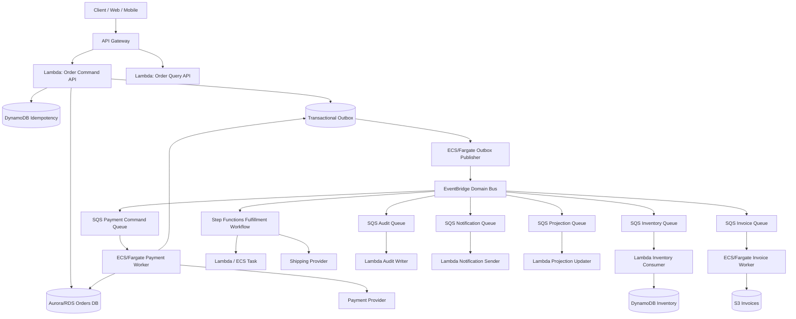
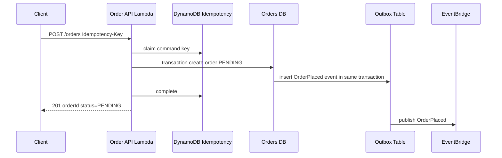
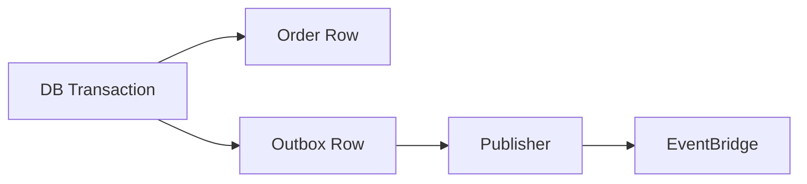
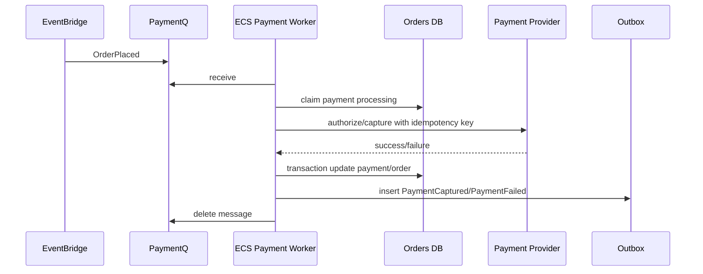
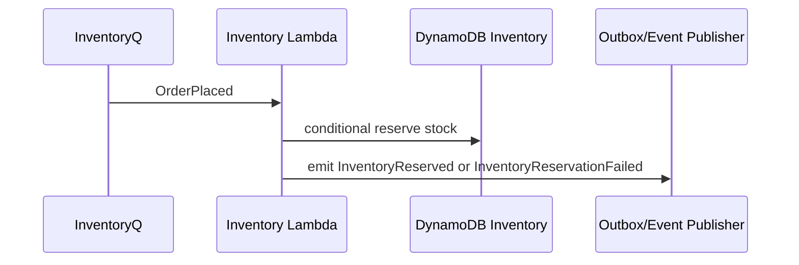
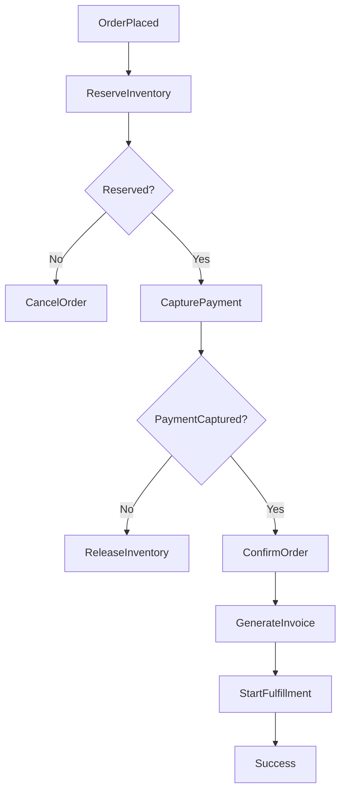
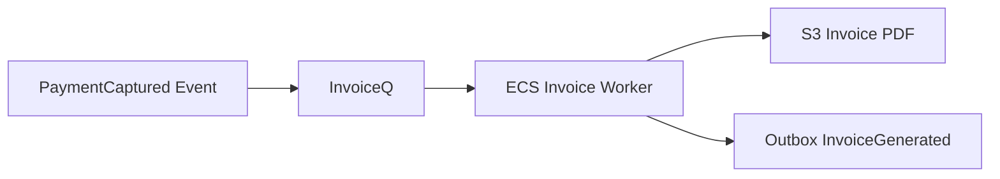
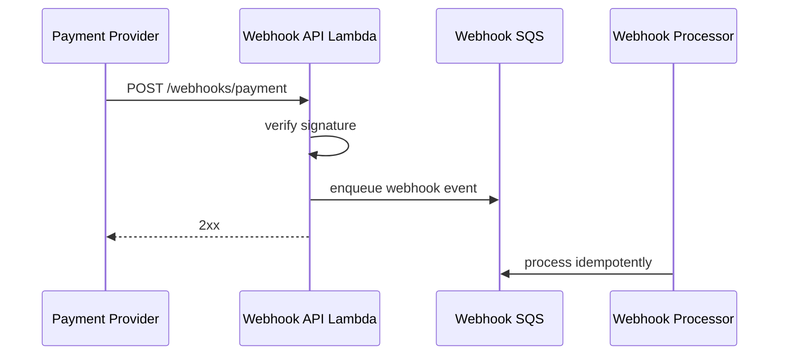
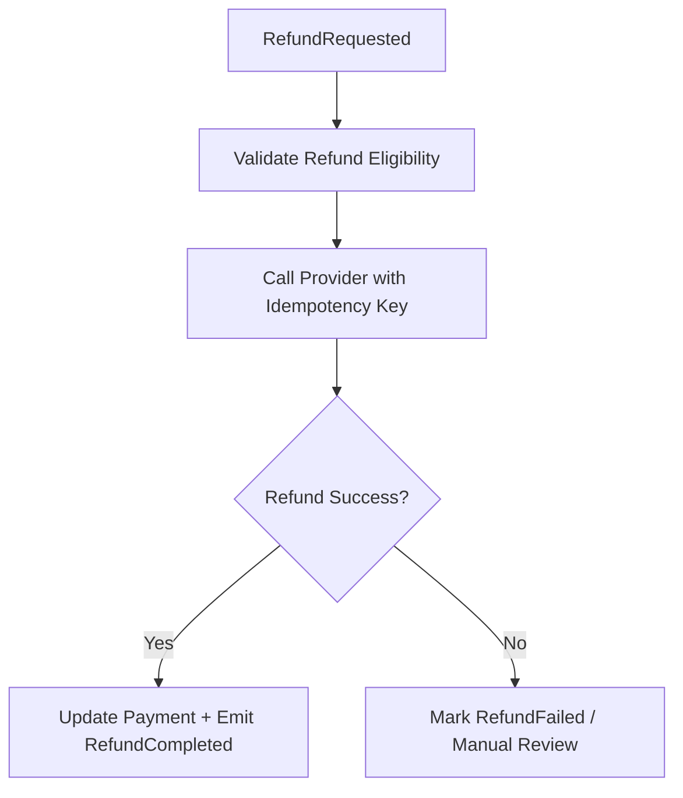
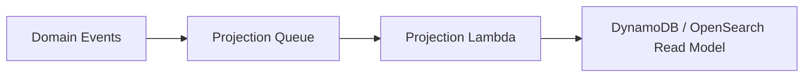

# Part 093 — Capstone: Event-Driven Commerce and Payments Platform

This capstone combines the concepts from the entire series into one production system.

The system:

> A commerce platform where users place orders, reserve inventory, capture payments, publish domain events, generate invoices, fulfill orders, send notifications, and support replay/reconciliation safely.

This is intentionally high-stakes.

Commerce and payment systems punish weak architecture:

- duplicate payment capture;
- missing order event;
- inconsistent inventory;
- retry storm against provider;
- outbox failure;
- webhook replay;
- queue backlog;
- stale fulfillment;
- missed audit record;
- partial refund;
- event replay duplicate notification;
- broken rollback.

The capstone goal is not to build a toy checkout.

The goal is to design a production-grade event-driven platform with explicit correctness and operations boundaries.

---

## 1. Business Requirements

### User Capabilities

- create cart;
- place order;
- authorize/capture payment;
- reserve inventory;
- generate invoice;
- receive order confirmation;
- track fulfillment;
- cancel/refund where allowed.

### Internal Capabilities

- event-driven order lifecycle;
- payment provider integration;
- inventory reservation;
- fulfillment orchestration;
- audit trail;
- customer notification;
- analytics/search projection;
- replay/reconciliation;
- operator repair workflows.

### Non-Functional Requirements

- no duplicate charge;
- no lost order event;
- no oversell beyond accepted business policy;
- user receives clear status;
- retries are safe;
- failures are recoverable;
- every order has audit trail;
- idempotent APIs/webhooks;
- queue backlog visible;
- event replay safe;
- deployment rollback safe;
- cost per order observable.

---

## 2. Architecture Overview



### Key Decisions

| Need | Choice |
|---|---|
| API command intake | API Gateway + Lambda |
| relational order transactions | Aurora/RDS |
| idempotency | DynamoDB + provider idempotency keys |
| reliable event publish | transactional outbox |
| event routing | EventBridge |
| per-consumer backpressure | SQS per consumer |
| payment provider work | ECS/Fargate worker |
| fulfillment workflow | Step Functions |
| audit/notification/projection | Lambda consumers |
| invoices/artifacts | S3 + ECS worker |
| inventory state | DynamoDB conditional writes |
| reconciliation | jobs + event archive/outbox |

The architecture uses both containers and serverless because the workload is mixed.

---

## 3. Domain Model

### Order

```json
{
  "orderId": "ord-123",
  "customerId": "cust-456",
  "tenantId": "tenant-1",
  "status": "PAYMENT_AUTHORIZED",
  "totalAmount": 4999,
  "currency": "USD",
  "items": [
    {
      "sku": "sku-1",
      "quantity": 2,
      "unitPrice": 1999
    }
  ],
  "paymentIntentId": "pay-789",
  "inventoryReservationId": "res-111",
  "version": 7,
  "createdAt": "...",
  "updatedAt": "..."
}
```

### Payment

```json
{
  "paymentId": "pay-789",
  "orderId": "ord-123",
  "status": "CAPTURED",
  "provider": "stripe-like-provider",
  "providerPaymentId": "provider-abc",
  "idempotencyKey": "payment:capture:ord-123:v1",
  "amount": 4999,
  "currency": "USD"
}
```

### Domain Events

```txt
OrderPlaced
InventoryReserved
InventoryReservationFailed
PaymentAuthorized
PaymentCaptureRequested
PaymentCaptured
PaymentFailed
OrderConfirmed
FulfillmentStarted
FulfillmentCompleted
OrderCancelled
RefundRequested
RefundCompleted
InvoiceGenerated
```

### Important Distinction

Commands ask for work:

```txt
CapturePayment
ReserveInventory
GenerateInvoice
```

Events state facts:

```txt
PaymentCaptured
InventoryReserved
InvoiceGenerated
```

Do not confuse commands and events.

---

## 4. Flow 1 — Place Order Command



### API Responsibilities

- authenticate user;
- authorize tenant/customer;
- validate cart;
- require idempotency key;
- create order transaction;
- insert outbox event atomically;
- return status quickly.

### It Must Not

- capture payment synchronously before durable order exists;
- call inventory provider in the transaction;
- publish event outside transaction without outbox;
- allow duplicate idempotency key with different payload;
- hold HTTP request until all fulfillment completes.

### Idempotency Key

```txt
tenantId + customerId + PlaceOrder + clientCommandId
```

The order API uses DynamoDB idempotency table.

The payment worker also uses provider idempotency key.

Both are needed.

---

## 5. Transactional Outbox

The transactional outbox pattern resolves the dual-write problem when one operation writes to a database and also needs to send a message/event.

### Problem

Bad flow:

```txt
write order to DB
publish OrderPlaced event
```

If DB write succeeds but event publish fails:

```txt
order exists but downstream never processes it
```

If event publish succeeds but DB rolls back:

```txt
downstream processes false order
```

### Outbox Solution

Inside the same DB transaction:

```txt
insert order
insert outbox event
commit
```

Then publisher reads outbox and publishes to EventBridge.



### Outbox Row

```json
{
  "eventId": "evt-123",
  "aggregateType": "Order",
  "aggregateId": "ord-123",
  "eventType": "OrderPlaced",
  "schemaVersion": "1.0",
  "payload": "{...}",
  "status": "PENDING",
  "attempts": 0,
  "createdAt": "...",
  "publishedAt": null
}
```

### Publisher Rules

- poll pending outbox rows;
- publish to EventBridge;
- handle partial failures;
- mark published only after success;
- retry with backoff;
- never publish same event with different ID;
- support replay by event ID/time range;
- emit metrics.

### Publisher Runtime

Use ECS/Fargate when:

- continuous outbox polling;
- steady throughput;
- database connection pooling;
- custom batching;
- high operational control.

Use Lambda scheduled poller when:

- low volume;
- simple polling;
- serverless simplicity matters.

---

## 6. EventBridge Domain Bus

Events go to custom bus:

```txt
commerce-domain-prod
```

Event envelope:

```json
{
  "source": "com.example.commerce.orders",
  "detail-type": "OrderPlaced",
  "detail": {
    "schemaVersion": "1.0",
    "eventId": "evt-123",
    "correlationId": "corr-456",
    "causationId": "cmd-789",
    "tenantId": "tenant-1",
    "orderId": "ord-123",
    "occurredAt": "2026-07-06T10:00:00Z",
    "payload": {
      "customerId": "cust-456",
      "totalAmount": 4999,
      "currency": "USD"
    }
  }
}
```

### Rule Targets

| Event | Target |
|---|---|
| OrderPlaced | PaymentQ |
| OrderPlaced | InventoryQ |
| OrderPlaced | AuditQ |
| PaymentCaptured | FulfillmentWorkflow |
| PaymentCaptured | InvoiceQ |
| PaymentCaptured | NotifyQ |
| PaymentFailed | NotifyQ |
| OrderConfirmed | ProjectionQ |
| FulfillmentCompleted | NotifyQ |

### Why EventBridge + SQS?

EventBridge routes facts.

SQS isolates consumers.

Payment, inventory, audit, invoice, notification, and projection do not share scaling/failure behavior.

---

## 7. Flow 2 — Payment Authorization/Capture

Payment is high-risk.

Use a dedicated payment worker.



### Payment Safety Rules

- provider idempotency key required;
- order state checked before capture;
- amount/currency immutable after command;
- payment state transition conditional;
- no duplicate capture;
- external response persisted;
- provider webhook reconciled idempotently;
- failure classified;
- manual repair path.

### Payment Idempotency Key

```txt
payment:capture:{tenantId}:{orderId}:{paymentAttempt}
```

This key is sent to provider if provider supports idempotency.

### State Transition

```txt
PENDING -> PAYMENT_PROCESSING -> PAYMENT_CAPTURED
PENDING -> PAYMENT_PROCESSING -> PAYMENT_FAILED
```

Conditional update:

```txt
WHERE order_id = :orderId
AND payment_status IN ('PENDING', 'PAYMENT_PROCESSING')
AND version = :expectedVersion
```

### Do Not

- call provider twice with different idempotency keys for same logical capture;
- delete SQS message before DB state update;
- publish PaymentCaptured before DB transaction;
- treat provider timeout as definite failure;
- log card/payment secrets.

---

## 8. Payment Provider Timeout

Provider timeout is ambiguous.

Possible outcomes:

```txt
provider did not receive request
provider received and processed request
provider processed but response lost
```

### Correct Behavior

On timeout:

1. keep payment in `PAYMENT_UNKNOWN` or `PAYMENT_PROCESSING`;
2. do not retry with new idempotency key;
3. retry same idempotency key or query provider;
4. reconcile with webhook/provider lookup;
5. do not release inventory until payment outcome clear if business requires.

### State

```txt
PAYMENT_PROCESSING
PAYMENT_UNKNOWN
PAYMENT_CAPTURED
PAYMENT_FAILED
```

### Runbook

If many payments in `PAYMENT_UNKNOWN`:

- check provider status;
- query provider by idempotency key/payment intent;
- update internal state with audit;
- emit missing event via outbox;
- notify support if user impact.

Payment systems require ambiguity-aware design.

---

## 9. Flow 3 — Inventory Reservation

Inventory can be DynamoDB-backed.



### Inventory Item

```json
{
  "PK": "SKU#sku-1",
  "SK": "STOCK",
  "available": 100,
  "reserved": 10,
  "version": 42
}
```

### Conditional Reservation

```txt
available >= requestedQuantity
```

Update:

```txt
available = available - qty
reserved = reserved + qty
```

### Reservation Record

```json
{
  "PK": "RESERVATION#res-123",
  "orderId": "ord-123",
  "sku": "sku-1",
  "quantity": 2,
  "status": "RESERVED",
  "expiresAt": "..."
}
```

### Failure

If inventory fails after payment captured, use compensation:

- refund payment;
- notify user;
- mark order failed;
- audit.

Better sequence may reserve inventory before capture depending business model.

### Design Choice

Two common flows:

#### Reserve Before Capture

```txt
OrderPlaced -> reserve inventory -> capture payment -> confirm order
```

Pros:

- avoid charging without stock.

Cons:

- inventory held for abandoned/failed payments.

#### Authorize Payment Before Reserve

```txt
OrderPlaced -> authorize payment -> reserve inventory -> capture
```

Pros:

- confirms funds.

Cons:

- more payment complexity.

Choose explicitly.

---

## 10. Flow 4 — Order Saga / Workflow

Order fulfillment spans multiple services.

Use Step Functions for explicit orchestration when process state matters.



### Orchestration vs Choreography

Pure choreography:

```txt
events trigger each service independently
```

Good for loosely coupled side effects.

Orchestration:

```txt
workflow coordinates critical sequence
```

Good when:

- business process has strict order;
- compensation needed;
- user status depends on workflow state;
- audit of steps important;
- human/manual intervention possible.

### Capstone Choice

Use Step Functions for order saga if payment/inventory/fulfillment order matters.

Use EventBridge/SQS for side effects like audit/search/notification.

---

## 11. Step Functions Service Integrations

Step Functions can integrate directly with AWS services and call service APIs from workflows.

Use direct integrations when task is pure integration:

- send SQS message;
- put EventBridge event;
- update DynamoDB item;
- start ECS task;
- call Lambda for domain logic.

### Workflow Input

Do not put full cart/payment data if large/sensitive.

Use references:

```json
{
  "orderId": "ord-123",
  "tenantId": "tenant-1",
  "correlationId": "corr-456",
  "workflowVersion": "order-saga-v1"
}
```

Tasks load required state with authorization.

### Retry/Catch

Payment provider errors need custom classification:

```txt
ProviderTimeout -> retry/query status
InsufficientFunds -> permanent failure
FraudRejected -> permanent failure
ProviderUnavailable -> retry/backoff
```

Do not use one `States.ALL` retry for everything.

---

## 12. Flow 5 — Invoice Generation

Invoice generation may be longer/heavier.

Use ECS/Fargate worker behind SQS.



### Why Container?

- PDF rendering libraries;
- fonts/native dependencies;
- CPU/memory;
- longer runtime;
- predictable throughput;
- easier local parity.

### Idempotency

```txt
invoice:{tenantId}:{orderId}:{invoiceVersion}
```

Output key:

```txt
tenants/{tenantId}/orders/{orderId}/invoices/v1/invoice.pdf
```

If message retries, worker checks:

- invoice record exists?
- S3 object exists with checksum?
- event already emitted?

### Invoice Event

```txt
InvoiceGenerated
```

Consumers:

- notification;
- customer portal projection;
- audit;
- accounting export.

---

## 13. Flow 6 — Webhooks

Payment providers send webhooks.



### Webhook API Responsibilities

- verify provider signature;
- validate timestamp/replay window;
- enqueue raw/normalized event;
- return quickly;
- never perform long processing synchronously.

### Webhook Processor Responsibilities

- idempotency by provider event ID;
- verify expected payment/order state;
- reconcile provider outcome;
- update state;
- insert outbox event;
- audit.

### Security

- route may be unauthenticated by normal JWT but must verify provider signature;
- WAF/rate limit;
- raw payload stored only if allowed;
- no secrets in logs.

### Webhook Replay

Providers often retry webhooks.

That is normal.

Do not treat duplicate provider event as error.

---

## 14. Audit Trail

Audit is not best effort for high-stakes systems.

Use dedicated audit queue/consumer.

Audit events:

- OrderPlaced;
- PaymentCaptured;
- PaymentFailed;
- RefundStarted;
- RefundCompleted;
- InventoryReserved;
- OrderCancelled;
- AdminRepairPerformed;
- DLQRedrivePerformed.

### Audit Store

Options:

- DynamoDB append-only table;
- S3 immutable log;
- OpenSearch for search + S3 source of truth;
- external compliance store.

### Audit Requirements

- event ID;
- actor;
- tenant;
- order/payment ID;
- timestamp;
- source service;
- correlation ID;
- reason;
- before/after where safe;
- immutable retention policy if required.

### Audit Consumer Failure

Audit queue DLQ is critical.

SEV-2 or SEV-1 depending compliance.

Do not silently drop audit events.

---

## 15. Refund Flow

Refunds are dangerous like captures.



### Refund Idempotency Key

```txt
refund:{tenantId}:{orderId}:{refundId}
```

### Partial Refunds

Need:

- refund amount validation;
- cumulative refunded amount <= captured amount;
- state transition;
- provider reconciliation;
- audit.

### Webhook Interaction

Provider may send refund webhook.

Webhook and internal refund worker must converge on same state.

Use provider refund ID and internal refund ID mapping.

---

## 16. Read Models and Queries

Do not make every API query join many services.

Use projections.



### Order Query API

Reads:

- order status;
- payment status;
- inventory status;
- fulfillment status;
- invoice URL.

This can be a projection updated by events.

### Projection Idempotency

```txt
projection:{eventId}:{projectionName}
```

### Consistency

Read model is eventually consistent.

API should communicate status clearly.

For critical fresh reads after command, read source of truth or use command response.

---

## 17. Observability Contract

Every order flow has:

```txt
correlationId
orderId
paymentId
reservationId
eventId
workflowExecutionArn
messageId
providerRequestId
idempotencyKeyHash
```

Do not log raw payment secrets.

### Dashboards

- order creation rate/errors;
- payment capture success/failure/unknown;
- payment provider latency/errors;
- inventory reservation failures;
- order saga failures;
- queue age/DLQ per consumer;
- outbox pending age;
- EventBridge failed invocations;
- invoice generation duration;
- duplicate idempotency metrics;
- cost per order;
- refund failures.

### Critical Alarms

- payment unknown count high;
- duplicate capture detected;
- outbox pending age high;
- PaymentQ DLQ > 0;
- audit queue/DLQ issue;
- provider error rate high;
- workflow failed executions high;
- order stuck in processing;
- EventBridge target failure.

---

## 18. Security Model

### API

- authenticated customer/user routes;
- admin routes separate;
- webhook signature validation;
- rate limits/WAF;
- idempotency key required for commands.

### IAM

- order API can write orders/idempotency only;
- payment worker can read payment secrets and update payment state;
- inventory consumer can update inventory table;
- invoice worker can write invoice S3 prefix;
- audit writer can write audit store;
- no runtime role has broad account permissions.

### Data Protection

- payment secrets in Secrets Manager;
- no card data stored unless compliant architecture explicitly built;
- KMS for sensitive tables/queues/buckets;
- S3 invoices protected;
- audit log retention;
- DLQ access restricted.

### Webhook Secrets

- rotate signing secrets;
- cache with TTL;
- support multiple active secrets during rotation;
- log secret version only.

---

## 19. Cost Model

Cost per order:

```txt
api request
+ order API Lambda
+ idempotency write
+ order DB transaction
+ outbox publisher
+ EventBridge events/matches
+ SQS messages per consumer
+ payment worker runtime
+ provider API calls
+ Step Functions order saga
+ inventory Lambda/DynamoDB
+ invoice worker/S3
+ notification/audit/projection
+ logs/traces
+ retries
```

### Cost Under Failure

Payment provider outage can multiply:

- payment retries;
- worker time;
- queue backlog;
- logs;
- provider calls;
- incident cost.

Controls:

- circuit breaker;
- retry budget;
- provider status config;
- pause payment worker;
- queue backlog alarms;
- provider call rate cap.

### Unit Metrics

- cost per placed order;
- cost per captured order;
- cost per failed order;
- cost per refund;
- cost per invoice generated;
- cost per audit event.

---

## 20. Deployment Strategy

### Safe Order

For event schema change:

```txt
consumers support new version
producer emits new version
old version retired after zero usage
```

For payment worker:

```txt
deploy v2 with canary queue/low concurrency
process synthetic payment in sandbox
increase concurrency
monitor provider errors
rollback task definition if needed
```

For order API:

```txt
Lambda alias canary
monitor 5xx/idempotency conflicts/order creation
rollback alias
```

For workflow:

```txt
new executions to workflow alias
in-flight old executions continue or behavior documented
tasks backward compatible
```

### Migration Guard

Never deploy payment provider key/config change without test transaction in sandbox/staging.

---

## 21. Runbooks

### Runbook: Payment Provider Timeout Spike

1. Check provider status.
2. Check PaymentQ age.
3. Check payment unknown count.
4. Reduce worker concurrency if provider overloaded.
5. Enable circuit breaker if needed.
6. Query provider for ambiguous payments.
7. Reconcile.
8. Resume gradually.

### Runbook: Outbox Pending Age High

1. Check publisher health.
2. Check DB connectivity.
3. Check EventBridge PutEvents failures.
4. Check partial failures.
5. Scale/fix publisher.
6. Re-publish pending rows.
7. Verify event consumers.

### Runbook: Duplicate Payment Suspected

1. Stop payment worker.
2. Stop redrive/replay.
3. Identify order/payment/provider IDs.
4. Compare idempotency keys.
5. Query provider.
6. Reconcile internal state.
7. Engage support/compliance.
8. Fix idempotency bug.

### Runbook: Audit DLQ

1. Stop redrive.
2. Sample messages.
3. Fix audit consumer/store.
4. Redrive one.
5. Verify immutable audit record.
6. Redrive batch.

---

## 22. Failure Mode Table

| Failure | Control |
|---|---|
| duplicate order request | API idempotency |
| DB commit succeeds, event publish fails | transactional outbox |
| payment worker crashes after provider call | provider idempotency + reconciliation |
| provider timeout ambiguous | `PAYMENT_UNKNOWN` + provider lookup |
| inventory race | DynamoDB conditional write |
| event consumer duplicate | consumer idempotency |
| EventBridge target fails | target DLQ + alarm |
| invoice worker crashes | deterministic output + SQS retry |
| webhook duplicate | provider event ID idempotency |
| Step Functions task fails | retry/catch/compensation |
| bad payment worker deploy | ECS rollback + queue safety |
| replay duplicates notification | notification idempotency |

---

## 23. Production Readiness Questions

Ask before launch:

- Can one order be charged twice?
- Can one successful order miss `OrderPlaced` event?
- Can an event replay duplicate user notification?
- Can provider timeout corrupt payment state?
- Can payment worker crash safely?
- Can outbox backlog be detected?
- Can order saga be redriven?
- Can audit failure be detected immediately?
- Can fulfillment proceed without payment?
- Can a bad deployment be rolled back?
- Can support answer current order status?
- Can finance reconcile provider settlement vs internal state?
- Can cost per order be calculated?

If any answer is unclear, the system is not ready.

---

## 24. Capstone Implementation Milestones

### Milestone 1 — Order API and Idempotency

- create order;
- idempotent repeat;
- conflict detection.

### Milestone 2 — Outbox and EventBridge

- transactional outbox;
- publisher;
- event routing;
- archive/replay optional.

### Milestone 3 — Payment Worker

- provider sandbox;
- idempotency key;
- timeout handling;
- state transitions.

### Milestone 4 — Inventory Consumer

- conditional reservation;
- reservation failure event.

### Milestone 5 — Order Saga

- Step Functions workflow;
- compensation paths.

### Milestone 6 — Side Effects

- audit;
- notification;
- projection;
- invoice.

### Milestone 7 — Operations

- dashboards;
- alarms;
- runbooks;
- failure drills.

### Milestone 8 — Production Readiness

- load test;
- security review;
- cost model;
- PRR scorecard.

---

## 25. Common Anti-Patterns

### Anti-Pattern 1 — Publish Events Without Outbox

Lost or false events.

### Anti-Pattern 2 — Retry Payment With New Key

Duplicate charge risk.

### Anti-Pattern 3 — Delete Queue Message Before Durable State

Lost work.

### Anti-Pattern 4 — Event Replay Without Idempotency

Duplicate side effects.

### Anti-Pattern 5 — Treat Provider Timeout as Failure

Ambiguous payment corrupted.

### Anti-Pattern 6 — Shared Payment/Admin Runtime Role

Security blast radius.

### Anti-Pattern 7 — Step Functions Used for Every Side Effect

Over-orchestration; use event fanout for independent consumers.

### Anti-Pattern 8 — Pure Choreography for Critical Saga

No clear compensation/order state.

### Anti-Pattern 9 — No Audit DLQ Alarm

Compliance failure hidden.

### Anti-Pattern 10 — Cost Ignored During Provider Outage

Retry storm becomes bill shock.

---

## 26. Final Mental Model

Commerce and payments architecture is correctness engineering.

The architecture must preserve business truth under retry, timeout, duplicate, replay, deployment failure, and provider ambiguity.

A top-tier engineer does not ask:

> “Can we process an order?”

They ask:

> “Can we prove an order cannot be charged twice, cannot lose its domain events, can recover from ambiguous provider outcomes, can replay safely, can audit every state transition, and can be operated during failure?”

That is event-driven commerce and payments engineering.

---

## References

- AWS Prescriptive Guidance: transactional outbox pattern
- Amazon EventBridge documentation: event buses, rules, archives, and replay
- AWS Step Functions documentation: service integrations and workflow orchestration
- Amazon SQS documentation: visibility timeout, DLQs, and redrive
- Amazon DynamoDB documentation: conditional writes and transactions
- Amazon ECS/Fargate documentation: services, task definitions, and autoscaling
- AWS Well-Architected Framework: Reliability and Security pillars
