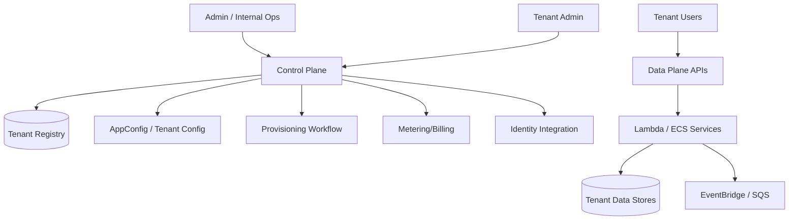
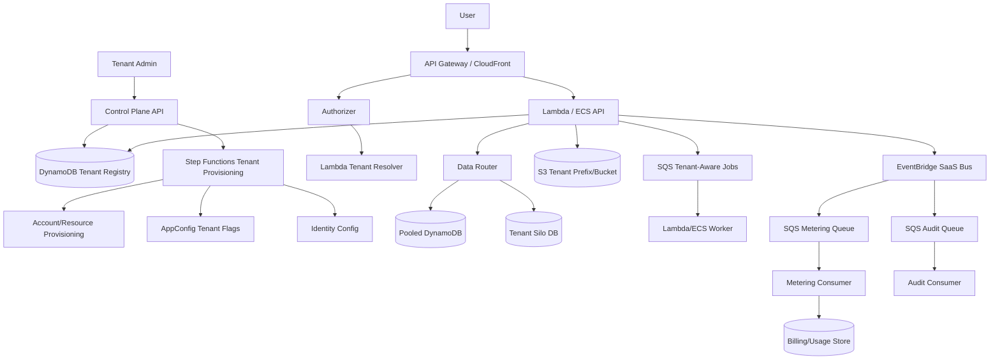
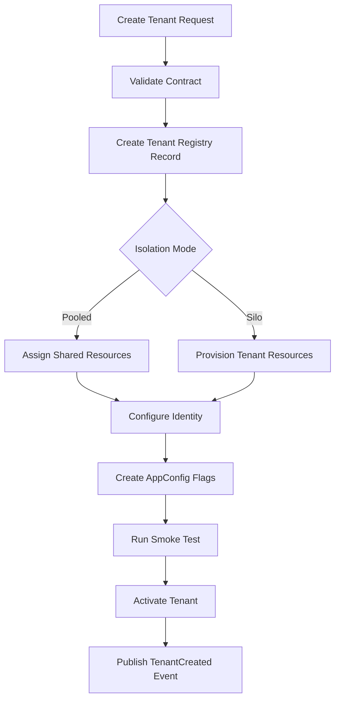
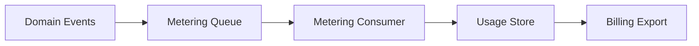
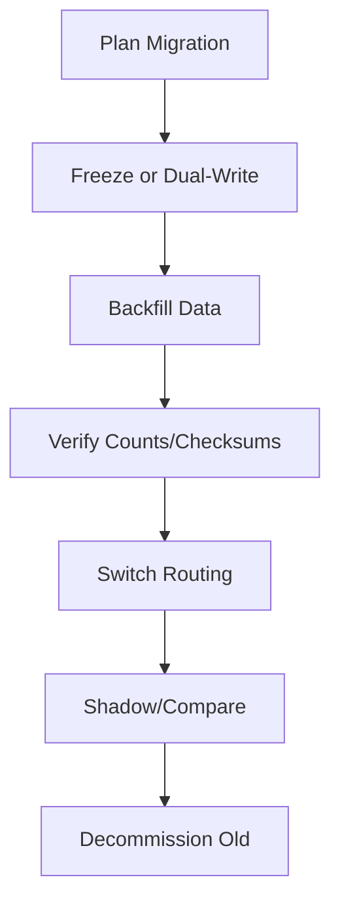

# Part 094 — Capstone: Multi-Tenant SaaS Platform

This capstone designs a production multi-tenant SaaS platform using AWS containers and serverless.

The system:

> A B2B SaaS platform where multiple tenants use shared application capabilities, with tenant-aware onboarding, identity, API access, jobs, events, file processing, observability, metering, billing, tenant isolation, and tier-based resource models.

SaaS architecture is not simply:

```txt
add tenantId column
```

SaaS architecture requires:

- tenant isolation;
- tenant onboarding;
- tenant-aware identity;
- tenant-aware routing;
- tiering;
- metering;
- noisy-neighbor controls;
- support operations;
- per-tenant observability;
- cost allocation;
- governance;
- data lifecycle;
- tenant migration;
- compliance.

AWS SaaS Lens emphasizes tenant isolation as a foundational SaaS topic. In SaaS, every layer must consider tenant context, not only the database.

---

## 1. SaaS Requirements

### Tenant Capabilities

- onboard tenant;
- configure identity provider;
- create users/roles;
- call APIs;
- upload files;
- run background jobs;
- receive notifications/webhooks;
- view usage;
- manage subscription/tier;
- export/delete data where policy allows.

### Platform Capabilities

- tenant provisioning;
- tenant isolation;
- tenant-aware routing;
- tenant-aware metering;
- per-tenant quotas;
- per-tenant feature flags;
- per-tenant support tools;
- per-tenant observability;
- pooled and siloed deployment options;
- migration between tiers;
- compliance/data lifecycle.

### Non-Functional Requirements

- one tenant cannot access another tenant’s data;
- one tenant cannot exhaust global capacity;
- tenant support can diagnose issues quickly;
- tenant usage can be billed/metered;
- critical tenants can receive stronger isolation;
- onboarding is self-service and automated;
- tenant config changes are auditable;
- deployment does not break tenant contracts.

---

## 2. Control Plane vs Data Plane

SaaS systems should separate control plane and data plane.



### Control Plane Owns

- tenant lifecycle;
- tenant metadata;
- plan/tier;
- identity config;
- feature entitlements;
- quota config;
- provisioning;
- billing/metering;
- tenant operations;
- data lifecycle;
- audit.

### Data Plane Owns

- tenant business workload;
- APIs;
- jobs;
- events;
- files;
- workflows;
- query/read models;
- user-facing processing.

### Rule

Tenant lifecycle is control plane.

Tenant business operations are data plane.

Do not mix them randomly.

---

## 3. Tenant Registry

Tenant registry is source of truth for tenant metadata.

```json
{
  "tenantId": "tenant-123",
  "tenantSlug": "acme",
  "status": "ACTIVE",
  "tier": "ENTERPRISE",
  "isolationMode": "SILO",
  "homeRegion": "ap-southeast-1",
  "dataResidency": "ID",
  "identityProvider": {
    "type": "OIDC",
    "issuer": "https://idp.example.com/acme"
  },
  "features": {
    "advancedReports": true,
    "maxUploadBytes": 104857600
  },
  "quotas": {
    "apiRps": 500,
    "maxConcurrentJobs": 50,
    "storageGb": 1000
  },
  "resources": {
    "apiBaseUrl": "https://acme.api.example.com",
    "bucketPrefix": "tenants/tenant-123/",
    "databaseShard": "shard-3"
  },
  "createdAt": "...",
  "updatedAt": "..."
}
```

### Storage Options

- DynamoDB table for registry;
- RDS if complex admin workflows;
- both via event/projection if needed.

### Access Pattern

- get tenant by ID;
- get tenant by slug/domain;
- list tenants by status/tier;
- find tenant resources;
- query tenants needing migration/provisioning.

### Critical Rule

Every request must resolve tenant context from trusted source.

Do not trust user-provided `tenantId` in request body.

---

## 4. Tenant Isolation Models

There are three common resource models.

### Pooled

Many tenants share resources.

```txt
shared API
shared Lambda/ECS
shared table/database
tenantId partitioning
```

Pros:

- cost efficient;
- simple deployment;
- high utilization.

Cons:

- noisy neighbor risk;
- isolation depends on app/IAM/data model;
- per-tenant restore/migration harder.

### Siloed

Tenant gets dedicated resources.

```txt
tenant-specific account/database/queue/bucket/service
```

Pros:

- stronger isolation;
- tenant-specific scaling;
- easier compliance;
- easier noisy-neighbor boundary.

Cons:

- higher cost;
- more provisioning complexity;
- fleet management.

### Bridge

Hybrid.

Examples:

- shared control plane;
- pooled standard tenants;
- dedicated data store for enterprise tenants;
- dedicated queue for high-volume tenants;
- dedicated account for regulated tenant.

### Decision

| Tenant Tier | Isolation |
|---|---|
| free/trial | pooled |
| standard | pooled with quotas |
| business | pooled compute + tenant-specific queues/indexes |
| enterprise | siloed data or account |
| regulated | siloed account/Region |

SaaS platforms often evolve from pooled to bridge.

Plan migration paths early.

---

## 5. Reference Architecture



### Compute Placement

- control plane API: Lambda;
- provisioning workflow: Step Functions;
- data plane API: Lambda or ECS/Fargate depending workload;
- long jobs: SQS + ECS/Fargate;
- event consumers: Lambda;
- metering: Lambda/ECS depending volume;
- tenant migrations: Step Functions + ECS/Batch.

---

## 6. Tenant Resolution

Tenant context can come from:

- custom domain;
- subdomain;
- JWT claim;
- API key mapping;
- path segment;
- mTLS certificate;
- request header from trusted edge/proxy.

### Preferred

Use trusted auth/edge context.

Example:

```txt
acme.api.example.com -> tenantSlug acme -> tenantId tenant-123
JWT issuer/audience -> tenantId tenant-123
```

### Tenant Context

```json
{
  "tenantId": "tenant-123",
  "tenantSlug": "acme",
  "tier": "ENTERPRISE",
  "isolationMode": "SILO",
  "homeRegion": "ap-southeast-1",
  "features": {...},
  "quotas": {...}
}
```

### Propagation

Every async message/event includes tenant ID:

```json
{
  "tenantId": "tenant-123",
  "correlationId": "corr-456",
  "jobId": "job-789"
}
```

### Rule

Tenant context must be propagated through:

- logs;
- metrics;
- traces;
- SQS messages;
- EventBridge events;
- Step Functions input;
- S3 keys;
- DynamoDB partition keys.

Without tenant context, SaaS operations are blind.

---

## 7. Data Plane Patterns

### Pooled DynamoDB

Partition key includes tenant:

```txt
PK = TENANT#tenant-123#ENTITY#...
```

Example:

```txt
PK = TENANT#tenant-123#CASE#case-456
SK = DOCUMENT#doc-789
```

Pros:

- cost efficient;
- high scale;
- easy onboarding.

Controls:

- tenant ID from trusted context;
- conditional access;
- app authorization;
- optional IAM leading key condition where feasible;
- per-tenant metrics.

### Siloed Database

Each tenant has dedicated database/schema/table.

Pros:

- stronger isolation;
- easier per-tenant restore;
- custom compliance;
- custom scaling.

Cons:

- fleet operations;
- migrations across many DBs;
- higher cost.

### Bridge Router

Data router:

```java
TenantResources resources = tenantRegistry.resources(tenantId);
Repository repo = repositoryFactory.forTenant(resources);
```

This hides pooled/siloed differences from business logic.

### Warning

Do not scatter isolation branching everywhere.

Centralize tenant resource resolution.

---

## 8. S3 Tenant Isolation

### Pooled Bucket Prefix

```txt
s3://saas-documents-prod/tenants/{tenantId}/...
```

Controls:

- server-generated keys;
- tenant prefix validation;
- application auth;
- bucket policy conditions where practical;
- object tags with tenant;
- lifecycle by prefix/tier;
- no public access.

### Siloed Bucket

```txt
s3://saas-documents-tenant-123-prod
```

Pros:

- isolation;
- per-tenant lifecycle;
- easier export/delete;
- policy boundary.

Cons:

- many buckets;
- fleet management.

### Large Tenant Pattern

Standard tenants share bucket.

Enterprise tenants get dedicated bucket.

Tenant registry tells data router where to write.

### Presigned URLs

Generate only after tenant authorization.

Key:

```txt
tenants/{tenantId}/uploads/{uploadId}/...
```

Never accept tenant prefix from client.

---

## 9. Tenant-Aware Queues

### Shared Queue

```txt
jobs-prod
```

Message includes tenant ID.

Pros:

- simple;
- cost efficient.

Cons:

- noisy neighbor;
- difficult per-tenant priority;
- redrive affects mixed tenants.

### Per-Tenant Queue

```txt
jobs-tenant-123-prod
```

Pros:

- strong isolation;
- per-tenant scaling;
- per-tenant DLQ;
- easier support.

Cons:

- many queues;
- provisioning/fleet operations.

### Tier-Based Queue

```txt
jobs-standard-prod
jobs-enterprise-prod
jobs-critical-prod
```

Often practical compromise.

### Quota Controls

- max concurrent jobs per tenant;
- queue admission control;
- fair scheduling;
- separate high-priority queue;
- per-tenant reserved concurrency if Lambda;
- worker token bucket.

### Noisy Neighbor Rule

A single tenant must not be able to starve all others.

---

## 10. Tenant-Aware Events

Event envelope:

```json
{
  "source": "com.example.saas.documents",
  "detail-type": "DocumentProcessed",
  "detail": {
    "schemaVersion": "1.0",
    "eventId": "evt-123",
    "tenantId": "tenant-123",
    "tenantTier": "ENTERPRISE",
    "correlationId": "corr-456",
    "resourceId": "doc-789",
    "occurredAt": "..."
  }
}
```

### Event Rules

Examples:

- route all audit events to AuditQ;
- route enterprise tenant events to enterprise queue;
- route metering events to MeteringQ;
- route tenant-specific webhook notifications.

### Event Replay

Replay must be tenant-safe.

Before replay:

- identify tenant(s);
- validate consumer idempotency;
- avoid duplicate notification/billing;
- record replay audit;
- throttle replay if shared resources.

### Event Archive Retention

Retention may vary by tenant tier/compliance.

Document policy.

---

## 11. Tenant Provisioning Workflow

Use Step Functions.



### Provisioning Steps

- validate plan/tier;
- reserve tenant ID;
- create resources if silo;
- configure identity provider;
- set quotas/features;
- configure routes/domains;
- run smoke test;
- activate tenant;
- emit event.

### Idempotency

Tenant creation must be idempotent.

Key:

```txt
tenantProvisioning:{externalCustomerId}:{requestId}
```

### Failure

If provisioning partially fails:

- status `PROVISIONING_FAILED`;
- compensation/cleanup for created resources;
- operator runbook;
- retry safe from last durable step.

---

## 12. Tenant Deprovisioning

Deprovisioning is dangerous.

Workflow:

```txt
ACTIVE -> SUSPENDED -> EXPORTING/RETENTION -> DELETING -> DELETED
```

### Controls

- authorization/approval;
- retention policy;
- data export if required;
- legal hold check;
- audit;
- delayed deletion;
- irreversible step confirmation;
- resource cleanup;
- cost stop.

### Data Deletion

For pooled data:

- delete by tenant partition/prefix;
- verify counts;
- handle async events;
- stop tenant access first;
- prevent new writes.

For siloed data:

- delete/destroy tenant resources;
- preserve backups if policy requires;
- audit deletion.

### Anti-Pattern

Immediate hard-delete on button click.

Use staged deprovisioning.

---

## 13. Metering and Billing

SaaS needs usage measurement.

Meter events:

```txt
ApiRequestAccepted
DocumentProcessed
ReportGenerated
StorageGbHour
JobRuntimeSecond
WebhookDelivered
UserSeatActive
```

### Metering Architecture



### Metering Event

```json
{
  "tenantId": "tenant-123",
  "meterName": "DocumentProcessed",
  "quantity": 1,
  "unit": "count",
  "occurredAt": "2026-07-06T10:00:00Z",
  "sourceEventId": "evt-123",
  "idempotencyKey": "meter:evt-123:DocumentProcessed"
}
```

### Billing Safety

- meter idempotently;
- distinguish test/internal tenants;
- handle late events;
- support correction events;
- audit billing exports;
- avoid double billing on replay.

### Cost Allocation

Tenant-level cost may be approximate for pooled resources.

Use:

- application usage metrics;
- split cost allocation where available;
- tenant tags for siloed resources;
- showback model.

---

## 14. Tenant Observability

Operators need per-tenant view.

### Logs

Include tenant ID where safe:

```json
{
  "tenantId": "tenant-123",
  "tenantTier": "ENTERPRISE",
  "operation": "GenerateReport",
  "correlationId": "corr-456"
}
```

### Metrics

Avoid tenant ID as CloudWatch metric dimension for thousands of tenants unless controlled.

Options:

- high-value tenants only;
- metrics by tier;
- logs/analytics for per-tenant detail;
- custom usage store;
- sampling;
- SaaS observability platform.

### Per-Tenant Dashboard

For enterprise/support:

- API errors;
- jobs submitted/completed;
- queue age if dedicated;
- storage used;
- feature flags;
- recent deployments/config;
- incidents affecting tenant.

### Tenant Support Query

Given `tenantId`, answer:

- active?
- tier?
- resources?
- recent errors?
- backlog?
- DLQ?
- usage?
- limits exceeded?
- latest config?

This is critical for support.

---

## 15. Tenant Quotas and Noisy Neighbor Controls

Quotas:

```yaml
tenantId: tenant-123
apiRps: 500
concurrentJobs: 50
maxUploadBytes: 104857600
dailyDocuments: 100000
storageGb: 1000
webhooksPerMinute: 1000
```

### Enforcement Points

- API Gateway usage plans/throttles where applicable;
- Lambda/API code quota check;
- SQS admission control;
- worker concurrency scheduler;
- Step Functions Map concurrency;
- S3 upload size constraints;
- AppConfig tenant limits.

### Token Bucket

Use DynamoDB/Redis/token bucket for per-tenant job/API quota where needed.

### Over-Quota Response

```json
{
  "error": {
    "code": "TENANT_QUOTA_EXCEEDED",
    "message": "Tenant has reached concurrent job limit.",
    "retryAfterSeconds": 60
  }
}
```

### Rule

Noisy neighbor controls should fail gracefully, not randomly time out.

---

## 16. Feature Flags and Entitlements

Use tenant-aware configuration.

Examples:

```json
{
  "tenantId": "tenant-123",
  "features": {
    "advancedReports": true,
    "betaWorkflow": false,
    "priorityProcessing": true
  },
  "limits": {
    "maxUploadBytes": 104857600,
    "maxConcurrentJobs": 50
  }
}
```

### Entitlement Check

Feature flag is not authorization by itself.

Check:

- tenant plan;
- feature enabled;
- user role;
- resource state;
- quota.

### Rollout

- enable feature for internal test tenant;
- enable for one beta tenant;
- monitor;
- expand by tier;
- rollback via config.

### Config Drift

Tenant config changes must be audited.

---

## 17. Tenant Security Model

### Identity

- tenant-specific IdP;
- OIDC/SAML;
- JWT includes tenant context or mapped via issuer;
- user belongs to tenant;
- admin roles separate.

### Authorization

- every resource access checks tenant;
- tenant ID from trusted context;
- cross-tenant admin operations require explicit elevated path;
- support impersonation audited and limited.

### IAM

Runtime roles scoped by service.

Application enforces tenant isolation.

For siloed resources, IAM/resource policies can add stronger boundaries.

### KMS

Options:

- shared key for pooled low-risk data;
- tenant-specific KMS key for enterprise;
- key policy scoped;
- audit decrypt use.

### Data Isolation Test

Negative tests:

- tenant A token cannot read tenant B resource;
- tenant A job cannot write tenant B prefix;
- tenant A event cannot update tenant B projection;
- support role actions audited.

---

## 18. Tenant Migration

Tenants may move tiers.

Examples:

- pooled -> siloed;
- standard queue -> enterprise queue;
- shared DB shard -> dedicated DB;
- Region migration;
- key rotation;
- storage bucket migration.

### Migration Workflow



### Requirements

- migration idempotency;
- tenant routing switch;
- data reconciliation;
- rollback before final cutover;
- support communication;
- audit;
- cost update.

### Anti-Pattern

Manual one-off migration script with no reconciliation.

Tenant migrations are production changes.

---

## 19. SaaS Deployment Strategy

Deployment must account for tenant diversity.

### Pooled Deployment

One deployment affects many tenants.

Use:

- canary by traffic percentage;
- canary by tenant allowlist;
- feature flags;
- fast rollback;
- per-tenant impact dashboard.

### Siloed Deployment

Deploy tenant fleets.

Use:

- waves;
- high-touch tenant first/last depending risk;
- tenant-specific rollback;
- version inventory;
- drift management.

### Tenant-Aware Canary

```txt
internal tenants -> beta tenants -> 1% standard -> 10% -> 100%
```

### Rollback

If only one tenant affected, rollback/disable for that tenant if architecture supports it.

This is a major SaaS advantage.

---

## 20. SaaS Incident Operations

Incident triage starts with tenant impact.

Questions:

- one tenant or many?
- one tier or all tiers?
- one Region or all?
- one route/workflow?
- one shard/queue?
- specific deployment wave?
- specific feature flag?
- quota exceeded?
- noisy tenant impacting others?

### Incident Types

- tenant isolation breach;
- noisy neighbor;
- tenant provisioning failure;
- tenant-specific queue backlog;
- tenant config error;
- tenant IdP failure;
- metering/billing duplication;
- regional tenant routing issue.

### Runbook: Noisy Neighbor

1. identify tenant causing load;
2. check quota policy;
3. throttle tenant if policy allows;
4. isolate to dedicated queue/workers if available;
5. protect shared resources;
6. communicate with tenant/success team;
7. add capacity or adjust plan.

---

## 21. SaaS Cost Model

Track:

```txt
cost per tenant
cost per tier
cost per active user
cost per API request
cost per processed document/report
cost per GB stored
cost per workflow
gross margin per tenant
```

### Pooled Cost Allocation

Use usage metrics:

```txt
tenant cost share =
  tenant usage units / total usage units
  × pooled workload cost
```

Usage units could be weighted:

```txt
api requests
+ 10 × reports
+ GB-month storage
+ job runtime seconds
```

### Siloed Cost Allocation

Use resource tags:

```yaml
TenantId: tenant-123
TenantTier: enterprise
```

### Cost Guardrails

- per-tenant anomaly detection if high-value;
- quota alerts;
- tenant usage dashboards;
- feature cost review;
- pooled vs siloed margin review.

---

## 22. SaaS Production Readiness

Ask:

- Can tenant A read tenant B data?
- Can tenant A overload tenant B?
- Can one tenant be disabled without affecting others?
- Can we onboard tenant automatically?
- Can we restore/export/delete one tenant?
- Can we meter usage idempotently?
- Can we replay events without double billing?
- Can support diagnose tenant issue quickly?
- Can enterprise tenant get stronger isolation?
- Can we migrate tenant to silo?
- Can we roll out feature to subset tenants?
- Can we see cost/margin by tenant/tier?

If not, SaaS architecture is incomplete.

---

## 23. Implementation Milestones

### Milestone 1 — Tenant Registry

- create tenant model;
- resolve tenant by domain/JWT;
- audit changes.

### Milestone 2 — Tenant-Aware API

- auth;
- tenant context;
- data access with tenant key;
- negative tests.

### Milestone 3 — Tenant-Aware Async

- SQS/EventBridge messages include tenant;
- workers enforce tenant context;
- per-tenant idempotency.

### Milestone 4 — Provisioning Workflow

- Step Functions tenant onboarding;
- pooled and silo resource assignment.

### Milestone 5 — Quotas and Entitlements

- AppConfig/registry limits;
- API/job enforcement.

### Milestone 6 — Metering

- usage events;
- idempotent metering consumer;
- usage dashboard.

### Milestone 7 — Operations

- per-tenant support view;
- noisy neighbor runbook;
- tenant migration workflow.

### Milestone 8 — Production Readiness

- SaaS Lens/custom review;
- isolation tests;
- load tests by tenant;
- cost/margin review.

---

## 24. Common Anti-Patterns

### Anti-Pattern 1 — Tenant ID From Request Body

User can spoof tenant.

### Anti-Pattern 2 — No Tenant Context in Events

Async consumers cannot enforce isolation.

### Anti-Pattern 3 — Tenant ID as Metric Dimension for Millions of Tenants

Metric cost/cardinality explosion.

### Anti-Pattern 4 — One Shared Queue for All Tiers Forever

Noisy neighbor and support pain.

### Anti-Pattern 5 — Feature Flags Without Entitlement Checks

Tenant accesses unpurchased capability.

### Anti-Pattern 6 — Pooled Data With No Negative Isolation Tests

Security assumption unproven.

### Anti-Pattern 7 — No Tenant Deprovision Workflow

Data retention/compliance risk.

### Anti-Pattern 8 — Billing From Non-Idempotent Events

Replay double bills.

### Anti-Pattern 9 — Manual Tenant Provisioning

Slow, inconsistent, unaudited.

### Anti-Pattern 10 — Silo Everything Too Early

Cost and operations explode.

---

## 25. Final Mental Model

SaaS architecture is tenant context engineering.

Every layer must understand:

```txt
who the tenant is
what they are allowed to do
where their data lives
what resources they consume
what limits apply
what tier they belong to
how they are observed
how they are billed
how they are isolated
how they are migrated
```

A top-tier engineer does not ask:

> “Did we add tenantId to the tables?”

They ask:

> “Can we prove tenant isolation across API, data, events, files, jobs, logs, metrics, billing, support operations, and failure recovery?”

That is multi-tenant SaaS platform engineering.

---

## References

- AWS Well-Architected SaaS Lens
- AWS SaaS Lens: Tenant Isolation
- AWS SaaS Factory and SaaS architecture guidance
- Amazon API Gateway, AWS Lambda, Amazon ECS/Fargate, Amazon EventBridge, Amazon SQS, AWS Step Functions, DynamoDB, Amazon S3, AWS AppConfig, AWS KMS, and IAM documentation
- AWS Well-Architected Framework: Security, Reliability, Operational Excellence, and Cost Optimization pillars
