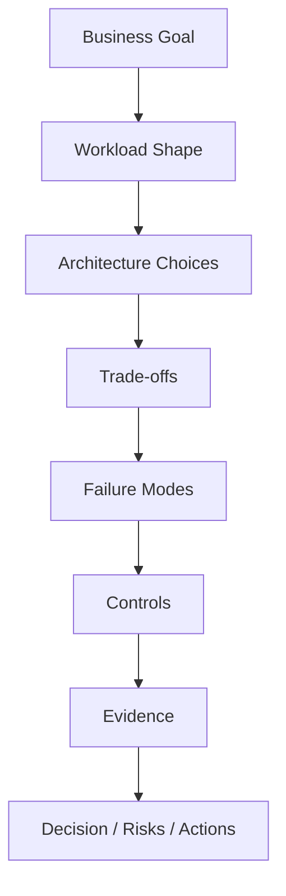

# Part 095 — Architecture Review Playbook

This playbook helps you review AWS containers and serverless architectures like a senior/staff/principal engineer.

The goal is not to “approve diagrams.”

The goal is to expose hidden risk before production exposes it for you.

A good architecture review answers:

```txt
What problem are we solving?
What are the workload boundaries?
Where are the hard guarantees?
Where can the system fail?
How do we recover?
How do we know?
How do we evolve?
```

This playbook is intentionally practical.

Use it for:

- design review;
- pre-launch review;
- migration review;
- incident follow-up;
- Well-Architected review preparation;
- architecture decision records;
- interview/system design practice;
- platform governance.

---

## 1. Architecture Review Mental Model

Architecture review is risk discovery.



A weak review asks:

```txt
Which AWS services are used?
```

A strong review asks:

```txt
What failure does each boundary absorb, and what evidence proves the boundary works?
```

### Review Output

Every review should produce:

- decisions;
- accepted risks;
- blockers;
- action items;
- evidence required;
- follow-up date.

If a review only produces conversation, it is not complete.

---

## 2. Review Types

Different reviews need different depth.

### Concept Review

Early-stage.

Focus:

- workload shape;
- compute placement;
- major boundaries;
- data ownership;
- viability;
- obvious risks.

### Detailed Design Review

Before build.

Focus:

- API contracts;
- event contracts;
- data model;
- IAM model;
- deployment;
- observability;
- failure handling.

### Production Readiness Review

Before launch.

Focus:

- evidence;
- runbooks;
- load test;
- failure drills;
- security review;
- cost model;
- rollback.

### Migration Review

Before changing existing production behavior.

Focus:

- compatibility;
- dual-write risk;
- outbox/CDC;
- cutover;
- rollback;
- reconciliation.

### Incident Architecture Review

After incident.

Focus:

- why design allowed incident;
- missing boundary;
- missing signal;
- missing control;
- platform guardrail.

Do not use a 3-hour production checklist for a 30-minute concept review.

Match review depth to risk.

---

## 3. Workload Framing

Start with business framing.

Ask:

```txt
What is the business capability?
Who are the users?
What is critical?
What is not critical?
What is the expected load?
What is the worst-case load?
What data is sensitive?
What is the cost of failure?
```

### Workload Summary Template

```yaml
workload:
  name:
  businessCapability:
  users:
  ownerTeam:
  criticality:
  environment:
  dataClassification:
  regions:
  accounts:
  entrypoints:
  upstreamDependencies:
  downstreamDependencies:
  expectedTraffic:
  peakTraffic:
  launchDate:
```

### Common Mistake

Teams start with:

```txt
API Gateway + Lambda + DynamoDB
```

before stating:

```txt
what the workflow must guarantee
```

Architecture begins with guarantees, not services.

---

## 4. Workload Shape Classification

Classify workload shape.

| Shape | Typical Fit |
|---|---|
| request/response API | API Gateway/ALB + Lambda/ECS |
| async job | SQS + Lambda/ECS/Fargate |
| event fanout | EventBridge/SNS + SQS per consumer |
| workflow/saga | Step Functions |
| file processing | S3 + SQS + Lambda/ECS |
| streaming | Kinesis/MSK + Lambda/ECS/EKS |
| scheduled task | EventBridge Scheduler + Lambda/ECS/Step Functions |
| long-running service | ECS/EKS/App Runner |
| low-latency internal service | ECS/EKS/internal ALB/VPC Lattice |
| heavy CPU/native dependency | ECS/Fargate/EKS/Batch |

### Review Question

```txt
Does the chosen runtime match the workload shape, or is the team forcing a favorite compute model?
```

### Red Flag

Everything is Lambda.

Or everything is Kubernetes.

Top-tier design chooses compute by contract.

---

## 5. Compute Placement Review

Ask for every compute unit:

```txt
Why Lambda?
Why ECS/Fargate?
Why EKS?
Why Step Functions?
Why not a queue?
Why not direct integration?
```

### Lambda Fit

Good for:

- bounded short work;
- event handlers;
- API adapters;
- glue;
- fanout consumers;
- bursty work;
- scheduled small tasks.

Risky for:

- long-running jobs;
- heavy native dependencies;
- sustained high-throughput work with stable container economics;
- connection-heavy RDS access without control;
- workflows hidden in chained functions.

### ECS/Fargate Fit

Good for:

- long-running jobs;
- worker processes;
- native binaries;
- PDF/rendering/ML-ish tasks;
- sustained throughput;
- controlled concurrency;
- polling/outbox publishers;
- services needing process lifecycle.

Risky for:

- tiny rare event handlers;
- teams without container release discipline;
- workloads that could use direct managed integration.

### EKS Fit

Good for:

- Kubernetes platform requirements;
- operators/controllers;
- service mesh;
- advanced scheduling;
- existing mature Kubernetes team.

Risky for:

- “advanced” aesthetics;
- simple workloads better served by ECS/Fargate/Lambda.

### Step Functions Fit

Good for:

- visible workflow state;
- retries/catches;
- saga orchestration;
- human approval;
- long-running process;
- task coordination.

Risky for:

- trivial two-step glue where direct integration or code is simpler;
- high-volume tiny state transitions without cost review;
- using workflow to hide poor domain boundaries.

---

## 6. Boundary Review

A production architecture is a set of boundaries.

Review each boundary:

```txt
API boundary
queue boundary
event boundary
workflow boundary
data boundary
network boundary
identity boundary
deployment boundary
observability boundary
```

### Boundary Checklist

For each boundary, ask:

- what contract crosses it?
- who owns it?
- is it synchronous or asynchronous?
- what happens on timeout?
- what happens on retry?
- is it idempotent?
- is it observable?
- is it secured?
- is there a failure destination?
- can it be versioned?
- can it be rolled back?

### Example

Boundary:

```txt
Order API -> SQS Payment Queue
```

Questions:

- what is message schema?
- is message durable after API returns?
- is job state source of truth?
- what if `SendMessage` fails?
- what if message is duplicated?
- what if queue backlog is high?
- who owns DLQ?
- how is redrive performed?

Boundaries are where production incidents happen.

---

## 7. API Design Review

For each API:

- route;
- method;
- auth;
- authorization;
- request schema;
- response schema;
- idempotency;
- timeout;
- rate limit;
- error envelope;
- observability;
- backward compatibility.

### API Checklist

- [ ] Public routes authenticated.
- [ ] Domain authorization server-side.
- [ ] Request validation.
- [ ] Stable error codes.
- [ ] Idempotency for commands.
- [ ] Correlation ID.
- [ ] No long synchronous work.
- [ ] Timeout budget smaller than platform timeout.
- [ ] Rate limiting/backpressure.
- [ ] Access logs.
- [ ] Canary/rollback.

### Red-Team Questions

- Can caller spoof tenant ID?
- Can same command create duplicate resource?
- What happens if client retries after timeout?
- What happens if downstream is slow?
- Does API return 200 before durable state?
- Can one route overload database?
- Are 4xx vs 5xx meaningful?

---

## 8. Async Design Review

For every async path:

```txt
producer -> durable state? -> queue/event -> consumer -> side effect
```

Ask:

- is producer durable before response?
- is queue/event the source of truth or delivery mechanism?
- is consumer idempotent?
- is retry bounded?
- is DLQ configured?
- is DLQ alarmed?
- is redrive tested?
- is message schema versioned?
- is ordering required?
- is poison message classified?
- is queue age SLO defined?

### Async Checklist

- [ ] Message schema documented.
- [ ] Event ID/message ID.
- [ ] Correlation ID.
- [ ] Tenant/resource ID.
- [ ] Idempotency key.
- [ ] DLQ.
- [ ] Alarm on age/DLQ.
- [ ] Visibility timeout appropriate.
- [ ] Consumer timeout lower than visibility.
- [ ] Partial batch response for Lambda SQS where appropriate.
- [ ] Max concurrency protects downstream.
- [ ] Redrive runbook.

### Red Flag

Queue exists but state does not.

If message is lost/stuck, business state cannot reconstruct work.

For critical workflows, durable state/outbox matters.

---

## 9. Event-Driven Review

Event-driven architecture fails when facts, commands, and side effects are mixed.

### Event Questions

- Is this a fact or a command?
- Who owns the event?
- Is schema versioned?
- Is event immutable?
- Is event replay-safe?
- Are consumers idempotent?
- Are event rules tested?
- Are critical targets buffered by SQS?
- Is archive/replay needed?
- Is fanout cost understood?
- Are events sensitive?

### Event Envelope

```json
{
  "source": "com.example.orders",
  "detail-type": "OrderPlaced",
  "detail": {
    "schemaVersion": "1.0",
    "eventId": "evt-123",
    "correlationId": "corr-456",
    "tenantId": "tenant-1",
    "aggregateId": "ord-789",
    "occurredAt": "2026-07-06T10:00:00Z"
  }
}
```

### Review Anti-Pattern

```txt
OrderService publishes "DoPaymentNow" as event.
```

That is a command.

Use command queue or workflow task.

Events say what happened.

Commands ask something to happen.

---

## 10. Workflow/Saga Review

For Step Functions or saga workflows, ask:

- why orchestration instead of choreography?
- what is the source of truth?
- what are retryable vs permanent failures?
- what are compensation steps?
- what happens to in-flight execution during deployment?
- are task inputs versioned?
- is workflow state too large?
- are timeouts set?
- is redrive/restart safe?
- is execution name deterministic?
- is cost of transitions acceptable?

### Saga Checklist

- [ ] Business states defined.
- [ ] Retry policy per error.
- [ ] Catch path per permanent error.
- [ ] Compensation logic.
- [ ] Idempotent tasks.
- [ ] Execution naming.
- [ ] Observability.
- [ ] Version/alias strategy.
- [ ] Runbook for failed execution.
- [ ] Reconciliation process.

### Red-Team Question

```txt
If task C succeeds but task D fails permanently, what state is the business entity in and who repairs it?
```

---

## 11. Data Ownership Review

Data ownership is one of the biggest architecture risks.

Ask:

- Which service owns each table/bucket/index?
- Which component writes it?
- Which components read it?
- Are writes shared?
- Is there a transaction boundary?
- Are read models derived?
- Is schema migration safe?
- Is backup/restore defined?
- Is tenant isolation defined?
- Is retention defined?

### Ownership Matrix

| Data Store | Owner | Writers | Readers | Source of Truth? |
|---|---|---|---|---|
| Orders DB | order-service | order API/payment worker | query API/projection | yes |
| Inventory Table | inventory-service | inventory consumer | order saga | yes |
| Search Index | projection-service | projection consumer | search API | no |
| Audit Store | audit-service | audit consumer | compliance/support | yes for audit |
| S3 Documents | document-service | upload/processor | API/processor | yes for objects |

### Red Flag

Many services write same table with no owner.

That is not microservices.

That is a distributed monolith with worse failure modes.

---

## 12. Consistency Review

Ask:

- What must be strongly consistent?
- What can be eventually consistent?
- What is the user experience during eventual consistency?
- What conflict is possible?
- What reconciliation exists?
- Are conditional writes used?
- Is dual-write avoided?
- Is outbox needed?
- Is CDC/replay needed?

### Patterns

| Need | Pattern |
|---|---|
| DB + event atomicity | transactional outbox |
| cross-service business process | saga |
| duplicate safety | idempotency |
| derived query | read model/projection |
| migration safety | expand/contract |
| eventual repair | reconciliation job |
| ambiguous external state | provider lookup + unknown state |

### Red-Team Question

```txt
If DB write succeeds but event publish fails, how is the system repaired?
```

If answer is “that probably won't happen,” review fails.

---

## 13. Idempotency Review

Every retryable side effect needs idempotency.

Ask:

- Which commands can be retried?
- Which messages can be duplicated?
- Which events can be replayed?
- Which external calls can timeout ambiguously?
- What is the idempotency key?
- Where is idempotency state stored?
- How long is it retained?
- What happens if same key different payload?
- Is idempotency tested under concurrency?

### Idempotency Key Examples

```txt
tenantId + operation + clientCommandId
bucket + key + versionId + processorVersion
eventId + consumerName
orderId + paymentAttempt
jobId + workerVersion
```

### Idempotency Checklist

- [ ] Stable key.
- [ ] Request hash.
- [ ] Completed result cache.
- [ ] Conflict detection.
- [ ] TTL/retention.
- [ ] Conditional write.
- [ ] Duplicate metrics.
- [ ] Concurrent duplicate test.
- [ ] Replay test.

### Red Flag

Using random UUID generated inside handler as idempotency key.

That does not deduplicate retries.

---

## 14. Failure Mode Review

For every critical component, ask:

```txt
What if it fails?
What if it is slow?
What if it succeeds but response is lost?
What if it is duplicated?
What if it receives old schema?
What if deployment changes behavior?
```

### Failure Mode Table

| Component | Failure | Control | Evidence |
|---|---|---|---|
| API Lambda | timeout | timeout budget + idempotency | integration test |
| SQS consumer | poison message | DLQ + classification | DLQ drill |
| ECS worker | task killed | visibility timeout + idempotency | task kill drill |
| EventBridge target | delivery fail | target DLQ + alarm | synthetic event |
| Step Functions task | permanent failure | catch path | failure drill |
| DynamoDB | conditional conflict | state machine/409 | concurrency test |
| Payment provider | timeout ambiguous | unknown state + lookup | provider failure drill |

### Review Standard

Every high-risk failure must have:

```txt
control + observability + runbook + evidence
```

If one is missing, create action item.

---

## 15. Security Review

Review security as part of architecture, not after.

### Questions

- What are trust boundaries?
- How is caller authenticated?
- How is domain authorization enforced?
- Which runtime role performs which side effect?
- Are resource policies scoped?
- Are secrets handled safely?
- What data is sensitive?
- How is tenant isolation tested?
- Are DLQs/events/logs protected?
- Is supply chain controlled?
- Is incident detection enabled?

### Security Checklist

- [ ] Auth on public APIs.
- [ ] Server-side authorization.
- [ ] Role per function/task.
- [ ] IAM scoped by resource.
- [ ] Resource policies scoped by SourceArn/SourceAccount.
- [ ] KMS policy reviewed.
- [ ] Secrets Manager/SSM.
- [ ] No secrets in logs/events.
- [ ] S3 Block Public Access.
- [ ] Container image scanning.
- [ ] Lambda code signing where required.
- [ ] GuardDuty/Inspector/Security Hub.
- [ ] Negative access tests.

### Red-Team Questions

- If this Lambda role is compromised, what can it access?
- If queue policy is abused, can attacker inject work?
- If EventBridge replay is triggered, can it duplicate payments?
- Can support/admin read all tenant data?
- Are DLQs treated as sensitive data stores?

---

## 16. Observability Review

Ask:

- Can we trace a business operation end to end?
- What is the correlation ID?
- What logs contain it?
- What metrics define success?
- What alarms page?
- What dashboards exist?
- Are deployment/config versions visible?
- Can we find last durable successful boundary?
- Are DLQs visible?
- Are cost anomalies visible?

### Observability Checklist

- [ ] Structured JSON logs.
- [ ] Correlation ID propagated.
- [ ] Business IDs logged safely.
- [ ] Custom metrics for outcomes.
- [ ] Queue age/DLQ metrics.
- [ ] Workflow duration/failure.
- [ ] ECS task version/image digest.
- [ ] Lambda version/alias.
- [ ] AppConfig version.
- [ ] Logs Insights queries.
- [ ] SLO dashboard.
- [ ] Alarm runbook links.

### Red Flag

Dashboard shows only infrastructure metrics:

```txt
CPU, memory, Lambda errors
```

but not:

```txt
orders completed, documents processed, reports stuck, audit missing
```

Business outcome observability matters.

---

## 17. Performance Review

Ask:

- What is expected and peak load?
- What is p95/p99 latency target?
- What is queue completion target?
- What is concurrency cap?
- What is downstream capacity?
- What happens during spike?
- What is cold start impact?
- What is ECS task right-size?
- What is DynamoDB/RDS bottleneck?
- What load test proves it?

### Scaling Checklist

- [ ] API latency SLO.
- [ ] Lambda reserved concurrency where needed.
- [ ] SQS event max concurrency.
- [ ] ECS max tasks based on downstream.
- [ ] Queue age alarm.
- [ ] Step Functions Map concurrency cap.
- [ ] RDS connection budget.
- [ ] DynamoDB key distribution.
- [ ] Load test report.
- [ ] Overload behavior.

### Red-Team Question

```txt
If traffic increases 10x in 5 minutes, which component fails first and how is damage bounded?
```

If nobody knows, load testing is needed.

---

## 18. Cost Review

Ask:

- What is cost per business outcome?
- What are top cost drivers?
- Are tags complete?
- Are budgets/anomalies configured?
- Does failure amplify cost?
- Are logs controlled?
- Is provisioned concurrency justified?
- Are ECS min tasks justified?
- Is NAT/data transfer reviewed?
- Are Step Functions transitions justified?
- Is fanout cost owned?

### Cost Checklist

- [ ] Cost allocation tags.
- [ ] Unit economics.
- [ ] Budget/anomaly.
- [ ] Log retention.
- [ ] Log volume review.
- [ ] Retry/fanout cost review.
- [ ] ECS/Fargate right-size.
- [ ] Lambda memory tuning.
- [ ] S3 lifecycle.
- [ ] DynamoDB Query not Scan.
- [ ] NAT/endpoints evaluated.

### Red-Team Question

```txt
If a poison message retries 5 times across 10 consumers, how much cost is generated without business value?
```

Cost and reliability are connected.

---

## 19. Deployment Review

Ask:

- Is deployment automated?
- Are artifacts immutable?
- Does prod use Lambda aliases?
- Are container images deployed by digest?
- Is rollback tested?
- Are EventBridge rules tested?
- Are Step Functions changes versioned?
- Are migrations expand/contract?
- Are config changes validated?
- Are deployment alarms meaningful?

### Deployment Checklist

- [ ] Build once, promote same artifact.
- [ ] Lambda version/alias.
- [ ] ECS image digest.
- [ ] SAM/CodeDeploy/canary or equivalent.
- [ ] ECS rolling/blue-green/circuit breaker.
- [ ] EventBridge rule pattern tests.
- [ ] Step Functions contract tests.
- [ ] AppConfig validators.
- [ ] Release manifest.
- [ ] Rollback drill.
- [ ] Deployment version in logs.

### Red Flag

Manual console deploy to production.

That is an incident waiting.

---

## 20. DR and Multi-Region Review

Ask:

- What is RTO/RPO by workflow?
- Are artifacts replicated?
- Are state stores replicated/restorable?
- Are queues regional?
- What happens to in-flight messages?
- Are Step Functions executions regional?
- Are secrets/KMS/config in secondary?
- How is split brain prevented?
- Has failover been tested?
- Has failback been tested?
- Is reconciliation implemented?

### DR Checklist

- [ ] RTO/RPO per workflow.
- [ ] ECR/Lambda artifacts replicated.
- [ ] Secondary resources pre-created.
- [ ] DynamoDB/S3/RDS strategy.
- [ ] EventBridge global/cross-region strategy.
- [ ] Regional SQS/DLQs.
- [ ] Queue reconstruction from durable state.
- [ ] Step Functions restart/reconciliation.
- [ ] Failover runbook.
- [ ] Failback runbook.
- [ ] Split-brain fence.
- [ ] Drill evidence.

### Red-Team Question

```txt
If primary Region fails after API accepted job but before worker processed queue message, can secondary recover the job?
```

---

## 21. Governance Review

Ask:

- Does workload use golden path?
- Are tags/owners present?
- Are policy checks passing?
- Are Config findings clean?
- Are exceptions documented?
- Is scorecard current?
- Are runbooks linked?
- Are cost/security findings tracked?
- Is platform inventory accurate?

### Governance Checklist

- [ ] Owner tags.
- [ ] Cost tags.
- [ ] Data classification.
- [ ] Policy-as-code passed.
- [ ] Config compliance.
- [ ] Security Hub/Inspector findings triaged.
- [ ] Exceptions with expiry.
- [ ] Scorecard.
- [ ] Developer portal metadata.
- [ ] Runbook links.

### Red Flag

“Platform exception” with no expiry.

Temporary exceptions become permanent architecture debt.

---

## 22. Architecture Decision Records

Use ADRs.

### ADR Template

```md
# ADR-0007: Use SQS Between EventBridge and Payment Worker

## Status
Accepted

## Context
Payment provider has rate limits and ambiguous timeout behavior.
Payment worker must be paced and retried safely.

## Decision
Route OrderPlaced events from EventBridge to PaymentQ.
Payment worker consumes SQS with max concurrency 10.
Payment state and provider idempotency key are stored in Orders DB.

## Consequences
Pros:
- durable backlog
- DLQ/redrive
- downstream protection

Cons:
- eventual consistency
- additional operational queue

## Alternatives Considered
- EventBridge direct to Lambda
- Step Functions direct provider call
- synchronous API payment capture

## Evidence
- load test report
- provider timeout drill
- cost model
```

### ADR Rules

- record trade-offs;
- record rejected alternatives;
- include evidence;
- update when decision changes;
- link to runbook/tests.

ADRs are memory for future engineers.

---

## 23. Review Scoring

Score each dimension.

```txt
0 = missing / unknown
1 = designed but untested
2 = implemented and tested
3 = automated/governed/continuously validated
```

### Example

| Dimension | Score |
|---|---:|
| workload framing | 3 |
| compute placement | 2 |
| API contracts | 2 |
| async boundaries | 2 |
| idempotency | 2 |
| failure handling | 1 |
| observability | 2 |
| security | 2 |
| performance | 1 |
| cost | 1 |
| deployment | 2 |
| DR | 1 |
| governance | 2 |

### Risk Interpretation

| Score | Meaning |
|---:|---|
| 0 | blocker for critical workload |
| 1 | risk; needs evidence |
| 2 | acceptable with monitoring |
| 3 | strong control |

Do not average away critical risks.

One `0` in payment idempotency matters more than many `3`s.

---

## 24. Red-Team Question Bank

### General

- What is the source of truth?
- What happens when the first dependency times out?
- What state can be partially committed?
- What can be replayed?
- What can be duplicated?
- What can be lost?
- What is the rollback plan?
- What evidence proves it?

### Serverless

- What happens if Lambda is throttled?
- What happens if async invocation retries for hours?
- What happens if SQS visibility expires?
- What happens if EventBridge target fails?
- What happens if Step Functions task times out?
- What happens if cold starts spike p99?

### Containers

- What happens if ECS task is killed mid-job?
- What happens if image pull fails?
- What happens if worker cannot delete message?
- What happens if deployment starts bad tasks?
- What happens if connection pool exhausts DB?

### Data

- What if DB write succeeds but event publish fails?
- What if two Regions write same item?
- What if backfill partially fails?
- What if read model is stale?
- What if object exists but metadata missing?

### Security

- What can this role access if compromised?
- Can tenant ID be spoofed?
- Can events be injected?
- Can DLQ leak sensitive data?
- Can redrive duplicate harmful side effects?

### Cost

- What if recursive trigger happens?
- What if retry storm happens?
- What if DEBUG logs enabled?
- What if one tenant is noisy?
- What if provisioned concurrency idle?

These questions are uncomfortable by design.

---

## 25. Review Meeting Agenda

### 60-Minute Review

```txt
0–5 min: business goal and workload boundary
5–15 min: architecture diagram and flows
15–25 min: data/event contracts
25–35 min: failure modes and reliability
35–45 min: security and operations
45–55 min: cost/performance/deployment
55–60 min: decisions, risks, actions
```

### 120-Minute Review

Add:

- detailed data model;
- IAM/resource policy review;
- load/cost model;
- runbook walk-through;
- migration/rollback;
- threat model.

### Rule

End with explicit outcomes:

```txt
Approved
Approved with risks
Needs changes
Rejected
```

---

## 26. Common Review Anti-Patterns

### Anti-Pattern 1 — Diagram-Only Review

No contracts/failures.

### Anti-Pattern 2 — Service Shopping

“Use Lambda/SQS/EventBridge” without workload reasoning.

### Anti-Pattern 3 — Happy Path Bias

No timeout/duplicate/retry thought.

### Anti-Pattern 4 — Security at the End

IAM/data boundaries discovered too late.

### Anti-Pattern 5 — No Evidence Requirement

Claims not tested.

### Anti-Pattern 6 — Ignoring Cost Until Production

Retry/log/fanout cost surprises.

### Anti-Pattern 7 — No Decision Record

Same debates repeat later.

### Anti-Pattern 8 — Seniority Theater

Review becomes opinion contest.

### Anti-Pattern 9 — No Owner for Risks

Action items disappear.

### Anti-Pattern 10 — Review Blocks Everything

Review must improve speed and safety, not become bureaucracy.

---

## 27. Architecture Review Checklist

### Framing

- [ ] business capability.
- [ ] workload boundary.
- [ ] criticality.
- [ ] SLO/RTO/RPO.
- [ ] data classification.
- [ ] traffic/load.

### Design

- [ ] compute placement.
- [ ] API contracts.
- [ ] async boundaries.
- [ ] event contracts.
- [ ] workflow design.
- [ ] data ownership.
- [ ] consistency model.

### Operations

- [ ] idempotency.
- [ ] retries/DLQ/redrive.
- [ ] observability.
- [ ] alarms/runbooks.
- [ ] load test.
- [ ] failure drill.
- [ ] deployment/rollback.

### Security/Cost/Governance

- [ ] IAM/resource policies.
- [ ] tenant/data isolation.
- [ ] secrets/KMS.
- [ ] cost tags/unit economics.
- [ ] budgets/anomaly.
- [ ] policy-as-code.
- [ ] scorecard/risk register.

### Output

- [ ] decisions.
- [ ] ADRs.
- [ ] risks.
- [ ] action items.
- [ ] evidence required.
- [ ] next review date.

---

## 28. Final Mental Model

Architecture review is production risk debugging before production traffic.

A top-tier reviewer does not ask:

> “Does this diagram look good?”

They ask:

> “Where is the source of truth, what happens under retry/timeout/duplicate/replay/deployment failure, how is damage bounded, how is recovery performed, and what evidence proves it?”

That is architecture review at staff/principal level.

---

## References

- AWS Well-Architected Framework
- AWS Well-Architected Tool: custom lenses, milestones, and improvement plans
- AWS Well-Architected Serverless Applications Lens
- AWS Prescriptive Guidance: transactional outbox, saga, circuit breaker, and modernization design patterns
- AWS documentation for Lambda, ECS, EKS, Step Functions, EventBridge, SQS, SNS, DynamoDB, S3, API Gateway, IAM, KMS, CloudWatch, and AWS Config
