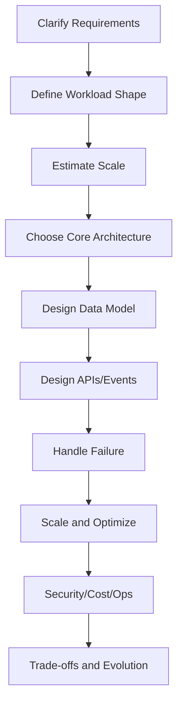
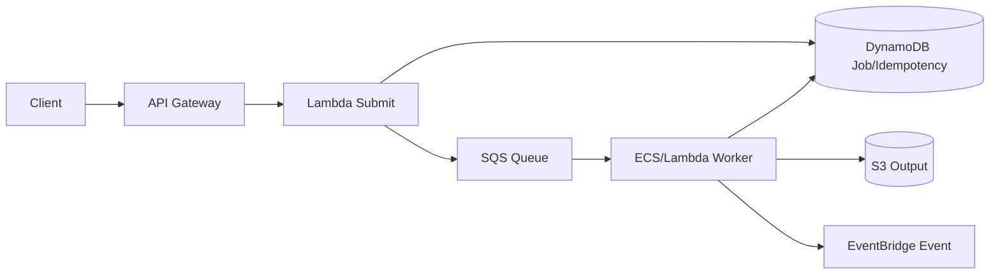
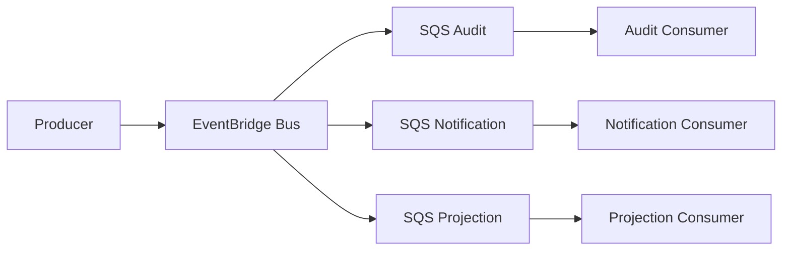
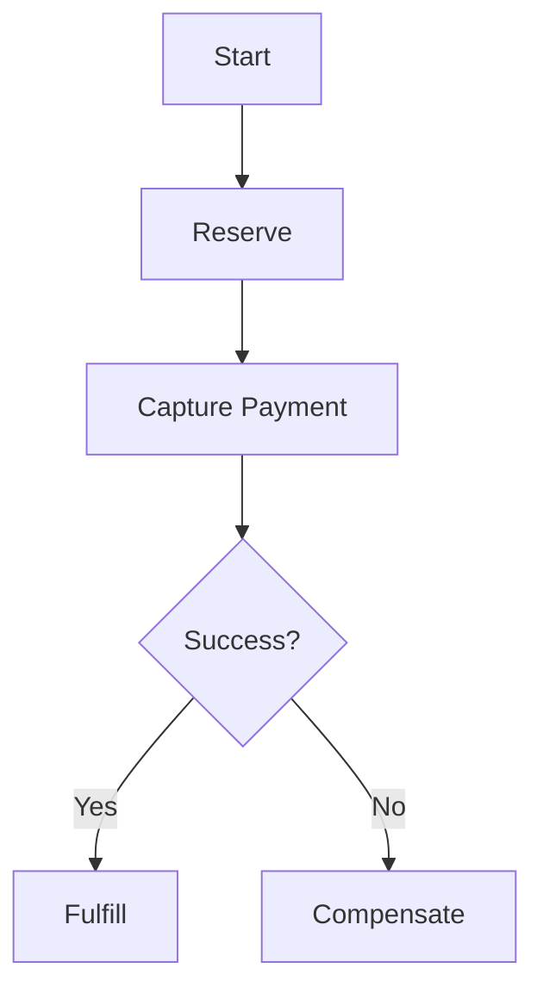
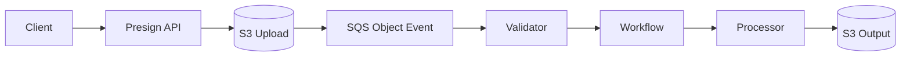

# Part 096 — System Design and Interview Playbook

This playbook helps you handle system design questions involving AWS containers and serverless.

It is useful for:

- senior software engineer interviews;
- staff/principal architecture interviews;
- internal design reviews;
- promotion packets;
- mentoring;
- whiteboard practice;
- architecture writing.

The goal is not to memorize AWS services.

The goal is to reason clearly.

A strong system design answer shows:

```txt
requirements
trade-offs
boundaries
failure modes
scaling model
security
operability
evolution path
```

A weak answer is a list of services.

---

## 1. Interview Mental Model

System design is structured decision-making under ambiguity.



The interviewer is evaluating:

- problem decomposition;
- correctness;
- trade-off clarity;
- operational maturity;
- communication;
- ability to handle change.

They are not just checking whether you know what EventBridge is.

---

## 2. The 7-Step Answer Framework

Use this framework.

```txt
1. Clarify requirements
2. Define workload shape and constraints
3. Propose high-level architecture
4. Deep dive critical path
5. Handle failure, consistency, and idempotency
6. Scale, secure, and operate
7. Summarize trade-offs and evolution
```

### Step 1 — Clarify Requirements

Ask:

- users?
- core actions?
- read/write ratio?
- latency target?
- async acceptable?
- consistency requirements?
- data sensitivity?
- expected scale?
- peak scale?
- regions?
- cost constraints?
- existing systems?

### Step 2 — Workload Shape

Classify:

- synchronous API;
- async job;
- event fanout;
- workflow/saga;
- streaming;
- file pipeline;
- long-running worker;
- scheduled job;
- multi-tenant SaaS.

### Step 3 — High-Level Architecture

Draw boxes and boundaries.

### Step 4 — Deep Dive

Pick the hardest path.

### Step 5 — Failure

Discuss retry, duplicate, timeout, DLQ, reconciliation.

### Step 6 — Scale/Security/Ops

Show production thinking.

### Step 7 — Trade-offs

Explain alternatives and why you chose one.

---

## 3. Clarifying Question Bank

### Product

- What is the primary user journey?
- What is the success metric?
- Is this customer-facing or internal?
- Are delays acceptable?
- What data must never be lost?
- What actions are irreversible?

### Scale

- daily/monthly active users?
- requests per second?
- peak traffic?
- item sizes?
- file sizes?
- events per second?
- job duration?
- retention period?

### Correctness

- exactly-once required, or at-least-once with idempotency?
- ordering required?
- strong consistency required?
- duplicate side effects acceptable?
- can user retry?
- can system reconcile later?

### Security/Compliance

- PII/payment/health/confidential data?
- tenant isolation?
- audit requirements?
- data residency?
- encryption needs?
- admin/support access?

### Operations

- RTO/RPO?
- SLO?
- on-call team?
- deployment frequency?
- budget?
- expected growth?

Ask enough, but do not spend entire interview on questions.

Make reasonable assumptions and state them.

---

## 4. Service Selection Cheat Sheet

### API Front Door

| Need | Option |
|---|---|
| serverless public API | API Gateway HTTP/REST API |
| container HTTP service | ALB |
| global edge/cache | CloudFront |
| service-to-service private | internal ALB, VPC Lattice, API Gateway private, Cloud Map |
| simple Lambda endpoint | Lambda Function URL with caution |

### Compute

| Need | Option |
|---|---|
| short event/API compute | Lambda |
| long worker/service | ECS/Fargate |
| Kubernetes platform | EKS |
| workflow orchestration | Step Functions |
| large batch/fanout | Step Functions Distributed Map, Batch, ECS/EKS |
| scheduled task | EventBridge Scheduler |

### Messaging

| Need | Option |
|---|---|
| durable queue/backpressure | SQS |
| simple fanout | SNS |
| event routing/filtering | EventBridge |
| streaming ordered/sharded | Kinesis/MSK |
| pub/sub with per-consumer isolation | EventBridge/SNS -> SQS |

### State

| Need | Option |
|---|---|
| key-value/serverless state | DynamoDB |
| relational transactions | Aurora/RDS |
| object/file data | S3 |
| search | OpenSearch |
| cache | ElastiCache |
| secrets | Secrets Manager/SSM |
| config/flags | AppConfig |

### Rule

Do not list services.

Explain why each service matches the workload contract.

---

## 5. Compute Placement Interview Heuristics

### When to Choose Lambda

Say:

```txt
I would use Lambda for bounded, event-driven/API adapter work where execution is short, scaling is bursty, and operational overhead should be low.
```

Mention:

- idempotency;
- timeout;
- cold start;
- concurrency cap;
- DLQ/destination;
- observability.

### When to Choose ECS/Fargate

Say:

```txt
I would use ECS/Fargate for long-running or sustained processing, native dependencies, custom process lifecycle, or worker services where queue polling and graceful shutdown matter.
```

Mention:

- task role;
- autoscaling by backlog;
- image digest;
- graceful shutdown;
- visibility timeout;
- cost right-sizing.

### When to Choose EKS

Say:

```txt
I would choose EKS if the organization needs Kubernetes primitives, controllers/operators, service mesh, advanced scheduling, or already has mature Kubernetes operations.
```

Mention:

- not default for simple workload;
- cluster operations;
- IRSA/Pod Identity;
- ingress;
- network policies;
- upgrades.

### When to Choose Step Functions

Say:

```txt
I would use Step Functions when workflow state, retries, compensation, auditability, and long-running orchestration matter more than hiding flow in code.
```

Mention:

- retry/catch;
- task idempotency;
- state size;
- cost per transition;
- versioning.

---

## 6. Diagram Templates

### Async API + Worker



Use for:

- report generation;
- file processing;
- email jobs;
- ML inference batch;
- media processing.

### Event-Driven Fanout



Use for:

- domain events;
- microservice side effects;
- SaaS metering;
- audit/search/notification.

### Workflow Saga



Use for:

- orders;
- payment;
- onboarding;
- long business process.

### File Pipeline



Use for:

- document processing;
- image/video;
- data ingestion.

---

## 7. Scaling Math

Interviewers like capacity thinking.

### API

If:

```txt
1000 RPS
p95 Lambda duration = 100ms
```

Estimated concurrency:

```txt
concurrency = RPS × durationSeconds
concurrency = 1000 × 0.1 = 100
```

Add headroom.

### Queue Worker

If:

```txt
10,000 jobs/hour
average job duration = 2 minutes
one job per worker
```

Jobs per second:

```txt
10000 / 3600 = 2.78 jobs/sec
```

Concurrency needed:

```txt
2.78 × 120 = 333.6 workers
```

Then check downstream capacity.

### SQS Drain

```txt
drain_rate = worker_count × jobs_per_worker / avg_duration
```

### Storage

If:

```txt
1M files/month
average 2MB
retention 12 months
```

Storage:

```txt
1M × 2MB × 12 = 24TB
```

### Event Fanout

If:

```txt
1M events/day
5 consumers
```

Deliveries:

```txt
5M consumer messages/day
```

Cost and capacity must include fanout multiplier.

---

## 8. Idempotency in Interviews

Always discuss idempotency for commands and async work.

### API Command

```txt
Idempotency-Key header
request hash
DynamoDB idempotency table
return cached result for duplicate
409 for same key different payload
```

### Worker

```txt
jobId as idempotency key
conditional status update
deterministic output key
delete SQS only after durable success
```

### Event Consumer

```txt
eventId + consumerName
upsert or conditional write
duplicate metric
```

### Payment/External Provider

```txt
provider idempotency key
unknown state on timeout
provider lookup/reconciliation
```

### Interview Phrase

```txt
Because SQS/EventBridge/Lambda retries are at-least-once, I would design consumers to be idempotent rather than claiming exactly-once delivery.
```

This is a strong signal.

---

## 9. Failure Modes to Mention

For any design, mention the important failures.

### API

- timeout;
- duplicate retry;
- auth failure;
- downstream slow;
- throttling;
- bad deployment.

### Queue

- backlog;
- poison message;
- DLQ;
- visibility timeout too short;
- duplicate delivery;
- consumer throttling.

### Worker

- crash mid-job;
- out-of-memory;
- dependency timeout;
- message deleted too early;
- output duplicated.

### Event

- rule mismatch;
- target policy deny;
- target DLQ;
- replay duplicates;
- schema evolution.

### Workflow

- task failure;
- retry storm;
- catch path;
- stuck execution;
- in-flight deployment compatibility.

### Data

- dual-write;
- hot partition;
- conditional conflict;
- stale read model;
- partial migration.

### External Provider

- rate limit;
- timeout ambiguity;
- webhook duplicate;
- inconsistent provider state.

You do not need to mention every failure, but mention the ones that define the system.

---

## 10. Security Points to Always Cover

### Identity and Auth

- API auth;
- domain authorization;
- tenant context;
- support/admin path.

### IAM

- least privilege;
- role per function/task;
- resource policies scoped;
- `iam:PassRole` controlled.

### Data Protection

- encryption;
- secrets manager;
- KMS policy;
- S3 Block Public Access;
- no secrets in logs/events.

### Supply Chain

- image scanning;
- Lambda code signing if critical;
- deploy by digest/version.

### Event/Queue Security

- queue policies;
- EventBridge bus policies;
- DLQ access restricted;
- replay/redrive permission restricted.

### Interview Phrase

```txt
I treat queues, events, DLQs, and logs as data stores, so I apply the same data classification and access controls to them.
```

Strong signal.

---

## 11. Observability Points to Always Cover

Mention:

- structured logs;
- correlation ID;
- business IDs;
- metrics for success/failure;
- queue age and DLQ alarms;
- workflow failures;
- deployment versions;
- dashboards;
- runbooks;
- tracing where useful;
- cost anomaly.

### Correlation Propagation

```txt
API header -> Lambda log context -> SQS attributes -> worker logs -> EventBridge detail -> consumer logs
```

### Business Metrics

For commerce:

```txt
OrdersPlaced
PaymentCaptured
PaymentUnknown
OrderSagaFailed
```

For document pipeline:

```txt
DocumentsProcessed
DocumentsRejected
ProcessingDuration
ObjectQueueAge
```

For SaaS:

```txt
TenantApiRequests
TenantJobBacklog
QuotaExceeded
MeteringEvents
```

Infrastructure metrics alone are insufficient.

---

## 12. Cost Points to Cover

Mention cost without overdoing it.

### Cost Drivers

- Lambda duration/memory/invocations;
- ECS/Fargate CPU/memory/runtime;
- Step Functions transitions;
- SQS/SNS/EventBridge volume;
- DynamoDB R/W/indexes;
- S3 storage/requests;
- CloudWatch logs/traces;
- NAT/data transfer;
- provisioned concurrency;
- retries/fanout.

### Unit Cost

```txt
cost per processed document
cost per order
cost per report
cost per tenant
```

### Cost Controls

- tags;
- budgets/anomaly;
- log retention;
- lifecycle;
- concurrency caps;
- memory/task right-sizing;
- direct integrations;
- queue fanout ownership.

### Interview Phrase

```txt
I would track cost per successful business operation, not only cost by AWS service, because retries and fanout can create spend without value.
```

Strong signal.

---

## 13. Trade-Off Communication

Use explicit trade-off language.

### Example: Lambda vs Fargate Worker

```txt
Lambda gives simpler operations and fast burst scaling for short jobs, but the job duration and native PDF dependencies make Fargate safer. I would keep the API submit path in Lambda and use SQS as the boundary so the worker runtime can evolve later.
```

### Example: EventBridge vs SNS

```txt
EventBridge gives richer event routing, schema-style domain events, archives/replay options, and decoupled consumers. SNS is simpler for direct pub/sub fanout. For domain events with multiple consumer teams, I prefer EventBridge plus SQS per consumer.
```

### Example: DynamoDB vs RDS

```txt
DynamoDB fits high-scale key-value access and conditional writes. RDS fits relational transactions and complex queries. For orders/payments, I might use RDS for transaction consistency and DynamoDB for idempotency/read models.
```

### Pattern

```txt
Option A optimizes X but risks Y.
Option B optimizes Y but costs Z.
Given requirement R, I choose B and mitigate Z with M.
```

This is how senior engineers communicate.

---

## 14. Example Prompt 1 — Design Async Report Generation

### Prompt

Design a system where users request reports that may take several minutes to generate.

### Requirements

- API returns quickly;
- reports can take 1–10 minutes;
- users can query status;
- report generated as PDF;
- avoid duplicate reports;
- support 10,000 reports/hour peak.

### Strong Design

```txt
API Gateway -> Lambda SubmitReport -> DynamoDB Job/Idempotency -> SQS ReportQueue -> ECS/Fargate ReportWorker -> S3 Output -> DynamoDB status -> EventBridge ReportGenerated -> notification/audit consumers
```

### Why

- API stays fast;
- SQS provides backlog;
- Fargate handles long/native PDF generation;
- DynamoDB stores job state;
- S3 stores output;
- EventBridge decouples side effects.

### Deep Dive

- idempotency key for submit;
- deterministic output key;
- SQS visibility timeout > job p99;
- worker graceful shutdown;
- delete message after durable success;
- autoscale ECS by backlog per task;
- DLQ/redrive;
- status API with presigned URL;
- cost per report.

### Failure

- worker killed mid-job -> message retries;
- duplicate message -> conditional status/idempotency;
- S3 write succeeds but DB update fails -> deterministic output + reconciliation;
- notification fails -> notification queue DLQ, report still generated.

---

## 15. Example Prompt 2 — Design File Upload Processing

### Prompt

Users upload large files and system validates/processes them asynchronously.

### Strong Design

```txt
CreateUpload API -> presigned S3 URL
Client -> S3
S3 ObjectCreated -> SQS ObjectQueue
ObjectValidator Lambda -> Step Functions DocumentWorkflow
Workflow -> Lambda/ECS processing tasks
Output -> S3
State -> DynamoDB
EventBridge -> audit/notification/projection queues
```

### Key Points

- no file bytes through API Lambda;
- server-generated S3 keys;
- SQS buffer for object events;
- idempotency by bucket/key/version;
- workflow for multi-step processing;
- output prefix separate from input;
- recursive trigger guard;
- DLQ;
- status API.

### Scaling

- S3 upload scales;
- validator Lambda concurrency capped;
- workflow Map/ECS task concurrency capped;
- queue age SLO;
- object size affects processing runtime/cost.

### Security

- presigned URL short-lived;
- tenant prefix;
- S3 Block Public Access;
- KMS;
- malware scan if required;
- no raw sensitive file content in logs/events.

---

## 16. Example Prompt 3 — Design Event-Driven Order System

### Prompt

Design an order system that processes orders, payments, inventory, and notifications.

### Strong Design

```txt
Order API -> RDS transaction + outbox
Outbox publisher -> EventBridge
OrderPlaced -> PaymentQ / InventoryQ / AuditQ
Payment Worker -> Provider + DB + outbox
Order Saga -> Step Functions
EventBridge -> notifications/projections/audit
```

### Key Points

- transactional outbox solves dual-write;
- payment idempotency key;
- provider timeout ambiguous state;
- inventory conditional writes;
- saga for payment/inventory/fulfillment;
- SQS per consumer;
- audit critical;
- replay-safe consumers.

### Failure

- provider timeout -> unknown + lookup;
- event publish failure -> outbox retry;
- duplicate event -> consumer idempotency;
- bad worker deployment -> rollback task definition and queue remains durable.

### Senior Signal

Discuss compensation and reconciliation.

---

## 17. Example Prompt 4 — Design Multi-Tenant SaaS

### Prompt

Design a SaaS platform for multiple enterprise tenants with APIs, jobs, files, and billing.

### Strong Design

```txt
Control Plane:
  Tenant Registry + Provisioning Workflow + Entitlements + Metering

Data Plane:
  API Gateway/ALB + Lambda/ECS + tenant resolver
  pooled/siloed DynamoDB/RDS/S3
  SQS/EventBridge tenant-aware messages
  metering consumers
```

### Key Points

- tenant context from trusted auth/domain;
- pooled/bridge/silo model;
- tenant registry;
- quotas/noisy-neighbor controls;
- per-tenant observability/support view;
- metering idempotency;
- tenant migration workflow;
- negative isolation tests.

### Senior Signal

Say:

```txt
Tenant isolation must be proven across API, data, events, files, jobs, logs, metrics, billing, and support operations.
```

---

## 18. Example Prompt 5 — Design Notification Platform

### Prompt

Design a platform to send email/SMS/push notifications triggered by many services.

### Strong Design

```txt
Domain Events -> EventBridge
NotificationRequested -> SQS Notification Queue
Notification Worker/Lambda -> provider
DynamoDB notification idempotency/status
DLQ + redrive
Template store/config
Provider webhook -> webhook queue -> status update
```

### Key Points

- channel-specific queues;
- provider rate limits;
- idempotency by notification ID + recipient;
- template versioning;
- user preferences;
- unsubscribe/compliance;
- provider timeout/duplicate webhook;
- cost controls for SMS;
- DLQ redrive safety.

### Trade-Off

Lambda works for bursty send.

ECS worker may fit high-volume sustained provider integration with rate limiting.

---

## 19. Example Prompt 6 — Design Internal Developer Platform

### Prompt

Design a platform that lets teams launch serverless/container services safely.

### Strong Design

```txt
Developer Portal/CLI -> Golden Path Templates -> Repo/PR -> CI/CD -> IaC Modules -> AWS Accounts
Runtime Governance -> Config/Security Hub/Scorecard -> Feedback Loop
```

### Key Points

- account vending;
- golden paths;
- Service Catalog/portal;
- policy-as-code;
- Config conformance packs;
- reusable modules;
- CI templates;
- scorecards;
- exception process;
- platform KPIs.

### Senior Signal

Platform is a product:

```txt
make the safe path the easy path
```

---

## 20. Interview Scoring Rubric

### Junior/Mid-Level

- can draw basic architecture;
- knows main services;
- handles simple scaling;
- mentions basic security;
- limited failure depth.

### Senior

- clear requirements;
- good service selection;
- async boundaries;
- idempotency;
- DLQs;
- observability;
- deployment/rollback;
- cost awareness;
- trade-offs.

### Staff/Principal

- business guarantees;
- data ownership;
- consistency model;
- failure-mode analysis;
- migration/evolution;
- platform/governance;
- organizational trade-offs;
- evidence-driven decisions;
- risk articulation.

### What Differentiates Top 1%

They ask:

```txt
What must be true for the business?
What is the source of truth?
Where are ambiguous failures?
How do we prove recovery?
How does this evolve safely?
```

Not:

```txt
Which AWS service is trendy?
```

---

## 21. Common Interview Anti-Patterns

### Anti-Pattern 1 — Jumping to Services

No requirements.

### Anti-Pattern 2 — Synchronous Everything

Long operations block API.

### Anti-Pattern 3 — “Exactly Once” Claim

Distributed systems retry. Use idempotency.

### Anti-Pattern 4 — No Failure Modes

Happy-path only.

### Anti-Pattern 5 — No Data Ownership

Every service touches same DB.

### Anti-Pattern 6 — No Security/Tenant Isolation

Risk ignored.

### Anti-Pattern 7 — No Observability

Cannot operate design.

### Anti-Pattern 8 — No Cost Awareness

Design may be unaffordable.

### Anti-Pattern 9 — No Trade-Offs

One design presented as perfect.

### Anti-Pattern 10 — Overusing EKS

Kubernetes used without need.

---

## 22. Whiteboard Time Management

For a 45-minute interview:

```txt
0–5 min: clarify requirements
5–10 min: high-level architecture
10–20 min: critical path deep dive
20–30 min: data model and failure handling
30–38 min: scaling/security/observability
38–43 min: trade-offs/evolution
43–45 min: summary
```

### If Time Is Short

Prioritize:

1. core requirements;
2. main architecture;
3. one critical path;
4. failure/idempotency;
5. scaling/security.

Do not spend 20 minutes discussing API JSON shape.

---

## 23. Answer Templates

### Opening

```txt
I'll first clarify the core workflow and correctness requirements, then propose a high-level architecture, then deep dive the riskiest path: retries, idempotency, failure handling, scaling, and operations.
```

### Service Choice

```txt
I am choosing SQS here because this boundary needs durable backpressure and redrive. EventBridge is still useful for domain routing, but I would place SQS in front of each critical consumer so one consumer's failure does not block others.
```

### Failure Handling

```txt
Since this is async and at-least-once, every consumer will be idempotent. The source of truth is the job table, and the queue is a delivery mechanism. If a message is lost or stuck, reconciliation can recreate work from durable state.
```

### Trade-Off Summary

```txt
The main trade-off is operational complexity versus safety. The queue/outbox/workflow adds components, but they provide recovery, replay, and explicit failure handling, which is necessary because duplicate or lost side effects are unacceptable.
```

### Final Summary

```txt
The design meets the API latency target by accepting work quickly, uses SQS for backpressure, uses the right compute for the job shape, stores durable state for recovery, makes all retries idempotent, and provides alarms/runbooks for backlog, DLQ, and failed workflows.
```

---

## 24. Practice Prompts

Use these prompts.

### Containers + Serverless

1. Design async PDF report generation.
2. Design file upload and malware scanning.
3. Design order/payment processing.
4. Design customer notification platform.
5. Design SaaS tenant onboarding.
6. Design real-time audit event pipeline.
7. Design webhook ingestion platform.
8. Design video/image processing workflow.
9. Design scheduled billing reconciliation.
10. Design multi-region failover for document processing.

### Deep-Dive Follow-Ups

- How do you avoid duplicate payment?
- How do you redrive DLQ safely?
- How do you prevent noisy tenant?
- How do you migrate Lambda worker to Fargate?
- How do you support replay?
- How do you handle provider timeout?
- How do you prevent recursive S3 trigger?
- How do you estimate cost?
- How do you test failover?
- How do you deploy safely?

Practice answering follow-ups.

They separate memorized diagrams from real architecture skill.

---

## 25. System Design Self-Review Checklist

After answering, check:

### Requirements

- [ ] clarified users and operations.
- [ ] stated assumptions.
- [ ] defined SLO/scale.
- [ ] identified critical correctness.

### Architecture

- [ ] high-level diagram.
- [ ] service choices justified.
- [ ] sync vs async boundaries.
- [ ] data stores selected.
- [ ] APIs/events defined.

### Correctness

- [ ] idempotency.
- [ ] retries.
- [ ] DLQs.
- [ ] data consistency.
- [ ] failure modes.
- [ ] reconciliation.

### Operations

- [ ] observability.
- [ ] alarms.
- [ ] runbooks.
- [ ] deployment/rollback.
- [ ] security.
- [ ] cost.

### Communication

- [ ] trade-offs.
- [ ] alternatives.
- [ ] evolution path.
- [ ] concise summary.

---

## 26. Final Mental Model

System design interviews are not AWS trivia.

They are an opportunity to demonstrate engineering judgment.

A strong answer uses AWS services as tools to satisfy workload contracts:

```txt
latency
durability
idempotency
isolation
scaling
security
operability
cost
evolution
```

A top-tier engineer does not say:

> “Use Lambda, SQS, and DynamoDB.”

They say:

> “The API accepts the command durably and returns fast, the queue absorbs backpressure, workers are idempotent because delivery is at-least-once, the state table is the source of truth, DLQs and reconciliation handle failure, and the design can evolve from Lambda to Fargate behind the same message contract.”

That is system design mastery.

---

## References

- AWS Well-Architected Framework
- AWS Well-Architected Serverless Applications Lens
- AWS Prescriptive Guidance: cloud design patterns, transactional outbox, saga, and circuit breaker
- AWS documentation for Lambda, ECS/Fargate, EKS, Step Functions, EventBridge, SQS, SNS, DynamoDB, S3, API Gateway, IAM, KMS, CloudWatch, and AppConfig
