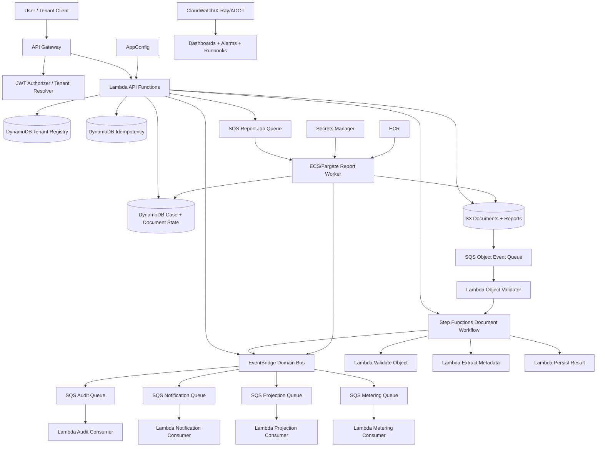
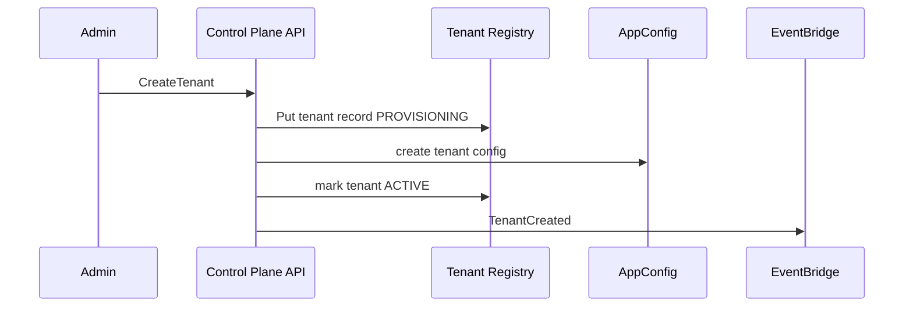
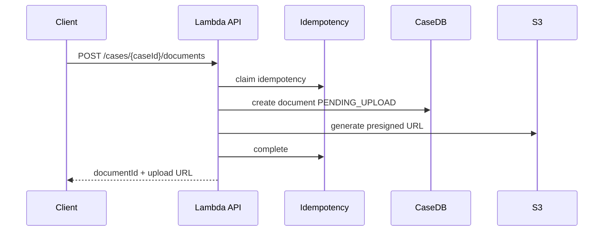
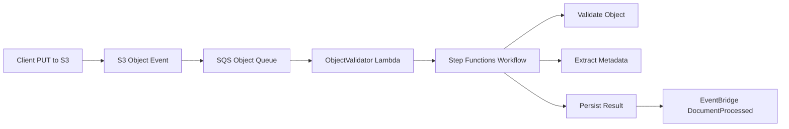
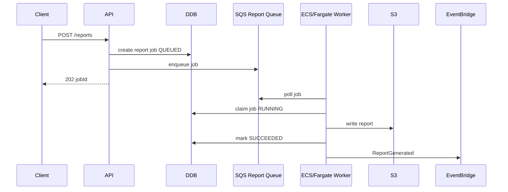
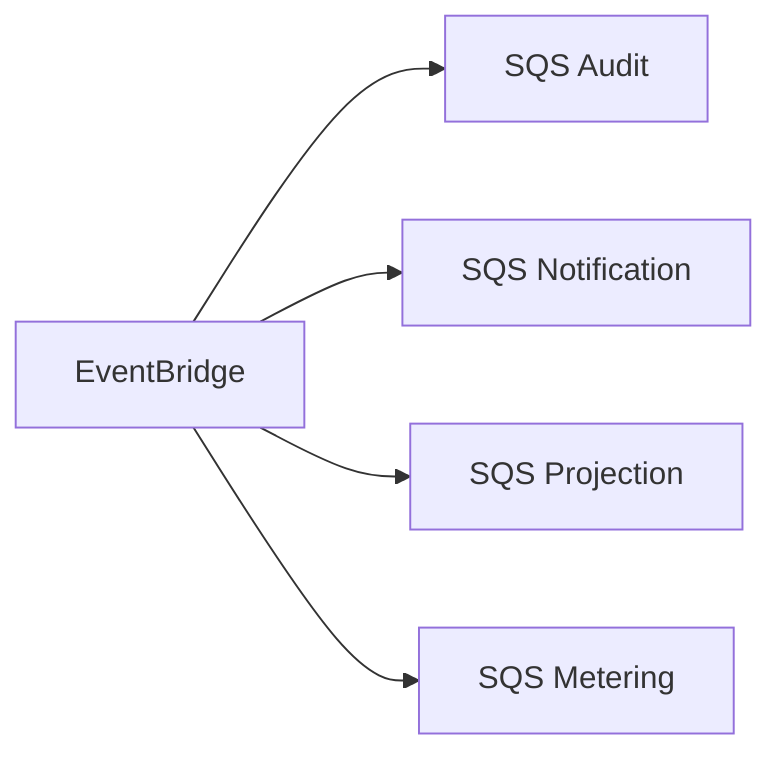
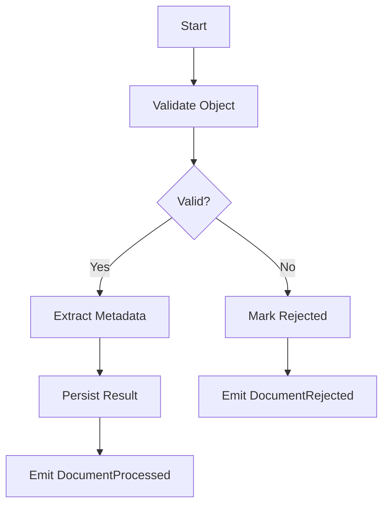

# Part 097 — Final Capstone Project Blueprint

This part turns the entire series into one portfolio-grade project.

The project should prove you can design, build, deploy, operate, review, and explain an AWS containers + serverless platform at production depth.

Not a toy app.

Not a “hello world Lambda.”

Not a Kubernetes demo.

A production-shaped platform with:

- real workload boundaries;
- APIs;
- async processing;
- containers;
- serverless functions;
- workflows;
- events;
- state;
- files;
- security;
- observability;
- CI/CD;
- failure handling;
- cost model;
- readiness review;
- runbooks;
- demo evidence.

The goal is to create a project that shows staff-level engineering judgment.

---

## 1. Capstone Theme

Build:

> A multi-tenant case/document/report platform where tenants upload documents, trigger asynchronous processing, generate reports, receive notifications, audit all important actions, and operate through production-grade observability, security, and deployment controls.

Name suggestion:

```txt
CaseFlow Platform
```

The domain combines the best pieces of previous labs:

- document upload and processing;
- report generation;
- tenant-aware SaaS;
- event-driven architecture;
- hybrid Lambda + ECS/Fargate workers;
- Step Functions workflows;
- EventBridge domain events;
- SQS backpressure;
- DynamoDB/RDS/S3 state;
- platform golden paths;
- production operations.

This one project can demonstrate almost every concept in the series.

---

## 2. Business Scenario

A B2B company provides a SaaS platform for organizations that manage cases.

Each tenant can:

- create cases;
- upload documents;
- process documents asynchronously;
- generate PDF/JSON reports;
- view processing status;
- receive notifications;
- audit all case changes;
- export report artifacts;
- configure tenant features/quotas.

Platform operators can:

- onboard tenants;
- configure tenant quotas;
- view tenant-specific health;
- inspect DLQs;
- redrive safe failures;
- run reconciliation jobs;
- deploy new versions safely;
- fail over in DR drill;
- review cost per tenant/workflow.

### Core Business Invariants

- one tenant cannot read another tenant's data;
- uploads are bound to server-generated S3 keys;
- document processing is idempotent;
- report generation is idempotent;
- audit events are not silently lost;
- duplicate EventBridge replay must not duplicate notifications/metering;
- API commands are retry-safe;
- queue backlog is visible and recoverable;
- cost per processed document/report is measurable.

These invariants drive the architecture.

---

## 3. Architecture Overview



### Why This Is a Good Capstone

It proves you understand:

- synchronous API design;
- async processing;
- event-driven fanout;
- file pipelines;
- workflow orchestration;
- serverless compute;
- container workers;
- tenant isolation;
- idempotency;
- failure modes;
- observability;
- deployment safety;
- cost visibility.

---

## 4. Required AWS Services

Use at least:

### Front Door and API

- API Gateway HTTP API or REST API;
- Lambda authorizer/JWT authorizer or simulated auth;
- custom domain optional.

### Compute

- Lambda for API and consumers;
- ECS/Fargate for report worker;
- Step Functions for document workflow.

### Messaging and Events

- SQS queues and DLQs;
- EventBridge custom bus;
- EventBridge rules;
- optional EventBridge archive/replay.

### Data

- DynamoDB for tenant registry, idempotency, case/document/report state;
- S3 for documents and reports;
- optional Aurora/RDS if you want relational variant.

### Config/Security

- AppConfig for feature flags/limits;
- Secrets Manager for provider/webhook secret simulation;
- KMS if practicing CMK;
- IAM least privilege.

### Delivery and Operations

- ECR for worker images;
- CloudWatch Logs/Metrics/Alarms/Dashboards;
- X-Ray/ADOT optional;
- CI/CD with GitHub Actions/CodePipeline/etc.;
- IaC with CDK/SAM/Terraform/Pulumi/CloudFormation.

---

## 5. Core User Flows

### Flow A — Tenant Onboarding



Minimum version:

- create tenant in DynamoDB;
- configure limits/features;
- emit `TenantCreated`.

Advanced version:

- Step Functions provisioning workflow;
- tenant-specific resources for enterprise tier;
- smoke test before activation.

### Flow B — Create Upload Intent



### Flow C — Upload and Process Document



### Flow D — Generate Report



### Flow E — Event Fanout



Every consumer has its own queue, DLQ, idempotency, and runbook.

---

## 6. API Surface

### Tenant API

```http
POST /tenants
GET /tenants/{tenantId}
PATCH /tenants/{tenantId}/config
```

### Case API

```http
POST /cases
GET /cases/{caseId}
GET /cases
```

### Document API

```http
POST /cases/{caseId}/documents
GET /cases/{caseId}/documents/{documentId}
GET /cases/{caseId}/documents
```

### Report API

```http
POST /cases/{caseId}/reports
GET /cases/{caseId}/reports/{reportId}
GET /cases/{caseId}/reports
```

### Operator API Optional

```http
POST /ops/reconcile
POST /ops/dlq/redrive-plan
GET /ops/tenants/{tenantId}/health
```

### API Requirements

- all command APIs require idempotency key;
- all APIs resolve tenant from trusted auth/context;
- error envelope stable;
- correlation ID returned;
- no large payload through Lambda;
- async jobs return `202 Accepted`.

---

## 7. Event Catalog

Define event contracts.

### Tenant Events

```txt
TenantCreated
TenantConfigChanged
TenantSuspended
TenantReactivated
```

### Case Events

```txt
CaseCreated
CaseUpdated
```

### Document Events

```txt
DocumentUploadRequested
DocumentUploaded
DocumentProcessingStarted
DocumentProcessed
DocumentRejected
DocumentProcessingFailed
```

### Report Events

```txt
ReportRequested
ReportGenerationStarted
ReportGenerated
ReportGenerationFailed
```

### Operational Events

```txt
DLQMessageDetected
DLQRedriveStarted
DLQRedriveCompleted
ReconciliationCompleted
DeploymentCompleted
```

### Event Envelope

```json
{
  "schemaVersion": "1.0",
  "eventId": "evt-123",
  "correlationId": "corr-456",
  "causationId": "cmd-789",
  "tenantId": "tenant-123",
  "sourceService": "document-service",
  "resourceType": "Document",
  "resourceId": "doc-123",
  "occurredAt": "2026-07-06T10:00:00Z",
  "payload": {}
}
```

### Event Review Checklist

- event is a fact;
- schema versioned;
- event ID unique;
- tenant ID present;
- replay safe;
- no secrets/large payload;
- consumers idempotent;
- rules tested.

---

## 8. Data Model

### Tenant Registry

```txt
PK = TENANT#<tenantId>
SK = METADATA
```

Item:

```json
{
  "tenantId": "tenant-123",
  "status": "ACTIVE",
  "tier": "ENTERPRISE",
  "isolationMode": "POOLED",
  "homeRegion": "ap-southeast-1",
  "features": {
    "reports": true,
    "priorityProcessing": true
  },
  "quotas": {
    "apiRps": 100,
    "maxConcurrentReports": 10,
    "maxUploadBytes": 52428800
  }
}
```

### Case and Document Table

```txt
PK = TENANT#<tenantId>#CASE#<caseId>
SK = CASE#METADATA
SK = DOCUMENT#<documentId>
SK = REPORT#<reportId>
```

### Idempotency Table

```txt
PK = IDEMPOTENCY#<tenantId>#<operation>#<key>
```

Attributes:

```json
{
  "requestHash": "sha256...",
  "status": "COMPLETED",
  "result": {},
  "expiresAt": 1783332930
}
```

### Consumer Idempotency

```txt
PK = CONSUMER#<consumerName>#EVENT#<eventId>
```

### Access Patterns

| Access Pattern | Key |
|---|---|
| get tenant | tenant PK |
| list tenant cases | GSI tenant/case createdAt |
| get case | case PK + metadata SK |
| list case documents | case PK + DOCUMENT prefix |
| get report status | case PK + REPORT SK |
| find stale processing docs | status GSI |
| idempotency lookup | idempotency PK |

---

## 9. S3 Key Design

Bucket:

```txt
caseflow-documents-prod
```

Prefixes:

```txt
tenants/{tenantId}/cases/{caseId}/documents/{documentId}/uploads/{uploadId}/original
tenants/{tenantId}/cases/{caseId}/documents/{documentId}/processed/
tenants/{tenantId}/cases/{caseId}/reports/{reportId}/
test-runs/{testRunId}/
tmp/
```

### Rules

- server generates keys;
- client never chooses tenant prefix;
- input/output prefixes separate;
- lifecycle rules for `tmp/`;
- incomplete multipart cleanup;
- encryption enforced;
- Block Public Access;
- object metadata includes tenant/document IDs where safe;
- versioning considered.

---

## 10. Queue Design

Queues:

```txt
object-events-prod
object-events-dlq-prod

report-jobs-prod
report-jobs-dlq-prod

audit-prod
audit-dlq-prod

notification-prod
notification-dlq-prod

projection-prod
projection-dlq-prod

metering-prod
metering-dlq-prod
```

### Queue Requirements

- DLQ for every critical queue;
- alarm on age;
- alarm on DLQ depth;
- visibility timeout > consumer timeout/job duration;
- max receive count documented;
- resource policy scoped;
- encryption based on data classification;
- redrive runbook.

### Tenant Noisy Neighbor Advanced

Add:

```txt
report-jobs-enterprise-prod
report-jobs-standard-prod
```

or per-tenant queues for high-value tenants.

---

## 11. Step Functions Workflow

Document workflow:



### Workflow Requirements

- deterministic execution name;
- correlation ID in input;
- task timeouts;
- retry/catch;
- config snapshot;
- failure status update;
- EventBridge event at terminal state;
- dashboard/alarm.

### Advanced Workflow

Add:

- ECS task for heavy extraction;
- parallel steps;
- Distributed Map for batch document import;
- manual review branch.

---

## 12. ECS/Fargate Report Worker

Worker responsibilities:

- long poll SQS;
- parse job message;
- validate schema;
- claim job with conditional update;
- generate report;
- write deterministic S3 output;
- update job state;
- publish `ReportGenerated`;
- delete message after durable success;
- handle SIGTERM.

### Worker Features

- Java 21 container;
- JSON structured logs;
- ECS task metadata logging;
- AppConfig/Secrets support;
- idempotency check;
- visibility extension if needed;
- metrics;
- graceful shutdown;
- health check.

### Autoscaling

Scale based on:

```txt
ApproximateNumberOfMessagesVisible / RunningTaskCount
```

Cap by:

- tenant quota;
- downstream capacity;
- cost budget.

---

## 13. Security Requirements

### Authentication

- simulated JWT acceptable for local/lab;
- real OIDC/Cognito optional;
- tenant resolution from trusted token/domain.

### Authorization

- tenant must match resource tenant;
- user role must allow action;
- operator endpoints separate and audited.

### IAM

- role per Lambda;
- role per ECS task;
- Step Functions execution role scoped;
- EventBridge/SQS resource policies scoped;
- no broad wildcard runtime policies.

### Data

- S3 Block Public Access;
- KMS/encryption policy;
- Secrets Manager for secrets;
- no secrets in logs/events/DLQs;
- DLQ access restricted;
- tenant isolation negative tests.

### Supply Chain

- ECR scanning;
- deploy by image digest;
- no `latest` in prod;
- Lambda artifact checksum;
- dependency scan;
- secret scan in CI.

---

## 14. Observability Requirements

### Log Contract

Every component logs:

```txt
service
environment
version
tenantId
correlationId
operation
outcome
resourceId
errorCode
awsRequestId/taskArn/executionArn
```

### Metrics

Business:

- TenantCreated;
- CaseCreated;
- DocumentProcessed;
- DocumentRejected;
- ReportGenerated;
- ReportFailed;
- NotificationSent;
- AuditWritten;
- MeteringRecorded.

Reliability:

- IdempotencyDuplicate;
- IdempotencyConflict;
- QueueAge;
- DLQDepth;
- WorkflowFailed;
- WorkerCrash;
- RedriveStarted;
- ReconciliationFinding.

Performance:

- API latency;
- processing duration;
- report generation duration;
- queue drain time.

Cost proxy:

- bytes processed;
- reports generated;
- log bytes per operation if possible.

### Dashboards

- API overview;
- document workflow;
- report worker;
- event consumers;
- tenant health;
- cost/unit economics;
- deployment versions;
- DR readiness optional.

---

## 15. CI/CD Requirements

Pipeline stages:

```txt
lint
unit tests
contract tests
policy checks
build Lambda artifacts
build ECS image
scan/sign artifacts
deploy test
integration tests
deploy staging
smoke/failure sample
prod canary/rolling
post-deploy verification
```

### Static Checks

- no public S3;
- log retention set;
- DLQs configured;
- queue visibility timeout sane;
- Lambda aliases;
- ECS image digest;
- IAM wildcard waiver;
- required tags;
- EventBridge rule pattern tests;
- AppConfig validators.

### Deployment

- Lambda aliases/canary;
- ECS rolling/circuit breaker;
- Step Functions version/alias if used;
- AppConfig deployment strategy;
- rollback drill.

---

## 16. Testing Requirements

### Unit Tests

- idempotency;
- tenant resolver;
- authorization;
- event envelope builder;
- worker job state machine;
- error classification.

### Contract Tests

- API request/response;
- SQS message schema;
- EventBridge event schema;
- Step Functions task input/output;
- log contract minimal fields.

### Integration Tests

- create tenant;
- create case;
- create upload;
- upload file to S3;
- document processed;
- request report;
- report generated;
- audit event written;
- notification simulated;
- metering recorded.

### Failure Tests

- duplicate API request;
- duplicate S3 event;
- malformed SQS message;
- report worker crash;
- Step Functions task failure;
- EventBridge target DLQ;
- DLQ redrive one message;
- bad deployment rollback;
- tenant isolation negative test.

### Load Tests

- API RPS;
- document upload burst;
- report queue backlog;
- ECS scaling;
- cost per operation.

---

## 17. Runbooks Required

Create runbooks:

```txt
api-5xx.md
document-stuck-processing.md
object-event-dlq.md
report-queue-backlog.md
report-job-dlq.md
event-consumer-dlq.md
audit-failure.md
tenant-isolation-incident.md
bad-deployment-rollback.md
cost-runaway.md
```

Each runbook includes:

- symptoms;
- dashboards;
- first safe actions;
- diagnosis steps;
- recovery;
- redrive if applicable;
- escalation;
- evidence preservation.

---

## 18. Production Readiness Review Artifact

Create:

```txt
docs/production-readiness-review.md
```

Sections:

- workload summary;
- architecture diagram;
- data flow;
- threat model;
- SLOs;
- capacity model;
- failure mode table;
- security model;
- observability model;
- deployment/rollback plan;
- cost model;
- risks;
- launch decision.

### Scorecard

```yaml
ownership: 3
security: 2
reliability: 2
observability: 2
performance: 2
cost: 1
deployment: 2
governance: 2
```

Attach evidence.

---

## 19. Repository Structure

```txt
caseflow-platform/
├── README.md
├── docs/
│   ├── architecture.md
│   ├── adr/
│   ├── threat-model.md
│   ├── production-readiness-review.md
│   ├── runbooks/
│   ├── slo.md
│   ├── cost-model.md
│   └── demo-script.md
├── infra/
│   ├── stacks/
│   ├── modules/
│   └── policies/
├── services/
│   ├── api/
│   ├── object-validator/
│   ├── workflow-tasks/
│   ├── report-worker/
│   ├── audit-consumer/
│   ├── notification-consumer/
│   ├── projection-consumer/
│   └── metering-consumer/
├── shared/
│   ├── auth/
│   ├── idempotency/
│   ├── events/
│   ├── logging/
│   ├── metrics/
│   └── config/
├── events/
│   ├── api/
│   ├── sqs/
│   ├── eventbridge/
│   └── stepfunctions/
├── tests/
│   ├── unit/
│   ├── contract/
│   ├── integration/
│   ├── failure/
│   └── load/
└── ci/
    ├── pipeline.yml
    └── policy-checks/
```

---

## 20. Implementation Milestones

### Milestone 1 — Foundation

- repo;
- IaC baseline;
- tags;
- log retention;
- CI skeleton;
- shared logging/correlation library.

### Milestone 2 — Tenant and Case APIs

- tenant registry;
- create tenant;
- create case;
- auth/tenant resolver;
- idempotency table.

### Milestone 3 — Document Upload

- create upload intent;
- S3 bucket/prefix;
- presigned URL;
- document state.

### Milestone 4 — Document Processing

- S3 event to SQS;
- object validator;
- Step Functions workflow;
- `DocumentProcessed` event.

### Milestone 5 — Event Consumers

- audit consumer;
- notification simulator;
- projection consumer;
- metering consumer.

### Milestone 6 — Report Worker

- SQS report queue;
- ECS/Fargate worker;
- ECR image;
- report output to S3;
- autoscaling.

### Milestone 7 — Observability and Operations

- dashboards;
- alarms;
- Logs Insights queries;
- runbooks;
- failure drills.

### Milestone 8 — Security and CI/CD

- least privilege;
- policy-as-code;
- image scan;
- canary/rolling deploy;
- rollback test.

### Milestone 9 — Reliability and Cost

- load test;
- queue backlog test;
- DLQ redrive;
- unit cost dashboard;
- anomaly/budget.

### Milestone 10 — Final Review and Demo

- PRR;
- architecture review;
- demo video/script;
- portfolio write-up.

---

## 21. Demo Script

A strong demo should show production thinking.

### Demo Part 1 — Happy Path

1. Create tenant.
2. Create case.
3. Create upload intent.
4. Upload file.
5. Show document processing workflow.
6. Request report.
7. Show ECS worker processing.
8. Show EventBridge consumers.
9. Show final status and S3 artifact.

### Demo Part 2 — Observability

1. Search logs by correlation ID.
2. Show dashboard.
3. Show queue metrics.
4. Show Step Functions execution.
5. Show ECS task logs.
6. Show cost/unit metrics.

### Demo Part 3 — Failure

1. Send duplicate API command.
2. Show idempotency.
3. Send poison message.
4. Show DLQ alarm.
5. Redrive one safe message.
6. Kill ECS worker during job.
7. Show retry/idempotent output.
8. Roll back a bad deployment in staging.

### Demo Part 4 — Review

1. Show architecture diagram.
2. Show ADR.
3. Show threat model.
4. Show PRR scorecard.
5. Show runbook.
6. Show cost model.

This demo is much stronger than simply clicking an API.

---

## 22. Portfolio Deliverables

Create these public or private artifacts:

### Engineering Artifacts

- architecture document;
- sequence diagrams;
- ADRs;
- API specification;
- event catalog;
- data model;
- runbooks;
- production readiness review;
- cost model;
- threat model;
- failure drill report.

### Code Artifacts

- IaC;
- Lambda services;
- ECS worker;
- shared libraries;
- tests;
- CI/CD pipeline.

### Evidence Artifacts

- screenshots of dashboards;
- load test summary;
- failure drill summary;
- deployment manifest;
- security scan output;
- cost dashboard;
- redrive test notes.

### Story Artifacts

- README;
- blog post;
- demo video;
- system design explanation;
- “what I would improve next.”

If you want top-tier portfolio impact, include both code and reasoning.

---

## 23. Scoring Rubric

Score 0–3.

| Area | 0 | 1 | 2 | 3 |
|---|---|---|---|---|
| architecture | unclear | diagram only | contracts clear | reviewed with ADRs |
| API | toy | basic | idempotent/authz | tested/observable |
| async | missing | queue only | DLQ/idempotent | redrive proven |
| workflow | missing | basic | retry/catch | failure drill |
| containers | missing | Docker only | ECS worker | autoscaling/graceful |
| security | broad | auth only | least privilege | negative tests/scans |
| observability | logs | metrics | dashboards/alarms | correlation/runbooks |
| CI/CD | manual | basic | canary/rolling | rollback drill |
| reliability | happy path | basic DLQ | drills | scorecard |
| cost | none | tags | unit cost | anomaly/runbook |
| docs | README | architecture | runbooks/ADRs | PRR/demo |

Target:

```txt
score 2 in every category
score 3 in at least 4 categories
no category 0
```

---

## 24. Stretch Goals

Add only after MVP.

### Technical Stretch

- EventBridge archive/replay;
- AppConfig kill switch;
- multi-region warm standby;
- tenant-specific enterprise queue;
- RDS outbox variant;
- Step Functions Distributed Map;
- OpenTelemetry ADOT traces;
- GuardDuty/Inspector integration;
- AWS Config conformance pack;
- Service Catalog/golden path.

### Product Stretch

- tenant dashboard;
- billing/metering export;
- role-based access control;
- support impersonation audit;
- report template versions;
- webhook delivery.

### Operational Stretch

- automated PRR scorecard;
- self-service runbook generator;
- cost anomaly simulation;
- chaos/game-day automation.

Stretch goals should deepen the story, not distract from core correctness.

---

## 25. Capstone Anti-Patterns

### Anti-Pattern 1 — Too Many Services, No Contracts

The architecture looks impressive but cannot be reasoned about.

### Anti-Pattern 2 — Happy Path Only

No idempotency, DLQ, redrive, or failure drill.

### Anti-Pattern 3 — Kubernetes for Everything

EKS is not proof of mastery unless the workload needs it.

### Anti-Pattern 4 — No Tenant Isolation Tests

SaaS claim unproven.

### Anti-Pattern 5 — No Observability Demo

Cannot operate the system.

### Anti-Pattern 6 — No Cost Story

Production systems have bills.

### Anti-Pattern 7 — No Runbooks

Incident response not designed.

### Anti-Pattern 8 — No Deployment Rollback

CI/CD is incomplete.

### Anti-Pattern 9 — Docs Only, No Working Path

Architecture must be grounded.

### Anti-Pattern 10 — Code Only, No Reasoning

Senior engineering requires explaining trade-offs.

---

## 26. What “Done” Means

The capstone is done when you can prove:

- tenant API works;
- document upload/process works;
- report generation works on ECS/Fargate;
- EventBridge fanout works;
- consumers are idempotent;
- DLQs and alarms work;
- one redrive drill passed;
- one worker failure drill passed;
- one bad deployment rollback passed;
- logs trace operation end to end;
- cost per operation estimated;
- PRR completed;
- demo script executed.

### Definition of Done

```txt
A reviewer can read the docs, run the demo, inspect the code, see the evidence, and understand why each architecture decision was made.
```

That is portfolio-grade.

---

## 27. Final Mental Model

A capstone project is not about using every AWS service.

It is about demonstrating architecture judgment.

The strongest signal is not:

```txt
I deployed Lambda, ECS, EventBridge, and Step Functions.
```

The strongest signal is:

```txt
I built a workload with clear contracts, durable state, idempotent retries, observable async boundaries, secure runtime identities, safe deployment, tested recovery, and cost/unit economics.
```

That is the difference between a demo builder and a production engineer.

---

## References

- AWS Well-Architected Framework and Serverless Applications Lens
- AWS Prescriptive Guidance: cloud design patterns and modernization patterns
- AWS documentation for API Gateway, Lambda, ECS/Fargate, Step Functions, EventBridge, SQS, DynamoDB, S3, AppConfig, Secrets Manager, KMS, CloudWatch, ECR, IAM, and AWS Config
