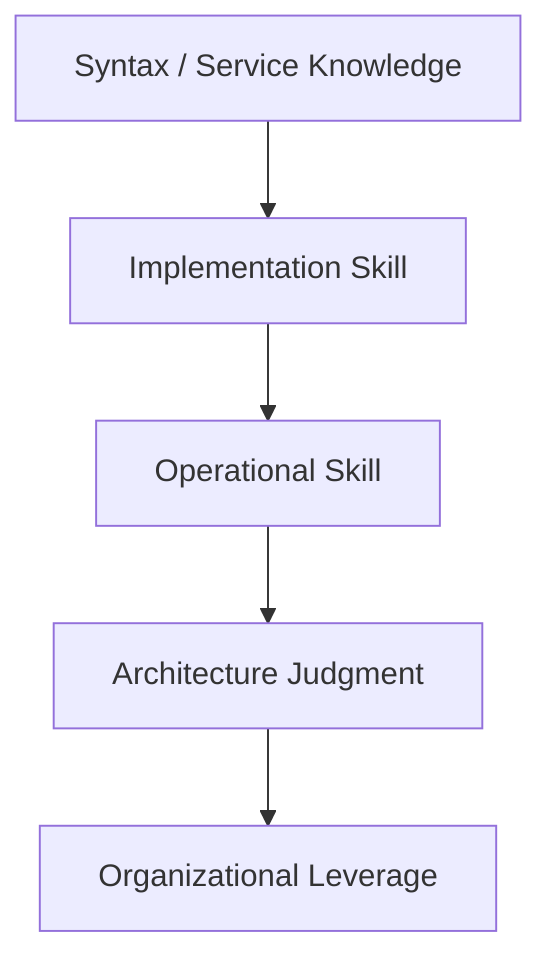

# Part 098 — Final Mastery Roadmap and Next Steps

This is the final part of the series.

You now have a complete advanced roadmap across AWS containers and serverless:

- container image supply chain;
- ECS/Fargate;
- EKS;
- Lambda;
- Step Functions;
- EventBridge;
- SQS/SNS;
- DynamoDB/S3;
- API Gateway/ALB;
- service-to-service networking;
- security;
- observability;
- testing;
- reliability;
- FinOps;
- CI/CD;
- multi-region DR;
- platform golden paths;
- production readiness;
- incident management;
- architecture review;
- system design;
- capstone projects.

The goal of this final part is to convert all of that into mastery.

Mastery means you can:

```txt
design
implement
operate
debug
review
explain
evolve
teach
```

not merely configure AWS services.

---

## 1. The Mastery Model

Top-tier engineering skill has five layers.



### Layer 1 — Service Knowledge

You know:

- what Lambda does;
- what ECS does;
- what EventBridge does;
- what SQS does;
- what Step Functions does;
- what DynamoDB/S3 do.

This is necessary but not enough.

### Layer 2 — Implementation Skill

You can build:

- APIs;
- workers;
- workflows;
- event consumers;
- IaC;
- CI/CD;
- dashboards.

This makes you productive.

### Layer 3 — Operational Skill

You can handle:

- queue backlog;
- DLQ;
- retry storm;
- bad deployment;
- permission failure;
- cost anomaly;
- provider timeout;
- worker crash;
- regional issue.

This makes you reliable.

### Layer 4 — Architecture Judgment

You can choose:

- Lambda vs ECS/Fargate vs EKS;
- queue vs event bus vs workflow;
- DynamoDB vs RDS;
- orchestration vs choreography;
- pooled vs siloed tenancy;
- active-passive vs active-active;
- cost vs resilience;
- simplicity vs flexibility.

This makes you senior.

### Layer 5 — Organizational Leverage

You can create:

- golden paths;
- review frameworks;
- runbooks;
- training;
- platform standards;
- reusable modules;
- decision records;
- scorecards.

This makes you staff/principal-level.

---

## 2. Self-Assessment

Score yourself from 0–3.

```txt
0 = I only know the term
1 = I can explain it
2 = I can implement it
3 = I can operate/review/teach it
```

### Core Services

| Skill | Score |
|---|---:|
| Lambda lifecycle/concurrency/idempotency |  |
| ECS/Fargate services/tasks/workers |  |
| EKS architecture/networking/security |  |
| Step Functions workflows/retry/catch |  |
| EventBridge routing/archive/replay |  |
| SQS visibility/DLQ/redrive/scaling |  |
| DynamoDB data modeling/conditional writes |  |
| S3 presigned/event/lifecycle/security |  |
| API Gateway/ALB edge patterns |  |
| IAM/KMS/resource policies |  |

### Production Skills

| Skill | Score |
|---|---:|
| observability/correlation/SLO |  |
| CI/CD progressive deployment |  |
| reliability/failure drills |  |
| FinOps/unit economics |  |
| multi-region DR |  |
| incident management |  |
| platform golden paths |  |
| architecture review |  |
| system design communication |  |
| security threat modeling |  |

### Rule

Your next study plan should target your lowest scores.

Top-tier engineers are balanced.

They are not excellent at Kubernetes while weak at incident recovery.

---

## 3. 30-Day Plan

Goal:

```txt
turn knowledge into working implementation
```

### Week 1 — Rebuild the Serverless Core

Build:

- API Gateway + Lambda command API;
- DynamoDB state/idempotency;
- S3 presigned upload;
- SQS object event queue;
- Step Functions workflow.

Deliverables:

- working API;
- event fixtures;
- unit tests;
- integration test;
- architecture diagram.

### Week 2 — Add Event Fanout

Build:

- EventBridge custom bus;
- audit queue/consumer;
- notification queue/consumer;
- projection queue/consumer;
- idempotency per consumer;
- DLQ per queue.

Deliverables:

- event catalog;
- rule pattern tests;
- DLQ runbook;
- replay/duplicate test.

### Week 3 — Add Fargate Worker

Build:

- ECR image;
- ECS/Fargate worker;
- SQS report job queue;
- worker autoscaling;
- deterministic output to S3;
- graceful shutdown.

Deliverables:

- worker demo;
- image digest deployment;
- queue backlog dashboard;
- worker failure test.

### Week 4 — Add Observability and Security

Build:

- structured logs;
- correlation ID;
- custom metrics;
- dashboards/alarms;
- least-privilege roles;
- secret/config handling;
- policy checks.

Deliverables:

- dashboard screenshots;
- IAM review;
- log query examples;
- PRR draft.

---

## 4. 60-Day Plan

Goal:

```txt
turn implementation into production-shaped platform
```

### Weeks 5–6 — CI/CD and Release Safety

Implement:

- pipeline;
- unit/contract/integration gates;
- Lambda aliases/canary;
- ECS rolling/circuit breaker;
- artifact manifest;
- rollback drill.

Deliverables:

- release manifest;
- rollback evidence;
- deployment runbook.

### Weeks 7–8 — Reliability and Load

Implement:

- load tests;
- queue drain test;
- DLQ/redrive drill;
- Step Functions failure drill;
- ECS task kill drill;
- cost per operation estimate.

Deliverables:

- load test report;
- failure drill report;
- resilience scorecard;
- cost dashboard.

---

## 5. 90-Day Plan

Goal:

```txt
turn platform into portfolio-grade proof
```

### Weeks 9–10 — Multi-Tenant Features

Implement:

- tenant registry;
- tenant resolver;
- tenant quotas;
- tenant-aware events/jobs;
- tenant isolation negative tests;
- tenant support view.

Deliverables:

- SaaS architecture doc;
- tenant isolation tests;
- per-tenant dashboard.

### Weeks 11–12 — Production Review and Demo

Complete:

- architecture review playbook output;
- ADRs;
- threat model;
- production readiness review;
- cost model;
- demo video/script;
- README portfolio story.

Deliverables:

- public/private repo;
- demo recording;
- blog post;
- PRR scorecard;
- improvement backlog.

---

## 6. 180-Day Plan

Goal:

```txt
move from strong practitioner to platform/architecture leader
```

### Month 4 — Multi-Region and DR

Build:

- secondary Region deployment;
- ECR/artifact replication;
- DynamoDB global table variant;
- S3 replication;
- EventBridge global endpoint or cross-region plan;
- failover/failback runbook.

Prove:

- failover drill;
- split-brain fence;
- reconciliation job.

### Month 5 — Platform Golden Path

Build:

- reusable IaC modules;
- golden path templates;
- policy-as-code;
- scorecard;
- developer portal/CLI minimal version.

Prove:

- create new service using golden path;
- policy failure example;
- runtime compliance report.

### Month 6 — Advanced Specialization

Pick one specialization:

- EKS platform engineering;
- serverless workflow platform;
- SaaS multi-tenancy;
- security/governance;
- observability/SRE;
- FinOps;
- event-driven architecture;
- Java cloud performance.

Produce:

- deep technical article;
- talk/workshop;
- reusable library/module;
- architecture review case study.

Top-tier growth comes from creating leverage for others.

---

## 7. Skill Tree

### Compute

```txt
Lambda
├── lifecycle/cold start
├── Java tuning/SnapStart
├── concurrency/throttling
├── SQS/EventBridge/API integrations
├── idempotency
└── observability

ECS/Fargate
├── task/service model
├── worker patterns
├── autoscaling
├── image supply chain
├── graceful shutdown
└── task roles/networking

EKS
├── control plane/node groups/Fargate/Auto Mode
├── CNI/networking
├── workload identity
├── ingress/gateway
├── Karpenter
├── GitOps
└── policy/multi-tenancy
```

### Integration

```txt
SQS
├── visibility timeout
├── DLQ/redrive
├── partial batch
├── max concurrency
└── backlog math

EventBridge
├── buses/rules
├── schema/versioning
├── archive/replay
├── global endpoints
└── consumer isolation

Step Functions
├── retry/catch
├── direct integrations
├── Standard vs Express
├── Map/Distributed Map
└── version/alias/redrive
```

### Operations

```txt
Observability
├── logs
├── metrics
├── traces
├── correlation
└── SLOs

Reliability
├── failure modes
├── idempotency
├── backpressure
├── game days
└── DR

Security
├── IAM
├── resource policies
├── KMS/secrets
├── supply chain
└── runtime detection
```

### Platform

```txt
CI/CD
├── immutable artifacts
├── canary/blue-green
├── rollback
└── policy checks

Governance
├── account vending
├── golden paths
├── Config conformance
├── scorecards
└── exceptions

FinOps
├── tags/CUR
├── budgets/anomaly
├── unit economics
└── cost under failure
```

---

## 8. Recommended Next Deep-Dive Tracks

After this series, continue with one or more tracks.

### Track A — Advanced AWS Networking for Containers and Serverless

Learn deeply:

- VPC design;
- private connectivity;
- PrivateLink;
- VPC Lattice;
- API Gateway private APIs;
- ALB/NLB internals;
- Route 53;
- CloudFront/WAF/Shield;
- hybrid connectivity;
- DNS failure modes;
- cross-account networking.

Why:

```txt
Most hard production problems eventually touch networking.
```

### Track B — EKS Platform Engineering

Learn deeply:

- Kubernetes scheduling;
- Karpenter;
- CNI/IP exhaustion;
- Gateway API;
- service mesh;
- GitOps;
- policy/admission;
- multi-tenant clusters;
- cluster upgrades;
- cost allocation.

Why:

```txt
EKS mastery is valuable when the workload truly needs Kubernetes.
```

### Track C — Serverless Workflow and Event Platform

Learn deeply:

- Step Functions advanced patterns;
- EventBridge governance;
- schema registry discipline;
- replay/backfill;
- event sourcing;
- outbox/CDC;
- saga orchestration;
- event-driven testing.

Why:

```txt
Event-driven correctness separates senior engineers from service-wiring engineers.
```

### Track D — Cloud Security Engineering

Learn deeply:

- IAM formal reasoning;
- SCP/RCP;
- KMS key policies;
- identity federation;
- supply chain security;
- GuardDuty/Inspector/Security Hub;
- threat modeling;
- incident response;
- data protection.

Why:

```txt
Security failures are architecture failures.
```

### Track E — Observability and SRE

Learn deeply:

- OpenTelemetry;
- CloudWatch advanced;
- distributed tracing;
- SLO/error budgets;
- incident management;
- chaos engineering;
- runbook automation;
- operational analytics.

Why:

```txt
Production expertise is visible during incidents.
```

### Track F — FinOps and Capacity Engineering

Learn deeply:

- CUR/Athena;
- unit economics;
- cost anomaly;
- ECS/EKS split allocation;
- data transfer economics;
- log/trace cost;
- load/capacity planning.

Why:

```txt
At scale, cost is architecture feedback.
```

### Track G — SaaS Architecture

Learn deeply:

- tenant isolation;
- pooled/silo/bridge;
- control plane/data plane;
- metering/billing;
- tenant migrations;
- tenant observability;
- noisy neighbor control;
- data lifecycle.

Why:

```txt
SaaS systems require architecture across technical and business boundaries.
```

### Track H — Java Cloud Runtime Engineering

Learn deeply:

- JVM cold start;
- memory tuning;
- GraalVM/native image trade-offs;
- AWS SDK client tuning;
- Netty/reactive IO;
- virtual threads;
- container memory limits;
- GC in containers;
- Java Lambda SnapStart compatibility;
- profiling in ECS/EKS.

Why:

```txt
Java backend engineers can gain huge leverage by understanding runtime behavior in cloud compute.
```

---

## 9. Portfolio Strategy

A strong portfolio has three layers.

### Layer 1 — Working System

Show:

- code;
- IaC;
- deployment;
- tests;
- demo.

### Layer 2 — Production Evidence

Show:

- dashboards;
- alarms;
- failure drills;
- load test;
- cost model;
- security scan;
- PRR.

### Layer 3 — Architecture Reasoning

Show:

- ADRs;
- trade-offs;
- diagrams;
- runbooks;
- risk register;
- what you changed after failures.

Most portfolios stop at Layer 1.

Top-tier portfolios include all three.

---

## 10. Writing Plan

Create 5 articles from your capstone.

### Article 1 — Architecture Overview

Title:

```txt
Building a Production-Grade AWS Serverless + Fargate Case Processing Platform
```

Cover:

- problem;
- architecture;
- core flows;
- service choices;
- diagrams.

### Article 2 — Idempotency and Failure Handling

Cover:

- API idempotency;
- S3 object duplicate events;
- SQS retries;
- worker crash;
- EventBridge replay;
- DLQ redrive.

### Article 3 — Observability

Cover:

- correlation ID;
- structured logs;
- metrics;
- dashboards;
- runbooks;
- incident debugging story.

### Article 4 — CI/CD and Deployment Safety

Cover:

- artifact manifest;
- Lambda aliases;
- ECS image digest;
- policy checks;
- rollback drill.

### Article 5 — Cost and Production Readiness

Cover:

- cost per operation;
- budgets/anomaly;
- PRR;
- risk register;
- next improvements.

Writing forces clarity.

Clarity is a top-tier skill.

---

## 11. Interview Preparation Plan

### Week 1 — Core Patterns

Practice:

- async report generation;
- file processing;
- event fanout;
- order/payment;
- SaaS tenant onboarding.

For each:

- draw diagram;
- state trade-offs;
- handle failure;
- estimate scale;
- discuss security/cost.

### Week 2 — Deep Dives

Practice follow-ups:

- duplicate payment;
- DLQ redrive;
- region failover;
- worker crash;
- provider timeout;
- tenant isolation;
- hot partition;
- recursive S3 trigger.

### Week 3 — Mock Reviews

Use Part 095:

- review your own design;
- red-team it;
- write ADRs;
- score readiness.

### Week 4 — Storytelling

Prepare stories:

- a failure you designed for;
- a trade-off you made;
- a cost optimization;
- an incident response;
- a migration;
- a security improvement;
- a platform/golden path contribution.

Interviews reward structured stories.

---

## 12. Certification Alignment

Certifications are not mastery, but they can structure study.

Relevant AWS certification paths:

- AWS Certified Developer – Associate;
- AWS Certified Solutions Architect – Associate;
- AWS Certified SysOps Administrator – Associate;
- AWS Certified DevOps Engineer – Professional;
- AWS Certified Solutions Architect – Professional;
- AWS Certified Security – Specialty if pursuing security;
- Kubernetes certifications if pursuing EKS deeply.

### How to Use Certifications

Good:

```txt
use certification domains to find gaps
```

Bad:

```txt
treat passing exam as production mastery
```

Certification plus capstone plus operational evidence is strong.

Certification alone is not enough.

---

## 13. What to Practice Weekly

### Weekly Design

Pick one prompt and write:

- requirements;
- architecture;
- data model;
- failure modes;
- cost/security/ops;
- ADR.

### Weekly Build

Implement one small feature:

- queue redrive;
- EventBridge replay test;
- AppConfig flag;
- worker graceful shutdown;
- dashboard alarm;
- policy check.

### Weekly Operate

Run one drill:

- poison message;
- Lambda failure;
- ECS task kill;
- bad config;
- bad deployment rollback;
- cost spike simulation.

### Weekly Teach

Explain one concept:

- blog;
- internal doc;
- code review;
- mentoring;
- whiteboard.

Teaching exposes shallow understanding.

---

## 14. Staff-Level Behaviors to Develop

### Ask Better Questions

Instead of:

```txt
Should we use Lambda?
```

Ask:

```txt
What is the execution contract and failure boundary?
```

### Write Decisions

Use ADRs.

### Make Risk Visible

Use risk registers and scorecards.

### Create Reusable Paths

Build golden templates.

### Connect Cost and Reliability

Retry/fanout/logging issues become cost issues.

### Design for Operations

Runbooks, dashboards, alarms, and drills are architecture.

### Measure Outcomes

SLOs, unit cost, deployment failure rate, incident MTTR.

### Improve Systems After Incidents

Postmortem action items become platform guardrails.

These behaviors are what separate senior from staff/principal.

---

## 15. Common Plateaus

### Plateau 1 — Service Collector

You know many AWS services but cannot choose between them.

Fix:

- write trade-off ADRs;
- practice workload classification.

### Plateau 2 — Happy Path Builder

You can build but not recover.

Fix:

- run failure drills;
- implement DLQs/redrive/idempotency.

### Plateau 3 — Diagram Architect

You design diagrams but not evidence.

Fix:

- build capstone;
- attach tests/dashboards/runbooks.

### Plateau 4 — Kubernetes Maximalist

You force EKS even when simpler options fit.

Fix:

- justify compute placement by workload contract.

### Plateau 5 — Serverless Maximalist

You force Lambda even for long-running/sustained work.

Fix:

- use queues to decouple runtime choice.

### Plateau 6 — Tooling Without Product Thinking

You build platform modules but teams do not adopt them.

Fix:

- measure developer experience;
- make safe path easy.

---

## 16. Advanced Reading and Practice Map

### AWS Architecture

- Well-Architected Framework;
- Serverless Applications Lens;
- SaaS Lens;
- Prescriptive Guidance design patterns;
- Builders' Library articles;
- AWS reference architectures;
- re:Invent sessions.

### Distributed Systems

- idempotency;
- retries/timeouts;
- backpressure;
- queues;
- sagas;
- outbox;
- eventual consistency;
- consensus basics;
- failure detectors;
- graceful degradation.

### Operations

- SRE;
- SLO/error budgets;
- incident command;
- postmortems;
- chaos engineering;
- observability.

### Security

- IAM;
- KMS;
- threat modeling;
- supply chain;
- least privilege;
- data isolation;
- audit.

### Java

- JVM in containers;
- virtual threads;
- GC/memory;
- native images;
- AWS SDK performance;
- reactive vs blocking;
- profiling.

Do not learn these as disconnected topics.

Tie each to a production workflow.

---

## 17. Recommended Next Material Series

Based on this course, the best follow-up materials are:

### 1. Advanced AWS Networking and Content Delivery

Why:

```txt
Private connectivity, DNS, routing, and edge security become bottlenecks in real platforms.
```

Topics:

- VPC design;
- PrivateLink;
- VPC Lattice;
- Transit Gateway;
- Route 53;
- CloudFront;
- WAF;
- hybrid connectivity;
- cross-account networking;
- DNS incident runbooks.

### 2. Advanced AWS Security, Monitoring, and Management

Why:

```txt
Governance and detection become critical at scale.
```

Topics:

- Organizations/SCP/RCP;
- IAM Access Analyzer;
- GuardDuty;
- Security Hub;
- Inspector;
- Config;
- CloudTrail;
- Control Tower;
- KMS;
- incident response.

### 3. Java Microservices Communication

Why:

```txt
Service boundaries, contracts, retries, and backpressure matter regardless of AWS service.
```

Topics:

- REST/gRPC;
- async messaging;
- outbox;
- sagas;
- circuit breakers;
- service discovery;
- resiliency;
- contract testing.

### 4. Database Design and Architecture

Why:

```txt
Most distributed system bugs are data ownership and consistency bugs.
```

Topics:

- DynamoDB advanced modeling;
- RDS/Aurora;
- transactions;
- indexing;
- migrations;
- event sourcing;
- CDC;
- multi-region data.

### 5. Build From Scratch: Internal Developer Platform

Why:

```txt
The highest leverage is making many teams productive and safe.
```

Topics:

- golden paths;
- account vending;
- service catalog;
- policy-as-code;
- templates;
- scorecards;
- developer portal.

### 6. Build From Scratch: Event-Driven Workflow Platform

Why:

```txt
Events, workflows, idempotency, replay, and redrive are hard and valuable.
```

Topics:

- EventBridge governance;
- Step Functions;
- schemas;
- outbox;
- replay;
- DLQ/redrive;
- workflow DSL;
- observability.

### 7. Build From Scratch: Multi-Tenant SaaS Platform

Why:

```txt
SaaS combines architecture, security, operations, cost, and product thinking.
```

Topics:

- tenant registry;
- pooled/silo/bridge;
- provisioning;
- metering;
- tenant isolation;
- noisy neighbor;
- tenant migrations.

---

## 18. Final Exam

To test mastery, answer these without notes.

### Architecture

1. When choose Lambda vs ECS/Fargate vs EKS?
2. When use EventBridge vs SNS vs SQS?
3. When use Step Functions vs choreography?
4. When use DynamoDB vs RDS?
5. When use API Gateway vs ALB?

### Reliability

6. How do you design idempotency for API, queue, event, and external provider?
7. How do you redrive DLQ safely?
8. How do you handle provider timeout ambiguity?
9. How do you prevent recursive S3 trigger?
10. How do you recover queued jobs after regional failover?

### Security

11. How do you scope IAM roles for Lambda and ECS tasks?
12. How do resource policies differ from identity policies?
13. How do you prevent tenant data leakage?
14. How do you secure events, queues, and DLQs?
15. How do you harden container supply chain?

### Operations

16. What dashboard proves async workflow health?
17. What alarms should page?
18. How do you find last durable successful boundary?
19. What belongs in a runbook?
20. How do you structure incident response?

### Cost

21. How do retries and fanout affect cost?
22. What is cost per business operation?
23. How do you control log cost?
24. How do you right-size ECS/Fargate?
25. How do you detect cost incident early?

### Platform

26. What is a golden path?
27. What belongs in a production-ready service template?
28. How do you design an exception process?
29. How do scorecards improve governance?
30. How do you turn incident lessons into platform guardrails?

If you can answer these clearly with examples, you are far beyond basic AWS usage.

---

## 19. Final Checklist for Top-Tier Readiness

You are ready to operate at a high level when you can:

- [ ] design a workload from requirements;
- [ ] justify compute placement;
- [ ] model data ownership;
- [ ] design event contracts;
- [ ] design idempotency;
- [ ] define failure modes;
- [ ] build runbooks;
- [ ] implement observability;
- [ ] design CI/CD rollback;
- [ ] perform load test;
- [ ] estimate cost per operation;
- [ ] harden IAM/security;
- [ ] review architecture;
- [ ] lead incident response;
- [ ] write ADRs;
- [ ] create platform golden paths;
- [ ] mentor others.

This is not achieved by reading once.

It is achieved by repeated design-build-operate-review cycles.

---

## 20. Final Mental Model

AWS containers and serverless mastery is not about memorizing service limits.

It is about understanding execution contracts.

```txt
Lambda gives bounded event compute.
ECS/Fargate gives containerized service/worker compute.
EKS gives Kubernetes platform power.
SQS gives durable backpressure.
EventBridge gives event routing.
Step Functions gives workflow state.
DynamoDB/RDS/S3 give different state contracts.
API Gateway/ALB expose different edge contracts.
IAM/KMS/resource policies define authority.
CloudWatch/X-Ray/ADOT provide operational truth.
CI/CD and IaC make change repeatable.
Runbooks and drills make recovery real.
```

The top-tier engineer sees the whole system:

```txt
business outcome
runtime contract
data ownership
failure boundary
security boundary
cost curve
operational evidence
evolution path
```

That is the level you should aim for.

---

## 21. Closing

You have now completed the advanced series:

```txt
Learn AWS Containers and Serverless
Parts 001–098
```

The next step is not more passive reading.

The next step is:

```txt
build the capstone
break it
observe it
fix it
review it
explain it
teach it
```

That is how knowledge becomes engineering mastery.

---

## References

- AWS Well-Architected Framework
- AWS Well-Architected Serverless Applications Lens
- AWS Well-Architected SaaS Lens
- AWS Prescriptive Guidance: cloud design patterns and modernization patterns
- AWS documentation for Lambda, ECS, EKS, Step Functions, EventBridge, SQS, SNS, DynamoDB, S3, API Gateway, IAM, KMS, CloudWatch, AppConfig, ECR, AWS Config, AWS Organizations, and Control Tower
- AWS Training and Certification / AWS Skill Builder for structured certification-aligned study
