# Part 001 — Cloud Networking Mental Model

Materi ini bukan daftar layanan AWS. Kita mulai dari cara berpikir.

Di level produksi, networking bukan sekadar “resource A bisa ping resource B”. Networking adalah sistem yang mengatur **bagaimana sebuah intent bergerak dari satu boundary ke boundary lain** dengan rute, policy, identitas, state, observability, dan failure domain tertentu.

Kalau mental model ini kuat, service AWS apa pun akan lebih mudah dipahami:

- VPC bukan “LAN virtual”, tapi **routing boundary** yang dikendalikan oleh AWS.
- Subnet bukan hanya “range IP”, tapi **zonal placement boundary**.
- Security Group bukan firewall biasa, tapi **stateful instance/ENI-level permission model**.
- NACL bukan pengganti Security Group, tapi **stateless subnet guardrail**.
- Load balancer bukan hanya reverse proxy, tapi **entry point, health gate, connection manager, TLS boundary, dan scaling adapter**.
- CloudFront bukan hanya cache, tapi **global edge data plane**.
- Route 53 bukan hanya DNS, tapi **traffic steering mechanism**.
- Transit Gateway bukan hanya router, tapi **multi-domain routing fabric**.

Yang ingin kita bangun di part ini adalah satu peta mental yang bisa dipakai untuk men-debug, mendesain, dan mengkritisi arsitektur jaringan AWS apa pun.

---

## 1. Target Pembelajaran

Setelah part ini, kamu harus bisa:

1. Membaca request path dari user sampai workload AWS tanpa bergantung pada diagram marketing.
2. Memisahkan masalah **name resolution**, **routing**, **policy**, **translation**, **connection state**, dan **application behavior**.
3. Menjelaskan kenapa “sudah ada route” belum tentu berarti traffic boleh lewat.
4. Menjelaskan kenapa “Security Group sudah allow” belum tentu berarti aplikasi reachable.
5. Mengidentifikasi boundary: account, Region, AZ, VPC, subnet, route table, ENI, load balancer, edge service, dan workload runtime.
6. Melihat networking sebagai sistem dengan control plane dan data plane.
7. Menyusun checklist debugging berbasis packet path, bukan tebak-tebakan.

---

## 2. Definisi Praktis: Apa Itu Cloud Networking?

Dalam konteks AWS, cloud networking adalah kombinasi dari:

| Elemen | Pertanyaan yang Dijawab |
|---|---|
| Addressing | Resource ini punya alamat apa? IPv4, IPv6, private IP, public IP, DNS name? |
| Naming | Nama domain ini resolve ke mana? Public DNS, private DNS, split-horizon, service discovery? |
| Routing | Jika packet dikirim ke destination tertentu, next hop-nya siapa? |
| Policy | Siapa boleh bicara dengan siapa, di port/protocol apa? |
| Translation | Apakah source/destination IP berubah karena NAT, load balancer, proxy, atau service endpoint? |
| State | Apakah koneksi dilacak? Timeout-nya berapa? Return path harus lewat mana? |
| Placement | Resource berada di Region/AZ/subnet mana? |
| Entry Point | Traffic pertama kali diterima oleh siapa: CloudFront, Global Accelerator, ALB, NLB, API Gateway, VPN, Direct Connect, endpoint? |
| Observability | Dari mana kita tahu packet diterima, ditolak, timeout, atau salah rute? |
| Failure Domain | Jika satu AZ, Region, route domain, endpoint, atau edge path bermasalah, siapa terdampak? |

Cloud networking yang matang selalu menjawab semua pertanyaan di atas. Cloud networking yang rapuh biasanya hanya menjawab sebagian: “sudah ada subnet”, “sudah ada SG”, “sudah ada ALB”.

Itu belum cukup.

---

## 3. Mental Model Inti: Packet, Boundary, Decision

Bayangkan satu request sederhana:

> User membuka `https://app.example.com/orders/123`.

Di kepala engineer yang matang, request ini langsung dipecah menjadi beberapa keputusan:

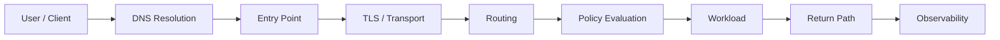

Setiap node punya failure mode sendiri.

| Tahap | Contoh Pertanyaan | Contoh Failure |
|---|---|---|
| DNS | Domain resolve ke IP mana? TTL berapa? Public/private? | stale record, wrong hosted zone, split-horizon salah |
| Entry point | Traffic masuk via CloudFront, ALB, NLB, API Gateway, atau GA? | listener salah, cert mismatch, wrong origin |
| TLS/Transport | TLS terminate di mana? TCP timeout di mana? | handshake fail, SNI mismatch, idle timeout |
| Routing | Destination IP cocok route table mana? | missing route, wrong target, blackhole route |
| Policy | SG/NACL/WAF/endpoint policy allow? | deny NACL ephemeral port, SG egress blocked |
| Workload | App listen di port yang benar? | app bind ke localhost, wrong health endpoint |
| Return path | Response kembali lewat jalur yang sama/valid? | asymmetric routing, NAT state lost |
| Observability | Log mana yang membuktikan hipotesis? | tidak ada flow log, no ALB access log, no DNS query log |

Prinsipnya:

> Jangan debug “AWS networking” secara umum. Debug satu packet path tertentu.

Kalimat yang lebih bagus daripada “service tidak bisa diakses” adalah:

> “Client `10.20.4.15` di subnet private `app-a` tidak bisa membuka TCP connection ke `10.30.8.21:443` melalui Transit Gateway attachment `tgw-attach-shared`; SYN keluar dari subnet source tapi tidak ada return SYN-ACK.”

Itu baru problem statement yang bisa diinvestigasi.

---

## 4. AWS Networking Bukan Satu Network, Tapi Banyak Boundary

Kesalahan umum: membayangkan AWS seperti satu data center besar dengan network datar.

Lebih tepat:

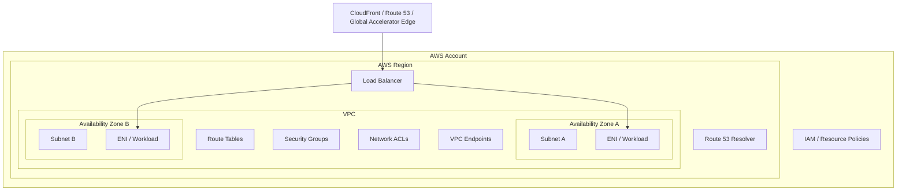

Boundary utama:

| Boundary | Apa yang Diisolasi | Kenapa Penting |
|---|---|---|
| Account | ownership, IAM, billing, blast radius | multi-team dan governance |
| Region | geography, regulatory scope, regional service boundary | latency, compliance, disaster recovery |
| Availability Zone | physical/fault isolation dalam Region | high availability dan zonal blast radius |
| VPC | private network address space dan routing domain | workload isolation dan topology |
| Subnet | zonal IP range + route table association | placement dan routing intent |
| Route Table | forwarding decision | menentukan next hop |
| Security Group | stateful ENI/resource-level filtering | workload-level allow list |
| NACL | stateless subnet-level filtering | coarse guardrail atau deny control |
| Endpoint/LB/Gateway | managed network function | ingress, egress, private service access |
| DNS Zone | naming authority | discovery dan traffic steering |
| Edge Location | global request handling/cache/security | latency dan global resilience |

Di AWS, desain yang kuat biasanya bukan karena semua resource bisa saling bicara. Desain yang kuat justru karena **hanya path yang benar yang bisa bicara**, dan path itu bisa dijelaskan.

---

## 5. Tujuh Pertanyaan Wajib untuk Setiap Network Path

Saat mendesain atau men-debug jalur komunikasi, selalu jawab tujuh pertanyaan ini.

### 5.1 Nama Resolve ke Mana?

Contoh:

```txt
app.example.com -> CloudFront distribution
api.internal.example.com -> private ALB
s3.ap-southeast-1.amazonaws.com -> public AWS endpoint atau VPC endpoint private DNS
```

DNS adalah awal dari banyak routing decision. Kalau DNS salah, route table dan firewall yang benar pun tidak membantu.

Yang perlu ditanyakan:

- Apakah domain public atau private?
- Hosted zone mana yang authoritative?
- Apakah ada private hosted zone dengan nama yang sama?
- Apakah client memakai VPC resolver, corporate resolver, atau public resolver?
- TTL berapa?
- Apakah record menggunakan alias ke AWS resource?
- Apakah failover/weighted/latency routing policy aktif?

### 5.2 Entry Point Pertama Siapa?

Traffic dari client tidak “masuk ke VPC” begitu saja.

Biasanya masuk lewat salah satu:

| Entry Point | Cocok untuk |
|---|---|
| CloudFront | global HTTP(S), static/dynamic content, cache, WAF at edge |
| Global Accelerator | static anycast IP, TCP/UDP acceleration, multi-region failover |
| Route 53 | DNS-level steering |
| ALB | regional HTTP(S), host/path routing, app-layer routing |
| NLB | regional TCP/UDP/TLS, high-performance L4, source IP preservation |
| API Gateway | managed API entry point, auth/throttling/API lifecycle |
| Site-to-Site VPN | hybrid encrypted tunnel |
| Direct Connect | private dedicated connectivity |
| Client VPN / Verified Access | user access to private apps |
| VPC Endpoint | private access to AWS/service provider endpoints |

Entry point menentukan:

- IP yang dilihat client.
- TLS boundary.
- Source IP yang dilihat backend.
- Health check model.
- Logging yang tersedia.
- DDoS/WAF/security layer yang bisa dipakai.
- Failure domain dan scaling behavior.

### 5.3 Route Table Memilih Next Hop Apa?

Route table menjawab:

> Untuk destination CIDR ini, traffic diarahkan ke target mana?

Contoh route intent:

```txt
10.0.0.0/16      local
0.0.0.0/0        nat-0123
10.20.0.0/16     tgw-0123
pl-abc123        vpce-0123
::/0             eigw-0123
```

Tapi route table bukan security policy. Route table hanya forwarding intent.

Ada route bukan berarti traffic allowed. Tidak ada route biasanya berarti traffic tidak tahu jalan.

### 5.4 Policy Mana yang Mengevaluasi Traffic?

Policy bisa muncul di banyak layer:

| Layer | Policy |
|---|---|
| DNS | DNS Firewall, Resolver rules |
| Edge | WAF, Shield, CloudFront geo restriction, signed URL/cookie |
| Load balancer | listener rule, TLS policy, target group health |
| VPC/subnet | NACL |
| ENI/resource | Security Group |
| Endpoint | VPC endpoint policy |
| Service | resource policy, IAM policy |
| Host/container | OS firewall, app auth, service mesh policy |

Jangan menganggap “network policy” hanya Security Group.

Contoh kegagalan nyata:

- Route ada, SG allow, tapi NACL outbound ephemeral port deny.
- DNS resolve ke public endpoint, padahal expected private endpoint.
- Endpoint policy deny `s3:GetObject`, padahal network path reachable.
- WAF block request karena managed rule mendeteksi payload tertentu.
- ALB listener route ke target group yang semua target-nya unhealthy.

### 5.5 Apakah Ada Address Translation?

IP yang dikirim client belum tentu IP yang diterima backend.

Contoh translation/proxy behavior:

| Komponen | Efek |
|---|---|
| NAT Gateway | source private IP diterjemahkan untuk outbound IPv4 |
| Internet Gateway | public IPv4 mapping untuk resource tertentu |
| ALB | backend melihat source dari ALB nodes; client IP via header seperti `X-Forwarded-For` |
| NLB | dapat mempertahankan source IP dalam skenario tertentu |
| CloudFront | origin melihat CloudFront edge sebagai client network path; original client data via headers |
| PrivateLink | consumer mengakses service provider via endpoint ENI; provider tidak melihat routing consumer langsung |
| API Gateway | backend melihat API Gateway/VPC Link behavior, bukan raw client langsung |

Translation penting untuk:

- allowlist IP,
- audit log,
- rate limiting,
- forensic,
- compliance,
- asymmetric routing,
- debugging koneksi.

### 5.6 Siapa yang Menyimpan State?

Beberapa komponen stateful, beberapa stateless.

| Komponen | Stateful? | Implikasi |
|---|---:|---|
| Security Group | Ya | Return traffic otomatis allowed untuk koneksi yang diizinkan |
| NACL | Tidak | Inbound dan outbound harus eksplisit, termasuk ephemeral ports |
| NAT Gateway | Ya | Ada connection tracking dan potensi port exhaustion |
| ALB/NLB | Ya, untuk connection management | Ada idle timeout dan health state |
| Route table | Tidak | Hanya lookup destination |
| DNS | Tidak untuk packet, tapi ada cache TTL | Perubahan tidak langsung terlihat semua client |

Banyak incident networking adalah incident state:

- connection idle timeout lebih pendek dari app expectation,
- NAT port exhaustion,
- stale DNS cache,
- health check state out-of-sync dengan actual app readiness,
- failover path butuh state baru tapi client masih reuse koneksi lama.

### 5.7 Apa Bukti Observability-nya?

Tanpa observability, debugging berubah menjadi cerita.

Minimal sumber bukti:

| Pertanyaan | Bukti yang Dicari |
|---|---|
| DNS resolve ke mana? | `dig`, Route 53 query logs, resolver logs |
| Packet lewat subnet? | VPC Flow Logs |
| Load balancer menerima request? | ALB/NLB access logs, metrics |
| Target sehat? | Target group health, app health logs |
| WAF block? | WAF logs |
| CloudFront cache hit/miss? | CloudFront logs, cache metrics |
| Route reachable? | Reachability Analyzer, Network Access Analyzer |
| Hybrid route advertised? | BGP route table, VPN/DX metrics |
| NAT bottleneck? | NAT Gateway metrics, flow logs |

Prinsip debugging:

> Jangan mencari “penyebab” dulu. Cari bukti di boundary pertama tempat packet hilang atau berubah.

---

## 6. Control Plane vs Data Plane

AWS networking selalu punya dua sisi:

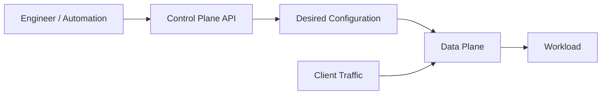

### Control Plane

Control plane adalah API administratif untuk membuat, mengubah, membaca, dan menghapus resource. Contoh:

- create VPC,
- update route table,
- attach internet gateway,
- create CloudFront distribution,
- update DNS record,
- modify security group,
- create load balancer listener,
- create Transit Gateway attachment.

### Data Plane

Data plane adalah jalur yang benar-benar memproses traffic user/workload. Contoh:

- packet dari EC2 ke database,
- HTTP request dari user ke CloudFront,
- DNS query ke Route 53,
- TCP connection ke NLB,
- packet melewati NAT Gateway,
- private request ke interface endpoint.

### Kenapa Ini Penting?

Karena incident bisa terjadi di salah satu sisi.

| Scenario | Control Plane | Data Plane |
|---|---|---|
| Tidak bisa create NAT Gateway | Bermasalah | Belum tentu existing NAT traffic terdampak |
| Existing CloudFront masih serve cache, tapi config update gagal | Bermasalah | Bisa tetap berjalan |
| Route table salah target | Config control plane berhasil | Data plane salah forwarding |
| Security group update belum efektif di semua path | Baru berubah | Data plane propagation perlu diperhatikan |
| AZ impairment | Mungkin control/data berbeda dampaknya | Tergantung service dan placement |

Untuk arsitektur resilient, jangan merancang recovery yang bergantung penuh pada control plane saat krisis.

Contoh buruk:

> Saat AZ A gagal, baru create capacity di AZ B, baru update route, baru update DNS, baru attach target.

Contoh lebih baik:

> Capacity AZ B sudah warm, target sudah registered, DNS/LB sudah punya health check, traffic bisa bergeser melalui data plane tanpa banyak perubahan control plane manual.

Ini disebut mindset **static stability**: sistem sudah memiliki kapasitas dan konfigurasi yang cukup sebelum failure terjadi.

---

## 7. Traffic Class: Jangan Campur Semua Traffic

Dalam produksi, traffic harus diklasifikasikan. Setiap class punya policy, routing, observability, dan risk profile berbeda.

| Traffic Class | Contoh | Pertanyaan Desain |
|---|---|---|
| Public ingress | user → CloudFront/ALB/API | Apakah perlu WAF, Shield, TLS, rate limit, geo policy? |
| Public egress | private app → internet API | Apakah egress centralized? NAT cost? domain allowlist? |
| Private east-west | service A → service B | VPC peering/TGW/Lattice/PrivateLink? siapa boleh akses? |
| AWS service access | app → S3/DynamoDB/Secrets Manager | public endpoint atau VPC endpoint? endpoint policy? |
| Hybrid ingress | on-prem → AWS | VPN/DX/TGW? BGP? DNS? segmentation? |
| Hybrid egress | AWS → on-prem | return path? route advertisement? firewall state? |
| Management access | admin → private resource | SSM, Client VPN, Verified Access, bastion? |
| Replication | DB/cache/object replication | bandwidth, consistency, failover, encryption? |
| Observability telemetry | app/agent → logs/metrics | endpoint availability, buffering, backpressure? |

Anti-pattern umum: semua traffic melewati satu route `0.0.0.0/0` menuju satu NAT/egress firewall tanpa klasifikasi. Awalnya sederhana. Nanti sulit diaudit, mahal, dan rapuh.

---

## 8. Request Path Example: Public Web App

Arsitektur sederhana:

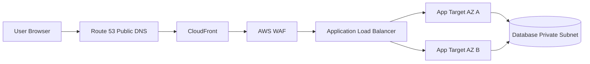

Request path yang benar-benar perlu dipikirkan:

1. Browser resolve `app.example.com`.
2. DNS mengarah ke CloudFront distribution.
3. Browser membuka TLS ke CloudFront edge.
4. CloudFront mengevaluasi cache behavior.
5. WAF mengevaluasi request.
6. CloudFront meneruskan request ke origin ALB jika cache miss atau dynamic path.
7. ALB menerima TLS/HTTP sesuai listener.
8. ALB memilih target sehat di target group.
9. Security Group ALB harus boleh menerima dari CloudFront/origin-facing path yang sesuai.
10. Security Group target harus allow dari Security Group ALB, bukan dari seluruh internet.
11. App memproses request.
12. App membuka koneksi ke database di private subnet.
13. Database SG allow dari app SG.
14. Response kembali ke app → ALB → CloudFront → browser.

Sekilas ini “web app biasa”. Tetapi ada banyak boundary:

| Boundary | Contoh Keputusan |
|---|---|
| DNS | Route 53 alias ke CloudFront |
| Edge | CloudFront cache/TLS/policy |
| Security | WAF at edge |
| Regional ingress | ALB listener/rules |
| Zonal placement | target di multi-AZ |
| Workload policy | SG ALB → SG app |
| Data access | SG app → SG database |
| Observability | CloudFront logs, WAF logs, ALB logs, app logs, DB logs |

Kalau request gagal, jangan langsung lihat semua. Ikuti packet path.

---

## 9. Request Path Example: Private Service-to-Service

Contoh internal:

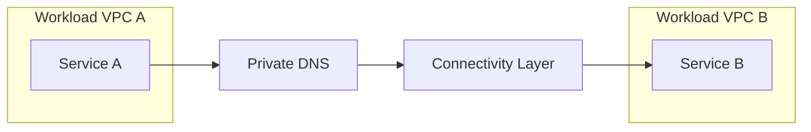

Connectivity layer bisa berupa:

- VPC peering,
- Transit Gateway,
- PrivateLink,
- VPC Lattice,
- service mesh di atas Kubernetes,
- hybrid route via on-prem,
- shared VPC.

Pertanyaan engineering:

| Pertanyaan | Kenapa Penting |
|---|---|
| Apakah service A perlu full network reachability ke VPC B? | Kalau tidak, PrivateLink/Lattice mungkin lebih aman daripada peering/TGW. |
| Apakah IP range overlap? | Peering/TGW butuh non-overlap; PrivateLink bisa menghindari sebagian masalah overlap. |
| Apakah routing harus transitive? | Peering tidak transitive; TGW bisa menjadi hub. |
| Siapa owner DNS private service? | Cross-account private DNS sering menjadi sumber incident. |
| Siapa yang melakukan auth? | Network reachability bukan authorization aplikasi. |
| Apakah consumer perlu tahu IP backend? | Sebaiknya tidak, gunakan service endpoint/DNS. |
| Bagaimana observability lintas account? | Flow logs dan LB logs tersebar jika tidak dirancang. |

Jangan otomatis memilih Transit Gateway untuk semua service-to-service. Kadang kamu butuh routing fabric. Kadang kamu hanya butuh private service exposure.

---

## 10. “Route Exists” Tidak Sama dengan “Reachable”

Misalnya:

```txt
Source: 10.10.1.25
Destination: 10.20.3.50:443
Route: 10.20.0.0/16 -> tgw-123
```

Route ada. Tapi traffic tetap bisa gagal karena:

1. Route balik dari destination ke source tidak ada.
2. TGW route table source association salah.
3. TGW route table propagation tidak aktif.
4. Destination subnet NACL deny inbound 443.
5. Destination NACL deny outbound ephemeral response.
6. Destination Security Group tidak allow source/SG.
7. Source Security Group egress deny.
8. Host firewall deny.
9. App tidak listen di 443.
10. TLS SNI/certificate mismatch.
11. DNS resolve ke IP lama.
12. Return path lewat firewall stateful yang tidak melihat SYN awal.

Jadi reachable berarti seluruh chain valid:

```txt
Name -> Address -> Route Forward -> Policy Forward -> App Accept -> Policy Return -> Route Return -> Client Accept
```

---

## 11. AWS Networking Invariants

Invariant adalah aturan yang harus selalu benar. Ini sangat berguna untuk desain dan review.

### Invariant 1 — Every path must have a forward route and a return route

Bahkan jika policy allow, response perlu jalan pulang.

Kecuali untuk protokol/flow tertentu yang one-way, mayoritas traffic produksi butuh return path.

### Invariant 2 — Route tables do not grant permission

Route table hanya memilih next hop. Permission dievaluasi oleh policy layer lain.

### Invariant 3 — Security Group statefulness does not remove the need for correct routing

SG bisa allow return traffic, tapi route balik tetap harus ada.

### Invariant 4 — NACL statelessness means ephemeral ports matter

Kalau NACL terlalu ketat tanpa memahami ephemeral port, traffic bisa terlihat “random timeout”.

### Invariant 5 — DNS is part of the network

DNS bukan hanya naming. DNS menentukan target, traffic steering, failover, dan private/public path.

### Invariant 6 — Load balancers are not transparent by default

Load balancer mengubah connection boundary. Backend belum tentu melihat source client asli sebagai peer TCP.

### Invariant 7 — AZ placement is a network decision

Subnet berada di satu AZ. NAT Gateway berada di satu AZ. ENI berada di satu AZ. Banyak cost dan failure pattern muncul dari placement ini.

### Invariant 8 — Public IP does not mean public path is desired

Resource bisa punya public endpoint, tapi produksi sering butuh private endpoint, CloudFront, WAF, mTLS, atau restricted ingress.

### Invariant 9 — Centralized networking increases control and blast radius at the same time

Egress VPC, inspection VPC, TGW hub, shared services VPC: semuanya meningkatkan standardisasi, tapi juga membuat dependency pusat.

### Invariant 10 — Observability must be designed before the incident

Flow logs, access logs, query logs, and metrics that are not enabled before incident often cannot reconstruct enough truth after the fact.

---

## 12. Reading AWS Network Diagrams Critically

Banyak diagram AWS terlihat rapi:

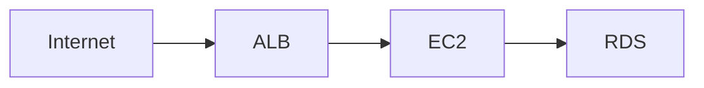

Itu terlalu miskin informasi.

Diagram produksi minimal harus menjawab:

- Region apa?
- AZ apa saja?
- Subnet mana public/private/isolated?
- Route table association mana?
- Ingress dari mana?
- Egress ke mana?
- Security Group trust relationship apa?
- DNS record apa?
- TLS terminate di mana?
- Health check apa?
- Log apa yang aktif?
- Apa failure behavior jika AZ A mati?
- Apa failure behavior jika NAT Gateway AZ A mati?
- Apa failure behavior jika CloudFront origin unreachable?

Diagram yang lebih baik:

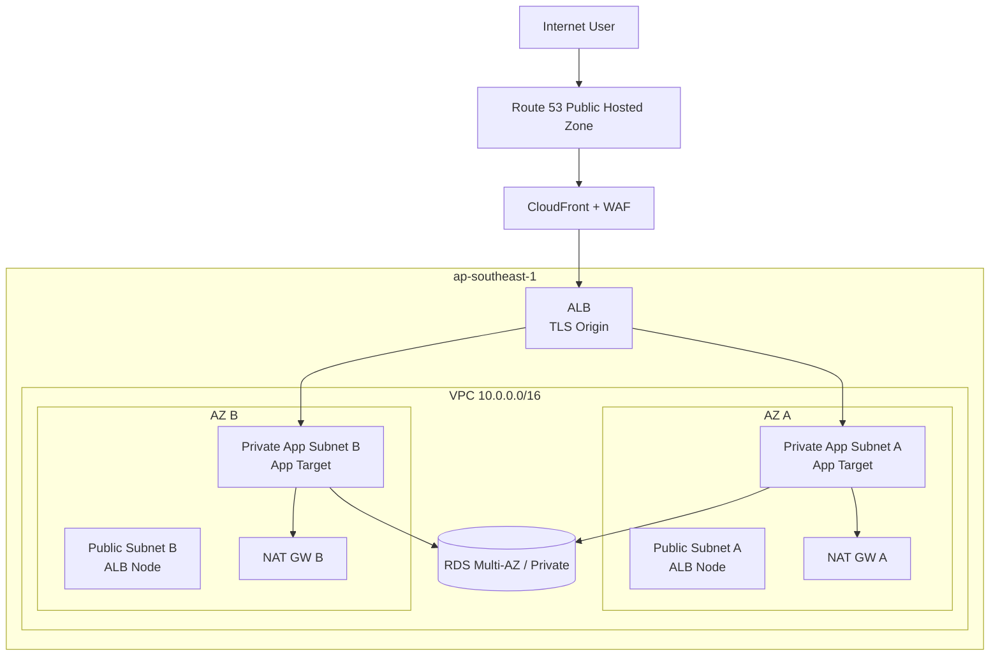

Masih belum lengkap, tapi jauh lebih mudah direview.

---

## 13. Design Pattern Shapes

Kita akan bertemu pola-pola ini sepanjang seri.

### 13.1 Single VPC Multi-AZ

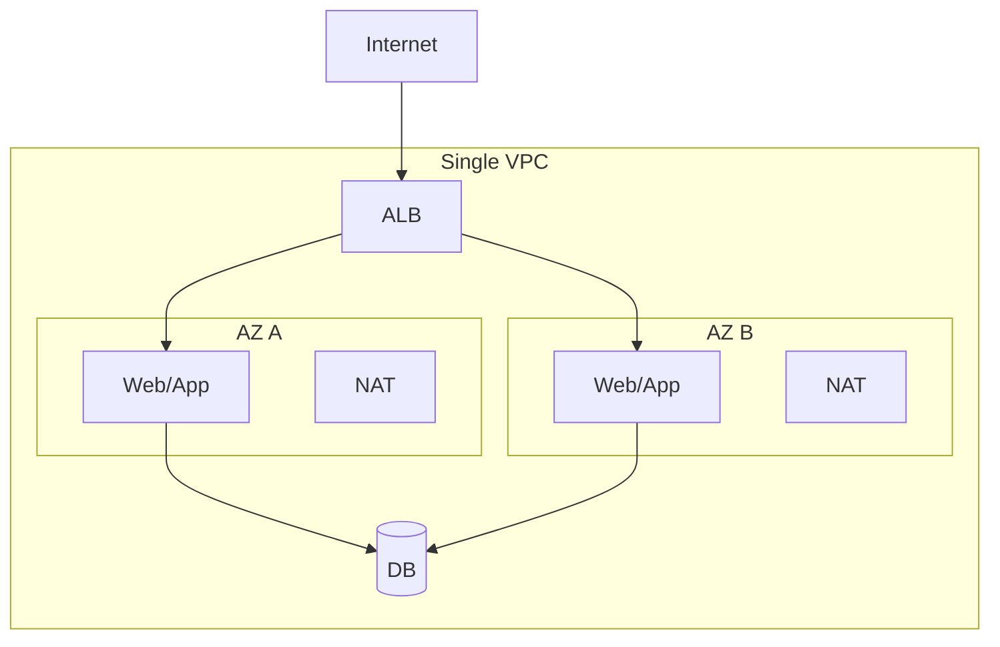

Cocok untuk:

- startup/single product,
- workload sederhana,
- lingkungan non-enterprise,
- low cross-account complexity.

Risiko:

- security boundary terbatas,
- IP planning bisa cepat berantakan,
- sulit jika multi-team/multi-account tumbuh.

### 13.2 Hub-and-Spoke via Transit Gateway

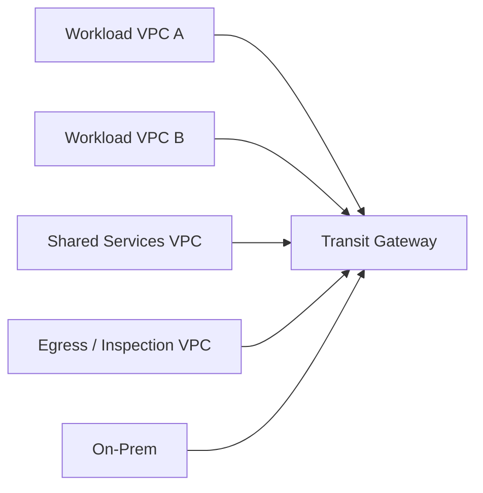

Cocok untuk:

- enterprise multi-account,
- hybrid connectivity,
- centralized inspection,
- shared DNS/services,
- route-domain segmentation.

Risiko:

- TGW route table complexity,
- centralized blast radius,
- cost per attachment/processing,
- hard-to-debug transitive flows.

### 13.3 Private Service Exposure via PrivateLink

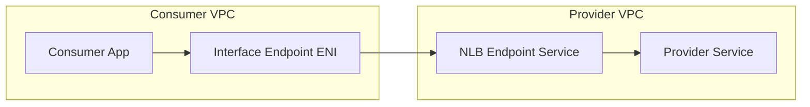

Cocok untuk:

- provider/consumer isolation,
- SaaS private access,
- cross-account private service,
- avoiding broad network reachability,
- partial mitigation for overlapping CIDR scenarios.

Risiko:

- provider complexity,
- DNS/private DNS behavior,
- NLB/backend semantics,
- per-AZ endpoint cost,
- not general routing fabric.

### 13.4 Edge-First Web Architecture

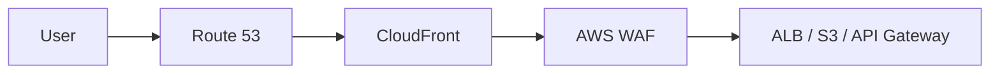

Cocok untuk:

- global users,
- static/dynamic web,
- cacheable assets,
- edge security,
- DDoS surface reduction,
- origin protection.

Risiko:

- cache invalidation mistakes,
- header/cookie/query cache key bugs,
- origin exposure if not locked down,
- debugging across edge and origin logs.

---

## 14. Latency, Throughput, and Jitter Are Different Problems

Networking discussions often mix these.

| Metric | Meaning | Typical Cause |
|---|---|---|
| Latency | time for one operation to complete | geography, routing path, TLS, app wait, congestion |
| Throughput | amount of data per unit time | bandwidth, window size, parallelism, service quotas |
| Jitter | variation in latency | congestion, queueing, noisy dependency, route instability |
| Packet loss | packet not delivered | congestion, policy drop, MTU issue, network fault |
| Connection rate | new connections per second | load balancer/backend/NAT/client behavior |
| Concurrent connections | active open connections | idle timeout, resource limits, connection pooling |

Example:

- CloudFront may improve latency by serving from edge cache.
- Global Accelerator may improve network path for TCP/UDP to regional endpoints.
- Direct Connect may improve predictable private connectivity, but does not automatically make bad application protocol design fast.
- NAT Gateway may be fine for throughput but become expensive or hit connection/port-related constraints depending on traffic pattern.

Always ask:

> Is this a latency problem, throughput problem, connection-state problem, DNS problem, or application problem?

---

## 15. Security Mental Model: Reachability Is Not Authorization

Network reachability answers:

> Can packet X reach endpoint Y?

Authorization answers:

> Is principal X allowed to perform action Y on resource Z?

They interact but are not the same.

Example: S3 access through VPC endpoint.

For a request to succeed, you may need:

1. DNS resolves S3 endpoint appropriately.
2. Route points to gateway/interface endpoint.
3. Security Group/NACL allows path if interface endpoint.
4. Endpoint policy allows operation/resource.
5. IAM identity policy allows operation.
6. Bucket policy allows operation and maybe restricts source VPC endpoint.
7. KMS key policy allows decrypt/encrypt if object encrypted with KMS.

A network engineer who ignores IAM will call it a “network problem”.
A security engineer who ignores DNS/routing will call it a “permission problem”.
A production engineer must walk the whole chain.

---

## 16. Common Failure Modes by Layer

| Layer | Failure Mode | Symptom |
|---|---|---|
| DNS | wrong zone/record, TTL stale, private zone shadowing public zone | client connects to unexpected IP |
| Route | missing route, blackhole TGW route, wrong default route | timeout, no response |
| SG | inbound/egress deny, wrong SG reference | timeout or connection refused depending target |
| NACL | ephemeral port deny, rule order issue | intermittent/one-way timeout |
| NAT | port exhaustion, single-AZ dependency, wrong route | outbound failures, sporadic resets/timeouts |
| LB | unhealthy target, listener mismatch, wrong target port | 502/503/504, health check failures |
| TLS | cert mismatch, unsupported cipher, SNI issue | handshake error |
| WAF | managed/custom rule block | 403 from edge/app entry |
| CloudFront | cache key wrong, origin inaccessible, invalidation race | stale content, 502/504, inconsistent behavior |
| Hybrid | BGP route not advertised, asymmetric firewall path | one-way traffic, tunnel up but app down |
| App | not listening, bind localhost, health endpoint wrong | connection refused, unhealthy target |

Debugging order:

1. Define exact source and destination.
2. Resolve DNS from the same network context as the failing client.
3. Prove route forward.
4. Prove policy forward.
5. Prove app listening/healthy.
6. Prove return route.
7. Check translation and stateful middleboxes.
8. Correlate logs across boundary.

---

## 17. Operational Questions for Design Review

Gunakan pertanyaan ini saat review desain AWS networking.

### 17.1 Ingress

- Apa public entry point utama?
- Apakah origin bisa diakses langsung tanpa edge/WAF?
- TLS terminate di mana?
- Apakah HTTP → HTTPS redirect terjadi di edge, ALB, atau app?
- Bagaimana DDoS dan bot traffic dimitigasi?
- Apa health check path yang digunakan?
- Apa failure behavior jika satu AZ target hilang?
- Apa failure behavior jika satu Region origin hilang?

### 17.2 Egress

- Workload mana yang perlu internet egress?
- Apakah egress per-AZ atau centralized?
- Apakah NAT Gateway per-AZ?
- Apakah domain/IP allowlisting dilakukan?
- Apakah AWS service access lewat public endpoint atau VPC endpoint?
- Bagaimana egress cost dihitung?
- Apakah ada dependency ke third-party API yang belum punya timeout/retry/circuit breaker?

### 17.3 East-West

- Apakah service-to-service butuh full routing atau hanya private service exposure?
- Apakah CIDR antar VPC/account overlap?
- Apakah DNS private cross-account dirancang?
- Apakah route domain segmented?
- Apakah ada inspection requirement?
- Apakah service auth ada di app layer?

### 17.4 Hybrid

- Siapa routing authority: AWS, on-prem, SD-WAN, firewall?
- Apakah BGP digunakan?
- Apakah route summarization aman?
- Apakah ada asymmetric routing lewat firewall stateful?
- Apakah DNS hybrid resolve dua arah?
- Apakah VPN backup untuk Direct Connect sudah diuji?

### 17.5 Observability

- Flow logs aktif di subnet/VPC yang tepat?
- ALB/NLB/CloudFront/WAF logs aktif?
- Route 53 Resolver query logs aktif untuk private DNS penting?
- Apakah log punya correlation ID/request ID?
- Apakah dashboard membedakan DNS, TCP, TLS, HTTP, app, dan dependency failures?

---

## 18. Packet Path Debugging Template

Gunakan template ini untuk setiap incident.

```txt
Incident:
  <apa yang gagal, sejak kapan, siapa terdampak>

Flow:
  Source identity:
  Source IP/subnet/VPC/account/Region/AZ:
  Destination DNS name:
  Resolved IP(s):
  Destination port/protocol:
  Expected entry point:
  Expected route target:
  Expected policy path:

Evidence:
  DNS result from source context:
  Route table source subnet:
  Route table destination subnet:
  SG source egress:
  SG destination ingress:
  NACL source/destination:
  Flow logs:
  LB logs:
  WAF/CloudFront logs:
  App logs:

Hypothesis:
  <boundary tempat packet hilang/ditolak/berubah>

Next proof:
  <satu bukti berikutnya yang akan membuktikan/membantah hipotesis>
```

Contoh singkat:

```txt
Flow:
  Source: service-a, 10.10.4.21, vpc-app-a, private subnet AZ A
  Destination: api.internal.example.com:443
  DNS: resolves to 10.30.2.15 and 10.30.8.20
  Expected path: VPC A -> TGW -> VPC Shared -> internal ALB -> service-b

Evidence:
  DNS correct from source host
  Source subnet route 10.30.0.0/16 -> tgw-abc exists
  TGW route table associated to source attachment does not have propagation from shared VPC attachment

Hypothesis:
  Packet enters TGW but TGW has no route to destination VPC.
```

Ini jauh lebih kuat daripada “cek SG dong”.

---

## 19. Practical Rule: Design the Path Before Creating Resources

Urutan buruk:

1. Buat VPC.
2. Buat subnet.
3. Buat route table.
4. Buat NAT.
5. Buat ALB.
6. Baru mikir traffic flow.

Urutan baik:

1. Definisikan traffic classes.
2. Definisikan trust boundary.
3. Definisikan ingress/egress/east-west/hybrid path.
4. Definisikan DNS model.
5. Definisikan route domains.
6. Definisikan policy layers.
7. Definisikan observability.
8. Baru create resources.

Networking bukan inventory resource. Networking adalah desain path.

---

## 20. Latihan Mental

Untuk setiap arsitektur AWS yang kamu lihat, jawab cepat:

1. Dari mana request masuk?
2. DNS resolve ke mana?
3. Apa public boundary pertama?
4. Apakah ada edge layer?
5. TLS terminate di mana?
6. Apakah source IP berubah?
7. Route table mana yang menentukan next hop?
8. SG mana yang allow path?
9. NACL apakah relevan?
10. Return path lewat mana?
11. Apa yang terjadi jika AZ A hilang?
12. Apa yang terjadi jika NAT Gateway AZ A hilang?
13. Apa yang terjadi jika DNS record stale?
14. Apa yang terjadi jika CloudFront origin tidak sehat?
15. Log mana yang membuktikan path tersebut?

Kalau kamu belum bisa jawab, arsitektur itu belum benar-benar kamu pahami.

---

## 21. Ringkasan

AWS networking harus dibaca sebagai kombinasi dari:

```txt
Name Resolution
+ Entry Point
+ Route
+ Policy
+ Translation
+ State
+ Placement
+ Observability
+ Failure Domain
```

Jangan menghafal layanan secara terpisah. Bangun kebiasaan membaca packet path.

Part berikutnya akan memperdalam **AWS Global Infrastructure and Fault Domains**: Region, AZ, Local Zone, Wavelength Zone, edge location, control plane/data plane, dan bagaimana semua itu mengubah desain availability, latency, dan disaster recovery.

---

## References

- AWS Documentation — What is Amazon VPC: https://docs.aws.amazon.com/vpc/latest/userguide/what-is-amazon-vpc.html
- AWS Documentation — Configure route tables: https://docs.aws.amazon.com/vpc/latest/userguide/VPC_Route_Tables.html
- AWS Documentation — Network ACLs: https://docs.aws.amazon.com/vpc/latest/userguide/vpc-network-acls.html
- AWS Documentation — NAT gateways: https://docs.aws.amazon.com/vpc/latest/userguide/vpc-nat-gateway.html
- AWS Whitepaper — AWS Fault Isolation Boundaries, Control planes and data planes: https://docs.aws.amazon.com/whitepapers/latest/aws-fault-isolation-boundaries/control-planes-and-data-planes.html
- AWS Documentation — What is Amazon CloudFront: https://docs.aws.amazon.com/AmazonCloudFront/latest/DeveloperGuide/Introduction.html
