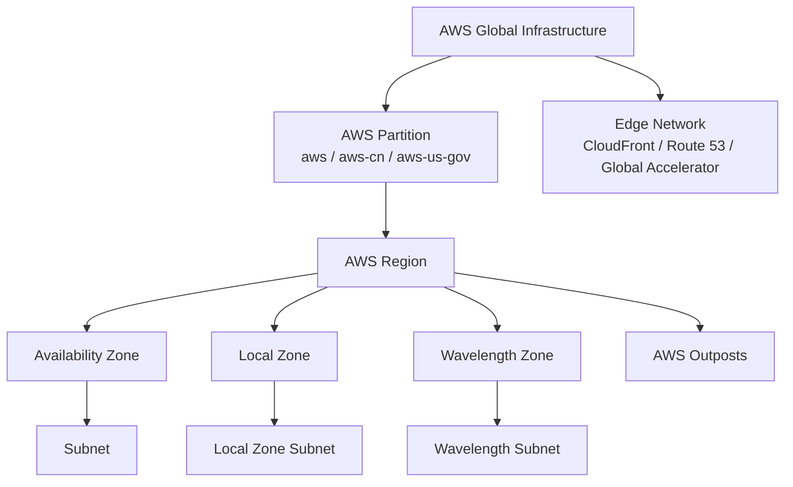
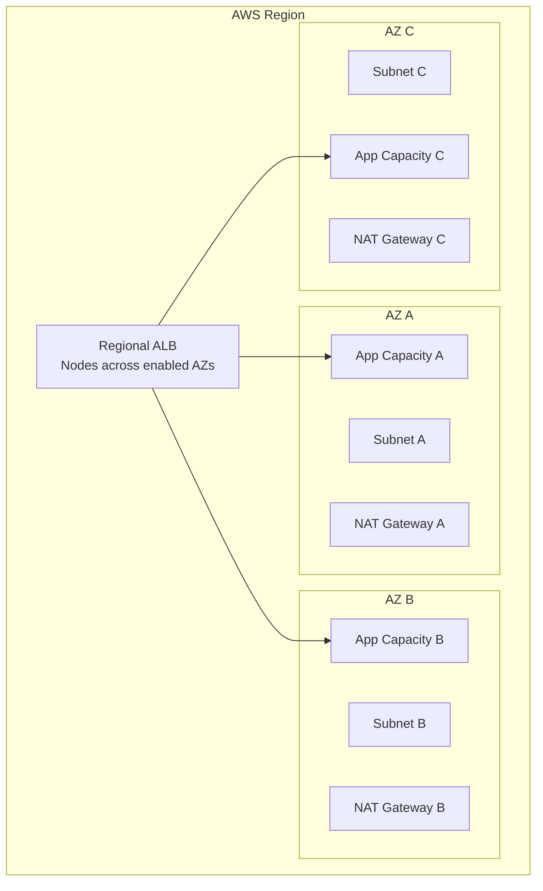
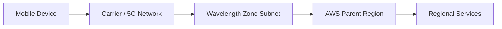
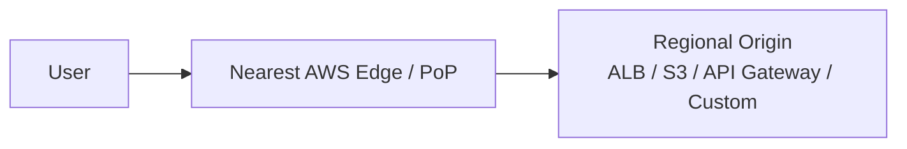
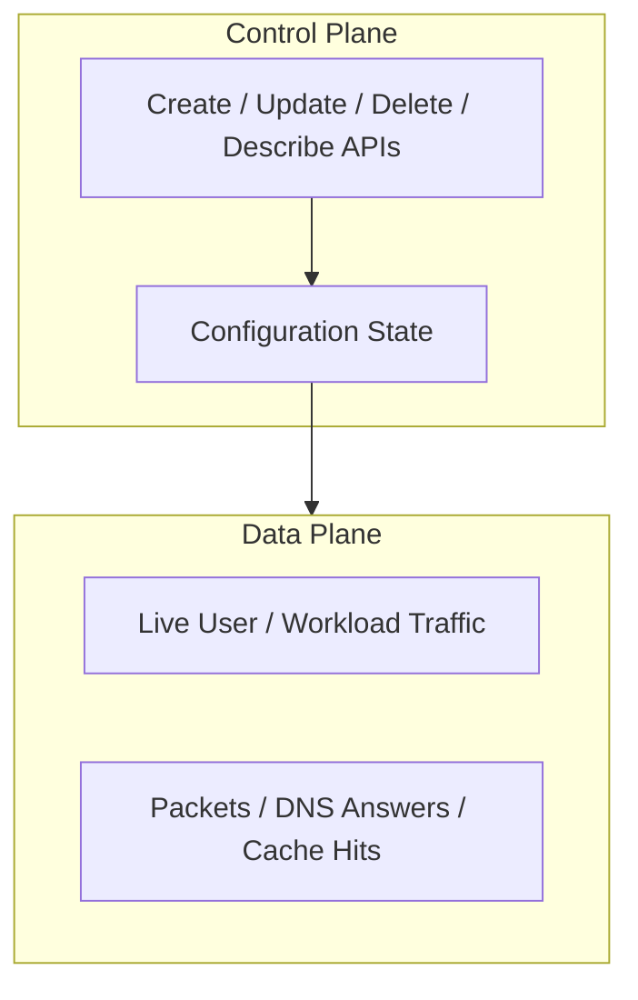
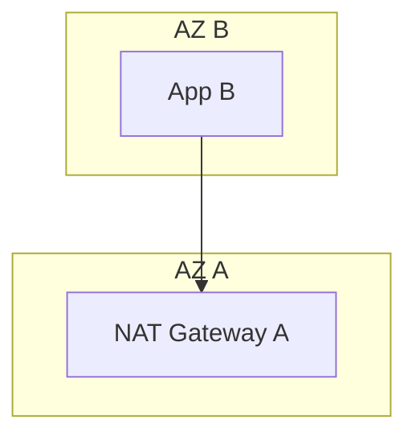
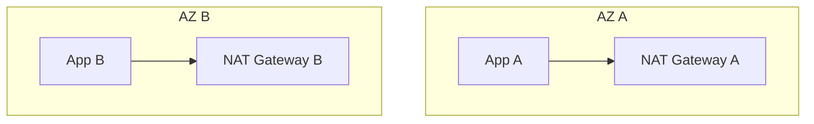
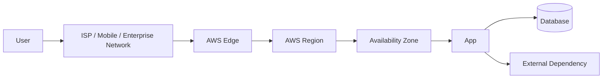
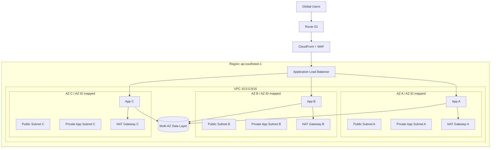

# Part 002 — AWS Global Infrastructure and Fault Domains

Di part sebelumnya kita membangun mental model packet path. Sekarang kita naik satu level: **di mana packet, resource, control plane, dan data plane itu hidup?**

Pertanyaan ini kelihatan sederhana, tetapi sering menjadi akar desain yang salah:

- Kenapa subnet harus dipilih per Availability Zone?
- Kenapa NAT Gateway sebaiknya per-AZ untuk workload multi-AZ?
- Kenapa nama `us-east-1a` tidak selalu berarti lokasi fisik yang sama di semua account?
- Kenapa “global service” belum tentu berarti control plane-nya global?
- Kenapa recovery plan yang mengandalkan create/update resource saat incident bisa rapuh?
- Kenapa edge service seperti CloudFront dan Route 53 mengubah failure model dibanding ALB regional?

Untuk menjadi kuat di AWS networking, kamu harus membaca infrastruktur AWS sebagai kumpulan **fault isolation boundary**.

---

## 1. Target Pembelajaran

Setelah part ini, kamu harus bisa:

1. Menjelaskan perbedaan Region, Availability Zone, Local Zone, Wavelength Zone, Outposts, dan edge location.
2. Memahami bahwa VPC adalah regional, sedangkan subnet adalah zonal.
3. Memakai AZ ID untuk desain multi-account yang konsisten.
4. Membedakan zonal, regional, dan global service dari sudut fault isolation.
5. Memisahkan control plane dan data plane dalam availability strategy.
6. Mendesain workload multi-AZ tanpa membuat dependency tersembunyi ke satu AZ.
7. Mengkritisi kapan multi-AZ cukup dan kapan multi-region dibutuhkan.
8. Membaca edge networking sebagai latency layer sekaligus resilience/security layer.

---

## 2. Infrastruktur AWS sebagai Peta Boundary

AWS menyediakan beberapa level lokasi:



Untuk networking, yang paling sering kamu pakai:

| Level | Karakter | Networking Implication |
|---|---|---|
| Region | geographic area dan regional service boundary | VPC dibuat di Region; banyak service regional |
| Availability Zone | isolated location dalam Region | subnet berada di satu AZ; multi-AZ untuk HA |
| Local Zone | extension dari Region dekat metro area tertentu | low-latency compute/storage dekat user, tetap punya dependency ke parent Region |
| Wavelength Zone | AWS infra di network operator telco | ultra-low latency untuk mobile/5G edge use case |
| Outposts | AWS-managed infrastructure on-premises | hybrid/local workloads dengan AWS API model |
| Edge Location / PoP | global edge network | CDN, DNS, acceleration, DDoS absorption |

Jangan melihat ini sebagai lokasi geografis saja. Lihat sebagai:

```txt
placement boundary + network path + control-plane dependency + failure blast radius
```

---

## 3. Region: Regional Boundary

Region adalah area geografis terpisah. Dalam Region, AWS menjalankan beberapa Availability Zone.

Dalam praktik arsitektur:

- VPC bersifat regional.
- Route 53 public hosted zone bersifat global/logical, tapi record bisa menunjuk resource di Region tertentu.
- ALB/NLB bersifat regional, tetapi node/target tersebar lintas AZ yang dipilih.
- Transit Gateway bersifat regional.
- NAT Gateway bersifat zonal.
- Subnet bersifat zonal.
- Banyak service punya endpoint regional.

### Region Selection Bukan Cuma Latency

Saat memilih Region, jangan hanya bertanya “yang paling dekat user mana?”

Pertimbangkan:

| Faktor | Pertanyaan |
|---|---|
| Latency | Seberapa jauh user/client utama dari Region? |
| Compliance | Apakah data harus tinggal di yurisdiksi tertentu? |
| Service availability | Apakah semua service/instance type yang dibutuhkan tersedia di Region itu? |
| Cost | Harga transfer data, compute, NAT, inter-region berbeda? |
| DR | Apakah ada Region kedua yang cocok untuk recovery? |
| Connectivity | Apakah Direct Connect location/partner tersedia dekat lokasi enterprise? |
| Talent/operation | Tim support bekerja di zona waktu mana? |
| Ecosystem | Apakah third-party dependency dekat Region tersebut? |

Region adalah keputusan produk, legal, operasi, dan network sekaligus.

---

## 4. Availability Zone: Unit Dasar High Availability

Availability Zone adalah lokasi terisolasi dalam Region. AZ dirancang untuk memberi fault isolation, tetapi tetap terhubung dengan jaringan low-latency/high-throughput di dalam Region.

Mental model:



### Subnet Adalah Zonal

Ini invariant penting:

> VPC regional, subnet zonal.

Karena subnet berada di satu AZ, maka route table association subnet adalah zonal placement decision. Jika kamu menaruh semua private subnet penting hanya di satu AZ, kamu belum memiliki multi-AZ architecture walaupun VPC bersifat regional.

### AZ Failure Thinking

Kalau AZ A bermasalah, pertanyaan desain:

- Apakah app capacity di AZ B/C cukup menerima traffic?
- Apakah database/failover dependency tersedia di AZ lain?
- Apakah NAT egress untuk workload AZ B bergantung pada NAT di AZ A?
- Apakah ALB punya target sehat di AZ lain?
- Apakah DNS menunjuk resource zonal tertentu?
- Apakah shared service hanya hidup di satu AZ?
- Apakah queue/cache/session store punya desain multi-AZ?
- Apakah deployment pipeline bisa tetap tidak menyentuh AZ bermasalah?

Multi-AZ bukan hanya “deploy dua instance”. Multi-AZ berarti semua dependency penting punya jawaban saat satu AZ hilang.

---

## 5. AZ Name vs AZ ID: Jebakan Multi-Account

Di AWS, nama AZ seperti `us-east-1a` tidak selalu menunjuk lokasi fisik yang sama di semua account lama/berbeda. AWS menyediakan **AZ ID** yang konsisten lintas account, misalnya `use1-az1`.

Contoh konseptual:

```txt
Account A:
  us-east-1a -> use1-az6
  us-east-1b -> use1-az2

Account B:
  us-east-1a -> use1-az2
  us-east-1c -> use1-az6
```

Kalau platform team berkata:

> “Taruh workload di us-east-1a supaya dekat dengan shared service.”

Itu bisa salah jika account berbeda.

Yang benar:

> “Taruh workload di AZ ID `use1-az6`; di account kamu mungkin namanya `us-east-1c`.”

### Kenapa Ini Penting untuk Networking?

Karena cross-AZ path memengaruhi:

- latency,
- data transfer cost,
- failure isolation,
- NAT Gateway placement,
- stateful firewall placement,
- shared VPC/subnet sharing,
- service endpoint per-AZ,
- PrivateLink endpoint alignment,
- zonal shift/failover strategy.

Untuk multi-account landing zone, dokumentasikan mapping AZ ID sejak awal.

---

## 6. Local Zones: Edge-ish, Tapi Masih Parent Region-Oriented

Local Zone adalah extension AWS infrastructure yang mendekatkan compute/storage tertentu ke kota/metro area tertentu.

Gunakan Local Zone jika:

- user/app butuh latency rendah ke metro tertentu,
- workload butuh compute dekat end user,
- data processing harus dekat sumber data,
- kamu tetap ingin model AWS service/API untuk subset service.

Tapi Local Zone bukan “Region mini” penuh.

Pertanyaan desain:

| Pertanyaan | Kenapa Penting |
|---|---|
| Service apa yang tersedia di Local Zone itu? | Tidak semua service/fitur tersedia. |
| Parent Region-nya mana? | Control plane dan beberapa dependency tetap ke parent Region. |
| Apakah failover ke AZ parent Region bisa diterima latensinya? | Local Zone failure bisa butuh fallback. |
| Public IP/network border group bagaimana? | Elastic IP dan advertisement bisa terkait network border group. |
| Data gravity ada di mana? | Kalau database utama di Region, latency tetap ada. |

Local Zone adalah alat latency placement, bukan pengganti desain regional HA.

---

## 7. Wavelength Zones: Telco Edge

Wavelength Zone membawa AWS compute/storage tertentu ke network operator telekomunikasi. Use case utamanya adalah aplikasi yang butuh latency sangat rendah ke mobile device atau network telco.

Contoh use case:

- AR/VR,
- video analytics dekat mobile network,
- connected vehicles,
- industrial/mobile edge,
- gaming latency-sensitive,
- real-time inference dekat user mobile.

Mental model:



Pertanyaan desain:

- Apakah workload benar-benar membutuhkan telco-edge latency?
- Apakah state harus disimpan lokal atau regional?
- Bagaimana failover jika Wavelength Zone tidak tersedia?
- Apakah data perlu direplikasi ke Region?
- Bagaimana observability dari edge workload ke regional monitoring?

Wavelength menambah pilihan placement, tetapi juga menambah complexity. Jangan pakai hanya karena terdengar advance.

---

## 8. AWS Outposts: AWS di Lokasi Kamu

Outposts adalah AWS-managed infrastructure yang berjalan di lokasi on-premises/customer site.

Gunakan jika:

- workload harus tetap on-prem karena latency ke sistem lokal,
- data residency/operational constraint,
- integration dengan sistem industri/lokal,
- kamu ingin AWS operational model dekat data center sendiri.

Networking implication:

- Outposts tetap punya dependency ke parent Region untuk control plane.
- Connectivity antara site dan Region menjadi critical dependency.
- Kamu harus memikirkan local gateway, routing ke jaringan lokal, dan failover ke Region.
- Observability/operation perlu mengakui bahwa physical site failure adalah boundary tambahan.

Outposts bukan sekadar rack. Ia mengubah shared responsibility, connectivity, dan failure modelling.

---

## 9. Edge Network: CloudFront, Route 53, Global Accelerator

AWS edge network dipakai oleh layanan seperti:

- Amazon CloudFront,
- Amazon Route 53,
- AWS Global Accelerator,
- AWS Shield,
- AWS WAF saat dipasang di CloudFront,
- Lambda@Edge / CloudFront Functions dalam konteks tertentu.

Edge service mengubah arsitektur karena request tidak langsung masuk ke Region.



### CloudFront

CloudFront membawa content delivery dan HTTP(S) edge behavior:

- cache,
- TLS at edge,
- origin request policy,
- cache key control,
- WAF integration,
- signed URL/cookie,
- origin failover,
- edge compute.

### Route 53

Route 53 authoritative DNS bisa menjadi traffic steering layer:

- simple routing,
- weighted routing,
- latency routing,
- failover routing,
- geolocation/geoproximity,
- health checks.

### Global Accelerator

Global Accelerator memberi static anycast IP dan membawa TCP/UDP traffic ke AWS edge lalu ke regional endpoints melalui AWS global network.

Cocok untuk:

- non-HTTP workloads,
- fixed IP requirement,
- multi-region failover,
- latency-sensitive TCP/UDP,
- client yang sulit update endpoint/IP.

### Edge Does Not Remove Regional Design

Edge membantu latency, cache, DDoS absorption, dan routing. Tetapi origin tetap perlu sehat.

Kalau origin ALB hanya punya target di satu AZ, CloudFront tidak otomatis membuat origin multi-AZ. Edge layer memperbaiki bagian depan, bukan semua dependency belakang.

---

## 10. Zonal, Regional, Global Services

AWS service bisa dipahami dari fault isolation boundary-nya:

| Service Scope | Meaning | Design Implication |
|---|---|---|
| Zonal | resource/data plane berada di satu AZ/zone | harus deploy multi-AZ sendiri untuk HA |
| Regional | service/resource beroperasi dalam satu Region | tahan sebagian zonal failure, tapi Region tetap boundary |
| Global | service punya footprint global/partitional/edge | perlu pahami control plane vs data plane dan home Region |

Contoh konseptual:

| Resource/Service | Scope yang Perlu Dipikirkan |
|---|---|
| Subnet | zonal |
| NAT Gateway | zonal |
| ENI | zonal |
| EBS volume | zonal |
| ALB | regional with zonal nodes/targets |
| NLB | regional with zonal behavior |
| VPC | regional |
| Transit Gateway | regional |
| Route 53 public DNS data plane | global/edge-oriented |
| CloudFront | global edge data plane |
| IAM | global/partitional service model |

Catatan: scope layanan bisa punya nuance. Jangan menghafal tabel secara buta. Selalu cek dokumentasi service ketika desain high availability.

---

## 11. Control Plane/Data Plane dalam Fault Domain

Part sebelumnya memperkenalkan control plane/data plane. Di part ini kita hubungkan dengan lokasi.



Saat failure, pertanyaannya:

- Apakah control plane tidak bisa menerima perubahan?
- Apakah data plane existing masih berjalan?
- Apakah recovery membutuhkan perubahan control plane?
- Apakah konfigurasi sudah pre-provisioned sebelum failure?

### Static Stability

Static stability berarti sistem bisa tetap melayani atau recover tanpa perlu perubahan control plane kritis saat incident.

Contoh:

| Kurang Stabil | Lebih Stabil |
|---|---|
| Saat AZ gagal, baru launch instance di AZ lain | Capacity AZ lain sudah warm |
| Saat origin gagal, baru update DNS manual | DNS/CloudFront/GA health-based failover sudah siap |
| Saat NAT AZ A gagal, semua subnet pakai NAT AZ A | Setiap AZ punya NAT sendiri dan route lokal AZ |
| Saat TGW route salah, operator edit saat incident | Route domain diuji dan validated sebelum produksi |
| Saat cert expired, baru issue cert | Certificate rotation monitored dan automated |

Semakin sedikit recovery bergantung pada live control-plane mutation, semakin baik.

---

## 12. Multi-AZ Design: Bukan Sekadar Checklist

Multi-AZ design berarti semua layer kritis punya placement dan failover behavior lintas AZ.

### 12.1 Compute

- App targets tersebar lintas AZ.
- Auto Scaling Group punya subnet multi-AZ.
- Capacity cukup untuk loss of one AZ, atau degraded mode jelas.
- Deployment tidak mengganti semua AZ sekaligus.

### 12.2 Load Balancing

- ALB/NLB enabled di minimal dua AZ.
- Target group punya target sehat di beberapa AZ.
- Health check mengukur readiness nyata, bukan sekadar process hidup.
- Cross-zone load balancing behavior dipahami.

### 12.3 Egress

Anti-pattern:



Masalah:

- AZ B egress bergantung pada AZ A.
- Cross-AZ data transfer bisa bertambah.
- Jika AZ A/NAT A terganggu, workload AZ B ikut terdampak.

Pattern lebih baik:



### 12.4 Data Layer

Data layer lebih kompleks:

- RDS Multi-AZ berbeda dengan read replica.
- Cache cluster punya shard/replica placement.
- Queue regional service bisa mengurangi zonal dependency, tetapi client connectivity tetap perlu diperhatikan.
- Storage durability dan availability berbeda tiap service.

### 12.5 Shared Services

Shared services sering menjadi single point of failure tersembunyi:

- internal DNS resolver endpoint hanya di satu AZ,
- inspection firewall appliance hanya di satu AZ,
- bastion host hanya di satu AZ,
- private CA/secret proxy/internal auth endpoint single-AZ,
- logging collector hanya di satu AZ.

Multi-AZ tidak lengkap jika shared services single-AZ.

---

## 13. Multi-Region: Kapan Perlu?

Multi-region mahal dan kompleks. Jangan menjadikannya reflex.

Gunakan multi-region jika:

- RTO/RPO bisnis tidak bisa dipenuhi oleh multi-AZ,
- regulatory/compliance butuh regional isolation,
- user global butuh latency lebih dekat ke beberapa geography,
- disaster recovery terhadap regional impairment wajib,
- product harus tetap melayani saat satu Region unavailable,
- data sovereignty butuh deployment regional berbeda.

Jangan pakai multi-region hanya karena:

- terlihat enterprise,
- ingin “high availability” tanpa menghitung dependency,
- belum menyelesaikan multi-AZ hygiene,
- tidak siap data replication/conflict/failback,
- tidak siap operational drill.

### Multi-AZ vs Multi-Region Decision

| Kebutuhan | Bias Desain |
|---|---|
| AZ failure resilience | Multi-AZ |
| Low latency dalam satu negara/area | Region terdekat + edge/CDN |
| Low latency global HTTP | CloudFront + regional/multi-region origin jika perlu |
| Fixed IP global TCP/UDP | Global Accelerator |
| Regional disaster recovery | Multi-region DR |
| Active-active global writes | Multi-region data architecture, sangat hati-hati |
| Compliance regional separation | Multi-region/account separation |

---

## 14. Network Border Group

Network border group adalah set lokasi tempat AWS mengiklankan public IP address. Ini relevan saat kamu bekerja dengan Elastic IP, Local Zones, Wavelength Zones, dan public reachability tertentu.

Mental model:

```txt
Public IP advertisement is not just “global internet”.
It is associated with where AWS announces that address from.
```

Kenapa penting:

- Local Zone public egress/ingress bisa terkait network border group.
- Salah memilih address pool/location bisa memengaruhi latency dan reachability.
- Edge/local infrastructure punya path berbeda dari Region biasa.

Untuk basic VPC di Region standar, kamu tidak selalu memikirkan network border group. Untuk edge/hybrid placement, ini mulai penting.

---

## 15. Data Transfer and Fault Domain

Networking architecture selalu punya konsekuensi biaya.

Contoh:

| Desain | Risiko Biaya |
|---|---|
| App AZ B memakai NAT Gateway AZ A | cross-AZ transfer + dependency AZ A |
| Semua VPC egress lewat centralized inspection | processing + inter-AZ/inter-VPC path cost |
| Multi-region active-active | inter-region replication cost |
| CloudFront origin tidak cache-friendly | origin data transfer dan load tinggi |
| PrivateLink per-AZ endpoint banyak | endpoint hourly + data processing cost |
| TGW sebagai default semua traffic | TGW processing/attachment cost |

Jangan bahas availability tanpa cost. Banyak desain “highly available” gagal di review karena biaya operasionalnya tidak dipahami.

---

## 16. Latency Topology

Latency bukan hanya jarak user ke Region. Ada banyak segmen:



Contoh diagnosis:

| Symptom | Kemungkinan Penyebab |
|---|---|
| User global lambat untuk static asset | tidak memakai CDN/cache policy buruk |
| API lambat hanya untuk negara tertentu | ISP routing/geography/edge path |
| App lambat setelah masuk Region | app/db/dependency, bukan edge |
| Service A ke B lambat | cross-AZ/cross-region/TGW/inspection path |
| Hybrid app lambat | Direct Connect/VPN path, BGP route, on-prem firewall |

Optimasi latency harus tahu segmen mana yang dominan.

---

## 17. Production Failure Scenarios

### Scenario 1 — Single-AZ NAT Dependency

```txt
Symptom:
  Workload di AZ B tidak bisa akses external API saat AZ A terganggu.

Root cause:
  Private subnet AZ B route default ke NAT Gateway di AZ A.

Prevention:
  NAT Gateway per AZ, route private subnet ke NAT lokal AZ.
```

### Scenario 2 — AZ Name Mismatch Across Accounts

```txt
Symptom:
  Tim A dan Tim B mengira workload berada di AZ yang sama karena sama-sama memakai us-east-1a.
  Latency/cost cross-AZ tidak sesuai ekspektasi.

Root cause:
  AZ name mapping berbeda antar account.

Prevention:
  Gunakan AZ ID untuk koordinasi multi-account.
```

### Scenario 3 — Multi-AZ App, Single-AZ Shared Auth

```txt
Symptom:
  App multi-AZ tetap down ketika satu AZ gagal.

Root cause:
  Internal auth service hanya berjalan di subnet/AZ yang gagal.

Prevention:
  Semua dependency critical path harus multi-AZ atau punya degraded mode.
```

### Scenario 4 — DNS Failover But No Capacity

```txt
Symptom:
  Route 53 failover mengarah ke Region B, tapi Region B overload.

Root cause:
  Failover config ada, capacity standby tidak cukup.

Prevention:
  Warm standby/pilot light sesuai RTO/RPO, regular failover drill.
```

### Scenario 5 — Control Plane Recovery Dependency

```txt
Symptom:
  Saat incident, tim tidak bisa update infrastructure cukup cepat untuk restore service.

Root cause:
  Recovery plan bergantung pada create/update resource control plane saat kondisi degraded.

Prevention:
  Pre-provisioned capacity, pre-created route/failover config, tested runbook.
```

---

## 18. Architecture Review Checklist

### 18.1 Region

- Mengapa Region ini dipilih?
- Apakah service yang dibutuhkan tersedia di Region ini?
- Apakah compliance/data residency terpenuhi?
- Apakah ada DR Region? Jika ya, kenapa Region itu?
- Apakah latency user utama sudah diukur, bukan diasumsikan?

### 18.2 AZ

- Subnet critical tersebar di berapa AZ?
- Compute capacity cukup jika satu AZ hilang?
- NAT/egress per-AZ atau centralized?
- Load balancer enabled di AZ yang sama dengan target?
- Shared services multi-AZ?
- Apakah AZ ID digunakan untuk multi-account coordination?

### 18.3 Edge

- Apakah user-facing HTTP perlu CloudFront?
- Apakah DNS routing cukup, atau butuh Global Accelerator?
- Apakah origin protected dari direct access?
- Apakah WAF ditempatkan di edge atau regional?
- Apakah cache behavior aman untuk auth/session/personalized content?

### 18.4 Control Plane/Data Plane

- Recovery action apa yang butuh control plane mutation?
- Apakah recovery bisa berjalan jika API update lambat/tidak tersedia?
- Apakah failover config pre-created?
- Apakah kapasitas standby sudah ada?
- Apakah runbook pernah diuji?

### 18.5 Cost/Transfer

- Apakah ada cross-AZ traffic yang tidak perlu?
- Apakah centralized inspection menambah biaya processing signifikan?
- Apakah CloudFront bisa mengurangi origin transfer/load?
- Apakah PrivateLink/TGW/NAT cost dipahami per traffic class?

---

## 19. Mermaid Reference Architecture: Regional Multi-AZ + Edge



Review cepat:

- Edge menangani global ingress.
- ALB menangani regional HTTP routing.
- App capacity tersebar di tiga AZ.
- NAT Gateway per AZ menghindari single-AZ egress dependency.
- Data layer multi-AZ.
- Masih perlu detail SG, NACL, route table, endpoint, logs, dan DNS private di part berikutnya.

---

## 20. Mental Model Akhir

Pikirkan AWS infrastructure seperti ini:

```txt
Region = regional blast-radius and service boundary
AZ = primary HA and placement unit
Subnet = zonal routing attachment point
Edge = global request handling and acceleration layer
Control plane = configuration mutation path
Data plane = live traffic path
Fault domain = boundary where failure should stop
```

Desain jaringan yang matang bukan hanya menjawab “bisa connect?”.

Desain yang matang menjawab:

1. Connect lewat path mana?
2. Boundary mana yang dilewati?
3. Jika boundary itu gagal, siapa terdampak?
4. Apakah failover bergantung pada control plane?
5. Apakah data plane tetap cukup untuk melayani?
6. Apakah cost dan latency dari path itu masuk akal?
7. Apakah kita punya bukti observability untuk memverifikasi semuanya?

---

## 21. Ringkasan

Di AWS, lokasi adalah bagian dari desain jaringan.

- Region menentukan geography, compliance, latency, dan regional service boundary.
- AZ menentukan high availability dasar dan zonal blast radius.
- Subnet adalah resource zonal, bukan regional.
- AZ name tidak selalu konsisten lintas account; AZ ID adalah referensi yang konsisten.
- Local Zone, Wavelength, dan Outposts memperluas placement, tetapi membawa dependency dan failure model tambahan.
- Edge network memperbaiki latency, content delivery, routing, dan DDoS/security posture, tetapi tidak menghapus kebutuhan origin architecture yang benar.
- Control plane/data plane harus dipisahkan saat membuat recovery strategy.

Part berikutnya akan membahas **OSI/TCP-IP and AWS Service Mapping**: bagaimana L3, L4, L7, DNS, TLS, load balancer, WAF, CloudFront, Route 53, Global Accelerator, dan VPC constructs saling terkait.

---

## References

- AWS Documentation — AWS Regions and Availability Zones: https://docs.aws.amazon.com/global-infrastructure/latest/regions/aws-regions-availability-zones.html
- AWS Documentation — AWS Availability Zones: https://docs.aws.amazon.com/global-infrastructure/latest/regions/aws-availability-zones.html
- AWS Documentation — Regions and Zones for Amazon EC2: https://docs.aws.amazon.com/AWSEC2/latest/UserGuide/using-regions-availability-zones.html
- AWS Documentation — AZ IDs: https://docs.aws.amazon.com/global-infrastructure/latest/regions/az-ids.html
- AWS RAM Documentation — Availability Zone IDs for AWS resources: https://docs.aws.amazon.com/ram/latest/userguide/working-with-az-ids.html
- AWS Whitepaper — AWS Fault Isolation Boundaries: https://docs.aws.amazon.com/whitepapers/latest/aws-fault-isolation-boundaries/abstract-and-introduction.html
- AWS Whitepaper — Control planes and data planes: https://docs.aws.amazon.com/whitepapers/latest/aws-fault-isolation-boundaries/control-planes-and-data-planes.html
- AWS Whitepaper — AWS service types: https://docs.aws.amazon.com/whitepapers/latest/aws-fault-isolation-boundaries/aws-service-types.html
- AWS Whitepaper — Static stability: https://docs.aws.amazon.com/whitepapers/latest/aws-fault-isolation-boundaries/static-stability.html
- Amazon CloudFront Developer Guide — What is Amazon CloudFront: https://docs.aws.amazon.com/AmazonCloudFront/latest/DeveloperGuide/Introduction.html
- AWS Wavelength Developer Guide — What is AWS Wavelength: https://docs.aws.amazon.com/wavelength/latest/developerguide/what-is-wavelength.html
