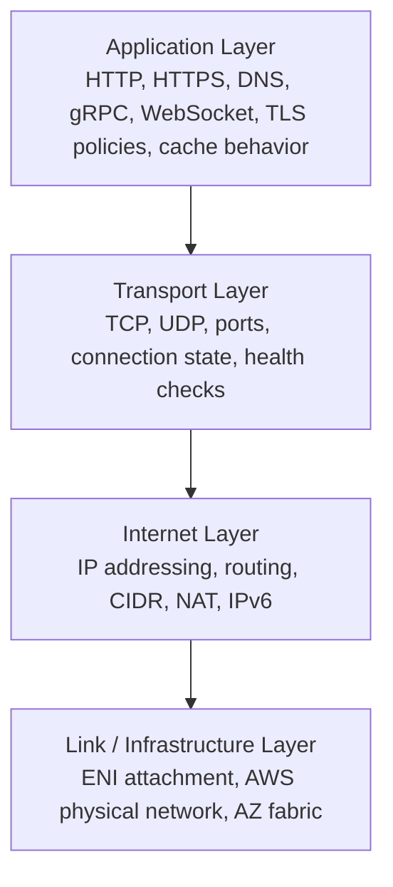
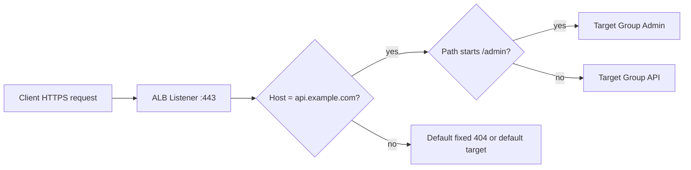
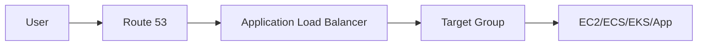
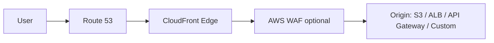
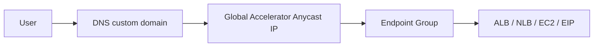
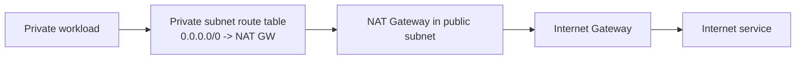
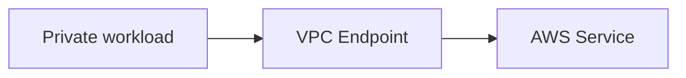
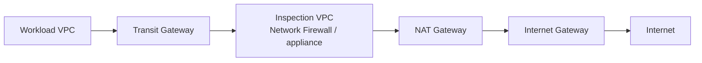
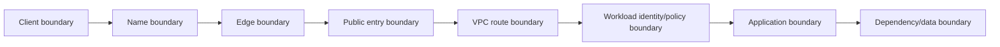

# Part 003 — OSI/TCP-IP Mapping to AWS Services

> Tujuan part ini sederhana: setelah membaca ini, ketika ada problem seperti `timeout`, `502`, `no route`, `TLS handshake failed`, `DNS resolves wrong IP`, atau `service A cannot call service B`, kamu tidak langsung menebak layanan AWS mana yang rusak. Kamu bisa memecah masalahnya menjadi layer, primitive, ownership, dan evidence.

AWS networking sering terlihat seperti katalog layanan: VPC, subnet, route table, NAT Gateway, Transit Gateway, Route 53, CloudFront, ALB, NLB, WAF, Network Firewall, PrivateLink, VPC Lattice, dan seterusnya.

Cara itu tidak cukup untuk engineer level tinggi.

Engineer yang kuat tidak bertanya:

> “Pakai service AWS apa?”

Mereka bertanya:

> “Traffic ini butuh nama, route, transport, policy, encryption, inspection, atau cache?”

Itu perbedaan antara **menghafal service** dan **memahami sistem**.

---

## 1. OSI Bukan Peta Fisik AWS, tapi Peta Berpikir

Model OSI sering diajarkan sebagai tujuh layer:

1. Physical
2. Data Link
3. Network
4. Transport
5. Session
6. Presentation
7. Application

Di AWS, kamu jarang mengontrol layer 1 dan 2 secara langsung. Kamu tidak menarik kabel antar-AZ. Kamu tidak mengatur switch rack. Kamu tidak melihat MAC learning table internal AWS.

Tapi kamu tetap perlu model OSI karena ia membantu menjawab pertanyaan operasional:

| Pertanyaan | Layer dominan |
|---|---|
| Nama domain resolve ke mana? | DNS / application control path |
| IP tujuan bisa diroute? | L3 |
| Port tujuan terbuka? | L4 |
| TLS certificate valid? | L5/L6/L7 depending context |
| HTTP path/header diarahkan ke target benar? | L7 |
| Request diblokir karena rule? | L3/L4/L7 policy tergantung primitive |
| Cache hit atau miss? | L7 / edge |
| Response balik lewat path yang sama? | L3/L4 stateful path |

Cloud menyembunyikan banyak detail fisik, tetapi tidak menghapus konsekuensi networking. Packet tetap butuh:

- alamat sumber;
- alamat tujuan;
- route;
- port;
- state koneksi;
- policy allow/deny;
- kadang translasi alamat;
- kadang terminasi TLS;
- kadang inspeksi payload;
- kadang cache;
- dan selalu observability untuk membuktikan apa yang terjadi.

---

## 2. TCP/IP Model Lebih Praktis untuk AWS

Untuk implementasi harian, lebih berguna memakai model TCP/IP empat layer:



Dalam AWS, kira-kira mapping-nya seperti ini:

| TCP/IP layer | Yang kamu pikirkan | AWS primitive yang sering terlibat |
|---|---|---|
| Application | DNS, HTTP, API, TLS, cache, auth at edge, routing by host/path/header | Route 53, CloudFront, ALB, API Gateway, WAF, VPC Lattice, Cloud Map |
| Transport | TCP/UDP, listener, port, connection tracking, health check, idle timeout | NLB, ALB listener, Security Group, NACL, NAT Gateway, Client VPN, Site-to-Site VPN |
| Internet | IP, subnet, route, next hop, NAT, IPv6, reachability | VPC, subnet, route table, IGW, NAT Gateway, TGW, VGW, DX Gateway, PrivateLink, VPC endpoints |
| Link / infrastructure | ENI, attachment, AZ-local infrastructure, managed service ENI | ENI, service-managed ENI, Nitro, VPC attachment, endpoint ENI |

Poin penting: satu AWS service bisa berada di lebih dari satu layer.

Contoh:

- ALB menerima koneksi TCP/TLS, tetapi routing decision utamanya L7.
- NLB bekerja dekat L4, tetapi punya DNS name dan health check behavior yang memengaruhi application availability.
- CloudFront adalah edge application delivery, tetapi efeknya terasa pada TCP connection, TLS, cache, origin shielding, dan latency.
- Security Group terasa seperti firewall L4, tetapi karena stateful, perilakunya berbeda dari packet filter biasa.
- PrivateLink terlihat seperti private connectivity L3/L4, tetapi ownership dan exposure model-nya lebih mirip service boundary.

---

## 3. Layer 1 dan 2: Yang Sengaja Tidak Kamu Kelola

Di data center tradisional, kamu mungkin peduli:

- kabel;
- switch;
- VLAN;
- trunk;
- MAC address table;
- spanning tree;
- ToR switch failure;
- link aggregation.

Di AWS, sebagian besar ini menjadi tanggung jawab AWS.

Yang masih terlihat oleh kamu bukan switch atau VLAN, melainkan abstraction:

- **Availability Zone** sebagai fault boundary;
- **subnet** sebagai range IP dalam satu AZ;
- **ENI** sebagai interface jaringan resource;
- **route table** sebagai logical forwarding policy;
- **security group** sebagai stateful filter pada ENI-level;
- **NACL** sebagai stateless filter pada subnet boundary;
- **managed endpoint** sebagai representasi layanan yang muncul di VPC.

Jangan salah tafsir: karena kamu tidak mengelola L1/L2, bukan berarti L1/L2 tidak ada. Artinya kamu tidak bisa memperbaiki problem AWS physical fabric dengan konfigurasi switch. Yang bisa kamu lakukan adalah mendesain fault isolation:

- multi-AZ;
- multi-subnet;
- route table yang tidak menciptakan single point of failure;
- endpoint per-AZ bila relevan;
- NAT Gateway per-AZ untuk egress yang tidak cross-AZ;
- load balancer lintas AZ;
- observability untuk membedakan misconfiguration vs service impairment.

---

## 4. Layer 3: IP, CIDR, Route, dan Next Hop

Layer 3 adalah tempat banyak arsitektur AWS menjadi benar atau salah.

Pertanyaan utama L3:

> “Dari IP sumber ini, ke IP tujuan itu, route mana yang dipilih?”

Di AWS, L3 biasanya melibatkan:

- VPC CIDR;
- subnet CIDR;
- route table;
- local route;
- Internet Gateway;
- NAT Gateway;
- Transit Gateway;
- Virtual Private Gateway;
- Direct Connect Gateway;
- VPN attachment;
- VPC peering;
- VPC endpoint;
- PrivateLink endpoint ENI;
- egress-only Internet Gateway untuk IPv6;
- propagated routes;
- blackhole routes.

AWS route table menentukan ke mana traffic dari subnet atau gateway diarahkan. Setiap route punya destination CIDR dan target. Matching route mengikuti prinsip **longest prefix match**: route yang paling spesifik menang.

Contoh sederhana:

```txt
Destination      Target
10.0.0.0/16      local
0.0.0.0/0        nat-aaa
10.20.0.0/16     tgw-bbb
10.20.5.0/24     pcx-ccc
```

Untuk tujuan `10.20.5.10`, route `10.20.5.0/24` lebih spesifik daripada `10.20.0.0/16`, jadi target `pcx-ccc` dipilih.

Untuk tujuan `8.8.8.8`, route `0.0.0.0/0` dipilih.

Untuk tujuan `10.0.9.10`, route `10.0.0.0/16 local` dipilih.

### Kesalahan L3 yang sering terjadi

| Gejala | Penyebab umum |
|---|---|
| Instance private tidak bisa akses internet | Route default tidak menuju NAT Gateway, NAT di AZ salah, SG/NACL egress salah |
| Workload di dua VPC tidak bisa saling akses | Tidak ada peering/TGW route dua arah, CIDR overlap, SG tidak allow peer CIDR/SG |
| On-prem bisa ping sebagian subnet tapi tidak semua | Route propagated tidak masuk semua route table, return route tidak ada, NACL berbeda |
| Response tidak balik | Asymmetric route, NAT/inspection path tidak stateful, route balik berbeda |
| PrivateLink endpoint resolve tapi connection timeout | DNS benar, tapi SG endpoint/service/target port tidak allow |

Layer 3 debugging selalu dimulai dari route dua arah:

```txt
source subnet route table -> destination
return path route table -> source
```

Jangan hanya cek outbound dari caller. Koneksi TCP butuh response path.

---

## 5. Layer 4: TCP, UDP, Port, Listener, dan State

Layer 4 menjawab:

> “Kalau IP tujuan reachable, apakah transport connection bisa terbentuk?”

Yang dicek:

- protocol: TCP, UDP, ICMP;
- source port;
- destination port;
- listener;
- security group inbound/outbound;
- NACL inbound/outbound;
- ephemeral port;
- connection tracking;
- idle timeout;
- health check port;
- NAT port allocation;
- TLS passthrough vs termination, bila TLS dianggap di atas TCP.

Di AWS, L4 sering muncul melalui:

- Security Group rules;
- Network ACL rules;
- NLB listener;
- ALB listener sebelum L7 routing;
- NAT Gateway;
- Client VPN;
- Site-to-Site VPN;
- Network Firewall stateless/stateful rules;
- Gateway Load Balancer;
- PrivateLink interface endpoint;
- VPC Lattice target connectivity.

### Security Group vs NACL dari sudut L4

| Dimensi | Security Group | Network ACL |
|---|---|---|
| Scope | ENI/resource level | Subnet level |
| State | Stateful | Stateless |
| Rule type | Allow only | Allow and deny |
| Return traffic | Diizinkan otomatis untuk established flow | Harus diizinkan eksplisit |
| Evaluasi | Semua allow rules | Rule number order |
| Cocok untuk | Workload-level least privilege | Subnet guardrail / coarse boundary |

Kesalahan klasik: NACL hanya membuka port tujuan 443 inbound, tetapi lupa ephemeral port outbound untuk response. Karena NACL stateless, return traffic harus diizinkan.

### Ephemeral port mental model

Ketika client `10.0.1.10` memanggil server `10.0.2.20:443`, koneksi biasanya terlihat seperti:

```txt
Client: 10.0.1.10:51532  --->  Server: 10.0.2.20:443
Client: 10.0.1.10:51532  <---  Server: 10.0.2.20:443
```

Port `51532` adalah ephemeral source port di client. Kalau ada stateless filter di path, return packet ke ephemeral port harus boleh lewat.

---

## 6. Layer 5/6: Session, TLS, Certificate, dan Encoding

OSI layer 5 dan 6 sering kurang tegas di cloud architecture. Dalam praktik AWS, isu di area ini biasanya muncul sebagai:

- TLS handshake;
- SNI;
- certificate chain;
- ACM certificate;
- TLS policy;
- mTLS;
- ALPN untuk HTTP/2/gRPC;
- cipher suite;
- client certificate validation;
- compression;
- content encoding;
- header normalization;
- session stickiness.

AWS services yang sering terlibat:

- Application Load Balancer;
- Network Load Balancer dengan TLS listener;
- CloudFront;
- API Gateway;
- AWS Certificate Manager;
- AWS Private CA;
- VPC Lattice;
- CloudFront Functions/Lambda@Edge untuk header manipulation;
- WAF bila inspeksi request terjadi setelah TLS termination di integration point.

Pertanyaan debugging:

| Gejala | Kemungkinan layer |
|---|---|
| `certificate verify failed` | TLS trust chain / hostname mismatch |
| `SSL handshake failure` | TLS version/cipher/SNI/client cert mismatch |
| gRPC gagal di ALB | HTTP/2, target protocol, health check, header/path expectation |
| Browser warning certificate | Cert SAN tidak cocok dengan hostname publik |
| CloudFront ke origin gagal TLS | Origin certificate/hostname/SNI/origin protocol policy salah |

Penting: WAF tidak bisa membaca payload HTTPS kalau TLS belum diterminasi di tempat WAF terpasang. AWS WAF terintegrasi dengan layanan seperti CloudFront, ALB, API Gateway, dan AppSync, sehingga inspeksi request terjadi pada integration point tersebut, bukan di sembarang titik packet path.

---

## 7. Layer 7: HTTP, DNS, Cache, API, dan Policy Aplikasi

Layer 7 menjawab:

> “Setelah koneksi bisa dibuat, apakah request dipahami, diarahkan, di-cache, diterima, atau ditolak secara benar?”

AWS primitive L7 meliputi:

- Route 53 untuk DNS authoritative routing;
- CloudFront untuk CDN dan edge delivery;
- ALB untuk HTTP/HTTPS routing;
- API Gateway untuk API front door;
- AWS WAF untuk web request inspection;
- VPC Lattice untuk service-network-level application connectivity;
- Cloud Map untuk service discovery;
- Global Accelerator sebagian besar bukan L7 HTTP router, tetapi memengaruhi global entry path;
- Lambda@Edge / CloudFront Functions untuk request mutation di edge.

Layer 7 bukan hanya “HTTP”. DNS juga application protocol. Cache behavior juga L7. Header `Host`, `X-Forwarded-For`, `X-Forwarded-Proto`, path, query string, cookie, dan method semuanya memengaruhi hasil.

### Contoh L7 routing ALB



Aplikasi bisa sehat di target, tetapi request tetap gagal karena rule L7 salah.

Contoh:

- host header tidak match;
- path rewrite tidak dilakukan;
- health check path berbeda dari readiness app;
- CloudFront tidak forward header yang dibutuhkan origin;
- cache key tidak memasukkan query string yang memengaruhi response;
- WAF block karena managed rule false positive;
- API Gateway private integration tidak bisa menjangkau VPC Link target.

---

## 8. Service Mapping Berdasarkan Fungsi, Bukan Layer Saja

Mapping per-layer berguna, tetapi AWS service lebih mudah dipilih berdasarkan fungsi.

### 8.1 Naming and discovery

| Kebutuhan | Primitive |
|---|---|
| Public DNS domain | Route 53 public hosted zone |
| Private DNS di VPC | Route 53 private hosted zone |
| Hybrid DNS forwarding | Route 53 Resolver inbound/outbound endpoint |
| Service discovery dinamis | AWS Cloud Map |
| Alias ke AWS resource | Route 53 alias record |

DNS adalah control point yang sering diremehkan. Banyak failover strategy gagal bukan karena compute tidak siap, tetapi karena TTL, resolver caching, dan health check semantics tidak dipahami.

### 8.2 Routing and reachability

| Kebutuhan | Primitive |
|---|---|
| Routing dalam VPC | Route table local route |
| Internet inbound/outbound | Internet Gateway |
| Private subnet outbound IPv4 | NAT Gateway |
| Private subnet outbound IPv6 | Egress-only Internet Gateway |
| Multi-VPC hub/spoke | Transit Gateway |
| VPC-to-VPC sederhana | VPC Peering |
| Private service exposure | PrivateLink |
| Global WAN segmentation | Cloud WAN |
| Hybrid private connectivity | Direct Connect / VPN |

### 8.3 Traffic distribution

| Kebutuhan | Primitive |
|---|---|
| HTTP routing by host/path/header | ALB |
| TCP/UDP high-performance entry | NLB |
| Transparent appliance insertion | Gateway Load Balancer |
| Global static anycast entry | Global Accelerator |
| Global CDN/cache | CloudFront |
| API management | API Gateway |

### 8.4 Security and inspection

| Kebutuhan | Primitive |
|---|---|
| Instance/service-level allow list | Security Group |
| Subnet-level stateless guardrail | NACL |
| Web request protection | AWS WAF |
| DDoS protection | AWS Shield |
| Network firewalling | AWS Network Firewall |
| DNS exfiltration control | Route 53 Resolver DNS Firewall |
| Central policy across accounts | AWS Firewall Manager |
| Identity-aware private access | AWS Verified Access |

### 8.5 Edge performance

| Kebutuhan | Primitive |
|---|---|
| Static/dynamic content acceleration | CloudFront |
| HTTP cache control | CloudFront cache behavior/policy |
| Global TCP/UDP acceleration without HTTP caching | Global Accelerator |
| DNS latency/geography routing | Route 53 routing policies |
| Edge request mutation | CloudFront Functions / Lambda@Edge |

---

## 9. The “Wrong Layer” Problem

Banyak desain AWS gagal karena menyelesaikan masalah di layer yang salah.

### Problem 1: Menggunakan Security Group untuk routing

Security Group tidak membuat network reachable. Ia hanya allow/deny traffic pada resource.

Kalau route tidak ada, SG allow `0.0.0.0/0` pun tidak membantu.

Urutan reasoning:

```txt
DNS resolves? -> route exists? -> transport allowed? -> listener exists? -> app accepts?
```

Bukan:

```txt
Open all SG rules and hope it works.
```

### Problem 2: Menggunakan DNS untuk failover yang butuh hitungan detik konsisten

Route 53 health-check failover berguna, tetapi DNS punya TTL dan caching di resolver. Untuk beberapa sistem, Global Accelerator atau active-active application-level routing lebih cocok.

DNS bukan connection steering real-time untuk koneksi yang sudah terbentuk.

### Problem 3: Menggunakan NAT Gateway untuk private service-to-service

NAT Gateway cocok untuk private subnet outbound ke internet atau external services. Untuk akses private ke AWS services, VPC endpoint bisa lebih tepat. Untuk private exposure antar-VPC/account/customer, PrivateLink sering lebih tepat.

NAT bukan primitive service boundary.

### Problem 4: Menggunakan ALB untuk semua traffic

ALB kuat untuk HTTP/HTTPS. Tetapi untuk TCP non-HTTP, UDP, static IP use case, source IP preservation, atau PrivateLink provider model, NLB sering lebih tepat.

### Problem 5: Menggunakan CloudFront untuk masalah yang sebenarnya routing private

CloudFront memperbaiki latency/cache/security edge untuk traffic internet-facing. Ia bukan solusi untuk east-west private connectivity antar-VPC.

---

## 10. Ingress Mapping: Dari Internet ke Workload

Ada beberapa pola ingress.

### 10.1 DNS → ALB → Target



Cocok untuk:

- web app;
- API HTTP;
- host/path routing;
- TLS termination;
- WAF integration;
- multi-AZ target distribution.

Layer concern:

| Step | Layer |
|---|---|
| Route 53 resolve | DNS / L7 control |
| TCP/TLS to ALB | L4 + TLS |
| ALB rules | L7 |
| ALB to target | L4/L7 |
| SG target allow from ALB SG | L4 policy |

### 10.2 DNS → CloudFront → ALB/S3/API Gateway



Cocok untuk:

- global delivery;
- cache;
- TLS edge termination;
- origin protection;
- WAF at edge;
- static + dynamic composition;
- lower user latency.

### 10.3 DNS → Global Accelerator → NLB/ALB/EC2/EIP



Cocok untuk:

- static anycast IP;
- global traffic steering;
- fast regional failover;
- TCP/UDP applications;
- non-cache acceleration;
- multi-region entry point.

---

## 11. Egress Mapping: Dari Private Workload ke Luar

Egress sering lebih sulit daripada ingress karena efeknya tersebar: security, cost, audit, NAT state, route symmetry, DNS, dan data exfiltration.

### 11.1 Private subnet → NAT Gateway → Internet



Checklist:

- private subnet route `0.0.0.0/0` ke NAT Gateway;
- NAT Gateway berada di public subnet;
- public subnet route `0.0.0.0/0` ke IGW;
- NAT Gateway punya Elastic IP untuk public NAT;
- SG workload allow egress;
- NACL allow outbound dan return ephemeral;
- jangan cross-AZ egress tanpa alasan karena biaya dan failure coupling.

### 11.2 Private subnet → VPC Endpoint → AWS service



Cocok untuk:

- S3/DynamoDB gateway endpoint;
- interface endpoint untuk AWS APIs;
- mengurangi internet path;
- memperketat endpoint policy;
- menghindari NAT cost untuk AWS service traffic tertentu.

### 11.3 Centralized egress melalui inspection VPC



Cocok untuk organisasi besar, tetapi rawan:

- asymmetric routing;
- bottleneck;
- cross-AZ data processing cost;
- route table complexity;
- firewall state loss saat failover;
- ownership conflict antara platform dan application team.

---

## 12. East-West Mapping: Service-to-Service di Private Network

East-west traffic adalah traffic antar-workload, bukan dari user internet ke app.

Pola umum:

| Pattern | Primitive | Catatan |
|---|---|---|
| Same VPC | local route + SG | Paling sederhana; SG referencing kuat |
| VPC peering | Peering + route table | Non-transitive, sulit scale banyak VPC |
| Transit Gateway | TGW route domain | Cocok hub/spoke dan segmentasi besar |
| PrivateLink | Endpoint service + interface endpoint | Consumer hanya melihat endpoint, bukan full network provider |
| VPC Lattice | Service network + auth policy | Service-level connectivity lintas VPC/account |
| Cloud Map | Discovery | Bukan connectivity; hanya naming/discovery |

Pertanyaan desain:

- Apakah consumer butuh akses ke seluruh CIDR provider, atau hanya satu service?
- Apakah provider dan consumer beda account?
- Apakah CIDR overlap mungkin terjadi?
- Apakah perlu service-level auth policy?
- Apakah traffic HTTP/gRPC, TCP, atau mixed?
- Apakah perlu central inspection?
- Apakah latency sensitif?

PrivateLink dan VPC Lattice sering lebih cocok daripada VPC peering ketika kamu ingin mengekspos **service**, bukan menyambungkan **network**.

---

## 13. Control Plane vs Data Plane dalam Mapping Layer

Salah satu penyebab kebingungan AWS networking: kamu mengubah control plane, tetapi yang bermasalah adalah data plane.

Contoh:

| Action | Control plane | Data plane effect |
|---|---|---|
| Update route table | AWS API menyimpan route baru | Packet berikutnya mengikuti route baru setelah propagasi internal |
| Add SG rule | AWS API update rule | Flow baru/tertentu diizinkan sesuai stateful behavior |
| Change Route 53 record | Authoritative DNS berubah | Resolver client baru melihat setelah TTL/cache |
| Change CloudFront behavior | Distribution config deploy ke edge | Edge locations menerapkan config setelah deployment |
| Register target ALB | Target masuk target group | ALB kirim traffic setelah health check healthy |

Jangan menganggap API call sukses berarti semua client langsung melihat efeknya.

Operationally, selalu pisahkan:

```txt
desired config accepted? -> config propagated? -> data-plane behavior changed? -> clients observe change?
```

---

## 14. Failure Analysis by Layer

Gunakan tabel ini sebagai runbook awal.

| Symptom | Layer kandidat | Evidence yang dicari |
|---|---|---|
| `NXDOMAIN` | DNS | Route 53 hosted zone, delegation, record name |
| Resolve ke IP lama | DNS/cache | TTL, resolver cache, weighted/failover records |
| `No route to host` | L3 | Route table, propagated route, local route, TGW table |
| Timeout | L3/L4 | Route dua arah, SG, NACL, listener, target health |
| Connection refused | L4/app | Target port tidak listen, app reject, wrong target |
| TLS handshake failed | TLS | Cert, SNI, TLS policy, cipher, client cert |
| HTTP 403 | L7/security | WAF, app auth, S3 bucket/OAC, API Gateway auth |
| HTTP 404 | L7 routing | ALB rule, path, host header, origin route |
| HTTP 502 | L7/L4 | ALB target error, TLS to target, malformed response |
| HTTP 503 | L7/availability | No healthy targets, overloaded service, LB capacity edge case |
| HTTP 504 | L7/L4 timeout | Target slow, idle timeout, SG return, backend dependency |
| Works from bastion but not service | L3/L4 identity | Different SG/subnet/route/DNS resolver |
| Works in one AZ only | Fault domain | Subnet route, NAT per-AZ, endpoint per-AZ, target health |

---

## 15. Practical Debugging Order

Saat traffic gagal, jangan mulai dari semua layanan sekaligus. Pakai urutan ini:

```txt
1. Name
   Can the client resolve the intended name?

2. Destination
   Does the resolved destination match expected resource?

3. Route
   Is there a route from source to destination?
   Is there a return route?

4. Policy
   Do SG/NACL/firewall/WAF/endpoint policies allow it?

5. Listener
   Is something listening on the destination protocol/port?

6. Health
   Does the managed entry point consider targets healthy?

7. Protocol
   Does TLS/HTTP/gRPC expectation match on both sides?

8. Application
   Does the app route/auth/handler accept the request?

9. Observation
   Which logs prove the packet/request reached which boundary?
```

This order matters.

If DNS points to the wrong distribution, changing target SG is irrelevant.

If route table has no path, changing ALB rule is irrelevant.

If target is unhealthy, Route 53 failover may still point to an ALB that cannot serve.

---

## 16. Choosing the Right AWS Primitive

### 16.1 Need to expose public HTTP application

Use:

- Route 53;
- CloudFront if global/cache/WAF-at-edge/origin protection matters;
- ALB for L7 routing;
- WAF for HTTP request protection;
- ACM for TLS certificate;
- Shield automatically at standard level, with Shield Advanced for higher DDoS posture.

Avoid:

- exposing EC2 public IP directly;
- putting app instances in public subnet unless there is a strong reason;
- using NLB when you need host/path HTTP routing;
- relying on DNS alone for application-level failover without understanding TTL.

### 16.2 Need TCP service with static IP or high throughput

Use:

- NLB;
- Global Accelerator if global static anycast entry/failover needed;
- SG/NACL carefully;
- health checks aligned with service semantics.

Avoid:

- ALB for non-HTTP protocols;
- CloudFront unless protocol is supported and CDN semantics make sense;
- DNS-only failover for long-lived TCP sessions.

### 16.3 Need private API access across accounts/VPCs

Use depending need:

- PrivateLink if exposing one service privately with loose network coupling;
- VPC Lattice if service network, auth policy, and app-level service connectivity matter;
- TGW if full network connectivity/route domain is intended;
- VPC peering only for small, direct, non-transitive relationships.

Avoid:

- CIDR-wide peering just to expose one endpoint;
- NAT for private service boundary;
- shared credentials plus public endpoint when private connectivity is required.

### 16.4 Need outbound access to AWS APIs from private subnet

Use:

- VPC endpoints where available and justified;
- endpoint policy;
- private DNS;
- NAT only for services/endpoints not covered or external internet dependencies.

Avoid:

- sending all AWS API calls through public internet/NAT by default at large scale;
- forgetting DNS behavior of interface endpoints;
- assuming endpoint policy replaces IAM policy. It complements it.

---

## 17. A Compact Layer-to-Service Cheat Sheet

| Concern | First AWS service to inspect | Then inspect |
|---|---|---|
| Public hostname | Route 53 | CloudFront/ALB/GA DNS target |
| Private hostname | Private hosted zone / Resolver | VPC association, forwarding rule |
| CDN cache | CloudFront | Cache policy, origin request policy, headers/cookies/query |
| HTTP routing | ALB/API Gateway/CloudFront | Host/path/header rules, origin path |
| TCP listener | NLB/ALB listener/target app | SG, NACL, health check |
| Subnet reachability | VPC route table | TGW/peering/NAT/IGW endpoint target |
| Workload firewall | Security Group | NACL, Network Firewall |
| Subnet guardrail | NACL | SG, route table |
| Central inspection | Network Firewall/GWLB | TGW route tables, appliance mode |
| Private AWS API access | VPC endpoint | Endpoint policy, private DNS, IAM |
| Multi-VPC routing | Transit Gateway | Association/propagation/route domains |
| Hybrid route | Direct Connect/VPN/TGW/VGW | BGP routes, return route, prefixes |
| DDoS/web attack | Shield/WAF | CloudFront/ALB/API Gateway integration |
| DNS exfiltration | DNS Firewall | Resolver query logs |

---

## 18. Mental Model: Every Request Crosses Boundaries

A production request is not “client calls service”. It crosses boundaries.



At each boundary, ask:

| Boundary | Question |
|---|---|
| Client | Which resolver, IP family, proxy, TLS trust store? |
| DNS | Which record, TTL, policy, health check? |
| Edge | Is request cached, blocked, redirected, mutated? |
| Public entry | Which listener, certificate, health check, routing rule? |
| VPC | Which route table, next hop, return route? |
| Workload | Which SG/NACL/firewall rules? |
| Application | Which host/path/auth/protocol behavior? |
| Dependency | Which downstream route/policy/timeout? |

This boundary-first approach scales better than service-first debugging.

---

## 19. Anti-Patterns to Avoid Early

### 19.1 One giant VPC for everything

A single VPC can simplify early routing but often destroys ownership boundaries later. You end up with broad SG rules, implicit trust, and painful migration.

Better: design VPC boundaries around environment, account, blast radius, and network trust level.

### 19.2 Public subnet means “safe because SG blocks it”

Public subnet means subnet has a route to IGW. Whether a resource is actually public depends on public IP, route, SG/NACL, and service behavior. But putting workloads into public subnets expands accidental exposure risk.

Better: public subnet for public entry resources such as internet-facing LB or NAT Gateway; private subnet for application workloads.

### 19.3 Treating Route 53 health check as complete application health

DNS health checks observe from outside. They do not automatically know internal dependency correctness unless you expose meaningful health endpoints.

Better: health endpoint should reflect serving readiness, not merely process liveness.

### 19.4 Central firewall without route symmetry proof

Stateful inspection requires flow symmetry. If request enters one appliance path and response exits another, the firewall may drop it.

Better: model forward and return route explicitly per AZ and per route table.

### 19.5 NAT Gateway as universal escape hatch

NAT makes outbound work, but it can hide dependency sprawl, raise cost, and weaken policy clarity.

Better: classify egress: AWS service endpoint, internet dependency, partner private connectivity, SaaS PrivateLink, or blocked.

---

## 20. Implementation Checklist for Future Parts

When we build real architectures in later parts, use this checklist:

```txt
[ ] What is the source identity? user, service, VPC, account, subnet, SG?
[ ] What name does the caller use?
[ ] Where does that name resolve?
[ ] Is the destination public, private, edge, regional, or global?
[ ] What protocol and port are used?
[ ] Which route table handles the forward path?
[ ] Which route table handles the return path?
[ ] Which stateful policies apply?
[ ] Which stateless policies apply?
[ ] Is there NAT, TLS termination, cache, inspection, or header mutation?
[ ] Which component owns health checking?
[ ] Which logs can prove each boundary was crossed?
[ ] What happens if one AZ fails?
[ ] What happens if DNS is stale?
[ ] What happens if the target is healthy but dependency is down?
[ ] What is the cost of this path under peak traffic?
```

---

## 21. Mini-Lab: Classify the Layer

For each scenario, identify the first layer to inspect.

### Scenario A

`curl https://api.example.com/orders` returns `Could not resolve host`.

Start with DNS: hosted zone, record, delegation, resolver, typo, private/public zone conflict.

### Scenario B

DNS resolves to ALB, but request times out.

Start with L3/L4: route to ALB if internal, SG inbound on ALB, listener port, NACL, client path.

### Scenario C

ALB returns 503.

Start with ALB target health: target group, health check path/port, SG target allowing ALB SG, app readiness.

### Scenario D

CloudFront returns cached response for wrong user.

Start with L7 cache key: headers/cookies/query string included or excluded, cache policy, authorization behavior.

### Scenario E

Private EC2 cannot call S3 without public internet.

Start with VPC endpoint design: gateway endpoint for S3, route table association, bucket policy, endpoint policy, DNS behavior if interface endpoint is used for other AWS APIs.

---

## 22. What You Should Remember

AWS networking is not a list of services. It is a set of composable primitives:

```txt
Name -> Resolve -> Route -> Filter -> Connect -> Terminate -> Inspect -> Route at L7 -> Serve -> Return
```

The core skill is to locate a problem at the right boundary.

- DNS problems are not fixed by Security Groups.
- Route problems are not fixed by ALB rules.
- TLS problems are not fixed by NAT Gateway.
- Cache bugs are not fixed by Transit Gateway.
- Stateful inspection bugs are not fixed by adding a second route unless route symmetry is preserved.

In the next part, we will follow a real request end-to-end and inspect every boundary it crosses.

---

## References

- AWS Documentation — Amazon VPC: `https://docs.aws.amazon.com/vpc/latest/userguide/what-is-amazon-vpc.html`
- AWS Documentation — Configure route tables: `https://docs.aws.amazon.com/vpc/latest/userguide/VPC_Route_Tables.html`
- AWS Documentation — Internet gateways: `https://docs.aws.amazon.com/vpc/latest/userguide/VPC_Internet_Gateway.html`
- AWS Documentation — NAT gateways: `https://docs.aws.amazon.com/vpc/latest/userguide/vpc-nat-gateway.html`
- AWS Documentation — Elastic Load Balancing: `https://docs.aws.amazon.com/elasticloadbalancing/`
- AWS Documentation — Application Load Balancer: `https://docs.aws.amazon.com/elasticloadbalancing/latest/application/introduction.html`
- AWS Documentation — Network Load Balancer: `https://docs.aws.amazon.com/elasticloadbalancing/latest/network/network-load-balancers.html`
- AWS Documentation — Amazon Route 53: `https://docs.aws.amazon.com/Route53/latest/DeveloperGuide/Welcome.html`
- AWS Documentation — Amazon CloudFront: `https://docs.aws.amazon.com/AmazonCloudFront/latest/DeveloperGuide/Introduction.html`
- AWS Documentation — AWS Networking and Content Delivery overview: `https://docs.aws.amazon.com/whitepapers/latest/aws-overview/networking-services.html`
