# Part 004 — Life of a Packet in AWS

> Tujuan part ini: kamu bisa “membaca” perjalanan request di AWS seperti membaca stack trace. Bukan hanya tahu komponen apa yang ada, tetapi tahu boundary mana yang dilewati, state apa yang dibuat, dan bukti observability apa yang harus dicari ketika request gagal.

Di sistem produksi, kalimat “service tidak bisa diakses” terlalu kabur.

Yang lebih berguna:

> “Client resolve `api.example.com` ke CloudFront distribution. Viewer connection sukses. CloudFront cache miss. Origin request ke ALB gagal dengan 504 karena target group punya healthy target, tetapi security group target tidak mengizinkan inbound dari ALB SG pada port health check sebenarnya.”

Itu diagnosis. Bukan tebakan.

Part ini membangun kemampuan itu.

---

## 1. Request Bukan Garis Lurus

Secara naif, kita sering menggambar:

```txt
User -> App -> Database
```

Di AWS production architecture, request lebih realistis seperti ini:

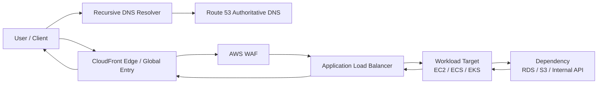

Ada dua hal penting:

1. **DNS path dan data path berbeda.** DNS resolve dulu, tetapi packet aplikasi tidak selalu melewati Route 53.
2. **Forward path dan return path sama-sama penting.** Banyak engineer hanya memeriksa request keluar, lupa response balik.

---

## 2. Scenario yang Akan Kita Pakai

Kita gunakan arsitektur umum:

```txt
User internet
  -> Route 53
  -> CloudFront + WAF
  -> public ALB
  -> private application targets in two AZs
  -> private dependency via VPC endpoint / database / internal service
```

Diagram:

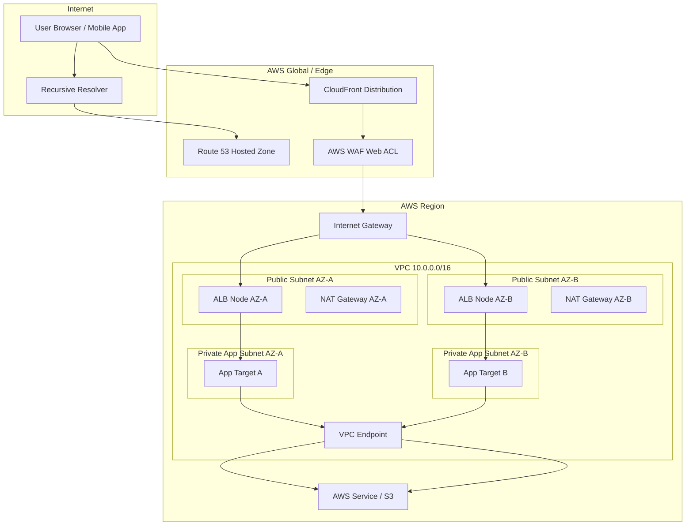

Kita akan mengikuti satu request:

```txt
GET https://api.example.com/orders/123
```

---

## 3. Step 0 — Client Memilih Network Context

Sebelum DNS sekalipun, client sudah punya context:

- berada di jaringan mobile, rumah, kantor, atau cloud lain;
- memakai resolver tertentu;
- mungkin melalui proxy perusahaan;
- mungkin IPv4-only, IPv6-only, atau dual-stack;
- punya TLS trust store tertentu;
- punya clock yang harus benar untuk validasi certificate;
- punya local DNS cache;
- mungkin memakai HTTP proxy, VPN, DNS-over-HTTPS, atau split tunnel.

Kenapa ini penting?

Karena tidak semua error berasal dari AWS.

Contoh:

| Gejala | Bisa berasal dari client side? |
|---|---|
| DNS resolve beda antara laptop dan server | Ya, resolver/cache/split-horizon |
| TLS certificate dianggap expired | Ya, client clock/trust store |
| Bisa akses dari mobile tapi tidak dari kantor | Ya, corporate proxy/firewall/DNS |
| IPv6 client gagal tapi IPv4 berhasil | Ya, DNS AAAA/routing/policy dual-stack |

Prinsip:

> Jangan mulai debugging AWS sebelum kamu tahu client melihat nama dan IP apa.

Command awal:

```bash
nslookup api.example.com
# atau
dig api.example.com

curl -v https://api.example.com/orders/123
```

Yang dicari:

- hostname resolve ke apa;
- TLS handshake sampai mana;
- IP family apa yang dipakai;
- HTTP status dari boundary mana;
- header response seperti `server`, `via`, `x-cache`, `x-amz-cf-id`, `x-amzn-trace-id`, atau custom header.

---

## 4. Step 1 — DNS Resolution

Client tidak memanggil `api.example.com` secara magic. Ia butuh IP atau endpoint hasil DNS.

Flow simplified:

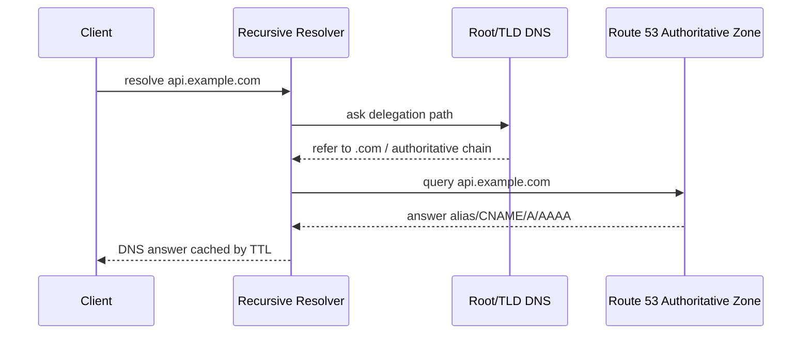

Jika Route 53 alias record menunjuk CloudFront, client akan mendapat jawaban yang membawa client ke edge location yang sesuai secara DNS/edge routing.

Jika alias record menunjuk ALB, client akan resolve ke DNS name ELB yang menghasilkan IP load balancer nodes.

Jika record menunjuk Global Accelerator, bisa berupa custom domain ke accelerator DNS/static IP path tergantung konfigurasi.

### DNS debugging questions

| Pertanyaan | Kenapa penting |
|---|---|
| Hosted zone mana yang authoritative? | Bisa ada public/private hosted zone dengan nama sama |
| Record type apa? | A/AAAA/CNAME/alias memengaruhi behavior |
| TTL berapa? | Menentukan cache behavior resolver |
| Routing policy apa? | Weighted/latency/failover/geolocation bisa memberi jawaban berbeda |
| Health check terkait? | Record mungkin tidak dikembalikan jika unhealthy |
| Resolver client siapa? | Corporate resolver bisa cache atau override |

### DNS failure examples

| Symptom | Diagnosis awal |
|---|---|
| `NXDOMAIN` | Record tidak ada, delegation salah, hosted zone salah |
| Resolve ke ALB lama | TTL/cache, stale resolver, record belum berubah, split DNS |
| Sebagian region user ke endpoint salah | Latency/geolocation routing policy, resolver location bias |
| Private name resolve di satu VPC tapi tidak di VPC lain | Private hosted zone association atau Resolver rule tidak ada |

DNS memberi client **alamat masuk**, bukan jaminan aplikasi sehat.

---

## 5. Step 2 — Client Membuka TCP dan TLS ke Edge

Untuk HTTPS, setelah DNS resolve, client membuka TCP connection ke tujuan port 443.

```txt
ClientIP:ephemeral_port -> EdgeIP:443
```

Lalu TLS handshake terjadi:

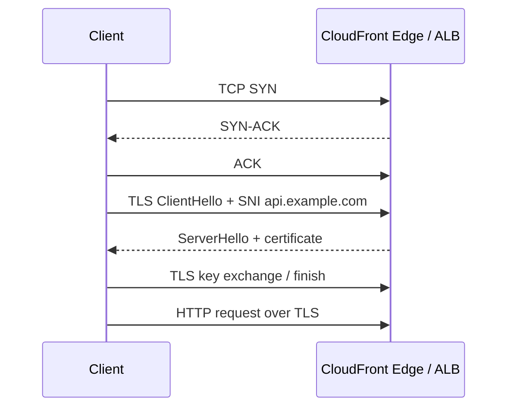

Yang bisa gagal di sini:

- edge tidak reachable dari client network;
- port 443 blocked client side;
- certificate tidak cocok hostname;
- TLS version/cipher mismatch;
- SNI tidak cocok;
- client clock salah;
- mutual TLS requirement tidak dipenuhi;
- IPv6 path bermasalah.

Jika CloudFront di depan, viewer connection terminates di CloudFront. Origin connection dari CloudFront ke ALB adalah koneksi terpisah.

Ini penting:

```txt
Client -> CloudFront     = connection 1
CloudFront -> Origin ALB = connection 2
ALB -> Target            = connection 3
Target -> Dependency     = connection 4
```

Koneksi-koneksi itu punya timeout, TLS setting, source IP, header, dan policy berbeda.

---

## 6. Step 3 — CloudFront Mengevaluasi Request

CloudFront bukan sekadar proxy. Ia membuat keputusan:

- distribution mana;
- alternate domain name match;
- viewer protocol policy;
- cache behavior berdasarkan path;
- allowed HTTP methods;
- cache key;
- origin request policy;
- function/Lambda@Edge execution;
- WAF inspection jika terasosiasi;
- signed URL/cookie enforcement bila dipakai;
- origin selection;
- cache hit/miss.

Simplified decision tree:

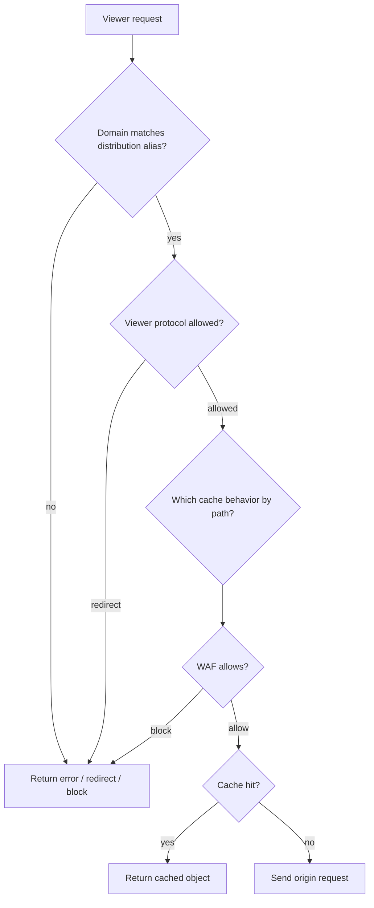

### CloudFront headers that matter

CloudFront may add or forward headers such as:

- `Host`;
- `X-Forwarded-For`;
- `CloudFront-Viewer-Country` if configured;
- `CloudFront-Forwarded-Proto`;
- custom origin headers;
- selected headers included by origin request policy.

If the origin application depends on a header but CloudFront does not forward it, the application may behave incorrectly even though networking is healthy.

### Cache key bug example

Suppose `/dashboard` response differs by `Authorization` header or cookie, but cache policy does not include that dimension and caching is enabled.

Then user A can receive content intended for user B.

This is not L3/L4 networking. This is L7 cache-key design.

Rule:

> Only cache responses whose variation dimensions are explicitly represented in the cache key, or are safe to ignore.

---

## 7. Step 4 — CloudFront Sends Request to Origin

If cache miss, CloudFront opens a connection to origin.

Origin can be:

- S3 bucket;
- ALB;
- API Gateway;
- EC2/custom origin;
- Media services;
- another HTTP endpoint.

For our scenario, origin is ALB.

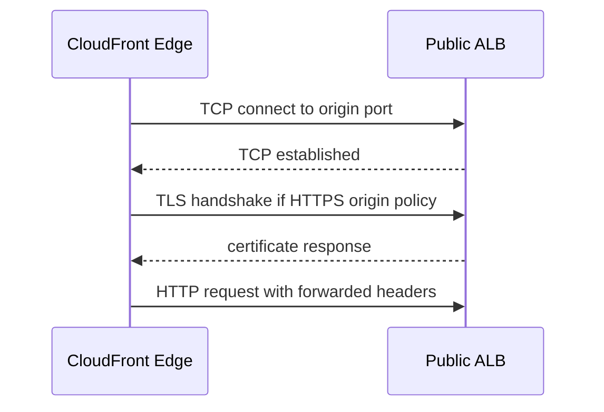

Critical origin settings:

| Setting | Failure mode |
|---|---|
| Origin domain name | Points to wrong ALB/custom endpoint |
| Origin protocol policy | HTTP vs HTTPS mismatch |
| Origin port | ALB listener missing/wrong port |
| Origin SSL protocols | TLS mismatch |
| Origin request policy | Missing header/cookie/query |
| Origin timeout | 504 under slow backend |
| Custom header | Missing auth/shared secret at origin |

### Origin protection

If ALB is public-facing only because CloudFront must reach it, you usually want to reduce direct bypass risk:

- use AWS WAF at CloudFront and possibly ALB;
- restrict ALB security group inbound where possible;
- use managed prefix list for CloudFront origin-facing IPs where applicable;
- require custom header secret checked by ALB/WAF/app;
- avoid exposing app instance directly;
- prefer Origin Access Control for S3 origins.

CloudFront does not automatically make every origin private. Origin protection is a separate design task.

---

## 8. Step 5 — Internet Gateway and Public ALB Reachability

An internet-facing ALB lives in public subnets. It has load balancer nodes across enabled AZs. The ALB must be reachable through the VPC public routing setup.

A public subnet conventionally has:

```txt
Destination      Target
VPC CIDR         local
0.0.0.0/0        igw-xxxx
::/0             igw-xxxx   # if IPv6 internet route is used
```

The Internet Gateway provides a route target for internet-routable traffic and, for IPv4, participates in NAT behavior for resources with public IPv4 addresses.

But remember: ALB is managed. You do not attach a public IP manually to an ALB node. You configure the ALB scheme as internet-facing or internal, choose subnets, listeners, security group, and targets.

Key checks:

- ALB scheme is `internet-facing`;
- ALB has subnets in at least the intended AZs;
- public subnet route table has default route to IGW;
- ALB security group allows inbound from CloudFront/client path on listener port;
- listener exists on 443/80 as expected;
- certificate exists and matches hostname if TLS terminates at ALB;
- target group has healthy targets.

---

## 9. Step 6 — ALB Listener and Rule Evaluation

ALB receives the HTTP request and evaluates listener rules.

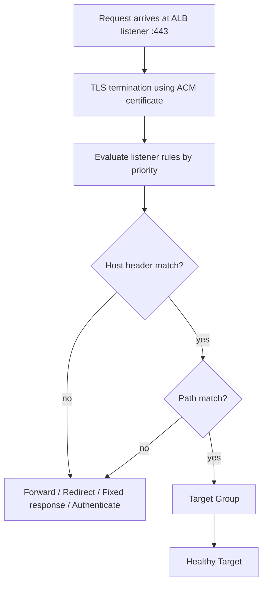

ALB routing inputs can include:

- host header;
- path;
- HTTP method;
- source IP;
- headers;
- query string.

ALB chooses target group based on rule. Then it chooses a healthy target according to its load balancing algorithm and target group state.

### Common ALB failure classes

| Status | Meaning directionally | Common causes |
|---|---|---|
| 301/302 unexpected | Listener rule redirect | HTTP→HTTPS redirect loop, wrong host/path condition |
| 400 | Bad request | Header too large, malformed request, protocol mismatch |
| 403 | WAF/auth/fixed response/app | WAF block, authenticate action, app denies |
| 404 | Rule/app path | No matching route, default rule, app 404 |
| 502 | Bad gateway | Target closed connection, TLS to target issue, malformed target response |
| 503 | Service unavailable | No healthy targets, target group unavailable |
| 504 | Gateway timeout | Target did not respond in time, network or app latency |

When debugging ALB, always distinguish:

```txt
ALB-generated error vs target-generated error
```

Access logs and response headers help.

---

## 10. Step 7 — ALB Connects to Target in Private Subnet

Now traffic moves inside the VPC.

Important detail: the target is private. It does not need public IP. ALB nodes reach it through VPC local routing.

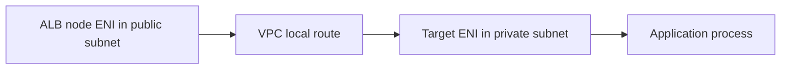

Security model:

- ALB security group inbound allows viewer/origin traffic.
- ALB security group outbound allows target port.
- Target security group inbound allows traffic from ALB security group on app port.
- NACLs for public and private subnets allow relevant inbound/outbound ephemeral flows.

Preferred target SG pattern:

```txt
Target SG inbound:
  protocol TCP
  port 8080
  source sg-alb
```

Not:

```txt
source 0.0.0.0/0
```

If target listens on port 8080 but health check uses `/health` on port `traffic-port`, ensure app really serves health on 8080.

### Target health is not app correctness

A target can be “healthy” if `/health` returns 200 but still fail `/orders/123` because:

- database unavailable;
- downstream service timeout;
- auth config broken;
- deployment mismatch;
- feature flag issue;
- path-specific bug.

Health check should represent readiness to serve traffic, but not every business path can be encoded into LB health.

---

## 11. Step 8 — App Calls a Dependency

Most real requests do not end at the app. App calls something else.

Examples:

- RDS in private subnet;
- ElastiCache;
- internal API in another VPC;
- S3;
- DynamoDB;
- KMS;
- Secrets Manager;
- external payment gateway;
- SaaS API;
- on-prem service.

Each dependency creates a new packet path.

### 11.1 App to RDS in same VPC

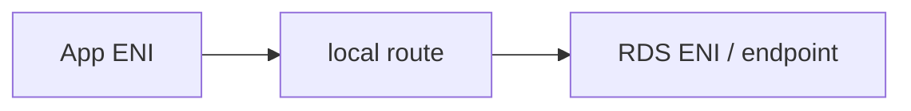

Checks:

- DNS resolves RDS endpoint;
- app SG egress allows DB port;
- DB SG inbound allows app SG;
- subnet NACL allows flow;
- route is local;
- DB parameter/security not rejecting;
- TLS requirement matches client config.

### 11.2 App to S3 via Gateway Endpoint

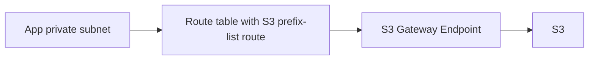

Checks:

- gateway endpoint associated with private route table;
- bucket policy allows endpoint/source identity;
- endpoint policy allows action/resource;
- IAM role allows action;
- DNS/SDK targets standard S3 endpoint correctly;
- no forced NAT path due to route table omission.

### 11.3 App to AWS API via Interface Endpoint

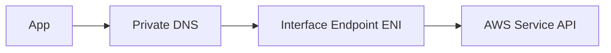

Checks:

- interface endpoint exists in reachable subnets/AZs;
- private DNS enabled if app uses default service hostname;
- endpoint SG allows inbound from app SG on 443;
- app SG egress allows endpoint;
- endpoint policy and IAM both allow;
- NACL allows;
- no DNS conflict with custom resolver.

### 11.4 App to Internet via NAT Gateway

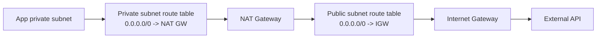

Checks:

- NAT Gateway in same AZ where possible;
- private route table default route to NAT;
- NAT subnet route to IGW;
- EIP attached for public NAT;
- external API allowlists NAT EIP if needed;
- NAT port exhaustion not occurring under high concurrency;
- cost understood for data processing and cross-AZ.

---

## 12. Step 9 — Response Path

Responses are not “free”. They travel back through connection state.

For original HTTP request:

```txt
Target -> ALB -> CloudFront -> Client
```

For dependency call:

```txt
Dependency -> App
```

For NAT egress:

```txt
External service -> IGW -> NAT Gateway -> App
```

Security Group is stateful, so response traffic for an allowed flow is generally permitted automatically.

NACL is stateless, so response direction needs matching rules.

Stateful firewalls and NAT devices must see both directions of the flow. If route symmetry breaks, packets may be dropped.

### Asymmetric routing example

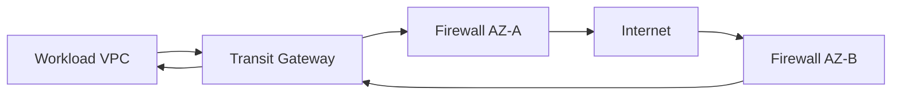

If FW1 saw outbound SYN but FW2 sees inbound SYN-ACK, FW2 may not have connection state. It can drop the response.

This is why centralized inspection architecture must be designed per AZ and per route domain, not just “send traffic to firewall”.

---

## 13. What Actually Changes Source IP?

Source IP preservation matters for logs, security rules, rate limiting, and application behavior.

| Component | Source IP behavior directionally |
|---|---|
| CloudFront to origin | Origin sees CloudFront edge IP at network layer; original client appears in headers like `X-Forwarded-For` if forwarded |
| ALB to target | Target generally sees ALB node IP at network layer; original client information in `X-Forwarded-For` |
| NLB | Can preserve source IP for certain target types/configurations; behavior depends on target type and setting |
| NAT Gateway | External destination sees NAT public IP, not private workload IP |
| PrivateLink | Provider sees traffic from NLB/PrivateLink path, not full consumer network identity in the same way as peering |
| Proxy/app gateway | Usually changes source IP at L3 and passes original identity in headers or protocol metadata |

Do not build authorization purely from `X-Forwarded-For` unless you control and trust every proxy that can set/append it.

At minimum:

- strip untrusted forwarded headers at the first trusted boundary;
- have edge/proxy set canonical headers;
- configure app framework trusted proxy list;
- separate network identity from user identity.

---

## 14. Timeout Stack: Where Latency Becomes Failure

A single request crosses multiple timeout budgets.

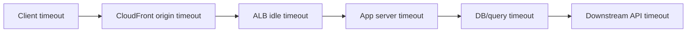

Bad systems set these randomly.

Good systems design them as a chain.

Principle:

> Outer layers should usually have larger timeouts than inner dependencies, so failures happen close to the cause and return controlled errors.

Example direction:

```txt
DB query timeout:          2s
Internal service timeout:  3s
App request timeout:       5s
ALB idle timeout:          10s
CloudFront origin timeout: 12s
Client timeout:            15s
```

Numbers depend on workload. The invariant matters more than exact value.

If CloudFront timeout is shorter than app dependency timeout, user sees edge 504 while app is still working. That creates retry storms and wasted backend work.

---

## 15. Observability Along the Path

You need evidence at each boundary.

| Boundary | Evidence |
|---|---|
| Client | `curl -v`, browser devtools, mobile logs |
| DNS | `dig`, resolver logs, Route 53 query logs where configured |
| CloudFront | standard logs, real-time logs, `x-cache`, `x-amz-cf-id` |
| WAF | WAF logs, sampled requests, terminating rule ID |
| ALB | ALB access logs, target status code, ELB status code, target processing time |
| VPC | VPC Flow Logs, Reachability Analyzer |
| Target | app logs, server access logs, metrics, traces |
| Dependency | DB logs, S3 access logs, CloudTrail data events where enabled, service metrics |
| NAT/egress | NAT Gateway metrics, Flow Logs, external allowlist logs |
| Firewall | Network Firewall logs, appliance logs, DNS Firewall logs |

### A useful correlation strategy

Add a request ID as early as possible:

```txt
Client/request-id -> CloudFront header -> ALB access log -> app log -> downstream call
```

If you cannot correlate across boundaries, your architecture is operationally blind.

---

## 16. Debugging Example: CloudFront 504

Symptom:

```txt
GET https://api.example.com/orders/123 -> 504 Gateway Timeout
Response headers include CloudFront headers.
```

Naive conclusion:

> “CloudFront is broken.”

Better analysis:

1. DNS resolved to CloudFront successfully.
2. Viewer TCP/TLS succeeded because CloudFront returned response.
3. CloudFront generated or relayed 504 because origin did not respond in expected time.
4. Need inspect CloudFront logs: origin status, time-taken, edge result type.
5. Need inspect ALB access logs: did request reach ALB?
6. If ALB has no log, issue between CloudFront and ALB: origin domain, SG, WAF, TLS, listener, DNS, public reachability.
7. If ALB has log with 504, issue between ALB and target or target response latency.
8. If app has log and downstream timeout, issue inside app dependency path.

Decision tree:

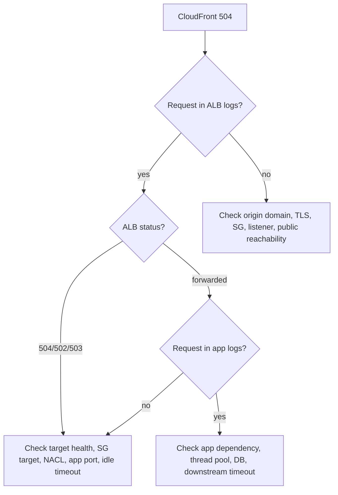

---

## 17. Debugging Example: Private Subnet Cannot Reach Internet

Symptom:

```txt
EC2 in private subnet cannot call https://example.org
```

Layered debug:

1. DNS:
   - Can instance resolve `example.org`?
   - Is VPC DNS enabled?
   - Custom DNS resolver working?

2. Route:
   - Private subnet route table has `0.0.0.0/0 -> nat-xxxx`?
   - NAT Gateway exists and is available?
   - NAT Gateway is in public subnet?
   - Public subnet has `0.0.0.0/0 -> igw-xxxx`?

3. Policy:
   - Instance SG egress allows TCP 443?
   - NACL private subnet allows outbound 443 and inbound ephemeral response?
   - NACL public subnet allows NAT flow?

4. NAT:
   - NAT Gateway has Elastic IP?
   - NAT metrics show errors/port allocation issues?
   - External service blocks NAT EIP?

5. App:
   - Proxy environment variables wrong?
   - TLS trust issue?
   - SNI/certificate issue?

A good debug command sequence:

```bash
# DNS
nslookup example.org

# TCP/TLS
curl -v https://example.org

# Route from instance perspective
ip route

# Metadata to confirm subnet/AZ/ENI context if allowed
curl http://169.254.169.254/latest/meta-data/network/interfaces/macs/
```

Then inspect AWS-side route tables and Flow Logs.

---

## 18. Debugging Example: ALB Has No Healthy Targets

Symptom:

```txt
ALB returns 503
Target group shows unhealthy targets
```

Possible causes:

- health check path wrong;
- health check port wrong;
- app binds to `localhost` only, not ENI address;
- target SG does not allow ALB SG;
- NACL blocks health check response;
- app returns 301/401/403/500 to health endpoint;
- target not registered in correct target group;
- target in wrong VPC/subnet;
- container port mapping wrong;
- readiness endpoint depends on unavailable dependency;
- TLS health check mismatch.

Diagnostic flow:

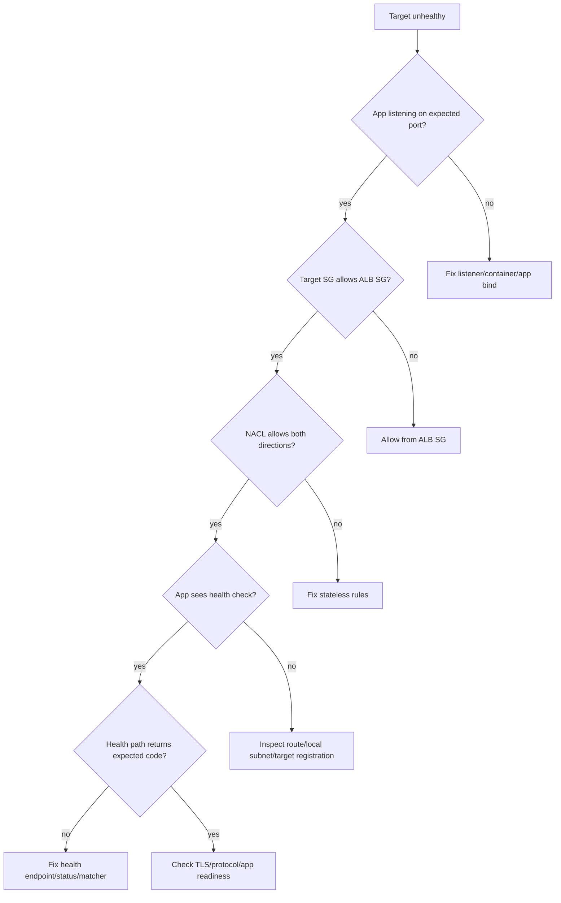

---

## 19. Packet Path for Internal Service-to-Service Call

Not all traffic enters through internet.

Example:

```txt
service-a.internal -> service-b.internal
```

Possible implementations:

### Same VPC

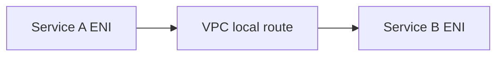

Main concerns:

- DNS/private hosted zone/service discovery;
- SG A egress;
- SG B inbound from SG A;
- app port;
- NACL;
- no public routing required.

### Different VPC via Transit Gateway

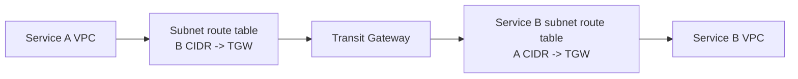

Main concerns:

- TGW attachment associated with correct TGW route table;
- route propagation or static routes;
- return route;
- SG rules allow remote CIDR or managed prefix/SG reference where supported in same VPC only;
- DNS across VPC;
- no CIDR overlap.

### Different VPC via PrivateLink

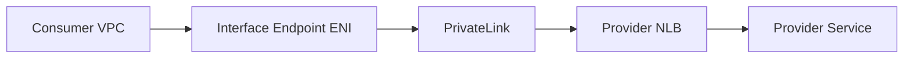

Main concerns:

- consumer connects to endpoint DNS, not provider private IP;
- endpoint SG allows consumer;
- provider endpoint service acceptance/permissions;
- NLB target health;
- provider service SG allows NLB path;
- no full network connectivity required.

This distinction is architectural: TGW connects networks; PrivateLink exposes services.

---

## 20. Packet Path for Hybrid User

Hybrid connectivity adds routing authority and BGP.

Example:

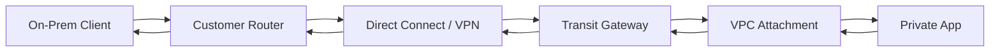

Questions:

- Which prefixes does on-prem advertise to AWS?
- Which prefixes does AWS advertise to on-prem?
- Are routes propagated into the right TGW route tables?
- Are VPC subnet route tables pointing on-prem CIDRs to TGW?
- Is return path symmetric?
- Are SG/NACL/firewall rules allowing on-prem CIDRs?
- Does DNS resolve private names from on-prem through Route 53 Resolver inbound endpoint?
- Is MTU/MSS causing blackhole behavior for large packets?

Hybrid failures often look like application timeouts but are actually route propagation or firewall state problems.

---

## 21. AZ Awareness in Packet Paths

AWS managed services often have AZ-scoped components even when the service feels regional.

Examples:

- subnets are in one AZ;
- NAT Gateway is AZ-specific;
- interface endpoint ENIs are placed in selected subnets/AZs;
- ALB/NLB nodes exist in enabled AZs;
- targets live in specific AZs;
- cross-zone load balancing behavior affects path and cost;
- centralized inspection appliances are often AZ-specific.

Bad pattern:

```mermaid
flowchart LR
    AppA[App in AZ-A]
    NATB[NAT Gateway in AZ-B]
    IGW[Internet Gateway]
    Internet[Internet]

    AppA --> NATB --> IGW --> Internet
```

Why bad:

- cross-AZ data processing cost;
- AZ-B NAT failure affects AZ-A workload;
- latency slightly worse;
- failure domain coupling.

Better:

```mermaid
flowchart LR
    AppA[App AZ-A]
    NATA[NAT AZ-A]
    AppB[App AZ-B]
    NATB[NAT AZ-B]
    IGW[Internet Gateway]

    AppA --> NATA --> IGW
    AppB --> NATB --> IGW
```

Invariant:

> Keep AZ-local traffic local when the service primitive is AZ-scoped and the architecture requires high availability.

---

## 22. Where Packet Thinking Meets Cost

AWS networking cost is not only “monthly service fee”. Packet path determines cost.

Cost dimensions include:

- data transfer out to internet;
- inter-AZ data transfer;
- NAT Gateway hourly and data processing;
- Transit Gateway attachment and data processing;
- PrivateLink endpoint hourly and data processing;
- CloudFront request and data transfer;
- Global Accelerator accelerator and data transfer premium;
- Network Firewall endpoint and data processing;
- VPC Flow Logs ingestion/storage;
- cross-region transfer;
- Direct Connect port and data transfer.

Two architectures can be functionally equivalent but economically very different.

Example:

```txt
Private workload calling S3 through NAT Gateway
```

vs

```txt
Private workload calling S3 through S3 Gateway Endpoint
```

The second can reduce NAT dependency and can improve private access control. That is not just security; it is cost and failure-domain design.

---

## 23. A Production Packet-Path Review Template

Use this before launching any networked workload.

```txt
# Request Path Review

## Entry
[ ] What hostname does client use?
[ ] Is it public or private DNS?
[ ] Which hosted zone owns it?
[ ] What record type and routing policy?
[ ] What is the TTL?

## Edge
[ ] Is CloudFront or Global Accelerator involved?
[ ] Is WAF attached? Where?
[ ] Is TLS terminated at edge, ALB, app, or multiple layers?
[ ] Is origin protected from bypass?

## Load Balancer / Gateway
[ ] ALB/NLB/API Gateway/internal endpoint?
[ ] Listener ports?
[ ] Certificates?
[ ] Target groups?
[ ] Health checks aligned with readiness?

## VPC Path
[ ] Which subnet receives traffic?
[ ] Which route table applies?
[ ] What is the forward route?
[ ] What is the return route?
[ ] Any NAT, TGW, peering, endpoint, firewall, or appliance in path?

## Policy
[ ] Security Group inbound/outbound?
[ ] NACL inbound/outbound including ephemeral ports?
[ ] WAF/firewall/DNS Firewall/endpoint policy?
[ ] IAM/resource policy if AWS service endpoint involved?

## Dependency
[ ] What downstream calls are made?
[ ] Are those private/public/hybrid?
[ ] Timeout and retry budget?
[ ] Circuit breaker or fallback?

## Observability
[ ] Which logs prove DNS, edge, LB, VPC, app, dependency?
[ ] Is request ID propagated?
[ ] Are metrics and alarms placed at each boundary?

## Failure
[ ] What if one AZ fails?
[ ] What if one target group is unhealthy?
[ ] What if origin is slow?
[ ] What if DNS is stale?
[ ] What if NAT/endpoint/firewall fails?
[ ] What if dependency times out?

## Cost
[ ] Any cross-AZ path?
[ ] Any NAT-heavy path?
[ ] Any TGW/Firewall processing path?
[ ] Is CloudFront caching actually effective?
```

---

## 24. The Core Invariant

Every AWS request can be decomposed into this chain:

```txt
Client context
  -> DNS answer
  -> edge/global entry
  -> listener/protocol handshake
  -> L7 routing/security/cache
  -> VPC route
  -> network policy
  -> workload listener
  -> dependency path
  -> response path
```

When something fails, locate the first broken boundary.

Do not randomly open ports.
Do not randomly invalidate cache.
Do not randomly add NAT.
Do not randomly recreate load balancer.

Trace the path.
Find the boundary.
Prove with logs.
Then change the smallest correct thing.

That is how strong engineers debug cloud networking.

---

## 25. What Comes Next

Parts 001–004 gave us the mental model:

- what cloud networking is;
- how AWS global infrastructure shapes failures;
- how OSI/TCP/IP maps to AWS services;
- how a request actually travels through AWS.

Next, Part 005 will go deeper into **control plane vs data plane**, because many AWS networking incidents happen when engineers confuse “configuration accepted” with “traffic behavior changed everywhere”.

---

## References

- AWS Documentation — Amazon VPC: `https://docs.aws.amazon.com/vpc/latest/userguide/what-is-amazon-vpc.html`
- AWS Documentation — Configure route tables: `https://docs.aws.amazon.com/vpc/latest/userguide/VPC_Route_Tables.html`
- AWS Documentation — Internet gateways: `https://docs.aws.amazon.com/vpc/latest/userguide/VPC_Internet_Gateway.html`
- AWS Documentation — NAT gateways: `https://docs.aws.amazon.com/vpc/latest/userguide/vpc-nat-gateway.html`
- AWS Documentation — Elastic Load Balancing: `https://docs.aws.amazon.com/elasticloadbalancing/`
- AWS Documentation — Application Load Balancer: `https://docs.aws.amazon.com/elasticloadbalancing/latest/application/introduction.html`
- AWS Documentation — Network Load Balancer: `https://docs.aws.amazon.com/elasticloadbalancing/latest/network/network-load-balancers.html`
- AWS Documentation — Amazon Route 53: `https://docs.aws.amazon.com/Route53/latest/DeveloperGuide/Welcome.html`
- AWS Documentation — Routing traffic to CloudFront by using Route 53: `https://docs.aws.amazon.com/Route53/latest/DeveloperGuide/routing-to-cloudfront-distribution.html`
- AWS Documentation — Amazon CloudFront: `https://docs.aws.amazon.com/AmazonCloudFront/latest/DeveloperGuide/Introduction.html`
- AWS Documentation — AWS Global Accelerator custom domain routing: `https://docs.aws.amazon.com/global-accelerator/latest/dg/dns-addressing-custom-domains.mapping-your-custom-domain.html`
- AWS Prescriptive Guidance — Network account / inspection VPC reference: `https://docs.aws.amazon.com/prescriptive-guidance/latest/security-reference-architecture/network.html`
