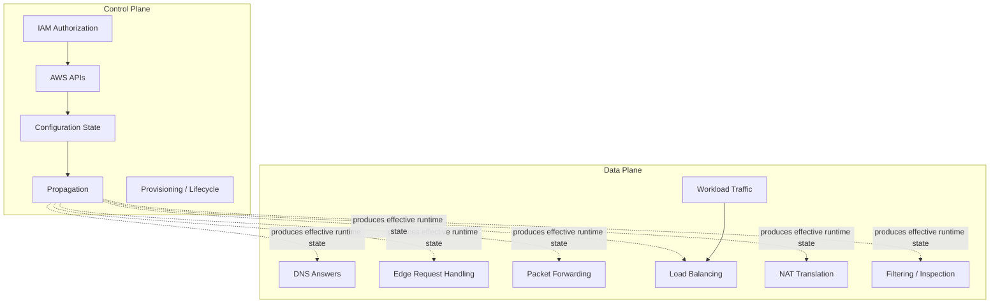
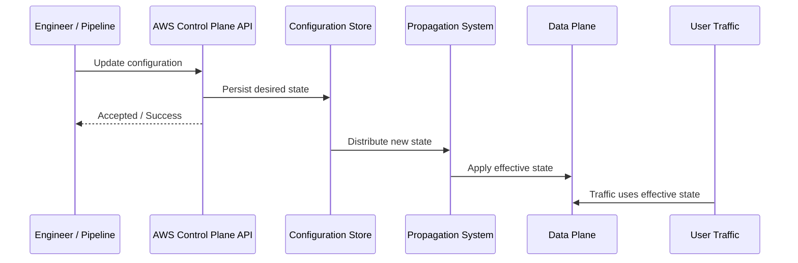
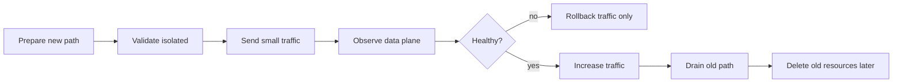
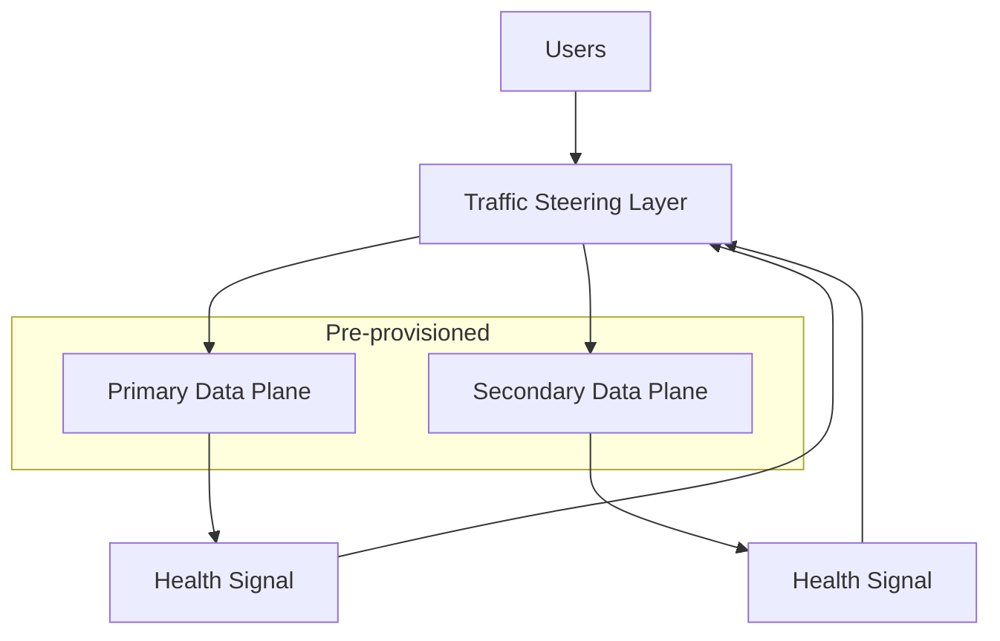
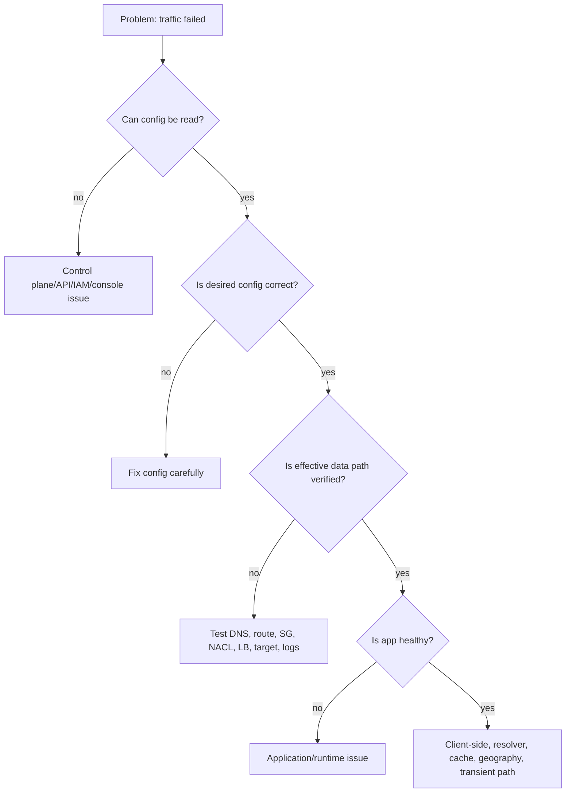

# Part 005 — Control Plane vs Data Plane

Di part sebelumnya kita melihat request sebagai perjalanan packet. Sekarang kita lihat sisi yang lebih berbahaya: **siapa yang mengatur perjalanan itu** dan **siapa yang benar-benar memindahkan traffic**.

Inilah perbedaan **control plane** dan **data plane**.

Banyak desain AWS terlihat benar di diagram, tetapi gagal saat incident karena engineer mencampur dua hal ini:

- “Saya bisa mengubah konfigurasi.”
- “Traffic produksi tetap bisa mengalir.”

Keduanya bukan hal yang sama.

AWS networking harus dibaca sebagai sistem yang memiliki:

1. **Control plane** — API, konfigurasi, provisioning, propagation, lifecycle management.
2. **Data plane** — jalur aktual yang melayani request/packet/connection/query user.

Ketika control plane bermasalah, konfigurasi baru mungkin tidak bisa dibuat. Tetapi data plane lama bisa saja tetap berjalan.

Ketika data plane bermasalah, konfigurasi mungkin tetap bisa diubah. Tetapi user tetap tidak bisa mengakses aplikasi.

Top 1% engineer membedakan keduanya ketika mendesain rollback, failover, deployment, emergency access, dan runbook.

---

## 1. Definisi Praktis

Secara sederhana:

| Plane | Pertanyaan Utama | Contoh |
|---|---|---|
| Control plane | Bagaimana konfigurasi dibuat, diubah, disimpan, dan didistribusikan? | Create VPC, update route table, attach TGW, update CloudFront distribution, create Route 53 record, modify SG rule |
| Data plane | Bagaimana traffic aktual dilayani setelah konfigurasi ada? | Packet melewati route, ALB menerima HTTP request, CloudFront edge melayani object, Route 53 menjawab DNS query, NAT Gateway menerjemahkan source IP |

Analogi router klasik:

- Control plane menghitung dan mendistribusikan routing policy.
- Data plane mem-forward packet berdasarkan forwarding table yang sudah ada.

Di AWS, analogi ini meluas ke hampir semua layanan jaringan.

---

## 2. Kenapa Ini Penting?

Karena availability sebuah workload bukan hanya bergantung pada “resource ada”. Availability bergantung pada **plane mana yang sedang kamu butuhkan pada momen tertentu**.

Contoh:

| Situasi | Yang Dibutuhkan | Risiko |
|---|---|---|
| User mengakses aplikasi yang sudah berjalan | Data plane | Data path, DNS answer, edge POP, LB, route, SG, workload harus sehat |
| Engineer membuat route baru saat incident | Control plane | API harus tersedia, permission benar, propagation selesai |
| Failover manual ke region lain dengan update DNS | Control plane Route 53 + DNS resolver behavior | Update mungkin lambat, TTL/cache masih menahan jawaban lama |
| Failover dengan routing control yang sudah dipersiapkan | Data-plane-oriented failover | Lebih sedikit dependency pada perubahan konfigurasi besar saat incident |
| Deploy CloudFront behavior baru | Control plane CloudFront | Config harus dipropagate ke edge sebelum berlaku |
| CloudFront melayani asset yang sudah cached | Data plane CloudFront | Bisa tetap jalan walau origin/control change sedang bermasalah |

Masalahnya: banyak tim membuat DR plan yang mengandalkan control plane persis saat control plane sedang paling tidak boleh diasumsikan sehat.

---

## 3. Rule Utama: Jangan Rancang Emergency Path yang Butuh Banyak Control Plane Change

Saat incident besar, kamu ingin melakukan operasi yang:

1. Sudah dipersiapkan sebelumnya.
2. Mengubah state sekecil mungkin.
3. Bergantung pada API sesedikit mungkin.
4. Bisa dieksekusi dari terminal/runbook minimal.
5. Tidak butuh rebuild topology.

Anti-pattern:

> “Kalau region utama down, kita akan cepat-cepat create VPC, update route, create ALB, attach TGW, update DNS, create certificate, dan deploy CloudFront distribution baru.”

Itu bukan disaster recovery. Itu berharap control plane, manusia, IAM, pipeline, DNS propagation, certificate validation, dan dependency eksternal semuanya sehat pada saat yang sama.

Pattern yang lebih matang:

> “Region sekunder sudah punya network, DNS, certificate, LB, endpoint, security policy, dan routing control. Saat failover, kita hanya mengubah traffic steering kecil yang sudah diuji.”

---

## 4. Peta Mental: Plane di AWS Networking



Control plane menghasilkan **effective runtime state**.

Data plane memakai state tersebut untuk melayani traffic.

Yang penting: state tidak selalu berlaku instan. Ada propagation, caching, convergence, dan eventual consistency.

---

## 5. Contoh Konkret per Layanan

### 5.1 Amazon VPC

Control plane:

- Membuat VPC.
- Membuat subnet.
- Mengubah route table.
- Attach internet gateway.
- Membuat VPC endpoint.
- Mengubah security group rule.
- Mengubah NACL.

Data plane:

- Packet berjalan di dalam VPC.
- Route dipilih berdasarkan route table yang efektif.
- SG/NACL mengevaluasi traffic.
- NAT Gateway menerjemahkan koneksi keluar.
- Endpoint menerima traffic private ke service.

Hal penting:

> Mengubah route table adalah control-plane operation. Packet forwarding setelah route aktif adalah data-plane behavior.

Saat kamu menambahkan route `0.0.0.0/0 -> nat-gateway`, kamu belum “mengirim traffic”. Kamu hanya mengubah intent. Traffic aktual baru terdampak setelah perubahan efektif.

---

### 5.2 Security Group

Control plane:

- Menambah inbound rule.
- Menghapus outbound rule.
- Referensi SG lain.
- Mengubah description/rule ID.

Data plane:

- Mengevaluasi packet connection terhadap rule efektif.
- Melacak state koneksi.
- Mengizinkan return traffic untuk connection yang sudah established.

Implikasi:

- Jangan jadikan “ubah SG saat incident” sebagai satu-satunya emergency access.
- Perubahan rule biasanya cepat, tetapi tetap control-plane dependency.
- Untuk workload kritikal, access path operasional harus sudah disiapkan dan diuji.

---

### 5.3 Network ACL

Control plane:

- Mengubah numbered rules.
- Associate NACL ke subnet.

Data plane:

- Mengevaluasi packet secara stateless berdasarkan urutan rule.
- Inbound dan outbound harus diizinkan eksplisit.

Implikasi:

- NACL cocok untuk subnet-level guardrail, bukan dynamic operational switch.
- Karena stateless, salah ephemeral port range bisa membuat return traffic gagal walau route dan SG benar.

---

### 5.4 Route 53

Control plane:

- Membuat hosted zone.
- Mengubah record.
- Mengubah routing policy.
- Membuat health check.
- Mengubah private hosted zone association.

Data plane:

- Authoritative DNS menjawab query.
- Resolver/cache di client/ISP/VPC memegang jawaban sesuai TTL dan behavior resolver.
- Health check result memengaruhi jawaban untuk policy tertentu.

Implikasi:

- “Update DNS” bukan failover instan universal.
- TTL rendah membantu, tetapi tidak menghapus semua caching behavior di luar kontrol kamu.
- Untuk failover kritikal, gunakan desain yang sudah mengantisipasi resolver behavior, bukan hanya update record manual.

---

### 5.5 CloudFront

Control plane:

- Membuat/mengubah distribution.
- Mengubah cache behavior.
- Mengubah origin.
- Mengubah function association.
- Invalidation request.

Data plane:

- Edge location menerima viewer request.
- Cache lookup.
- Origin fetch.
- TLS handling.
- Edge function execution.
- Response delivery.

Implikasi:

- Konfigurasi CloudFront perlu propagasi ke edge.
- Asset cached bisa tetap dilayani walau origin bermasalah, tergantung TTL/error caching/config.
- Invalidation adalah control-plane action; bukan strategi utama untuk semua deployment. Untuk asset statis, content-addressed versioning lebih kuat.

---

### 5.6 Elastic Load Balancing

Control plane:

- Membuat ALB/NLB/GWLB.
- Mengubah listener.
- Mengubah rule.
- Register/deregister target.
- Mengubah target group health check.

Data plane:

- Menerima connection/request.
- Memilih target sehat.
- Menjaga connection state.
- TLS termination/passthrough tergantung tipe dan konfigurasi.

Implikasi:

- Health check adalah jembatan control/data: konfigurasinya control plane, hasilnya memengaruhi data plane.
- Mengubah listener rule saat incident adalah control-plane dependency.
- Target deregistration dan draining harus dipahami sebagai perilaku data-plane connection lifecycle.

---

### 5.7 Transit Gateway

Control plane:

- Membuat TGW.
- Membuat attachment.
- Mengasosiasikan attachment ke route table.
- Mengaktifkan propagation.
- Menambah static route.

Data plane:

- Packet antar attachment diteruskan berdasarkan TGW route table efektif.
- Segmentation terjadi berdasarkan association/propagation route domain.

Implikasi:

- TGW bukan “router tunggal ajaib”. Ia punya route domain.
- Salah association/propagation bisa membuat environment bocor atau terisolasi.
- Centralized inspection butuh data-path symmetry, terutama kalau ada stateful appliance.

---

### 5.8 AWS PrivateLink

Control plane:

- Membuat endpoint service.
- Mengizinkan principal consumer.
- Membuat interface endpoint.
- Mengaktifkan private DNS.
- Mengatur endpoint policy.

Data plane:

- Consumer mengakses service lewat private IP ENI endpoint di VPC consumer.
- Traffic tidak membutuhkan peering full mesh.
- Provider tidak melihat route langsung ke CIDR consumer seperti peering/TGW.

Implikasi:

- PrivateLink adalah service exposure pattern, bukan network merge pattern.
- Sangat berguna untuk menghindari CIDR overlap dan mengurangi blast radius.
- Debugging harus fokus pada DNS, endpoint ENI, SG, NLB/provider health, endpoint policy, dan acceptance state.

---

### 5.9 VPC Lattice

Control plane:

- Membuat service network.
- Mendaftarkan service.
- Menghubungkan VPC/account.
- Membuat auth policy.
- Mengatur listener/rule/target group.

Data plane:

- Service-to-service request diteruskan via Lattice-managed application networking layer.
- Policy dan observability diterapkan di level service access, bukan hanya subnet/routing.

Implikasi:

- Lattice menggeser sebagian problem dari network connectivity menjadi application-networking contract.
- Cocok ketika kebutuhan utamanya adalah menghubungkan, mengamankan, dan memonitor service antar VPC/account tanpa membangun full mesh routing.

---

## 6. Propagation: Jembatan yang Sering Dilupakan

Banyak resource AWS memiliki fase:



Kata “success” dari API sering berarti:

> Desired state diterima.

Bukan selalu berarti:

> Semua data plane node di semua lokasi sudah memakai state baru.

Contoh yang harus kamu waspadai:

- CloudFront distribution update perlu propagasi global.
- DNS record update harus melewati TTL/cache resolver.
- TGW route propagation bisa memengaruhi route domain setelah state efektif.
- Security group rule update perlu menjadi effective rule di enforcement layer.
- Load balancer target registration butuh health check sukses sebelum traffic dikirim.

---

## 7. Eventual Consistency di Networking

Distributed system tidak hanya terjadi di aplikasi. AWS networking sendiri adalah distributed system.

Karena itu ada kondisi sementara:

| Kondisi | Contoh |
|---|---|
| Desired state sudah berubah, effective state belum | Route baru sudah terlihat di API, tetapi traffic masih mengikuti path lama sesaat |
| Sebagian edge sudah update, sebagian belum | CloudFront behavior belum seragam di semua edge selama propagation |
| DNS authoritative sudah berubah, resolver masih cache lama | User tertentu masih menuju endpoint lama |
| Target sudah registered, belum healthy | ALB/NLB belum mengirim traffic |
| Resource dibuat, dependency belum siap | Interface endpoint ada, tetapi private DNS/SG/provider acceptance belum benar |

Cara berpikir yang benar:

> AWS API response adalah sinyal lifecycle. Traffic behavior harus diverifikasi dari data plane.

---

## 8. Deployment Implication

Setiap perubahan networking harus diklasifikasikan:

| Tipe Perubahan | Risiko | Contoh | Strategi Aman |
|---|---|---|---|
| Additive | Relatif rendah | Tambah route spesifik baru, tambah SG rule baru | Deploy, observe, baru cutover |
| Replacement | Menengah/tinggi | Ganti target NAT, ganti origin, ganti LB target | Blue/green, canary, rollback path |
| Deletion | Tinggi | Hapus route lama, hapus SG rule, hapus endpoint | Delay deletion, verify no traffic, staged removal |
| Global propagation | Tinggi | CloudFront distribution, DNS global record | Versioning, low TTL planning, monitoring by geography |
| Route-domain change | Sangat tinggi | TGW association/propagation, inspection insertion | Precomputed route table diff, lab validation |

Engineering yang matang jarang melakukan perubahan “replace langsung”. Mereka membuat perubahan **additive**, memverifikasi data plane, lalu menghapus jalur lama setelah aman.

---

## 9. Failover: Control-Plane Failover vs Data-Plane Failover

Ada dua gaya failover.

### 9.1 Control-Plane Failover

Failover dilakukan dengan membuat/mengubah resource saat incident.

Contoh:

- Update DNS record manual.
- Modify ALB listener rule.
- Change TGW route table.
- Create VPC endpoint baru.
- Attach new target group.

Kelebihan:

- Fleksibel.
- Lebih murah jika standby belum lengkap.
- Cocok untuk sistem non-kritikal.

Kelemahan:

- Bergantung pada API availability.
- Bergantung pada IAM/session/tooling/pipeline.
- Rentan human error.
- Propagation bisa membuat RTO tidak deterministik.

### 9.2 Data-Plane-Oriented Failover

Failover sudah dirancang sebagai jalur runtime yang tinggal diarahkan lewat mekanisme kecil dan teruji.

Contoh:

- Multi-origin CloudFront dengan origin failover.
- Route 53 health-check based failover yang sudah dibuat.
- Global Accelerator endpoint group dengan health check.
- Active/active ALB targets across AZ.
- Multi-AZ NLB/ALB dengan target health.
- Pre-provisioned secondary region dengan DNS/routing control siap.

Kelebihan:

- RTO lebih terukur.
- Lebih sedikit perubahan saat incident.
- Lebih mudah diuji rutin.

Kelemahan:

- Lebih mahal.
- Desain awal lebih kompleks.
- Membutuhkan disiplin deployment dan data consistency.

Kesimpulan:

> Untuk sistem kritikal, failover sebaiknya adalah perilaku data plane yang sudah disiapkan, bukan improvisasi control plane.

---

## 10. Runbook yang Salah vs Runbook yang Benar

### Runbook yang Salah

```mdx
Ketika aplikasi tidak bisa diakses:
1. Coba update security group.
2. Coba ganti route table.
3. Coba recreate load balancer.
4. Coba invalidate CloudFront.
5. Coba restart instance.
```

Ini bukan runbook. Ini daftar percobaan.

### Runbook yang Benar

```mdx
Ketika aplikasi tidak bisa diakses:
1. Tentukan failure ada di DNS, edge, LB, route, policy, target, atau app.
2. Verifikasi data plane tanpa mengubah konfigurasi.
3. Jika data plane salah karena konfigurasi, cek effective state dan propagation.
4. Jalankan perubahan additive yang sudah disiapkan.
5. Verifikasi traffic dari beberapa vantage point.
6. Baru lakukan cleanup setelah traffic stabil.
```

Urutan yang matang selalu diawali diagnosis data plane, bukan langsung mengubah control plane.

---

## 11. Debugging Matrix: Control Plane atau Data Plane?

| Gejala | Kemungkinan Plane | Cara Verifikasi |
|---|---|---|
| AWS API gagal create/update resource | Control plane | CloudTrail, AWS Health, IAM, service quota, API error |
| Config terlihat benar, traffic timeout | Data plane/policy/routing | Reachability Analyzer, Flow Logs, LB logs, packet test |
| DNS record sudah berubah, user masih ke IP lama | Data plane DNS/cache | `dig` ke authoritative resolver vs recursive resolver, cek TTL |
| ALB listener rule sudah dibuat, request belum match | Propagation/config/data plane | ALB access logs, rule priority, host/path/header test |
| Target registered tetapi tidak menerima traffic | Data plane health gate | Target health reason, SG/NACL, app health endpoint |
| TGW route table benar tetapi flow gagal | Data plane path symmetry/policy | TGW route table, VPC route table, SG/NACL, appliance state |
| CloudFront config update belum efektif | Propagation | Distribution status, test from different regions, logs |
| PrivateLink endpoint created tapi DNS tidak resolve private | Control/data boundary DNS | Private DNS enabled, hosted zone conflict, resolver path |

---

## 12. Operational Invariant

Gunakan invariant berikut saat desain:

### Invariant 1 — Existing traffic must not require control-plane availability

Jika aplikasi sudah berjalan, traffic user seharusnya tidak membutuhkan engineer melakukan API call untuk tetap berjalan.

### Invariant 2 — Emergency path must be pre-provisioned

Jalur darurat yang baru dibuat saat incident adalah jalur yang belum benar-benar kamu miliki.

### Invariant 3 — Propagation is part of the design

Kalau desain tidak menyebut propagation, desain itu belum lengkap.

### Invariant 4 — DNS is not a wire

DNS adalah naming dan traffic steering layer dengan cache. Jangan memperlakukannya seperti switch instan.

### Invariant 5 — Health check is a control signal, not business truth

Health check hanya tahu endpoint menjawab sesuai definisinya. Ia tidak otomatis tahu bisnis kamu sehat.

### Invariant 6 — Data-plane verification beats configuration inspection

Melihat route table/SG/LB config penting, tetapi bukti terakhir adalah traffic aktual.

---

## 13. Design Pattern: Prepare, Then Switch

Untuk perubahan jaringan besar, gunakan pola ini:



Contoh penerapan:

- CloudFront origin migration: tambah origin baru → behavior/canary → observe → cutover → cleanup.
- NAT migration: buat NAT baru per AZ → route subset subnet → observe → route semua → hapus lama.
- TGW inspection insertion: buat route domain baru → attach test VPC → verify symmetry → migrate VPC per group.
- DNS migration: turunkan TTL jauh sebelum cutover → publish parallel endpoint → canary hostnames → switch alias/weighted → monitor.

---

## 14. Design Pattern: Data-Plane First Failover

Untuk sistem dengan RTO ketat, desain failover seperti ini:



Yang harus sudah ada sebelum incident:

- Secondary VPC/subnet/routing.
- Secondary LB/target/origin.
- Certificates.
- DNS records/routing controls.
- Security policy.
- Observability.
- Runbook.
- Test traffic.

Yang dilakukan saat incident:

- Mengubah steering kecil atau membiarkan health check melakukan failover.
- Tidak membangun ulang topology.

---

## 15. CloudFront, Route 53, Global Accelerator: Plane Differences

Ketiganya bisa memengaruhi traffic global, tetapi behavior-nya berbeda.

| Service | Control Plane | Data Plane | Failover Character |
|---|---|---|---|
| Route 53 | Hosted zone, records, policy, health check config | Authoritative DNS answer | Tergantung DNS TTL/cache dan resolver behavior |
| CloudFront | Distribution config, cache behavior, origin config | Edge HTTP(S) request/cache/origin fetch | Bisa cache/edge-serve; origin failover di L7 |
| Global Accelerator | Accelerator/listener/endpoint group config | Anycast network routing to healthy endpoint | Steering di AWS global network, bukan DNS TTL-based untuk client |

Jangan pilih berdasarkan “semua bisa global”. Pilih berdasarkan plane dan failure semantics:

- Butuh CDN/cache/TLS edge/object delivery? CloudFront.
- Butuh DNS-level routing lintas endpoint? Route 53.
- Butuh static anycast IP dan traffic steering non-cache ke regional endpoint? Global Accelerator.

---

## 16. Production Checklist Sebelum Mengubah Network Control Plane

Sebelum merge/deploy perubahan networking, jawab ini:

1. Perubahan ini additive, replacement, atau deletion?
2. Plane apa yang berubah: control plane config atau data plane path?
3. Apa propagation path-nya?
4. Apa observability signal untuk membuktikan effective state?
5. Apakah rollback hanya butuh traffic switch kecil atau butuh recreate resource?
6. Apakah ada route asymmetry?
7. Apakah stateful device dilibatkan?
8. Apakah DNS cache/TTL berpengaruh?
9. Apakah SG/NACL/endpoint policy/resource policy semuanya konsisten?
10. Apakah perubahan bisa diuji pada satu AZ/account/VPC/subset user dulu?
11. Apakah ada quota yang bisa membuat rollback/deploy gagal?
12. Apakah ada dependency lintas account/region yang tidak dimiliki tim?

Kalau jawabannya belum jelas, jangan deploy ke production.

---

## 17. Failure Case: “Route Sudah Diubah, Tapi Traffic Masih Gagal”

Misalnya private subnet ingin akses internet lewat NAT Gateway.

Control plane terlihat benar:

```txt
0.0.0.0/0 -> nat-abc123
```

Tetapi traffic tetap timeout.

Kemungkinan masalah data plane:

1. NAT Gateway berada di subnet yang tidak punya route ke IGW.
2. NAT Gateway berada di AZ berbeda dan AZ path sedang bermasalah/costly.
3. SG outbound di workload menolak traffic.
4. NACL subnet workload menolak outbound ephemeral/return path.
5. NACL subnet NAT menolak traffic.
6. Destination menolak source IP NAT.
7. DNS resolve ke IPv6 tetapi hanya IPv4 path yang siap.
8. Route lebih spesifik mengalahkan default route.
9. Instance tidak benar-benar memakai subnet/route table yang kamu lihat.

Pelajaran:

> Route table adalah satu decision point, bukan seluruh network behavior.

---

## 18. Failure Case: “DNS Sudah Failover, Tapi Sebagian User Masih ke Region Lama”

Kemungkinan:

1. Recursive resolver masih cache jawaban lama.
2. Client/app melakukan DNS caching internal.
3. Browser/OS/cache library menahan record.
4. TTL sebelumnya terlalu tinggi.
5. Ada CNAME chain dengan TTL berbeda.
6. Health check belum berubah state.
7. Failover record salah policy.
8. User memakai resolver yang tidak refresh sesuai ekspektasi.

Pelajaran:

> DNS failover adalah probabilistic convergence, bukan packet-level reroute instan.

---

## 19. Failure Case: “CloudFront Sudah Diupdate, Tapi Behavior Berbeda per Lokasi”

Kemungkinan:

1. Distribution config belum selesai propagated.
2. Edge cache masih menyimpan object lama.
3. Cache key tidak memasukkan header/query/cookie yang dibutuhkan.
4. Origin request policy tidak meneruskan data yang dibutuhkan origin.
5. Viewer request function berbeda dari ekspektasi.
6. Test dilakukan dari edge location berbeda.
7. Error cache TTL membuat error lama tetap tersaji.

Pelajaran:

> CloudFront adalah distributed edge data plane. Deployment harus menganggap edge propagation dan cache semantics sebagai bagian dari sistem.

---

## 20. Failure Case: “PrivateLink Endpoint Ada, Tapi Service Tidak Bisa Diakses”

Cek urutan:

1. DNS name resolve ke private endpoint IP?
2. Private DNS enabled atau memakai endpoint-specific DNS name?
3. Endpoint ENI security group mengizinkan inbound dari client?
4. Client SG outbound mengizinkan?
5. Endpoint policy mengizinkan action/resource?
6. Provider endpoint service sudah accepted?
7. Provider NLB target healthy?
8. Provider app mengizinkan Host/SNI/protocol yang digunakan?
9. Cross-account principal benar?
10. Ada conflict private hosted zone?

Pelajaran:

> PrivateLink tidak membuat dua VPC menjadi satu network. Ia mengekspos service lewat endpoint private dengan DNS, policy, dan provider health sendiri.

---

## 21. Latihan Mental Model

Untuk setiap perubahan networking, pakai format ini:

```mdx
Change:
- Apa desired state baru?

Control plane:
- API/resource apa yang berubah?
- Siapa owner-nya?
- Apa quota/permission/dependency-nya?

Propagation:
- State baru harus menyebar ke mana?
- Berapa lama convergence yang wajar?

Data plane:
- Packet/request/query aktual melewati path apa?
- Policy apa yang mengevaluasi traffic?
- Apakah ada NAT/proxy/LB/cache?

Rollback:
- Apa rollback path paling kecil?
- Apakah rollback butuh control-plane change besar?

Observability:
- Signal apa yang membuktikan berhasil?
- Signal apa yang membuktikan gagal?
```

Ini tampak sederhana, tetapi memaksa desain keluar dari asumsi kabur.

---

## 22. Diagram: Debugging Berdasarkan Plane



Urutannya penting: jangan mengubah config sebelum tahu apakah config memang salah.

---

## 23. Kaitan dengan Part Berikutnya

Part ini memberi fondasi untuk Part 006: **Networking Decision Framework**.

Kita akan memilih layanan bukan berdasarkan nama, tetapi berdasarkan pertanyaan:

- Apakah kita butuh network merge atau service exposure?
- Apakah routing harus transitive?
- Apakah CIDR bisa overlap?
- Apakah traffic L3/L4 atau L7?
- Apakah failover harus DNS-based, edge-based, anycast-based, atau health-gated load balancing?
- Apakah perubahan saat incident harus control-plane-heavy atau data-plane-ready?

---

## 24. Ringkasan

Control plane dan data plane adalah salah satu konsep paling penting dalam AWS networking.

Kalau kamu mengabaikannya, desain kamu akan terlihat bagus di diagram tetapi rapuh saat incident.

Intinya:

- Control plane mengelola konfigurasi dan lifecycle.
- Data plane melayani traffic aktual.
- API success bukan bukti traffic success.
- Propagation adalah bagian dari desain.
- Emergency path harus pre-provisioned.
- Failover kritikal sebaiknya tidak bergantung pada banyak perubahan control plane mendadak.
- Debugging harus membedakan config state, effective state, dan observed traffic.

Di level produksi, pertanyaan yang harus selalu muncul adalah:

> Saat sistem rusak, plane mana yang masih bisa saya percaya?

Kalau kamu bisa menjawab itu, kamu sudah berpikir seperti network/system engineer, bukan sekadar pengguna console AWS.

---

## References

- AWS Fault Isolation Boundaries — Control planes and data planes: https://docs.aws.amazon.com/whitepapers/latest/aws-fault-isolation-boundaries/control-planes-and-data-planes.html
- AWS Fault Isolation Boundaries: https://docs.aws.amazon.com/whitepapers/latest/aws-fault-isolation-boundaries/abstract-and-introduction.html
- Amazon VPC route tables: https://docs.aws.amazon.com/vpc/latest/userguide/VPC_Route_Tables.html
- Amazon VPC route priority: https://docs.aws.amazon.com/vpc/latest/userguide/route-tables-priority.html
- AWS Transit Gateway route tables: https://docs.aws.amazon.com/vpc/latest/tgw/tgw-route-tables.html
- Amazon VPC Lattice: https://docs.aws.amazon.com/vpc-lattice/latest/ug/what-is-vpc-lattice.html
